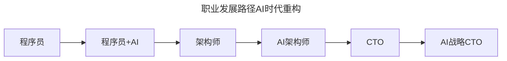

# 第125讲 | 洪强宁：从程序员到架构师，从架构师到CTO（一）

> **适用范围**：程序员、架构师、CTO及各阶段技术管理者，尤其是希望在AI时代规划职业发展路径、完成"程序员→架构师→CTO"跃迁的技术从业者。
>
> **更新摘要（v2 · 2026-08 更新）**：
> - 结构化升级为 6 节骨架（导言 / 核心方法论 / 关键流程 / 工具与实战 / 常见误区 / 进阶延展）
> - 将"程序员→架构师→CTO"路径升级为AI时代版本，新增"AI架构师"和"AI战略CTO"里程碑
> - 补充优秀程序员"五精"特质和架构师四大能力的AI时代升级
> - 保留全部Mermaid图、能力对照表与职业路径图

---

## 1. 导言

我们知道，技术人最典型的一条职业发展路径，就是由程序员，到架构师，再到CTO。那是不是技术人的职业通道就只有这一条呢？并不是，因为程序员、架构师和CTO，这是三个职业，每个职业都可以单独发展，不断深入与精进。而从程序员到架构师，再到CTO，主要差异在于看问题的层级和着眼点不同。

对于程序员来说，他们最关注的是技术中的细节处理，看到更多的是代码、模块这个层级。当程序员的着眼点从这个层级提升到关注系统与协作时，他们就变成了架构师的角色。当架构师的着眼点再往上提升，关注更多的就是业务实现与战略发展，这时角色就变成了CTO。

**职业发展的过程，就是眼界不断提高的过程。**

2026年，GPT-5.5多模态大模型成熟商用、DeepSeek V4开源模型性能比肩闭源方案、Stack Overflow调查84%开发者日常使用AI编程工具、Agent智能体进入加速落地期。洪强宁老师描述的"程序员→架构师→CTO"路径在AI时代需要加入新的里程碑——"AI架构师"和"AI战略CTO"。

---

## 2. 核心方法论

### 2.1 优秀程序员的"五精"特质

**1.精细，在细节之处深思熟虑**。代码结构、变量命名、作用域、封装、类的关系等细节，在写代码时就应该仔细衡量，因为它将影响代码后续的可读性与可维护性。

**2.精湛，写出漂亮的代码**。工程师还需要有一定的美感，分辨一个设计是否简洁、优雅、高效。

**3.精通，了解上下游知识**。除了关注自己写的代码与模块，还需要对上下游的知识有所了解。

**4.精深，掌握技术细节**。包括语言细节、类库细节、算法细节、运行环境细节等。

**5.精明，做到准确交付**。不仅需要优雅、高效的实现需求，还需要在准确的时间内，交付符合质量的内容。

**AI时代升级**：

| 特质 | 传统定义 | 2026年新增要求 |
|-----|---------|--------------|
| **精细** | 代码细节深思熟虑 | +审查AI生成代码的质量 |
| **精湛** | 写出漂亮代码 | +编写高质量的Prompt |
| **精通** | 了解上下游知识 | +了解AI工具链和Agent生态 |
| **精深** | 掌握技术细节 | +掌握LLM原理和边界 |
| **精明** | 准确交付 | +人机协作下的准确交付 |

### 2.2 优秀架构师的四大能力

**1.取舍**：一个架构总是有优有劣，不会是完美的、普适的。需要根据具体的业务需求来调整架构，衡量好需求和资源、效率和安全、时延和吞吐等等之间的关系。

**2.前瞻**：架构的调整周期比较长，可能需要数月甚至上年。在设计架构时需要具备前瞻意识，对很多不确定的事情做出预判。

**3.抽象**：不能胡子眉毛一把抓，要做好分层和区隔。把组件的角色定义下来之后，再分块来思考，考虑复用的问题。

**4.容错**：系统复杂了，出错的几率也增加了，需要为错误而设计，事先做好解决方案。备份不做，日子甭过。

**AI时代升级**：
- **取舍**：新增AI成本效益分析（自建AI vs 调用API、大模型 vs 小模型、实时推理 vs 批量处理）
- **前瞻**：新增AI趋势预判（多模态AI成熟时间表、Agent生态发展趋势、开源vs闭源竞争格局）
- **抽象**：新增AI模块化层次（表现层→业务层→AI服务层→模型层→数据层→基础设施层）
- **容错**：新增AI可靠性（AI API调用失败降级、AI输出质量兜底、模型漂移监控）

### 2.3 从架构师到CTO的关键变化

从架构师成为CTO之后，工作中最大的变化是**从一个需求实现方变为了需求提出方**。之前是老板提出需求后思考用什么技术和架构来实现，现在更多考虑的是用什么技术才能发展业务。

> "CTO就是要把CEO吹的牛含泪也要实现的那个人。我觉得不对，CTO其实是帮着CEO一起去吹靠谱牛的人，他是CEO的一部分。"

**AI时代升级**：

| 维度 | 架构师视角 | AI时代CTO视角 |
|-----|----------|--------------|
| **技术关注** | 这个功能怎么实现？ | 这个功能AI能帮我们做得更好吗？ |
| **团队关注** | 团队能不能按时交付？ | 团队的AI协作效率如何提升？ |
| **产品关注** | 技术上能不能做？ | AI能不能创造全新的产品体验？ |
| **竞争关注** | 对方用了什么技术？ | 对方的AI策略是什么？我们如何差异化？ |

---

## 3. 关键流程

### 3.1 职业发展路径的AI时代重构

上图展示了职业发展路径在AI时代的重构：从程序员到程序员+AI，再到架构师、AI架构师、CTO，最终到AI战略CTO。新增了"AI架构师"和"AI战略CTO"两个里程碑。

### 3.2 职业跃迁关键节点

| 阶段 | 传统定义 | 2026 AI增强定义 |
|-----|---------|----------------|
| **程序员** | 写代码实现功能 | 人机协作编写代码 + 审核AI输出 |
| **架构师** | 设计系统架构 | 设计包含AI能力的系统架构 |
| **AI架构师**（新增） | — | 设计AI Agent编排、RAG系统、模型选型 |
| **CTO** | 业务+技术决策 | 业务+技术+AI战略决策 |
| **AI战略CTO**（新增） | — | AI驱动的商业模式创新+组织变革 |

### 3.3 架构师解决的Scale问题

架构师主要在解决Scalability的问题，包括两个方面：

**人的Scale**：业务需求变复杂后，单人不足以承担，需要多人协作。如何分解业务、如何将分解后的业务匹配合适的人、如何协作。

**量的Scale**：当QPS从几十个增加到成千上万个甚至几十万个的时候，面对这种情况该怎么办。

当你从实现一个具体的功能，到考虑解决Scale问题的时候，你就已经开始走上了架构师这条路。

---

## 4. 工具与实战

### 4.1 优秀CTO的四维关注

一名优秀的CTO应该关注多个方面：
1. **关注业务**：知道用户需求，以及能够给用户带来什么样的服务质量和价值
2. **关注行业**：了解竞争对手和新技术，新技术对自己而言是不是意味着新机遇
3. **关注机遇**：了解有哪些需求还没有被满足，新技术能够带来哪些可能性
4. **关注增长**：能预见到业务的增长并提前应对，发现增长的瓶颈并及时解决

### 4.2 CTO要不要写代码

"CTO最好不要写业务代码，因为如果你没能及时提交，几乎没有人敢催，而这会影响项目的交付，成为瓶颈。如果你想保持对技术的敏感度和创造力，你可以写写效率工具，写写分析型的代码等。"

### 4.3 给2026年技术人的建议

**如果你是程序员**：
- 立即开始使用AI编程工具（Cursor/Copilot）
- 学习Prompt Engineering基础
- 关注AI对你所在领域的影响

**如果你是架构师**：
- 学习RAG、Agent、Fine-tuning等AI架构模式
- 评估现有系统的AI增强可能性
- 开始设计包含AI能力的新架构

**如果你是CTO/技术管理者**：
- 制定个人和团队的AI能力提升计划
- 与CEO对齐AI战略方向
- 建立"人机协作"的组织文化

### 4.4 优秀CTO能力的AI时代清单

- [ ] AI战略规划能力：能制定公司的AI路线图
- [ ] AI团队能力建设：知道如何培养团队的AI技能
- [ ] AI伦理与合规意识：了解AI应用的法律边界
- [ ] AI商业价值转化：能将AI能力转化为商业成果

---

## 5. 常见误区

### 5.1 会写代码就能成为优秀程序员

只要会写代码就能成为一个优秀的程序员吗？答案是否定的。成为一个优秀的程序员，需要"五精"特质——精细、精湛、精通、精深、精明。

### 5.2 做到"五精"就能成为架构师

即使一个程序员做到了"五精"，把"五精"做得再好，他的个人能力也是有上限的，他所实现的系统的复杂度也是有上限的，而业务的发展会远远超出个人的能力。从程序员到架构师，不在于title如何，而是当着眼点更上一个层级时。

### 5.3 AI时代忽视AI架构能力

在AI时代，如果架构师不学习RAG、Agent、Fine-tuning等AI架构模式，不评估现有系统的AI增强可能性，就无法设计包含AI能力的新架构，会被时代淘汰。

### 5.4 CTO只关注技术实现

从架构师到CTO的关键变化是从需求实现方变为需求提出方。如果CTO只关注技术实现而不关注业务、行业、机遇和增长，就无法胜任CTO角色。

### 5.5 为了用AI而用AI

> ⭐2026黄金法则：**不要为了用AI而用AI——如果传统方法能以更低成本达到90%的效果，先用传统方法。**

---

## 6. 进阶延展

### 6.1 技术发展的十年里程碑

洪强宁以十年为一个节点，回顾了近三十年技术圈里发生的重要事件：
- 约1986年：互联网正式商用，进入互联互通时代
- 1995年：Web出现
- 2007年：Google发表分布式系统论文、亚马逊发布AWS、苹果发布iPhone
- 2016年：AlphaGo战胜李世乭，进入人工智能与大数据时代
- 2026年：Agent加速落地期，AI-Native组织涌现

### 6.2 CTO是组织的架构师

CTO也是组织的架构师，需要考虑怎样搭建团队、怎样分解业务，才能够更好地完成战略需求。而对于战略，也需要CTO做出优先级判断和取舍。CTO还需要发现并解决组织级的系统瓶颈，这和架构师做的事情是一样的。

### 6.3 作者简介

洪强宁，爱因互动CTO，TGO鲲鹏会会员，资深Python程序员，曾任豆瓣网首席架构师与宜信大数据创新中心首席架构师，编程30余年，拥有11年互联网从业经验。

### 6.4 职业发展的本质

职业发展的过程，就是眼界不断提高的过程。对于程序员而言，从写代码到关注代码与代码之间的关系，再到关注代码与系统之间的关系，这时他就开始承担了架构师的职责。架构师主要在做系统的事情，着眼点会从系统与系统之间的关系到系统与业务之间的关系，这时他开始承担一些CTO的职责。而对于CTO而言，他关注的是业务，然后逐渐关心业务与业务之间的关系，最后关心业务与战略方向的关系。

---

*本文档基于2026年8月的技术环境编写，随着AI技术的快速发展，部分具体工具和建议可能需要定期更新。*
