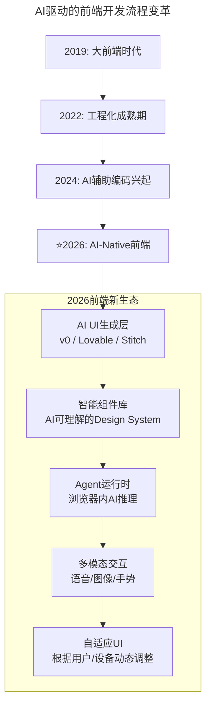
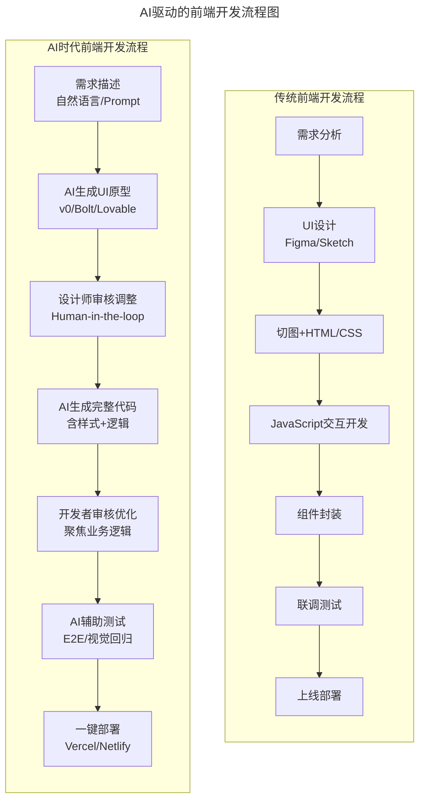
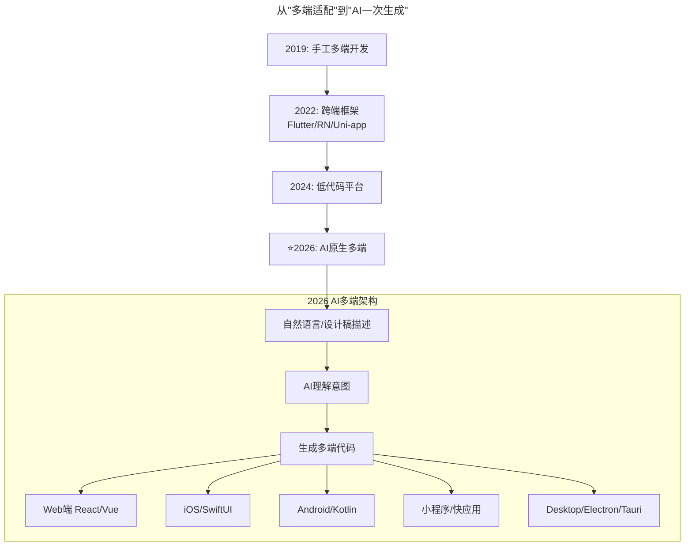
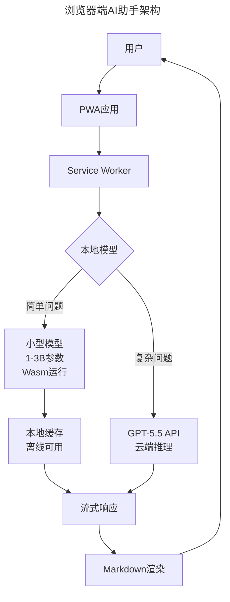

# 第184讲 | 狼叔：2019年前端和Node的未来—大前端篇

> **适用范围**：前端架构师、技术管理者及需要制定AI时代前端技术战略的领导者；同样适用于希望理解前端AI化变革（AI生成UI、TS+AI、Wasm+AI推理）的从业者。
>
> **更新摘要（v2 · 2026-08 更新）**：
> - 结构化升级为 6 节骨架（导言 / 核心方法论 / 关键流程 / 工具与实战 / 常见误区 / 进阶延展）
> - 将狼叔2019年的大前端趋势预判升级为AI-Native前端视角：框架标准化→AI工具链标准化、PWA→AI应用默认形态
> - 补充2026年AI UI生成工具对比、TypeScript+AI协同效应、WebAssembly端侧AI推理实践
> - 保留全部Mermaid图、技术演进对比表与行动建议

---

## 1. 导言

我其实特别反感很多人说"前端娱乐圈"这种话，诚然，爆发式增长必然会带来焦点，但也不必过度解读。学会辩证地看问题，用心去体味背后的趋势，我想这比所谓的"正直"更有价值，我更希望大家能够坚持学习，保持思辨和平和。

2018年的前端生态：React v16普及，jQuery被GitHub下掉完成阶段性历史使命，Angular发布v6和v7。三大框架写法越来越像，越来越贴近WebComponents标准。小程序是当年最火的技术，PWA进入稳定期，TypeScript全面开花，GraphQL蠢蠢欲动，WebAssembly打开了浏览器上多语言的大门。所有这一切都在暗示，浏览器即操作系统。

狼叔在2019年的几个关键判断在2026年均已验证或进化：

1. ✅ **三大框架标准化** → 2026年不仅是框架标准化，更是**AI工具链标准化**
2. ✅ **应用层封装爆发期** → 2026年是**AI封装爆发期**（v0、bolt.new、lovable等）
3. ✅ **PWA稳定发展** → 2026年PWA成为**AI应用的默认形态**
4. ✅ **TypeScript落地良好** → 2026年TS+AI=**类型安全的AI辅助开发**
5. ✅ **浏览器即操作系统** → 2026年**浏览器即AI运行环境**

### 2019 vs 2026 前端技术演进对比

| 维度 | 2019年预测 | ⭐2026年现实 |
|------|-----------|-------------|
| **框架格局** | 三大框架标准化→Web Components | **AI-Native框架涌现（v0/Lovable等）** |
| **开发范式** | 组件化/工程化 | **自然语言编程 + AI生成UI** |
| **TypeScript** | 全面开花，包容性好 | **TS + AI类型推断 = 超强生产力** |
| **WebAssembly** | 浏览器多语言运行时 | **Wasm + AI模型推理（端侧AI）** |
| **PWA** | 进入稳定期，桌面版兴起 | **PWA + AI Assistant = 智能应用** |
| **跨端方案** | Flutter/Weex/RN三足鼎立 | **AI生成多端代码（一次描述，多端运行）** |

---

## 2. 核心方法论

### 2.1 三大框架标准化 → AI工具链标准化

前端三大框架已趋于平稳化、标准化，未来是WebComponents的。从React v16增加Fiber和Hooks，到Vue 3.0发布，最终都是朝着W3C WebComponents标准走。Follow标准是趋势，如果能够引领标准，那将是框架的无上荣耀。

参考技术成熟度曲线（Hype Cycle），从前端的热度来看，应该是处于从第三阶段【泡沫化的底谷期】到第四阶段【稳步爬升的光明期】的爬坡过程。

**⭐2026升级**：框架战争结束，AI工具战争开始——不再是Vue vs React，而是**v0 vs Cursor vs Lovable**的竞争。

### 2.2 应用层封装 → AI封装爆发期

框架和工程化基本探索稳定后，大家就开始思考如何更好的用、更简单的用。Umi就是典型代表——零配置、开箱即用、约定大于配置。

**⭐2026升级**：2026年是AI封装爆发期，主流AI UI生成工具：

| 工具 | 特点 | 适用场景 | ⭐使用率 |
|------|------|---------|---------|
| **Vercel v0** | 自然语言→React代码 | 快速原型、内部工具 | **78%** |
| **Lovable** | 对话式全栈应用生成 | MVP、Side Project | **45%** |
| **Google Stitch**（原Galileo AI） | 设计稿→代码 | 设计师协作 | **32%** |
| **Cursor + UI插件** | IDE内AI生成 | 日常开发 | **84%** |
| **Figma AI** | 设计稿智能转代码 | 设计驱动开发 | **56%** |

### 2.3 TypeScript + AI = 前端开发的"黄金组合"

TypeScript是有类型定义的JavaScript的超集，包括ES5、ES5+和其他诸如反射、泛型、类型定义、命名空间等特征的集合，为了大规模JavaScript应用开发而生。

**⭐2026升级**：TypeScript与AI形成完美互补：

```
TypeScript的优势在AI时代被放大：

1. 类型安全 + AI推断
   └── AI能更好地理解代码意图
   └── 生成更准确的代码建议
   └── 减少类型错误（AI最常犯的错误之一）

2. 接口定义即Prompt
   ├── interface User { id: string; name: string; email: string; }
   └── AI看到这个接口就知道如何生成相关的CRUD代码

3. 泛型 + AI代码生成
   └── 复杂泛型逻辑由AI处理
   └── 开发者专注业务逻辑

4. JSDoc注释增强AI理解
   └── AI能生成完全符合预期的实现
```

### 2.4 WebAssembly的新使命：端侧AI推理

WebAssembly是一种新的字节码格式，主流浏览器都已经支持。和JS需要解释执行不同的是，WebAssembly字节码和底层机器码很相似，可以快速装载运行，性能相对于JS解释执行而言有了极大的提升。

**⭐2026升级**：WebAssembly成为浏览器端运行AI模型的关键技术：

| 场景 | 技术方案 | 优势 |
|------|---------|------|
| **实时语音识别** | Whisper.wasm | 无需网络，隐私保护 |
| **图像分类** | MobileNet + Wasm | 本地推理，低延迟 |
| **LLM轻量化推理** | TinyLlama + Wasm-GPU | 边缘AI应用 |
| **3D渲染** | Three.js + Wasm | 高性能图形计算 |
| **视频编解码** | FFmpeg.wasm | 浏览器内视频处理 |

---

## 3. 关键流程

### 3.1 AI驱动的前端开发流程变革



### 3.2 典型工作流变化

```
2019年传统流程：
产品需求文档(PRD)
    ↓
设计师出设计稿（2-3天）
    ↓
前端手写代码（3-5天）
    ↓
联调测试（1-2天）
    ↓
总计：1-2周

⭐2026 AI增强流程：
产品需求描述（自然语言）
    ↓
AI生成UI原型（10分钟）✨
    ↓
产品/设计快速迭代调整（半天）
    ↓
AI生成完整代码（1小时）✨
    ↓
人工Review + 微调（半天）
    ↓
总计：1-2天（效率提升5-10倍）
```

### 3.3 AI驱动的前端开发流程图



### 3.4 从"多端适配"到"AI一次生成"



---

## 4. 工具与实战

### 4.1 PWA进入稳定期 → AI应用的默认形态

PWA和native app的核心区别在于：安装（不需要下载安装即可使用）、缓存使用（对缓存数据库操作支持非常好）、基本能力补齐（推送等）。

**⭐2026升级**：PWA成为AI应用的天然载体——可安装、离线可用、隐私保护完美契合AI助手场景。

```
⭐2026 PWA + AI 增强：
├── 🤖 内置AI Assistant（本地推理）
├── 💬 自然语言交互界面
├── 📱 自适应UI（AI根据用户行为优化）
├── 🔒 隐私优先（数据本地处理）
└── 🚀 智能预加载（AI预测用户下一步操作）
```

### 4.2 AI增强的前端工程化

| 工程化环节 | 2019年做法 | ⭐2026年AI增强做法 |
|-----------|-----------|-------------------|
| **项目初始化** | create-react-app / vue-cli | **AI对话式创建（描述需求即可）** |
| **代码规范** | ESLint + Prettier配置 | **AI自动格式化 + 智能规则推荐** |
| **构建优化** | Webpack配置调优 | **AI分析Bundle + 自动拆分建议** |
| **状态管理** | Redux/Vuex手写 | **AI根据复杂度推荐最佳方案** |
| **API对接** | 手写接口调用 | **AI从Swagger/OpenAPI生成代码** |
| **测试编写** | 手写单元测试 | **AI生成测试用例（覆盖率>80%）** |
| **性能监控** | Lighthouse手动检查 | **AI持续监控 + 自动优化建议** |
| **错误追踪** | Sentry日志分析 | **AI根因分析 + 修复建议** |

### 4.3 2026年推荐的前端技术栈

```
┌─────────────────────────────────────────────┐
│           ⭐ AI-Native Frontend Stack        │
├─────────────────────────────────────────────┤
│ 语言: TypeScript 5.x (strict mode)          │
│ 框架: Next.js 15 / Nuxt 3 / React 19       │
│ 样式: Tailwind CSS 4 + CSS Variables       │
│ 状态: Zustand / Jotai                       │
│ 数据: TanStack Query + tRPC                 │
│ 测试: Vitest + Playwright + AI生成          │
│ 部署: Vercel / Cloudflare Pages             │
├─────────────────────────────────────────────┤
│ AI工具链:                                   │
│ ├─ 编码: Cursor / Copilot Workspace         │
│ ├─ UI: v0.dev / Lovable                    │
│ ├─ 测试: AI生成用例                         │
│ ├─ 文档: AI从代码生成                       │
│ └─ 性能: AI Bundle优化建议                  │
└─────────────────────────────────────────────┘
```

### 4.4 浏览器端AI助手架构



### 4.5 前端工程师能力模型变化

| 能力维度 | 传统权重（2019） | 当前权重（2025） | 变化趋势 |
|---------|-----------------|-----------------|---------|
| **HTML/CSS精通** | ★★★★★ | ★★★☆☆ | ↓ AI可生成 |
| **JavaScript/TS熟练** | ★★★★★ | ★★★★☆ | → 仍重要但要求变 |
| **框架掌握（React/Vue）** | ★★★★★ | ★★★★☆ | → 更重架构设计 |
| **Prompt工程能力** | ☆☆☆☆☆ | ★★★★☆ | ↑ 新增核心能力 |
| **AI工具链使用** | ☆☆☆☆☆ | ★★★★★ | ↑ 必备技能 |
| **系统设计思维** | ★★★☆☆ | ★★★★★ | ↑ 更重要的差异化 |
| **用户体验敏感度** | ★★★★☆ | ★★★★★ | ↑ AI无法替代 |
| **业务领域知识** | ★★★☆☆ | ★★★★★ | ↑ 定义问题的能力 |

---

## 5. 常见误区

### 5.1 AI前端开发的注意事项

| # | 注意事项 | 说明 | 建议 |
|---|---------|------|------|
| 1 | **生成代码的质量参差不齐** | AI生成的代码可能有性能问题、安全隐患 | 建立code review流程 |
| 2 | **设计一致性难以保证** | 不同Prompt可能产生不同风格的UI | 使用Design System约束 |
| 3 | **可访问性（a11y）常被忽略** | AI不一定遵循WCAG标准 | 添加a11y checklist |
| 4 | **过度依赖导致能力退化** | 长期不手写可能导致基础能力下降 | 定期进行无AI编码练习 |
| 5 | **知识产权风险** | 生成的代码可能存在版权问题 | 使用企业授权的工具和服务 |

### 5.2 多端开发的AI范式转移

**传统路径（2019）**：学习Swift → iOS；学习Kotlin → Android；学习Flutter/Dart → 跨端

**⭐2026新路径**：
1. 描述需求（自然语言）
2. AI生成代码（支持所有平台）
3. 人工Review + 调优
4. 部署上线

关键变化：不再需要深入学习每个平台的原生语言，核心能力转向产品思维 + UX设计 + AI协作。

### 5.3 移动端开发工具对比

| 工具 | 支持平台 | 特点 | 适用场景 |
|------|---------|------|---------|
| **Cursor Mobile** | iOS/Android/Web | IDE内AI生成 | 复杂业务App |
| **v0 + Capacitor** | 全平台 | 先Web后打包 | 快速MVP |
| **Figma AI + Export** | 设计稿→原生代码 | 设计驱动 | UI精美要求高 |
| **Bolt.new** | Web-first | 对话式全栈 | 内部工具/Side Project |
| **GitHub Copilot Workspace** | 多平台 | 项目级AI协作 | 大型项目 |

---

## 6. 进阶延展

### 6.1 从"T型人才"到"π型人才"

```
2019年T型前端工程师：
        ┃
   深度 ┃ HTML/CSS/JS/TS
        ┃ Vue/React/Angular
        ┃ 工程化/Webpack
        ──────────────
   广度 ┃ 了解后端/运维/设计
        
⭐2026年π型前端工程师（双深度）：
        ┃          ┃
   深度1 ┃ 前端技术栈  ┃ AI协作能力
        ┃          ┃ Prompt Engineering
        ┃          ┃ AI工具链熟练度
        ┃          ┃ 人机协作设计
        ─────────────────────
   广度 ┃ 产品思维 + 业务理解 + 数据意识
```

### 6.2 ⭐2026可执行建议

**立即行动（本周）**：
1. ✅ 安装Cursor或Copilot，练习10个常见场景的Prompt
2. ✅ 尝试v0.dev，用自然语言生成3个UI组件
3. ✅ 建立AI学习笔记，记录有效的Prompt模式

**短期目标（1-3个月）**：
4. 📋 在工作中全面采用AI（日常开发使用率>80%）
5. 📋 深入TypeScript（学习高级类型、条件类型、模板字面量）
6. 📋 探索WebAssembly + AI（在浏览器中运行轻量级AI模型）

**中期规划（3-6个月）**：
7. 🎯 成为团队的AI推广者，分享AI使用经验和技巧
8. 🎯 构建个人AI项目（使用AI工具完成完整的Side Project）
9. 🎯 关注前沿技术（WebGPU、Edge Computing、Agent生态）

### 6.3 关键数据参考（2026）

| 指标 | 数据 | 来源 |
|------|------|------|
| 使用AI辅助的前端开发者比例 | **89%** | State of Frontend 2026 |
| AI生成代码在前端项目的占比 | **35-60%** | GitHub Analysis |
| 前端开发效率提升（使用AI后） | **40-65%** | Stack Overflow Survey |
| 企业采用AI UI生成工具的比例 | **52%** | Forrester Research |
| AI辅助前端的招聘需求增长 | **280%** | LinkedIn Jobs Report |

### 6.4 核心观点总结

> **2026年前端的终极形态：不是取代前端开发者，而是让每个前端开发者都拥有一个10人团队的产出能力——AI负责重复性劳动，人类负责创意、决策和用户体验的精雕细琢。**

狼叔老师在2019年底做出的预判极具前瞻性。到2026年，这些预测不仅全部验证，而且因AI技术的爆发而进一步深化：

1. **"学习能力是唯一不变的"** → 2026年演变为"学习如何与AI协作的能力是最重要的"
2. **"多端拉齐是必然"** → 2026年升级为"AI让多端开发成本趋近于零"
3. **"TypeScript落地很好"** → 2026年TS成为AI时代的"人机协作标准语言"
4. **"浏览器即操作系统"** → 2026年浏览器成为AI Agent的首选运行环境

> **最后提醒**：AI工具日新月异，但**用户体验的本质没有变**——无论技术如何演进，理解用户、创造价值始终是前端开发者的核心使命。AI是放大器，而不是替代品。正如狼叔所说，**"唯一不变的就是学习能力"**。

---

*注解完成时间：2026年6月 | 适用读者：前端架构师、技术管理者、全栈开发者 | 核心价值：连接2019年前端智慧与2026年AI实践，提供可执行的转型路线图*