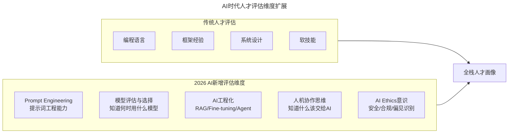
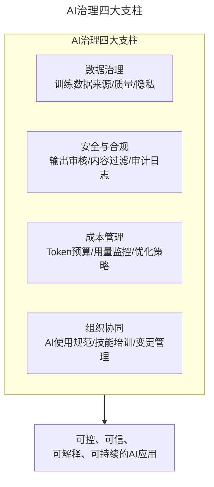
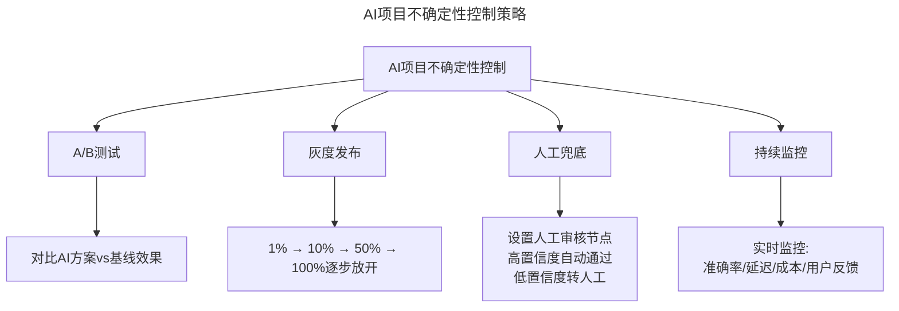
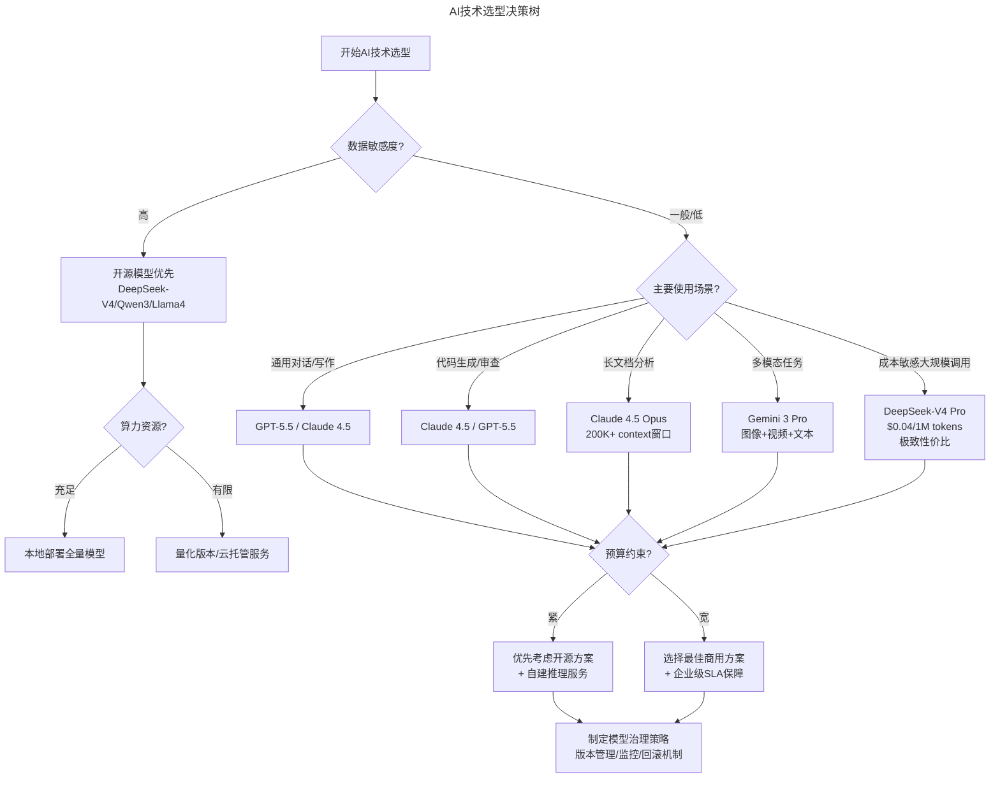

# 第7讲 | 要制定技术战略，先看清局面

> **适用范围**：CTO、技术VP及高级技术管理者，尤其是需要制定技术战略、把控技术节奏、并理解公司不同阶段战略重点的技术领导者；同样适用于在AI时代需要重新评估"合适的技术"定义的从业者。
>
> **更新摘要（v2 · 2026-08 更新）**：
> - 结构化升级为 6 节骨架（导言 / 核心方法论 / 关键流程 / 工具与实战 / 常见误区 / 进阶延展）
> - 将"看清局面"方法论整合为公司阶段×AI战略重点的统一框架
> - 补充2026年AI技术选型决策树、主流模型选型速查表与AI治理四大支柱
> - 保留全部Mermaid图、数据表与行动清单

---

## 1. 导言

随着企业创新节奏加快，CTO作为核心高管之一，在管理战略上起到越来越重要的作用，一方面要理解公司战略，另一方面要给出正确的技术战略和节奏反馈管理层，让所有管理层对技术有一个正确的预期和把控。

什么是技术战略？用通俗的话来讲，就是**在现阶段用合适的人、合适的技术架构办合适的事情**。

2026年，这一核心理念不仅没有过时，反而因为AI技术的爆发而变得更加重要——但"合适"的定义已经发生了根本性变化。从性能考量到成本结构，从风险类型到团队能力，每一个选型维度都需要注入AI时代的新内涵。

---

## 2. 核心方法论

### 2.1 首先要看清"现阶段"

不是每个公司从一开始就是和BAT一个阶段的，每个公司实际业务形态也不同，所以技术战略、架构选型、人员招聘等直接选择与BAT对标往往会把公司坑得很惨。要认清以下两点：

**公司团队现状**：包括管理团队和执行团队的价值观、认知、潜力、水平等。对于高级技术管理者来说，其他高管对于技术的价值观和认知很重要。技术高级管理者要花非常多的时间，结合实际业务反复给其他合伙人沟通你的观点和认知，并把事情"做成"，赢得其他合伙人的信任。

**业务增长节奏**：了解当前业务的节奏、财务的预期是什么。如果公司节奏是在快速上升通道，那么需要孤注一掷的砸资源、请牛人、扩大技术团队以支撑几何级数上涨的业务；如果公司业务处于探索阶段，那么适当控制团队规模、用实用而稳定的技术，控制管理团队预期就很重要。

### 2.2 技术架构升级就是对人的升级

了解了当前公司的节奏和现状后，就可以对现在的执行团队和架构做一次评估。人、架构要做的事情是一体的，技术架构升级其实也就是对人的升级，不同情况下执行团队和架构也是不同的。

2026年的人才评估需要新增AI维度：

上图展示了人才评估从传统维度到AI新增维度的扩展。不会用AI的开发者在2026年就像2018年不会用Git一样落后。AI素养成为基础要求，而非加分项。新的人才分级标准：AI-Native（原生） > AI-Adept（熟练） > AI-Aware（认知） > AI-Skeptical（抵触）。

### 2.3 "合适的技术"的AI时代新定义

| 选型维度 | 2018年（原始） | 2026年（AI时代） |
|---------|---------------|------------------|
| 性能考量 | 吞吐量、延迟、并发 | 推理速度（TPS）、Token成本、上下文窗口大小 |
| 扩展性 | 水平/垂直扩展能力 | 模型规模扩展、多模态支持、Agent编排能力 |
| 成本结构 | 服务器成本、许可费用 | Token计费、算力成本、数据标注成本、API订阅费 |
| 风险类型 | 单点故障、供应商锁定 | 模型幻觉、数据泄露、合规风险、模型过时/废弃 |
| 团队能力 | 编程语言熟悉度、框架经验 | Prompt Engineering、模型评估、AI工程化能力、RAG构建 |
| 运维模式 | CI/CD、容器化部署 | LLM Ops、模型监控、Prompt版本管理、A/B测试框架 |

### 2.4 管理体系建立的关注点

**不确定性控制与持续改善**：面对巨大不确定性，立一个巨大的项目，通过庞大的管理体系去管理往往都会失败。坚持50个100分的功能而非100个50分的功能，每个小的迭代都是成功的，持续完善才是王道。

**持续交付与迭代**：CI的目标是"快"。最快的集成，最快的给出高质量的产品，最快的训练出来高效的跟得上节奏的团队。

**构建使命式管理结构**：通过让整个团队了解明确的目标以及目标背后的原因，把权力下放，让一个产品经理也可以决定某个网页带bug上线，而达到整体产品流程完整。

**AI治理体系（2026新增）**：AI治理四大支柱包括数据治理、安全与合规、成本管理、组织协同。

上图展示了AI治理的四大支柱：数据治理确保训练数据的来源、质量和隐私；安全与合规管控输出审核与审计；成本管理优化Token预算和用量监控；组织协同推动AI使用规范和技能培训。四者共同构成可控、可信、可解释、可持续的AI应用体系。

---

## 3. 关键流程

### 3.1 公司不同阶段的AI战略重点

| 公司阶段 | 原始建议 | 2026 AI时代新增战略重点 |
|---------|---------|--------------------------|
| 初期/业务验证 | 快速MVP，招聘优先 | 选择AI能最大加速MVP的场景；用AI API快速验证想法；72小时POC原则 |
| 高速突进 | 抢人才、高可用架构 | 建设AI基础设施；引入AI编程工具提升整体效能30-70%；建立Model Gateway |
| 平稳发展 | 还技术债、建文化 | 构建AI-Native研发体系；AI治理框架搭建；数据资产建设（数据质量→数据飞轮） |
| 业务紧缩 | 保士气、留核心 | 用AI降本增效；AI自动化替代重复性工作释放人力；智能运维降低运维成本 |

### 3.2 AI项目不确定性控制策略

AI系统的概率性输出特性意味着传统确定性软件工程方法不完全适用，需要新的组合策略：

上图展示了AI项目的四项不确定性控制策略：A/B测试验证效果、灰度发布控制范围、人工兜底保障质量、持续监控闭环优化。具体策略包括A/B测试必备、灰度发布强制、Human-in-the-Loop关键决策保留人工审核、持续监控模型性能衰减率与Token成本。

---

## 4. 工具与实战

### 4.1 AI时代技术选型决策树

上图展示了AI技术选型的完整决策树：从数据敏感度判断开源或商用路线，再到使用场景匹配具体模型，最后结合预算约束制定治理策略。

### 4.2 2026主流模型选型速查

| 使用场景 | 推荐模型 | 核心优势 | 参考价格 |
|---------|---------|---------|---------|
| 复杂推理/代码 | GPT-5.5 | 综合能力强 | $2.5/1M input |
| 长文本/深度分析 | Claude 4.5 Opus | 200K+上下文 | $5/1M input |
| 成本敏感场景 | DeepSeek-V4 Pro | 极致性价比 | $0.04/1M tokens |
| 多模态任务 | Gemini 3 Pro | 原生多模态 | $2/1M input |
| 私有化部署 | Qwen3-72B / Llama4 | 开源可控 | 仅算力成本 |

### 4.3 行动清单

**如果你在初期/业务验证阶段**：
- [ ] 列出所有可以用AI API加速的业务场景（至少5个）
- [ ] 选择1个场景，本周内完成72小时POC验证
- [ ] 建立初步的AI使用成本追踪表

**如果你在高速突进阶段**：
- [ ] 评估并引入AI编程工具（目标：团队采纳率>80%）
- [ ] 搭建统一的Model Gateway（统一接入多模型）
- [ ] 制定AI基础设施预算（建议占技术预算15-25%）

**如果你在平稳发展阶段**：
- [ ] 启动数据资产建设项目（数据质量是AI的基础）
- [ ] 构建AI治理框架（数据安全、使用规范、审计机制）
- [ ] 建立AI人才培养体系（L1-L4能力路径图）

**如果你在业务紧缩阶段**：
- [ ] 梳理可被AI自动化的重复性工作（预计节省20-40%人力）
- [ ] 引入AIOps降低运维成本
- [ ] 用AI工具提升剩余团队的人效（1人顶2人）

---

## 5. 常见误区

### 5.1 格局误区：与BAT对标

不是每个公司从一开始就和BAT一个阶段，每个公司实际业务形态也不同。技术战略、架构选型、人员招聘等直接选择与BAT对标往往会把公司坑得很惨。认清楚现阶段很重要——公司团队现状和业务增长节奏是制定战略的基础。

### 5.2 节奏误区：技术节奏与业务节奏脱节

如果节奏没有了解清楚，技术节奏把控不好，很可能会导致技术无法支持现有的业务增长，或者业务收入无法供给辛辛苦苦招聘来的技术牛人，看着一起成长起来的兄弟却要忍痛优化掉。

### 5.3 面对不确定性立大项目

面对巨大不确定性，立一个巨大的项目，通过庞大的管理体系去管理往往都会失败。要坚持50个100分的功能而非100个50分的功能，每个小的迭代都是成功的，持续完善才是王道。

### 5.4 忽视AI治理

2026年新增的AI治理体系不是可选项。AI系统的概率性输出特性意味着需要A/B测试必备、灰度发布强制、Human-in-the-Loop关键决策保留人工审核、持续监控模型性能。

---

## 6. 进阶延展

### 6.1 推荐书单的AI时代补充

**原文推荐**：《毛泽东选集》《原则》、德鲁克、精益系列

**2026新增推荐**：

| 书籍/资源 | 作者/来源 | 核心价值 | 推荐理由 |
|-----------|----------|---------|---------|
| *Co-Intelligence: Living and Working with AI* | Ethan Mollick | 人机协作思维 | 理解如何与AI有效共事 |
| *Building Machine Learning Powered Applications* | Emmanuel Ameisen | ML工程实践 | 从原型到生产的完整指南 |
| *Designing Machine Learning Systems* | Chip Huyen | ML系统设计 | AI时代的系统架构思维 |
| *AI Alignment Problem*系列文献 | 多位研究者 | AI安全与伦理 | CTO必须关注的治理议题 |
| Martin Fowler - *Patterns for AI* | martinfowler.com | AI架构模式 | 企业级AI应用的架构最佳实践 |

### 6.2 公司四阶段的组织管理要点

**公司初期（业务验证阶段）**：技术品牌与技术资源都不足，"快"才是第一位的。招聘宁缺毋滥，要一帮能同仇敌忾的兄弟才能成事。

**公司高速突进阶段**：公司每天业务可能翻几倍的成长，初期留下的技术债急需修正。要高出市场平均价格来吸引人才迅速加盟。跟上公司高速发展的步伐，是这个阶段整个技术团队最大的挑战。

**公司平稳发展阶段**：技术体系搭建和文化的建立是最重要的。注意避免技术过渡镀金和官僚的滋生。一直要保持技术团队"半饥饿"状态，让狼性持续保持。

**公司业务紧缩阶段**：保持士气和核心成员是最重要的。"地失人在，人地皆得；地在人失，人地皆失"。浴火重生的团队才是真的战无不克。

### 6.3 作者简介

郭炜，易观 CTO，中国软件行业协会智能应用服务分会副主任委员，TGO鲲鹏会北京分会董事会会长。负责构建易观技术团队、完成易观大数据采集、平台、数据挖掘等技术架构与体系；从无到有完成易观混合云的搭建、以及易观 SDK 的升级，并发布易观秒算实时计算平台。目前易观大数据平台日处理数据量 30T，272 亿条，月活用户5.5亿。

---

*本文档基于2026年8月的技术动态编写，旨在帮助读者以新时代视角重新审视经典内容。技术演进日新月异，建议读者结合自身场景批判性思考。*
