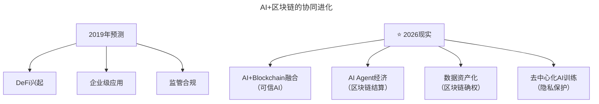

# 第182讲 | 谢文杰：区块链的下一个十年

> **适用范围**：关注区块链技术落地的技术领导者、需要评估"区块链+AI"融合机会的CTO及产品负责人；同样适用于希望理解信任网络变革与数据资产化的从业者。
>
> **更新摘要（v2 · 2026-08 更新）**：
> - 结构化升级为 6 节骨架（导言 / 核心方法论 / 关键流程 / 工具与实战 / 常见误区 / 进阶延展）
> - 将谢文杰老师2019年的区块链十年预测升级为"AI+区块链融合新纪元"视角
> - 补充2026年AI+区块链四大关键方向与可执行行动清单
> - 保留全部Mermaid图、趋势对比表与避坑指南

---

## 1. 导言

今天想跟大家聊聊区块链的下一个十年。但在正文开始前，想先给大部分区块链从业或即将从业的朋友们泼点冷水：

- 1.如果过去十年你没有在密码学货币里挣到钱，基本上你已经完美的错过了上半场。
- 2.大部分现在说的区块链本质上就是个噱头，给大家的感觉好像是万能的，但又好像没什么人知道具体能干啥。
- 3.区块链的雪道很长，也很厚，厚长到你还没滚起来就被大概率被淹没了。

另外，如果你没有错过上半场，那看我这篇文章对你而言可能是一种时间的浪费。但如果你不太想接下来完美的错过下半场，不妨认真的看看我这篇文章。

谢文杰，智链万源CTO，联合创始人。曾就职于百度公有云、金山云、百度移动事业部、搜狐等公司，任产品及研发高管。拥有十余年软件产品技术架构经验，从零构建金山云云计算产品、搜狐WebIM亿级PV产品技术，对云计算、移动APP、手游、社交、P2P网络等多种类型产品的开发运营均有深度研究。从2014年开始研究区块链，对众多主流区块链技术平台如HyperLedger Fabric、Corda、Ethereum、Ripple、Bitcoin等均有深入研究。

谢文杰老师2019年预测的"区块链下一个十年"，到2026年已经演变为**"AI+区块链融合的新纪元"**。区块链为AI提供可信基础，AI为区块链带来智能应用——两者协同而非竞争。

---

## 2. 核心方法论

### 2.1 区块链的本质：信任成本革命

过去，现在，以及将来，提起区块链，都必然提变革。诚然，它前所未有的指数级地降低了传递信任的成本，这是一项革命性的、标志性的工程创新。

引用Ray Dalio的经济模型：经济的本质可以被抽象为三要素——买家、卖家、交易。放大一些，就是资源的供给方、消费方和整个交易网络。在这个模型里，区块链技术没有提升生产力，也没有提升货币供给，但它的出现，为整个交易网络的变革提供了一个巨大的可能。

交易需要信任，所以有交易的地方就会有中间人，有中间人的地方就有交易。中间人一直存在，交易网络也一直存在，也永远不会消失。交易网络在过去的历史长河里发生了太多次的变革。每一个时代的变革似乎都预示着中间人的终结，但从来没有成功过。因为在这个交易网络里对于信任的需求从来没有变过，每一次的变革都是在建立信任的效率和成本上做出了质的变化。

### 2.2 区块链落地的核心判断标准

如果有人和你说他做了一个区块链的创新，革命性的，你想知道靠不靠谱，怎么办？其实可以很简单，只需要问他一个问题：**这个场景里区块链技术究竟改变了哪块的成本构成**。绝大部分人是回答不了这个问题的，回答不了的，把他归类成蹭热点的肯定没错。

### 2.3 AI+区块链的协同进化

**2019年预测 vs 2026年现实**：



### 2.4 区块链在AI时代的价值

```
传统AI问题：
├─ 数据黑箱：不知道AI用了什么数据训练
├─ 算法偏见：AI决策过程不透明
├─ 中心化风险：少数公司控制AI能力
└─ 数据隐私：用户数据被滥用

区块链解决方案：
├─ ✅ 数据来源可追溯（链上记录）
├─ ✅ 决策过程可审计（智能合约）
├─ ✅ 去中心化AI（算力和模型共享）
└─ ✅ 用户数据确权（数据资产化）
```

---

## 3. 关键流程

### 3.1 AI+区块链的关键方向（2026）

| 方向 | 描述 | 成熟度 |
|------|------|--------|
| **可信AI** | 用区块链记录AI决策过程，可审计可追溯 | ⭐⭐⭐⭐ |
| **AI Agent经济** | AI Agent间用智能合约自动交易和结算 | ⭐⭐⭐ |
| **数据资产化** | 个人数据上链，AI使用时付费 | ⭐⭐ |
| **去中心化AI训练** | 联邦学习+区块链激励 | ⭐⭐ |

### 3.2 区块链落地的实践验证

2017年，智链万源认真实践了一件事情：用区块链去重塑溯源，为溯源赋上它真正应该有的商业价值。为了这件事，和北大荒合作了全球第一个区块链大农场，从2016年开始花了一年多的时间认真的调研每一个细节。

起初，没有人认为这件事会成功，很多人都说这里面无法解决的问题太多了。但坚持下来并且把它做完了——在用区块链量化并且优化一个具体的细分交易网络里的成本构成。

等做完这个项目，大家仿佛第一次看到原来区块链是真的可以落地的。2018年变成了区块链在溯源领域爆发的一年。京东、天猫、蚂蚁金服等等大厂先后跟进。

**未来落地方向**：区块链将会在供应链里扮演越来越重要的角色。得益于不可篡改的特性，链条生态中的交易摩擦成本会极大的下降；同时，背靠智能合约，供应链中建立信任的效率会极大的提升。在金融领域，区块链必将会重构整个信任体系。

### 3.3 下一个十年的预测演进

**信息时间证明**：未来，信息除了会附带摘要签名，还将附带一份时间证明。以邮件为例，加一个链上证明，就可以证明这封邮件写在2019年1月，不会更早，也不是后期捏造，并且可以一直保密，直到需要的时候才公开。

**智能合约新时代**：去中心化的智能合约将建立一个新时代的合约体系，一个趋势是履约条件的全面数字化，另一个趋势是履约这个行为的去中心化，不仅仅是自动化。

**技术融合加速**：区块链和当下的应用和技术体系的融合度还很低，都还是相对比较独立的存在。从趋势来看，应用层面已经出现了融合的趋势，未来随着业界对区块链理解的加深，这个趋势必然会加速。

---

## 4. 工具与实战

### 4.1 技术人关注点

1. **学习"区块链+AI"交叉领域**
   - 关键词：ZKML（零知识机器学习）、Federated Learning、Data DAO
   - 项目关注：Ocean Protocol、SingularityNET、Fetch.ai

2. **评估业务场景**
   - 你的产品是否需要"可信AI"？
   - 是否有数据资产化的机会？
   - AI Agent是否需要自主交易能力？

### 4.2 区块链技术栈的广度

区块链涉及的技术栈非常广，每一块都可以深度展开：
- 密码学
- 结构化存储
- P2P网络
- 虚拟机

可以融入的技术体系也非常广：
- DAG（有向无环图）
- 分布式一致性
- 零知识证明
- 安全计算

### 4.3 坚持在场景里锤炼技术

市场无法凭空创造，技术也一样，过去这么多年无一例外，伟大的技术都是在伟大的场景里锤炼出来的。目前业界还普遍看好区块链在物流、版权、众筹、公益慈善、医疗、数字身份等众多链条复杂又极其依赖信任成本的领域的潜力。

---

## 5. 常见误区

### 5.1 避坑指南

| 坑 | 表现 | 解决方案 |
|----|------|----------|
| **技术炫技** | 为了用区块链而用区块链 | 先问：不用区块链行不行？ |
| **忽视AI** | 只关注区块链忽视AI趋势 | AI+区块链才是未来 |
| **过度炒作** | 相信"颠覆一切"的宣传 | 关注实际落地项目 |

### 5.2 区块链不是万能的

十八般武艺都得用上。一方面，区块链涉及的技术栈非常广；另一方面，区块链可以融入的技术体系也非常广，未来会涌现出越来越多的融合技术。技术之外，形成质变还需要很多产品思维、商业逻辑的融合，以及趋势的变化，这些都不是靠区块链一个技术能够打通的。

### 5.3 究其原因

可能是这个世界还缺一次生产力的突破，突破到现有的交易网络不能承载，突破到我们需要一个更高效的交易网络。也有可能是这个新的交易网络根本不够高效，或者说区块链和各项基础技术的融合还没到位，甚至连融合都谈不上，一个真正好用的企业级区块链底层都还没到位。

---

## 6. 进阶延展

### 6.1 下半场，风随时会来

首先肯定是要坚持创新，改进和优化很重要，能带来数量级提升的才是质变。区块链可以带来质变的领域很多。过去这两年，溯源、供应链金融是两个比较热门的区块链应用领域，涌现了众多的案例，其中不乏主流大厂和大型金融机构的身影。此外，法律存证、跨境清结算等也一直是区块链活跃的领域。

其次是要坚持在场景里锤炼技术。

再次是区块链真的不是万能的，十八般武艺都得用上。

最后，祝大家完美的收割下半场，风，随时会来。

### 6.2 ⭐2026可执行行动清单

**技术人关注点**：
1. 学习"区块链+AI"交叉领域（ZKML、Federated Learning、Data DAO）
2. 评估业务场景的"可信AI"需求
3. 关注Ocean Protocol、SingularityNET、Fetch.ai等项目

**避坑指南**：
- 不要为了用区块链而用区块链——先问"不用区块链行不行？"
- 不要只关注区块链忽视AI趋势——AI+区块链才是未来
- 不要相信"颠覆一切"的宣传——关注实际落地项目

### 6.3 核心结论

> **谢文杰老师2019年预测的"区块链下一个十年"，到2026年已经演变为"AI+区块链融合的新纪元"。区块链为AI提供可信基础，AI为区块链带来智能应用——两者协同而非竞争。**

### 6.4 作者简介与延伸

谢文杰，智链万源CTO，联合创始人。从2014年开始研究区块链，对众多主流区块链技术平台均有深入研究，专注于区块链技术的产业结合及在海量数据以及高性能、高可用软件体系内的应用实践。

**延伸关注方向**：
- ZKML（零知识机器学习）技术进展
- AI Agent自主交易与智能合约结合
- 数据资产化与数据DAO实践
- 联邦学习+区块链激励模型

---

*细心的读者可能会发现，文中我一直用的都是密码学货币（Cryptocurrency），不是虚拟货币也不是数字货币，其实没啥，纯属个人洁癖，没有特殊含义。*