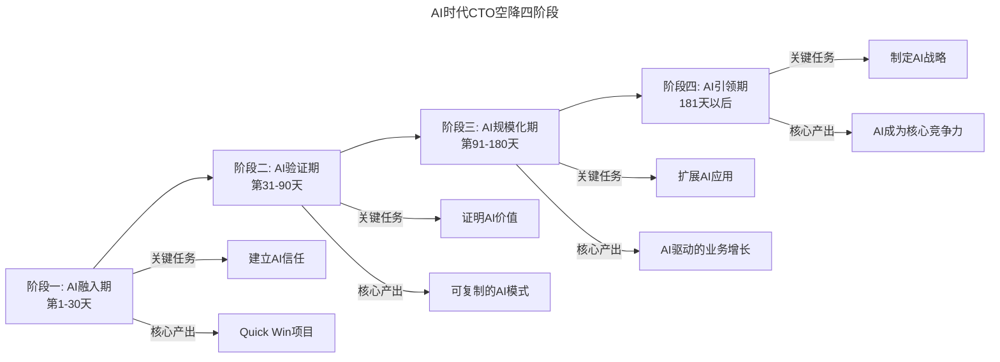
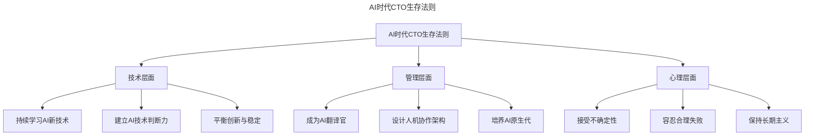

# 第46讲 | 走出至暗时刻——CTO空降下篇

> **适用范围**：已经或即将空降的CTO、技术VP，尤其是面临AI时代空降困境、需要实战指南度过至暗时刻的技术领导者。
>
> **更新摘要（v2 · 2026-08 更新）**：
> - 结构化升级为 6 节骨架（导言 / 核心方法论 / 关键流程 / 工具与实战 / 常见误区 / 进阶延展）
> - 将空降三阶段（蜜月期/考验期/稳定期）升级为AI时代四阶段（AI融入期/AI验证期/AI规模化期/AI引领期）
> - 补充双重债务治理（传统技术债+AI债）与人机协作新流程设计
> - 保留全部Mermaid图、AI团队类型对照表与100天计划

---

## 1. 导言

2026年空降CTO的至暗时刻：当AI可以完成70%编码工作，Agent能替代3-5人团队，CTO面临的不再是传统技术挑战，而是"AI战略空白+团队能力断层+CEO期望错位+双重债务负担（技术债+AI债）"的四重困境——走出至暗时刻需要全新的作战地图。

空降CTO需要经历从蜜月期到考验期再到稳定期的完整过程，在AI时代，这个过程需要重新设计为四个阶段，每个阶段都有明确的关键任务和核心产出。

---

## 2. 核心方法论

### 2.1 做事——AI版实战指南

空降CTO的做事方法论围绕AI时代四阶段展开：

**阶段一：AI融入期（第1-30天）**——建立AI信任，核心产出Quick Win项目
**阶段二：AI验证期（第31-90天）**——证明AI价值，核心产出可复制的AI模式
**阶段三：AI规模化期（第91-180天）**——扩展AI应用，核心产出AI驱动的业务增长
**阶段四：AI引领期（181天以后）**——制定AI战略，核心产出AI成为核心竞争力

### 2.2 做人——AI时代的关系管理

**对上：AI战略对齐**——CEO可能不懂技术更不懂AI，CTO需要翻译AI语言、设定AI里程碑、管理AI期望曲线。

**对中：跨部门AI协作**——面临数据共享障碍、AI预算竞争、AI能力不平衡等新挑战。

**对下：AI团队建设**——团队从传统的听话型/合作型/反动型，演变为AI拥抱型/AI观望型/AI恐惧型/AI专家型。

### 2.3 双重债务治理

```yaml
双重债务治理策略:
  传统技术债:
    - 代码质量: 用AI代码审查工具改善
    - 架构老化: 评估是否需要AI Native重构
    - 文档缺失: 用AI自动生成文档
  
  AI技术债:
    - Prompt散乱: 建立Prompt管理系统
    - 模型依赖: 制定多模型适配策略
    - 数据质量: 启动数据治理项目
    - 人才缺口: 制定AI培训计划
```

---

## 3. 关键流程

### 3.1 AI时代CTO空降四阶段



上图展示了AI时代CTO空降的四个阶段：从AI融入期建立信任、AI验证期证明价值，到AI规模化期扩展应用、AI引领期制定战略，每个阶段都有明确的关键任务和核心产出。

### 3.2 CEO期望管理流程

CEO可能期望AI立刻带来10倍提效，现实是AI项目成功率约30%，需要时间迭代。应对策略：

| 时间节点 | 目标 | 成功标准 |
|---------|------|---------|
| 第1个月 | 展示AI可能性（POC） | 输出AI成熟度报告 |
| 第3个月 | 1-2个成功案例 | Quick Win项目上线 |
| 第6个月 | 可量化的ROI | AI带来的收益 > 投入 |
| 第12个月 | AI成为标准工作方式 | 团队AI adoption > 80% |

### 3.3 AI时代CTO生存法则



上图展示了AI时代CTO生存法则的三个层面：技术层面（持续学习、建立判断力、平衡创新与稳定）、管理层面（成为翻译官、设计人机协作、培养AI原生代）、心理层面（接受不确定性、容忍合理失败、保持长期主义）。

---

## 4. 工具与实战

### 4.1 Quick Win项目推荐

选择周期短（1-2周）、风险低、可见度高的项目：
- AI代码助手部署（效率提升立竿见影）
- 智能文档生成（减少重复劳动）
- AI辅助测试（提升质量）

### 4.2 AI团队类型与应对策略

| 类型 | 特征 | 应对策略 |
|------|------|---------|
| AI拥抱型 | 积极使用AI，主动探索 | 培养成AI Champion |
| AI观望型 | 愿意尝试但需要引导 | 提供培训和支持 |
| AI恐惧型 | 担心被替代，抗拒使用 | 展示AI如何帮助他们而非替代 |
| AI专家型 | AI能力强但有傲气 | 给予挑战性任务，保持谦逊 |

### 4.3 人机协作新流程设计

```
传统流程: 人 → 人 → 人 → 人
AI优化后: AI → 人 → AI → 人 → AI

原则:
- 规则明确、重复性高的任务 → AI优先
- 需要创造力、情感交互的任务 → 人为主
- 边界模糊的任务 → 人机协作
```

### 4.4 空降后100天计划

- **第1-30天**：融入团队，建立信任，启动1个Quick Win
- **第31-60天**：深化AI应用，展示可量化成果
- **第61-90天**：扩展AI范围，建立可复制模式
- **第91-100天**：复盘总结，规划下一阶段

---

## 5. 常见误区

### 5.1 蜜月期后无法存活

"蜜月期以后还能活下来的，都是搞过封闭开发的"。AI时代的考验更加严峻：CEO期望管理、团队阻力克服、双重债务治理，三重压力下CTO容易陷入至暗时刻。

### 5.2 CEO期望管理失败

CEO可能期望AI立刻带来10倍提效，现实是AI项目成功率约30%。如果不提前设定合理预期，在第2-3个月现实打击时就会失去CEO信任。

### 5.3 忽视AI技术债

只关注传统技术债而忽视AI技术债——Prompt散乱、模型依赖、数据质量、人才缺口——这些问题会在后期集中爆发，让CTO陷入被动。

### 5.4 对AI专家型员工管理不当

AI专家型员工技术强但可能缺乏业务理解，容易陷入"技术自嗨"。需要引导他们将AI能力转化为业务价值，而非追求技术完美。

### 5.5 用技术语言向CEO汇报

```
CEO听得懂的语言:
❌ "我们要用GPT-5.5 + RAG构建知识库"
✅ "AI可以帮助客服团队效率提升50%，每年节省200万成本"

❌ "Prompt Engineering是核心技术"
✅ "我们需要培训团队掌握与AI沟通的新技能"
```

---

## 6. 进阶延展

### 6.1 长期成功要素

- 成为"AI布道师"：持续传播AI价值和最佳实践
- 建立"AI实验文化"：鼓励试错，快速迭代
- 培养"AI领导力"：让每个TL都具备AI思维
- 保持"技术敏感度"：每月跟踪AI领域最新进展

### 6.2 AI治理框架建设

稳定期需要建立的AI治理框架：
- AI使用规范（什么能用，什么不能用）
- 数据安全政策（特别是涉及用户数据）
- AI伦理准则（公平性、透明度、可解释性）

### 6.3 AI CoE（卓越中心）建设

选拔3-5名AI Champion，给予他们时间和资源探索AI应用，让他们成为团队的AI导师。这是AI规模化期的关键组织保障。

---

*本文档基于2026年8月的技术动态编写，旨在帮助读者以新时代视角重新审视经典内容。技术演进日新月异，建议读者结合自身场景批判性思考。*
