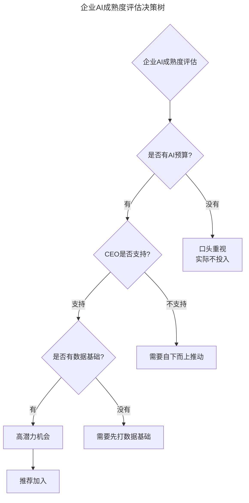
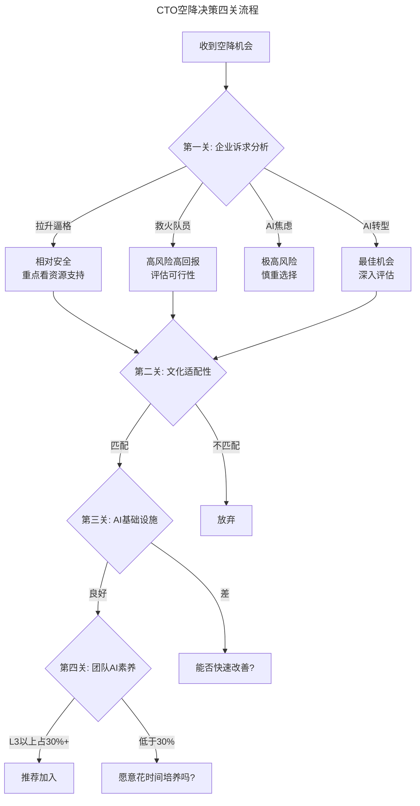

# 第45讲 | 选好人生下一站——CTO空降上篇

> **适用范围**：考虑更换工作的CTO、技术VP及高级技术管理者，尤其是面临AI时代职业选择、需要评估空降机会风险与价值的技术领导者。
>
> **更新摘要（v2 · 2026-08 更新）**：
> - 结构化升级为 6 节骨架（导言 / 核心方法论 / 关键流程 / 工具与实战 / 常见误区 / 进阶延展）
> - 将空降决策框架升级为AI时代版本，新增AI转型驱动型企业诉求和AI文化成熟度评估
> - 补充2026年CTO空降决策流程图与必查清单
> - 保留全部Mermaid图、企业诉求对照表与行动建议

---

## 1. 导言

对于CTO（技术总监）来说，他们已经成为公司或部门技术的最高负责人，实现了人生一个小目标。那么CTO的下一站又在哪里？当自身发展遇到瓶颈，决定再次起飞时，选择合适的着陆地点也许就决定了是否能够抢滩成功。

2026年CTO空降的新现实：当84%开发者使用AI编程，Agent能替代3-5人团队，CTO空降的核心挑战从"技术能力验证"升级为"AI战略制定+人机协作架构设计+组织变革推动"——选对下家的标准需要全面重构。

---

## 2. 核心方法论

### 2.1 与自己对话——下一站在哪里？

**寻求更广阔的空间**：当CTO所在的公司业务增长放缓，团队趋于稳定，没有太多技术上的挑战出现时，成长型的公司提供更大的想象空间和可以另起炉灶、大展拳脚的机会，对技术出身的高管有着致命的诱惑力。

**转型不同的角色**：综合能力比较强的CTO，希望慢慢转型成为CEO或者一个子业务的GM。正所谓"不想当CEO的CTO不是好厨子"，未来会有越来越多技术出身的CEO出现。

**AI时代新增动机（2026）**：
- AI战略空白：目标公司有AI需求但无AI能力
- 人机协作重构：需要重新设计团队与AI的协作模式
- 技术栈升级：从传统架构向AI Native架构转型
- 行业AI化机遇：所在行业正在被AI重塑

### 2.2 空降前的"功课"——企业诉求分析

按照风险由小到大排列，企业对CTO的诉求有以下几种：

| 诉求类型 | 传统描述 | AI时代新内涵 | 风险等级 |
|---------|---------|-------------|---------|
| 拉升逼格 | 提升技术实力、吸引人才 | 建立AI品牌：成为行业AI标杆 | 低 |
| 救火队员 | 技术债务、系统不稳定 | AI救火：模型失败、数据事故、Prompt注入攻击 | 中高 |
| 互联网焦虑 | 害怕被互联网颠覆 | AI焦虑：害怕被AI原生公司降维打击 | 高 |

**新增第四类诉求：AI转型驱动**——公司业务稳定但增长放缓，管理层意识到AI是未来趋势但不知如何下手，需要一个既懂技术又懂业务的CTO来主导AI转型。

### 2.3 企业文化适配性评估

原文提到要从业务状况、管理模式、人员状况三方面评估，在AI时代需要增加**AI文化成熟度**评估：

| 维度 | 成熟表现 | 不成熟表现 |
|------|---------|-----------|
| 对待AI的态度 | 积极探索、允许试错 | 恐惧排斥、等待观望 |
| 数据共享意愿 | 开放共享、打破孤岛 | 部门壁垒、数据私有 |
| 决策方式 | 数据驱动+AI辅助 | 经验驱动、拍脑袋 |
| 学习氛围 | 鼓励学习AI新技能 | 固守旧技能、抗拒变化 |
| 失败容忍度 | 视AI项目失败为学习机会 | 追究责任、惩罚失败 |

---

## 3. 关键流程

### 3.1 企业AI成熟度评估

上图展示了企业AI成熟度评估的决策树：从AI预算、CEO支持度、数据基础三个维度逐层评估，只有三者都具备才是高潜力机会。

### 3.2 2026年CTO空降决策流程

上图展示了CTO空降决策的四关流程：企业诉求分析、文化适配性、AI基础设施、团队AI素养，层层筛选才能找到最佳机会。

---

## 4. 工具与实战

### 4.1 渠道选择的AI时代建议

| 渠道 | 优势 | 劣势 | 推荐场景 |
|------|------|------|---------|
| 人脉推荐 | 信息准确、信任基础好 | 机会有限 | 首选 |
| 猎头 | 机会多、市场信息全 | 信息可能失真 | 作为补充 |
| AI人才社区 | 专业对口、技术氛围好 | 圈子较小 | 技术导向型公司 |
| 开源贡献 | 展示技术能力、建立影响力 | 耗时较长 | 技术型CTO |
| AI会议/峰会 | 认识同行、了解趋势 | 机会不确定 | 行业交流 |
| AI项目合作 | 深入了解后转化 | 周期较长 | 新增渠道 |

### 4.2 选择下家时的必查清单

- [ ] 公司是否有明确的AI战略？（不是口号）
- [ ] AI预算是否充足？（至少年度tech budget的20%）
- [ ] CEO是否真正理解AI？（亲自使用AI工具）
- [ ] 数据基础是否具备？（质量、数量、治理）
- [ ] 团队是否有AI学习意愿？（不是被迫接受）
- [ ] 是否允许试错？（AI项目失败率70%是正常的）

### 4.3 谈判时的关键条款

1. **AI战略制定权**：确保你有权力制定和执行AI路线图
2. **AI团队组建权**：能够招聘AI人才或外包
3. **AI预算审批权**：有独立的AI项目预算
4. **试错空间**：明确AI项目的成功/失败定义
5. **时间窗口**：至少18个月来展现AI转型成果

### 4.4 入职后的前30天

1. **第1周**：倾听为主，不要急着展示AI能力
2. **第2周**：识别最容易出成绩的AI Quick Win
3. **第3周**：启动第一个AI试点项目
4. **第4周**：展示初步成果，建立信任基础

---

## 5. 常见误区

### 5.1 没有提前做好功课

由于没有提前做好功课，有些CTO从稳定的大平台出来之后，一年换一次工作甚至更高的频率都是有的。高管更换工作的风险远远大于普通的工程师，这一步必须慎之又慎。

### 5.2 单纯听猎头的一面之词

单纯听猎头的一面之词，以及通过几次面试跟企业的简单接触就决定加入，对CTO来说是不可取的。面试时大家展现的都是最好的一面，入职不久可能就会发现很多之前完全预想不到的情况。最好的做法是通过自己的人脉找到内部员工了解真实情况。

### 5.3 忽视AI文化成熟度

只看企业诉求和业务状况，忽视AI文化成熟度评估。如果公司对待AI的态度是恐惧排斥、数据共享有部门壁垒、失败会被追究责任，那么CTO的AI转型计划很难落地。

### 5.4 行业周期判断失误

行业是有周期的。在行业高峰期可以适当激进一些，因为机会比较多，即使失败找下家也容易。但如果在低潮到来时选择冒险，一旦失败可选择的余地就会小很多。

### 5.5 忽视AI预算和资源支持

口头重视AI但实际不投入预算是常见陷阱。CTO必须确认AI预算是否充足（至少年度tech budget的20%），以及是否有独立的AI项目预算审批权。

---

## 6. 进阶延展

### 6.1 临渊羡鱼，还是退而结网

作为CTO，大家都知道行业是有周期的，所以看机会的时机也是很重要的。从2016年开始，互联网创业的机会越来越少了，而AI的机会多起来了。毕竟对于CTO来说，更换工作的风险和成本都是很高的。

在行业高峰期可以适当激进一些；但如果在低潮到来的时候选择冒险，那么一旦失败，可选择的余地就会小很多。这个时候不妨慎重一些，在稳定的平台里面再多修炼一下也未尝不好。

### 6.2 AI项目合作——新增的空降渠道

很多CTO空降机会来自于：
- 为某家公司做AI咨询/顾问后，被邀请全职加入
- 在开源AI项目中展示能力，被猎头/创始人发掘
- 在AI会议上分享经验，获得关注

### 6.3 作者简介

钟忻，易建科技技术副总裁兼云服务事业群总经理，TGO鲲鹏会北京分会会员。2003年清华大学自动化硕士毕业。曾在Turbolinux、IBM、Intel等多家IT公司担任资深软件工程师。13年底到16年初担任乐视云平台高级总监，主导了乐视IaaS、PaaS平台从无到有的全过程。目前负责易建科技上千人研发团队的技术体系的搭建，以及整个海航集团的IDC和基础云平台的产品研发、运营和市场开拓。

---

*本文档基于2026年8月的技术动态编写，旨在帮助读者以新时代视角重新审视经典内容。技术演进日新月异，建议读者结合自身场景批判性思考。*
