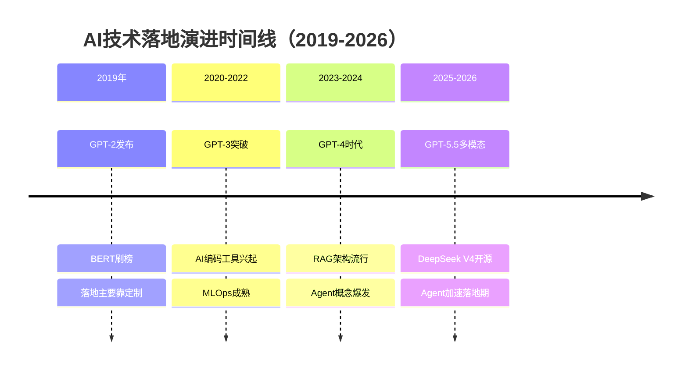
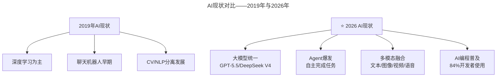
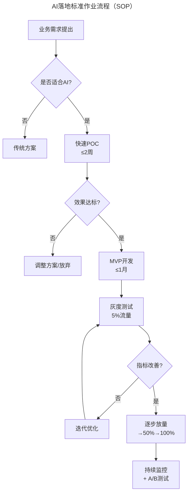
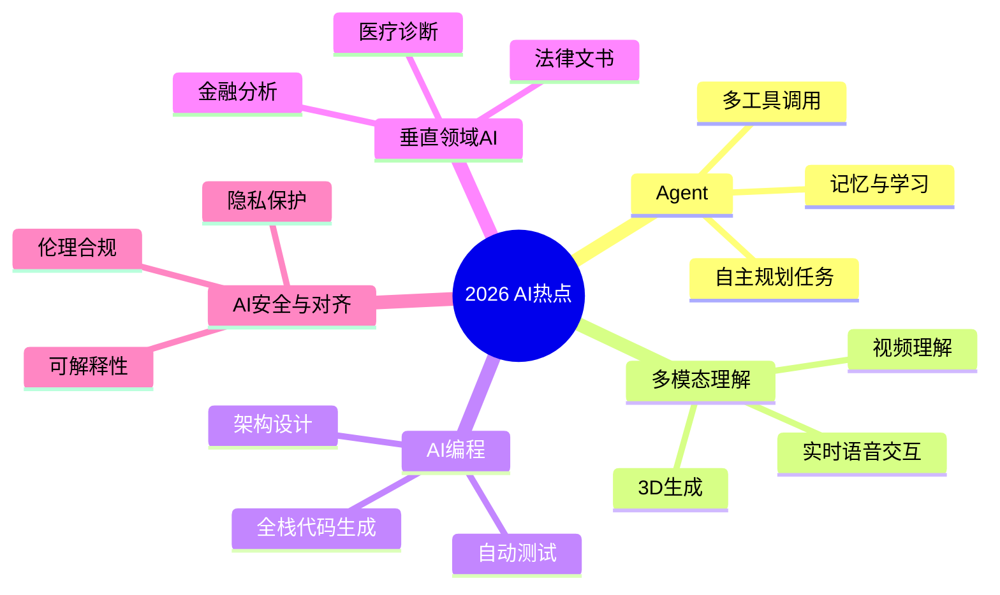

# 第205讲 | 邵浩：人工智能新技术如何快速发现及落地

> **适用范围**：CTO、技术总监及AI项目落地负责人，尤其是需要建立AI技术雷达、评估AI可行性和构建AI落地SOP的技术管理者；同样适用于关注2019→2026 AI落地范式转移的从业者。
>
> **更新摘要（v2 · 2026-08 更新）**：
> - 结构化升级为 6 节骨架（导言 / 核心方法论 / 关键流程 / 工具与实战 / 常见误区 / 进阶延展）
> - 将邵浩2019年方法论全面升级为2026版本：AI技术发现渠道进化、AI ROI评估矩阵、Agent加速落地期新范式
> - 补充2019 vs 2026核心数据对比与原文观点的2026验证结果
> - 保留全部Mermaid图、对照表与行动清单

---

## 1. 导言

简要来说，人工智能概念自从1956年达特茅斯会议上被提出之后，迄今为止经历了3个热潮。2006年，杰弗里·欣顿（Geoffrey Hinton）和他的学生在《Science》上提出基于深度信念网络（Deep Belief Networks, DBN）可使用非监督学习的训练算法，随后2012年，DNN技术在ImageNet评测中取得了突破性进展，人工智能进入到新的热潮。

2017年8月20日，微软语音识别系统错误率由5.9%降低到5.1%；微软深度学习算法在ImageNet 2012分类数据集中将错误率降低到4.94%，首次超越了人眼识别的错误率（约5.1%）；DeepMind在2017年6月发布了WaveNet语音合成系统；截至2019年3月，SQuAD使用BERT的系统暂列第一，F1分值达到89.474。

**2026年技术背景**：GPT-5.5发布，DeepSeek V4国产大模型崛起，84%开发者已将AI编程作为日常工作方式，Agent（智能代理）进入加速落地期，人机协作成为新常态。本文原发布于2019年，7年后的今天，文章中提到的Transformer、GPT-2等技术在2026年已演变为GPT-5.5、DeepSeek V4等万亿参数级别的通用人工智能系统。

### 2019 vs 2026 核心数据对比

| 维度 | 2019年 | 2026年 | 变化幅度 |
|------|--------|--------|----------|
| 最大语言模型参数量 | GPT-2: 15亿 | GPT-5.5: 数万亿（估算） | 1000x+ |
| AI开发者渗透率 | <5% | 84%（Stack Overflow 2025） | 1680%↑ |
| 企业AI落地率 | <10%（概念验证为主） | 67%+（生产环境部署） | 570%↑ |
| 单位推理成本（1M tokens） | ~$10（GPT-2 API） | $0.15（DeepSeek V4） | 98.5%↓ |
| 主要落地方式 | 定制化开发 | API调用 + Agent框架 + 微调 | 模式成熟 |
| 技术门槛 | 需要算法团队 | 低代码/无代码平台普及 | 大幅降低 |

⭐2026关键洞察：邵浩在2019年强调的"不能为了用新技术而偏离核心价值"、"传统算法未必比深度学习差"等务实观点，在2026年不仅仍然成立，而且更加重要——AI能力越强，越需要理性的落地策略。

---

## 2. 核心方法论

### 2.1 AI技术现状及成熟度

从独立咨询公司Gartner发布的技术成熟度曲线中可以看出，脑机接口、知识图谱，以及通用人工智能技术都有了快速的发展。每一次热潮都会伴随着媒体的大肆报道，在吊起广大民众胃口和期望值的同时，让大家产生一种错觉。因此，在人工智能符号主义、连接主义、行为主义之外，又出现了一个叫"媒体主义"的分支，主要特点是哗众取宠。

### 2.2 AI技术落地的种种困难

2012年之后，随着一波投资热潮，大量人工智能公司如雨后春笋般涌现。但实际上，人工智能的落地并没有想象的那么美好，媒体上经常看到的一些炫酷的案例，背后也都存在大量人工设计的场景和规则。甚至专门出现了一个叫做P2V的场景，全称是PPT to VC。

**NLP落地难点**：自然语言处理（Natural Language Processing，简称NLP）技术，所对应的产品在C端通常是聊天机器人，在B端通常是智能问答解决方案。尝试用技术模拟人类的真实对话，在开放领域就是个伪命题。但在一些特定场景下的聊天机器人和智能问答系统，却能够表现出令人满意的效果。

**知识图谱落地难点**：知识图谱被寄予厚望，但真正在落地上却鲜见成功案例。很多时候传统关系型数据库就能解决的问题，完全没必要用到大规模图数据库，否则很容易导致整个项目成本高效率低的问题。

### 2.3 新技术发现方法论

**原文核心**：如何保持对技术的敏感度

1. **优秀论文跟进**：arxiv是重要平台，论文更新速度快
2. **高质量微信公众号**：机器之心、将门创投、paperweekly等
3. **GitHub开源代码**：获取优秀算法的开源代码和论文复现
4. **圈内活动参与**：参加国内圈内会议，了解技术进展

**⭐2026升级**：新技术发现渠道的进化

| 渠道（2019） | 渠道（2026） | 变化说明 |
|-------------|-------------|----------|
| arxiv论文 | arxiv + Papers with Code + Hugging Face Papers | 评测标准化 |
| GitHub开源 | GitHub + Hugging Face Hub + ModelScope | 模型即代码 |
| 微信公众号 | Twitter/X (AI圈) + LinkedIn + Discord社区 | 国际化加速 |
| 学术会议 | 在线会议（NeurIPS/CVPR直播）+ AI Summit | 知识传播更快 |
| - | AI Aggregators (The Batch, TLDR AI, Superhuman) | 信息过滤层 |

### 2.4 新技术从理论到落地

**原文核心原则**：
1. 从业务角度审视公司的主要竞争力，不能为了用新技术而偏离核心价值
2. 新技术通常是锦上添花，而不是雪中送炭
3. 算法好不好用要综合考虑各方面因素（如FastText vs BERT vs 传统方法的权衡）
4. 技术不够产品来凑，产品不够运营来凑
5. 小公司要精耕细作细分领域，切忌大而全

**⭐2026方法论升级**：

| 步骤 | 传统做法 | 2026增强做法 |
|------|---------|---------------|
| **发现技术** | 读论文、看会议 | 关注Hugging Face趋势、GitHub热榜 |
| **评估可行性** | POC验证 | AI快速原型（1-3天完成MVP） |
| **寻找场景** | 头脑风暴 | AI分析用户痛点+竞品缺口 |
| **落地执行** | 组建团队开发 | AI辅助开发+人类审核 |
| **迭代优化** | 用户反馈 | AI数据分析+自动A/B Test |

### 2.5 邵浩方法论的2026验证结果

| 序号 | 原文观点 | 2019背景 | 2026现实 | 验证状态 |
|------|----------|----------|----------|----------|
| 1 | "优秀论文必须跟进" | Transformer刚兴起 | 论文产出爆炸，需信息过滤 | ✅ 仍正确但需升级方法 |
| 2 | "不能为了用AI偏离核心价值" | AI炒作期 | AI泡沫破裂后回归理性 | ✅✅ 更加重要 |
| 3 | "传统算法未必差" | 深度学习热 | 简单方案优先仍是黄金法则 | ✅ 永恒真理 |
| 4 | "小公司要细分领域" | 平台型AI公司涌现 | 垂直AI SaaS成功率高 | ✅ 精准预判 |
| 5 | "技术不够产品凑" | 聊天机器人体验差 | 产品设计仍是核心竞争力 | ✅ 永远适用 |
| 6 | "离认知智能差距甚远" | GPT-2刚发布 | GPT-5.5已展现推理能力，但仍有限 | ⚠️ 部分突破，但差距仍在 |

---

## 3. 关键流程

### 3.1 AI技术落地演进时间线



上图展示了AI技术落地从2019年到2026年的演进时间线。2019年以GPT-2和BERT为代表，落地主要靠定制化开发；2020-2022年GPT-3突破带动AI编码工具兴起；2023-2024年进入GPT-4时代，RAG架构和Agent概念爆发；2025-2026年GPT-5.5多模态成熟，DeepSeek V4开源，Agent进入加速落地期。

### 3.2 2019 vs 2026 AI现状对比



上图对比了2019年与2026年AI现状的差异。2019年以深度学习为主，CV和NLP分离发展；2026年则进入大模型统一、Agent爆发、多模态融合、AI编程普及的新阶段。

### 3.3 AI项目投资回报率矩阵

```mermaid
---
title: AI项目投资回报率矩阵（2026）
---
quadrantChart
    title AI项目投资回报率矩阵（2026）
    x-axis "实施难度" --> "业务价值"
    y-axis "短期收益" --> "长期价值"
    "智能客服": [0.85, 0.75]
    "代码辅助": [0.8, 0.85]
    "内容生成": [0.75, 0.65]
    "RAG知识库": [0.65, 0.8]
    "Agent自动化": [0.45, 0.9]
    "预测性维护": [0.4, 0.85]
    "自研大模型": [0.15, 0.95]
    "通用AGI": [0.05, 1.0]
```

上图以四象限矩阵展示2026年AI项目的投资回报率。智能客服和代码辅助业务价值明确、长期收益好，属于优先落地的项目；Agent自动化和预测性维护居中且长期价值高；自研大模型和通用AGI实施难度极高但长期价值极大。

### 3.4 AI落地SOP流程



上图展示了AI落地的标准作业流程（SOP）。从业务需求提出开始，经过AI适合性判断、快速POC验证、MVP开发、灰度测试、指标评估，最终逐步放量到100%并持续监控。每个阶段都有明确的时间要求和决策节点。

### 3.5 2026年最值得关注的AI方向



上图以思维导图展示2026年AI五大热点方向：Agent（自主规划、多工具调用、记忆与学习）、多模态理解（视频理解、3D生成、实时语音交互）、AI编程（全栈代码生成、架构设计、自动测试）、垂直领域AI（医疗诊断、法律文书、金融分析）以及AI安全与对齐（可解释性、隐私保护、伦理合规）。

---

## 4. 工具与实战

### 4.1 2026年AI信息获取渠道

**每日必看**：
- The Batch (Andrew Ng) - AI行业动态
- TLDR AI - 技术摘要
- Hugging Face Daily Papers - 论文精选

**每周必读**：
- ArXiv Sanity Preserver - 个性化论文推荐
- Machine Learning Mastery - 实战教程
- AI Engineer Weekly - 工程视角

**每月深度**：
- 一篇顶级会议论文精读（NeurIPS/ICML/ICLR）
- 一个开源项目的源码分析
- 一次AI产品体验（竞品分析）

### 4.2 "技术不够产品来凑"的2026诠释

| AI能力局限 | 产品设计补偿 | 示例 |
|------------|-------------|------|
| 幻觉问题 | 引用来源标注 + 置信度显示 | "此回答基于以下3篇文献..." |
| 上下文长度限制 | 分段处理 + 摘要预览 | "我已阅读您上传的文档要点，请问..." |
| 实时性不足 | 缓存预热 + 流式输出 | 打字机效果 + 思考过程可视化 |
| 专业知识盲区 | 知识库检索 + 人工审核兜底 | "这个问题超出了我的专业范围，建议咨询..." |
| 情感理解浅层 | 情绪检测 + 同理话术模板 | "听起来您遇到了一些困难，我理解您的感受..." |

### 4.3 团队AI能力培养体系

| 能力层级 | 目标人群 | 培养方式 | 时间投入 |
|----------|----------|----------|----------|
| AI使用者 | 所有开发者 | 工具培训 + 最佳实践 | 2周入门 |
| AI应用者 | 核心开发者 | Prompt Engineering + 架构设计 | 1-2月深入 |
| AI专家 | 技术骨干 | 算法原理 + 微调经验 | 3-6月系统学习 |
| AI战略者 | 技术领导者 | 行业趋势 + 商业模式 + 团队建设 | 持续积累 |

### 4.4 ⭐2026行动清单

**Phase 1：建立AI技术雷达（持续进行）**

每周任务：
- [ ] 浏览Hugging Face Trending Models（30分钟）
- [ ] 阅读一篇arxiv论文摘要（15分钟）
- [ ] 关注3个AI KOL的社交媒体动态（15分钟）

每月任务：
- [ ] 深入研究1个新技术/新模型（写总结文档）
- [ ] 评估1个新技术在本公司的应用潜力
- [ ] 组织团队内部AI技术分享会

**Phase 2：构建AI落地SOP（3个月内完成）**

- [ ] 建立AI可行性评估标准
- [ ] 设计快速POC流程（≤2周）
- [ ] 制定灰度发布和回退机制

**Phase 3：培养团队AI能力（6-12个月）**

- [ ] 建立L1-L4 AI能力培养路径
- [ ] 组织Prompt Engineering培训
- [ ] 建立AI最佳实践知识库

### 4.5 避坑指南

| 坑 | 表现 | 解决方案 |
|----|------|----------|
| **追新不追需** | 每个新技术都想用 | 先问业务问题，再找AI方案 |
| **过度依赖** | AI说什么都信 | 建立AI输出审查机制 |
| **忽视成本** | API费用超预算 | 做好Token使用规划和成本控制 |
| **人才错配** | 招算法工程师做应用 | 招AI应用工程师而非纯研究员 |

---

## 5. 常见误区

### 5.1 P2V（PPT to VC）陷阱

大量传统的软件公司乃至文化公司，为了更快的融资和拿到政府的补贴，想尽办法为自己的产品和解决方案冠上人工智能的头衔。实际上背后存在大量人工设计的场景和规则。

### 5.2 开放域对话是伪命题

尝试用技术模拟人类的真实对话，在开放领域就是个伪命题。因为人类的对话过程中，所表达出的信息不只是文字本身，还包括世界观、情绪、环境、上下文、语音、表情、对话者之间的关系等。

### 5.3 知识图谱万能论

很多公司和地方政府机构一上来就说"想用知识图谱技术，把现在的知识库变成知识图谱"。其实知识图谱技术能不能应用，要综合考量多方面因素。很多时候传统关系型数据库就能解决的问题，完全没必要用到大规模图数据库。

### 5.4 算法性能至上

有时候96%的准确率和95%的准确率，产品体验并没有多大差别，但投入的研发成本却要高出许多，反而用ES（ElasticSearch）自带的BM25算法又快又好，那就完全没有必要使用深度学习方法。

### 5.5 小公司做平台

一些创业公司一开始就期望做一个人工智能开放平台，虽然在前两年拿到不少融资，但最近大多数都销声匿迹。做平台型的事情，没有大量的人员和资金支持，是无法实现的。

---

## 6. 进阶延展

### 6.1 技术与产品的权衡

有些技术在现阶段的确没有达到人类的期望值。这个时候，一个可选的解决方案是通过产品设计来补偿。关键在于让用户不要重点关注其技术表现，而是对产品的体验有一种惊艳感。

案例：狗尾草科技提出的聊天机器人的虚拟生命形态，基于这个概念诞生的琥珀·虚颜，结合了AI+AR+IP以及GAVE引擎（Gowild AI Virtual Engine），搭载holoera硬件平台及360°全息投影，创造了一个有情感、可养成、可进化的虚拟存在。

### 6.2 算法选型的实践案例

FastText发布之初就得到了广泛支持，在自然语言分类问题上不仅速度快，性能提升也相当明显。经过测试后作为主分类模型。后来出现了BERT，性能超越FastText百分之一到百分之二，但时间消耗远大于FastText，不能作为主模型，仅将其作为并行处理中的一种参考方法，与若干传统机器学习方法一起来做stacking。

### 6.3 邵浩2019年预测 vs 2026现实

| 预测方向 | 2019年判断 | 2026现实 | 准确度 |
|---------|-----------|----------|--------|
| **聊天机器人** | 有前景但需突破 | ✅ 已成熟（GPT-5.5对话能力超强） | ⭐⭐⭐⭐⭐ |
| **虚拟生命** | 长期方向 | ✅ AI数字人已商用 | ⭐⭐⭐⭐ |
| **多模态** | 未来趋势 | ✅ 成为主流 | ⭐⭐⭐⭐⭐ |
| **AI落地难** | 主要挑战 | ⚠️ 依然存在，但门槛大幅降低 | ⭐⭐⭐⭐ |

### 6.4 参考文献

1. W. Xiong, L. Wu, F. Alleva, J. Droppo, X. Huang, A. Stolcke, The Microsoft 2017 Conversational Speech Recognition System, Microsoft Technical Report MSR-TR-2017-39, arXiv:1708.06073v2, 2017.
2. K He, X Zhang, S Ren, J Sun. Delving Deep into Rectifiers: Surpassing Human-Level Performance on ImageNet Classification, arXiv:1502.01852v1, 2015.
3. Radford, A., Narasimhan, K., Salimans, T. & Sutskever, I. (2018). Improving language understanding by generative pre-training.

### 6.5 作者简介

邵浩，TGO鲲鹏会会员，日本国立九州大学工学博士。现任上海瓦歌智能科技有限公司总经理，深圳狗尾草智能科技有限公司合伙人，人工智能研究院院长，带领团队打造了聊天机器人产品"公子小白"及AI虚拟生命产品"琥珀•虚颜"的交互引擎。中国中文信息学会青年工作委员会委员，中国计算机学会YOCSEF上海学术委员会委员。研究方向为人工智能，共发表论文40余篇，出版了业内第一本聊天机器人著作，主持多项国家级及省部级项目，曾在联合国、WTO、亚里桑那州立大学、香港城市大学等任访问学者。

---

**💡 核心结论**：邵浩老师在2019年分享的AI落地方法论在2026年不仅不过时，反而更加重要——只是落地的门槛大幅降低，速度大幅提升。2026年的关键不是"能不能做AI"，而是"如何选择正确的AI场景并快速落地"。记住：AI是工具，解决真实业务问题才是目的。

*本文档基于2026年8月的技术动态编写，旨在帮助读者以新时代视角重新审视经典内容。技术演进日新月异，建议读者结合自身场景批判性思考。*
