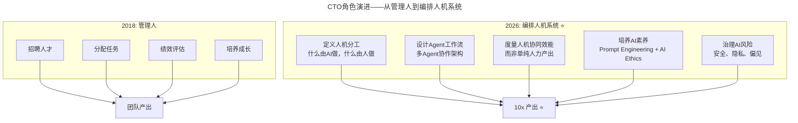
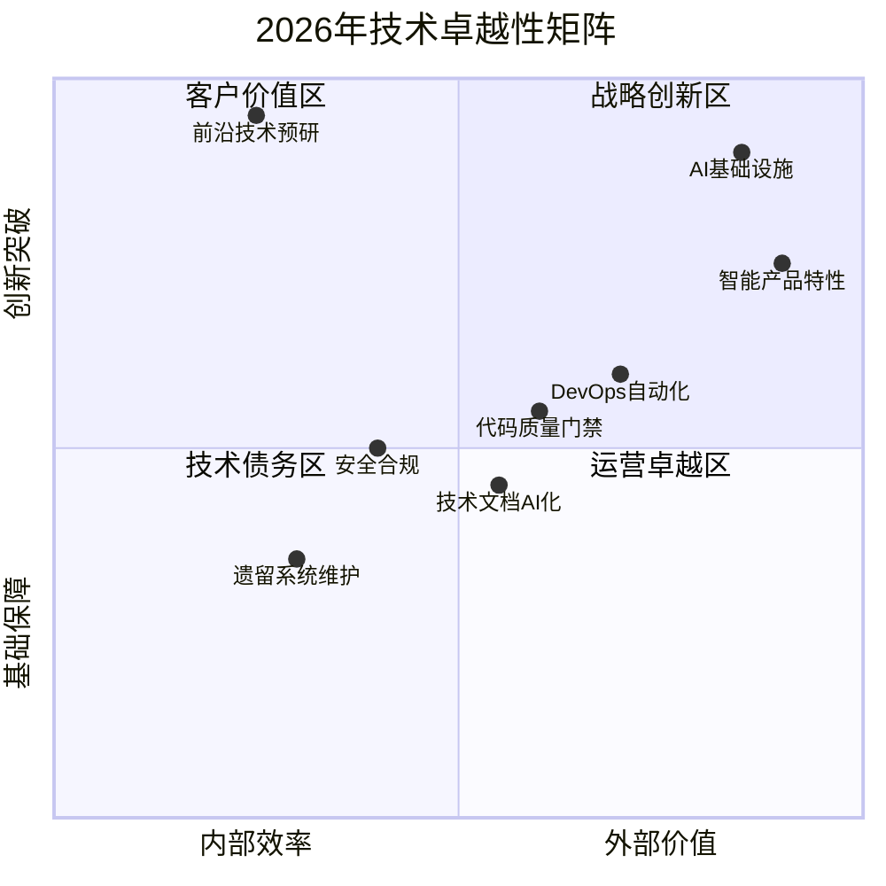

# 第180讲 | 钟忻：成为“温格”—聊聊如何当好CTO

> **适用范围**：CTO、技术合伙人及各阶段技术管理者，尤其是希望从"管理人"升级为"编排人机协作系统"的技术领导者；同样适用于关注长期主义、人才培养与技术卓越性在AI时代新内涵的从业者。
>
> **更新摘要（v2 · 2026-08 更新）**：
> - 结构化升级为 6 节骨架（导言 / 核心方法论 / 关键流程 / 工具与实战 / 常见误区 / 进阶延展）
> - 将温格执教哲学全面升级为AI时代版本：从"管理球员"到"编排人机协作系统"
> - 补充2026年"温格式领导力"的核心特质映射与可执行建议
> - 保留全部Mermaid图、对照表与自检清单

---

## 1. 导言

在长达34年的教练生涯中，温格执教阿森纳长达22年时间，教授带领枪手共获得了3座英超冠军和7座足总杯冠军，也曾在欧冠击败过皇马巴萨，闯入决赛。尤其是0304赛季，英超49场不败的神话，至今无人打破。

作为多年的阿森纳球迷和六年的技术管理者，有时遭遇管理困境的时候，温格这样的足坛大咖的经历，就是活生生的例子，可以学习和借鉴。另外，我也发现了一些有趣的现象，很多球迷讨论的关于球员和主教练的话题换成程序员和CTO，都同样适用。

2026年，GPT-5.5、DeepSeek V4等AI Agent的普及让这个隐喻有了全新的内涵——现代CTO更像是一个**"人机协同球队"的主教练**。温格所代表的**长期主义、人才培养、技术追求、财务纪律**这些品质，在AI时代不仅没有过时，反而更加珍贵。

---

## 2. 核心方法论

### 2.1 专业能力——独特的"执教风格"

作为足坛知名的主教练，通常都有自己擅长的执教风格。温格最为人称道的就是他的球队打法，强调地面进攻，层层推进，犹如行云流水，让人眼花缭乱。

对于作为CTO的我们来说，必须得有自己的技术专长，结合自己的技术积累，来做产品创新，使得公司在产品上具备独到的"风格"，也就是核心竞争力。CTO的技术视野也很重要，提出的技术理念要符合技术发展的趋势，给团队正确的技术指引，避免选择错误的技术路线。

**AI时代升级**："美丽足球"的AI版——技术卓越性（Technical Excellence）。在AI可以自动生成代码的时代，追求"美丽代码"而不仅是"能跑就行"。

### 2.2 识人用人——培养"明星球员"

温格不是靠砸重金来打造心目中的梦幻阵容，而是有着擅长点石成金的用人能力。比如亨利，在尤文图斯看了一年饮水机，被温格带到阿森纳，很快成长为了世界顶级的球员。再比如法布雷加斯，年纪轻轻就被温格委以重任，最后也成长成为世界级的后腰。

作为CTO，人员的招聘培养是非常核心的工作。从招聘开始，就要关注团队成员的成长，识别出"明星球员"，把自己的经验倾囊相授，让他能迅速的成长，并委以重任。

**AI时代升级**：从"培养年轻人"到"培养AI-Augmented工程师"。让每个人+AI发挥10倍效能。AI没有降低对人的要求，而是提高了天花板。2026年的"高潜力人才"标准是：技术基础扎实 + AI协作能力强 + 业务理解深刻。

### 2.3 管理风格——管理好"更衣室"

在世界足坛，既有不少"铁腕"主帅，强调球队纪律，擅长从严治军，也有"打鸡血"型的教练，善于鼓动和激励球员。温格显然不是铁腕型执教风格，他对球员是比较包容的。

作为CTO，一定有着自己独到的管理风格。不管什么管理风格，都是为了促成团队团结一心，来保证目标的达成。在团队管理上，要想短期出成绩，拥有广泛的人脉，能从外部引入人才是非常重要的。

**AI时代升级**：从"管理球员"到"编排人机协作系统"——定义人机分工、设计Agent工作流、度量人机协同效能、培养AI素养、治理AI风险。

### 2.4 坚持梦想——长期主义的坚守

得到劳伦斯奖，对于任何一个体育界人士，无疑都是非常值得骄傲的。温格能做到，归根结底在于他多年坚持自己的梦想，坚持践行自己的执教理念。

毋庸置疑，每个CTO心目中都应该有一个希望到达的彼岸。但也许更大的梦想，是成为温格那样的人，对时代有影响，也改变了很多人的人生。

**AI时代升级**：在AI hype中保持定力。区分核心技术信仰（如架构原则、工程文化）和具体技术选型（如用哪个框架）。核心信仰要长期坚持，技术选型可以灵活调整。

### 2.5 温格特质 vs AI时代CTO能力映射

| 温格的核心特质 | 原文解读 | 2026年AI时代的新内涵 |
|--------------|---------|---------------------|
| **培养年轻人** | 给予年轻球员机会 | 培养AI-Augmented工程师：让每个人+AI发挥10倍效能 |
| **美丽足球** | 追求技术完美 | Engineering Excellence + AI Quality：用AI保证代码质量的同时追求优雅 |
| **长期主义** | 22年坚守阿森纳 | 在AI hype中保持定力：不盲目追热点，坚持技术愿景 |
| **财务平衡** | 转会市场精打细算 | AI投资ROI导向：每笔技术投入都要有可衡量的业务回报 |
| **信任球员** | 放手让球员发挥 | 信任团队+AI协作：建立Human-AI协同的工作文化 |

---

## 3. 关键流程

### 3.1 从"管理球员"到"编排人机协作系统"



上图展示了CTO角色从2018年到2026年的演进。传统CTO关注招聘、分配、评估和培养四个管理动作；AI时代CTO新增了人机分工定义、Agent工作流设计、协同效能度量、AI素养培养和AI风险治理五大职责，目标是实现10倍产出。

### 3.2 AI时代人才培养新范式

| 维度 | 传统模式 (2018) | AI增强模式 (2026) |
|------|----------------|-------------------|
| **学习路径** | 师徒制 + 培训课程 | AI Mentor 7x24 + 个性化学习路径 |
| **技能获取** | 3-5年成为高级工程师 | 1-2年+AI = 高级工程师产出 |
| **知识传承** | 口口相传，容易流失 | 知识库RAG化：组织经验永久沉淀 |
| **评估方式** | 主管主观评价 | 数据驱动：代码质量、AI利用率、业务影响 |

### 3.3 2026年技术卓越性矩阵



上图以四象限矩阵展示2026年技术卓越性的分布。AI基础设施和智能产品特性位于战略创新区和客户价值区，是高价值投入方向；遗留系统维护位于技术债务区，需控制投入；前沿技术预研虽内部效率低但创新突破价值极高。

### 3.4 AI时代的成本计算框架

```
总成本 = 人力成本 + AI API成本 + 云资源成本 + 技术债务利息 + 机会成本
总价值 = 业务收入提升 + 效率提升 × 时间 + 团队成长资产 + 技术壁垒
ROI = 总价值 / 总成本

目标：每个AI项目的 ROI > 5x
```

---

## 4. 工具与实战

### 4.1 ⭐2026可执行建议

**人机协作系统建设**：
1. **制定AI使用宪章**：明确团队在使用AI时的边界和最佳实践
2. **建立Agent架构师角色**：专门负责设计和优化人机协作流程
3. **实施"AI配额制"**：鼓励实验，但要求每个AI项目必须有明确的业务价值假设

**技术卓越性建设**：
1. **建立AI Code Review标准**：不仅看代码是否"能跑"，还要看是否"优雅、可维护、AI-friendly"
2. **投资开发者体验（DX）**：工具链的顺畅程度直接影响工程效率
3. **平衡技术债与innovation**：像温格一样，既要有长期视野，又要解决当下问题

**保持技术热爱**：
1. 鼓励"深度技术探索时间"（如Google的20% time）
2. 组织内部Tech Talk，分享非AI能替代的技术洞察
3. 认可和奖励"技术匠心"：不仅看交付速度，也看代码质量

### 4.2 ⭐2026年CTO自我检视清单

**战略层面**：
- [ ] 我是否有清晰的技术愿景，且团队能理解并认同？
- [ ] 我是否在AI hype中保持了战略定力？
- [ ] 我的决策是短期利益驱动还是长期价值导向？

**团队层面**：
- [ ] 我是否给了年轻人足够的成长空间和试错机会？
- [ ] 我是否建立了"AI-Augmented"的人才培养体系？
- [ ] 团队是否具备自主决策的能力（像场上的球员）？

**工程层面**：
- [ ] 我们是否追求"美丽代码"而不仅是"能跑就行"？
- [ ] AI工具的使用是否有规范和最佳实践？
- [ ] 技术债是否在可控范围内？

**文化层面**：
- [ ] 团队是否保持了对技术的热爱和好奇心？
- [ ] 是否建立了开放、透明、敢于说真话的文化？
- [ ] 失败是否被当作学习机会而非惩罚理由？

---

## 5. 常见误区

### 5.1 好球员未必是好教练

亨利执教摩纳哥三个月就黯然下课。在技术圈，好的程序员不一定就能成为好的CTO。技术能力是基础，但管理能力、战略眼光、沟通能力同样不可或缺。

### 5.2 主教练是高危行业——背锅侠

球迷调侃说主教练是个高危行业，就是背锅侠。在技术圈，CTO也经常是背锅的角色。但不能因为怕背锅就不敢做决策，关键是要有审慎的判断。

### 5.3 过度包容导致球员迟迟不成长

温格对球员比较包容，但也经常被球迷诟病，有的年轻球员球技迟迟没有起色。CTO在管理中也需要平衡包容与严格要求，不能一味宽容。

### 5.4 AI时代忽视人机协作模式变革

McKinsey 2026报告显示：86%企业承认AI转型面临组织架构变革困难。传统KPI/OKR体系失效风险：如何衡量"AI辅助产出"vs"人工产出"？这是AI时代CTO必须解决的核心难题。

### 5.5 在AI hype中迷失方向

AI领域变化太快，容易陷入追新不追需的陷阱。需要区分核心技术信仰和具体技术选型，核心信仰要长期坚持，技术选型可以灵活调整。

---

## 6. 进阶延展

### 6.1 传递对技术的热爱和不懈的追求

温格传递给世界的是他对足球的热爱。对技术的热爱和不懈的追求，也许就是我们作为CTO和技术管理者能够传递的最核心的价值。

**2026现实**：
- 在AI可以自动生成代码的时代，人对技术的热情成了稀缺资源
- 新挑战：如何让团队在AI辅助下依然保持对技术的inner drive？

### 6.2 真实案例：Jane Xu的长期影响

以前lab的CTO，前IBM杰出工程师Jane Xu，已经70岁的老太太。回想起刚加入IBM的时候，看着lab在她的领导下从很小成长到几千人的规模。她每个月都会跟技术梯队的人一起开会，对大家进行成长辅导。那些年在IBM学到的很多技术和管理的理念，现在还在给团队传递和践行。

### 6.3 总结

钟忻总用温格的执教哲学来诠释CTO的角色，这是一个跨越领域的精彩类比。站在2026年回看，温格所代表的长期主义、人才培养、技术追求、财务纪律这些品质，在AI时代不仅没有过时，反而更加珍贵。

> 2026年的CTO，你不仅是技术团队的教练，更是**人机协同系统的总设计师**。像温格打造一支踢出美丽足球的队伍一样，你需要打造一支人与AI和谐共舞、既有技术激情又有商业敏感、既能快速迭代又能长期坚守的卓越团队。这才是AI时代最稀缺的领导力。

### 6.4 作者简介

钟忻，联通沃云CTO，清华大学自动化硕士。曾在 Turbolinux、IBM、Intel 等多家 IT 公司担任资深软件工程师。主导了多个大型行业云平台的产品研发和运营，包括乐视云平台和海航eKing Cloud基础云平台等。目前负责联通沃云的整体研发工作。

---

*本注解基于2026年8月的最新技术动态生成，包括GPT-5.5、DeepSeek V4的普及，以及84%开发者使用AI编程的行业现状。温格的领导智慧跨越时空，值得每一位技术管理者深思。*
