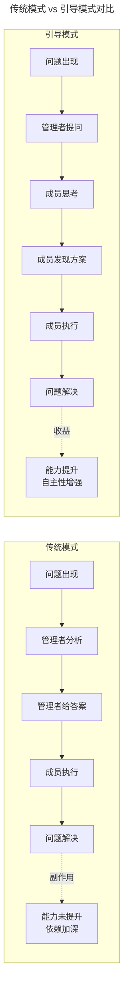
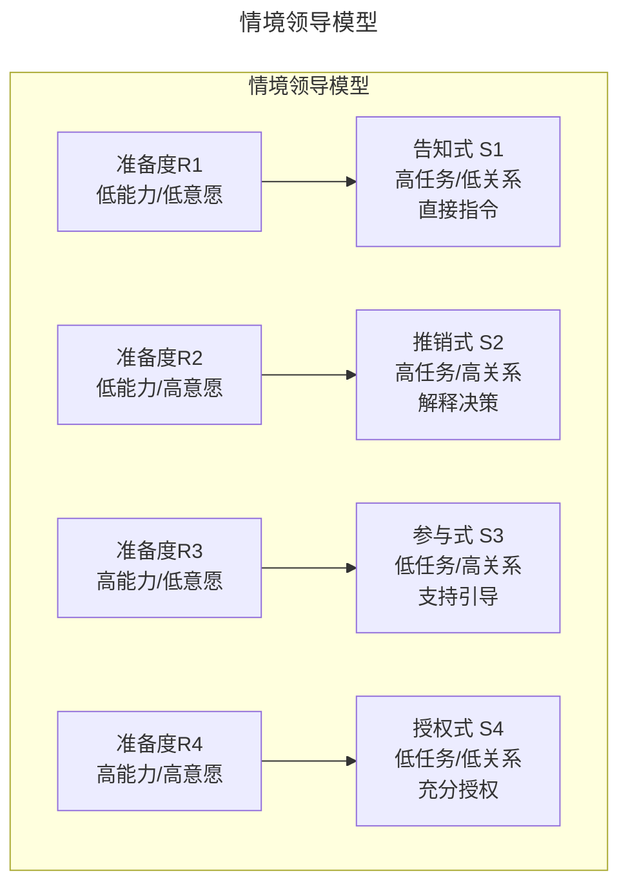
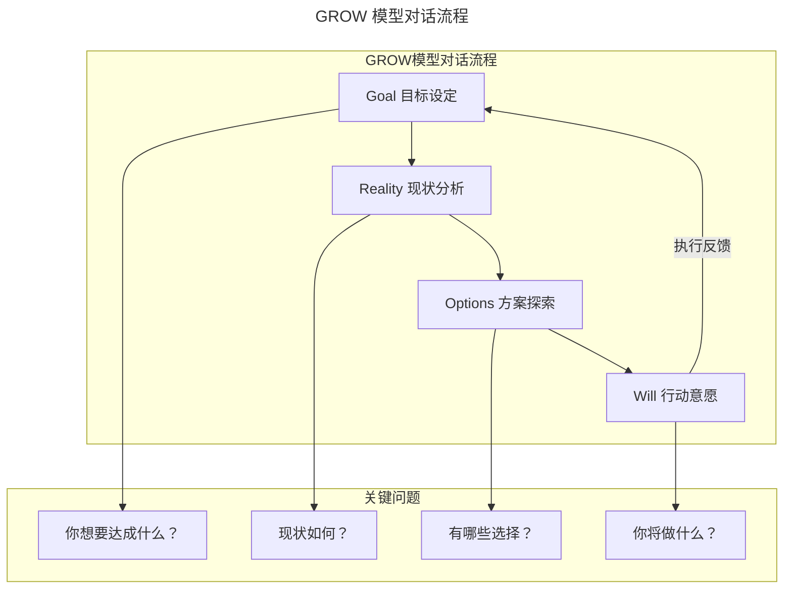
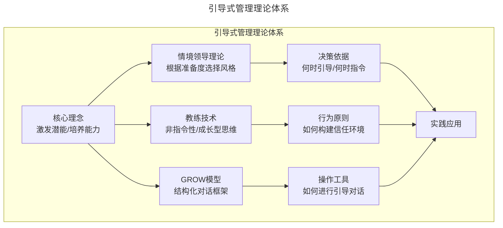
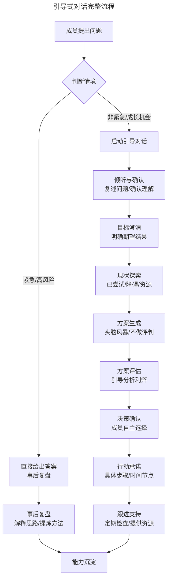
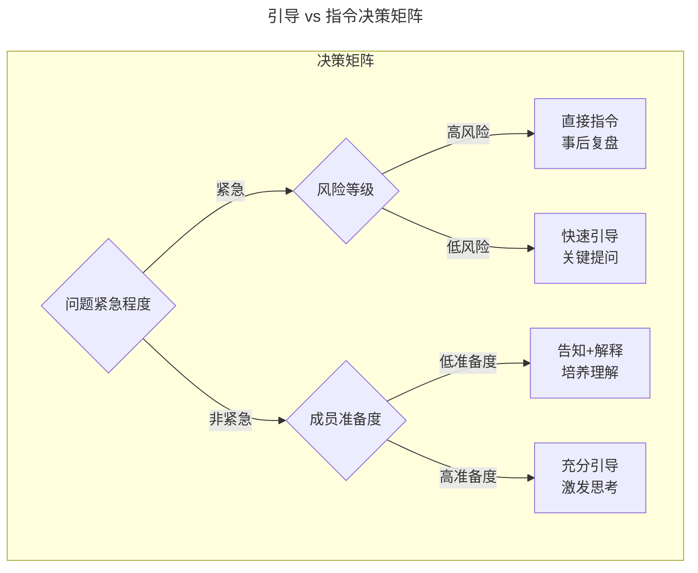
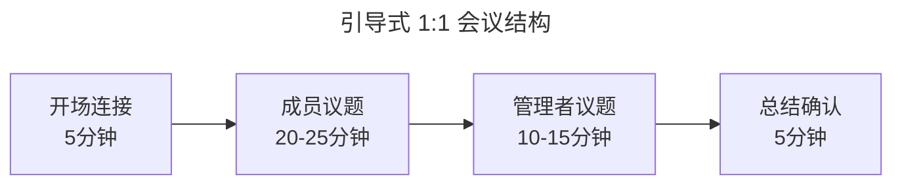

# 引导式管理：从指令型领导到教练型领导的转型

> **适用范围**：技术团队管理者（一线 Tech Lead 至高管）、工程经理、项目经理，以及希望从"个人贡献者"向"团队赋能者"转型的资深工程师。适用于一对一辅导、代码评审、问题排查、新人培养等需要激发他人思考的场景。
>
> **更新摘要（v2 · 2026-08 更新）**：
> - 结构化升级为 6 节骨架（导言 / 核心方法论 / 关键流程 / 工具与实战 / 常见误区 / 进阶延展）
> - 为全部 Mermaid 图补充 `--- title: ... ---` frontmatter，并在每张图后追加文字解读
> - 整合 2025-2026 AI 辅助教练、远程团队引导、敏捷教练体系等趋势数据
> - 将原"参考资料"章节融入"进阶延展"，形成统一延伸阅读入口

---

## 1. 导言

### 1.1 引导式管理的本质

引导式管理（Facilitative Leadership）是一种以提问和引导为核心的管理方法论，其本质是将管理者的角色从"答案提供者"转型为"能力激发者"。这种转型要求管理者抑制直接给出解决方案的本能冲动，转而通过结构化提问帮助团队成员自主发现答案、构建解决方案。

在技术管理语境下，引导式管理尤为重要。技术工作的本质是问题解决，而问题解决能力的培养远比单一问题的解决更具价值。当管理者习惯性地直接给出答案时，虽然短期内提高了效率，却剥夺了团队成员成长的机会，长期来看会形成团队对管理者的依赖，削弱组织的整体问题解决能力。

### 1.2 Why：为什么需要从"给答案"转向"做引导"

- **能力沉淀**：直接给答案只能解决眼前问题，引导提问才能让方法留在团队内部
- **组织韧性**：减少对关键人物的依赖，降低单点风险
- **管理杠杆**：管理者的核心价值是"通过他人达成目标"，而非亲力亲为
- **成长动机**：被信任和尊重的成员更具主动性、责任感与归属感

### 1.3 What：管理者角色转型对照

传统指令型管理者与现代教练型领导者的核心差异体现在以下维度：

| 维度 | 指令型管理者 | 教练型领导者 |
|------|-------------|-------------|
| 核心行为 | 给答案、下指令 | 提问题、做引导 |
| 思维模式 | "我来解决" | "你来发现" |
| 能力培养 | 隐性传递、效率优先 | 显性培养、成长优先 |
| 决策归属 | 管理者决策 | 引导自主决策 |
| 团队依赖度 | 高依赖 | 低依赖、自主性强 |
| 适用场景 | 紧急、高风险、新手期 | 非紧急、成长期、复杂问题 |



上图揭示了两条路径的根本差异：传统模式以"问题解决"为终点，却埋下"能力未提升、依赖加深"的隐患；引导模式以"问题解决 + 能力提升"为双重目标，用一次"慢"换取后续无数次"快"。管理者需要意识到，短期效率与长期组织能力之间往往存在权衡，引导式管理正是倾向于后者的投资。

### 1.4 适用范围

本文方法适用于非紧急、可试错、具备成长价值的场景；对于紧急、高风险、新人期等场景，应结合情境领导理论灵活切换风格（详见第 2、4 节）。

---

## 2. 核心方法论

### 2.1 教练技术（Coaching）

教练技术源于体育领域，后被引入管理学界。其核心理念是：每个人都有解决问题的潜能，教练的角色是激发这种潜能而非替代思考。在技术管理中，教练技术强调以下原则：

**非指令性原则**：教练不提供解决方案，而是创造条件让被教练者自己找到答案。这基于一个基本假设——被教练者比教练更了解问题的具体情境，因此更有可能找到最适合的解决方案。

**成长型思维**：基于 Carol Dweck 的研究，教练型管理者相信能力可以通过努力和学习得到发展。这种信念直接影响管理者的行为选择——当管理者相信团队成员有能力解决问题时，更倾向于采用引导而非指令。

**心理安全感**：Amy Edmondson 的研究表明，心理安全感是团队效能的关键因素。引导式管理通过鼓励提问、接纳不同观点、允许试错，构建心理安全环境，使团队成员敢于表达、勇于尝试。

### 2.2 情境领导理论

Paul Hersey 和 Ken Blanchard 提出的情境领导理论（Situational Leadership Theory）指出，有效的领导风格应随下属的准备度（Readiness）而调整。准备度包含两个维度：能力（完成任务的知识和技能）和意愿（信心、承诺和动机）。



情境领导模型为"何时引导、何时指令"提供了决策依据。图中四象限清晰映射了准备度与风格的对应关系：R1-R2 阶段任务导向更强，R3-R4 阶段关系导向更强。在引导式管理语境下：

- **R1 阶段（新人/新任务）**：采用告知式风格，直接给出明确指令和答案。此时引导可能造成困惑和挫败感。
- **R2 阶段（学习期）**：采用推销式风格，在给出答案的同时解释原因，帮助建立理解框架。
- **R3 阶段（成长期）**：采用参与式风格，通过引导式提问帮助成员梳理思路，管理者更多扮演支持者角色。
- **R4 阶段（成熟期）**：采用授权式风格，充分信任成员的判断，仅在必要时提供引导。

### 2.3 GROW 模型

GROW 模型是教练技术中最经典的对话框架，由 Sir John Whitmore 提出，包含四个阶段：

**G - Goal（目标设定）**：明确期望达成的结果
- "你希望达成什么目标？"
- "这个目标对你意味着什么？"
- "如何衡量目标的达成？"

**R - Reality（现状分析）**：客观审视当前状况
- "目前的情况是怎样的？"
- "你已经尝试了什么？效果如何？"
- "有哪些障碍和资源？"

**O - Options（方案探索）**：探索可能的解决方案
- "有哪些可能的解决方案？"
- "如果没有任何限制，你会怎么做？"
- "还有其他可能性吗？"

**W - Will（行动意愿）**：确定行动承诺
- "你选择哪个方案？为什么？"
- "你打算什么时候开始？"
- "需要什么支持？"



GROW 模型以"行动意愿 → 执行反馈 → 目标设定"形成闭环，避免对话停留在头脑风暴层面而无法落地。使用 GROW 时需注意：目标设定应具体可衡量，现状分析应客观不加评判，方案探索应避免过早收敛，行动意愿应形成可追踪的承诺。

### 2.4 理论框架整合



三大理论形成互补关系：情境领导理论回答"何时引导"，教练技术回答"以何种心态引导"，GROW 模型回答"如何具体引导"。三者共同构成引导式管理的完整方法论体系，管理者在实践中应将其作为整体而非孤立工具使用。

---

## 3. 关键流程

### 3.1 提问技巧

提问是引导式管理的核心技能。有效的提问能够激发思考、拓展视角、促进发现。根据问题的开放程度，可分为封闭式问题和开放式问题：

**封闭式问题**：以"是/否"或具体信息作答，适用于确认事实、聚焦话题。
- "这个问题你之前遇到过吗？"
- "你尝试过重启服务吗？"

**开放式问题**：需要思考和阐述，适用于激发思考、探索可能性。
- "你觉得问题的根源可能在哪里？"
- "如果重来一次，你会怎么做？"

**强力问题（Powerful Questions）**：能够引发深度思考、带来新洞察的问题。特征包括：
- 以"什么"或"如何"开头，而非"为什么"（避免防御性反应）
- 关注未来可能性，而非过去原因
- 简短有力，通常不超过 7 个词

### 3.2 苏格拉底式引导

苏格拉底式提问（Socratic Questioning）通过一系列问题引导对方发现答案，而非直接告知。这种方法源于古希腊哲学家苏格拉底的"产婆术"——帮助他人"生出"自己的思想。

**六种苏格拉底式提问类型**：

1. **澄清概念**："你说的'性能问题'具体指什么？"
2. **探究假设**："这个方案基于什么假设？这些假设成立吗？"
3. **寻找证据**："有什么数据支持这个判断？"
4. **推导后果**："如果采用这个方案，可能带来什么影响？"
5. **替代视角**："从用户角度看，这个问题是什么样的？"
6. **质疑问题**："我们问的问题本身是否正确？"

### 3.3 强力问题清单

以下是技术管理场景中常用的高效引导问题：

**问题诊断类**：
- "你观察到的现象是什么？"
- "这个问题在什么情况下出现？什么情况下不出现？"
- "如果必须用一句话描述问题的本质，你会怎么说？"

**方案探索类**：
- "你目前想到了哪些可能的解决方案？"
- "每个方案的优缺点是什么？"
- "如果资源/时间没有限制，你会怎么做？"
- "有没有我们忽略的可能性？"

**决策支持类**：
- "你倾向于哪个方案？为什么？"
- "什么因素让你犹豫？"
- "如果选择这个方案，最坏的情况是什么？你能接受吗？"

**行动促进类**：
- "下一步你打算做什么？"
- "需要什么支持？"
- "什么时候开始？如何衡量进展？"

**反思成长类**：
- "从这次经历中学到了什么？"
- "如果重来一次，会有什么不同？"
- "这个经验如何迁移到其他场景？"

### 3.4 引导式对话流程



该流程的关键在于入口处的情境判断——紧急/高风险走"指令+复盘"路径，非紧急/成长机会走"引导+支持"路径。无论走哪条路径，最终都汇入"能力沉淀"这一共同终点，确保短期效率与长期成长兼顾。引导路径中的"方案生成"环节应坚持不做评判，避免扼杀创意；"行动承诺"环节则需明确具体步骤与时间节点，避免对话流于空谈。

---

## 4. 工具与实战

### 4.1 决策矩阵：何时引导、何时指令

管理者需要在"给答案"和"做引导"之间做出判断。以下决策矩阵提供了参考框架：



决策矩阵以"紧急程度"为第一分流维度，再结合"风险等级"与"成员准备度"二级判断。图中四类出口分别对应四种管理动作，管理者应在 10 秒内完成判断。

**决策考量因素**：

| 因素 | 倾向指令 | 倾向引导 |
|------|---------|---------|
| 时间紧迫性 | 紧急、无思考时间 | 充裕、有探索空间 |
| 风险等级 | 高风险、后果严重 | 低风险、可试错 |
| 问题复杂度 | 简单、标准问题 | 复杂、需创新思考 |
| 成员经验 | 新手、缺乏基础 | 资深、有经验积累 |
| 成长价值 | 低、常规问题 | 高、典型学习场景 |
| 成员状态 | 焦虑、需要确定性 | 平稳、愿意探索 |

### 4.2 新人 vs 资深成员的引导策略

**新人引导策略**：

新成员处于 R1-R2 阶段，需要更多指导。引导策略应遵循"脚手架"原则——提供适当支持，随能力提升逐步撤除。

- **初期**：以告知为主，解释"为什么这样做"，建立理解框架
- **中期**：采用"思考-分享-讨论"模式，先让新人思考，再分享答案，最后讨论差异
- **后期**：逐步增加引导比例，从"给答案"过渡到"给线索"再到"问问题"

示例对话：
```
管理者：这个Bug你打算怎么排查？（引导开始）
新人：我不太确定...
管理者：没关系。你觉得问题可能出在哪个环节？（缩小范围）
新人：可能是数据库查询？
管理者：为什么这么想？（探究假设）
新人：因为错误日志显示超时...
管理者：很好。那如何验证这个假设？（引导行动）
```

**资深成员引导策略**：

资深成员处于 R3-R4 阶段，具备较强能力，引导重点在于拓展视角、激发创新。

- **尊重专业判断**：承认其在专业领域的优势
- **挑战思维盲点**：提出可能被忽略的角度
- **连接更大图景**：帮助看到技术决策的业务影响
- **促进知识传承**：引导其总结经验、指导他人

示例对话：
```
管理者：这个架构方案你考虑了哪些因素？（开放探索）
资深成员：性能、可扩展性、开发效率...
管理者：从运维角度看，有什么需要考虑的？（拓展视角）
资深成员：确实，部署复杂度我考虑不够...
管理者：如何平衡？（深化思考）
```

### 4.3 紧急 vs 非紧急场景处理

**紧急场景**：

紧急情况下，效率优先，采用"指令+复盘"模式：

1. **快速决策**：直接给出明确指令
2. **清晰传达**：说明要做什么、为什么
3. **事后复盘**：问题解决后，解释决策逻辑，提炼方法论

复盘框架：
- 当时的情况是什么？
- 我判断的依据是什么？
- 还有哪些可能性？
- 下次遇到类似情况，你会怎么做？

**非紧急场景**：

非紧急情况下，成长优先，采用"引导+支持"模式：

1. **充分倾听**：让成员完整描述问题
2. **引导探索**：通过提问帮助梳理思路
3. **支持决策**：尊重成员选择，提供必要资源
4. **跟进反馈**：关注执行过程，及时给予反馈

### 4.4 一对一会议中的引导

一对一会议（1:1 Meeting）是管理者与成员的定期沟通机制，是实践引导式管理的理想场景。

**会议结构建议**：



会议结构以"成员议题"为主体（占比约 50%），体现"员工主导"原则。开场连接用于建立心理安全感，总结确认用于形成可追踪的行动项。

**引导式 1:1 的关键实践**：

**开场提问**：
- "最近有什么想聊的？"
- "有什么进展或挑战？"

**深度探索**（当成员提出问题时）：
- "能具体说说吗？"
- "你觉得难点在哪里？"
- "你目前有什么想法？"

**目标引导**：
- "接下来一段时间，你想重点提升什么？"
- "我能怎么支持你？"

**避免常见错误**：
- 不要把 1:1 变成工作汇报会
- 不要主导话题，让成员说更多
- 不要急于给建议，先充分倾听

### 4.5 代码评审中的引导

代码评审（Code Review）是技术团队的核心实践，也是培养能力的重要场景。引导式代码评审关注"帮助作者学习"而非"指出错误"。

**引导式评审原则**：

**提问代替指令**：
- ❌ "这里应该用异步处理"
- ✅ "这个操作可能阻塞主线程，你觉得怎么处理比较好？"

**关注理解而非结果**：
- ❌ "改成这样..."
- ✅ "你当时是怎么考虑的？"

**引导自我发现**：
- ❌ "这里有 Bug"
- ✅ "如果输入为空，这段代码会怎样？"

**评审问题清单**：
- "这段代码的意图是什么？"
- "有没有考虑边界情况？"
- "这样写有什么潜在问题？"
- "有没有更简洁的实现方式？"
- "这段代码如何测试？"

### 4.6 问题排查中的引导

生产问题排查是技术工作的常见场景，也是培养问题解决能力的好机会。

**引导式排查框架**：

```mermaid
---
title: 引导式问题排查框架
---
graph TD
    A[问题报告] --> B[现象确认<br/>"你观察到了什么？"]
    B --> C[假设生成<br/>"可能的原因有哪些？"]
    C --> D[假设验证<br/>"如何验证这个假设？"]
    D --> E{假设成立？}
    E -->|是| F[制定方案<br/>"怎么修复？"]
    E -->|否| C
    F --> G[实施验证<br/>"如何确认修复有效？"]
    G --> H[复盘总结<br/>"学到了什么？"]
```

该框架遵循科学方法论的核心循环：观察 → 假设 → 验证 → 结论。当假设不成立时回到"假设生成"节点继续迭代，避免在没有验证的情况下仓促修复。最后的"复盘总结"是能力沉淀的关键环节。

**引导式排查对话示例**：

```
成员：服务响应很慢，不知道什么原因。

管理者：具体表现是什么？（现象确认）
成员：API响应时间从200ms变成了5秒。

管理者：什么时候开始的？（时间定位）
成员：今天上午10点左右。

管理者：那时有什么变化？（关联分析）
成员：好像刚发布了一个新版本...

管理者：新版本改了什么？（深入探究）
成员：加了一个新的数据库查询...

管理者：这个查询可能有什么问题？（假设生成）
成员：可能没有索引？

管理者：怎么验证？（假设验证）
成员：我看下执行计划...

[验证后确认是索引问题]

管理者：怎么修复？（方案制定）
成员：加索引，或者优化查询逻辑。

管理者：两个方案各有什么影响？（方案评估）
成员：加索引快但有风险，优化查询更稳但需要时间...

管理者：你倾向于哪个？（决策支持）
成员：先加索引应急，然后优化查询作为长期方案。

管理者：确认，执行后如何验证修复效果？（验证设计）
成员：监控响应时间...

管理者：从这次排查中学到了什么？（复盘总结）
成员：发布前要检查数据库变更的影响...
```

---

## 5. 常见误区

### 5.1 误区一：引导就是不给答案

引导的目的是帮助对方发现答案，而非刻意隐瞒。当引导无效时，应及时提供支持。

正确理解：引导是手段，成长是目的。当引导不能达成目的时，应调整策略，包括直接提供线索、部分答案或完整方案，并辅以事后复盘。

### 5.2 误区二：所有情况都引导

不加区分地使用引导，在紧急情况下可能延误时机，在新人身上可能造成挫败。

正确做法：根据情境选择策略，建立决策框架（参见第 4.1 节决策矩阵）。紧急、高风险、新手期场景应优先指令；非紧急、低风险、成长期场景才适合引导。

### 5.3 误区三：引导就是问"你怎么想"

简单的"你怎么想"缺乏引导性，可能让对方不知如何回答。

正确做法：使用结构化问题，逐步深入，帮助梳理思路。参考苏格拉底式提问与强力问题清单，针对不同阶段（诊断、探索、决策、行动、反思）设计对应问题。

### 5.4 误区四：引导后不跟进

引导后缺乏跟进，成员可能迷失方向，问题悬而未决。

正确做法：确认行动承诺（具体步骤、时间节点），定期跟进进展，提供必要支持。将引导结果纳入 1:1 跟踪机制，形成闭环。

### 5.5 误区五：用引导代替反馈

引导和反馈是不同的工具。当需要指出问题时，直接反馈比引导更有效。

正确做法：区分场景，需要反馈时直接反馈（使用 SBI 模型），需要思考时使用引导（使用 GROW 模型）。两者不可混淆，否则既无法及时纠偏，也无法激发深度思考。

### 5.6 避坑指南汇总

| 误区 | 典型表现 | 修正策略 |
|------|---------|---------|
| 时间成本焦虑 | "引导太慢，不如自己干" | 区分场景；短期慢换来长期快 |
| 管理者习惯 | 习惯解决问题而非培养人 | 意识转变 + 刻意练习提问 |
| 成员抵触 | "直接告诉我怎么做就行" | 沟通意图；渐进过渡；尊重差异 |
| 引导失败 | 引导半天无果 | 识别边界；提供支持；复盘改进 |

---

## 6. 进阶延展

### 6.1 AI 辅助教练

人工智能正在改变管理实践。AI 辅助教练工具可以：

- **实时建议**：在对话过程中提示引导问题
- **行为分析**：分析管理者的沟通模式，识别改进空间
- **个性化指导**：根据管理者的风格和挑战提供定制建议

2025-2026 年的趋势：
- AI 教练助手成为管理者的标配工具
- 自然语言处理技术使 AI 能够理解对话情境
- 数据驱动的管理能力发展路径逐步成熟

管理者应：
- 拥抱 AI 工具，提升引导效率
- 保持人际连接的核心价值
- 关注 AI 无法替代的领域：情感支持、复杂判断、关系构建

### 6.2 远程团队引导

远程和混合办公模式成为常态，引导式管理需要适应新环境：

**挑战**：
- 非语言信息缺失，难以判断对方状态
- 沟通异步化，引导对话可能被打断
- 建立信任更加困难

**应对策略**：
- 增加视频沟通，获取更多非语言信息
- 使用协作工具，让思考过程可视化
- 更频繁的 1:1，保持连接
- 明确沟通规范，减少误解

**工具支持**：
- Miro/Mural：可视化协作，支持引导式工作坊
- Loom：异步视频，支持深度沟通
- Slack/Teams：即时沟通，支持快速引导

### 6.3 敏捷教练体系

敏捷方法论强调自组织团队，与引导式管理理念高度契合。敏捷教练（Agile Coach）角色的发展为引导式管理提供了新视角：

**敏捷教练的核心能力**：
- 教练（Coaching）：帮助个人和团队发现答案
- 引导（Facilitating）：引导团队协作和决策
- 指导（Mentoring）：分享经验和最佳实践
- 教学（Teaching）：传授敏捷知识和技能

**对技术管理的启示**：
- 管理者角色向"服务型领导"（Servant Leadership）演进
- 团队自组织能力成为核心竞争力
- 引导技能成为管理者的必备能力

**实践建议**：
- 学习敏捷教练的方法论
- 在团队中引入回顾会议（Retrospective）等引导式实践
- 培养团队的引导能力，实现"人人都是引导者"

### 6.4 收益分析

引导式管理的收益体现在三个层面：

**对团队成员**：能力提升、主动性增强、职业成长、工作满意度提高。

**对管理者**：时间释放、决策质量提升、团队建设、管理效能从"救火"转向"预防"。

**对组织**：组织韧性、知识沉淀、创新活力、人才密度提升。

### 6.5 挑战与应对

| 挑战 | 应对策略 |
|------|---------|
| 时间成本 | 区分场景，紧急直接指令；投资长期收益；建立标准流程 |
| 管理者习惯 | 意识转变：核心价值是"通过他人达成目标"；技能训练；反馈机制 |
| 成员抵触 | 沟通意图；渐进过渡；尊重差异 |
| 引导失败 | 识别边界；提供支持；复盘改进 |

### 6.6 延伸阅读

**经典著作**：
- Whitmore, J. (2017). *Coaching for Performance* (5th ed.). Nicholas Brealey Publishing.
- Hersey, P., Blanchard, K., & Johnson, D. (2013). *Management of Organizational Behavior* (10th ed.). Pearson.
- Edmondson, A. (2019). *The Fearless Organization*. Wiley.
- Dweck, C. (2006). *Mindset*. Random House.

**研究论文**：
- Edmondson, A. (1999). Psychological Safety and Learning Behavior in Work Teams. *Administrative Science Quarterly*, 44(2), 350-383.
- Grant, A. M. (2014). Autonomy support, relationship support and autonomy support in coaching. *Social and Personality Psychology Compass*, 8(8), 417-429.

**实践指南**：
- Bungay Stanier, M. (2016). *The Coaching Habit*. Box of Crayons Press.
- Fournies, F. F. (2000). *Coaching for Improved Work Performance*. McGraw-Hill.

**在线资源**：
- International Coaching Federation (ICF): https://coachingfederation.org
- Scrum Alliance - Agile Coaching: https://www.scrumalliance.org

---

*本文档基于现代管理理论和技术管理实践编写，适用于技术管理者从一线到高管各层级。建议结合实际场景持续实践和反思，形成个人化的引导式管理风格。*
