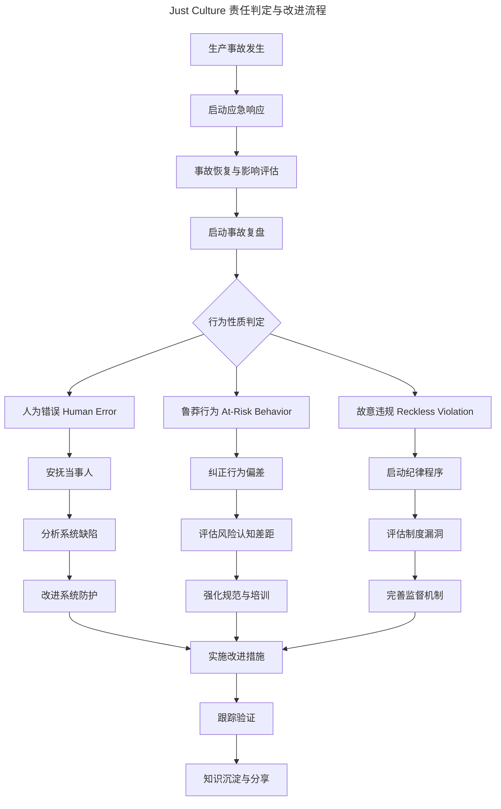

# Bug引发事故的责任追究：从无指责文化到Just Culture实践

> **适用范围**：技术团队管理者、SRE/运维负责人、事故复盘协调人、工程效能团队成员。适用于生产事故后的责任判定、复盘流程设计、防御性工程体系建设，以及构建学习型工程文化。
>
> **更新摘要（v2 · 2026-08 更新）**：
> - 结构化升级为 6 节骨架（导言 / 核心方法论 / 关键流程 / 工具与实战 / 常见误区 / 进阶延展）
> - 为 Mermaid 决策流程图补充 `--- title: ... ---` frontmatter，并在图后追加文字解读
> - 补充 2025-2026 年 AI 辅助根因分析、AIOps 自动化事故响应、安全左移等趋势数据
> - 将原"参考资料"章节融入"进阶延展"，形成统一延伸阅读入口

---

## 1. 导言

软件系统中 Bug 引发的生产事故是工程组织的常态而非例外。当事故发生后，组织如何处理责任问题，直接影响团队的心理安全感、创新意愿和系统可靠性的持续改进。

### 1.1 Why：责任追究为何是个难题

- **过度追责**会导致隐瞒问题、恐惧文化，事故信号被压制
- **完全免责**会削弱责任意识，纵容鲁莽行为
- 关键在于区分"系统缺陷"与"个人过失"，在无指责与问责之间建立平衡

### 1.2 What：本文提供的体系

本文从责任追究的理论基础出发，构建 Bug 事故分类体系，阐述 Just Culture 实践框架与 Blameless Postmortem 机制，为技术管理者提供系统化的事故责任处理方法论。

### 1.3 适用范围

适用于 P0-P3 各级生产事故的责任判定与复盘，覆盖逻辑缺陷、集成故障、配置错误、性能退化、安全漏洞等典型根因场景。

---

## 2. 核心方法论

### 2.1 无指责文化（Blameless Culture）

无指责文化的核心理念是：**系统设计缺陷是事故的根本原因，而非个体失误**。该理论源于认知心理学与安全工程研究，认为人在复杂系统中的行为受系统约束驱动，个体错误只是系统脆弱性的表征。

关键原则：
- 错误是系统问题的信号，而非个人缺陷
- 追问"系统为何允许该错误发生"而非"谁犯了错"
- 建立心理安全感，鼓励主动报告问题

### 2.2 Just Culture

Just Culture 由 David Marx 于 2001 年提出，是 Blameless Culture 的进阶版本。其核心区分了**可容忍的人为错误**与**应追责的故意违规**，在无指责与问责之间建立平衡。

Just Culture 的三类行为判定：

| 行为类型 | 定义 | 处理方式 |
|---------|------|---------|
| 人为错误（Human Error） | 无意中的疏忽或判断失误 | 安抚（Console），改进系统 |
| 鲁莽行为（At-Risk Behavior） | 无意中承担了不合理风险 | 纠正（Coach），强化规范 |
| 故意违规（Reckless/Intentional Violation） | 明知故犯，蓄意无视规则 | 追责（Discipline），制度执行 |

### 2.3 问责制（Accountability）

问责制强调**对结果负责**而非**对过失受罚**。其本质区别在于：

- **惩罚导向（Punitive）**：关注"谁做错了"，结果是恐惧与隐瞒
- **问责导向（Accountable）**：关注"如何修复与预防"，结果是学习与改进

### 2.4 Bug 事故分类体系

根据事故的根因与影响维度，可将 Bug 事故分为以下类别：

**按根因分类**：

| 类别 | 典型场景 | 责任判定倾向 |
|------|---------|-------------|
| 逻辑缺陷 | 条件判断遗漏、边界条件未覆盖 | 系统改进（测试覆盖、Code Review） |
| 集成故障 | 服务间接口变更未同步、依赖版本冲突 | 流程改进（变更管理、契约测试） |
| 配置错误 | 环境配置不一致、Feature Flag 误操作 | 工程改进（Infrastructure as Code、配置校验） |
| 性能退化 | 查询未优化、缓存策略失效 | 监控改进（性能基线、容量规划） |
| 安全漏洞 | 输入校验缺失、权限控制遗漏 | 安全改进（安全扫描、威胁建模） |

**按影响等级分类**：

| 等级 | 定义 | 响应要求 |
|------|------|---------|
| P0 - 紧急 | 核心功能不可用，大规模用户受影响 | 立即响应，15分钟内启动应急 |
| P1 - 严重 | 重要功能受损，部分用户受影响 | 1小时内响应，启动事故流程 |
| P2 - 一般 | 非核心功能异常，影响有限 | 当日处理，纳入迭代 |
| P3 - 轻微 | 体验性问题，无功能影响 | 排期修复 |

---

## 3. 关键流程

### 3.1 Just Culture 责任判定流程

以下决策流程图描述了事故发生后基于 Just Culture 的责任判定路径：



该流程的核心在于"行为性质判定"这一分流节点：人为错误走安抚与系统改进路径，鲁莽行为走纠正与培训路径，故意违规走纪律程序与监督完善路径。三条路径最终都汇入"实施改进措施 → 跟踪验证 → 知识沉淀"，体现了"无论责任归属，系统都必须改进"的原则。

### 3.2 判定标准细化

**人为错误的判定依据**：
- 当事人遵循了已知的操作规范
- 错误在合理的人因工程预期范围内
- 系统未提供足够的防护或告警机制

**鲁莽行为的判定依据**：
- 当事人绕过了部分安全流程但无恶意
- 对风险存在认知偏差或低估
- 组织未明确传达该行为的风险等级

**故意违规的判定依据**：
- 当事人明知违规仍故意执行
- 出于个人利益或恶意目的
- 规则已明确传达且无歧义

### 3.3 Blameless Postmortem 复盘机制

Blameless Postmortem 是 Google、Etsy 等公司广泛实践的事故复盘方法论，其核心原则：

1. **假设善意**：所有参与者的行为在当时情境下都是合理的
2. **聚焦系统**：追问系统为何未能阻止、检测或缓解故障
3. **禁止指责**：复盘中不使用"某人犯了错"的表述，改用"系统未能防止"
4. **可执行输出**：每项改进措施必须有明确的责任人与完成时间

### 3.4 根因分析（RCA）

**5-Why 分析法**是 RCA 的核心工具。以下以原文案例为例：

```
现象：小王的代码改动导致小李的功能异常

Why 1：为什么小李的功能异常未立即被发现？
→ 测试用例未覆盖该场景

Why 2：为什么测试用例未覆盖？
→ Mock服务的返回值与真实服务不一致

Why 3：为什么Mock值与真实值不一致？
→ Mock数据未与真实服务同步

Why 4：为什么Mock数据未同步？
→ 缺乏Mock数据的自动同步机制

Why 5：为什么缺乏自动同步机制？
→ 测试基础设施未将Mock管理纳入标准化流程

根因：测试基础设施的Mock管理流程缺失
改进：建立Mock数据自动同步机制，纳入CI/CD流水线校验
```

### 3.5 事故复盘模板

| 章节 | 内容要求 |
|------|---------|
| 事故摘要 | 发生时间、持续时间、影响范围、影响用户数 |
| 时间线 | 从故障发生到恢复的完整事件序列 |
| 根因分析 | 5-Why 或鱼骨图分析结果 |
| 贡献因素 | 加剧事故影响的所有系统性因素 |
| 改进措施 | 按优先级排列，含责任人与截止日期 |
| 经验教训 | 团队学到的关键认知 |

---

## 4. 工具与实战

### 4.1 防御性工程

- **渐进式发布**：Feature Flag + 灰度发布，限制爆炸半径
- **自动化防护**：CI/CD 流水线中的静态分析、安全扫描、契约测试
- **可观测性**：结构化日志、分布式追踪、异常检测告警
- **故障注入**：Chaos Engineering 验证系统韧性

### 4.2 变更管理

- **变更冻结窗口**：高风险时段禁止生产变更
- **变更审批矩阵**：根据变更风险等级设定审批流程
- **回滚机制**：所有变更必须具备可回滚能力
- **变更关联追踪**：变更与事故的关联分析

### 4.3 安全网机制

- **数据备份与恢复验证**：定期执行备份恢复演练
- **灾备切换**：多区域部署与自动故障转移
- **熔断与降级**：服务熔断、限流、降级策略
- **On-Call 体系**：轮值制度、升级路径、事后补偿

### 4.4 最佳实践清单

1. **建立明确的事故响应 SOP**：定义事故等级、响应流程、沟通机制
2. **实施 Blameless Postmortem**：每次 P0/P1 事故必须在 72 小时内完成复盘
3. **量化改进追踪**：复盘改进措施的完成率纳入团队 OKR
4. **定期事故演练**：GameDay 模拟故障场景，验证响应能力
5. **构建学习文化**：将事故复盘作为团队知识分享的输入
6. **区分系统问题与个人问题**：95% 以上的事故应归因为系统缺陷
7. **建立 Just Culture 声明**：组织层面明确责任追究的边界与原则

---

## 5. 常见误区

### 5.1 误区一：将无指责文化等同于不追究责任

无指责文化针对的是"人为错误"，而非"故意违规"。将所有行为都免责，会纵容鲁莽与违规，削弱工程纪律。

正确理解：Just Culture 的核心是"区分行为性质"，对人为错误安抚，对鲁莽行为纠正，对故意违规追责。

### 5.2 误区二：复盘聚焦"谁犯了错"

以"谁"为主语的复盘会触发防御反应，导致信息隐瞒与责任推诿。

正确做法：复盘应以"系统为何未能阻止"为主语，聚焦系统防护层的缺失，而非个体行为。

### 5.3 误区三：改进措施无追踪

复盘产出大量改进措施，但缺乏责任人与截止日期，最终石沉大海。

正确做法：每项改进措施必须指定责任人、截止日期，并纳入 OKR 或迭代计划跟踪完成率。

### 5.4 误区四：只复盘重大事故

只对 P0 事故复盘，忽视 P2/P3 事故的信号价值，错失早期改进机会。

正确做法：建立分级复盘机制，P0/P1 全量复盘，P2/P3 定期汇总分析模式。

### 5.5 误区五：将事故归因于"个人能力不足"

"能力不足"往往是培训缺失、文档不足、流程不完善的系统表现。

正确做法：追问"组织为何将此人置于该岗位却未提供足够支持"，从系统层面改进能力建设。

---

## 6. 进阶延展

### 6.1 发展趋势

- **AI 辅助根因分析**：利用 LLM 分析日志与时间线，加速 RCA 过程。2025-2026 年，基于大模型的根因推荐已在多家头部公司进入生产环境
- **自动化事故响应**：基于 AIOps 的自动检测、诊断与恢复，将平均恢复时间（MTTR）从小时级压缩至分钟级
- **持续韧性验证**：将 Chaos Engineering 集成到 CI/CD 流水线，每次发布自动注入故障验证韧性
- **跨组织事故共享**：行业级事故数据库与匿名共享机制，避免同类事故在不同组织重复发生
- **安全左移**：在开发阶段即嵌入安全防护，减少生产事故
- **SRE 与 DevOps 融合**：将可靠性工程深度融入开发流程

### 6.2 延伸阅读

- Marx, D. (2001). *Patient Safety and the "Just Culture"*
- Dekker, S. (2014). *The Field Guide to Understanding 'Human Error'*
- Allspaw, J. (2012). *Blameless PostMortems and a Just Culture* (Etsy Engineering)
- Google SRE Team (2016). *Site Reliability Engineering*, O'Reilly
- Reason, J. (1997). *Managing the Risks of Organizational Accidents*
- NIST SP 800-61 Rev.2 (2012). *Computer Security Incident Handling Guide*

---

*本文档基于现代安全工程理论与一线工程实践编写，适用于技术管理者构建事故责任处理体系。建议结合组织实际情况，制定明确的 Just Culture 声明与复盘流程。*
