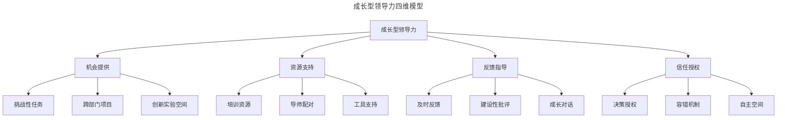
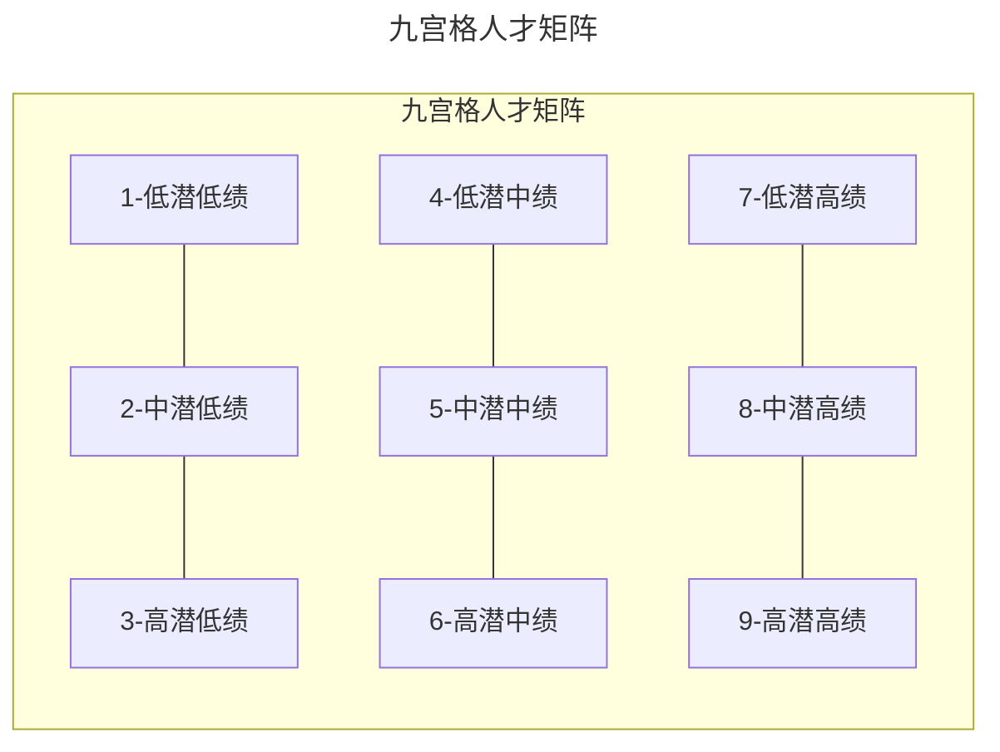
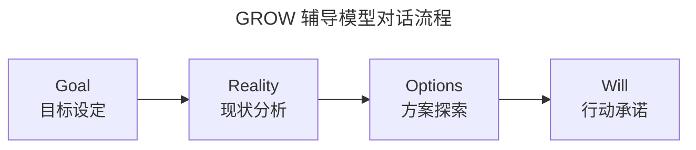
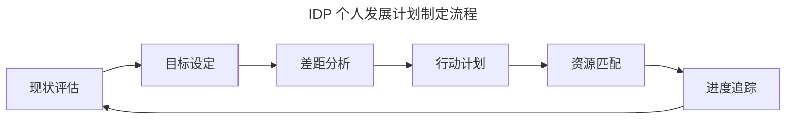
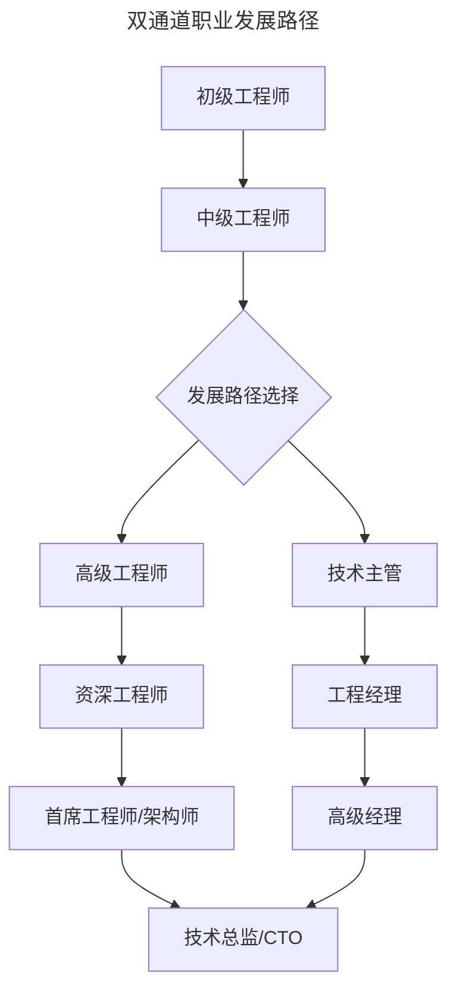
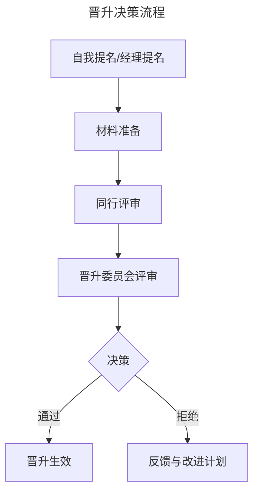

# 团队成员成长管理：从静态思维到成长型领导力

> **适用范围**：技术管理者、工程经理（EM）、团队 Lead、Tech Lead，以及承担人才培养职责的资深工程师。适用于技术团队的绩效管理、人才梯队建设、职业发展规划、辅导对话等场景。
>
> **更新摘要（v2 · 2026-08 更新）**：
> - 结构化升级为 6 节骨架（导言 / 核心方法论 / 关键流程 / 工具与实战 / 常见误区 / 进阶延展）
> - 为全部 Mermaid 图补充 `--- title: ... ---` frontmatter，并在每张图后追加文字解读
> - 整合 2025-2026 年 AI 辅助人才发展、数据驱动人才规划、远程团队成长管理等趋势
> - 将原"参考资料"章节融入"进阶延展"，形成统一延伸阅读入口

## 1. 导言

团队成员成长管理是技术管理者的核心职责之一。根据 Google 的 Project Oxygen 研究，优秀管理者的首要行为是"成为一名好教练"（Being a Good Coach），其权重远超技术能力本身。这一发现颠覆了技术团队中"技术最强者即为最佳管理者"的传统认知，将"培养人"置于"解决问题"之上。

然而，许多技术管理者在转型期仍困于静态思维（Fixed Mindset）——以员工当前能力水平作为长期判断依据，将错误视为失败而非学习机会，倾向于分配"安全"任务而非挑战性任务。这种思维模式不仅抑制了团队成员的成长潜能，长期来看也会导致团队人才密度下降、组织韧性降低。

本文从成长型思维理论出发，构建一套系统化的团队成员成长管理方法论，帮助管理者完成从"静态思维"到"成长型领导力"（Growth Leadership）的转型。内容覆盖能力评估、成长路径设计、辅导反馈技术、工程实践与发展趋势，为技术管理者提供可落地的成长管理工具箱。

## 2. 核心方法论

### 2.1 成长型思维理论

Carol Dweck 的研究表明，管理者对员工能力的认知模式直接影响员工的成长轨迹。静态思维（Fixed Mindset）与成长型思维（Growth Mindset）在管理实践中呈现显著差异：

| 维度 | 静态思维 | 成长型思维 |
|------|----------|------------|
| 能力观 | 能力固定不变 | 能力可通过努力发展 |
| 评价焦点 | 关注错误本身 | 关注错误中的学习机会 |
| 任务分配 | 倾向于分配"安全"任务 | 提供适度挑战性任务 |
| 反馈方式 | 评判性反馈 | 发展性反馈 |
| 潜力认知 | 基于当前表现判断 | 关注未被挖掘的潜力 |

管理者需警惕以下静态思维陷阱：

- **能力固化偏见**（Ability Fixation Bias）：以员工当前能力水平作为长期判断依据
- **天分优先论**（Talent-First Bias）：过度强调天赋而忽视努力与软技能
- **错误惩罚机制**（Error Punishment）：将错误视为失败而非学习机会
- **团队优先陷阱**（Team-First Trap）：将团队目标凌驾于个人成长之上
- **评判性反馈倾向**（Judgmental Feedback Tendency）：给出评价而非具体改进建议

### 2.2 成长型领导力模型

成长型领导力（Growth Leadership）以成长型思维为认知基础，通过机会提供、资源支持、反馈指导、信任授权四个维度构建团队成员的成长环境。



上图展示了成长型领导力的四个维度及其子要素。四个维度相互支撑：机会提供是成长的触发器，资源支持是成长的燃料，反馈指导是成长的导航仪，信任授权是成长的加速器。管理者需在四个维度上均衡发力，避免"给机会不给资源"或"给授权不给反馈"的失衡状态。

### 2.3 能力评估框架

#### 九宫格人才矩阵

九宫格（9-Box Grid）是业界广泛使用的人才评估工具，通过绩效（Performance）与潜力（Potential）两个维度对员工进行分类：



九宫格以绩效为横轴、潜力为纵轴，将员工分为九个类别。1-3 象限为绩效问题区，需启动绩效改进计划；4-6 象限为核心梯队，是团队稳定的基础；7-9 象限为高绩效区，需差异化培养策略。该矩阵的价值不在于"贴标签"，而在于为差异化的人才投资提供决策依据。

**各象限管理策略**：

| 象限 | 类型 | 管理策略 |
|------|------|----------|
| 1-3 | 问题员工 | 绩效改进计划（PIP）或退出管理 |
| 4 | 稳定贡献者 | 维持现状，适度激励 |
| 5 | 核心骨干 | 重点培养，提供发展机会 |
| 6 | 高潜力人才 | 加速培养，准备晋升 |
| 7 | 专家型员工 | 深度专业发展路径 |
| 8 | 未来领导者 | 领导力培养，轮岗锻炼 |
| 9 | 顶级人才 | 关键人才保留，快速晋升通道 |

#### 技能矩阵评估

技能矩阵（Skills Matrix）用于评估团队成员在关键技能领域的成熟度：

| 技能维度 | 评估等级 | 描述 |
|----------|----------|------|
| 技术深度 | L1-L5 | 从基础认知到行业专家 |
| 技术广度 | L1-L5 | 从单一领域到跨领域整合 |
| 执行能力 | L1-L5 | 从需指导到独立交付 |
| 影响力 | L1-L5 | 从个人贡献到组织影响 |
| 协作能力 | L1-L5 | 从独立工作到跨团队协调 |
| 培养他人 | L1-L5 | 从无贡献到系统性培养 |

#### 360度评估体系

现代企业采用多维度评估获取全面的能力画像：

- **上级评估**：战略执行、目标达成、管理能力
- **同级评估**：协作效率、沟通能力、专业影响力
- **下属评估**：领导力、辅导能力、团队建设
- **自评**：自我认知、发展意愿、成长规划

### 2.4 辅导与反馈模型

#### SBI 反馈模型

SBI（Situation-Behavior-Impact）是结构化反馈的标准模型：

- **Situation（情境）**：描述具体发生的时间、地点、场景
- **Behavior（行为）**：描述观察到的具体行为（非评价）
- **Impact（影响）**：说明该行为产生的具体影响

**SBI 反馈示例**：

> 在昨天下午的项目评审会上（情境），你主动提出了解决方案并详细解释了技术细节（行为），这让新加入团队的成员快速理解了问题背景，节省了约30分钟的讨论时间（影响）。

#### GROW 辅导模型

GROW 模型是教练式辅导（Coaching）的核心框架，由 Sir John Whitmore 提出：



GROW 模型以目标（Goal）为起点，经过现状（Reality）分析和方案（Options）探索，最终落在行动意愿（Will）上。该模型的核心理念是：被辅导者比辅导者更了解问题的具体情境，辅导者的角色是通过结构化提问激发被辅导者自主发现答案，而非直接提供解决方案。

**GROW 对话示例**：

| 阶段 | 典型问题 |
|------|----------|
| Goal | 你希望在未来6个月达成什么目标？ |
| Reality | 目前的情况如何？有哪些障碍？ |
| Options | 有哪些可能的解决方案？还有呢？ |
| Will | 你决定采取哪个方案？何时开始？ |

#### 建设性批评技术

批评性反馈需遵循以下原则：

1. **私下进行**：保护员工自尊，避免公开批评
2. **具体明确**：针对具体行为而非人格特质
3. **及时反馈**：事件发生后尽快进行
4. **聚焦改进**：提供具体的改进建议
5. **双向对话**：邀请员工表达观点
6. **跟进支持**：确认理解并提供后续支持

## 3. 关键流程

### 3.1 个人发展计划（IDP）流程

IDP（Individual Development Plan）是员工成长的路线图，包含以下核心要素：



IDP 流程是一个闭环：从现状评估出发，经过目标设定、差距分析、行动计划、资源匹配，最终回到进度追踪，形成持续迭代的成长循环。该流程的关键在于"闭环"——每次进度追踪的结果应反馈到下一轮的现状评估，确保发展计划与员工的实际成长保持同步。

**IDP 制定流程详解**：

1. **现状评估**：基于能力框架识别当前水平
2. **目标设定**：制定 SMART 发展目标（Specific、Measurable、Achievable、Relevant、Time-bound）
3. **差距分析**：识别能力差距与发展重点
4. **行动计划**：制定具体的学习与实践活动
5. **资源匹配**：配置培训、导师、项目等资源
6. **进度追踪**：定期回顾与调整

### 3.2 OKR 驱动的成长目标

将个人成长目标纳入 OKR（Objectives and Key Results）体系，实现与组织目标的对齐：

**成长型 OKR 示例**：

```yaml
Objective: 提升系统架构设计能力
Key Results:
  - KR1: 完成架构设计认证课程并通过考核
  - KR2: 主导设计1个中型系统架构并获得评审通过
  - KR3: 在团队内进行2次架构设计分享
  - KR4: 获得2位资深架构师的正面反馈评价
```

### 3.3 双通道职业发展路径

技术组织通常提供双通道（Dual Track）发展路径，让员工在管理通道与技术通道之间选择最适合自身特长与兴趣的方向：



双通道设计的关键价值在于：避免"管理是唯一晋升路径"的传统困境，让技术导向的员工也能获得对等的职级、薪酬与影响力。两条通道在高层级（技术总监/CTO）汇合，体现"技术领导力"与"管理领导力"在组织顶端的融合。

**管理通道 vs 技术通道对比**：

| 维度 | 管理通道 | 技术通道 |
|------|----------|----------|
| 核心能力 | 团队管理、战略规划 | 技术深度、架构设计 |
| 影响范围 | 团队/组织层面 | 技术领域层面 |
| 成功指标 | 团队产出、人才发展 | 技术创新、系统质量 |
| 典型角色 | EM → Director → VP | Staff → Principal → Distinguished |

### 3.4 晋升决策流程

硅谷领先企业采用"已在下一级别工作"（Working at the Next Level）的晋升原则——员工需在晋升前已展现出下一级别的能力与影响力，晋升是对既有表现的"追认"，而非"预支"。



晋升流程以"同行评审"为核心环节，确保晋升决策不仅依赖直接管理者的判断，还融入同级与跨组视角，降低单点偏见。被拒绝的提名需提供明确的反馈与改进计划，帮助候选人在下一周期针对性提升。

**晋升评估维度**：

- 技术能力：是否达到下一级别的技术标准
- 执行能力：能否独立处理复杂问题
- 项目影响力：项目成果是否达到下一级别要求
- 协作能力：跨团队协作是否达到下一级别标准
- 培养他人：是否对他人成长有实质性贡献

### 3.5 反馈频率与时机

现代管理强调持续反馈（Continuous Feedback）而非年度评估：

| 反馈类型 | 频率 | 场景 |
|----------|------|------|
| 实时反馈 | 即时 | 具体行为发生后 |
| 周反馈 | 每周 | 1:1会议中 |
| 季度回顾 | 每季度 | 绩效中期检查 |
| 年度评估 | 每年 | 正式绩效评估 |

### 3.6 成长对话框架

每季度与成员进行深度成长对话：

1. **回顾进展**：回顾上次对话以来的成长
2. **识别障碍**：讨论当前面临的成长障碍
3. **探索机会**：识别新的学习与发展机会
4. **设定目标**：制定下一阶段的发展目标
5. **匹配资源**：确定需要的支持与资源

## 4. 工具与实战

### 4.1 导师制度设计

有效的导师制度（Mentorship Program）是人才加速器。其核心要素包括：

| 要素 | 描述 |
|------|------|
| 导师匹配 | 基于发展目标与导师专长进行匹配 |
| 结构化计划 | 明确辅导周期、频率、目标 |
| 定期检查 | 每月检查辅导进展 |
| 双向反馈 | 导师与学员互相评价 |
| 激励机制 | 将导师工作纳入绩效评估 |

### 4.2 学习型组织建设

构建支持持续学习的组织环境：

- **技术分享会**：定期组织团队内技术分享
- **读书会**：组织技术书籍共读与讨论
- **黑客马拉松**（Hackathon）：提供创新实验空间
- **培训预算**：为员工提供学习资源支持
- **知识库建设**：沉淀团队知识与最佳实践

### 4.3 授权与信任建立

有效授权（Delegation）是培养人才的关键，也是释放管理者带宽的核心手段：

| 授权级别 | 描述 | 适用场景 |
|----------|------|----------|
| 指令级 | 详细指示，密切监督 | 新人、高风险任务 |
| 教练级 | 提供指导，定期检查 | 有一定经验的员工 |
| 支持级 | 提供资源，按需协助 | 成熟员工 |
| 授权级 | 完全授权，结果导向 | 高级员工、专家 |

### 4.4 管理者自我反思清单

定期进行以下反思，识别静态思维倾向：

- [ ] 我是否用发展的眼光看待每位成员？
- [ ] 我是否为成员提供了足够的成长机会？
- [ ] 我的反馈是否聚焦于发展而非评判？
- [ ] 我是否在成员失败时提供了支持而非指责？
- [ ] 我是否帮助成员建立了跨部门关系？
- [ ] 我是否在成员不擅长的领域帮助建立信心？

## 5. 常见误区

### 5.1 静态思维陷阱

管理者最常陷入的误区是以当前能力水平预判员工的长期能力。这种"能力固化偏见"会导致高潜力员工被低估、被分配低挑战任务，最终因缺乏成长空间而离职。修正策略：定期进行九宫格评估时，强制要求管理者列出"该员工在过去6个月展现出的、与其历史表现不同的新能力"。

### 5.2 反馈三明治

许多管理者习惯使用"表扬-批评-表扬"的反馈三明治（Feedback Sandwich），试图软化负面反馈。但研究表明，接收方往往只记住首尾的表扬，忽略中间的核心问题，导致反馈失效。修正策略：直接、真诚地表达，将正向反馈与建设性反馈分离为独立对话。

### 5.3 成长目标与业务目标脱节

IDP 制定后束之高阁，与日常业务工作完全脱节，成长目标成为"业余任务"而非"工作的一部分"。修正策略：将成长 OKR 纳入季度业务 OKR 评审，确保成长目标获得与业务目标同等的关注与资源。

### 5.4 晋升"惊喜"与"惊吓"

绩效面谈中出现对方首次听到的负面评价（"惊吓"），或晋升结果与员工预期严重不符（"惊喜"）。两者都违反"无意外原则"（No Surprise Rule）。修正策略：建立持续反馈机制，确保员工在任何正式评估节点前，已通过日常 1:1 充分了解自己的表现与定位。

### 5.5 导师制度流于形式

导师配对后缺乏结构化计划，沦为"有空聊聊"的随意互动，最终因双方忙碌而不了了之。修正策略：明确辅导周期（建议3-6个月）、频率（建议每月1-2次）、目标（具体的能力提升项），并将导师工作纳入管理者的绩效评估。

### 5.6 授权不足与授权过度

授权不足导致管理者微观管理（Micromanagement）、成员无法成长；授权过度导致成员在能力不足时承担超出能力的责任，造成挫败感与业务风险。修正策略：根据技能矩阵评估结果选择对应的授权级别，并随能力提升逐步升级。

## 6. 进阶延展

### 6.1 发展趋势（2025-2026）

#### AI 辅助的人才发展

- **智能能力评估**：基于 AI 的能力画像与发展建议
- **个性化学习路径**：AI 推荐的学习内容与项目
- **实时反馈系统**：AI 辅助的行为分析与反馈

#### 敏捷人才管理

- **短周期发展计划**：从年度 IDP 转向季度 OKR
- **持续技能更新**：适应快速变化的技术环境
- **流动式职业发展**：打破传统晋升阶梯

#### 远程团队的成长管理

- **异步反馈机制**：适应分布式团队的反馈方式
- **虚拟导师制度**：跨地域的导师配对
- **在线学习社区**：构建虚拟学习环境

#### 数据驱动的人才发展

- **人才分析仪表盘**：可视化团队人才结构
- **预测性人才规划**：基于数据的人才需求预测
- **发展 ROI 评估**：量化人才发展的投资回报

### 6.2 经典著作与研究

- Dweck, C. (2006). *Mindset: The New Psychology of Success*. Random House. —— 成长型思维理论的奠基之作，系统阐述能力观对学习与成就的影响。
- Grove, A. (1983). *High Output Management*. Random House. —— 安迪·格鲁夫的管理经典，提出"管理者产出 = 其影响范围内团队产出之和"的核心公式。
- Google (2018). *Project Oxygen: The Eight Habits of Highly Effective Managers*. —— Google 历时十年的管理者行为研究，确认"成为一名好教练"是优秀管理者的首要行为。
- Rock, D. (2006). *A Brain-Based Approach to Coaching*. International Journal of Coaching in Organizations. —— 从神经科学视角解析辅导对话的脑机制。
- Whitmore, J. (1992). *Coaching for Performance*. Nicholas Brealey Publishing. —— GROW 模型的提出者，教练技术的经典教材。
- Lencioni, P. (2002). *The Five Dysfunctions of a Team*. Jossey-Bass. —— 团队功能障碍模型，从信任缺失到结果漠视的五层递进分析。
- Scott, K. (2017). *Radical Candor*. St. Martin's Press. —— 激进坦诚框架，平衡"个人关怀"与"直接挑战"的反馈方法论。
- Edmondson, A. (2019). *The Fearless Organization*. Wiley. —— 心理安全感研究的权威著作，论证心理安全感是高绩效团队的首要特征。

### 6.3 实践指南与工具

- **九宫格人才矩阵**：建议每半年进行一次全员评估，结合绩效周期同步更新。
- **IDP 模板**：建议采用"现状-目标-差距-行动-资源-追踪"六段式结构，存放在团队共享文档中，每季度回顾。
- **GROW 对话卡**：将四阶段的典型问题制成卡片，供管理者在 1:1 中快速参考。
- **技能矩阵评估表**：按 L1-L5 五级定义每个技能维度的行为锚点，避免主观打分。
- **360 度反馈工具**：推荐使用 Culture Amp、Lattice、Small Improvements 等工具收集多源反馈。
