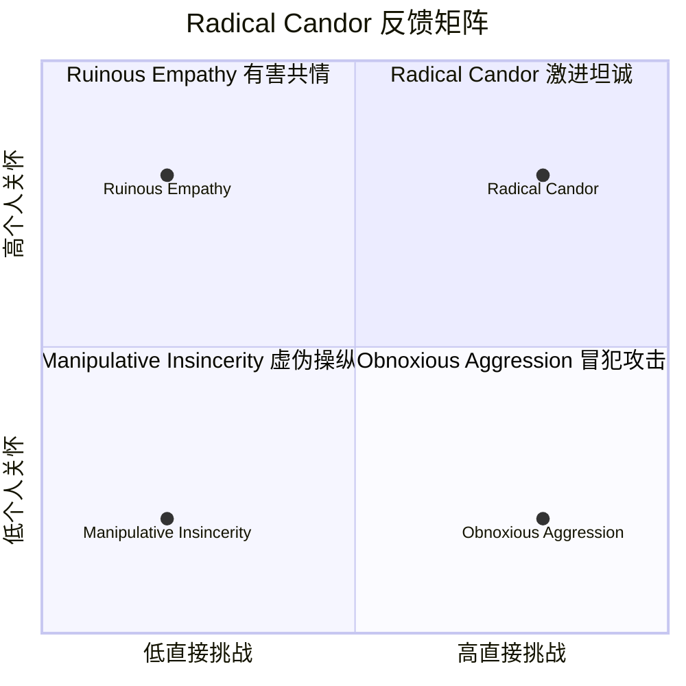
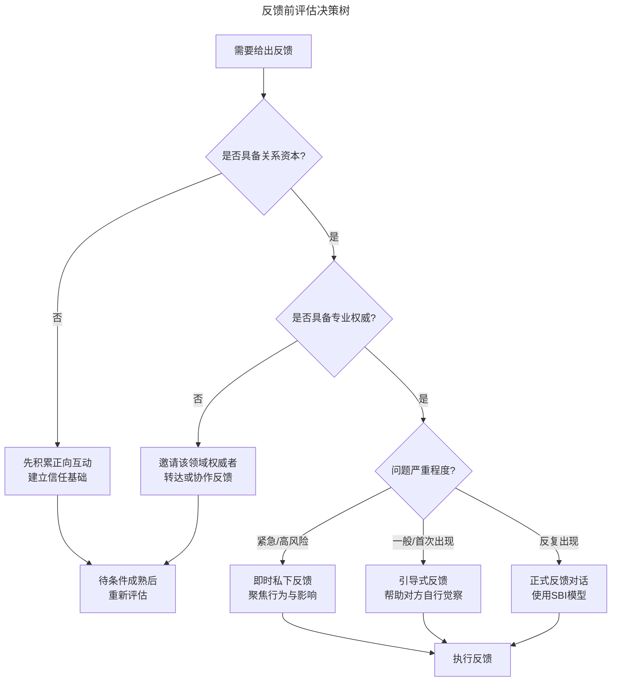
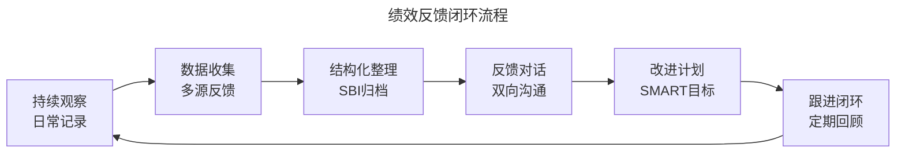

# 专业反馈技术：如何有效传递建设性意见

> **适用范围**：技术管理者、团队 Lead、资深工程师、产品经理，以及需要在工作中传递建设性意见的所有角色。适用于代码评审、绩效反馈、跨团队协作、1:1 对话、项目复盘等反馈场景。
>
> **更新摘要（v2 · 2026-08 更新）**：
> - 结构化升级为 6 节骨架（导言 / 核心方法论 / 关键流程 / 工具与实战 / 常见误区 / 进阶延展）
> - 为全部 Mermaid 图补充 `--- title: ... ---` frontmatter，并在每张图后追加文字解读
> - 整合 2025-2026 年持续反馈文化、AI 辅助反馈、跨文化反馈、反馈生态系统等趋势数据
> - 将原"参考资料"章节融入"进阶延展"，形成统一延伸阅读入口

## 1. 导言

反馈（Feedback）是组织绩效提升的核心驱动力。Gallup 2024年全球职场调研表明，定期接收建设性反馈的员工，其敬业度（Engagement）比未接收反馈的员工高出3.6倍。然而，反馈的有效性高度依赖于传递方式——即使是最客观、最有价值的意见，若传递方式失当，不仅无法达成改进目标，反而会损害关系资本（Relational Capital）、降低心理安全感（Psychological Safety），甚至引发防御性对抗。

本文从心理学基础出发，构建系统化的反馈框架与反馈技术体系，帮助技术管理者在不同场景下精准、高效地传递建设性意见。内容覆盖反馈心理学、四大反馈模型、提意见前的自我评估、结构化表达技术、正向反馈的力量、工程实践场景、常见误区与发展趋势，为技术管理者提供一套可落地的专业反馈工具箱。

## 2. 核心方法论

### 2.1 反馈心理学基础

#### 认知偏差与反馈接收

反馈传递的首要障碍并非信息本身，而是接收方的认知偏差（Cognitive Biases）。以下偏差对反馈效果影响最为显著：

| 认知偏差 | 表现 | 对反馈的影响 |
|---------|------|------------|
| 确认偏差（Confirmation Bias） | 倾向于接受与自我认知一致的信息 | 对负面反馈选择性忽略或扭曲 |
| 自利偏差（Self-Serving Bias） | 将成功归因于自身，失败归因于外部 | 将负面反馈解读为外部不公 |
| 负面偏见（Negativity Bias） | 对负面信息的反应强度远超正面信息 | 一条负面反馈可抵消多条正面反馈 |
| 基本归因错误（Fundamental Attribution Error） | 高估他人行为的内在因素，低估情境因素 | 将问题归咎于对方性格而非情境 |
| 锚定效应（Anchoring Effect） | 过度依赖首次接收的信息 | 反馈顺序影响最终感知 |

#### 心理防御机制

当个体接收到威胁自我概念的反馈时，会自动启动心理防御机制（Psychological Defense Mechanisms）。Freud 及后续研究者识别出以下与反馈场景高度相关的防御机制：

| 防御机制 | 定义 | 反馈场景中的表现 |
|---------|------|----------------|
| 否认（Denial） | 拒绝承认令人不快的现实 | "这根本不是事实" |
| 投射（Projection） | 将自身不可接受的特质归因于他人 | "你自己才是这样" |
| 合理化（Rationalization） | 为行为编造看似合理的解释 | "这是因为……所以没办法" |
| 转移（Displacement） | 将情绪转向更安全的对象 | 对同事发火而非面对反馈 |
| 反向形成（Reaction Formation） | 表现出与真实感受相反的态度 | 表面接受但实际抵触 |

**关键洞察**：防御机制本身并非"错误"，而是心理自我保护的本能反应。反馈提供者的任务不是"击穿防御"，而是通过降低威胁感，使对方无需启动防御。

#### 心理安全感

Amy Edmondson 的研究表明，心理安全感（Psychological Safety）是高绩效团队的首要特征。当团队成员感到"提出问题、承认错误、接受反馈不会受到惩罚"时，学习行为和创新能力显著提升。

Google 的"亚里士多德计划"（Project Aristotle）对180个团队进行为期两年的研究，最终确认心理安全感是团队效能的第一预测因子。

反馈传递必须在心理安全感的基础上进行。若团队心理安全感较低，任何负面反馈都可能被放大为威胁信号，触发"战斗-逃跑"反应（Fight-or-Flight Response）。

#### 正负反馈比例研究

Losada & Heaphy 的研究发现，高绩效团队的正负反馈比例约为5.6:1，中绩效团队为1.9:1，低绩效团队为0.4:1。后续研究（包括2015年的修正研究）虽对精确数值有争议，但核心结论一致：**正向反馈需显著多于负向反馈，才能维持健康的沟通生态**。

实践建议：将正负反馈比例维持在 **3:1 至 5:1** 之间。低于此比例，接收方易产生"被针对"的感知；高于12:1，则正向反馈的边际效用递减，甚至被视为虚伪。

### 2.2 四大反馈框架

#### SBI 模型

SBI（Situation-Behavior-Impact）是 Center for Creative Leadership 提出的反馈黄金标准：

- **Situation（情境）**：描述具体的时间、地点、场景
- **Behavior（行为）**：描述可观察的具体行为，而非推测意图
- **Impact（影响）**：描述该行为对团队、项目、个人的具体影响

**示例**：

> ❌ "你总是不按时提交代码评审，太不负责任了。"
>
> ✅ "在周三的 Sprint Review 会议上（情境），你的代码评审比截止时间晚了两天（行为），导致下游测试团队无法按计划启动测试，整体发布延迟了一天（影响）。"

#### 非暴力沟通（NVC）

Marshall Rosenberg 的非暴力沟通（Nonviolent Communication）框架同样适用于反馈场景：

1. **观察**：客观描述事实，不加评判
2. **感受**：表达自己的感受，而非指责对方
3. **需要**：说明产生感受的内在需要
4. **请求**：提出具体、可执行的请求

**示例**：

> ❌ "你从来不听别人的意见！"
>
> ✅ "在三次技术方案讨论中，你打断了他人的发言（观察），我感到担忧（感受），因为团队需要充分的信息输入才能做出最优决策（需要），你能否在他人完整表达后再提出你的看法？（请求）"

#### Radical Candor 矩阵

Kim Scott 提出的 Radical Candor 框架将反馈分为两个维度：**个人关怀（Care Personally）** 和 **直接挑战（Challenge Directly）**，形成四个象限：



Radical Candor 矩阵以"个人关怀"为纵轴、"直接挑战"为横轴，将反馈风格分为四个象限。右上角的"激进坦诚"是理想区域——同时具备关怀与挑战；左上角的"有害共情"是管理者最常见的误区——出于善意回避冲突；右下角的"冒犯攻击"有挑战无关怀，伤害关系；左下角的"虚伪操纵"既无关怀也无挑战，是最具破坏性的状态。

| 象限 | 特征 | 结果 | 典型表现 |
|------|------|------|---------|
| **Radical Candor**（激进坦诚） | 直接挑战 + 个人关怀 | 高效反馈，促进成长 | "我关心你，所以必须告诉你这个问题" |
| **Ruinous Empathy**（有害共情） | 关怀但不直接 | 避免冲突但问题持续 | "算了，他也不容易，下次再说" |
| **Obnoxious Aggression**（冒犯攻击） | 直接但不关怀 | 伤害关系，引发对抗 | "你这代码写得一塌糊涂" |
| **Manipulative Insincerity**（虚伪操纵） | 既不直接也不关怀 | 被动攻击，破坏信任 | 背后抱怨，当面沉默 |

**核心洞察**：最有效的反馈同时包含关怀与挑战。关怀建立心理安全感，挑战推动行为改变。管理者最常见的误区是落入"有害共情"象限——出于善意回避冲突，实则剥夺了对方成长的机会。

#### COIN 模型

COIN 是另一个适用于技术场景的反馈框架：

- **C（Context）**：说明情境，界定讨论的场景与背景
- **O（Observation）**：客观观察，描述具体行为
- **I（Impact）**：说明影响，关联团队或业务目标
- **N（Next Steps）**：下一步行动，共同制定改进方案

### 2.3 正向反馈的力量

正向反馈并非简单的"做得好"，同样需要技术含量。在技术管理实践中，正向反馈往往被严重低估和忽视。

#### 有效表扬的要素

- **具体性**（Specificity）：明确指出哪个行为值得表扬
- **及时性**（Timeliness）：行为发生后尽快给予认可
- **真诚性**（Authenticity）：避免空洞的泛泛而谈
- **影响说明**（Impact）：说明该行为的积极影响

#### 成长型表扬

Carol Dweck 的成长型思维（Growth Mindset）研究指出，表扬应聚焦过程而非天赋：

> ❌ "你真聪明！"（固定型思维——暗示能力是天生的）
>
> ✅ "你在这个方案中展现了出色的系统性思考，尤其是对边界条件的处理，让整个设计更加健壮。"（成长型思维——强调策略和努力）

#### 正向反馈的乘数效应

正向反馈不仅激励个体，还产生组织层面的乘数效应（Multiplier Effect）：

- **行为强化**：被认可的行为更可能被重复（操作性条件反射原理）
- **文化塑造**：公开的正向反馈传递"什么被重视"的信号
- **信任积累**：正向互动积累关系资本，为未来的建设性反馈奠定基础
- **心理安全感**：持续的正向反馈提升团队心理安全感水平
- **创新促进**：被认可的团队更愿意承担风险和尝试新方法

## 3. 关键流程

### 3.1 提意见前的自我评估

在给出反馈之前，必须完成三项关键评估：关系资本、专业权威、时机判断。这三者构成反馈有效性的前提条件。

#### 关系资本评估

关系资本（Relational Capital）决定了你的反馈是否会被认真对待。其核心维度包括：

- **信任度**：对方是否信任你的动机和判断
- **亲密度**：双方是否有足够的互动基础
- **互惠性**：你是否也接受过对方的反馈

**关键原则**：在对方心中尚未建立信任和威信时，不要贸然给出负面反馈。适当放低姿态，先通过正向互动积累关系资本。

#### 专业权威评估

反馈的有效性与反馈者的专业权威（Professional Authority）直接相关。需评估：

- 你在该领域是否具备足够的专业深度
- 你的过往表现是否支撑你的评价立场
- 对方是否认可你在该问题上的发言资格

**反模式**：水平相近但一方自视甚高时，反馈极易引发"就凭你"的逆反心理。

#### 时机判断

反馈时机是影响效果的关键变量：

| 时机类型 | 适用场景 | 风险 |
|---------|---------|------|
| 即时反馈 | 安全行为、紧急纠偏 | 情绪未冷却，易升级 |
| 延迟反馈 | 复杂问题、情绪化场景 | 延迟过久则失去关联性 |
| 周期性反馈 | 绩效评估、1-on-1 | 若仅依赖周期反馈，日常问题积累 |
| 引导式反馈 | 初次犯错、对方有自省能力 | 需要较高沟通技巧 |

**核心原则**：初次犯错以引导为主，帮助对方自行觉察；问题反复出现时，再进行直接反馈。

### 3.2 反馈前评估决策树



该决策树将反馈前的评估流程显性化：先判断关系资本是否充足，再判断专业权威是否匹配，最后根据问题严重程度选择反馈方式。三个判断节点形成漏斗式筛选，避免在不具备条件时贸然反馈，也避免在具备条件时过度犹豫。

### 3.3 反馈时机的"黄金72小时"原则

反馈时机的选择遵循"黄金72小时"原则：行为发生后72小时内进行反馈，效果最佳。超过此窗口期，行为与反馈的关联性急剧下降。

**时机决策矩阵**：

| 维度 | 即时反馈 | 延迟反馈 |
|------|---------|---------|
| 情绪状态 | 双方冷静 | 任一方情绪激动 |
| 问题严重度 | 高风险/安全相关 | 一般性改进建议 |
| 场合适宜性 | 私密空间可用 | 当前场合不适宜 |
| 信息完整度 | 事实已清晰 | 需要进一步了解 |

### 3.4 场合选择

| 维度 | 公开场合 | 私下场合 |
|------|---------|---------|
| 正向反馈 | ✅ 推荐：放大激励效果，树立标杆 | 可选：适用于内向型人格 |
| 负向反馈 | ❌ 避免：引发羞耻感和防御反应 | ✅ 必须：保护尊严，降低威胁感 |
| 建设性建议 | 视情境：需确保心理安全感 | ✅ 推荐：更深入的对话空间 |

**核心原则**：公开表扬，私下批评（Praise in Public, Criticize in Private）。

### 3.5 结构化表达流程

将反馈内容按结构化方式组织，确保信息完整且易于接收：

**反馈表达模板**：

```
1. 开场：说明反馈意图（"我想和你聊一下关于……"）
2. 情境：描述具体场景（"在昨天的……"）
3. 行为：描述可观察的行为（"我注意到……"）
4. 影响：说明具体影响（"这导致了……"）
5. 期望：表达期望的行为（"我希望……"）
6. 支持：提供帮助和资源（"我可以……"）
7. 确认：邀请对方回应（"你怎么看？"）
```

### 3.6 正向反馈的实践频率

建议管理者建立正向反馈的日常习惯：

- **每日**：至少一次具体的正向反馈
- **每周**：在团队会议中公开认可1-2个突出贡献
- **每月**：在1-on-1中系统回顾成员的成长和进步
- **每季度**：在绩效周期中总结关键成就和里程碑

## 4. 工具与实战

### 4.1 语言技巧

**应使用的语言模式**：

| 模式 | 示例 | 效果 |
|------|------|------|
| "我观察到……" | "我观察到最近三次代码评审你都没有添加测试用例" | 客观、非评判 |
| "当……时，影响是……" | "当需求文档延迟交付时，下游团队需要压缩开发时间" | 因果关联、聚焦影响 |
| "我建议……" | "我建议我们在下次评审前先对齐测试标准" | 建设性、面向未来 |
| "你如何看待……" | "你如何看待这个方案的风险点？" | 开放式、邀请参与 |

**应避免的语言模式**：

| 模式 | 示例 | 问题 |
|------|------|------|
| 绝对化用词 | "你总是……""你从来都……" | 以偏概全，引发对抗 |
| 人格标签 | "你太不负责了" | 攻击人格而非行为 |
| 灾难化表述 | "这样下去项目肯定完蛋" | 夸大影响，降低可信度 |
| 比较式表达 | "你看别人怎么做的" | 引发嫉妒和抵触 |
| 讽刺挖苦 | "你可真厉害" | 破坏信任，激化矛盾 |

### 4.2 代码评审反馈

代码评审（Code Review）是技术团队中最高频的反馈场景，其质量直接影响团队文化和代码质量。

**代码评审反馈原则**：

| 原则 | 实践 | 反模式 |
|------|------|--------|
| 聚焦代码，而非作者 | "这段逻辑可以优化" | "你写的代码有问题" |
| 提供上下文 | 解释为什么建议修改 | 只说"改一下" |
| 区分必须/建议 | [Must] / [Suggestion] / [Nit] | 所有意见同等对待 |
| 提供替代方案 | 展示更好的实现方式 | 只指出问题不给方向 |
| 认可优秀代码 | "这个抽象很优雅" | 只关注问题 |

**代码评审反馈模板**：

```
[Must] 安全问题：第42行存在SQL注入风险，建议使用参数化查询
[Suggestion] 性能优化：这个O(n²)的循环可以考虑用HashMap优化为O(n)
[Nit] 风格：变量命名建议使用camelCase
[Positive] 设计：这个接口的抽象层次很好，扩展性很强
```

### 4.3 绩效反馈

绩效反馈是管理者最重要的职责之一，也是影响最大的反馈场景。



绩效反馈是一个持续闭环：从日常观察开始，经过多源数据收集、结构化整理、双向对话、改进计划，最终回到跟进与定期回顾。该流程的核心在于"持续"——绩效反馈不是年度事件，而是贯穿全年的持续性活动，年度评估只是对持续反馈的阶段性总结。

**绩效反馈的关键原则**：

1. **无意外原则（No Surprise Rule）**：绩效面谈中不应出现对方首次听到的负面评价
2. **证据驱动**：每个评价都应有具体事例支撑
3. **发展导向**：绩效反馈的目的是促进成长，而非惩罚
4. **双向对话**：邀请对方表达看法，而非单向宣判

### 4.4 跨团队反馈

跨团队反馈面临额外的复杂性：缺乏直接职权关系、组织文化差异、信息不对称。

**跨团队反馈策略**：

- **通过对方主管**：将反馈传达给对方的管理者，由其进行反馈
- **建立反馈协议**：在跨团队协作初期约定反馈机制和规范
- **聚焦共同目标**：将反馈与双方共同关心的业务目标关联
- **使用客观数据**：用SLA、指标等客观数据替代主观评价
- **邀请第三方**：在必要时引入中立第三方协助沟通

## 5. 常见误区

### 5.1 反馈三明治

**表现**：使用"表扬-批评-表扬"的结构包装负面反馈。
**后果**：接收方只记住表扬，忽略核心问题。
**修正**：直接、真诚地表达，将正向反馈与建设性反馈分离为独立对话。

### 5.2 情绪化反馈

**表现**：带着愤怒或失望给出反馈。
**后果**：引发对抗，损害关系。
**修正**：冷静后再反馈，遵循"黄金72小时"原则，避免在情绪激动时进行反馈。

### 5.3 反馈泛化

**表现**："你总是……""你从来都……"等绝对化表述。
**后果**：接收方感到被全盘否定，启动防御机制。
**修正**：聚焦具体事件和行为，使用 SBI 模型结构化表达。

### 5.4 延迟反馈

**表现**：问题发生很久后才提出。
**后果**：失去关联性，对方无法将反馈与行为对应。
**修正**：尽快反馈，保持时效性，遵循"黄金72小时"原则。

### 5.5 过度反馈

**表现**：一次性提出大量改进点。
**后果**：信息过载，无从下手。
**修正**：每次聚焦1-2个关键改进点，分阶段推进。

### 5.6 零正向反馈

**表现**：只在出问题时才沟通。
**后果**：关系资本耗尽，心理安全感降低。
**修正**：主动给予正向反馈，维持3:1至5:1的正负反馈比例。

### 5.7 有害共情

**表现**：出于善意回避冲突。
**后果**：问题持续恶化，错失成长机会。
**修正**：在关怀的基础上直接挑战，追求 Radical Candor 象限。

### 5.8 假设意图

**表现**："你就是故意……"等推测对方动机的表述。
**后果**：引发防御，破坏信任。
**修正**：描述行为，不推测意图，将意图判断留给对方自己说明。

## 6. 进阶延展

### 6.1 发展趋势

#### 持续反馈取代年度评估

传统年度绩效评估正在被持续反馈（Continuous Feedback）模式取代。2024-2025年Deloitte、Adobe、Microsoft等企业已全面转向实时反馈文化，通过轻量级、高频次的反馈替代低频、重量的年度评估。根据Gartner 2025年报告，超过70%的Fortune 500企业已采用或正在过渡到持续反馈模式。

#### AI辅助反馈

AI工具正在进入反馈领域：通过分析沟通模式、项目数据，AI可以识别反馈时机、建议反馈措辞、追踪反馈效果。2025年，GitHub Copilot for PR Review、Culture Amp的AI反馈助手等工具已实现：

- 自动识别代码评审中的负面表达，建议更建设性的措辞
- 分析团队沟通数据，预警反馈不足的成员
- 生成360度反馈摘要和模式识别

但AI反馈无法替代人际间的情感连接，应定位为辅助工具而非替代方案。

#### 心理安全感优先的反馈文化

越来越多的组织将心理安全感作为反馈文化的前提条件，通过培训、制度设计、领导示范等方式，建立"反馈是礼物"的组织共识。2025年，这一趋势进一步深化为"反馈生态系统"（Feedback Ecosystem）理念——将反馈视为组织学习的核心机制，而非个体间的沟通行为。

#### 跨文化反馈

全球化团队中，反馈风格的文化差异日益凸显。Erin Meyer的《文化地图》（The Culture Map）框架指出，不同文化在反馈直接性上存在显著差异：

| 文化类型 | 代表国家 | 反馈风格 | 对管理者的启示 |
|---------|---------|---------|-------------|
| 直接反馈 | 荷兰、德国、美国 | 坦率直言，负面反馈不包装 | 注意在间接文化中可能被视为粗鲁 |
| 间接反馈 | 日本、中国、韩国 | 委婉暗示，正面升级、负面降级 | 注意在直接文化中可能被视为虚伪 |
| 升级式反馈 | 法国、俄罗斯 | 正面反馈弱化，负面反馈直接 | 可能被误解为持续不满 |

管理者需要具备文化智能（Cultural Intelligence），灵活调整反馈策略。

### 6.2 最佳实践清单

1. 维持3:1至5:1的正负反馈比例
2. 反馈前完成关系资本、专业权威、时机三项评估
3. 使用SBI模型结构化表达反馈
4. 遵循"公开表扬、私下批评"原则
5. 聚焦具体行为，避免人格标签和绝对化用词
6. 初次犯错以引导为主，反复出现再直接反馈
7. 每次反馈聚焦1-2个关键改进点
8. 反馈后设定跟进机制，形成闭环
9. 建立正向反馈的日常习惯
10. 在代码评审中区分反馈优先级

### 6.3 经典著作与参考资料

- Edmondson, A. C. (2019). *The Fearless Organization*. Wiley. —— 心理安全感研究的权威著作，论证心理安全感是高绩效团队的首要特征。
- Scott, K. (2017). *Radical Candor*. St. Martin's Press. —— Radical Candor 框架的提出者，平衡关怀与挑战的反馈方法论。
- Rosenberg, M. (2003). *Nonviolent Communication*. PuddleDancer Press. —— 非暴力沟通的奠基之作，观察-感受-需要-请求四步法。
- Dweck, C. (2006). *Mindset*. Random House. —— 成长型思维理论，对表扬方式与学习动机的深层影响。
- Losada, M., & Heaphy, E. (2004). The Role of Positivity and Connectivity in the Performance of Business Teams. *American Behavioral Scientist*, 47(6), 740-765. —— 正负反馈比例与团队绩效的实证研究。
- Center for Creative Leadership. SBI Feedback Model. —— SBI 反馈模型的官方资源。
- Gallup (2024). State of the Global Workplace Report. —— 全球职场敬业度与反馈文化的年度报告。
- Stone, D., & Heen, S. (2014). *Thanks for the Feedback*. Viking. —— 反馈接收方的视角，镜像地补充了"如何提意见"的盲区。
- Meyer, E. (2014). *The Culture Map*. PublicAffairs. —— 跨文化沟通与反馈风格差异的系统性框架。
- Google (2015). Guide: Understand team effectiveness. —— 亚里士多德计划的团队效能研究指南。
- Gartner (2025). Future of Performance Management Report. —— 持续反馈取代年度评估的趋势数据与企业实践。
