# 管理之道：团队与领导力

> **适用范围**：技术管理者、工程经理（EM）、团队 Lead、Tech Lead，以及正在向管理岗位转型的资深工程师。适用于角色转型、人才培养、反馈沟通、1:1 会议、团队建设、领导力发展等管理实践场景。
>
> **更新摘要（v2 · 2026-08 更新）**：
> - 结构化升级为 6 节骨架（导言 / 核心方法论 / 关键流程 / 工具与实战 / 常见误区 / 进阶延展）
> - 为全部 Mermaid 图补充 `--- title: ... ---` frontmatter，并在每张图后追加文字解读
> - 整合原五个章节（角色转型 / 成员成长 / 提意见 / 接收意见 / 一对一沟通）的内容，按方法论维度重新组织
> - 将原"参考资料"章节融入"进阶延展"，形成统一延伸阅读入口

## 1. 导言

本篇汇集了技术管理中关于团队建设与领导力发展的核心主题，形成一套系统化的管理方法论。这些主题从不同维度构建了技术管理者的领导力图谱：

**角色转型与能力培养**：从"给答案"到"做引导"的管理者角色转型，以及如何帮助团队成员成长，共同回答了"管理者如何培养人"这一核心命题。

**双向反馈艺术**：如何给别人提意见与如何接收别人的意见，反馈是组织学习的核心机制，双向反馈能力是管理者建立信任、促进成长的关键技能。

**沟通与协作机制**：一对一沟通实践是管理者与成员建立深度连接的核心工具，也是反馈与培养的主要载体。

这些主题环环相扣：引导式管理是培养人的方法论基础，成长管理是培养人的系统实践，反馈是成长的核心机制，一对一沟通是反馈与培养的主要载体。掌握这套方法论，技术管理者才能完成从"个人贡献者"到"团队赋能者"的转型。

## 2. 核心方法论

### 2.1 引导式管理

引导式管理（Facilitative Leadership）是一种以提问和引导为核心的管理方法论，其本质是将管理者的角色从"答案提供者"转型为"能力激发者"。这种转型要求管理者抑制直接给出解决方案的本能冲动，转而通过结构化提问帮助团队成员自主发现答案、构建解决方案。

在技术管理语境下，引导式管理尤为重要。技术工作的本质是问题解决，而问题解决能力的培养远比单一问题的解决更具价值。当管理者习惯性地直接给出答案时，虽然短期内提高了效率，却剥夺了团队成员成长的机会，长期来看会形成团队对管理者的依赖，削弱组织的整体问题解决能力。

#### 管理者角色转型对照

| 维度 | 指令型管理者 | 教练型领导者 |
|------|-------------|-------------|
| 核心行为 | 给答案、下指令 | 提问题、做引导 |
| 思维模式 | "我来解决" | "你来发现" |
| 能力培养 | 隐性传递、效率优先 | 显性培养、成长优先 |
| 决策归属 | 管理者决策 | 引导自主决策 |
| 团队依赖度 | 高依赖 | 低依赖、自主性强 |
| 适用场景 | 紧急、高风险、新手期 | 非紧急、成长期、复杂问题 |

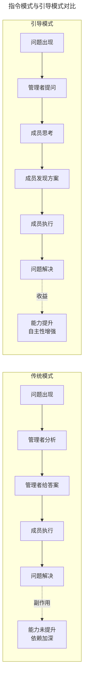

两种模式的核心差异在于"问题解决能力"的归属：传统模式下，能力沉淀在管理者身上，成员成为执行者；引导模式下，能力沉淀在成员身上，管理者成为赋能者。短期来看传统模式效率更高，但长期来看引导模式能构建组织韧性。

#### 教练技术（Coaching）

教练技术源于体育领域，后被引入管理学界。其核心理念是：每个人都有解决问题的潜能，教练的角色是激发这种潜能而非替代思考。在技术管理中，教练技术强调以下原则：

**非指令性原则**：教练不提供解决方案，而是创造条件让被教练者自己找到答案。这基于一个基本假设——被教练者比教练更了解问题的具体情境，因此更有可能找到最适合的解决方案。

**成长型思维**：基于 Carol Dweck 的研究，教练型管理者相信能力可以通过努力和学习得到发展。这种信念直接影响管理者的行为选择——当管理者相信团队成员有能力解决问题时，更倾向于采用引导而非指令。

**心理安全感**：Amy Edmondson 的研究表明，心理安全感是团队效能的关键因素。引导式管理通过鼓励提问、接纳不同观点、允许试错，构建心理安全环境，使团队成员敢于表达、勇于尝试。

#### 情境领导理论

Paul Hersey 和 Ken Blanchard 提出的情境领导理论（Situational Leadership Theory）指出，有效的领导风格应随下属的准备度（Readiness）而调整。准备度包含两个维度：能力（完成任务的知识和技能）和意愿（信心、承诺和动机）。

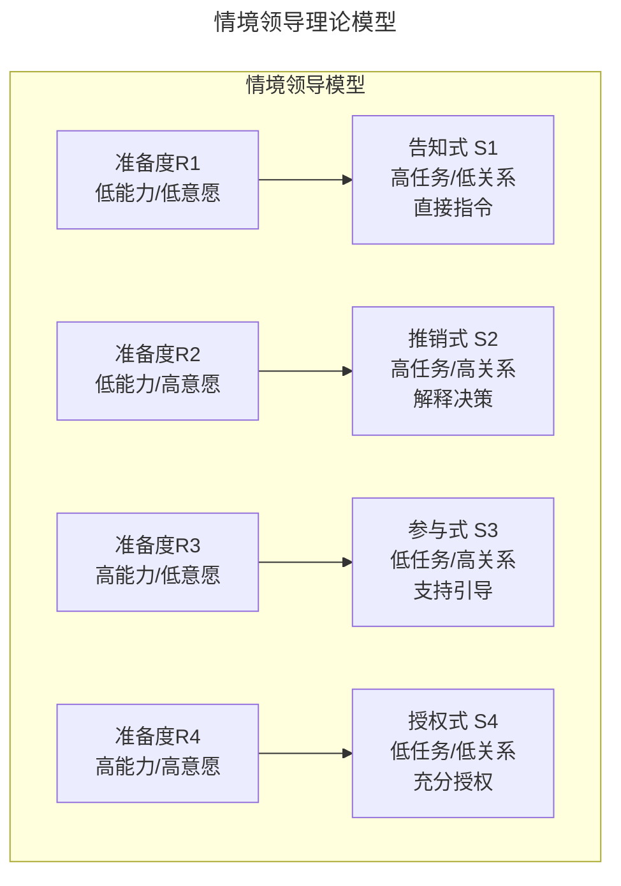

情境领导模型以"准备度"为输入、"领导风格"为输出，形成四组对应关系。R1（新人/新任务）对应告知式，管理者直接给指令；R2（学习期）对应推销式，在给答案的同时解释原因；R3（成长期）对应参与式，通过引导提问帮助梳理思路；R4（成熟期）对应授权式，充分信任成员判断。该模型为"何时引导、何时指令"提供了决策框架。

在引导式管理语境下，情境领导理论提供了"何时引导、何时指令"的决策框架：

- **R1阶段（新人/新任务）**：采用告知式风格，直接给出明确指令和答案。此时引导可能造成困惑和挫败感。
- **R2阶段（学习期）**：采用推销式风格，在给出答案的同时解释原因，帮助建立理解框架。
- **R3阶段（成长期）**：采用参与式风格，通过引导式提问帮助成员梳理思路，管理者更多扮演支持者角色。
- **R4阶段（成熟期）**：采用授权式风格，充分信任成员的判断，仅在必要时提供引导。

#### GROW 模型

GROW 模型是教练技术中最经典的对话框架，由 Sir John Whitmore 提出，包含四个阶段：

**G - Goal（目标设定）**：明确期望达成的结果
- "你希望达成什么目标？"
- "这个目标对你意味着什么？"
- "如何衡量目标的达成？"

**R - Reality（现状分析）**：客观审视当前状况
- "目前的情况是怎样的？"
- "你已经尝试了什么？效果如何？"
- "有哪些障碍和资源？"

**O - Options（方案探索）**：探索可能的解决方案
- "有哪些可能的解决方案？"
- "如果没有任何限制，你会怎么做？"
- "还有其他可能性吗？"

**W - Will（行动意愿）**：确定行动承诺
- "你选择哪个方案？为什么？"
- "你打算什么时候开始？"
- "需要什么支持？"

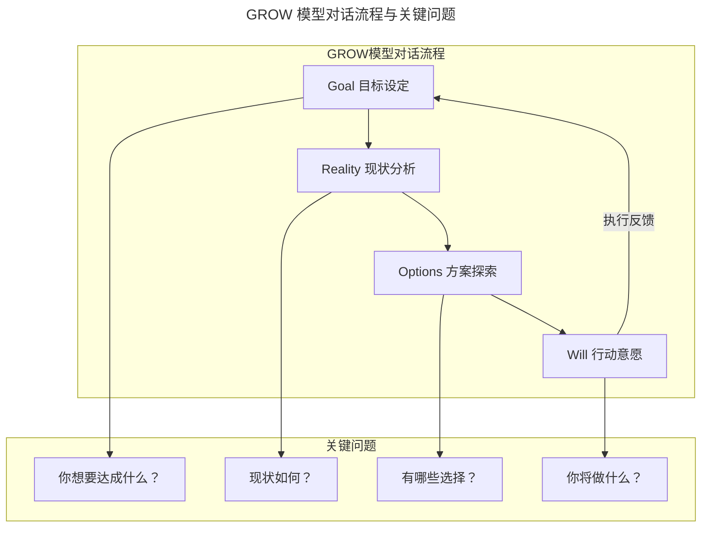

GROW 模型以目标为起点，经过现状分析和方案探索，最终落在行动意愿上，并通过执行反馈回到目标设定，形成闭环。该模型的核心理念是：被辅导者比辅导者更了解问题的具体情境，辅导者的角色是通过结构化提问激发自主发现。

### 2.2 成长型思维理论

Carol Dweck 的研究表明，管理者对员工能力的认知模式直接影响员工的成长轨迹。静态思维（Fixed Mindset）与成长型思维（Growth Mindset）在管理实践中呈现显著差异：

| 维度 | 静态思维 | 成长型思维 |
|------|----------|------------|
| 能力观 | 能力固定不变 | 能力可通过努力发展 |
| 评价焦点 | 关注错误本身 | 关注错误中的学习机会 |
| 任务分配 | 倾向于分配"安全"任务 | 提供适度挑战性任务 |
| 反馈方式 | 评判性反馈 | 发展性反馈 |
| 潜力认知 | 基于当前表现判断 | 关注未被挖掘的潜力 |

### 2.3 反馈心理学

#### 认知偏差与反馈接收

反馈传递的首要障碍并非信息本身，而是接收方的认知偏差（Cognitive Biases）：

| 认知偏差 | 表现 | 对反馈的影响 |
|---------|------|------------|
| 确认偏差（Confirmation Bias） | 倾向于接受与自我认知一致的信息 | 对负面反馈选择性忽略或扭曲 |
| 自利偏差（Self-Serving Bias） | 将成功归因于自身，失败归因于外部 | 将负面反馈解读为外部不公 |
| 负面偏见（Negativity Bias） | 对负面信息的反应强度远超正面信息 | 一条负面反馈可抵消多条正面反馈 |
| 基本归因错误（Fundamental Attribution Error） | 高估他人行为的内在因素，低估情境因素 | 将问题归咎于对方性格而非情境 |

#### 心理安全感

Amy Edmondson 的研究表明，心理安全感（Psychological Safety）是高绩效团队的首要特征。Google 的"亚里士多德计划"（Project Aristotle）对180个团队进行为期两年的研究，最终确认心理安全感是团队效能的第一预测因子。

#### 正负反馈比例

Losada & Heaphy 的研究发现，高绩效团队的正负反馈比例约为5.6:1，中绩效团队为1.9:1，低绩效团队为0.4:1。实践建议：将正负反馈比例维持在 **3:1 至 5:1** 之间。

### 2.4 反馈框架

#### SBI 模型

SBI（Situation-Behavior-Impact）是 Center for Creative Leadership 提出的反馈黄金标准：

- **Situation（情境）**：描述具体的时间、地点、场景
- **Behavior（行为）**：描述可观察的具体行为，而非推测意图
- **Impact（影响）**：描述该行为对团队、项目、个人的具体影响

#### Radical Candor 矩阵

Kim Scott 提出的 Radical Candor 框架将反馈分为两个维度：**个人关怀（Care Personally）** 和 **直接挑战（Challenge Directly）**，形成四个象限：

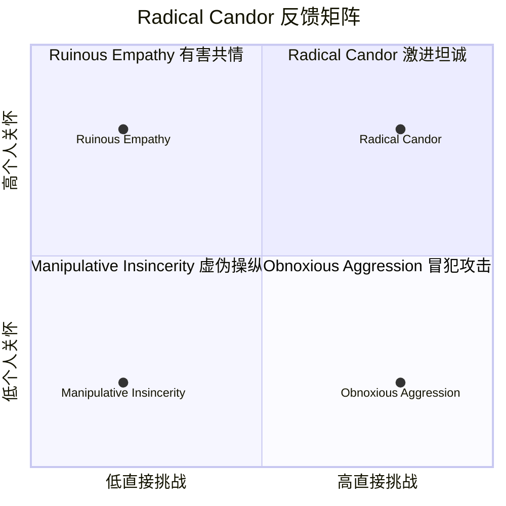

Radical Candor 矩阵以"个人关怀"为纵轴、"直接挑战"为横轴。右上角的"激进坦诚"是理想区域——同时具备关怀与挑战；左上角的"有害共情"是管理者最常见的误区——出于善意回避冲突；右下角的"冒犯攻击"有挑战无关怀，伤害关系；左下角的"虚伪操纵"是最具破坏性的状态。

| 象限 | 特征 | 结果 | 典型表现 |
|------|------|------|---------|
| **Radical Candor**（激进坦诚） | 直接挑战 + 个人关怀 | 高效反馈，促进成长 | "我关心你，所以必须告诉你这个问题" |
| **Ruinous Empathy**（有害共情） | 关怀但不直接 | 避免冲突但问题持续 | "算了，他也不容易，下次再说" |
| **Obnoxious Aggression**（冒犯攻击） | 直接但不关怀 | 伤害关系，引发对抗 | "你这代码写得一塌糊涂" |
| **Manipulative Insincerity**（虚伪操纵） | 既不直接也不关怀 | 被动攻击，破坏信任 | 背后抱怨，当面沉默 |

#### 非暴力沟通（NVC）

Marshall Rosenberg 的非暴力沟通（Nonviolent Communication）框架同样适用于反馈场景：

1. **观察**：客观描述事实，不加评判
2. **感受**：表达自己的感受，而非指责对方
3. **需要**：说明产生感受的内在需要
4. **请求**：提出具体、可执行的请求

#### COIN 模型

COIN 是另一个适用于技术场景的反馈框架：

- **C（Context）**：说明情境，界定讨论的场景与背景
- **O（Observation）**：客观观察，描述具体行为
- **I（Impact）**：说明影响，关联团队或业务目标
- **N（Next Steps）**：下一步行动，共同制定改进方案

### 2.5 PLCCA 反馈接收模型

接收反馈是职业成长的核心能力。哈佛商学院研究表明，主动寻求并有效利用反馈的管理者，其职业发展速度比被动接收反馈者快40%。

PLCCA 模型提供了一个系统化的反馈接收流程：

- **P（Pause）暂停**：在反应之前，先创造空间
- **L（Listen）倾听**：完整听取反馈，不打断、不辩解
- **C（Clarify）澄清**：通过提问确保理解准确
- **C（Categorize）分类**：对反馈进行类型判断
- **A（Act）行动**：制定改进计划或做出决策

#### 威胁反应：大脑的防御机制

当接收到负面反馈时，大脑杏仁核（Amygdala）会被激活，触发"战斗-逃跑-僵住"（Fight-Flight-Freeze）反应。这一进化机制在原始环境中保护人类免受物理威胁，但在现代职场中，却将"负面反馈"误判为"社会威胁"。

| 反应类型 | 行为表现 | 内在对话 |
|---------|---------|---------|
| 战斗 | 反驳、争辩、攻击对方动机 | "你凭什么这么说？你自己做得好吗？" |
| 逃跑 | 转移话题、回避对话、事后疏远 | "我不想听这些。" |
| 僵住 | 沉默、无法回应、事后懊恼 | "我当时怎么没想到反驳？" |

### 2.6 一对一沟通理论

一对一沟通（One-on-One Meeting，简称1:1）是技术管理者与团队成员之间最高杠杆率的管理活动。根据安迪·格鲁夫（Andy Grove）在《高产出管理》（*High Output Management*）中的定义，1:1是维系管理者与下属关系最主要的方法，其核心目的在于互通信息与彼此学习。

格鲁夫进一步提出了**杠杆率**（Leverage）概念：管理者在1:1中投入的30分钟，可能提升下属接下来一周甚至两周的工作品质。通过信息分享，管理者也能获取一线信息。长远来看，1:1的产出远超管理者同等时间的个人产出。

从现代管理理论角度，1:1沟通的价值可从以下框架理解：

| 理论框架 | 1:1的价值体现 |
|----------|---------------|
| 心理安全感（Edmondson） | 建立信任，降低沟通恐惧 |
| 自我决定理论（Deci & Ryan） | 满足自主性、胜任感、归属感需求 |
| 期望理论（Vroom） | 澄清期望，连接努力与回报 |
| 领导-成员交换理论（LMX） | 构建高质量领导-成员关系 |
| 情境领导理论（Hersey & Blanchard） | 根据成熟度调整领导风格 |

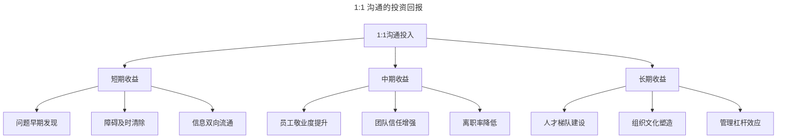

1:1沟通的投资回报呈三层递进结构：短期解决具体问题（障碍清除、信息流通），中期改善团队健康度（敬业度、信任、保留率），长期构建组织能力（人才梯队、文化、管理杠杆）。这种递进结构说明1:1不是"消耗时间"，而是"投资时间"。

## 3. 关键流程

### 3.1 引导式对话流程

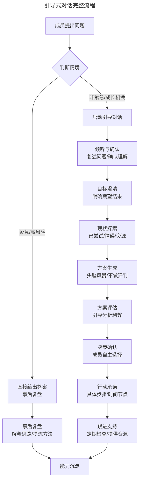

引导式对话流程的核心决策点在"判断情境"——紧急/高风险场景直接给答案并事后复盘，非紧急/成长机会场景启动完整的引导对话。完整流程包含倾听确认、目标澄清、现状探索、方案生成、方案评估、决策确认、行动承诺、跟进支持八个步骤，最终实现能力沉淀。

### 3.2 反馈前评估决策树

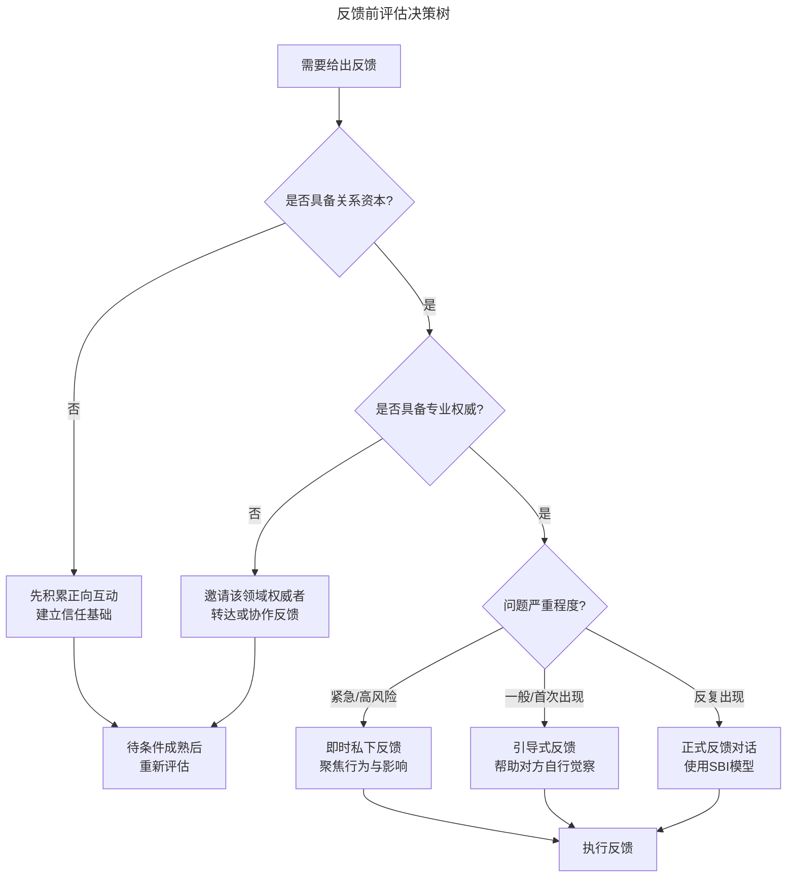

该决策树将反馈前的评估流程显性化：先判断关系资本是否充足，再判断专业权威是否匹配，最后根据问题严重程度选择反馈方式。三个判断节点形成漏斗式筛选。

### 3.3 反馈接收流程

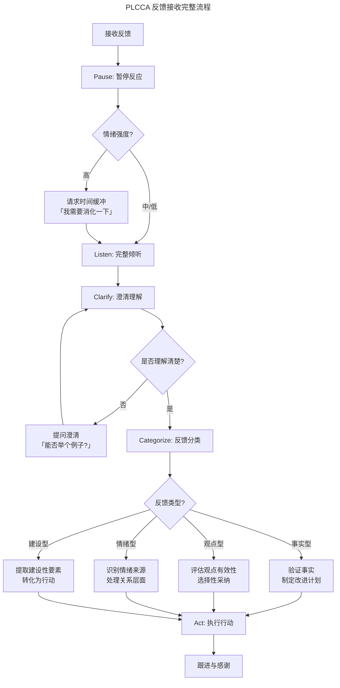

PLCCA 流程将反馈接收分解为暂停、倾听、澄清、分类、行动五个阶段，其中分类阶段将反馈分为事实型、观点型、情绪型、建设型四类，每类有不同的处理策略。该流程的关键价值在于"先处理情绪，再处理信息"——通过 Pause 阶段创造反应空间，避免杏仁核劫持导致防御性反应。

### 3.4 个人发展计划（IDP）流程

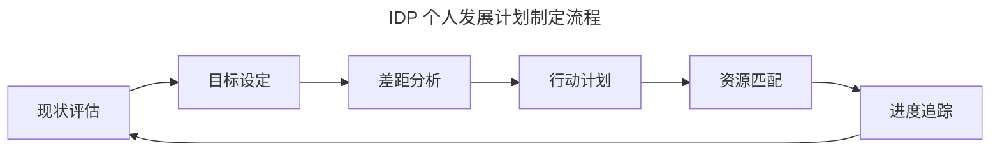

IDP 流程是一个闭环：从现状评估出发，经过目标设定、差距分析、行动计划、资源匹配，最终回到进度追踪，形成持续迭代的成长循环。

### 3.5 晋升决策流程

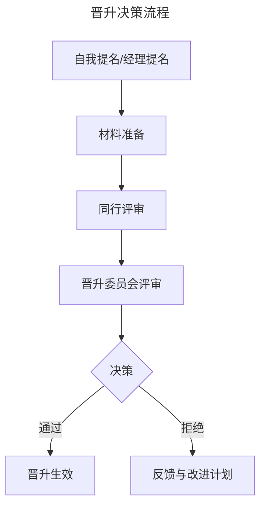

晋升流程以"同行评审"为核心环节，确保晋升决策不仅依赖直接管理者的判断，还融入同级与跨组视角。被拒绝的提名需提供明确的反馈与改进计划。

### 3.6 绩效反馈闭环

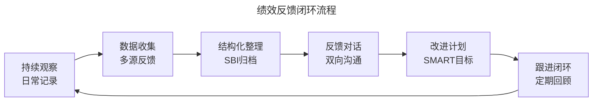

绩效反馈是一个持续闭环：从日常观察开始，经过多源数据收集、结构化整理、双向对话、改进计划，最终回到跟进与定期回顾。年度评估只是对持续反馈的阶段性总结。

### 3.7 1:1 会议生命周期

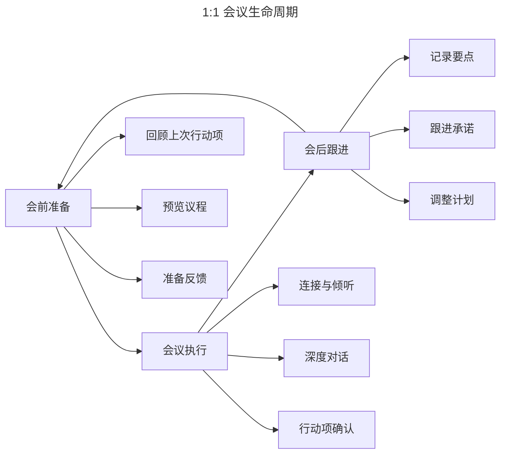

1:1 生命周期分为会前准备、会议执行、会后跟进三个阶段，形成循环。会前回顾上次行动项并预览议程，会中聚焦连接与倾听、深度对话、行动项确认，会后记录要点并跟进承诺。该循环的关键在于"闭环"——每次会后的跟进结果反馈到下次会前的准备。

## 4. 工具与实战

### 4.1 引导式对话决策矩阵

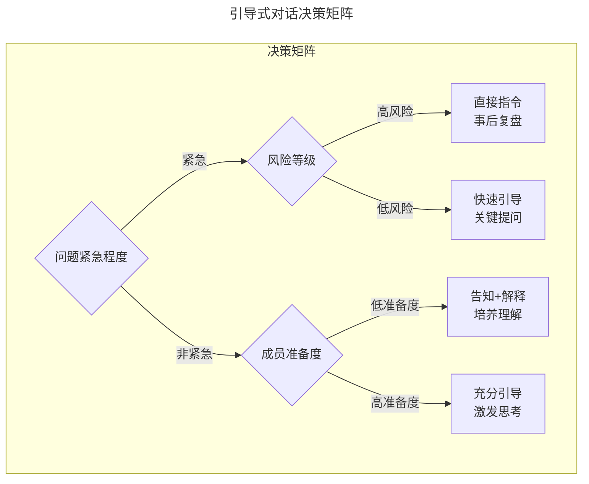

决策矩阵以"问题紧急程度"为第一层判断，紧急场景再看风险等级，非紧急场景再看成员准备度。这种分层决策避免了"一刀切"的引导策略，确保管理行为与情境匹配。

**决策考量因素**：

| 因素 | 倾向指令 | 倾向引导 |
|------|---------|---------|
| 时间紧迫性 | 紧急、无思考时间 | 充裕、有探索空间 |
| 风险等级 | 高风险、后果严重 | 低风险、可试错 |
| 问题复杂度 | 简单、标准问题 | 复杂、需创新思考 |
| 成员经验 | 新手、缺乏基础 | 资深、有经验积累 |
| 成长价值 | 低、常规问题 | 高、典型学习场景 |
| 成员状态 | 焦虑、需要确定性 | 平稳、愿意探索 |

### 4.2 苏格拉底式引导

苏格拉底式提问（Socratic Questioning）通过一系列问题引导对方发现答案，而非直接告知。六种苏格拉底式提问类型：

1. **澄清概念**："你说的'性能问题'具体指什么？"
2. **探究假设**："这个方案基于什么假设？这些假设成立吗？"
3. **寻找证据**："有什么数据支持这个判断？"
4. **推导后果**："如果采用这个方案，可能带来什么影响？"
5. **替代视角**："从用户角度看，这个问题是什么样的？"
6. **质疑问题**："我们问的问题本身是否正确？"

### 4.3 强力问题清单

**问题诊断类**：
- "你观察到的现象是什么？"
- "这个问题在什么情况下出现？什么情况下不出现？"
- "如果必须用一句话描述问题的本质，你会怎么说？"

**方案探索类**：
- "你目前想到了哪些可能的解决方案？"
- "每个方案的优缺点是什么？"
- "如果资源/时间没有限制，你会怎么做？"
- "有没有我们忽略的可能性？"

**决策支持类**：
- "你倾向于哪个方案？为什么？"
- "什么因素让你犹豫？"
- "如果选择这个方案，最坏的情况是什么？你能接受吗？"

**行动促进类**：
- "下一步你打算做什么？"
- "需要什么支持？"
- "什么时候开始？如何衡量进展？"

**反思成长类**：
- "从这次经历中学到了什么？"
- "如果重来一次，会有什么不同？"
- "这个经验如何迁移到其他场景？"

### 4.4 1:1 议程设计

| 时间段 | 内容 | 占比 | 负责人 |
|--------|------|------|--------|
| 0-5分钟 | 连接与破冰 | 15% | 双方 |
| 5-20分钟 | 员工议题 | 50% | 员工主导 |
| 20-25分钟 | 管理者议题 | 25% | 管理者 |
| 25-30分钟 | 行动项确认 | 10% | 双方 |

**议程设计原则**：

1. **员工主导**：1:1的核心是员工，话题应由员工驱动
2. **双向准备**：双方提前在共享文档中添加议题
3. **灵活调整**：紧急事项可临时调整议程
4. **行动导向**：每次1:1结束时有明确的行动项

### 4.5 1:1 内容体系

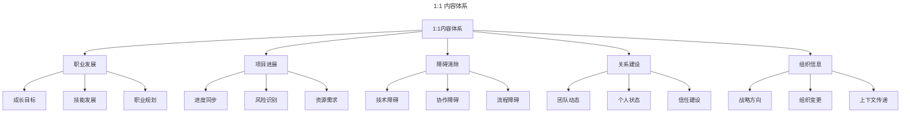

1:1 内容体系覆盖五大领域：职业发展是长期议题，项目进展是短期同步，障碍清除是即时支持，关系建设是隐性但关键的目标，组织信息是上下文传递。管理者需在每次1:1中平衡这五个领域，避免1:1退化为纯粹的项目汇报会。

### 4.6 主动聆听

主动聆听（Active Listening）是1:1沟通的基石，包含三个层次：

| 层次 | 描述 | 典型行为 |
|------|------|----------|
| 听见 | 接收信息 | 保持眼神交流，点头示意 |
| 理解 | 把握含义 | 复述确认，追问细节 |
| 共情 | 感受情绪 | 识别情绪，表达理解 |

**主动聆听的实践要点**：

- **全神贯注**：关闭手机通知，关闭电脑屏幕
- **不打断**：让员工完整表达，避免过早插话
- **复述确认**："我听到你说的是……，对吗？"
- **观察非语言信号**：注意语气、表情、肢体语言
- **悬置评判**：先理解再回应，避免防御性反应

### 4.7 强力提问

| 提问类型 | 示例 | 目的 |
|----------|------|------|
| 开放式提问 | "你对这个方案怎么看？" | 激发思考 |
| 探索式提问 | "还有什么可能的原因？" | 深入挖掘 |
| 假设式提问 | "如果资源不受限，你会怎么做？" | 突破思维限制 |
| 反思式提问 | "这次经历让你学到了什么？" | 促进反思 |
| 行动式提问 | "你打算下一步做什么？" | 推动行动 |
| 刻度式提问 | "1-10分，你的信心是多少？" | 量化评估 |

**提问原则**：

1. 避免封闭式提问（是/否类问题）
2. 一次只问一个问题
3. 提问后保持沉默，给予思考时间
4. 避免引导性提问
5. 从"为什么"转向"是什么"和"怎么样"

### 4.8 代码评审反馈

**代码评审反馈原则**：

| 原则 | 实践 | 反模式 |
|------|------|--------|
| 聚焦代码，而非作者 | "这段逻辑可以优化" | "你写的代码有问题" |
| 提供上下文 | 解释为什么建议修改 | 只说"改一下" |
| 区分必须/建议 | [Must] / [Suggestion] / [Nit] | 所有意见同等对待 |
| 提供替代方案 | 展示更好的实现方式 | 只指出问题不给方向 |
| 认可优秀代码 | "这个抽象很优雅" | 只关注问题 |

**代码评审反馈模板**：

```
[Must] 安全问题：第42行存在SQL注入风险，建议使用参数化查询
[Suggestion] 性能优化：这个O(n²)的循环可以考虑用HashMap优化为O(n)
[Nit] 风格：变量命名建议使用camelCase
[Positive] 设计：这个接口的抽象层次很好，扩展性很强
```

### 4.9 引导式问题排查框架

```mermaid
---
title: 引导式问题排查框架
---
graph TD
    A[问题报告] --> B[现象确认<br/>"你观察到了什么？"]
    B --> C[假设生成<br/>"可能的原因有哪些？"]
    C --> D[假设验证<br/>"如何验证这个假设？"]
    D --> E{假设成立？}
    E -->|是| F[制定方案<br/>"怎么修复？"]
    E -->|否| C
    F --> G[实施验证<br/>"如何确认修复有效？"]
    G --> H[复盘总结<br/>"学到了什么？"]
```

引导式问题排查以"提问"代替"指令"：从现象确认到假设生成、假设验证、方案制定、实施验证、复盘总结，每个环节都通过提问引导成员自主完成。该框架的价值在于"授人以渔"——通过完整的排查流程，培养成员独立解决同类问题的能力。

### 4.10 反馈分类与处理策略

根据反馈的内容性质和表达方式，可将反馈分为四个象限：

| 维度 | 事实导向 | 观点导向 |
|------|---------|---------|
| **建设性表达** | 事实型反馈 | 观点型反馈 |
| **情绪化表达** | 情绪型反馈 | 攻击型反馈 |

- **事实型反馈**：验证事实准确性 → 承认并感谢 → 分析原因 → 制定改进计划
- **观点型反馈**：理解观点背后的逻辑 → 评估有效性 → 寻求第三方验证 → 选择性采纳
- **情绪型反馈**：首先处理情绪层面 → 承认对方感受 → 探索情绪背后的需求 → 待情绪平复后处理内容
- **攻击型反馈**：保护自己，不被情绪卷入 → 设定边界 → 尝试提取有效信息 → 如持续发生寻求介入

### 4.11 授权与信任建立

| 授权级别 | 描述 | 适用场景 |
|----------|------|----------|
| 指令级 | 详细指示，密切监督 | 新人、高风险任务 |
| 教练级 | 提供指导，定期检查 | 有一定经验的员工 |
| 支持级 | 提供资源，按需协助 | 成熟员工 |
| 授权级 | 完全授权，结果导向 | 高级员工、专家 |

### 4.12 不同阶段的1:1策略

| 员工阶段 | 1:1重点 | 管理者角色 |
|----------|---------|------------|
| 新入职（0-3月） | 融入支持、期望对齐 | 导师 |
| 成长期（3-12月） | 技能发展、挑战给予 | 教练 |
| 成熟期（1-3年） | 自主权扩展、影响力建设 | 支持者 |
| 资深期（3年+） | 战略视野、传承培养 | 合伙人 |

## 5. 常见误区

### 5.1 引导式管理误区

**误区一：引导就是不给答案**

引导的目的是帮助对方发现答案，而非刻意隐瞒。当引导无效时，应及时提供支持。正确理解：引导是手段，成长是目的。当引导不能达成目的时，应调整策略。

**误区二：所有情况都引导**

不加区分地使用引导，在紧急情况下可能延误时机，在新人身上可能造成挫败。正确做法：根据情境选择策略，建立决策框架。

**误区三：引导就是问"你怎么想"**

简单的"你怎么想"缺乏引导性，可能让对方不知如何回答。正确做法：使用结构化问题，逐步深入，帮助梳理思路。

**误区四：引导后不跟进**

引导后缺乏跟进，成员可能迷失方向，问题悬而未决。正确做法：确认行动承诺，定期跟进进展，提供必要支持。

### 5.2 反馈误区

| 误区 | 表现 | 后果 | 修正 |
|------|------|------|------|
| 反馈三明治 | 表扬-批评-表扬 | 接收方只记住表扬，忽略核心问题 | 直接、真诚地表达，无需包装 |
| 情绪化反馈 | 带着愤怒或失望给出反馈 | 引发对抗，损害关系 | 冷静后再反馈 |
| 反馈泛化 | "你总是……""你从来都……" | 接收方感到被全盘否定 | 聚焦具体事件和行为 |
| 延迟反馈 | 问题发生很久后才提出 | 失去关联性，对方无法关联 | 尽快反馈，保持时效性 |
| 过度反馈 | 一次性提出大量改进点 | 信息过载，无从下手 | 每次聚焦1-2个关键点 |
| 零正向反馈 | 只在出问题时才沟通 | 关系资本耗尽，心理安全感降低 | 主动给予正向反馈 |
| 有害共情 | 出于善意回避冲突 | 问题持续恶化，错失成长机会 | 在关怀的基础上直接挑战 |
| 假设意图 | "你就是故意……" | 引发防御，破坏信任 | 描述行为，不推测意图 |

### 5.3 1:1 沟通常见误区

| 误区 | 表现 | 修正策略 |
|------|------|----------|
| 状态汇报会 | 1:1变成项目进度汇报 | 聚焦于障碍、发展和感受 |
| 单向输出 | 管理者说多听少 | 控制说话比例，多用提问 |
| 随意取消 | 1:1常被其他会议挤占 | 将1:1视为不可轻易取消的承诺 |
| 缺乏准备 | 双方无准备地进入1:1 | 使用共享议程文档提前准备 |
| 评判性回应 | 对员工表达做出评判 | 悬置评判，先理解再回应 |
| 忽视跟进 | 行动项无后续追踪 | 建立跟进机制，下次1:1检查 |
| 千篇一律 | 每次内容雷同 | 根据阶段和需求动态调整 |
| 替代团队会议 | 在1:1中讨论应团队讨论的事项 | 区分1:1与团队会议的边界 |

### 5.4 反馈接收误区

**误区一：全盘接受或全盘否定**

将反馈视为"判决"而非"信息输入"。全盘接受导致丧失自我判断，全盘否定导致错失成长机会。正确做法：分类处理——事实型验证后采纳，观点型评估后选择性采纳，情绪型先处理情绪再处理内容。

**误区二：被情绪劫持**

面对负面反馈时杏仁核被激活，进入"战斗-逃跑-僵住"模式。正确做法：使用 PLCCA 的 Pause 阶段创造反应空间，深呼吸、请求时间缓冲。

**误区三：不主动寻求反馈**

被动等待反馈不如主动寻求。主动寻求反馈可以掌握时机主动权、选择信任的反馈来源、聚焦关心的成长领域、展现成长型心态。

### 5.5 成长管理误区

**误区一：静态思维陷阱**

以当前能力水平预判员工的长期能力。修正策略：定期进行九宫格评估时，强制要求管理者列出"该员工在过去6个月展现出的、与其历史表现不同的新能力"。

**误区二：成长目标与业务目标脱节**

IDP 制定后束之高阁，成长目标成为"业余任务"。修正策略：将成长 OKR 纳入季度业务 OKR 评审。

**误区三：晋升"惊喜"与"惊吓"**

违反"无意外原则"。修正策略：建立持续反馈机制，确保员工在任何正式评估节点前已充分了解自己的表现与定位。

## 6. 进阶延展

### 6.1 发展趋势

#### AI 辅助管理

人工智能正在改变管理实践：

- **AI辅助教练**：在对话过程中提示引导问题，分析管理者的沟通模式，识别改进空间
- **AI辅助反馈**：自动识别代码评审中的负面表达，建议更建设性的措辞；分析团队沟通数据，预警反馈不足的成员
- **AI辅助1:1**：智能议程推荐、情感分析、行动项追踪、沟通模式分析
- **AI辅助人才发展**：基于AI的能力画像与发展建议、个性化学习路径

管理者应：拥抱AI工具提升效率，同时保持人际连接的核心价值，关注AI无法替代的领域——情感支持、复杂判断、关系构建。

#### 远程与混合办公

远程和混合办公模式成为常态，管理实践需要适应新环境：

- 增加视频沟通，获取更多非语言信息
- 使用协作工具，让思考过程可视化
- 更频繁的1:1，保持连接
- 明确沟通规范，减少误解

**工具支持**：Miro/Mural（可视化协作）、Loom（异步视频）、Slack/Teams（即时沟通）

#### 持续反馈取代年度评估

2024-2025年Deloitte、Adobe、Microsoft等企业已全面转向实时反馈文化。根据Gartner 2025年报告，超过70%的Fortune 500企业已采用或正在过渡到持续反馈模式。

#### 敏捷教练体系

敏捷方法论强调自组织团队，与引导式管理理念高度契合。敏捷教练（Agile Coach）角色的发展为引导式管理提供了新视角：管理者角色向"服务型领导"（Servant Leadership）演进，团队自组织能力成为核心竞争力。

#### 跨文化反馈

全球化团队中，反馈风格的文化差异日益凸显。Erin Meyer的《文化地图》框架指出，不同文化在反馈直接性上存在显著差异：

| 文化类型 | 代表国家 | 反馈风格 | 对管理者的启示 |
|---------|---------|---------|-------------|
| 直接反馈 | 荷兰、德国、美国 | 坦率直言，负面反馈不包装 | 注意在间接文化中可能被视为粗鲁 |
| 间接反馈 | 日本、中国、韩国 | 委婉暗示，正面升级、负面降级 | 注意在直接文化中可能被视为虚伪 |
| 升级式反馈 | 法国、俄罗斯 | 正面反馈弱化，负面反馈直接 | 可能被误解为持续不满 |

### 6.2 管理者自我反思清单

**引导式管理反思**：
- [ ] 我是否用发展的眼光看待每位成员？
- [ ] 我是否为成员提供了足够的成长机会？
- [ ] 我的反馈是否聚焦于发展而非评判？
- [ ] 我是否在成员失败时提供了支持而非指责？
- [ ] 我是否帮助成员建立了跨部门关系？
- [ ] 我是否在成员不擅长的领域帮助建立信心？

**反馈接收心态清单**：
1. **假定善意**：先假设对方出于好意，而非恶意攻击
2. **分离身份与行为**：反馈针对行为，而非否定我作为人的价值
3. **成长导向**：将反馈视为成长机会，而非威胁
4. **好奇心态**：对反馈背后的信息保持好奇
5. **感谢优先**：无论反馈质量如何，感谢对方的投入

### 6.3 经典著作与研究

**引导式管理与教练技术**：
- Whitmore, J. (2017). *Coaching for Performance* (5th ed.). Nicholas Brealey Publishing. —— GROW 模型的提出者，教练技术的经典教材。
- Hersey, P., Blanchard, K., & Johnson, D. (2013). *Management of Organizational Behavior* (10th ed.). Pearson. —— 情境领导理论的奠基之作。
- Edmondson, A. (2019). *The Fearless Organization*. Wiley. —— 心理安全感研究的权威著作。
- Dweck, C. (2006). *Mindset*. Random House. —— 成长型思维理论的奠基之作。

**反馈与沟通**：
- Scott, K. (2017). *Radical Candor*. St. Martin's Press. —— Radical Candor 框架的提出者。
- Rosenberg, M. (2003). *Nonviolent Communication*. PuddleDancer Press. —— 非暴力沟通的奠基之作。
- Stone, D., & Heen, S. (2014). *Thanks for the Feedback*. Viking. —— 反馈接收方视角的经典。
- Meyer, E. (2014). *The Culture Map*. PublicAffairs. —— 跨文化沟通与反馈风格差异。
- Gallup (2024). State of the Global Workplace Report. —— 全球职场敬业度与反馈文化年度报告。

**1:1 沟通与团队管理**：
- Grove, A. (1983). *High Output Management*. Random House. —— 安迪·格鲁夫的管理经典，1:1 的权威定义来源。
- Stanier, M. B. (2016). *The Coaching Habit*. Box of Crayons Press. —— 教练习惯的七个关键问题。
- Horstman, M. (2015). *The Effective Manager*. Manager Tools. —— 1:1 实践的操作指南。
- Deci, E. & Ryan, R. (2017). *Self-Determination Theory*. Guilford Press. —— 自我决定理论与内在动机。
- Brown, B. (2018). *Dare to Lead*. Random House. —— 脆弱性与勇敢领导力。
- Lencioni, P. (2002). *The Five Dysfunctions of a Team*. Jossey-Bass. —— 团队功能障碍模型。

**研究论文**：
- Edmondson, A. (1999). Psychological Safety and Learning Behavior in Work Teams. *Administrative Science Quarterly*, 44(2), 350-383.
- Grant, A. M. (2014). Autonomy support, relationship support and autonomy support in coaching. *Social and Personality Psychology Compass*, 8(8), 417-429.
- Losada, M., & Heaphy, E. (2004). The Role of Positivity and Connectivity in the Performance of Business Teams. *American Behavioral Scientist*, 47(6), 740-765.
- Gross, J. J. (2015). Emotion Regulation: Current Status and Future Prospects. *Psychological Inquiry*, 26(1), 1-26.
- Rock, D. (2008). SCARF: A brain-based model for collaborating with and influencing others. *NeuroLeadership Journal*, 1, 1-9.
- Google (2015). Guide: Understand team effectiveness. —— 亚里士多德计划指南。
- Gartner (2025). Future of Performance Management Report.

### 6.4 在线资源

- International Coaching Federation (ICF): https://coachingfederation.org
- Scrum Alliance - Agile Coaching: https://www.scrumalliance.org
- Center for Creative Leadership: SBI Feedback Model
- Manager Tools Podcast: 1:1 实践的长期播客资源
