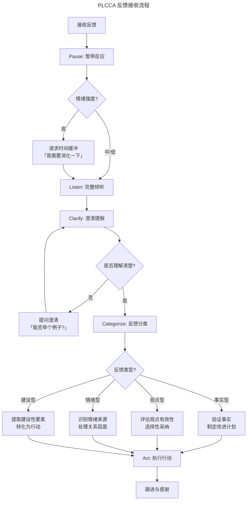

# 反馈接收技术：如何从建设性意见中实现成长

> **适用范围**：技术管理者、团队 Lead 及希望系统化提升反馈接收能力的工程师；适用于 1:1、绩效面谈、代码评审、跨团队协作等需要处理建设性或负面意见的场景。
>
> **更新摘要（v2 · 2026-08 更新）**：
> - 结构化升级为 6 节骨架（导言 / 核心方法论 / 关键流程 / 工具与实战 / 常见误区 / 进阶延展）
> - 为全部 Mermaid 图补充 `--- title: ... ---` frontmatter 与图后文字解读
> - 将原"参考资料"融入"6. 进阶延展"以便读者顺读
> - 保留 PLCCA 模型、四象限分类、反思日志等核心工具与全部 2025 年数据

## 1. 导言

接收反馈是职业成长的核心能力。哈佛商学院研究表明，主动寻求并有效利用反馈的管理者，其职业发展速度比被动接收反馈者快40%。然而，人类大脑对负面反馈的本能反应是威胁感知，这使我们在接收反馈时容易陷入防御、否认或情绪化反应。

本文从神经科学和心理学基础出发，构建系统化的反馈接收框架，帮助技术管理者将"不舒服的意见"转化为成长动力。全文按"理论→流程→工具→误区→趋势"的脉络展开，既可作为单篇精读，也可作为团队反馈文化建设的工作底稿。

## 2. 核心方法论

### 2.1 威胁反应：大脑的防御机制

当接收到负面反馈时，大脑杏仁核（Amygdala）会被激活，触发"战斗-逃跑-僵住"（Fight-Flight-Freeze）反应。这一进化机制在原始环境中保护人类免受物理威胁，但在现代职场中，却将"负面反馈"误判为"社会威胁"。

神经科学研究显示，社会威胁（如批评、排斥、负面评价）激活的脑区与物理威胁高度重叠。这意味着，当有人说"你的方案有问题"时，大脑的反应与面对猛兽时相似。

**威胁反应的典型表现**：

| 反应类型 | 行为表现 | 内在对话 |
|---------|---------|---------|
| 战斗 | 反驳、争辩、攻击对方动机 | "你凭什么这么说？你自己做得好吗？" |
| 逃跑 | 转移话题、回避对话、事后疏远 | "我不想听这些。" |
| 僵住 | 沉默、无法回应、事后懊恼 | "我当时怎么没想到反驳？" |

### 2.2 认知偏差：扭曲反馈解读

接收反馈时，以下认知偏差会扭曲我们对信息的解读：

| 认知偏差 | 表现 | 对反馈接收的影响 |
|---------|------|-----------------|
| 自我服务偏差 | 将成功归因于自己，失败归因于外部 | 将负面反馈解读为对方偏见或不公 |
| 确认偏差 | 寻找支持自我认知的证据 | 选择性忽略与自我认知冲突的反馈 |
| 归因偏差 | 高估对方性格因素，低估情境因素 | 认为"他就是针对我"而非"他可能也有压力" |
| 情感预测偏差 | 高估负面情绪的持续时间和强度 | 拒绝反馈以避免"想象中的痛苦" |

### 2.3 情绪调节：从反应到回应

情绪调节（Emotion Regulation）是有效接收反馈的核心能力。James Gross 的情绪调节模型指出，情绪调节可发生在四个阶段：

1. **情境选择**：主动选择接收反馈的场合（如请求在1-on-1中讨论）
2. **情境修正**：调整反馈对话的方式（如请求对方具体说明）
3. **注意力分配**：将注意力从情绪反应转向信息内容
4. **认知重评**：重新解读反馈的意义（如"这是成长机会"而非"这是攻击"）

**关键洞察**：情绪本身不是问题，问题在于被情绪劫持而失去理性处理信息的能力。目标不是消除情绪，而是缩短"情绪反应→理性回应"的时间间隔。

## 3. 关键流程

### 3.1 PLCCA 模型

PLCCA 模型提供了一个系统化的反馈接收流程：

- **P（Pause）暂停**：在反应之前，先创造空间
- **L（Listen）倾听**：完整听取反馈，不打断、不辩解
- **C（Clarify）澄清**：通过提问确保理解准确
- **C（Categorize）分类**：对反馈进行类型判断
- **A（Act）行动**：制定改进计划或做出决策

### 3.2 反馈接收流程图

上图展示了 PLCCA 五个阶段如何串联成一条从"接收反馈"到"跟进感谢"的完整闭环。关键分支在于情绪强度判断与反馈类型分类：前者决定是否需要时间缓冲，后者决定后续采取验证、评估、关系修复还是行动转化路径。

### 3.3 各阶段详解

#### 阶段一：暂停（Pause）

暂停是打破威胁反应循环的第一步。具体技术包括：

- **生理调节**：深呼吸、放松肩膀、降低语速
- **心理标记**：在内心标记"我正在经历威胁反应"
- **时间缓冲**：如情绪强烈，可请求"我需要一些时间思考，我们能否稍后继续讨论？"

#### 阶段二：倾听（Listen）

完整倾听是尊重的体现，也是获取完整信息的前提：

- **不打断**：让对方完整表达，即使你急于辩解
- **非语言信号**：保持眼神接触、点头示意
- **记录要点**：适当记录，既表示重视，也帮助后续处理
- **抑制反驳冲动**：将反驳点记下，待对方说完后再处理

#### 阶段三：澄清（Clarify）

澄清确保理解准确，避免因误解导致无效应对：

- **复述确认**："我理解你的意思是……对吗？"
- **请求具体化**："能否举一个具体的例子？"
- **询问影响**："这个行为对你/团队产生了什么影响？"
- **了解期望**："你希望我如何改进？"

#### 阶段四：分类（Categorize）

分类是信息处理的核心环节，详见下一节"反馈分类与处理策略"。

#### 阶段五：行动（Act）

根据分类结果，制定相应的行动计划：

- **感谢反馈者**：无论反馈质量如何，感谢对方的投入
- **说明后续计划**：告知对方你将如何处理这个反馈
- **设定跟进机制**：如适用，约定后续回顾时间

## 4. 工具与实战

### 4.1 四象限分类模型

根据反馈的内容性质和表达方式，可将反馈分为四个象限：

| 维度 | 事实导向 | 观点导向 |
|------|---------|---------|
| **建设性表达** | 事实型反馈 | 观点型反馈 |
| **情绪化表达** | 情绪型反馈 | 攻击型反馈 |

### 4.2 各类型反馈的处理策略

#### 事实型反馈

**特征**：基于可观察的行为和结果，有具体事例支撑，表达方式相对客观。

**处理策略**：
1. 验证事实准确性
2. 如事实准确，承认并感谢
3. 分析原因，制定改进计划
4. 设定跟进机制

**示例对话**：

> 反馈："上周三次站会你都迟到了，导致团队需要等你才能开始。"
>
> 回应："感谢你指出这一点。确实，上周我有三次迟到，这是我的问题。我分析了原因，主要是早高峰通勤时间预估不足。这周我已经调整出门时间，会确保准时参加。"

#### 观点型反馈

**特征**：基于反馈者的主观判断，可能包含合理洞察，也可能存在偏见。

**处理策略**：
1. 理解观点背后的逻辑
2. 评估观点的有效性
3. 寻求第三方验证
4. 选择性采纳

**评估问题清单**：
- 这个观点是否有事实支撑？
- 是否有多人表达过类似观点？
- 反馈者在该领域是否有专业权威？
- 这个观点是否指向我确实可以改进的地方？

#### 情绪型反馈

**特征**：反馈者带有明显情绪，内容可能混合事实与情绪表达。

**处理策略**：
1. 首先处理情绪层面，而非急于处理内容
2. 承认对方的感受
3. 探索情绪背后的需求
4. 待情绪平复后再处理内容

**示例对话**：

> 反馈："你总是把问题拖到最后才说，我真的受不了了！"
>
> 回应："我感受到你对这个问题很沮丧。这确实是我需要反思的地方。能否具体说说最近哪件事让你有这样的感受？我想更好地理解你的期望。"

#### 攻击型反馈

**特征**：以贬低、否定、人身攻击为特征，缺乏建设性。

**处理策略**：
1. 保护自己，不被情绪卷入
2. 设定边界，拒绝不当表达方式
3. 尝试提取可能的有效信息
4. 如持续发生，寻求上级或HR介入

**边界设定示例**：

> "我愿意接受关于我工作的反馈，但请聚焦于具体行为，而非对我个人的评价。"

### 4.3 反馈信息提取矩阵

即使反馈表达方式不理想，也可能包含有价值的信息。以下矩阵帮助提取有效成分：

| 反馈表达 | 可能的有效信息 | 提取方式 |
|---------|--------------|---------|
| "你总是……" | 某个行为反复出现 | 询问具体事例 |
| "你太……了" | 某个特质过度表现 | 询问具体情境和影响 |
| "你从不……" | 某个期望行为缺失 | 询问期望的具体表现 |
| "你太差了" | 存在未满足的期望 | 询问具体期望和标准 |

### 4.4 反思日志

将反馈转化为成长的系统性工具：

**反思日志模板**：

| 日期 | 反馈来源 | 反馈内容 | 我的初始反应 | 事实核查 | 学习洞察 | 行动计划 |
|------|---------|---------|------------|---------|---------|---------|
| 2025-01-15 | 同事A | 方案评审时打断他人 | 防御："我是在补充信息" | 确实打断了3次 | 我急于表达，忽略了倾听的价值 | 下次先记录想法，等对方说完再补充 |

### 4.5 行动计划框架

将反馈转化为可执行的行动计划：

1. **目标设定**：基于反馈，设定具体改进目标
2. **行为定义**：明确需要改变/增加/减少的行为
3. **衡量标准**：如何判断改进是否发生
4. **支持系统**：需要哪些资源、培训或支持
5. **时间框架**：改进的里程碑和时间节点
6. **跟进机制**：如何回顾进展和调整策略

### 4.6 反馈模式识别

通过持续记录，识别反馈中的模式：

- **重复出现的反馈**：多人多次提到的相同问题，优先级最高
- **特定情境反馈**：只在特定情境下出现的反馈，可能与情境因素相关
- **来源模式**：来自特定人群的反馈，可能反映与该群体的互动模式
- **盲区发现**：自己未意识到但他人反复指出的问题

### 4.7 主动寻求反馈

被动等待反馈不如主动寻求反馈。主动寻求反馈的优势：

- 掌握时机主动权
- 选择信任的反馈来源
- 聚焦关心的成长领域
- 展现成长型心态

**主动寻求反馈的问题设计**：

- "在这个项目中，有什么是我可以做得更好的？"
- "如果你是我，你会如何处理这个情况？"
- "我最近在尝试改进X，你有没有观察到变化？"
- "有什么是我自己可能没意识到，但影响团队协作的？"

### 4.8 反馈接收心态与清单

**反馈接收心态清单**：

1. **假定善意**：先假设对方出于好意，而非恶意攻击
2. **分离身份与行为**：反馈针对行为，而非否定我作为人的价值
3. **成长导向**：将反馈视为成长机会，而非威胁
4. **好奇心态**：对反馈背后的信息保持好奇
5. **感谢优先**：无论反馈质量如何，感谢对方的投入

**即时应对清单**：

1. 深呼吸，创造反应空间
2. 完整倾听，不打断
3. 复述确认理解
4. 感谢对方反馈
5. 说明后续处理计划
6. 如情绪强烈，请求时间缓冲

**后续处理清单**：

1. 记录反馈内容
2. 进行事实核查
3. 分类反馈类型
4. 识别学习洞察
5. 制定行动计划
6. 必要时跟进反馈者

## 5. 常见误区

### 5.1 来自不信任者的反馈

**挑战**：当反馈来自你不喜欢或不信任的人时，容易直接否定。

**应对策略**：
- 将反馈与反馈者分离：即使来源不可信，信息可能仍有价值
- 应用"敌人测试"：如果这来自你信任的人，你会如何看待？
- 寻求第三方验证：询问其他人是否有类似观察

### 5.2 公开场合的负面反馈

**挑战**：公开批评触发羞耻感和防御反应。

**应对策略**：
- 当场：简短回应，避免升级
- 会后：私下与反馈者深入讨论
- 长期：与团队建立"公开表扬、私下批评"的规范

**当场回应示例**：

> "感谢你的反馈，这确实是我需要关注的地方。会后我想和你进一步讨论具体改进方向。"

### 5.3 不准确或不公平的反馈

**挑战**：反馈与事实不符，或基于不完整信息。

**应对策略**：
- 好奇而非辩解：先理解对方为何有此感知
- 提供补充信息：分享对方可能不了解的背景
- 接受感知差异：即使事实不同，对方的感受是真实的

**对话示例**：

> "我理解你为什么会有这个印象。实际上，那个项目的延迟是因为上游依赖延期。不过我意识到，我可能没有及时同步这个信息，导致你产生了这个感知。以后我会更注意信息透明。"

### 5.4 来自上级的模糊反馈

**挑战**：上级的反馈笼统、模糊，难以转化为行动。

**应对策略**：
- 主动澄清：请求具体事例和期望
- 提供选项：提出可能的改进方向，请上级确认
- 定期跟进：在后续1-on-1中回顾进展

**澄清问题示例**：

- "能否举一个最近的具体例子，帮助我更好地理解？"
- "你期望的理想状态是什么样的？"
- "我计划从X、Y、Z三个方面改进，你认为哪个最优先？"

### 5.5 接收反馈的典型反模式

除上述场景外，以下反模式也会显著削弱反馈价值，需要在日常练习中刻意规避：

- **过滤式倾听**：只听到对自己有利的部分，过滤掉建设性批评
- **即时辩解**：对方尚未说完便开始解释，错失完整信息
- **情绪化回击**：用攻击反馈者的方式转移焦点
- **承诺但不行动**：当场接受反馈，事后毫无改变，长期透支信任
- **过度泛化**：将一次具体反馈解读为对自身能力的全面否定

## 6. 进阶延展

### 6.1 反馈素养成为核心能力

组织越来越重视员工的反馈素养（Feedback Literacy），即主动寻求、准确解读、有效利用反馈的能力。这一能力正在被纳入领导力发展模型和绩效评估体系。

### 6.2 数据驱动的反馈分析

通过360度评估、脉冲调研、行为数据分析等工具，个人可以获得更全面、客观的反馈画像，减少单一来源反馈的偏差。

### 6.3 心理安全感与反馈文化

组织正在从"反馈是评价"转向"反馈是礼物"的文化范式，通过建立心理安全感，降低反馈的威胁感知，促进学习型组织的形成。

### 6.4 AI辅助反馈整合

AI工具可以帮助整合来自多源的反馈，识别模式，生成洞察，甚至提供个性化的改进建议。但人类在情绪处理、关系维护、情境判断方面的能力仍不可替代。

### 6.5 延伸阅读

- Stone, D., & Heen, S. (2014). *Thanks for the Feedback*. Viking. —— 反馈接收的经典著作，系统区分了赞赏、指导、评估三种反馈。
- Gross, J. J. (2015). Emotion Regulation: Current Status and Future Prospects. *Psychological Inquiry*, 26(1), 1-26. —— 情绪调节过程的权威模型。
- Rock, D. (2008). SCARF: A brain-based model for collaborating with and influencing others. *NeuroLeadership Journal*, 1, 1-9. —— 神经科学视角下的威胁/奖励模型。
- Heen, S., & Stone, D. (2014). Find the Coaching in Criticism. *Harvard Business Review*.
- Kluger, A. N., & DeNisi, A. (1996). The Effects of Feedback Interventions on Performance. *Psychological Bulletin*, 119(2), 254-284.
- London, M., & Smither, J. W. (2002). Feedback Orientation: A Construct to Predict Feedback-Seeking and Performance. *Academy of Management Review*.
- Carver, C. S., & Scheier, M. F. (1998). *On the Self-Regulation of Behavior*. Cambridge University Press.
