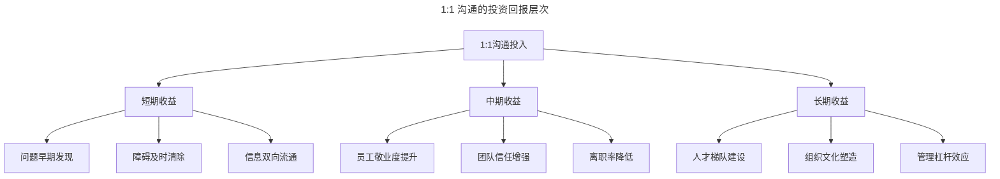
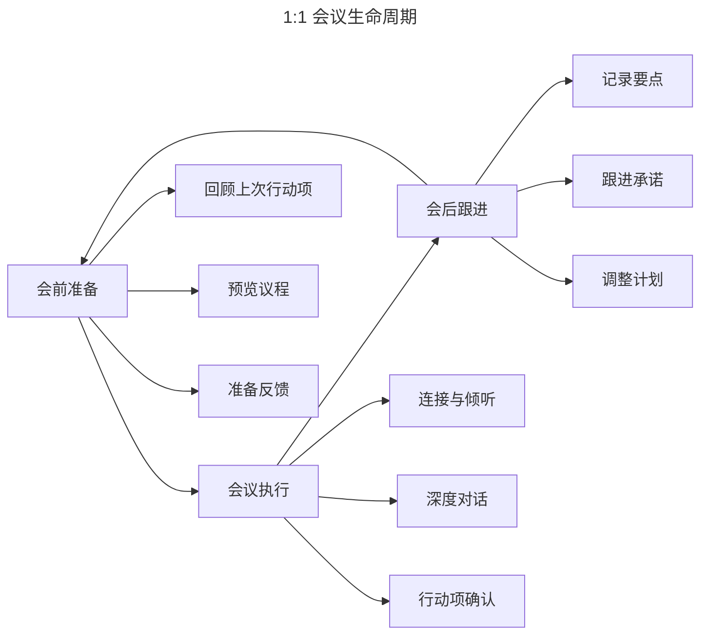
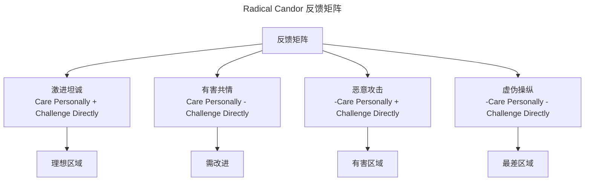
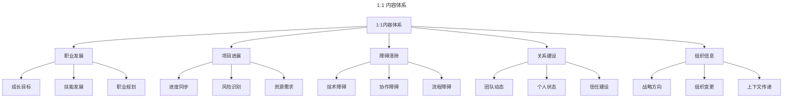
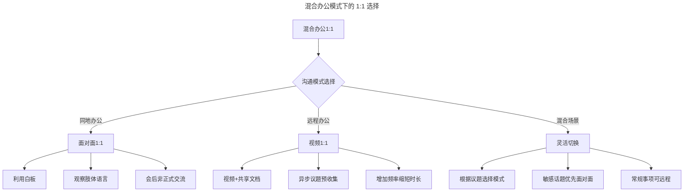

# 一对一沟通：技术管理者的核心领导力工具

> **适用范围**：技术管理者、团队 Lead、新晋经理及远程/混合办公团队；适用于建立 1:1 节奏、设计议程、教练式对话与远程协作等场景。
>
> **更新摘要（v2 · 2026-08 更新）**：
> - 结构化升级为 6 节骨架（导言 / 核心方法论 / 关键流程 / 工具与实战 / 常见误区 / 进阶延展）
> - 为全部 5 张 Mermaid 图补充 `--- title: ... ---` frontmatter 与图后文字解读
> - 将原"参考资料"融入"6. 进阶延展"以便读者顺读
> - 保留格鲁夫杠杆率、SBI、Radical Candor、议程模板与 2025 AI/异步趋势

## 1. 导言

一对一沟通（One-on-One Meeting，简称1:1）是技术管理者与团队成员之间最高杠杆率的管理活动。根据安迪·格鲁夫在《高产出管理》中的定义，1:1是维系管理者与下属关系最主要的方法，其核心目的在于互通信息与彼此学习。现代管理研究进一步表明，高质量的1:1沟通是员工敬业度、保留率和绩效提升的关键驱动因素。

本文系统阐述1:1沟通的理论基础、框架设计、核心技术及最佳实践，按"理论→流程→技术→误区→趋势"的脉络组织，便于管理者从 0 到 1 搭建自己的 1:1 体系。

## 2. 核心方法论

### 2.1 格鲁夫的经典定义

安迪·格鲁夫（Andy Grove）在《高产出管理》（*High Output Management*）中对1:1沟通的经典定义：

> 一对一会议通常由经理人召集其部属召开，是维系双方从属关系最主要的方法。其主要目的在于互通信息以及彼此学习；经过对特定事项的讨论，上司可以将其技能与经验传授给下属，并建议其切入问题的方式；而下属也能对工作中碰到的问题进行汇报。

格鲁夫进一步提出了**杠杆率**概念：管理者在1:1中投入的30分钟，可能提升下属接下来一周甚至两周的工作品质。通过信息分享，管理者也能获取一线信息。长远来看，1:1的产出远超管理者同等时间的个人产出。

### 2.2 现代管理理论视角

从现代管理理论角度，1:1沟通的价值可从以下框架理解：

| 理论框架 | 1:1的价值体现 |
|----------|---------------|
| 心理安全感（Edmondson） | 建立信任，降低沟通恐惧 |
| 自我决定理论（Deci & Ryan） | 满足自主性、胜任感、归属感需求 |
| 期望理论（Vroom） | 澄清期望，连接努力与回报 |
| 领导-成员交换理论（LMX） | 构建高质量领导-成员关系 |
| 情境领导理论（Hersey & Blanchard） | 根据成熟度调整领导风格 |

### 2.3 1:1沟通的投资回报

上图将 1:1 的收益按时间维度拆解为短/中/长三层：短期聚焦问题发现与信息流通，中期体现在敬业度与保留率，长期则沉淀为人才梯队与组织文化。这提醒管理者不要以"看不到即时产出"为由取消 1:1。

## 3. 关键流程

### 3.1 议程设计

高质量的1:1需要结构化的议程设计，同时保持灵活性：

**议程模板**：

| 时间段 | 内容 | 占比 | 负责人 |
|--------|------|------|--------|
| 0-5分钟 | 连接与破冰 | 15% | 双方 |
| 5-20分钟 | 员工议题 | 50% | 员工主导 |
| 20-25分钟 | 管理者议题 | 25% | 管理者 |
| 25-30分钟 | 行动项确认 | 10% | 双方 |

**议程设计原则**：

1. **员工主导**：1:1的核心是员工，话题应由员工驱动
2. **双向准备**：双方提前在共享文档中添加议题
3. **灵活调整**：紧急事项可临时调整议程
4. **行动导向**：每次1:1结束时有明确的行动项

### 3.2 频率与时长

| 团队规模 | 建议频率 | 建议时长 | 备注 |
|----------|----------|----------|------|
| 新员工 | 每周 | 30分钟 | 前3个月密集沟通 |
| 核心成员 | 每两周 | 30-45分钟 | 标准频率 |
| 资深成员 | 每两周或每月 | 30分钟 | 根据需要调整 |
| 远程成员 | 每周 | 25-30分钟 | 增加频率弥补距离 |
| 绩效改进中 | 每周 | 30分钟 | 密集跟进 |

### 3.3 1:1会议生命周期

生命周期图强调 1:1 不是孤立事件，而是"会前准备→会议执行→会后跟进"的循环。任何一环缺失都会让下一次 1:1 退化为状态汇报会。

## 4. 工具与实战

### 4.1 主动聆听

主动聆听（Active Listening）是1:1沟通的基石，包含三个层次：

| 层次 | 描述 | 典型行为 |
|------|------|----------|
| 听见 | 接收信息 | 保持眼神交流，点头示意 |
| 理解 | 把握含义 | 复述确认，追问细节 |
| 共情 | 感受情绪 | 识别情绪，表达理解 |

**主动聆听的实践要点**：

- **全神贯注**：关闭手机通知，关闭电脑屏幕
- **不打断**：让员工完整表达，避免过早插话
- **复述确认**："我听到你说的是……，对吗？"
- **观察非语言信号**：注意语气、表情、肢体语言
- **悬置评判**：先理解再回应，避免防御性反应

### 4.2 强力提问

强力提问（Powerful Questions）是教练式1:1的核心技术：

| 提问类型 | 示例 | 目的 |
|----------|------|------|
| 开放式提问 | "你对这个方案怎么看？" | 激发思考 |
| 探索式提问 | "还有什么可能的原因？" | 深入挖掘 |
| 假设式提问 | "如果资源不受限，你会怎么做？" | 突破思维限制 |
| 反思式提问 | "这次经历让你学到了什么？" | 促进反思 |
| 行动式提问 | "你打算下一步做什么？" | 推动行动 |
| 刻度式提问 | "1-10分，你的信心是多少？" | 量化评估 |

**提问原则**：

1. 避免封闭式提问（是/否类问题）
2. 一次只问一个问题
3. 提问后保持沉默，给予思考时间
4. 避免引导性提问
5. 从"为什么"转向"是什么"和"怎么样"

### 4.3 反馈技术

1:1中的反馈需遵循结构化模型：

**SBI反馈模型**（Situation-Behavior-Impact）：

> 在周三的代码评审中（情境），你指出了三处潜在的性能问题并提供了优化方案（行为），这让团队避免了上线后可能出现的性能瓶颈（影响）。

**Radical Candor框架**（Kim Scott）：

Radical Candor 矩阵以"个体关怀"和"直接挑战"为两轴，强调只有同时具备两者才能进入"激进坦诚"的理想区域。只关怀不挑战会陷入"有害共情"，只挑战不关怀则沦为"恶意攻击"。

### 4.4 沉默与留白

1:1中的沉默是有价值的工具：

- **思考留白**：提问后等待5-7秒，让员工组织思路
- **情绪留白**：员工表达情绪后，给予消化空间
- **决策留白**：不急于给出建议，引导员工自主思考
- **成长留白**：允许员工在安全范围内犯错和自我修正

### 4.5 1:1内容体系

1:1的内容应覆盖以下核心领域：

内容体系图提示管理者：1:1 不应只谈"项目进展"，职业发展、障碍清除、关系建设、组织信息同样是高频被忽略但价值极高的领域，建议按周/月轮换主题。

### 4.6 职业发展对话

职业发展是1:1中最重要的长期议题：

**对话框架**：

| 阶段 | 关键问题 | 频率 |
|------|----------|------|
| 兴趣探索 | 什么工作让你最有成就感？ | 每季度 |
| 优势识别 | 你最擅长什么？别人最常找你帮什么？ | 每季度 |
| 目标对齐 | 未来1-3年你想达到什么位置？ | 每半年 |
| 行动规划 | 需要发展哪些能力？有什么机会？ | 每季度 |
| 进度检查 | 上次设定的目标进展如何？ | 每月 |

### 4.7 项目进展同步

项目进展同步应聚焦于风险与障碍，而非简单的状态汇报：

- **关键进展**：本周最重要的1-2个进展
- **风险与障碍**：当前面临的主要风险和阻塞项
- **资源需求**：需要哪些额外支持
- **决策需求**：需要管理者做出哪些决策

### 4.8 障碍清除

管理者在1:1中最重要的角色之一是障碍清除者（Blocker Remover）：

| 障碍类型 | 典型表现 | 管理者行动 |
|----------|----------|------------|
| 技术障碍 | 技术方案不确定 | 提供技术指导或引入专家 |
| 协作障碍 | 跨团队协作困难 | 协调关系，建立沟通渠道 |
| 流程障碍 | 审批流程冗长 | 推动流程优化 |
| 资源障碍 | 人力或工具不足 | 争取资源或调整优先级 |
| 情绪障碍 | 挫败感或倦怠 | 倾听、共情、调整工作节奏 |

### 4.9 关系建设

关系建设是1:1的隐性但关键的目标：

- **个人连接**：了解员工的生活状态和兴趣
- **信任积累**：通过持续保密和信守承诺建立信任
- **心理安全感**：创造可以坦诚表达的环境
- **归属感建设**：让员工感受到被重视和被关心

### 4.10 1:1 最佳实践清单

**会前**：

- [ ] 回顾上次1:1的行动项
- [ ] 预览员工提出的议题
- [ ] 准备要讨论的关键反馈
- [ ] 确保会议环境私密无干扰

**会中**：

- [ ] 以员工关心的话题开场
- [ ] 践行主动聆听，控制说话比例（员工70%:管理者30%）
- [ ] 记录关键信息和行动项
- [ ] 确认理解，避免假设
- [ ] 保密承诺，建立信任

**会后**：

- [ ] 共享会议记录
- [ ] 跟进承诺事项
- [ ] 在下次1:1中检查进展

### 4.11 不同阶段的1:1策略

| 员工阶段 | 1:1重点 | 管理者角色 |
|----------|---------|------------|
| 新入职（0-3月） | 融入支持、期望对齐 | 导师 |
| 成长期（3-12月） | 技能发展、挑战给予 | 教练 |
| 成熟期（1-3年） | 自主权扩展、影响力建设 | 支持者 |
| 资深期（3年+） | 战略视野、传承培养 | 合伙人 |

## 5. 常见误区

### 5.1 高频误区对照表

| 误区 | 表现 | 修正策略 |
|------|------|----------|
| 状态汇报会 | 1:1变成项目进度汇报 | 聚焦于障碍、发展和感受 |
| 单向输出 | 管理者说多听少 | 控制说话比例，多用提问 |
| 随意取消 | 1:1常被其他会议挤占 | 将1:1视为不可轻易取消的承诺 |
| 缺乏准备 | 双方无准备地进入1:1 | 使用共享议程文档提前准备 |
| 评判性回应 | 对员工表达做出评判 | 悬置评判，先理解再回应 |
| 忽视跟进 | 行动项无后续追踪 | 建立跟进机制，下次1:1检查 |
| 千篇一律 | 每次内容雷同 | 根据阶段和需求动态调整 |
| 替代团队会议 | 在1:1中讨论应团队讨论的事项 | 区分1:1与团队会议的边界 |

### 5.2 远程1:1的挑战与应对

| 挑战 | 影响 | 应对策略 |
|------|------|----------|
| 非语言信息缺失 | 难以捕捉情绪变化 | 开启摄像头，注意语气变化 |
| 自发交流减少 | 缺少走廊对话 | 增加非正式1:1频率 |
| 时区差异 | 沟通窗口有限 | 灵活安排时间，轮流调整 |
| 技术干扰 | 注意力分散 | 使用降噪耳机，关闭通知 |
| 边界模糊 | 工作生活混淆 | 明确1:1时间边界 |

### 5.3 远程1:1优化策略

1. **视频优先**：始终开启摄像头，观察非语言信号
2. **增加频率**：从每两周调整为每周，缩短单次时长
3. **异步补充**：使用共享文档进行异步议题收集
4. **虚拟白板**：使用Miro/FigJam等工具进行可视化讨论
5. **刻意破冰**：预留更多时间进行非工作话题交流
6. **环境管理**：选择安静私密的空间，确保网络稳定

### 5.4 混合办公模式下的1:1

混合办公模式下，应根据议题性质动态选择沟通模式：敏感话题（绩效、离职倾向、冲突）优先面对面，常规进展同步可远程，避免"一刀切"地全部转为视频会议。

## 6. 进阶延展

### 6.1 AI辅助的1:1

- **智能议程推荐**：基于项目状态和员工数据推荐1:1议题
- **情感分析**：通过NLP分析沟通中的情绪信号
- **行动项追踪**：AI自动提取和追踪1:1中的行动项
- **沟通模式分析**：识别1:1中的沟通模式偏差

### 6.2 异步1:1的兴起

- **视频留言**：Loom等工具支持异步视频沟通
- **结构化文档**：通过共享文档进行异步深度讨论
- **混合模式**：同步1:1与异步补充相结合

### 6.3 数据驱动的1:1优化

- **1:1质量指标**：追踪1:1频率、时长、员工满意度
- **沟通效果评估**：通过员工调研评估1:1的实际影响
- **模式识别**：识别高效1:1的共同特征

### 6.4 心理健康导向的1:1

- **情绪检查**：在1:1中系统性地关注心理健康
- **倦怠预防**：通过1:1识别早期倦怠信号
- **心理安全建设**：将心理安全感作为1:1的核心目标

### 6.5 延伸阅读

- Grove, A. (1983). *High Output Management*. Random House. —— 1:1 概念的源头，强调杠杆率。
- Scott, K. (2017). *Radical Candor: Be a Kick-Ass Boss Without Losing Your Humanity*. St. Martin's Press. —— 反馈矩阵的经典框架。
- Edmondson, A. (2019). *The Fearless Organization: Creating Psychological Safety in the Workplace*. Wiley.
- Whitmore, J. (1992). *Coaching for Performance*. Nicholas Brealey Publishing.
- Stanier, M. B. (2016). *The Coaching Habit*. Box of Crayons Press.
- Horstman, M. (2015). *The Effective Manager*. Manager Tools.
- Deci, E. & Ryan, R. (2017). *Self-Determination Theory*. Guilford Press.
- Brown, B. (2018). *Dare to Lead*. Random House.
