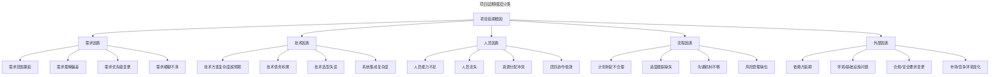
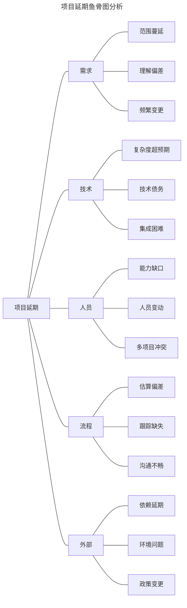
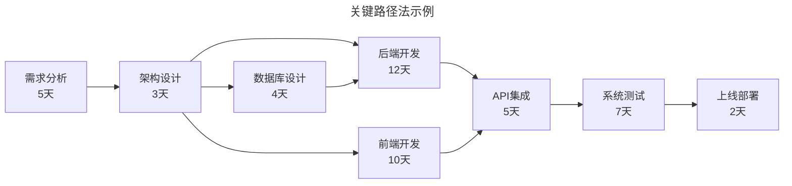
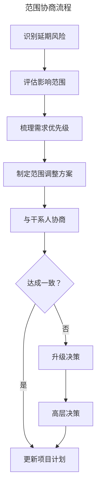
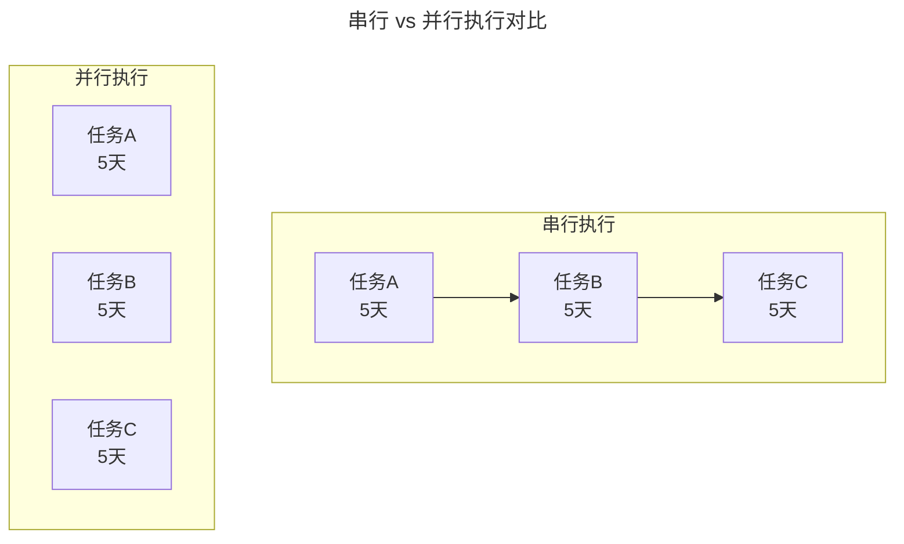
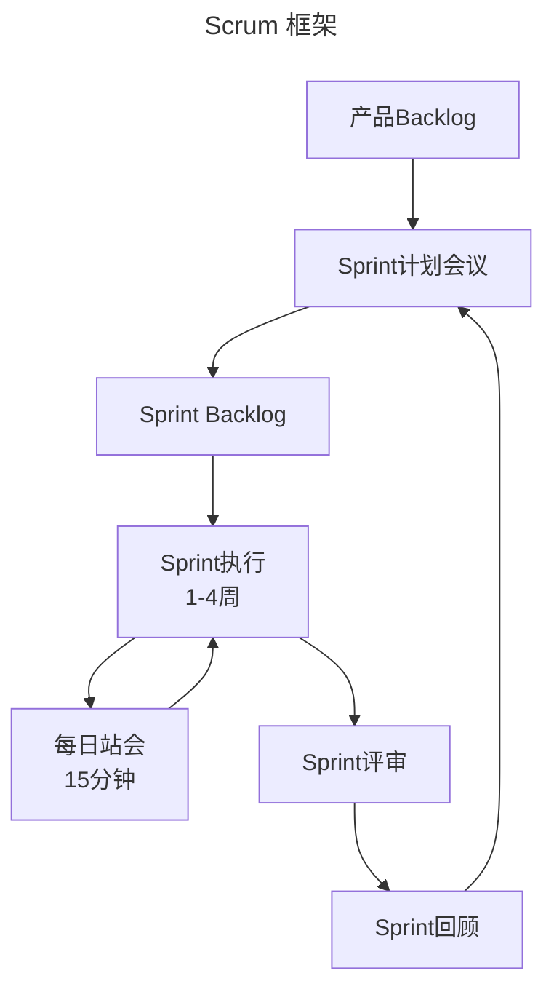
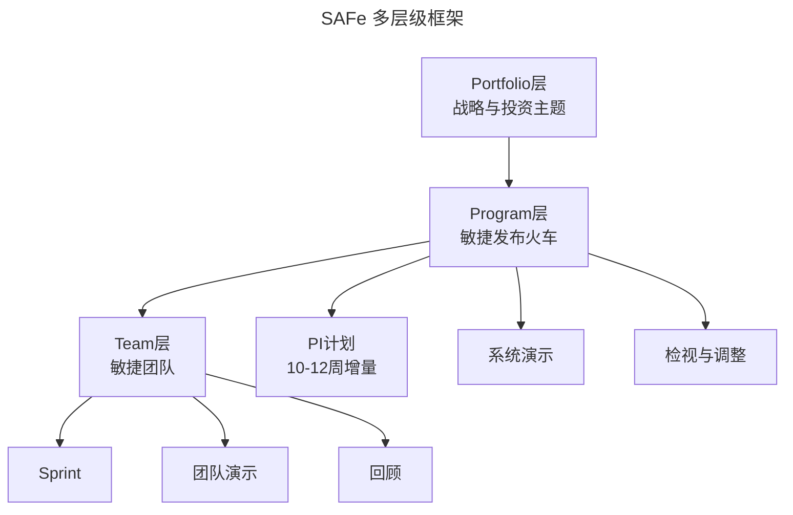
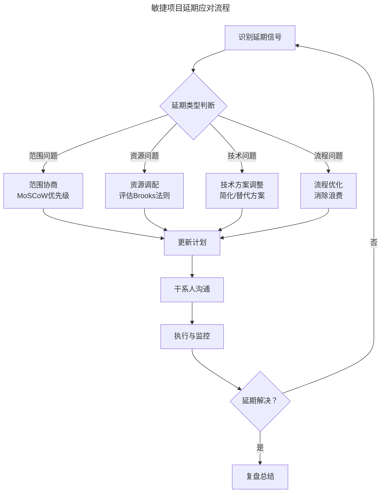
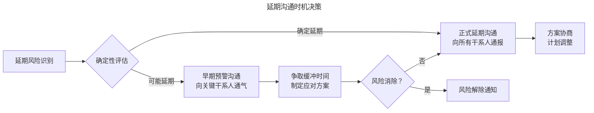

# 项目延期管理：从根因分析到敏捷应对

> **适用范围**：技术负责人、项目经理、Tech Lead 及需要应对项目延期、向上沟通与干系人管理的管理者；适用于软件项目的计划、预警、应急与复盘全周期。
>
> **更新摘要（v2 · 2026-08 更新）**：
> - 结构化升级为 6 节骨架（导言 / 核心方法论 / 关键流程 / 工具与实战 / 常见误区 / 进阶延展）
> - 为全部 9 张 Mermaid 图补充 `--- title: ... ---` frontmatter 与图后文字解读
> - 将原"参考资料"融入"6. 进阶延展"以便读者顺读
> - 保留 CPM、燃尽图、MoSCoW、Brooks 法则、Scrum/Kanban/SAFe、延期沟通模板等核心工具

## 1. 导言

项目延期是软件工程领域最普遍且最具破坏性的管理挑战之一。根据Standish Group的CHAOS报告，约65%的软件项目存在不同程度的延期。软件项目延期的根本原因在于其固有的复杂性、不可见性和不确定性——软件没有物理形态，其复杂度难以从表面判断，且需求变更频繁。

本文系统阐述项目延期的根因分析、预警机制、应对策略及敏捷项目管理实践，帮助技术管理者建立科学的项目延期管理体系。全文按"根因→预警→应对→实战→误区→趋势"组织，既可作为应急参考，也可作为预防性管理的工作底稿。

## 2. 核心方法论

### 2.1 延期根因分类

项目延期的根因可系统性地分为五大类别：



五大类根因覆盖了从需求到外部的全维度。延期分析时应避免只归因于"人员能力不足"这一最容易被归咎的因素，而需系统性排查每一类根因。

### 2.2 鱼骨图分析

使用鱼骨图（Ishikawa Diagram）对延期进行结构化根因分析：



鱼骨图将"项目延期"作为鱼头，五大类因素作为主骨，每类下的具体原因作为细骨。与根因分类图相比，鱼骨图更适合在团队复盘会议中作为可视化工具，引导团队头脑风暴并归集原因。

### 2.3 软件项目延期的特殊性

软件项目相比传统工程项目具有独特的延期风险：

| 特性 | 传统工程项目 | 软件项目 |
|------|-------------|----------|
| 可见性 | 物理形态可见，复杂度可感知 | 无物理形态，复杂度难以直观判断 |
| 变更成本 | 设计阶段变更成本低，施工阶段高 | 变更成本曲线非线性，中期可能骤升 |
| 进度评估 | 可通过物理进度直观评估 | 进度难以准确量化（90%完成陷阱） |
| 复杂度 | 线性或可预测 | 非线性，可能指数级增长 |
| 依赖关系 | 相对明确 | 隐性依赖多，耦合复杂 |

### 2.4 延期根因的5-Why分析法

以"项目延期"为起点，通过5-Why逐层深入：

```
现象：项目延期2周
→ Why1：核心功能开发未按时完成
→ Why2：数据库迁移方案比预期复杂3倍
→ Why3：迁移方案设计时未充分评估遗留数据结构
→ Why4：设计阶段缺少对遗留系统的深度调研
→ Why5：项目启动时未建立技术风险评估机制
→ 根因：缺乏系统化的技术风险评估流程
```

5-Why 的价值在于避免停留在"核心功能未按时完成"这种表层归因，而是逐层追问至可改进的流程性根因。本例最终定位到"技术风险评估流程缺失"，这是一个可操作的改进点。

## 3. 关键流程

### 3.1 关键路径法（CPM）

关键路径法（Critical Path Method）用于识别决定项目最短工期的任务链：



**关键路径管理要点**：

- 关键路径上的任何延迟直接导致项目延期
- 非关键路径任务有浮动时间（Slack/Float）
- 关键路径可能随进度动态变化
- 需定期重新计算关键路径

上图中最长路径（需求→架构→数据库设计→后端→API集成→测试→上线，共 38 天）即为关键路径，总工期决定项目交付时间。前端开发虽有 10 天，但因其与后端并行且总时长更短，故不在关键路径上，存在浮动时间。

### 3.2 燃尽图与速度追踪

燃尽图（Burndown Chart）是敏捷项目中最直观的进度监控工具：

**燃尽图异常模式识别**：

| 异常模式 | 图形特征 | 可能原因 | 应对措施 |
|----------|----------|----------|----------|
| 持续平坦 | 剩余工作量不下降 | 任务阻塞或团队闲置 | 排查阻塞项，重新分配资源 |
| 反弹上升 | 剩余工作量增加 | 范围蔓延或发现隐藏工作 | 评估新增工作，调整范围 |
| 持续偏移 | 实际线始终在理想线上方 | 估算偏差或效率低下 | 重新校准估算，提升效率 |
| 末期骤降 | 末期工作量快速下降 | 前期拖延后期赶工 | 加强过程管理，避免赶工 |

### 3.3 风险登记册

风险登记册（Risk Register）是系统化风险管理的核心工具：

| 字段 | 描述 |
|------|------|
| 风险编号 | 唯一标识 |
| 风险描述 | 风险的具体描述 |
| 风险类别 | 需求/技术/人员/流程/外部 |
| 发生概率 | 高/中/低 |
| 影响程度 | 高/中/低 |
| 风险等级 | 概率×影响 |
| 触发条件 | 风险发生的预警信号 |
| 应对策略 | 减轻/转移/规避/接受 |
| 责任人 | 负责监控和应对的人员 |
| 当前状态 | 开放/已发生/已关闭 |

### 3.4 延期预警指标体系

建立量化的延期预警指标：

| 预警指标 | 计算方式 | 预警阈值 |
|----------|----------|----------|
| 进度偏差（SV） | EV - PV | SV < 0 |
| 进度绩效指数（SPI） | EV / PV | SPI < 0.9 |
| 需求变更率 | 变更需求数/总需求数 | > 15% |
| 缺陷发现率 | 缺陷数/千行代码 | 高于基线50% |
| 关键路径偏移 | 实际关键路径长度/计划 | > 10% |
| 资源利用率 | 实际投入/计划投入 | < 80% 或 > 120% |

### 3.5 范围协商

范围协商是应对延期最有效的策略之一：

**MoSCoW优先级框架**：

| 优先级 | 含义 | 处理方式 |
|--------|------|----------|
| Must Have | 核心功能，不可裁剪 | 必须交付 |
| Should Have | 重要功能，有替代方案 | 优先交付，必要时可延后 |
| Could Have | 锦上添花的功能 | 延期时首选裁剪对象 |
| Won't Have | 明确排除的功能 | 不纳入当前迭代 |

**范围协商流程**：



范围协商流程图体现了"识别→评估→方案→协商→升级"的闭环。关键在于协商不成时及时升级决策，而非在原方案上反复纠缠，避免错失调整窗口。

### 3.6 资源调配

资源调配策略需考虑约束条件：

| 策略 | 适用条件 | 风险 |
|------|----------|------|
| 增加人力 | 任务可并行化、新人可快速上手 | Brooks法则：向延期项目加人可能更延期 |
| 人员替换 | 现有人员能力不匹配 | 知识转移成本 |
| 全职投入 | 成员多项目兼职 | 其他项目受影响 |
| 外部支援 | 内部资源已耗尽 | 沟通成本、质量风险 |
| 加班赶工 | 短期、可控的延期 | 团队倦怠、质量下降 |

**Brooks法则的辩证理解**：

> "向一个已经延期的软件项目增加人手，只会使其更加延期。" —— Fred Brooks

此法则的核心在于：新增人员的沟通成本（n(n-1)/2）和培训成本在短期内会降低团队效率。但在以下条件下增加人力仍可考虑：

- 任务可高度并行化
- 新人可独立承担模块
- 有充足的培训与知识转移时间
- 项目剩余工期较长

### 3.7 并行化策略

通过任务并行化压缩关键路径：



**并行化前提条件**：

- 任务间依赖关系可解耦
- 有足够的资源支持并行
- 集成风险可控
- 质量标准可保障

上图直观对比了串行（15 天）与并行（5 天）的工期差异。但并行化的隐性成本是集成风险与协调开销，需在压缩工期的收益与集成成本间权衡。

### 3.8 技术债务管理

延期压力下容易积累技术债务，需建立平衡机制：

| 决策维度 | 短期导向 | 长期导向 |
|----------|----------|----------|
| 代码质量 | 快速实现，后续重构 | 严格标准，控制债务 |
| 测试覆盖 | 核心路径测试 | 全面测试覆盖 |
| 架构设计 | 最小可行架构 | 可扩展架构 |
| 文档 | 最少文档 | 完整文档 |

**技术债务管理策略**：

1. **显式记录**：将技术债务纳入Backlog，标注利息成本
2. **定期偿还**：每个迭代预留10-20%时间处理技术债务
3. **债务上限**：设定技术债务容忍阈值
4. **成本量化**：评估技术债务对开发效率和延期风险的影响

## 4. 工具与实战

### 4.1 Scrum框架

Scrum是最广泛使用的敏捷框架，其核心机制天然支持延期管理：



**Scrum的延期管理机制**：

| 机制 | 作用 | 延期管理价值 |
|------|------|-------------|
| 短迭代 | 1-4周交付周期 | 早期发现问题，快速调整 |
| 每日站会 | 每日同步进展 | 实时识别阻塞项 |
| Sprint评审 | 迭代末成果展示 | 及时获取反馈，调整方向 |
| Sprint回顾 | 团队持续改进 | 优化流程，预防延期 |
| 速度追踪 | 度量团队产能 | 科学估算，合理承诺 |

### 4.2 Kanban方法

Kanban通过可视化工作流和限制在制品（WIP）来优化交付效率：

**Kanban核心原则**：

1. **可视化工作流**：将所有工作项展示在看板上
2. **限制WIP**：每个阶段设置在制品上限
3. **管理流动**：监控和优化工作项的流动速度
4. **显式策略**：明确工作项的流转规则
5. **反馈回路**：建立定期回顾和优化机制
6. **协作改进**：基于数据持续优化流程

**Kanban看板示例**：

| 待办 | 分析中（WIP≤3） | 开发中（WIP≤5） | 测试中（WIP≤3） | 待部署 | 已完成 |
|------|-----------------|-----------------|-----------------|--------|--------|
| T-12 | T-08 | T-05 | T-02 | T-01 | T-00 |
| T-11 | T-07 | T-04 | | | |
| T-10 | | T-03 | | | |

### 4.3 SAFe框架

对于大规模项目，SAFe（Scaled Agile Framework）提供多层级协同机制：



**SAFe的延期管理优势**：

- **PI计划**：每10-12周进行跨团队协同计划
- **依赖管理**：在PI计划中识别和解决跨团队依赖
- **风险ROAM**：Resolved/Owned/Accepted/Mitigated风险分类
- **系统演示**：每迭代展示集成成果

### 4.4 敏捷项目延期应对流程



应对流程图的核心是"延期类型判断"分支：不同根因对应不同应对策略，避免"一刀切"地加人或加班。流程末端的"复盘总结"确保延期经验转化为流程改进。

### 4.5 延期沟通框架

项目延期的向上沟通需遵循结构化框架：

**延期沟通四要素**：

1. **现状陈述**：项目当前状态、延期程度、影响范围
2. **根因分析**：延期的根本原因（非借口）
3. **已采取措施**：团队已采取的应对措施及效果
4. **方案建议**：提出的解决方案及所需支持

**延期沟通模板**：

```yaml
项目名称: XXX系统升级项目
当前状态: 预计延期2周（原定3月15日 → 3月29日）
延期根因: 数据库迁移方案复杂度超预期，遗留数据结构比评估多3倍
已采取措施:
  - 增加1名DBA支持迁移工作
  - 将非核心报表功能移至下一迭代
  - 每日同步迁移进展
建议方案:
  - 方案A: 范围裁剪，按时交付核心功能（推荐）
  - 方案B: 延期2周，全功能交付
  - 方案C: 分阶段交付，核心功能按时，其余延后1周
所需支持: 产品团队确认范围裁剪方案，DBA团队持续支持
```

### 4.6 干系人管理矩阵

| 干系人 | 关注点 | 沟通策略 | 沟通频率 |
|--------|--------|----------|----------|
| 高层管理 | 业务影响、ROI | 聚焦方案和结果 | 延期确认时+每周 |
| 产品团队 | 功能范围、上线时间 | 范围协商、优先级对齐 | 每周 |
| 开发团队 | 工作负荷、技术方案 | 透明沟通、参与决策 | 每日 |
| QA团队 | 测试范围、质量标准 | 调整测试策略 | 每周 |
| 运营团队 | 上线准备、用户影响 | 提前通知、协调资源 | 关键节点 |
| 客户/用户 | 交付时间、功能可用性 | 期望管理、分阶段交付 | 关键节点 |

### 4.7 延期沟通的时机选择



**沟通时机原则**：

- **宁可误报，不可漏报**：早期预警的成本远低于延期后的补救
- **带着方案沟通**：不要只报告问题，必须附带解决方案
- **分层沟通**：先核心干系人，再扩展到所有相关方
- **持续更新**：延期处理过程中保持定期进展同步

上图强调"早期预警"与"正式延期"两个时机的区分：早期预警面向关键干系人争取缓冲，正式延期则面向所有干系人通报方案。两者不可混淆，更不可跳过早期预警直接进入正式延期。

### 4.8 延期预防清单

**计划阶段**：

- [ ] 采用三点估算法（乐观/最可能/悲观）进行工期估算
- [ ] 预留15-20%的缓冲时间
- [ ] 识别关键路径并重点监控
- [ ] 建立风险登记册并制定应对策略
- [ ] 确保所有干系人对计划达成共识

**执行阶段**：

- [ ] 建立定期同步机制（每日站会/周会）
- [ ] 维护共享的项目状态看板
- [ ] 追踪燃尽图/速度指标
- [ ] 及时识别和上报风险
- [ ] 确保所有成员了解计划和进展

**监控阶段**：

- [ ] 定期评估进度偏差（SV/SPI）
- [ ] 监控需求变更率
- [ ] 追踪关键路径偏移
- [ ] 检查资源利用率
- [ ] 评估技术债务积累

### 4.9 延期复盘框架

每次延期后进行结构化复盘：

| 复盘维度 | 关键问题 |
|----------|----------|
| 根因 | 延期的根本原因是什么？ |
| 预警 | 最早何时能发现延期风险？为何未能更早发现？ |
| 应对 | 采取的应对措施是否有效？ |
| 流程 | 哪些流程改进可以预防类似延期？ |
| 沟通 | 延期沟通是否及时、充分？ |
| 学习 | 团队从这次延期中学到了什么？ |

### 4.10 项目状态可视化

共享项目状态表是延期管理的核心工具：

**状态看板要素**：

| 任务 | 负责人 | 状态 | 计划完成 | 预计完成 | 风险等级 | 阻塞项 |
|------|--------|------|----------|----------|----------|--------|
| 用户认证 | 张三 | 进行中 | 3/10 | 3/12 | 🟡中 | 依赖第三方API |
| 数据迁移 | 李四 | 进行中 | 3/15 | 3/20 | 🔴高 | 遗留数据复杂 |
| 前端重构 | 王五 | 已完成 | 3/8 | 3/7 | 🟢低 | - |
| 性能优化 | 赵六 | 未开始 | 3/20 | - | 🟡中 | 等待数据迁移 |

**可视化原则**：

1. 所有关键干系人可随时访问
2. 每日更新，反映最新状态
3. 使用颜色编码标识风险等级
4. 标注阻塞项及责任人
5. 保持计划与实际的对比可见

## 5. 常见误区

### 5.1 90%完成陷阱

软件项目进度难以准确量化，常出现"90%完成"的幻觉——任务看起来只剩 10%，但这 10% 往往涉及集成、测试、修复缺陷等隐性工作，实际工作量可能远超预期。应对策略：以"可演示的完成定义（Definition of Done）"替代百分比进度，未通过测试与验收的工作不计入完成。

### 5.2 误用 Brooks 法则

向延期项目加人是经典的反模式，但反过来"永远不加人"同样错误。Brooks 法则的前提是"任务不可并行化、新人需要长期培训"。在任务可高度并行、有充足知识转移时间、剩余工期较长时，增加人力仍是可行策略。关键在于评估沟通成本增量是否小于并行收益。

### 5.3 范围蔓延未及时识别

需求范围蔓延是延期最常见根因，但往往在燃尽图"反弹上升"时才被察觉，此时已错过最佳调整窗口。应在需求变更率超过 15% 预警阈值时立即启动范围协商，而非等到燃尽图明显恶化。

### 5.4 隐性依赖未识别

软件项目的依赖关系往往隐性且耦合复杂，关键路径分析时若遗漏隐性依赖（如共享库升级、配置变更、数据迁移），会导致并行化策略失效。应在 PI 计划或 Sprint 计划中显式梳理跨团队依赖，并设置依赖看板。

### 5.5 加班赶工作为常规手段

短期、可控的加班可应对偶发延期，但将加班作为常规手段会导致团队倦怠、质量下降与人员流失，反而加剧后续延期。应将加班视为例外而非规则，并在加班后安排恢复时间。

### 5.6 沟通时机延误

"等确定了再沟通"是常见的沟通误区。延期风险一旦识别，即使尚未确定，也应向关键干系人发出早期预警。延迟沟通会压缩干系人的决策窗口，使原本可控的问题升级为危机。

### 5.7 只报问题不带方案

向上沟通时只陈述延期事实而不附带解决方案，会迫使高层在信息不全的情况下做决策，也损害负责人的专业形象。每次延期沟通必须包含至少 2 个备选方案及推荐选项。

## 6. 进阶延展

### 6.1 AI驱动的项目预测

- **智能工期估算**：基于历史数据的AI工期预测模型
- **风险预警系统**：AI实时分析项目数据，提前预警延期风险
- **资源优化引擎**：AI辅助的资源调配与优化建议
- **自动化进度追踪**：从代码提交、PR合并等自动推算进度

### 6.2 DevOps与项目管理的融合

- **CI/CD指标纳入项目监控**：部署频率、变更前置时间作为进度指标
- **自动化测试覆盖率**：作为质量与进度双重指标
- **基础设施即代码**：减少环境依赖导致的延期
- **可观测性驱动**：通过生产指标反推项目健康度

### 6.3 远程与分布式项目管理

- **异步协作工具**：适应跨时区团队的进度管理
- **虚拟看板**：数字化的项目状态可视化
- **异步站会**：通过文字/视频留言替代同步站会
- **分布式团队的速度校准**：调整估算基准以适应远程效率

### 6.4 价值流管理（VSM）

- **端到端价值流映射**：从需求到交付的全流程可视化
- **流动效率优化**：减少等待时间，提升价值流动速度
- **瓶颈识别与消除**：基于价值流的系统性瓶颈分析
- **精益指标**：流动时间、流动效率替代传统进度指标

### 6.5 延伸阅读

- Brooks, F. (1975). *The Mythical Man-Month*. Addison-Wesley. —— Brooks 法则的源头。
- Grove, A. (1983). *High Output Management*. Random House.
- Schwaber, K. & Sutherland, J. (2020). *The Scrum Guide*.
- Anderson, D. (2010). *Kanban: Successful Evolutionary Change for Your Technology Business*. Blue Hole Press.
- Leffingwell, D. (2018). *SAFe 4.5 Distilled*. Addison-Wesley.
- Kerzner, H. (2017). *Project Management: A Systems Approach*. Wiley.
- DeMarco, T. & Lister, T. (2003). *Waltzing with Bears: Managing Risk on Software Projects*. Dorset House.
- Reinertsen, D. (2009). *The Principles of Product Development Flow*. Celeritas Publishing. —— 价值流管理经典。
