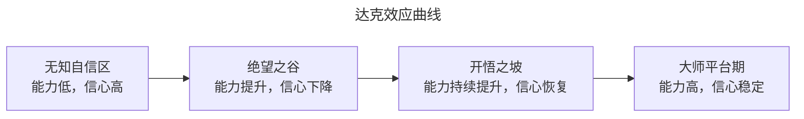
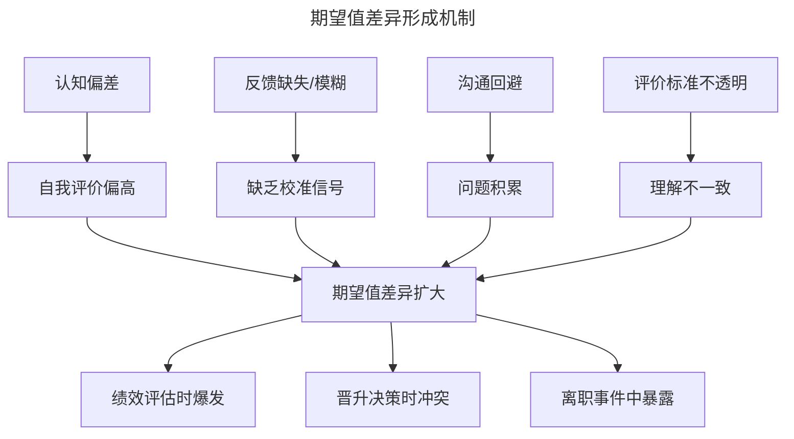
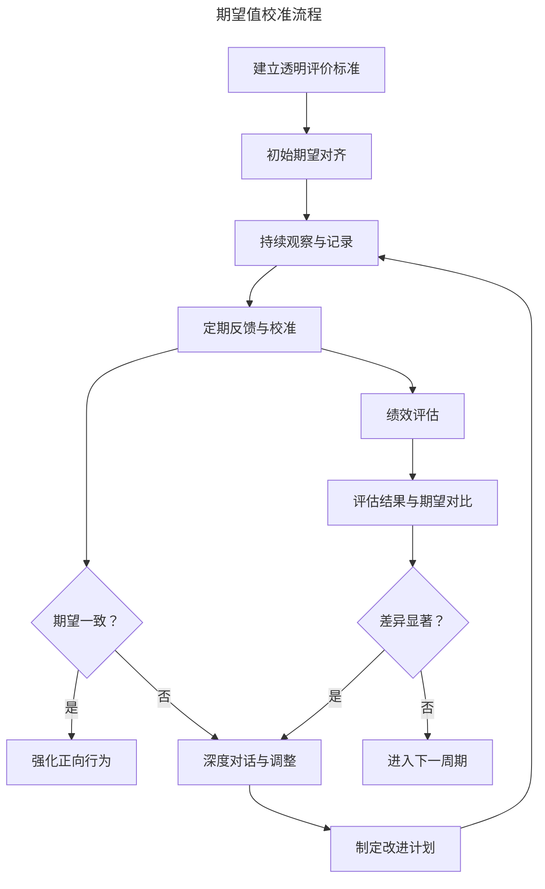
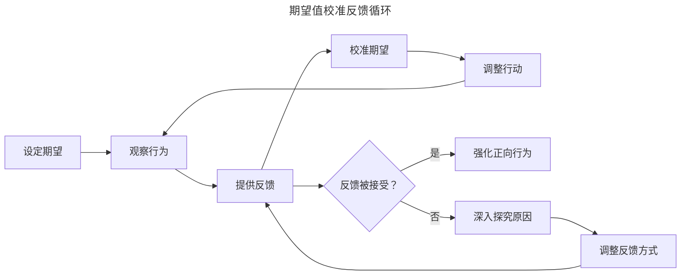
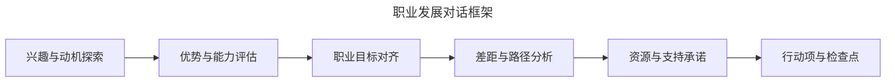

# 期望值校准：消除管理者与被管理者之间的认知鸿沟

> **适用范围**：技术管理者、团队 Lead、HRBP 及希望理解期望差异根源的工程师；适用于绩效面谈、晋升评估、1:1 校准与离职预防等场景。
>
> **更新摘要（v2 · 2026-08 更新）**：
> - 结构化升级为 6 节骨架（导言 / 核心方法论 / 关键流程 / 工具与实战 / 常见误区 / 进阶延展）
> - 为全部 5 张 Mermaid 图补充 `--- title: ... ---` frontmatter 与图后文字解读
> - 将原"参考资料"融入"6. 进阶延展"以便读者顺读
> - 保留达克效应、四维校准模型、SBI-I 困难对话、EGI 指数等核心工具

## 1. 导言

管理者与被管理者之间的期望值差异（Expectation Gap）是组织中最普遍且最具破坏性的隐性管理问题之一。这种差异往往在绩效评估、晋升决策或离职事件中才被暴露，导致一方感到意外和委屈。研究表明，期望值差异的根源在于系统性的认知偏差——个体倾向于高估自身能力和贡献，而组织缺乏有效的校准机制。

本文从认知心理学视角系统阐述期望值差异的理论基础，构建结构化的校准框架，并提供可操作的深度对话与持续跟进技术。全文按"理论→流程→工具→误区→趋势"组织，帮助管理者将期望值校准从事后补救转为事前预防。

## 2. 核心方法论

### 2.1 认知偏差与期望值差异

期望值差异的核心驱动力是一系列系统性的认知偏差：

| 认知偏差 | 定义 | 在期望值差异中的表现 |
|----------|------|---------------------|
| 自我服务偏差 | 将成功归因于自身，将失败归因于外部 | 高估自身贡献，低估他人和环境的帮助 |
| 自利性偏差 | 倾向于以有利于自身的方式解读信息 | 对正面反馈过度加权，对负面反馈过度打折 |
| 确认偏差 | 倾向于寻找支持已有信念的信息 | 选择性关注支持自我评价的证据 |
| 锚定效应 | 过度依赖最先获得的信息 | 以自我评价为锚点，难以调整 |
| 虚假共识效应 | 高估他人与自己观点一致的程度 | 假设上级对自己的评价与自我评价一致 |
| 朴素实在论 | 认为自己看到的是客观现实 | "我明明做得很好"——忽视评价的主观性 |

### 2.2 达克效应

达克效应（Dunning-Kruger Effect）是解释期望值差异的关键理论：



**达克效应对管理实践的启示**：

- 初级员工往往高估自己的能力水平（无知自信区）
- 管理者若不及时校准，期望值差异将持续扩大
- 能力提升过程中，员工可能经历信心下降（绝望之谷）
- 校准需要持续进行，而非一次性活动

上图揭示了能力与信心非同步增长的规律：初学者因"不知道自己不知道"而过度自信，这正是期望值差异的高发区。管理者应在新人期密集校准，帮助员工从"无知自信区"平稳过渡到"开悟之坡"。

### 2.3 自我服务偏差的实证

自我服务偏差在职场中的典型表现：

- **90%的司机**认为自己的驾驶技术高于平均水平（统计学上不可能）
- **80%的员工**认为自己的绩效处于前25%
- **绝大多数创业者**认为自己会成功，而实际创业失败率超过90%
- **绩效评估中**，员工自评分数普遍高于上级评价1-2个等级

### 2.4 期望值差异的形成机制



形成机制图揭示了期望值差异是四类因素（认知偏差、反馈缺失、沟通回避、标准不透明）共同作用的结果，最终在绩效、晋升、离职三个高敏事件中爆发。这意味着校准必须从这四个根因同时入手，单点干预效果有限。

## 3. 关键流程

### 3.1 期望值校准流程

期望值校准是一个持续的系统化过程：



校准流程图的核心是"持续观察与记录→定期反馈与校准→期望一致判断"的主循环。无论日常校准还是绩效评估，发现差异后都进入"深度对话与调整"分支，避免差异积累到爆发点。

### 3.2 四维校准模型

期望值校准需覆盖四个维度：

| 维度 | 校准内容 | 校准频率 |
|------|----------|----------|
| 角色期望 | 岗位职责、工作范围、决策权限 | 入职/转岗时 |
| 绩效期望 | 产出标准、质量要求、交付时间 | 每季度 |
| 行为期望 | 协作方式、沟通风格、职业素养 | 持续 |
| 发展期望 | 成长目标、晋升路径、能力发展 | 每半年 |

### 3.3 期望值差异的诊断

识别期望值差异的早期信号：

**管理者端的预警信号**：

- 员工对反馈表现出意外或不满
- 员工频繁表达"我以为……"
- 绩效自评与实际表现差距显著
- 员工对晋升/加薪有不切实际的预期
- 员工回避绩效讨论

**员工端的预警信号**：

- 感觉上级的反馈与日常评价不一致
- 不清楚上级对自己的真实期望
- 对工作优先级感到困惑
- 感觉努力未被认可
- 对职业发展方向不明确

### 3.4 期望值差异的量化评估

使用期望值差异指数（EGI）进行量化：

```
EGI = |自我评价值 - 管理者评价值| / 量表最大值

EGI < 0.1: 高度一致
0.1 ≤ EGI < 0.2: 轻微差异
0.2 ≤ EGI < 0.3: 显著差异
EGI ≥ 0.3: 严重差异，需立即干预
```

### 3.5 检查点设计

持续跟进是期望值校准的关键保障：

**检查点体系**：

| 检查点类型 | 频率 | 形式 | 核心内容 |
|------------|------|------|----------|
| 微检查 | 每周 | 1:1中简短提及 | 进展确认、障碍识别 |
| 月度检查 | 每月 | 1:1中专题讨论 | 目标进展、偏差识别 |
| 季度校准 | 每季度 | 专项会议 | 期望值全面校准 |
| 半年回顾 | 每半年 | 深度对话 | 职业发展、长期期望 |

### 3.6 反馈循环

建立结构化的反馈循环机制：



**反馈循环的关键原则**：

1. **及时性**：行为发生后尽快提供反馈
2. **具体性**：基于具体行为和结果，而非笼统评价
3. **平衡性**：正面反馈与建设性反馈并重
4. **一致性**：反馈内容与评价标准保持一致
5. **双向性**：鼓励员工对反馈进行回应和讨论

反馈循环图强调反馈被拒绝时不能强行推进，而应进入"深入探究原因→调整反馈方式"的子循环，避免在认知偏差未解决的情况下反复无效校准。

### 3.7 承诺追踪

对深度对话中达成的约定进行系统追踪：

**承诺追踪表**：

| 承诺内容 | 承诺方 | 截止日期 | 检查点 | 当前状态 |
|----------|--------|----------|--------|----------|
| 提供跨团队项目机会 | 管理者 | 3月底 | 2月底确认 | 进行中 |
| 完成系统设计认证 | 员工 | 6月底 | 每月检查 | 已启动 |
| 安排架构师导师 | 管理者 | 2月中 | 2月初确认 | 已完成 |
| 主导一次技术分享 | 员工 | 4月底 | 3月底准备 | 待启动 |

**承诺追踪原则**：

- 双方承诺均需记录和追踪
- 客观因素导致承诺无法兑现时，需第一时间沟通并调整
- 管理者未兑现承诺会严重损害信任
- 员工未兑现承诺会影响后续机会分配

### 3.8 期望值动态调整

期望值并非一成不变，需根据以下因素动态调整：

| 触发因素 | 调整方向 | 调整方式 |
|----------|----------|----------|
| 业务战略变化 | 优先级和重点调整 | 重新对齐目标 |
| 组织架构调整 | 角色和职责变化 | 重新定义期望 |
| 能力显著提升 | 提高期望和挑战 | 提供更大空间 |
| 外部环境变化 | 资源和时间调整 | 重新协商约定 |
| 个人情况变化 | 工作方式调整 | 灵活调整安排 |

## 4. 工具与实战

### 4.1 职业发展对话

职业发展对话是校准长期期望值的核心工具：

**对话框架**：



**对话问题清单**：

| 阶段 | 关键问题 | 目的 |
|------|----------|------|
| 兴趣探索 | 什么工作让你最有成就感？ | 了解内在动机 |
| 优势识别 | 你最擅长什么？别人最常找你帮什么？ | 识别核心优势 |
| 目标对齐 | 未来2-3年你想达到什么位置？ | 校准发展期望 |
| 差距分析 | 达到目标需要发展哪些能力？ | 客观评估现状 |
| 路径规划 | 有哪些机会可以帮助你成长？ | 制定可行路径 |
| 支持承诺 | 你希望我提供哪些帮助？ | 明确管理者责任 |

对话框架图展示了从"兴趣"到"行动项"的六步流程。关键在于每一步都需双方共同产出，而非管理者单方面宣布，否则会强化而非消除期望差异。

### 4.2 绩效期望对齐

绩效期望对齐是校准短期期望值的关键：

**对齐流程**：

1. **明确标准**：清晰定义"优秀"、"达标"、"需改进"的具体行为标准
2. **双向沟通**：确保员工理解并认同这些标准
3. **示例对照**：提供具体的正例和反例
4. **中期检查**：在评估周期中进行至少一次中期校准
5. **证据积累**：持续记录支持评估的具体事例

**绩效期望对齐模板**：

```yaml
岗位: 高级后端工程师
评估周期: 2025 Q1

绩效维度:
  技术能力:
    优秀: 独立设计复杂系统架构，指导他人技术决策
    达标: 独立完成模块设计，代码质量稳定
    需改进: 需要指导才能完成设计任务
  
  项目执行:
    优秀: 主动识别风险，提前制定应对方案
    达标: 按时交付，质量符合预期
    需改进: 经常延期或需要他人补救
  
  团队贡献:
    优秀: 主动培养他人，推动团队最佳实践
    达标: 积极参与代码评审和知识分享
    需改进: 仅完成个人任务，缺乏团队贡献
```

### 4.3 困难对话技术

当期望值差异显著时，需进行困难对话（Difficult Conversation）：

**SBI-I模型**（Situation-Behavior-Impact-Invitation）：

1. **Situation**：描述具体情境
2. **Behavior**：描述观察到的行为
3. **Impact**：说明该行为的影响
4. **Invitation**：邀请对方表达观点并共同寻找解决方案

**困难对话示例**：

> 在过去三个月的项目中（情境），你负责的三个模块有两个延期交付（行为），这导致下游团队的工作计划被打乱，整体项目延期一周（影响）。我想听听你对这个情况的看法，以及我们可以一起做些什么来改善（邀请）。

**困难对话原则**：

- **准备充分**：提前收集具体事例和数据
- **选择时机**：在私密、不受打扰的环境中进行
- **聚焦行为**：讨论具体行为而非人格特质
- **双向交流**：给予对方充分表达的机会
- **共同解决**：邀请对方参与制定改进方案
- **跟进承诺**：明确后续的检查点和支持

### 4.4 对话中的认知偏差干预

在深度对话中主动干预认知偏差：

| 偏差 | 干预策略 | 示例 |
|------|----------|------|
| 自我服务偏差 | 引导关注具体行为和结果 | "让我们看看这个项目的具体交付情况" |
| 确认偏差 | 提供反面证据 | "我注意到你提到了成功的案例，也有一些需要改进的地方" |
| 锚定效应 | 提供客观参照标准 | "这个级别的典型表现是这样的……" |
| 虚假共识效应 | 显式表达差异 | "我理解你的看法，我的观察是……" |

### 4.5 透明化评价体系

建立透明的评价体系是预防期望值差异的基础：

**评价体系要素**：

1. **级别定义**：每个级别的清晰能力要求
2. **晋升标准**：晋升所需的具体证据和表现
3. **评估流程**：评估的时间、方式、参与者
4. **反馈机制**：评估结果的沟通和申诉渠道

**级别能力要求示例**：

```yaml
级别: L5 - 高级工程师
技术能力:
  - 独立设计中等复杂度系统
  - 解决跨模块技术难题
  - 代码质量作为团队标杆
项目执行:
  - 独立负责项目的技术交付
  - 主动识别和管理技术风险
  - 交付质量稳定可靠
影响力:
  - 在团队内进行技术分享
  - 参与代码评审并提供建设性意见
  - 帮助新人成长
领导力:
  - 指导1-2名初级工程师
  - 推动团队工程实践改进
```

### 4.6 持续绩效管理

从年度评估转向持续绩效管理（Continuous Performance Management）：

| 维度 | 传统年度评估 | 持续绩效管理 |
|------|-------------|-------------|
| 频率 | 每年1-2次 | 持续进行 |
| 反馈时机 | 滞后数月 | 即时/近期 |
| 目标设定 | 年初设定，年底检查 | 季度OKR，持续调整 |
| 对话深度 | 评估导向 | 发展导向 |
| 员工参与 | 被动接受 | 主动参与 |
| 期望值校准 | 评估时才发现差异 | 持续校准，差异可控 |

### 4.7 360度反馈机制

360度反馈是校准期望值差异的有效工具：

**实施要点**：

- **匿名性保障**：确保反馈者可以坦诚表达
- **结构化问题**：使用标准化问题收集反馈
- **多维度覆盖**：上级、同级、下属、跨部门
- **专业解读**：由受过训练的HR或教练协助解读
- **发展导向**：反馈用于发展而非惩罚

### 4.8 期望值校准工作坊

团队级别的期望值校准工作坊：

**工作坊流程**：

1. **开场**：介绍期望值差异的概念和影响（15分钟）
2. **自我评估**：每人完成能力自评（10分钟）
3. **标准分享**：公开讨论各级别的期望标准（20分钟）
4. **差异识别**：对比自评与标准，识别差异（15分钟）
5. **小组讨论**：讨论差异的原因和校准方法（20分钟）
6. **行动计划**：制定个人校准行动计划（15分钟）
7. **总结**：分享关键收获和后续跟进（5分钟）

### 4.9 管理者行动清单

**预防期望值差异**：

- [ ] 建立透明的评价标准和晋升要求
- [ ] 在1:1中定期进行期望值校准
- [ ] 提供及时、具体、持续的反馈
- [ ] 记录关键行为和结果作为评估依据
- [ ] 主动了解员工的职业期望和发展需求

**发现差异时**：

- [ ] 及时进行深度对话，避免问题积累
- [ ] 使用SBI模型提供具体反馈
- [ ] 倾听员工视角，理解差异的根源
- [ ] 共同制定改进计划，明确检查点
- [ ] 持续跟进，确保校准效果

**评估周期中**：

- [ ] 进行至少一次中期绩效预沟通
- [ ] 确保评估结果不出现意外
- [ ] 评估后进行详细的反馈对话
- [ ] 制定下一周期的发展计划

### 4.10 员工视角的期望值管理

管理者也应帮助员工发展自我校准能力：

**培养员工自我认知**：

1. **鼓励自我反思**：引导员工定期进行自我评估
2. **提供参照标准**：分享同级别的典型表现
3. **促进同伴学习**：创造跨团队交流机会
4. **引导寻求反馈**：鼓励员工主动向多人获取反馈
5. **发展元认知能力**：帮助员工认识自己的认知偏差

### 4.11 组织层面的期望值管理

**制度保障**：

| 制度 | 作用 | 实施要点 |
|------|------|----------|
| 透明晋升标准 | 消除晋升期望差异 | 公开各级别要求，提供晋升案例 |
| 持续反馈文化 | 预防差异积累 | 将反馈纳入日常管理流程 |
| 校准会议 | 消除管理者间评价差异 | 跨团队评估结果对比和讨论 |
| 申诉机制 | 提供差异解决渠道 | 确保申诉过程公正透明 |
| 跳级对话 | 获取更全面的反馈 | 定期与skip-level manager对话 |

### 4.12 典型场景应对

**场景1：员工自评远高于管理者评价**

| 步骤 | 行动 | 要点 |
|------|------|------|
| 1 | 准备具体证据 | 收集支持评价的具体事例 |
| 2 | 进行深度对话 | 使用SBI模型，聚焦行为 |
| 3 | 对齐评价标准 | 确保双方理解一致 |
| 4 | 制定改进计划 | 明确具体改进行动 |
| 5 | 增加检查频率 | 缩短反馈周期 |

**场景2：核心员工提出意外离职**

| 步骤 | 行动 | 要点 |
|------|------|------|
| 1 | 倾听理解 | 了解真实原因，不急于反驳 |
| 2 | 识别差异 | 找出期望值差异的具体方面 |
| 3 | 评估可挽回性 | 判断差异是否可以弥合 |
| 4 | 提出方案 | 如可挽回，提出具体改进方案 |
| 5 | 复盘改进 | 无论结果如何，总结经验教训 |

**场景3：员工期望晋升但尚未达标**

| 步骤 | 行动 | 要点 |
|------|------|------|
| 1 | 认可意愿 | 肯定员工的成长意愿 |
| 2 | 明确差距 | 具体说明当前与目标的差距 |
| 3 | 提供路径 | 制定清晰的发展计划 |
| 4 | 给予机会 | 提供展示能力的机会 |
| 5 | 持续跟进 | 定期检查进展并调整 |

## 5. 常见误区

### 5.1 年度评估模式导致差异积累

将期望值校准集中在年度评估是最大的反模式。此时差异已积累数月，员工难以接受突如其来的负面评价，管理者也难以提供足够的改进窗口。应转向持续绩效管理，在 1:1 中高频校准。

### 5.2 评价标准不透明

模糊的标准（如"做得好"、"有产出"）让员工以自我评价为锚点，必然导致期望差异。标准必须具体到行为级别（如"独立设计中等复杂度系统"），并提供正例与反例。

### 5.3 反馈模糊或滞后

"你最近表现不太好"这类反馈既无具体情境也无行为描述，员工无法定位问题也无法改进。反馈应遵循 SBI 模型，并在行为发生后尽快提供，避免滞后数月才在评估中提及。

### 5.4 沟通回避

管理者因担心冲突而回避困难对话，是期望值差异扩大的直接推手。问题不会因回避而消失，反而会在绩效或离职事件中爆发。应将困难对话视为常规管理工具，而非例外。

### 5.5 管理者未兑现承诺

承诺追踪表中的管理者承诺若未兑现，会严重损害信任，使后续校准对话失去公信力。管理者承诺需同等严肃对待，无法兑现时需第一时间沟通并调整。

### 5.6 单向宣布期望

管理者单方面宣布期望而不邀请员工参与，会强化而非消除差异。期望对齐应是双向对话，员工对期望的认同度直接决定后续执行力。

### 5.7 忽视认知偏差干预

不主动干预自我服务偏差、确认偏差等认知偏差，反馈对话会陷入"各说各话"。管理者应掌握偏差干预技术（提供反面证据、客观参照标准等），将对话从立场对抗转为事实对齐。

## 6. 进阶延展

### 6.1 AI辅助的期望值校准

- **智能反馈分析**：AI分析反馈中的认知偏差模式
- **期望值差异预警**：基于行为数据预测期望值差异风险
- **个性化校准建议**：AI推荐针对不同偏差的校准策略
- **360度反馈聚合**：AI辅助的多源反馈整合与解读

### 6.2 数据驱动的绩效管理

- **客观行为指标**：基于代码提交、PR、文档等客观指标辅助评估
- **贡献度量化**：多维度量化员工贡献，减少主观偏差
- **趋势分析**：追踪绩效趋势而非单点评估
- **对标分析**：与同级别典型表现进行数据对比

### 6.3 心理安全感与期望值校准

- **安全对话环境**：将心理安全感作为期望值校准的前提
- **脆弱性领导力**：管理者主动分享自身不足，降低对话防御性
- **非评判性沟通**：发展非评判性的反馈文化
- **成长型组织文化**：将期望值差异视为成长机会而非问题

### 6.4 敏捷期望值管理

- **短周期校准**：从年度校准转向季度甚至月度校准
- **OKR驱动的期望对齐**：通过OKR实现期望的显式化和可追踪
- **持续对话**：将期望值校准融入日常1:1而非专项活动
- **动态调整**：根据环境和能力变化实时调整期望

### 6.5 延伸阅读

- Kruger, J. & Dunning, D. (1999). *Unskilled and Unaware of It*. Journal of Personality and Social Psychology. —— 达克效应原始论文。
- Grove, A. (1983). *High Output Management*. Random House.
- Scott, K. (2017). *Radical Candor*. St. Martin's Press.
- Stone, D. et al. (2010). *Difficult Conversations*. Penguin Books. —— 困难对话方法论。
- Kahneman, D. (2011). *Thinking, Fast and Slow*. Farrar, Straus and Giroux. —— 认知偏差权威著作。
- Edmondson, A. (2019). *The Fearless Organization*. Wiley.
- Buckingham, M. & Goodall, A. (2019). *Nine Lies About Work*. Harvard Business Review Press.
- Dweck, C. (2006). *Mindset: The New Psychology of Success*. Random House. —— 成长型思维。
