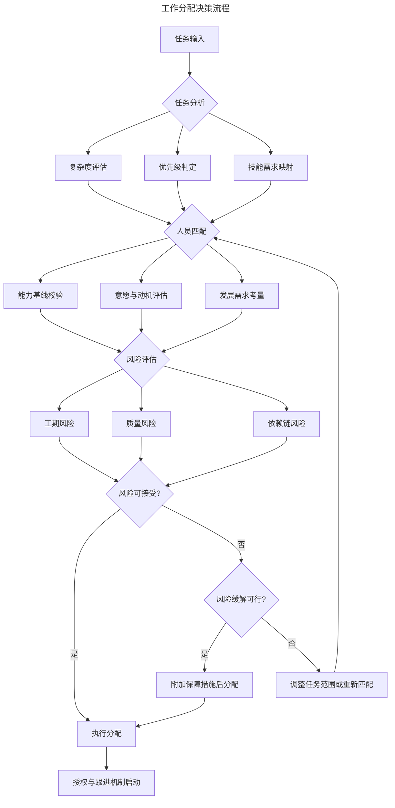

# 管理者工作分配决策框架

> **适用范围**：技术管理者、Team Lead、项目经理及需要做任务分解与人员匹配决策的领导者；适用于日常任务分配、大项目编排、新人培养与授权跟进等场景。
>
> **更新摘要（v2 · 2026-08 更新）**：
> - 结构化升级为 6 节骨架（导言 / 核心方法论 / 关键流程 / 工具与实战 / 常见误区 / 进阶延展）
> - 为全部 2 张 Mermaid 图补充 `--- title: ... ---` frontmatter 与图后文字解读
> - 将原"参考资料"融入"6. 进阶延展"以便读者顺读
> - 保留情境领导理论、能力-意愿矩阵、授权梯度、WBS 等核心工具

## 1. 导言

工作分配是技术管理者的核心职能之一，其质量直接影响团队产出效率、成员成长轨迹与组织目标达成率。有效的分配决策并非简单的任务指派，而是一个涉及任务解构、人员能力评估、风险预判与动态调整的系统工程。

本文基于情境领导理论、能力-意愿矩阵等现代管理框架，构建一套结构化的工作分配决策体系，帮助技术管理者在从一线到高管的各层级中实现精准授权与高效执行。全文按"理论→流程→工具→误区→趋势"组织，可作为分配决策的参考手册。

## 2. 核心方法论

### 2.1 情境领导理论

Hersey与Blanchard提出的情境领导理论（Situational Leadership Theory）指出，领导风格应随下属的成熟度（Maturity）动态调整。成熟度由两个维度构成：

- **工作成熟度**：个体完成任务所需的知识、经验与技能水平
- **心理成熟度**：个体完成任务的意愿、信心与责任感

根据下属成熟度从低到高，领导者应依次采用指示型（S1）、推销型（S2）、参与型（S3）、授权型（S4）四种领导风格，对应不同的工作分配与跟进策略。

### 2.2 能力-意愿矩阵

将团队成员置于能力（Competence）与意愿（Commitment）两个维度构成的矩阵中，可形成四象限分类：

| 象限 | 特征 | 分配策略 |
|------|------|----------|
| 高能力-高意愿 | 核心骨干，可独立承担关键任务 | 充分授权，设定目标即可 |
| 高能力-低意愿 | 经验丰富但动力不足 | 激励驱动，匹配兴趣与价值感 |
| 低能力-高意愿 | 新人或转岗人员，热情高但经验不足 | 密集指导，结构化任务分解 |
| 低能力-低意愿 | 需要根本性干预 | 最低限度任务，优先解决意愿问题 |

能力-意愿矩阵的价值在于将"该派谁"的直觉决策转化为可显式评估的两个维度。同一人在不同任务上的象限位置可能不同，需按任务而非按人静态归类。

## 3. 关键流程

### 3.1 分配决策框架

工作分配是一个多阶段决策过程，以下流程图展示了完整的决策路径：

决策流程图将分配拆解为"任务分析→人员匹配→风险评估→执行分配→授权跟进"五阶段。关键分支在于风险评估后的三路决策：风险可接受直接分配、可缓解则附加保障、不可缓解则回退到人员匹配阶段重新选择。

### 3.2 阶段一：任务分析

任务分析是分配决策的起点，需完成以下评估：

1. **复杂度评估**：识别任务的技术深度、跨团队依赖度与不确定性范围
2. **优先级判定**：基于业务价值与时间敏感度确定任务优先级
3. **技能需求映射**：明确完成任务所需的技术栈、领域知识与软技能组合

### 3.3 阶段二：人员匹配

在任务分析的基础上，进行人员与任务的精准匹配：

1. **能力基线校验**：验证候选人的技术能力是否满足任务需求
2. **意愿与动机评估**：判断候选人对任务的投入意愿与内在驱动力
3. **发展需求考量**：评估任务对候选人成长的潜在价值，适度安排"拉伸任务"（Stretch Assignment）

### 3.4 阶段三：风险评估

分配决策必须包含风险预判与缓解规划：

1. **工期风险**：评估时间估算的置信度与缓冲需求
2. **质量风险**：预判交付物可能存在的质量缺陷与补救成本
3. **依赖链风险**：识别任务执行过程中的外部依赖与阻塞点

## 4. 工具与实战

### 4.1 参考基线构建

在缺乏直接合作经验时，管理者需通过多源信息构建候选人的能力参考基线（Reference Baseline）：

- **第三方评价**：来自前直属上级、跨团队协作方的360度反馈
- **项目履历分析**：候选人过往项目的规模、角色、交付质量与复杂度
- **代码/文档审查**：通过代码评审记录、技术文档质量间接评估专业深度
- **社区影响力**：开源贡献、技术博客、会议演讲等外部信号

参考基线的可靠性随信息源数量与质量递增，单一信息源存在显著偏差风险。

### 4.2 提问质量评估

任务分配前的沟通环节是评估候选人理解深度与思维品质的关键窗口。评估维度包括：

| 评估指标 | 高质量表现 | 低质量表现 |
|----------|-----------|-----------|
| 问题覆盖度 | 考虑边界条件、异常流程、跨模块影响 | 仅关注主路径实现 |
| 调研深度 | 先调研后提问，问题基于事实与数据 | 凭直觉假设，缺乏事实验证 |
| 反馈迭代 | 对指导建议进行追问与深化 | 被动接受，无追问 |
| 风险意识 | 主动识别潜在风险与依赖 | 忽略风险，过度乐观 |

**核心原则**：提问质量是判断候选人是否真正理解任务复杂度的最有效指标，其预测价值往往高于口头承诺或过往业绩。

### 4.3 工期估算校验

工期估算（Effort Estimation）是分配决策的关键约束条件。有效的估算校验需关注：

1. **估算方法论**：候选人是否采用结构化估算方法（如三点估算、故事点估算），而非直觉式估算
2. **因素完备性**：估算是否涵盖开发工作量、沟通成本、技术风险、集成测试、文档编写等全链路成本
3. **乐观偏差识别**：短平快的估算往往隐含对复杂度的低估，需警惕"过度承诺陷阱"
4. **置信度区间**：要求候选人给出估算的置信度水平与假设条件，而非单一时间点

> **实践准则**：如果候选人未充分了解未知部分便给出精确估算，该估算的可信度应被显著降级。

### 4.4 执行力评估

执行力（Execution Capability）是区分"能规划者"与"能交付者"的核心维度：

- **闭环能力**：从规划到交付的完整闭环，而非半途而废
- **抗压韧性**：遇阻时的持续攻坚能力，而非遇难即退
- **质量一致性**：交付成果与初期规划的一致性程度
- **进度透明度**：执行过程中的风险预警与进度同步意识

执行力不足的典型特征：规划详尽但交付缩水、承诺积极但进度滞后、初期有序但后期混乱。对关键路径任务，应避免将高执行力风险人员设为单点依赖。

### 4.5 维护能力评估

项目交付后的维护阶段是评估成员责任感与长期可靠性的重要窗口：

- **主动运维意识**：是否自觉关注线上健康度与用户反馈
- **问题响应速度**：故障发生时是否第一时间介入排查
- **责任担当度**：是否主动承担问题而非推诿
- **迭代改进能力**：是否从问题中提炼改进措施并落地

维护表现是信任积累的核心渠道——项目越做越好的成员获得更多重要任务，反复犯同类错误的成员则需降级使用。

### 4.6 新人分配策略

对职场新人或团队新成员，分配策略应遵循"渐进式授权"原则：

- **初期**：避免轻易否定，以建设性反馈替代批评
- **指导密度**：高频1-on-1，代码评审从细粒度逐步过渡到粗粒度
- **任务设计**：选择边界清晰、影响范围可控的任务，降低试错成本
- **成长加速**：耐心投入指导资源，新人的学习曲线陡峭期是投资回报最高的阶段

授权阶梯图展示了新人从"影子跟随"到"跨模块任务"的五级递进。每一级的跃升都对应管理者指导密度的递减与成员自主权的递增，避免一次性将新人推到高风险任务上。

### 4.7 资深成员分配策略

对高能力-高意愿的核心成员：

- **充分授权**：设定目标与约束，执行路径由其自主决策
- **拉伸任务**：安排超出舒适区的挑战性任务，持续激发成长动力
- **架构决策**：将技术方案设计与架构决策权下放
- **导师角色**：赋予其指导新人的职责，实现知识传承与领导力培养

### 4.8 不同性格类型的分配适配

| 性格特征 | 优势场景 | 风险场景 | 分配建议 |
|----------|---------|---------|---------|
| 慢而稳型 | 线上产品改动、核心系统重构 | 快速原型验证、紧急修复 | 匹配高稳定性需求任务 |
| 快而迭代型 | MVP开发、快速验证、紧急交付 | 关键路径的精密实现 | 匹配高时效性需求任务 |
| 深度思考型 | 架构设计、技术预研、复杂问题排查 | 多线程并行任务 | 匹配高深度需求任务 |
| 广度协作型 | 跨团队协调、需求分析、项目管理 | 孤立深度开发任务 | 匹配高协作需求任务 |

**核心原则**：扬长避短，将任务特性与人员特质对齐，而非追求"全面发展"。

### 4.9 大项目分配策略

当任务规模超出个人承载能力时，分配策略需升级为团队级编排：

1. **团队负责人指定**：选择具备任务分解与人员匹配能力的Team Lead
2. **工作分解结构（WBS）**：将大项目拆解为可独立交付的工作包
3. **依赖关系梳理**：明确工作包间的前置依赖与并行可能性
4. **关键路径识别**：锁定决定项目总工期的关键链
5. **缓冲管理**：在关键链末端设置项目缓冲，在非关键路径设置汇入缓冲
6. **层级授权**：Team Lead在其负责范围内运用相同的分配决策框架

### 4.10 授权梯度

授权并非二元决策，而是一个连续光谱：

| 授权等级 | 描述 | 适用场景 |
|----------|------|---------|
| L1-指令 | 明确告知做什么、怎么做 | 新人、紧急任务 |
| L2-指导 | 告知做什么，讨论怎么做 | 成长期成员 |
| L3-建议 | 讨论做什么与怎么做，以成员意见为主 | 成熟成员 |
| L4-委托 | 告知目标，过程完全自主 | 核心骨干 |
| L5-愿景 | 共享方向，目标与路径均自主定义 | 高级技术Leader |

### 4.11 跟进节奏

跟进频率应与授权等级反向匹配：

- L1-L2：每日同步，关键节点审查
- L3：每周同步，里程碑审查
- L4：双周同步，结果审查
- L5：月度对齐，战略审查

### 4.12 分配决策检查清单

每次重要任务分配前，逐项确认：

- [ ] 任务目标、验收标准与交付时间是否明确
- [ ] 候选人能力基线是否经过校验
- [ ] 沟通环节是否充分，候选人提问质量是否达标
- [ ] 工期估算是否包含全链路成本与置信度区间
- [ ] 风险评估是否完成，缓解措施是否就位
- [ ] 授权等级与跟进节奏是否匹配
- [ ] 任务对成员成长的价值是否考量

### 4.13 分配复盘模板

每次关键任务交付后，进行分配复盘：

| 维度 | 评估问题 | 评分（1-5） |
|------|---------|------------|
| 人员匹配 | 分配的人选是否最优 | |
| 工期估算 | 实际工期与估算偏差 | |
| 执行质量 | 交付物是否达到预期标准 | |
| 成长价值 | 成员是否从中获得成长 | |
| 流程效率 | 分配决策过程是否高效 | |

### 4.14 最佳实践

1. **建立人才画像库**：持续记录团队成员的能力标签、项目经历与成长轨迹，为分配决策提供数据支撑
2. **推行分配透明化**：关键任务的分配逻辑应对团队可见，避免"黑箱分配"引发的公平性质疑
3. **设计轮岗机制**：定期安排成员接触不同类型任务，避免能力单一化与路径依赖
4. **培养分配能力**：将任务分解与人员匹配能力纳入Team Lead的晋升评估标准
5. **双向反馈闭环**：分配不仅是自上而下的决策，成员对任务匹配度的反馈同样重要

## 5. 常见误区

### 5.1 黑箱分配引发公平性质疑

关键任务的分配逻辑不透明时，团队成员容易产生"为什么是他不是我"的猜疑，损害团队信任。应推行分配透明化，让分配依据（能力匹配、发展需求、轮岗原则）对团队可见。

### 5.2 单点依赖

将关键路径任务集中于个别高执行力成员，短期内高效但长期形成单点风险——一旦该成员离职或休假，项目立即受阻。应有意识地培养备份人选，避免能力单点集中。

### 5.3 过度承诺陷阱

候选人为争取任务给出过于乐观的工期估算，管理者若未校验估算方法论与全链路成本，便按该估算排期，最终必然延期。应要求估算附置信度区间与假设条件，对"短平快"估算保持警惕。

### 5.4 新人过早否定

新人在初期任务中的表现往往不代表其真实潜力，过早以一两次表现否定新人会错失高投资回报期的成长机会。应以建设性反馈替代批评，给予陡峭学习曲线所需的耐心。

### 5.5 追求"全面发展"

将任务分配视为培养"全才"的工具，刻意让成员反复承担其不擅长的任务类型，既损害交付质量也消耗成员积极性。应坚持扬长避短，将任务特性与人员特质对齐。

### 5.6 授权与跟进错配

授权等级与跟进节奏不匹配是常见误区：对高授权等级任务仍高频干预（微观管理），或对低授权等级任务放任不管（缺位管理）。应严格按授权梯度匹配跟进频率。

### 5.7 仅凭单一信息源决策

仅凭一次代码评审或一份简历就做出分配决策，容易因信息偏差导致误判。应通过多源信息（第三方评价、项目履历、代码审查、社区影响力）构建参考基线。

### 5.8 忽视维护表现

仅以交付时的表现评估成员，忽视交付后的维护表现，会让"会交付不会维护"的成员持续获得重要任务，而真正可靠的成员被埋没。应将维护表现纳入信任积累的核心渠道。

## 6. 进阶延展

### 6.1 AI辅助分配

基于历史项目数据与成员技能图谱，AI系统可提供任务-人员匹配建议，但最终决策权仍在管理者。AI 的价值在于突破管理者对成员能力的有限认知，提示潜在匹配人选。

### 6.2 技能图谱动态化

从静态简历转向实时技能标签系统，成员能力变化可被即时感知。这使得分配决策不再依赖过时的简历信息，而是基于成员最近的项目表现与技能更新。

### 6.3 异步协作深化

远程与混合办公模式下，任务分配需更注重异步沟通的完备性与可追溯性。任务描述、验收标准、依赖关系需在文档中完整记录，减少对即时沟通的依赖。

### 6.4 OKR对齐驱动

工作分配与个人OKR深度绑定，确保任务执行与组织目标的一致性。每个分配的任务都应能追溯到具体的 OKR 项，避免"忙但无效"的任务堆积。

### 6.5 心理安全纳入考量

分配决策需评估任务对成员心理负荷的影响，避免持续性高压分配导致倦怠。应在拉伸任务与稳定任务间为成员保留恢复空间。

### 6.6 延伸阅读

- Hersey, P. & Blanchard, K. *Management of Organizational Behavior: Utilizing Human Resources*. Prentice Hall, 1969. —— 情境领导理论源头。
- Blanchard, K. *Leading at a Higher Level*. Prentice Hall, 2007.
- Goldratt, E. M. *Critical Chain*. North River Press, 1997. —— 关键链与缓冲管理。
- Larman, C. *Agile and Iterative Development: A Manager's Guide*. Addison-Wesley, 2004.
- McKinsey & Company. *The State of Organizations 2024*, 2024.
