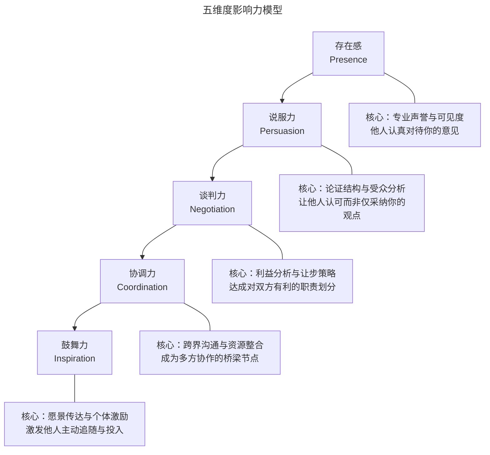
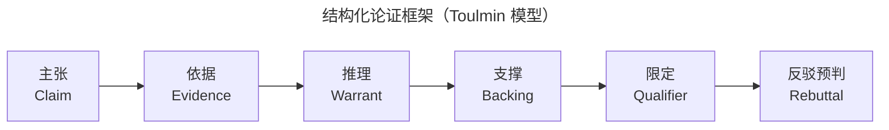
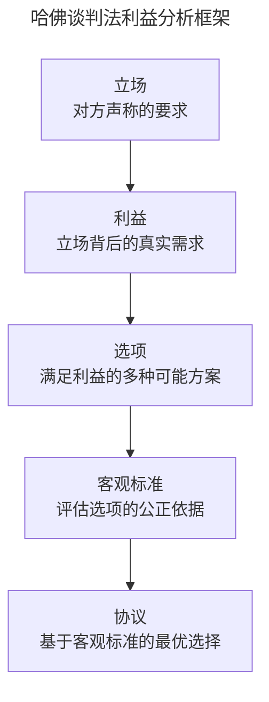
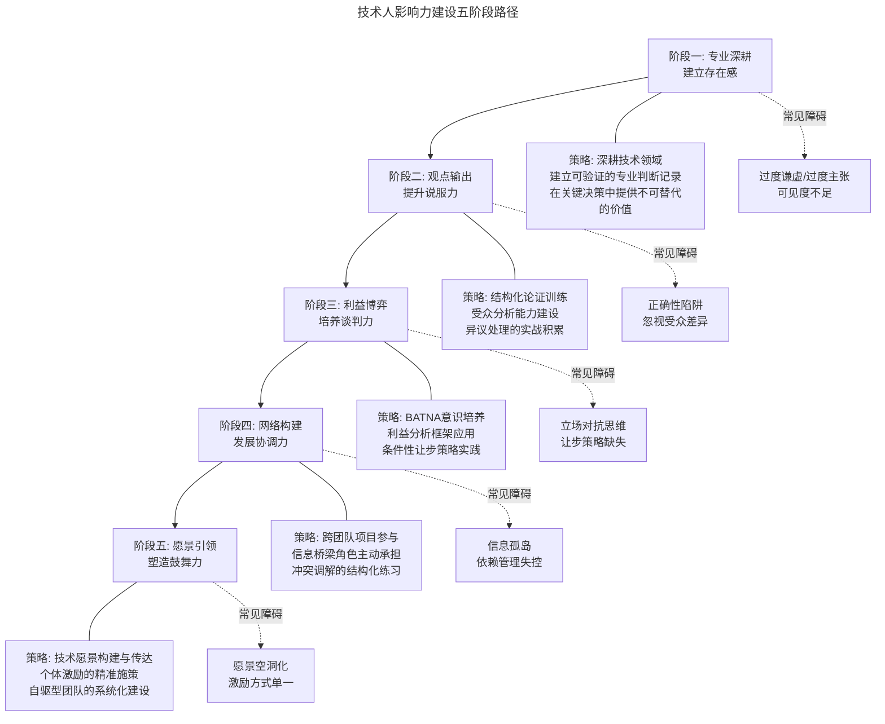

# 技术人如何建立个人影响力

> **适用范围**：一线工程师、技术专家、技术管理者及跨团队协作者；适用于希望在无正式职权条件下提升专业影响力、推动技术决策与跨团队协作的技术从业者。
>
> **更新摘要（v2 · 2026-08 更新）**：
> - 结构化升级为 6 节骨架（导言 / 核心方法论 / 关键流程 / 工具与实战 / 常见误区 / 进阶延展）
> - 为全部 4 张 Mermaid 图补充 `--- title: ... ---` frontmatter 与图后文字解读
> - 将五维度影响力建设路径中的"常见障碍"提炼为独立常见误区节
> - 将原"参考资料"融入进阶延展节，便于延伸阅读

## 1. 导言

技术人员的职业发展不仅依赖专业能力的纵深，更取决于个人影响力的广度与深度。影响力并非权力的附属品，而是一种通过专业信誉、沟通策略与协作智慧，在无正式职权条件下驱动他人行动与决策的能力。在技术组织中，影响力是跨团队协作的润滑剂、技术决策的加速器、个人职业跃迁的核心杠杆。

本文基于影响力五维度模型，系统构建技术人影响力建设的理论框架与实践路径，覆盖从一线工程师到技术高管的影响力跃迁需求。

## 2. 核心方法论

### 2.1 五维度影响力模型

技术人的影响力由五个递进关联的维度构成，形成从"被看见"到"被追随"的能力阶梯：

该模型呈现了影响力的五个递进维度：存在感是基石，说服力建立在存在感之上，谈判力需要说服力作支撑，协调力是前三者的综合运用，鼓舞力则是所有维度的升华。每个维度都有明确的核心能力指向，从"他人认真对待你的意见"逐步进阶到"激发他人主动追随与投入"。

| 维度 | 定义 | 核心能力 | 影响层级 |
|------|------|---------|---------|
| 存在感 | 意见被认真对待的程度 | 专业声誉、可见度、话语权 | 个体→个体 |
| 说服力 | 使他人认可并接受观点的能力 | 论证结构、受众分析、异议处理 | 个体→个体/团队 |
| 谈判力 | 达成互利协议的能力 | BATNA、利益分析、让步策略 | 个体/团队→团队 |
| 协调力 | 促进多方高效协作的能力 | 跨界沟通、资源整合、冲突调解 | 团队→团队/组织 |
| 鼓舞力 | 激发他人主动投入的能力 | 愿景传达、个体激励、团队赋能 | 个体→组织 |

**关键洞察**：五个维度并非线性递进，而是相互强化的动态系统。存在感是说服力的前提，说服力是谈判力的基础，协调力需要前三者的综合运用，而鼓舞力则是所有维度的升华。

### 2.2 论证结构框架

技术说服应遵循结构化论证框架，确保逻辑链完整且可验证：

该论证框架源自 Toulmin 论证模型，要求技术人在提出主张时依次明确依据、推理、支撑、限定与反驳预判六个要素。完整的论证链不仅增强说服力，更使观点可被他人独立验证与讨论，避免"我觉得"式的主观断言。

| 论证要素 | 定义 | 技术场景示例 |
|---------|------|------------|
| 主张 | 明确的观点陈述 | "我们应该采用微服务架构" |
| 依据 | 支撑主张的事实与数据 | "当前单体应用的部署频率仅为每周 1 次" |
| 推理 | 从依据到主张的逻辑桥梁 | "微服务架构支持独立部署，可提升发布频率" |
| 支撑 | 推理的额外佐证 | "行业基准显示微服务团队部署频率提升 5-10 倍" |
| 限定 | 主张的适用边界 | "适用于核心业务模块，非核心模块暂不迁移" |
| 反驳预判 | 预判并回应可能的反对意见 | "虽然增加运维复杂度，但可通过 K8s 和 Service Mesh 管控" |

### 2.3 利益分析框架

谈判的本质是利益再分配，而非立场对抗。采用哈佛谈判法的利益分析框架：

该框架将谈判从"立场对抗"转向"利益挖掘"：先透过对方声称的立场识别其真实需求，再围绕需求生成多个可选方案，最后以客观标准（行业基准、历史数据）作为评估依据达成协议。这一流程帮助谈判者跳出零和博弈思维，寻找帕累托改进空间。

| 分析层次 | 关键问题 | 实践要点 |
|---------|---------|---------|
| 立场→利益 | "对方为什么提出这个要求？" | 区分声称的立场与真实需求 |
| 利益→选项 | "有哪些方式可以满足这个需求？" | 头脑风暴，扩大选项空间 |
| 选项→标准 | "用什么标准评估这些选项？" | 引用行业基准、历史数据、技术指标 |
| 标准→协议 | "基于标准，哪个选项最优？" | 双方共同认可客观标准 |

## 3. 关键流程

### 3.1 存在感建设

存在感是影响力的基石——若你的意见不被认真对待，后续所有影响力维度均无从展开。

#### 专业声誉构建

专业声誉是存在感的核心资产，通过持续输出高质量判断与可验证成果积累而成：

| 声誉维度 | 构建策略 | 实践方法 |
|---------|---------|---------|
| 技术深度 | 在关键决策中提供不可替代的专业判断 | 主导技术方案评审、攻克核心难题 |
| 判断可信度 | 建立预测准确的历史记录 | 公开记录技术预判，定期复盘验证 |
| 知识贡献 | 成为团队的知识节点 | 技术分享、内部文档、代码评审中的深度反馈 |

#### 可见度管理

可见度不等于曝光度——有效的可见度建立在价值输出之上，而非自我推销：

1. **关键场合发声**：在技术评审、架构讨论等决策性场景中，提供有深度的见解
2. **跨团队触点**：主动参与跨团队项目，扩大专业影响力的辐射范围
3. **成果可视化**：将技术贡献转化为可感知的成果（性能提升数据、故障率下降指标等）

#### 话语权获取

话语权的本质是"意见权重"——他人评估你的意见值得投入多少注意力：

- **精准表达原则**：有三分把握说三分话，有七分把握说七分话。过度主张会稀释可信度，保守表达则浪费专业资本
- **来源标注规范**：引用他人观点时明确标注来源，既体现学术诚信，又为听者提供追溯路径
- **选择性参与**：不在低价值议题上消耗意见权重，将发声集中在高影响决策点

### 3.2 说服力提升

说服力的核心不是"证明自己正确"，而是"使对方理解并认可你的逻辑"。

#### 受众分析

说服策略必须因受众而异——同一技术方案对不同角色的说服重点截然不同：

| 受众类型 | 关注焦点 | 说服策略 |
|---------|---------|---------|
| 技术专家 | 技术可行性、架构优雅性 | 深入技术细节，引用权威论文与基准测试 |
| 产品经理 | 用户体验影响、交付时间 | 聚焦用户价值与交付节奏 |
| 高管决策者 | ROI、战略对齐、风险 | 量化收益，关联战略目标，明确风险缓解 |
| 跨团队协作者 | 对自身工作的影响 | 强调协作收益，降低接入成本 |

#### 异议处理

异议不是说服的障碍，而是深化共识的入口：

1. **理解优先**：在反驳之前，先完整理解对方反对的逻辑——多数争论源于未真正理解对方立场
2. **聚焦分歧点**：将讨论收敛到具体分歧点，避免全局性争论——找到对方不认可的具体位置，逐点讨论
3. **求同存异**：在无法达成完全一致时，先就共同点达成合作，将分歧点留待实践验证
4. **避免"正确性陷阱"**：执着于证明自己"正确"是最常见的说服失败模式——目标是推动决策，而非赢得辩论

### 3.3 谈判力培养

谈判力是影响力从单向输出转向双向博弈的关键维度。技术场景中的谈判，核心是在资源有限条件下达成帕累托改进。

#### BATNA（最佳替代方案）

BATNA（Best Alternative to a Negotiated Agreement）是谈判力的根基——你的谈判底气来自"不达成协议时的最佳退路"：

| BATNA 维度 | 评估要素 | 技术场景示例 |
|-----------|---------|------------|
| 替代方案质量 | 不合作时的最优选择 | "若不采用此方案，可使用开源替代品" |
| 替代方案成本 | 切换到替代方案的代价 | "自研方案需额外 3 人月" |
| 信息完备度 | 对对方 BATNA 的了解程度 | "对方团队也在评估其他供应商" |

**核心原则**：谈判前充分评估双方 BATNA。BATNA 越强，谈判空间越大；BATNA 越弱，越需要在合作框架内寻求价值。

#### 让步策略

让步是谈判中的战略性工具，而非软弱的表现：

- **条件性让步**：每次让步都应换取对等回报——"我可以在 X 上让步，但需要你在 Y 上支持"
- **让步可见化**：确保对方意识到你的让步是付出而非理所当然——隐性让步无法积累谈判资本
- **底线预设**：明确不可让步的硬性边界，在底线之上灵活调整——底线清晰度与谈判效率正相关
- **渐进让步**：避免一次性大幅让步，逐步缩小让步幅度传递"接近极限"的信号

### 3.4 协调力发展

协调力是影响力从双边关系扩展到多边网络的关键跃迁。技术组织中的协调力，核心是成为信息流与决策流的枢纽节点。

#### 跨界沟通

技术团队间的协作障碍，80% 源于信息不对称而非利益冲突：

1. **语境翻译**：将技术语言转化为对方可理解的表述——对产品团队谈用户价值，对运维团队谈稳定性指标
2. **信息桥梁**：主动承担跨团队信息传递角色，确保关键决策信息在相关方之间无损流动
3. **依赖关系管理**：清晰识别并主动管理团队间的交付依赖，避免依赖链成为阻塞链

#### 资源整合

资源整合能力决定了协调力的实际产出：

| 整合维度 | 核心策略 | 实践方法 |
|---------|---------|---------|
| 人力资源 | 匹配能力与任务需求 | 建立团队技能矩阵，识别关键人才 |
| 信息资源 | 打破信息孤岛 | 推动跨团队技术分享、文档标准化 |
| 时间资源 | 对齐关键时间节点 | 建立跨团队里程碑同步机制 |
| 工具资源 | 统一基础设施 | 推动共享工具链与平台建设 |

#### 冲突调解

技术团队中的冲突调解需遵循结构化流程：

1. **事实还原**：让各方独立陈述事实与立场，避免交叉争论
2. **利益挖掘**：识别立场冲突背后的利益分歧——多数技术争论的根源是优先级差异而非对错之分
3. **方案共创**：基于共同利益生成可选方案，避免零和博弈思维
4. **变更敏感度**：对资源变更、计划调整、人员变动保持高度敏感，确保所有相关方在决策前获知变更信息
5. **前置沟通原则**：不在任何一方未了解变化的情况下做出影响其利益的决策

### 3.5 鼓舞力塑造

鼓舞力是影响力的最高维度——从"让人听从"到"让人追随"。技术领导者的鼓舞力，核心是将技术愿景转化为个体动力。

#### 愿景传达

技术愿景需要从抽象战略转化为可感知的叙事：

- **意义连接**：将技术目标与更大的业务价值或社会意义关联——"我们不是在写代码，而是在改变千万用户的体验"
- **路径清晰化**：愿景不仅描绘终点，更标明路径——让团队看到"从这里到那里"的可信路线
- **叙事一致性**：在不同场合、对不同受众保持愿景叙事的核心一致性

#### 个体激励

有效的个体激励需要精准识别每个人的动力源：

| 激励维度 | 识别信号 | 激励策略 |
|---------|---------|---------|
| 成就导向 | 主动承担挑战性任务 | 设定渐进挑战目标，及时认可阶段性突破 |
| 成长导向 | 频繁询问学习机会 | 提供技能拓展空间，安排导师指导 |
| 影响力导向 | 关注决策参与度 | 邀请参与关键决策，扩大影响范围 |
| 安全导向 | 规避风险与不确定性 | 提供明确预期与容错空间 |

**关键原则**：在对方取得阶段性成果或通过努力克服困难时，及时给予具体、真诚的认可——认可应指向具体行为与成果，而非泛泛的人格赞美。

#### 团队赋能

鼓舞力的终极目标是构建自驱型团队：

1. **心理安全感建设**：营造"敢于试错、勇于求助"的团队氛围
2. **建设性反馈文化**：以"如何改进"替代"为什么做错"，让反馈成为成长的催化剂
3. **自主决策空间**：在明确边界内赋予团队自主权，避免微观管理侵蚀内在动机
4. **成功共享机制**：确保团队成果被组织看见与认可，避免功劳被个体独占

## 4. 工具与实战

### 4.1 技术人影响力建设路径

影响力建设是一个从内到外、从点到面的系统性工程。以下路径图展示了技术人影响力跃迁的关键阶段与核心策略：

路径图展示了影响力建设的五个递进阶段，每个阶段都对应明确的策略与常见障碍。虚线标注的障碍揭示了各阶段最容易踩中的陷阱，这些障碍将在第 5 节常见误区中详细展开。

**路径关键原则**：

1. **内功先行**：存在感是所有影响力的基础，没有专业声誉支撑的影响力如同空中楼阁
2. **实战驱动**：每个维度的提升都需在真实场景中反复练习，理论认知无法替代实战经验
3. **螺旋上升**：影响力建设不是线性过程，需要在实践中不断回溯与强化基础维度
4. **利他本质**：影响力的终极价值不在于凸显个人重要性，而在于通过影响力推动事情做成——帮助他人成功，是建立正向影响力的最可靠路径

### 4.2 最佳实践

1. **意见权重管理**：不在低价值议题上消耗专业信誉，将发声集中在高影响决策点
2. **论证结构化**：采用主张-依据-推理-支撑-限定-反驳预判的完整论证框架
3. **BATNA 先行**：任何谈判前，先评估双方最佳替代方案，确定谈判空间
4. **信息桥梁角色**：主动承担跨团队信息传递，成为组织中的关键连接节点
5. **精准激励**：识别个体动力源，实施差异化激励策略
6. **声誉复利**：将每次高质量判断与成果视为声誉资本的投入，追求长期复利而非短期变现

## 5. 常见误区

### 5.1 存在感阶段的误区

- **过度谦虚**：有七分把握只说三分话，浪费专业资本，导致意见不被认真对待
- **过度主张**：有三分把握说七分话，稀释可信度，长期透支专业声誉
- **可见度不足**：仅在低价值场合发声，关键决策时缺乏话语权积累
- **自我推销式曝光**：将曝光度等同于可见度，忽视价值输出这一根基

### 5.2 说服力阶段的误区

- **正确性陷阱**：执着于证明自己"正确"，将说服目标错位为赢得辩论而非推动决策
- **忽视受众差异**：对技术专家与高管使用同一套说服策略，导致沟通失效
- **全局性争论**：在分歧点上展开全局争论，而非收敛到具体分歧点逐点讨论
- **反驳优先**：未完整理解对方立场即急于反驳，多数争论因此陷入无效循环

### 5.3 谈判力阶段的误区

- **立场对抗思维**：聚焦于立场之争而非利益挖掘，陷入零和博弈
- **让步策略缺失**：要么不让步导致谈判破裂，要么无条件让步丧失谈判资本
- **忽视 BATNA 评估**：未评估双方最佳替代方案即进入谈判，丧失谈判主动权
- **一次性大幅让步**：传递"还有很大让步空间"的信号，招致对方进一步施压

### 5.4 协调力阶段的误区

- **信息孤岛**：未主动承担信息桥梁角色，关键决策信息在相关方之间流动不畅
- **依赖管理失控**：未清晰识别团队间交付依赖，依赖链演变为阻塞链
- **立场替代利益**：调解冲突时停留在立场层面，未挖掘背后的利益分歧
- **变更不前置沟通**：在相关方未了解变化的情况下做出影响其利益的决策

### 5.5 鼓舞力阶段的误区

- **愿景空洞化**：描绘宏大愿景但缺乏可信路径，团队无法看到"从这里到那里"的路线
- **激励方式单一**：对所有成员使用同一激励策略，忽视个体动力源差异
- **微观管理侵蚀**：在授权后过度干预细节，侵蚀团队内在动机
- **功劳个体独占**：将团队成果归功于个人，破坏团队心理安全感与协作意愿

## 6. 进阶延展

### 6.1 发展趋势

- **分布式影响力**：远程与混合办公模式下，影响力从"在场感"转向"异步可见度"——文档化输出、书面论证能力的重要性显著提升
- **AI 增强说服力**：大语言模型辅助论证结构优化与受众分析，但核心判断力仍依赖人类专业积累
- **数据驱动谈判**：工程效能数据（DORA 指标、交付吞吐量等）为资源谈判提供客观依据，减少立场对抗
- **平台化协调**：内部开发者平台（IDP）将跨团队协调从人际依赖转向平台标准化，降低协调摩擦
- **心理安全感框架**：影响力建设被纳入心理安全感（Psychological Safety）的更大框架，强调"安全地施加影响"与"被安全地影响"

### 6.2 延伸阅读

1. Cialdini, R.B. *Influence: The Psychology of Persuasion*. Harper Business, 2006.
2. Fisher, R. & Ury, W. *Getting to Yes: Negotiating Agreement Without Giving In*. Penguin, 2011.
3. Toulmin, S.E. *The Uses of Argument*. Cambridge University Press, 2003.
4. Edmondson, A. *The Fearless Organization*. Wiley, 2019.
5. Grant, A. *Give and Take: Why Helping Others Drives Our Success*. Viking, 2013.
6. Brown, B. *Dare to Lead*. Random House, 2018.
7. Kahneman, D. *Thinking, Fast and Slow*. Farrar, Straus and Giroux, 2011.
