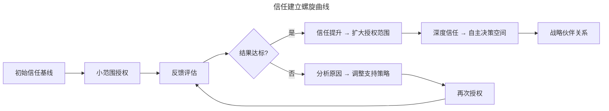
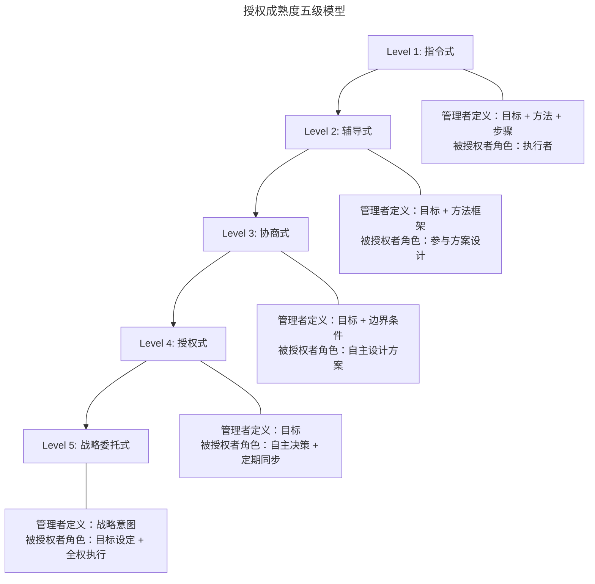
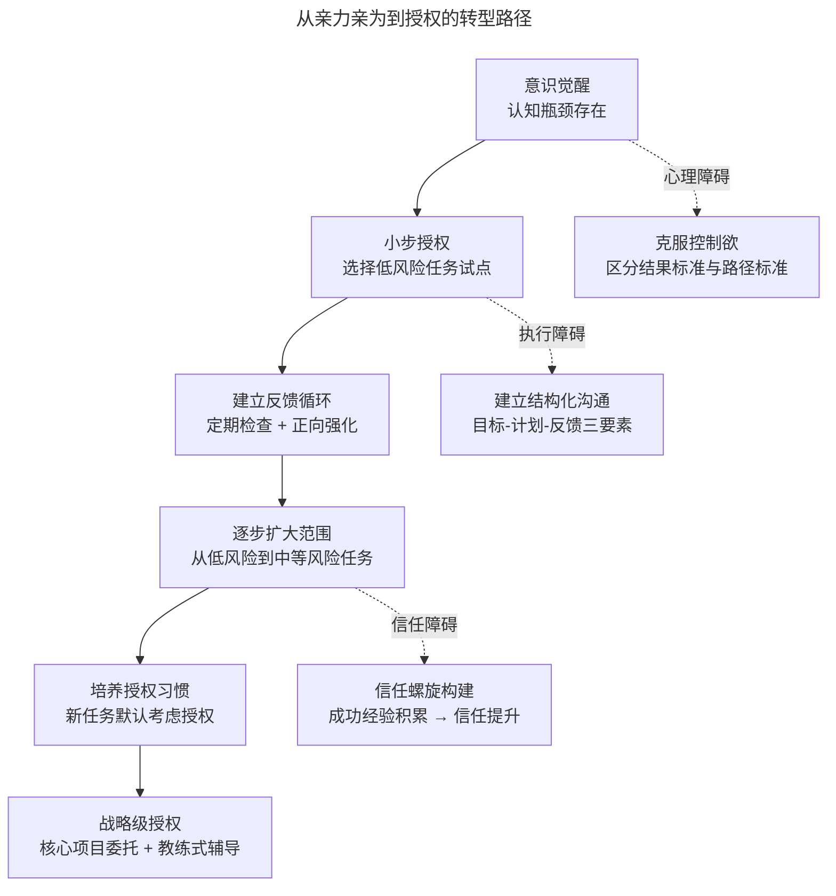

# 管理者不用亲力亲为：关键是什么？

> **适用范围**：新晋技术管理者、从技术骨干转型的团队负责人及技术高管；适用于希望克服亲力亲为倾向、建立结构化授权体系、提升团队产能的技术管理者。
>
> **更新摘要（v2 · 2026-08 更新）**：
> - 结构化升级为 6 节骨架（导言 / 核心方法论 / 关键流程 / 工具与实战 / 常见误区 / 进阶延展）
> - 为全部 3 张 Mermaid 图补充 `--- title: ... ---` frontmatter 与图后文字解读
> - 将"两个认知误区"与心理障碍内容独立为常见误区节
> - 将原"参考资料"融入进阶延展节，便于延伸阅读

## 1. 导言

技术骨干向管理角色转型时，最普遍的障碍是亲力亲为倾向——对团队产出质量缺乏信任，倾向于亲自介入而非授权委托。这种行为模式的根源并非单纯的工作习惯，而是深层的心理机制与系统性管理能力缺失共同作用的结果。本文从授权心理学、成熟度模型、实施框架、风险管控四个维度，系统构建从亲力亲为到有效授权的转型方法论。

核心命题：**管理者不用亲力亲为的关键，在于建立结构化的授权体系——既确保任务有效分配，又保证分配出去的任务被圆满完成。**

## 2. 核心方法论

### 2.1 授权心理学

#### 控制欲与完美主义

技术骨干在专业领域长期积累的胜任感，塑造了"唯有自己介入才能保证质量"的认知定式。这种心理机制包含三个层次：

| 心理层次 | 表现特征 | 管理影响 |
|---------|---------|---------|
| 控制欲 | 对产出细节的过度关注，拒绝替代方案 | 管理者成为团队瓶颈 |
| 完美主义 | 以自身标准为唯一合格标准，忽视路径多样性 | 抑制团队创造力与自主性 |
| 身份认同固化 | 将个人价值与直接产出绑定，而非通过他人产出获得成就感 | 无法实现角色跃迁 |

#### 信任建立曲线

信任并非一次性授予，而是随授权-反馈循环逐步建立的动态过程。信任建立遵循以下曲线规律：

信任建立曲线揭示了授权的本质：信任通过"小范围授权—反馈评估—调整策略"的循环逐步积累。结果达标时信任提升、授权范围扩大；结果未达标时不回退至零，而是分析原因并调整支持策略后再次授权。这一螺旋上升过程最终导向深度信任与战略伙伴关系。

**关键洞察**：信任建立是螺旋上升过程。授权失败不应导致信任回退至零，而应触发支持策略的调整。管理者需区分"能力不足"（需培训）与"意愿不足"（需激励）两种情况，对症施策。

### 2.2 授权成熟度模型

基于 Hersey-Blanchard 情境领导理论，结合技术团队特点，授权成熟度可分为五个演进级别：

模型展示了从指令式到战略委托式的五级演进：管理者定义的内容从"目标+方法+步骤"逐步缩减至"战略意图"，被授权者的角色从"执行者"逐步升级为"目标设定+全权执行"。这一演进反映了被授权者能力的成长与管理者信任的深化。

| 级别 | 适用场景 | 管理者行为 | 跟进频率 |
|------|---------|-----------|---------|
| Level 1 指令式 | 新人/全新领域任务 | 明确步骤，逐项检查 | 每日 |
| Level 2 辅导式 | 有一定经验但需指导 | 提供方法框架，关键节点检查 | 每周 2-3 次 |
| Level 3 协商式 | 经验丰富但任务复杂 | 设定边界，方案评审 | 每周 1 次 |
| Level 4 授权式 | 成熟成员/常规任务 | 目标对齐，结果验收 | 双周/里程碑 |
| Level 5 战略委托式 | 核心骨干/战略项目 | 战略意图沟通，完全自主 | 月度/季度 |

**演进原则**：授权级别应随被授权者能力成长而动态上调，而非固定不变。一次授权失败应评估是否需要回退一级并增加支持，而非直接回退至指令式。

## 3. 关键流程

### 3.1 目标设定（SMART-Plus）

授权的首要环节是确保被授权者明确目标。目标设定应遵循 SMART 原则的扩展版本：

| 维度 | 定义 | 技术管理示例 |
|------|------|------------|
| **S**pecific | 具体描述期望结果 | "完成支付模块重构，支持 T+0 结算" |
| **M**easurable | 可量化的成功标准 | "API 响应时间<200ms，测试覆盖率>85%" |
| **A**chievable | 在能力与资源范围内可达成 | 考虑被授权者当前能力水平 |
| **R**elevant | 与团队/业务目标对齐 | 关联季度 OKR |
| **T**ime-bound | 明确时间边界 | "Q2 结束前完成" |
| **+Priority** | 明确优先级与取舍规则 | "性能优先于功能完备性" |
| **+Commitment** | 双方对目标达成共识 | 被授权者明确承诺完成 |

**关键前提**：目标必须获得被授权者的认同与承诺。若对方不认可目标定义，需在授权前完成目标协商——强制分配未经认同的目标，是授权失败的首要原因。

### 3.2 计划制定与跟进

跟进 ≠ 指导 ≠ 频繁介入。有效跟进的本质是"可获得的支撑"（Available Support），而非"持续的干预"（Continuous Intervention）。

| 跟进方式 | 定义 | 适用场景 |
|---------|------|---------|
| 里程碑评审 | 在关键节点检查阶段性成果 | Level 3-4 授权 |
| 定期同步 | 固定频率的进展沟通 | Level 2-3 授权 |
| 即时响应 | 被授权者主动求助时提供支持 | Level 4-5 授权 |
| 伴随式辅导 | 近距离观察与实时指导 | Level 1 授权 |

**跟进的核心原则**：当被授权者对某环节有疑问时，管理者应能随时提供帮助——这种帮助可能是解决方案、技术方向指引，或对下一步行动的探讨建议，而非替代执行。

### 3.3 反馈机制

反馈是授权闭环的关键环节，直接影响信任曲线的走向。

**正面反馈**：
- 被授权者达成阶段性成果时，及时给予肯定
- 处于平台期但仍在努力时，给予过程性鼓励
- 反馈应具体、客观，指向行为与结果，而非人格特质

**纠偏反馈**：
- 方向或优先级偏离预期时，及时交流纠正
- 先了解对方思考逻辑，再分析偏差原因
- 聚焦于"如何回到正轨"，而非"为什么做错了"
- 避免在细节上过度干预，关注结构性问题

**反馈频率矩阵**：

| 被授权者状态 | 反馈策略 |
|------------|---------|
| 快速成长期 | 高频正面反馈 + 适度纠偏 |
| 平台期 | 过程鼓励 + 方向性建议 |
| 偏离轨道 | 即时纠偏 + 根因分析 |
| 自主运行期 | 里程碑反馈 + 战略层讨论 |

### 3.4 授权风险管控

#### 关键检查点

授权不等于放任，需在关键节点设置检查机制：

1. **方案评审点**：任务启动后，被授权者提交执行方案，管理者评审方向正确性
2. **中期检查点**：50% 进度时，评估是否在正轨上，是否需要资源调整
3. **风险预警点**：当进度偏差超过预设阈值时，自动触发管理者介入
4. **交付验收点**：最终成果的质量把关

#### 红线机制

以下情况触发即时介入（无论当前授权级别）：

- 涉及生产环境安全或数据安全的风险决策
- 可能影响其他团队交付的跨组依赖问题
- 合规性或法律风险
- 被授权者明确表示无法继续推进

## 4. 工具与实战

### 4.1 从亲力亲为到授权的转型路径

转型路径图呈现了从意识觉醒到战略级授权的六步演进，并标注了三个关键障碍节点：心理障碍（控制欲）、执行障碍（缺乏结构化沟通）、信任障碍（信任螺旋未建立）。每个障碍都有对应的克服策略，帮助管理者在转型过程中识别并跨越障碍。

**转型关键节点**：

1. **临界点认知**：当"亲力亲为"模式无法扩展时（团队规模增长、管理职责增加），必须主动寻求转型，而非等到系统崩溃
2. **首次成功**：第一次成功的授权体验是打破心理障碍的关键——选择风险可控、被授权者能力匹配的任务作为试点
3. **习惯重塑**：将"新任务→自己来做"的默认反应，替换为"新任务→谁适合做→如何支持他完成"

### 4.2 最佳实践

1. **授权清单法**：每次新任务出现时，依次回答——必须我做吗？谁可以做？需要什么支持？跟进频率如何？
2. **结果导向约定**：与被授权者约定"结果标准"而非"执行步骤"，保留其自主决策空间
3. **渐进式授权**：从 Level 2 起步，根据反馈逐步提升授权级别，避免跳跃式授权
4. **失败复盘制**：授权失败时，复盘重点放在"授权过程哪里出了问题"，而非"被授权者哪里做得不好"
5. **时间投资观**：将授权初期多投入的沟通时间视为投资，而非成本——长期回报是团队产能的倍增

## 5. 常见误区

### 5.1 两个核心认知误区

1. **结果等价性误区**：将"按照自己的方式做好"等同于"把事情做好"。事实上，不同执行路径可以达成同等甚至更优的结果——他人有他人的工作方式，也能把事情做好。执着于自身方法的标准是授权失败的首要认知障碍。
2. **介入二元论误区**：将介入视为非黑即白的选择（要么完全介入，要么完全放手）。关键不在于"是否介入"，而在于"用什么方式介入、在哪些节点介入"。授权成熟度模型提供了介于完全介入与完全放手之间的多个中间级别。

### 5.2 心理层面的误区

- **控制欲膨胀**：对产出细节的过度关注演变为拒绝任何替代方案，管理者自身成为团队瓶颈
- **完美主义固化**：以自身标准为唯一合格标准，忽视路径多样性，抑制团队创造力
- **身份认同僵化**：将个人价值与直接产出绑定，无法从"通过他人产出获得成就感"中获得满足
- **信任一次性授予**：期待信任一蹴而就，忽视信任建立是螺旋上升的渐进过程

### 5.3 执行层面的误区

- **目标未获认同即分配**：强制分配未经被授权者认同的目标，是授权失败的首要原因
- **跟进等于干预**：将跟进误解为持续干预，要么过度介入侵蚀自主性，要么完全放任导致失控
- **反馈缺失或泛化**：要么不给予反馈，要么给予泛化的人格赞美而非指向具体行为的反馈
- **授权失败归因偏差**：将授权失败归咎于被授权者能力不足，而非审视授权过程本身的缺陷
- **跳跃式授权**：从指令式直接跳至授权式，跳过中间级别的能力培养与信任积累

## 6. 进阶延展

### 6.1 发展趋势

- **AI 辅助授权决策**：基于团队历史数据，智能推荐任务分配方案与授权级别
- **异步授权模式**：远程/混合办公环境下，授权需更依赖文档化目标与异步反馈机制
- **心理安全感框架**：将授权置于心理安全感（Psychological Safety）构建的更大框架下，确保被授权者敢于试错与求助
- **OKR 驱动的授权**：通过 OKR 体系将战略目标层层分解，使授权与组织目标自动对齐

### 6.2 延伸阅读

1. Hersey, P. & Blanchard, K. *Management of Organizational Behavior: Utilizing Human Resources*. Prentice Hall, 1969.
2. Sitkin, S.B. & Pablo, A.L. "Reconceptualizing the Determinants of Risk Behavior." *Academy of Management Review*, 1992.
3. Edmondson, A. *The Fearless Organization*. Wiley, 2019.
4. Drucker, P. *The Effective Executive*. Harper Business, 2006.
5. Brown, B. *Dare to Lead*. Random House, 2018.
