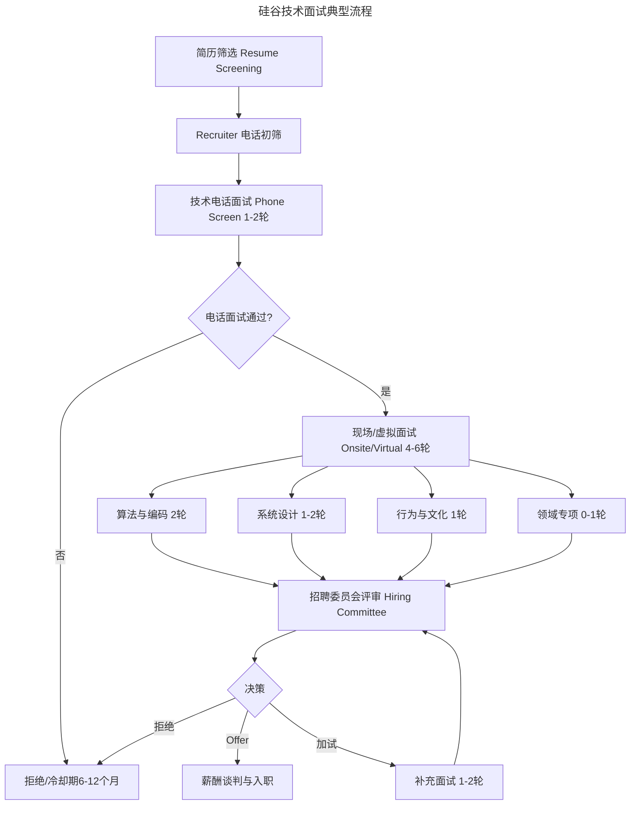

# 硅谷技术面试体系全景解析

> **适用范围**：技术工程师候选人、面试官及技术招聘负责人；适用于准备硅谷顶级技术公司面试、参与面试流程设计或希望系统理解技术面试评估逻辑的从业者。
>
> **更新摘要（v2 · 2026-08 更新）**：
> - 结构化升级为 6 节骨架（导言 / 核心方法论 / 关键流程 / 工具与实战 / 常见误区 / 进阶延展）
> - 为 Mermaid 流程图补充 `--- title: ... ---` frontmatter 与图后文字解读
> - 将"刷题的理性认知"与"面试官常见偏差"独立为常见误区节
> - 将原"参考资料"融入进阶延展节，便于延伸阅读

## 1. 导言

硅谷顶级技术公司的面试流程以多轮、多维、标准化著称，通常包含 5-8 轮面试，覆盖算法编码、系统设计、行为与文化等核心维度。本文系统梳理硅谷面试体系的全景架构，深入解析各面试类型的评估逻辑与应对策略，并结合 2025 年 AI 辅助面试等新趋势，为候选人与面试官提供双向参考框架。

## 2. 核心方法论

### 2.1 硅谷面试体系全景

#### 典型面试流程



流程图完整呈现了硅谷技术面试从简历筛选到 Offer 的全链路：经简历筛选与 recruiter 电话初筛后进入技术电话面试，通过后进入 4-6 轮现场/虚拟面试，覆盖算法编码、系统设计、行为文化与领域专项四个维度。所有面试结果汇总至招聘委员会评审，最终决策可能是 Offer、拒绝或加试补充面试。被拒绝者通常有 6-12 个月冷却期。

#### 多轮面试的设计逻辑

| 设计原则 | 解释 |
|---------|------|
| 多维度覆盖 | 单一轮次无法全面评估编码、设计、沟通等综合能力 |
| 交叉验证 | 多位面试官独立评估，消除单一面试官的主观偏差 |
| 梯度递进 | 题目设计包含难度梯度，区分不同能力层级 |
| 冗余容错 | 单次面试发挥失常可通过其他轮次补偿 |

### 2.2 算法与编码面试评估维度

| 维度 | 权重 | 评估要点 |
|------|------|---------|
| 问题理解 | 15% | 能否准确理解题意，澄清模糊需求 |
| 算法设计 | 30% | 时间/空间复杂度优化，算法选择合理性 |
| 编码实现 | 30% | 代码正确性、边界条件处理、编码速度 |
| 调试能力 | 15% | 发现与修复 Bug 的效率 |
| 沟通表达 | 10% | 思路阐述的清晰度与逻辑性 |

### 2.3 系统设计面试评估维度

| 维度 | 权重 | 评估要点 |
|------|------|---------|
| 需求分析 | 15% | 功能性与非功能性需求的识别与优先级排序 |
| 架构设计 | 30% | 组件划分、接口定义、数据流设计 |
| 扩展性考量 | 20% | 水平扩展、分片策略、缓存设计 |
| 可靠性设计 | 15% | 单点故障消除、容错机制、数据一致性 |
| 权衡分析 | 20% | 不同方案的 Trade-off 讨论与决策依据 |

### 2.4 面试官的评估框架

面试官使用标准化评分表（Rubric）进行评估：

| 评分等级 | 定义 | 信号 |
|---------|------|------|
| Strong Hire | 强烈推荐录用 | 远超该级别预期，展现卓越能力 |
| Hire | 推荐录用 | 达到该级别预期，能胜任工作 |
| Lean Hire | 倾向推荐 | 基本达到预期，但有轻微顾虑 |
| No Hire | 不推荐 | 未达到预期，存在明显不足 |
| Strong No Hire | 强烈不推荐 | 远低于预期，存在严重问题 |

### 2.5 难度梯度设计

面试题目通常设计为 3 级梯度：

```
Level 1（基础）：所有合格候选人都应完成
    ↓ 通过
Level 2（进阶）：区分合格与优秀
    ↓ 通过
Level 3（挑战）：区分优秀与卓越
```

若候选人在 Level 1 即表现挣扎，面试官可能跳过后续梯度，这意味着候选人已基本被判定为不通过。

## 3. 关键流程

### 3.1 算法与编码面试

#### 题目类型与难度分布

```
难度分布（典型）：
├── Easy（30%）：基础数据结构操作、字符串处理
├── Medium（50%）：树/图遍历、动态规划、贪心算法
└── Hard（20%）：复杂DP、高级图算法、组合优化
```

#### 编码面试执行框架

1. **需求澄清**（3-5 分钟）：确认输入输出、约束条件、边界情况
2. **方案设计**（5-10 分钟）：提出 1-2 种方案，分析复杂度，选择最优
3. **编码实现**（15-25 分钟）：先写核心逻辑，再处理边界
4. **测试验证**（5-10 分钟）：手动追踪、边界用例、Bug 修复

#### 白板编码 vs 上机编码

| 维度 | 白板编码 | 上机编码（CoderPad/CodeSignal） |
|------|---------|-------------------------------|
| 执行验证 | 无编译器，手动追踪 | 可运行，测试用例即时验证 |
| 侧重能力 | 算法思维与伪代码表达 | 工程实现与调试能力 |
| 代表公司 | 部分传统公司 | Google, Meta, Airbnb 等主流 |
| 趋势 | 逐渐减少 | 成为主流 |

### 3.2 系统设计面试

#### 典型题目类型

| 类型 | 示例题目 | 核心考点 |
|------|---------|---------|
| 互联网服务 | 设计 Twitter/URL 短链 | 读多写少、缓存、CDN |
| 存储系统 | 设计键值存储/消息队列 | 一致性、分区容错、复制策略 |
| 流处理 | 设计新闻 Feed/实时排行榜 | 流式处理、排序算法、窗口计算 |
| 位置服务 | 设计附近的人/地图服务 | 空间索引、GeoHash、距离计算 |

#### 系统设计面试执行框架

1. **需求澄清**（5 分钟）：确认功能范围、QPS 估算、延迟要求、一致性需求
2. **容量估算**（5 分钟）：计算存储量、带宽、QPS 等关键指标
3. **高层设计**（10 分钟）：绘制系统架构图，定义核心组件与交互
4. **深入设计**（15 分钟）：选择 1-2 个核心组件深入讨论
5. **扩展与容错**（10 分钟）：讨论瓶颈、单点故障、扩展策略

### 3.3 行为与文化面试

#### 评估框架：STAR 方法

| 要素 | 说明 | 示例 |
|------|------|------|
| Situation | 情境背景 | "在支付系统迁移项目中..." |
| Task | 任务与目标 | "我负责确保零停机迁移..." |
| Action | 具体行动 | "我设计了灰度发布方案..." |
| Result | 量化结果 | "迁移完成，零事故，延迟降低 30%" |

#### 核心评估维度

| 维度 | 典型问题 | 评估信号 |
|------|---------|---------|
| 冲突解决 | 描述一次与同事的技术分歧 | 倾听能力、妥协意愿、结果导向 |
| 失败应对 | 描述一次失败经历及应对 | 反思深度、改进行动、韧性 |
| 领导力 | 描述一次推动团队改进的经历 | 主动性、影响力、执行能力 |
| 价值观契合 | 为什么选择这家公司 | 文化理解、动机真实性 |
| 模糊性处理 | 描述一次在不确定中做决策的经历 | 判断力、风险意识、决策框架 |

#### Airbnb 核心价值观面试

Airbnb 等公司设有专门的核心价值观面试（Core Values Interview），评估候选人与公司文化的契合度。面试官通常非技术背景，从跨职能视角评估候选人的沟通风格、同理心与价值观。

## 4. 工具与实战

### 4.1 算法准备路线图

| 阶段 | 时长 | 内容 | 资源 |
|------|------|------|------|
| 基础巩固 | 2-4 周 | 数据结构与算法核心概念 | CLRS, 算法导论 |
| 分类刷题 | 4-6 周 | 按题型分类练习（数组/树/图/DP） | LeetCode 按标签 |
| 模拟面试 | 2-3 周 | 限时练习、Mock Interview | Pramp, interviewing.io |
| 查漏补缺 | 1-2 周 | 薄弱题型强化 | 个人错题集 |

### 4.2 系统设计准备路线图

| 阶段 | 时长 | 内容 | 资源 |
|------|------|------|------|
| 理论基础 | 2-3 周 | 分布式系统核心概念 | DDIA, Martin Kleppmann |
| 案例学习 | 3-4 周 | 经典系统设计案例 | System Design Interview Vol.1&2 |
| 实战演练 | 2-3 周 | 模拟设计面试 | 白板/纸上练习 |
| 深入专题 | 1-2 周 | 数据库、缓存、消息队列深入 | 公司工程博客 |

### 4.3 获取面试机会的核心策略

1. **简历闪光点**：量化成果（"优化延迟 40%"优于"优化了系统"）
2. **有效内推**：选择真正共事过且愿意为你能力背书的人
3. **技术影响力**：开源贡献、技术博客、会议演讲
4. **主动触达**：直接联系招聘经理（Hiring Manager）而非仅投递 HR

### 4.4 内推机制的变化

| 传统认知 | 2025 年现状 |
|---------|-----------|
| 内推一定优先 | 内推仅保证简历不被遗漏，不降低筛选标准 |
| 任何内推都有效 | 仅"共事过且可担保能力"的内推具有实质权重 |
| 内推人无风险 | 部分公司将内推质量纳入员工评估 |

## 5. 常见误区

### 5.1 关于"刷题"的理性认知

- **有效场景**：跨领域转型、算法基础薄弱、长期未编码
- **局限场景**：仅靠刷题通过面试，入职后实际工程能力不足
- **风险提示**：题库泄露题目的识别——面试官可通过追问深度、变式问题判断候选人是否真正理解
- **道德边界**：面试后泄露题目损害候选人自身利益——不如你的人可能因此获得你未能获得的 Offer

### 5.2 面试官常见偏差

| 偏差类型 | 表现 | 缓解策略 |
|---------|------|---------|
| 确认偏差 | 倾向于寻找支持初始印象的证据 | 结构化评分，按维度独立打分 |
| 光环效应 | 某一优点过度影响整体评价 | 多轮交叉面试，独立评估 |
| 领域局限 | 经验不足的面试官局限于自身熟悉领域 | 面试官培训，标准化题目 |
| 锚定效应 | 前一位候选人的表现影响对下一位的判断 | 延迟评分，避免连续比较 |

### 5.3 候选人常见误区

- **忽视需求澄清**：编码面试中急于写代码而未先澄清题意与边界条件
- **忽视沟通表达**：仅关注代码正确性，忽视思路阐述的清晰度与逻辑性
- **系统设计无框架**：未遵循需求澄清→容量估算→高层设计→深入设计→扩展容错的执行框架
- **行为面试无量化结果**：使用 STAR 方法时缺失 Result 的量化数据
- **过度依赖内推**：误以为内推等于保送，忽视实际面试准备
- **仅投递 HR**：未主动联系招聘经理，错失直接触达机会

## 6. 进阶延展

### 6.1 2025 年面试新趋势

#### AI 辅助面试

| 趋势 | 说明 |
|------|------|
| AI 面试官 | 部分公司初筛阶段使用 AI 进行结构化面试 |
| AI 辅助评估 | 面试官使用 AI 工具辅助记录与分析候选人表现 |
| 反作弊检测 | 检测候选人是否使用 AI 工具实时辅助作答 |
| 自适应出题 | 根据候选人实时表现动态调整题目难度 |

#### 面试形式演变

- **虚拟面试常态化**：远程面试工具（CoderPad, CodeSignal）成为标配
- **项目制面试**：部分公司采用 Take-Home Project 替代传统白板面试
- **Pair Programming**：以结对编程形式评估实际协作能力
- **多维度综合评估**：减少对单一算法题的依赖，增加工程实践评估

### 6.2 延伸阅读

- McDowell, G.L. (2015). *Cracking the Coding Interview*, 6th Edition
- Xu, A. (2020). *System Design Interview – An Insider's Guide*, Vol.1
- Xu, A. (2022). *System Design Interview – An Insider's Guide*, Vol.2
- Kleppmann, M. (2017). *Designing Data-Intensive Applications*, O'Reilly
- Bock, L. (2015). *Work Rules!*, Twelve
- LeetCode (2025). *Top Interview Questions Dataset*
- interviewing.io (2024). *State of Technical Interviewing Report*
