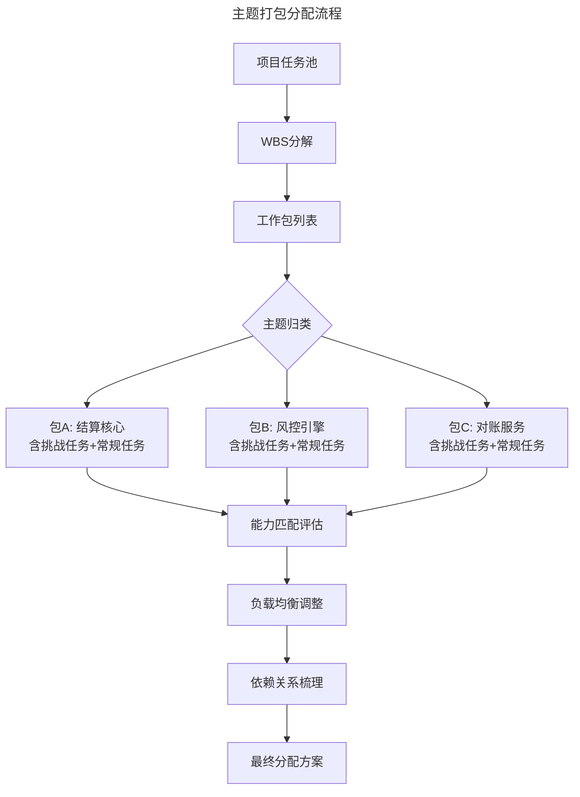
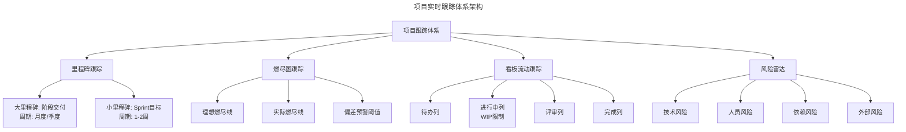

# 项目管理中的三个技巧

> **适用范围**：项目经理、技术负责人、研发管理者及 Scrum Master；适用于面临任务分解、工期估算、进度跟踪与风险应对挑战的项目管理从业者。
>
> **更新摘要（v2 · 2026-08 更新）**：
> - 结构化升级为 6 节骨架（导言 / 核心方法论 / 关键流程 / 工具与实战 / 常见误区 / 进阶延展）
> - 为全部 2 张 Mermaid 图补充 `--- title: ... ---` frontmatter 与图后文字解读
> - 将"规划谬误与工程师乐观偏差"独立为常见误区节，强化估算偏差的识别与修正
> - 将原"参考资料"融入进阶延展节，便于延伸阅读

## 1. 导言

项目管理的核心挑战在于：如何在资源约束与不确定性条件下，确保团队按预期交付高质量成果。本文从任务分解与重组、工期估算方法论、实时跟踪与应急预案三个维度，构建系统化的项目管理技术框架。这三个维度分别解决"做什么、谁来做"、"需要多久"、"是否在正轨上"三个根本性问题。

## 2. 核心方法论

### 2.1 任务细分重组技术

#### 核心原理

项目任务分配并非简单的"工作切分"，而是需要综合考虑能力匹配、负载均衡、成长空间、依赖关系与意义感五个维度的系统性重组过程。

#### 工作分解结构（WBS）

WBS 是任务细分的基础工具，将项目逐层分解为可管理、可估算的工作包：

| 层级 | 定义 | 示例 |
|------|------|------|
| L1 项目级 | 项目整体交付物 | 支付系统 V2.0 |
| L2 阶段级 | 主要功能模块 | 结算模块、风控模块、对账模块 |
| L3 任务级 | 可分配的工作单元 | T+0 结算逻辑实现 |
| L4 工作包级 | 可估算的最小单元 | 编写结算核心算法、编写单元测试 |

**分解原则**：
- 每个工作包的完成时间应在 1-5 个工作日内
- 每个工作包有明确的完成标准与交付物
- 相互独立、完全穷尽（MECE 原则）

#### 主题打包（Thematic Packaging）

将分解后的工作包按主题重新组合，分配给团队成员。每个"包"应具备：

1. **主题一致性**：包内任务围绕一个核心主题，使成员感知参与的是完整故事而非碎片化杂务
2. **挑战梯度**：包含适当比例的挑战性任务与常规任务，既促进成长又不致挫败
3. **负载均衡**：各包的预估工时大致相等，避免忙闲不均
4. **依赖最小化**：包间依赖关系清晰，避免阻塞

流程图展示了主题打包的完整分配路径：从项目任务池出发，经 WBS 分解生成工作包列表，按主题归类为三个包含挑战与常规任务的"包"，再依次通过能力匹配评估、负载均衡调整与依赖关系梳理，最终形成分配方案。这一流程确保每个成员获得主题完整、负载均衡且依赖最小的工作包。

#### 负载均衡算法

负载均衡需考虑多维约束：

| 约束维度 | 均衡目标 | 量化指标 |
|---------|---------|---------|
| 工时均衡 | 各成员总工时偏差<15% | Σ(工时)/N ± 15% |
| 挑战度均衡 | 挑战性任务占比差异<10% | 挑战任务数/总任务数 |
| 主题完整度 | 每人至少拥有 1 个完整主题 | 主题内聚度评分 |
| 依赖深度 | 最小化跨人依赖链长度 | 关键路径上的跨人依赖数 |

### 2.2 工期估算方法论

#### 三点估算（PERT）

对每个工作包进行三种估算，以概率分布替代单点预测：

- **O（Optimistic）**：一切顺利的最短时间
- **M（Most Likely）**：最可能需要的时间
- **P（Pessimistic）**：考虑风险的最长时间

期望工期计算公式：

$$TE = \frac{O + 4M + P}{6}$$

标准差计算：

$$\sigma = \frac{P - O}{6}$$

#### 蒙特卡洛模拟

对包含多个工作包的项目，使用蒙特卡洛模拟获得项目总工期的概率分布：

1. 为每个工作包定义 O/M/P 三点估算
2. 通过随机采样生成数千次模拟运行
3. 统计项目总工期的概率分布
4. 按置信度要求（如 85%）确定项目工期承诺

**优势**：相比关键路径法的单点估算，蒙特卡洛模拟能量化工期的不确定性，为决策提供概率支撑。

#### 缓冲管理

| 缓冲类型 | 位置 | 大小建议 | 管理方式 |
|---------|------|---------|---------|
| 任务缓冲 | 每个任务之后 | (P-O)/2 | 消耗不触发行动 |
| 汇合缓冲 | 多条路径汇合点 | 关键链法计算 | 监控消耗率 |
| 项目缓冲 | 项目最终节点前 | 关键链长度的 20-30% | 消耗>50% 触发行动计划 |

**关键原则**：管理者需与任务负责人就工期达成双向共识。单方面强加的截止日期缺乏承诺基础，一旦延期极易引发责任推诿。

### 2.3 软件开发的完整活动清单

常被遗漏的环节：

编码 → 代码评审 → 修订 → 单元测试 → 提交集成 → 集成测试 → 功能测试 → 性能测试 → 文档 → 部署上线 → 线上验证

## 3. 关键流程

### 3.1 实时跟踪体系

#### 跟踪架构

跟踪体系架构图呈现了项目实时跟踪的四大支柱：里程碑跟踪按月度/季度（大里程碑）与 1-2 周（小里程碑）双频并行；燃尽图跟踪通过理想线与实际线的偏差预警；看板流动跟踪以 WIP 限制暴露瓶颈；风险雷达持续监控技术、人员、依赖与外部四类风险。四大支柱协同提供项目健康度的全景视图。

#### 里程碑跟踪

里程碑如同高速公路上的服务区标识，为项目行驶提供定位参照：

- **大里程碑**：对应项目阶段交付，周期为月度或季度，用于高层进度汇报
- **小里程碑**：对应 Sprint 目标，周期 1-2 周，用于团队级进度管控

**里程碑健康度评估**：

| 指标 | 绿灯 | 黄灯 | 红灯 |
|------|------|------|------|
| 进度偏差 | <5% | 5-15% | >15% |
| 质量指标 | 达标 | 部分偏离 | 严重偏离 |
| 风险等级 | 可控 | 需关注 | 需干预 |

#### 燃尽图与看板

**燃尽图**：展示剩余工作量随时间的变化趋势。理想线与实际线的偏差直观反映项目是否在正轨上。

**看板（Kanban）**：通过 WIP（Work In Progress）限制暴露瓶颈，促进流动效率。核心指标包括：
- 吞吐量（Throughput）：单位时间完成的工作项数
- 周期时间（Cycle Time）：从开始到完成的耗时
- WIP 年龄：当前在制品的停留时间

#### 风险雷达

持续监控四类风险，按概率与影响进行矩阵评估：

| 风险类别 | 典型场景 | 预警信号 |
|---------|---------|---------|
| 技术风险 | 技术瓶颈、架构缺陷 | 技术评审反复未通过 |
| 人员风险 | 关键人员离职/表现失常 | 交付质量突降、缺勤增加 |
| 依赖风险 | 外部团队/第三方阻塞 | 依赖项延期确认 |
| 外部风险 | 需求变更、优先级调整 | 利益相关方频繁变更需求 |

### 3.2 B 计划与应急预案

#### 应急响应分级

| 级别 | 触发条件 | 响应措施 | 决策者 |
|------|---------|---------|--------|
| Level 1 轻微偏差 | 里程碑黄灯，偏差 5-15% | 增加跟进频率，调整局部资源 | 任务负责人 |
| Level 2 显著偏差 | 里程碑红灯，偏差>15% | 调整执行方法，增加人员支援 | 项目经理 |
| Level 3 重大风险 | 关键路径受阻/核心人员不可用 | 启动 B 计划，重新规划进度 | 项目经理+管理层 |
| Level 4 项目危机 | 多重风险并发 | 项目重定义，范围/时间/资源再协商 | 管理层 |

#### B 计划要素

1. **人员备份**：关键角色有至少一人可替代（Bus Factor ≥ 2）
2. **方案备选**：技术方案有降级版本（如 MVP 替代完整方案）
3. **资源储备**：预留 10-15% 的应急资源池
4. **范围弹性**：明确"必须有"与"最好有"的需求优先级

**理想状态**：B 计划的存在是为了不被启用。充分的计划与跟踪使 B 计划成为安全网而非常规路径。

## 4. 工具与实战

### 4.1 最佳实践

1. **WBS 先行**：任何项目启动前，完成至少 L3 级别的 WBS 分解，确保无遗漏
2. **双向工期协商**：工期由管理者与执行者共同商定，而非单方面指定
3. **三点估算+缓冲**：对关键路径任务使用三点估算，项目级预留缓冲
4. **双频跟踪**：大里程碑（月度）+ 小里程碑（Sprint）双频并行
5. **B 计划常态化**：每个项目启动时同步制定 B 计划，而非出问题后才临时应对
6. **历史数据校准**：建立团队工期估算的历史数据库，持续校准估算偏差

### 4.2 工具速查

- **WBS 分解**：Jira、Asana、Microsoft Project
- **燃尽图**：Jira Scrum Board、Azure DevOps
- **看板**：Jira Kanban Board、Trello、Linear
- **风险矩阵**：Risk Register 模板、Jira 风险插件
- **蒙特卡洛模拟**：@RISK、Full Monte、GanttProject Pro

## 5. 常见误区

### 5.1 规划谬误与工程师乐观偏差

Kahneman 与 Tversky 提出的规划谬误（Planning Fallacy）指出：人们在预测任务完成时间时，系统性地倾向于低估。在软件工程领域，这种偏差尤为显著：

| 偏差来源 | 表现 | 修正策略 |
|---------|------|---------|
| 能力高估 | 高估自身编程与复杂逻辑处理能力 | 参考历史数据校准 |
| 范围遗漏 | 仅估算编码时间，忽略测试/集成/部署 | 使用完整活动检查表 |
| 未知风险 | 新项目中的技术瓶颈与 Bug | 预留缓冲时间 |
| 沉没成本 | 上一个项目的方法在新产品中失灵 | 独立评估每个项目 |

### 5.2 任务分解误区

- **分解粒度过粗**：工作包超过 5 个工作日，无法精确估算与跟踪
- **分解粒度过细**：工作包小于 1 个工作日，管理开销超过执行开销
- **忽视 MECE 原则**：工作包间存在重叠或遗漏，导致任务统计失真
- **仅按工时均衡**：忽视挑战度、主题完整度与依赖深度等约束维度

### 5.3 工期估算误区

- **单点估算**：仅给出一个确定值，缺乏对不确定性的量化
- **仅估算编码时间**：遗漏代码评审、测试、集成、部署、线上验证等环节
- **单方面强加截止日期**：缺乏执行者承诺基础，延期后责任推诿
- **忽视历史数据校准**：不参考团队历史估算偏差，重复犯同样的乐观偏差

### 5.4 跟踪与应急预案误区

- **仅跟踪大里程碑**：忽视 Sprint 级别的小里程碑，偏差发现过晚
- **燃尽图形式化**：仅展示图表而不分析偏差原因与应对措施
- **看板无 WIP 限制**：未通过 WIP 限制暴露瓶颈，看板沦为状态展示
- **B 计划临时化**：出问题后才临时制定 B 计划，而非项目启动时同步制定
- **风险雷达缺失**：未持续监控四类风险，风险爆发时无预警

## 6. 进阶延展

### 6.1 发展趋势

- **AI 驱动的工期预测**：基于历史项目数据与团队效能指标，机器学习模型自动生成工期估算与置信区间
- **实时项目仪表盘**：集成代码提交、CI/CD、工时系统的自动化项目健康度监控
- **价值流映射（VSM）**：从敏捷交付扩展到端到端价值流优化，识别并消除等待浪费
- **预测性项目管理**：利用数据分析提前识别项目风险，从被动响应转向主动预防
- **混合方法论融合**：瀑布式规划与敏捷执行的混合模式（Water-Scrum-Fall）成为主流

### 6.2 延伸阅读

1. Kahneman, D. & Tversky, A. "Intuitive Prediction: Biases and Corrective Procedures." *TIMS Studies in Management Sciences*, 1979.
2. Project Management Institute. *PMBOK Guide (7th Edition)*. PMI, 2021.
3. Goldratt, E.M. *Critical Chain*. Great Barrington, 1997.
4. Anderson, D.J. *Kanban: Successful Evolutionary Change for Your Technology Business*. Blue Hole Press, 2010.
5. Kerzner, H. *Project Management: A Systems Approach to Planning, Scheduling, and Controlling*. Wiley, 2022.
6. Vose, D. *Risk Analysis: A Quantitative Guide*. Wiley, 2008.
