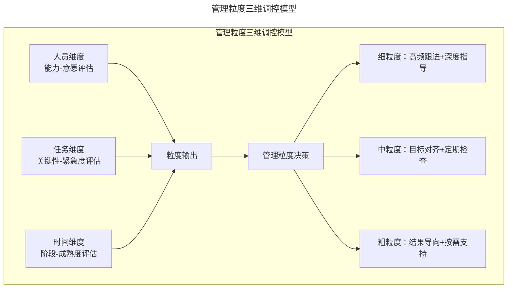
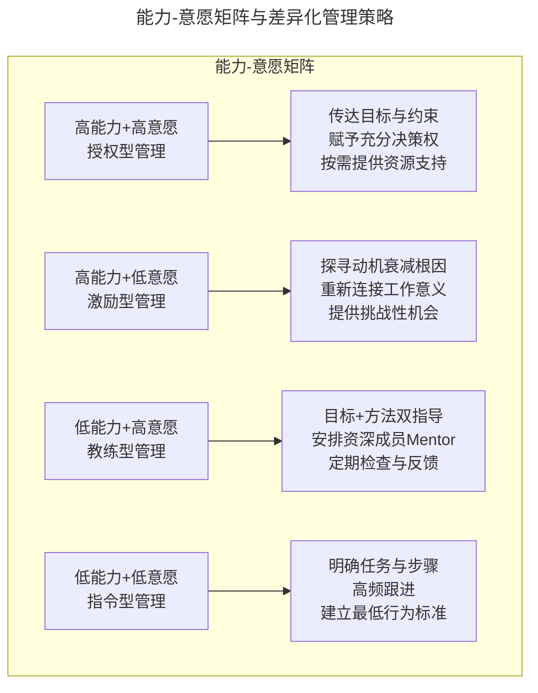
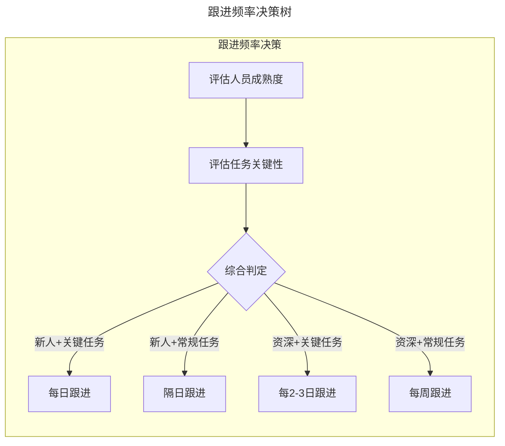

# 不要做微观的管理者

> **适用范围**：技术团队管理者（Engineering Manager / Tech Lead / Director）、项目负责人，以及希望提升管理粒度调控能力的资深工程师。
>
> **更新摘要（v2 · 2026-08 更新）**：
> - 结构化升级为 6 节骨架（导言 / 核心方法论 / 关键流程 / 工具与实战 / 常见误区 / 进阶延展）
> - 所有 Mermaid 图补充 `title` frontmatter，并确保每张图后附文字解读
> - 将原"参考资料"融入"进阶延展"节
> - 保留全部信号识别清单、三维调控模型与差异化策略矩阵

---

## 1. 导言

管理粒度是技术管理者最核心的调控杠杆之一。粒度过细，团队丧失自主性与创造力；粒度过粗，项目偏离轨道而无人纠偏。微观管理（Micromanagement）作为管理粒度失调的典型表现，已被大量实证研究证实与员工离职率、创新产出下降、心理安全感削弱显著正相关。

本文从微观管理的识别与危害出发，构建"人员—任务—时间"三维管理粒度调控模型，系统阐述因人而异、因事而异、跟进粒度设计及沟通期望对齐的方法论，为技术管理者提供可操作的粒度调控框架。核心理念是：**管理者的价值在于放大团队产出，而非成为最高产的个人贡献者**。

---

## 2. 核心方法论

### 2.1 微观管理的定义与危害

#### 定义

微观管理是一种管理风格，其特征是管理者对下属的工作过程进行过度监控与干预，包括但不限于：频繁检查工作细节、替下属做技术决策、要求逐级审批、对工作方法施加刚性约束。其本质是管理者对控制感的过度追求，导致管理粒度超出任务与人员所需的合理区间。

#### 信号识别清单

管理者可通过以下信号进行自我诊断：

| 信号维度 | 微观管理表现 | 健康管理表现 |
|---------|------------|------------|
| 决策权 | 技术细节决策由管理者主导 | 技术决策权下放至执行者 |
| 沟通频率 | 每日多次询问进度细节 | 按约定频率同步关键节点 |
| 工作方式 | 指定具体实现方案 | 传达目标与约束，方法自主 |
| 反馈模式 | 逐行审查代码/文档 | 关注结果与关键质量指标 |
| 团队氛围 | 成员等待指令才行动 | 成员主动推进并汇报进展 |
| 人才流动 | 高绩效员工持续流失 | 核心人才留存率稳定 |

#### 影响分析

微观管理的危害呈链式传导：

1. **自主性剥夺**：员工丧失对工作的掌控感，内在动机（Autonomy）被削弱
2. **能力退化**：长期缺乏决策实践，成员的判断力与问题解决能力萎缩
3. **信任崩塌**：过度监控传递"我不信任你"的信号，破坏心理安全感
4. **创新抑制**：试错空间被压缩，团队趋向保守与合规而非探索与突破
5. **管理者瓶颈**：管理者时间被细节消耗，无法履行战略规划与资源协调等高杠杆职责
6. **人才流失**：高自主性需求的高绩效人才率先离开，团队整体能力下降

这六步链式传导揭示了微观管理的**自我强化**特性：人才流失导致团队能力下降，管理者更不敢放权，进而加剧微观管理，形成恶性循环。打破循环的唯一方式是管理者主动从"控制过程"转向"对齐目标"。

### 2.2 管理粒度三维调控模型

管理粒度并非单一维度的"粗—细"调节，而是人员、任务、时间三个维度的动态平衡。

#### 三维调控框架

三维调控模型的核心洞见是：管理粒度不是"管理者风格"的固定属性，而是三个维度交叉计算后的动态输出。同一个管理者，面对不同人员、不同任务、不同阶段，应当输出不同的粒度。这意味着管理者需要持续评估三个维度的变化，而非"一招鲜"地固定自己的管理风格。

#### 人员维度

根据成员的能力成熟度与工作意愿，调控授权深度与指导强度。核心评估框架为"能力—意愿"矩阵：

| | 高意愿 | 低意愿 |
|---|---|---|
| **高能力** | 授权型：目标驱动，最小干预 | 激励型：探寻动机，重新激发 |
| **低能力** | 教练型：目标+方法指导，定期检查 | 指令型：明确任务+步骤，高频跟进 |

#### 任务维度

根据任务的关键性、紧急度与试错空间，调控介入深度：

| 任务特征 | 管理粒度 | 介入方式 |
|---------|---------|---------|
| 关键路径+高紧急+低试错空间 | 细粒度 | 深度参与决策，高频同步 |
| 关键路径+高紧急+高试错空间 | 中粒度 | 目标对齐，关键节点检查 |
| 非关键路径+低紧急 | 粗粒度 | 结果导向，按需支持 |

#### 时间维度

同一人员、同一任务的粒度应随时间动态调整：

- **启动期**：细粒度，确保方向对齐与上下文传递
- **执行期**：逐步放粗，从方法指导过渡到进度跟踪
- **收尾期**：中粒度，聚焦质量把关与经验沉淀
- **成长期**：持续评估成员成熟度，逐步扩大授权范围

---

## 3. 关键流程

### 3.1 因人而异策略

#### 能力—意愿矩阵

管理粒度的首要调节变量是人。Situational Leadership 理论指出，有效的领导风格应随下属的成熟度（Maturity）动态调整。在技术团队中，成员的成熟度可从能力（Competence）与意愿（Commitment）两个维度评估：

能力—意愿矩阵的实践关键在于**动态评估**：人员成熟度是动态变量。一个月前需要密集指导的新人，经过刻意练习后可能已具备独立承担任务的能力。管理者需以发展的眼光持续评估，及时调整粒度。

#### 新人 vs 资深差异化策略

| 维度 | 职场新人 | 资深工程师 |
|------|---------|----------|
| 目标传达 | 具体到可执行的任务描述 | 传达业务目标与技术约束 |
| 方法指导 | 提供参考方案与工具链 | 尊重其技术判断，仅讨论架构级决策 |
| 跟进频率 | 每日或隔日 | 每周或按里程碑 |
| 反馈方式 | 即时、具体、行为导向 | 定期、战略导向、双向交流 |
| 决策范围 | 在限定选项内选择 | 自主定义方案空间 |
| 成长支持 | 安排 Onboarding Mentor | 提供跨团队影响力机会 |

### 3.2 因事而异策略

#### 关键路径分析

任务在项目关键路径上的位置直接决定管理粒度。关键路径上的任务延迟将导致整体项目延期，因此需要更细的粒度：

- **关键路径任务**：管理者需深度参与方案评审，设置更密集的检查点，确保每一步在正确方向上
- **非关键路径任务**：给予更大自主空间，允许试错，管理者仅需关注最终交付质量

#### 试错空间评估

试错空间决定了管理者可容忍的偏差范围：

| 试错空间 | 管理策略 | 典型场景 |
|---------|---------|---------|
| 零容忍 | 细粒度管控，每步验证 | 支付系统核心逻辑、安全合规变更 |
| 有限容忍 | 关键节点检查，中间自主 | 核心功能开发、性能优化 |
| 高容忍 | 粗粒度放手，结果验收 | 探索性实验、内部工具开发 |

#### 紧急程度分级

| 紧急程度 | 管理粒度 | 沟通模式 |
|---------|---------|---------|
| P0 紧急 | 管理者直接参与，实时同步 | 站会/即时通讯，小时级更新 |
| P1 高优 | 细粒度跟进，每日同步 | 每日 Standup + 异步文档 |
| P2 正常 | 中粒度，按里程碑跟进 | 周会 + 项目管理工具 |
| P3 低优 | 粗粒度，结果导向 | 按需沟通 |

**重要提醒**：如果整个项目没有任何可放手的空间，管理者应反思项目规划与资源分配的合理性，而非将所有任务都置于细粒度管控之下。全量细粒度管理是不可扩展的——管理者的时间和精力是有限资源，当团队规模增长时，这种模式必然崩溃。

### 3.3 跟进粒度设计

#### 目标传达

管理者首要职责是确保目标被准确理解，而非亲自执行：

1. **结果定义**：清晰描述期望的最终产出物及其验收标准
2. **约束说明**：明确时间、资源、技术、合规等边界条件
3. **上下文传递**：解释"为什么做"，使成员理解任务的业务价值与战略意义
4. **成功标准**：定义"完成"的具体标准（Definition of Done）

#### 指导而非代做

管理者的角色是资源与支持，而非替代执行者：

| 情境 | 微观管理做法 | 有效管理做法 |
|------|------------|------------|
| 成员遇到技术难题 | 直接给出实现方案 | 引导分析思路，提供学习资源 |
| 代码质量不达标 | 逐行修改代码 | 指出问题模式，建立 Code Review 规范 |
| 方案选型犹豫 | 指定某个方案 | 讨论各方案优劣，让成员决策 |
| 进度落后 | 接手部分工作 | 分析瓶颈，协调资源，调整优先级 |

#### 频率设定

跟进频率应根据人员成熟度与任务特征动态设定：

跟进频率决策树的逻辑是先评估人员维度（成熟度），再叠加任务维度（关键性），两者交叉得出具体频率。这个框架的价值在于将"跟进频率"从主观感觉转化为可讨论的决策，团队成员也能据此主动提出"我希望调整跟进频率"的诉求。

每次跟进的核心议程：

1. 进展同步：当前状态与预期是否一致
2. 障碍识别：是否存在需要管理者清除的拦路石
3. 方向校准：是否需要调整策略或优先级
4. 支持确认：成员是否需要额外资源或指导

#### 难点交流

当进度受阻时，管理者需通过结构化对话定位问题根因：

1. **能力瓶颈**：成员缺乏完成某项任务的知识或技能 → 提供培训、安排 Mentor、调整任务拆分
2. **资源不足**：人力、工具、信息等外部条件不满足 → 协调资源、调整时间线、寻求跨团队支持
3. **方向模糊**：需求不清晰或目标有歧义 → 重新对齐目标、明确验收标准
4. **动力不足**：成员对任务缺乏认同感或成就感 → 重新连接任务意义、调整挑战水平

**核心原则**：给出建设性建议帮助成员提升能力，但绝不直接上手替代完成。管理者的价值在于放大团队产出，而非成为最高产的个人贡献者。

### 3.4 沟通期望对齐

沟通是管理粒度调控的元能力。所有粒度设计最终都依赖有效的期望对齐才能落地。

#### 期望对齐框架

1. **双向透明**：管理者明确表达跟进意图与关注点，成员坦诚反馈对管理粒度的感受
2. **要求与建议的区分**：
   - **要求（Requirements）**：必须达成的硬性约束，无回旋余地
   - **建议（Suggestions）**：有弹性的参考方向，成员可自主决策
3. **粒度协商**：鼓励成员主动表达"希望更多指导"或"希望更多空间"
4. **动态校准**：定期回顾管理粒度是否仍然适用，根据成员成长与任务变化及时调整

#### 沟通实践

| 实践 | 具体做法 | 效果 |
|------|---------|------|
| 管理契约 | 在项目启动时明确管理风格与跟进方式 | 减少后续摩擦 |
| 粒度反馈环 | 定期询问"我的介入是否过多/过少" | 持续优化粒度 |
| 上下文共享 | 通过文档/会议确保信息对称 | 降低因信息差导致的过度介入 |
| 异步优先 | 优先使用文档/工单等异步沟通 | 减少对专注时间的打断 |

---

## 4. 工具与实战

### 4.1 微观管理自检清单

- [ ] 团队成员是否能在不请示我的情况下做出日常技术决策
- [ ] 我是否在审查结果而非审查过程
- [ ] 我的跟进频率是否根据人员与任务差异化设定
- [ ] 当成员遇到困难时，我是否提供指导而非替代执行
- [ ] 我是否明确区分了"要求"与"建议"
- [ ] 团队中是否有成员主动表达需要更多或更少的指导
- [ ] 我的时间是否有超过 30% 花在下属工作的细节上
- [ ] 过去半年是否有高绩效成员离职且与管理风格相关

这份自检清单建议每月或每季度定期使用。其中第 7 项（时间分配）与第 8 项（人才流失）是两个硬性预警信号——如果任一项为"是"，说明管理粒度已严重失调，需立即调整。

### 4.2 管理粒度健康度指标

| 指标 | 衡量方式 | 健康阈值 |
|------|---------|---------|
| 决策下沉率 | 由执行者做出的技术决策占比 | > 70% |
| 管理者时间分配 | 管理者在战略/协调 vs 细节执行的时间比 | 战略 > 60% |
| 团队自主性指数 | 成员无需请示即可推进的工作占比 | > 60% |
| 高绩效人才留存率 | 核心人才年度留存率 | > 85% |
| 心理安全指数 | 成员敢于表达不同意见的程度 | 定性评估正向 |

这些指标可作为管理粒度调控的量化抓手。建议在季度管理复盘（Management Review）中系统追踪，而非仅凭主观感觉判断。指标偏离健康阈值时，应定位是人员维度、任务维度还是时间维度的问题，针对性调整。

---

## 5. 常见误区

### 5.1 微观管理 vs 深度参与

一个常见的认知误区是将"深度参与"等同于"微观管理"。两者的本质区别在于**介入的是决策还是执行**：深度参与是管理者在关键决策点提供输入（如架构评审、风险识别），执行权仍在团队成员手中；微观管理则是管理者替代成员做执行层面的决策（如指定具体实现方案、逐行修改代码）。判断标准是：如果管理者离开后，成员能否独立推进？如果不能，说明管理粒度过细。

### 5.2 "一刀切"的粗粒度

与微观管理相对的另一个极端是"一刀切"的粗粒度管理——对所有人和所有任务都采取放养态度，美其名曰"赋能"。这种做法忽视了人员成熟度与任务关键性的差异，对新人不公（缺乏指导导致挫败），对关键任务不负责（缺乏纠偏导致偏离）。正确的做法是**差异化粒度**：对新人细、对资深粗；对关键任务细、对探索任务粗。

### 5.3 全量细粒度管理

如果整个项目没有任何可放手的空间，管理者应反思项目规划与资源分配的合理性，而非将所有任务都置于细粒度管控之下。全量细粒度管理是不可扩展的——管理者的时间和精力是有限资源，当团队规模增长时，这种模式必然崩溃。破解之道是在项目规划阶段主动设计可放手的任务，为团队提供成长空间。

### 5.4 将"指导"变为"代做"

| 情境 | 错误做法（代做） | 正确做法（指导） |
|------|------------|------------|
| 成员遇到技术难题 | 直接给出实现方案 | 引导分析思路，提供学习资源 |
| 代码质量不达标 | 逐行修改代码 | 指出问题模式，建立 Code Review 规范 |
| 方案选型犹豫 | 指定某个方案 | 讨论各方案优劣，让成员决策 |
| 进度落后 | 接手部分工作 | 分析瓶颈，协调资源，调整优先级 |

"代做"看似高效——管理者亲手解决问题比指导成员解决更快。但这是以**牺牲成员成长**为代价的短期效率。长期来看，成员能力不提升，下次遇到类似问题仍需管理者介入，形成"管理者越来越忙、成员越来越依赖"的恶性循环。

### 5.5 混淆"要求"与"建议"

管理者在沟通中如果不区分"要求"（必须达成的硬性约束）与"建议"（有弹性的参考方向），会导致两种问题：将建议当要求时，成员失去自主决策空间，沦为执行机器；将要求当建议时，成员可能忽略关键约束，导致项目风险。正确做法是在每次沟通中明确标注："这是要求，必须遵守"或"这是建议，你可以自行判断"。

---

## 6. 进阶延展

### 6.1 最佳实践

1. **目标驱动，过程自治**：清晰传达目标与约束，将实现路径的决策权交给执行者
2. **动态粒度**：以发展的眼光看待成员能力，持续评估并调整管理粒度
3. **指导不代做**：管理者是资源与支持系统，而非超级执行者
4. **差异化跟进**：根据人员成熟度与任务关键性设定差异化的跟进频率
5. **期望显性化**：明确区分要求与建议，建立双向反馈机制
6. **创造试错空间**：在项目规划中主动设计可放手的任务，为团队提供成长机会
7. **避免全量管控**：当所有任务都需要细粒度管理时，问题在规划而非执行

### 6.2 发展趋势

1. **AI 辅助管理粒度调控**：AI 工具可基于代码提交频率、任务完成趋势等数据自动建议跟进频率，减少管理者主观判断偏差
2. **异步优先的管理模式**：远程与混合办公场景下，管理粒度需适应异步协作，从实时监控转向里程碑驱动的结果管理
3. **心理安全作为粒度校准器**：Google Project Aristotle 研究持续验证心理安全是高绩效团队的第一要素，管理粒度需以不损害心理安全为底线
4. **自适应领导力**：基于 Situational Leadership II 模型的演进，管理者需具备实时感知团队状态并动态调整风格的能力
5. **从管控到赋能**：管理范式从"确保事情按我的方式做"转向"确保团队有能力和空间把事情做好"

### 6.3 参考资料与延伸阅读

1. Leadership That Gets Results — Daniel Goleman, Harvard Business Review, 2000
2. Situational Leadership II — Ken Blanchard & Paul Hersey
3. Project Aristotle: Understanding Team Effectiveness — Google re:Work, 2015
4. Drive: The Surprising Truth About What Motivates Us — Daniel H. Pink, 2009
5. The One Minute Manager — Ken Blanchard & Spencer Johnson, 1982
6. Multipliers: How the Best Leaders Make Everyone Smarter — Liz Wiseman, 2010
7. Turn the Ship Around! — L. David Marquet, 2012
8. Radical Candor — Kim Scott, 2017

> **延伸方向**：建议读者结合 *Multipliers*（乘法领导者）与 *Turn the Ship Around!*（赋权型领导）进一步研究"如何从控制型管理者转型为赋能型领导者"。同时推荐关注 Google re:Work 平台上关于心理安全感（Psychological Safety）的实证研究，将其作为管理粒度校准的底层参照系。
