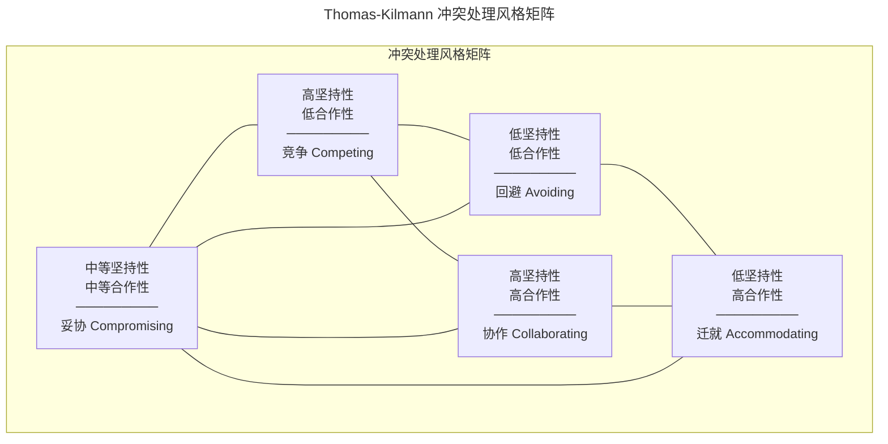
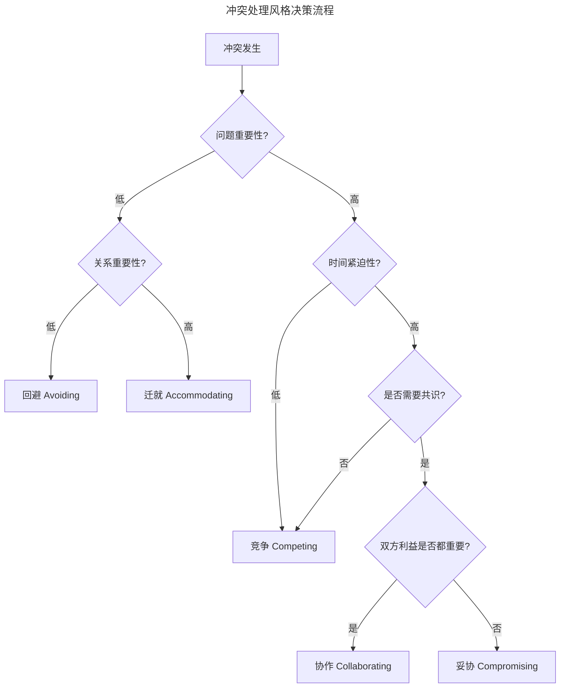

# 职场人际关系：理论框架与实践策略

> **适用范围**：技术工程师、技术管理者（Tech Lead / EM）、跨团队协作负责人，以及希望系统化提升职场软技能的专业人士。
>
> **更新摘要（v2 · 2026-08 更新）**：
> - 结构化升级为 6 节骨架（导言 / 核心方法论 / 关键流程 / 工具与实战 / 常见误区 / 进阶延展）
> - 所有 Mermaid 图补充 `title` frontmatter，并确保每张图后附文字解读
> - 将原"参考资料"融入"进阶延展"节
> - 保留 Thomas-Kilmann 冲突模型、信任公式、心理安全感四阶段等核心框架

---

## 1. 导言

职场人际关系是技术人职业发展的关键软技能。随着职业层级的提升，独立贡献的比例逐渐降低，跨部门协作、资源协调、影响力构建等需要人际互动的工作占比显著增加。

本文从组织行为学理论出发，解析职场人际关系的类型与挑战，引入 Thomas-Kilmann 冲突管理模型，阐述信任建设机制，为技术人与管理者提供系统化的人际关系管理框架。核心理念是：**健康的人际关系建立在长期互惠平衡之上，而非短期交易**。

---

## 2. 核心方法论

### 2.1 社会交换理论（Social Exchange Theory）

社会交换理论（Homans, 1958; Blau, 1964）认为，人际关系的本质是**基于互惠原则的资源交换**。交换资源包括：

| 资源类型 | 示例 | 交换特征 |
|---------|------|---------|
| 经济资源 | 薪酬、奖金、晋升 | 显性、可量化 |
| 信息资源 | 知识、经验、行业洞察 | 隐性、高价值 |
| 情感资源 | 认可、支持、归属感 | 隐性、长期积累 |
| 社会资源 | 人脉、声誉、影响力 | 隐性、网络效应 |

**关键洞察**：健康的人际关系建立在**长期互惠平衡**之上，而非短期交易。技术人常犯的错误是只关注经济资源交换（薪酬、晋升），忽视了信息资源、情感资源与社会资源的积累，而这些隐性资源往往是长期职业发展的关键。

### 2.2 互惠行为类型

Adam Grant 在《Give and Take》（2013）中将职场人分为三类：

| 类型 | 行为特征 | 典型表现 | 长期结果 |
|------|---------|---------|---------|
| 给予者（Giver） | 优先考虑他人利益，不求即时回报 | 主动分享知识、帮助同事、提携后辈 | 建立广泛信任网络，长期收益最高 |
| 匹配者（Matcher） | 追求对等交换，有来有往 | 记录人情账本，帮助曾帮助自己的人 | 维持稳定关系，收益中等 |
| 索取者（Taker） | 优先考虑自身利益，利用他人 | 只与有用的人交往，很少回馈 | 短期收益高，长期声誉受损 |

**研究发现**：给予者在组织中的绩效分布呈现双峰——最差与最优绩效者均为给予者。区分关键在于**边界管理能力**：成功的给予者懂得在帮助他人的同时保护自己的核心目标。

### 2.3 心理安全感（Psychological Safety）

Amy Edmondson（1999）提出的心理安全感概念，指团队成员确信**提出问题、承认错误、表达异议不会受到惩罚或羞辱**的共享信念。心理安全感是高效团队协作的基础。

心理安全感的四个阶段（Timothy Clark, 2020）：

```
阶段1：包容安全感（Inclusion Safety）
    → 感到被接纳，可以做自己
阶段2：学习安全感（Learner Safety）
    → 可以提问、犯错、学习
阶段3：贡献安全感（Contributor Safety）
    → 可以提出想法、主动贡献
阶段4：挑战安全感（Challenger Safety）
    → 可以质疑现状、提出异议
```

四个阶段呈递进关系：成员必须先感到被包容（阶段1），才能安全地学习与试错（阶段2），进而主动贡献（阶段3），最终敢于挑战现状（阶段4）。管理者若跳过前序阶段直接要求成员"大胆提出异议"，往往收效甚微——因为缺乏前序基础，挑战会被感知为风险而非贡献。

### 2.4 关系类型与挑战

#### 职场关系分类矩阵

| 维度 | 高权力距离 | 低权力距离 |
|------|-----------|-----------|
| 高任务依赖 | 上下级关系（强依赖） | 平级协作关系（强依赖） |
| 低任务依赖 | 跨部门关系（弱依赖） | 泛泛之交（弱依赖） |

#### 典型关系挑战

| 挑战类型 | 典型场景 | 根因分析 |
|---------|---------|---------|
| 沟通障碍 | "H人倒不错，但什么都说不清楚" | 信息编码/解码能力差异、上下文缺失 |
| 固执己见 | "A总是特别有主意，很难说服" | 认知风格差异、利益冲突、信任缺失 |
| 功劳归属 | "W把讨论的想法说成是自己的" | 互惠失衡、声誉竞争、规范缺失 |
| 回避冲突 | "J总是耐心，但从不表达真实想法" | 冲突回避型人格、心理安全感不足 |
| 被动攻击 | 表面同意，实际不配合 | 隐性不满、权力博弈、沟通不畅 |

---

## 3. 关键流程

### 3.1 Thomas-Kilmann 冲突处理模型

Thomas-Kilmann 模型（1974）基于两个维度——**合作性（Cooperativeness）**与**坚持性（Assertiveness）**，定义五种冲突处理风格：



矩阵的两个维度揭示了冲突处理的本质权衡：**坚持性**代表对自身利益的追求，**合作性**代表对他人利益的关注。五种风格并非有好坏之分，而是适用于不同情境。高绩效者的标志是能根据场景灵活切换风格，而非固定使用某一种。

### 3.2 五种风格的适用场景

| 风格 | 适用场景 | 不适用场景 | 行为特征 |
|------|---------|-----------|---------|
| 竞争（Competing） | 紧急决策、原则性问题、需快速行动 | 长期关系维护、团队共识需求 | 坚持己见，追求己方利益最大化 |
| 协作（Collaborating） | 复杂问题、双方利益都重要、需创新方案 | 时间紧迫、问题不重要 | 深入探讨，寻求双赢方案 |
| 妥协（Compromising） | 时间有限、双方势均力敌、临时方案 | 原则性问题、可找到更优解 | 各退一步，达成中间方案 |
| 回避（Avoiding） | 问题琐碎、情绪激动需冷静、无权决策 | 紧急问题、责任范围内 | 暂时搁置或退出 |
| 迁就（Accommodating） | 维护关系更重要、自己错了、让步可换取未来回报 | 原则性问题、长期被利用 | 放弃己见，满足对方需求 |

### 3.3 冲突处理决策流程



决策流程的设计逻辑是**先评估问题与关系的重要性，再评估时间紧迫性**：低重要性问题不值得消耗精力（回避或迁就）；高重要性问题需进一步判断时间是否紧迫——紧迫且不需共识时竞争，需共识时进一步判断双方利益权重，决定协作还是妥协。这个流程帮助冲突双方从情绪反应中抽离，进入理性决策模式。

### 3.4 技术团队常见冲突类型与处理

| 冲突类型 | 典型表现 | 推荐处理风格 | 关键技巧 |
|---------|---------|-------------|---------|
| 技术方案分歧 | 架构选型、技术栈选择 | 协作 | 建立评估框架，数据驱动决策 |
| 代码 Review 争议 | 命名规范、设计模式 | 协作/妥协 | 引用权威标准，聚焦代码而非个人 |
| 资源分配冲突 | 人力、服务器、预算 | 妥协/协作 | 透明化决策依据，建立优先级框架 |
| 责任边界模糊 | 跨团队问题归属 | 协作 | 明确 RACI 矩阵，建立边界协议 |
| 工作风格差异 | 沟通频率、文档习惯 | 妥协/迁就 | 建立团队规范，尊重个体差异 |

---

## 4. 工具与实战

### 4.1 信任建设机制

#### 信任的构成要素

信任公式（David Maister, 2000）：

```
信任 = (可信度 + 可靠度 + 亲近度) / 自我导向

可信度（Credibility）：专业能力与知识
可靠度（Reliability）：行为的一致性与可预测性
亲近度（Intimacy）：情感连接与安全感
自我导向（Self-Orientation）：关注自身利益的程度（分母，越低越好）
```

信任公式的精髓在于分母——**自我导向**。即使可信度、可靠度、亲近度都很高，如果对方感知到你"只为自己着想"，信任仍会很低。这解释了为何技术能力很强但"以自我为中心"的人难以建立深度信任：他们的分子虽高，但分母更大，整体信任值被稀释。

#### 信任建设的实践策略

| 要素 | 建设策略 | 具体行为 |
|------|---------|---------|
| 可信度 | 展示专业能力 | 分享专业知识、提供高质量解决方案、承认知识边界 |
| 可靠度 | 保持行为一致 | 信守承诺、按时交付、行为可预测 |
| 亲近度 | 建立情感连接 | 主动关心、分享个人经历、保持开放态度 |
| 降低自我导向 | 关注他人利益 | 倾听需求、主动帮助、认可他人贡献 |

#### 信任修复策略

信任破坏后的修复路径：

| 破坏类型 | 修复策略 | 关键步骤 |
|---------|---------|---------|
| 能力失误 | 展示改进 | 承认错误 → 分析原因 → 展示学习成果 → 请求机会 |
| 行为失当 | 行为矫正 | 诚恳道歉 → 解释非辩解 → 补偿行动 → 行为改变 |
| 信任背叛 | 重建基础 | 承认责任 → 接受后果 → 长期一致行为 → 逐步修复 |

### 4.2 工程实践

#### 个人层面

- **主动给予**：在不影响核心目标的前提下，主动分享知识、提供帮助
- **边界管理**：设定帮助他人的边界，避免成为"老好人"而被利用
- **向上管理**：与上级保持定期沟通，对齐期望，主动汇报进展与风险
- **建立人际网络**：参与技术社区、跨部门项目，扩展弱关系网络
- **寻求帮助**：适度寻求帮助可增加亲密度，但需注意时机与方式

#### 团队层面

- **建立心理安全感**：领导者以身作则，承认错误、鼓励提问、欢迎异议
- **明确协作规范**：制定团队沟通、决策、冲突处理的显性规范
- **定期 1:1 沟通**：管理者与每位成员保持定期一对一沟通，了解诉求与挑战
- **功劳归属透明化**：在公开场合明确认可贡献者，建立功劳归属规范
- **冲突调解机制**：建立团队内部的冲突升级与调解路径

#### 组织层面

- **跨部门协作机制**：建立跨部门项目的 RACI 矩阵与协作流程
- **360 度反馈**：引入多维度反馈机制，促进关系问题的早期发现
- **导师制度**：为新员工配备导师，加速关系网络建立
- **团队建设活动**：定期组织非工作性质的团队活动，增进情感连接

---

## 5. 常见误区

### 5.1 将"给予"等同于"无底线付出"

给予者（Giver）在组织中的绩效呈双峰分布——最差与最优绩效者均为给予者。区分关键在于**边界管理能力**。无底线付出的给予者会因精力被耗尽而绩效下降，最终成为"老好人"被利用。成功的给予者懂得区分"高影响力帮助"（对他人成长有实质贡献）与"低价值请求"（可替代的杂事），将精力集中在前者。

### 5.2 回避所有冲突

许多技术人将"和气"等同于"好关系"，刻意回避所有冲突。这种做法的后果是：表面和谐下积累隐性不满，最终以被动攻击（表面同意、实际不配合）或突然爆发的方式释放。健康的做法是根据问题重要性与关系重要性选择冲突处理风格——对琐碎问题可以回避或迁就，但对涉及原则或核心利益的问题，协作或竞争比回避更可持续。

### 5.3 功劳归属模糊

"功劳归属"是职场关系中最敏感的雷区。常见的错误模式包括：在会议上将团队讨论的成果表述为个人贡献；在汇报中弱化他人的参与；将他人的创意据为己有。这些行为会迅速破坏信任，且一旦被察觉，声誉损伤难以修复。正确做法是**显性化归属**：在公开场合明确认可贡献者，在文档中记录每个人的具体贡献，建立"功劳账本"。

### 5.4 忽视"弱关系"的维护

技术人倾向于深耕少数"强关系"（直接团队成员、密切合作者），而忽视"弱关系"（跨部门同事、社区联系人）的维护。然而社会网络研究表明，**职业机会与创新信息更多来自弱关系**——强关系圈内的信息高度同质，弱关系才提供跨领域的新信息。建议定期投入少量时间维护弱关系网络（如季度性的 coffee chat、技术社区参与）。

### 5.5 将信任视为一次性建立

信任不是一次性行为的产物，而是**长期一致性行为的累积**。常见误区是在建立初期投入大量精力（如新入职时的积极表现），一旦关系稳定后就放松。信任的衰减速度远快于建立速度——一次违背承诺可能毁掉数月积累的信任。正确做法是将信任维护视为持续性投入，而非一次性项目。

---

## 6. 进阶延展

### 6.1 最佳实践

1. **假设善意**：在解读他人行为时，优先假设对方出于善意而非恶意
2. **主动给予，不求即时回报**：建立长期互惠关系，而非短期交易
3. **管理帮助边界**：在帮助他人与保护自己核心目标之间保持平衡
4. **根据场景选择冲突处理风格**：无最优风格，只有最适风格
5. **建立可信度与可靠度**：专业能力与行为一致性是信任的基石
6. **降低自我导向**：关注他人利益，减少"以我为中心"的沟通
7. **主动寻求帮助**：适度示弱可增加亲密度，但需尊重对方时间
8. **认真对待他人意见**：即使不采纳，也要解释原因并表示感谢

### 6.2 发展趋势

- **远程协作下的人际关系**：虚拟环境下的信任建立与冲突处理成为新挑战
- **AI 辅助沟通**：AI 工具辅助撰写邮件、分析沟通风格，降低沟通成本
- **跨文化协作**：全球化团队增加文化差异带来的关系挑战
- **情商（EQ）培训普及**：组织越来越重视软技能培训
- **数据驱动的人际关系管理**：通过组织网络分析（ONA）识别协作瓶颈
- **心理健康与人际关系**：组织更加关注员工心理健康对人际关系的影响

### 6.3 参考资料与延伸阅读

- Grant, A. (2013). *Give and Take: A Revolutionary Approach to Success*
- Thomas, K.W. & Kilmann, R.H. (1974). *Thomas-Kilmann Conflict Mode Instrument*
- Edmondson, A. (1999). *Psychological Safety and Learning Behavior in Work Teams*
- Maister, D. et al. (2000). *The Trusted Advisor*
- Clark, T. (2020). *The 4 Stages of Psychological Safety*
- Goleman, D. (1995). *Emotional Intelligence: Why It Can Matter More Than IQ*
- Cialdini, R. (2006). *Influence: The Psychology of Persuasion*

> **延伸方向**：建议读者结合 *The Trusted Advisor*（信任顾问）深入研究信任公式的应用，并关注组织网络分析（Organizational Network Analysis, ONA）这一新兴领域——它通过数据分析揭示组织内真实的信息流动与协作模式，为人际关系管理提供量化视角。对于跨文化团队管理者，推荐进一步研究 Erin Meyer 的 *The Culture Map*。
