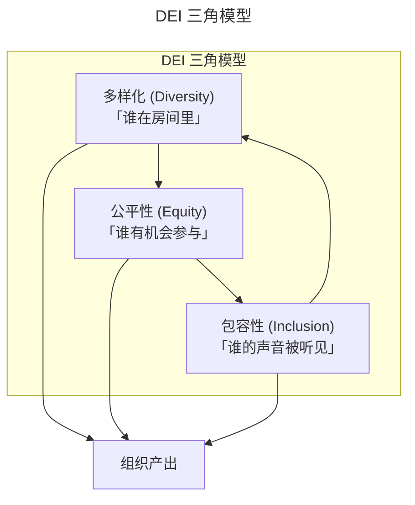
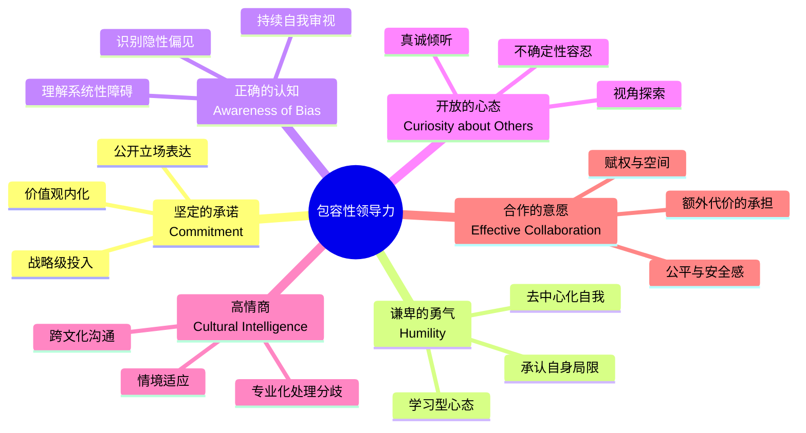

# 兼容并包的领导方式：DEI框架下的包容性领导力

> **适用范围**：技术团队管理者（EM / Director / VP）、团队文化建设者、HR BP，以及希望提升跨文化协作与包容性管理能力的技术领导者。
>
> **更新摘要（v2 · 2026-08 更新）**：
> - 结构化升级为 6 节骨架（导言 / 核心方法论 / 关键流程 / 工具与实战 / 常见误区 / 进阶延展）
> - 所有 Mermaid 图补充 `title` frontmatter，并确保每张图后附文字解读
> - 将原"参考资料"融入"进阶延展"节
> - 保留 Deloitte 包容性领导力六特征模型、DEI 实践框架与隐性偏见类型矩阵

---

## 1. 导言

在全球化与数字化深度交织的 2025 年，多样化（Diversity）、公平性（Equity）与包容性（Inclusion）——统称 DEI——已从企业的道德倡议演进为核心竞争力要素。技术团队作为创新引擎，其成员构成的异质性与领导者的包容能力直接决定了产品洞察深度、创新活力与人才吸引力。

本文基于 Deloitte 包容性领导力模型与最新 DEI 研究成果，构建一套面向技术管理者的包容性领导力发展框架。核心理念是：**多样化是"数人头"，包容性是"让人头被数进去"**——没有包容性的多样化是表演性的，没有公平性的包容性是虚伪的。

---

## 2. 核心方法论

### 2.1 多样化-公平性-包容性三角模型

DEI 并非单一概念，而是三个相互依存、逐层递进的维度：

三角模型揭示了 DEI 三维度的递进关系：多样化（D）关注"谁在房间里"，是基础；公平性（E）关注"谁有机会参与"，消除系统性障碍；包容性（I）关注"谁的声音被听见"，创造归属感。三者形成正向循环——包容性环境吸引更多样化的人才加入，进一步推动公平性改进。三者缺一不可，任一环节缺失都会导致 DEI 流于形式。

| 维度 | 定义 | 关键问题 | 衡量指标 |
|------|------|---------|---------|
| 多样化 | 团队成员在身份、背景、认知方式上的差异性 | "谁在房间里？" | 人口统计学分布、认知风格多样性指数 |
| 公平性 | 消除系统性障碍，确保机会与资源的公正分配 | "谁有机会参与？" | 晋升率差异、薪酬公平性、资源分配透明度 |
| 包容性 | 创造让所有成员感到被尊重、被重视、被赋能的环境 | "谁的声音被听见？" | 归属感评分、心理安全感、参与决策比例 |

**关键洞察**：多样化是"数人头"，包容性是"让人头被数进去"。没有包容性的多样化是表演性的，没有公平性的包容性是虚伪的。

### 2.2 认知多样性理论

认知多样性（Cognitive Diversity）指团队成员在思维方式、问题解决路径、知识结构上的差异。Scott Page 的研究表明，在复杂问题解决场景中，认知多样性团队的集体智商往往高于同质化高能力团队——这被称为"多样性红利"（Diversity Dividend）。

认知多样性的维度包括：

- **分析维度**：数据驱动 vs. 直觉驱动
- **结构维度**：线性思维 vs. 系统思维
- **经验维度**：领域专家 vs. 跨界通才
- **风险维度**：风险规避 vs. 风险偏好

### 2.3 多样化的商业价值

#### 2.3.1 市场洞察能力

全球化市场要求产品具备跨文化适应力。多样化团队在以下方面具有显著优势：

| 场景 | 多样化团队优势 | 同质化团队风险 |
|------|---------------|---------------|
| 本地化设计 | 内置文化敏感度，减少"文化翻车" | 文化盲点导致产品冒犯或失效 |
| 用户研究 | 多视角解读用户行为，减少归因偏差 | 将自身经验投射为"用户需求" |
| 市场进入 | 快速识别监管、习俗、竞争格局差异 | 误判市场环境，战略失误 |

**案例**：Airbnb的用户群体涵盖从经济型旅行者到豪宅体验者、从本地化体验到新奇探索者。多样化设计团队才能理解并服务这些差异化需求。

#### 2.3.2 用户理解深度

产品的竞争力源于对用户需求的精准把握。当用户群体本身高度多样化时，同质化团队必然存在理解盲区：

- **需求遗漏**：无法感知与自己经验迥异的用户需求
- **优先级偏差**：将自身关注点误判为用户核心痛点
- **体验设计缺陷**：无法预判不同用户群体的使用障碍

#### 2.3.3 创新驱动效应

多样化是创新的催化剂。其作用机制包括：

1. **信息池扩展**：不同背景成员带来更丰富的知识储备与信息来源
2. **视角碰撞**：异质视角的交锋激发非常规解决方案
3. **群体思维免疫**：多样化天然抑制群体思维（Groupthink）的滋生
4. **风险分散**：不同风险偏好的组合提供更均衡的决策校准

> **比尔·盖茨**："组织要么创新，要么死亡。"多样化是组织创新能力的结构性保障。

#### 2.3.4 人才吸引与保留

DEI已成为顶尖人才选择雇主的关键考量：

- **Z世代与千禧一代**：将DEI视为择业的必要条件而非加分项
- **女性与少数群体**：包容性文化是留任的核心驱动因素
- **全球人才竞争**：DEI声誉直接影响国际人才吸引力

---

## 3. 关键流程

### 3.1 包容性领导力模型

Deloitte 提出的包容性领导力六特征模型（The Six Signature Traits of Inclusive Leadership）为技术管理者提供了可操作的能力框架：

六特征模型涵盖了从内在价值观到外在行为的完整链路：承诺与谦卑是内在基础，认知与开放是思维模式，高情商与合作是外化行为。这六个特征相互支撑——没有谦卑的承诺容易变成说教，没有认知的开放可能流于表面，没有合作意愿的情商只是个人魅力。

#### 特征一：坚定的承诺（Commitment）

包容性领导始于价值观层面的深度认同，而非策略性的合规姿态。

**行为表现**：
- 将DEI纳入组织战略目标，而非边缘化的CSR项目
- 公开表达对多样化与包容性的立场，即使面临争议
- 在资源分配中为DEI倡议预留预算与人力
- 将DEI指标纳入管理层绩效考核

**实践要点**：硅谷领先企业将包容性标语融入文化符号（文化衫、办公环境、品牌传播），在招聘中明确表达DEI立场并考察候选人的价值观匹配度。

#### 特征二：谦卑的勇气（Humility）

谦卑并非自我贬低，而是对自身局限性的清醒认知与对他人价值的真诚尊重。

**行为表现**：
- 承认自己并非全知，主动寻求不同视角的输入
- 在错误发生时坦然承认，而非防御性辩解
- 将成功归因于团队贡献，而非个人英雄主义
- 对所有成员保持平等尊重，无论其职级、背景或身份

**实践要点**：在技术决策中，领导者应主动邀请不同背景成员发表意见，而非仅依赖"核心圈子"。

#### 特征三：正确的认知（Awareness of Bias）

隐性偏见（Implicit Bias）是人类认知的固有特性，包容性领导的关键在于识别并缓解（mitigate）其影响。

**常见隐性偏见类型**：

| 偏见类型 | 定义 | 职场表现 |
|----------|------|---------|
| 亲和偏见 | 倾向于亲近与自己相似的人 | 招聘、晋升中的"同类偏好" |
| 确认偏见 | 寻求支持既有观点的信息 | 忽视与自己观点相左的反馈 |
| 光环效应 | 单一正面特质泛化为整体正面评价 | 名校背景掩盖实际能力缺陷 |
| 归因偏见 | 对内群体归因情境，对外群体归因特质 | 同样错误，对"自己人"宽容，对"外人"严厉 |

**实践要点**：在关键决策节点（招聘、绩效评估、任务分配）引入结构化流程与多元评审者，降低个体偏见的影响。

#### 特征四：开放的心态（Curiosity about Others）

真诚的好奇心是理解差异、建立连接的前提。

**行为表现**：
- 主动了解不同背景同事的经历与观点
- 在不理解时提问而非评判
- 接纳与自己不同的价值观与工作方式
- 对不确定性保持开放，而非急于下结论

**实践要点**：在1-on-1中设置"了解对方"的议程，而非仅聚焦任务进展。

#### 特征五：高情商（Cultural Intelligence）

文化智商（CQ）是在跨文化情境中有效工作的能力，包含四个维度：

- **CQ驱动**：对跨文化互动的兴趣与动力
- **CQ知识**：对文化差异的理解与认知
- **CQ策略**：跨文化情境的规划与意识
- **CQ行动**：跨文化情境中的行为适应能力

**实践要点**：在全球化团队中，领导者需理解不同文化背景下的沟通风格差异（如直接vs.间接、高语境vs.低语境），并调整自己的沟通策略。

#### 特征六：合作的意愿（Effective Collaboration）

包容性领导的核心产出是让所有成员都能发挥其最大潜能。

**行为表现**：
- 为不同背景成员提供施展空间与机会
- 创造心理安全环境，鼓励不同声音表达
- 愿意承担包容性带来的额外协调成本
- 在冲突发生时公正处理，保护弱势方权益

**实践要点**：在会议中主动邀请沉默者发言，在决策中确保不同视角被纳入考量。

### 3.2 DEI实践框架

#### 3.2.1 招聘环节

| 实践措施 | 目的 | 实施要点 |
|----------|------|---------|
| 职位描述去偏见化 | 扩大候选人池 | 避免性别化语言，聚焦能力而非背景 |
| 多元化面试小组 | 降低个体偏见影响 | 确保面试官背景多样性 |
| 结构化面试 | 提升评估公平性 | 统一问题、统一评分标准 |
| 盲审简历 | 消除身份信息干扰 | 隐藏姓名、性别、学校等信息 |
| 多样化招聘渠道 | 触达不同群体 | 女性技术社区、少数群体组织等 |

#### 3.2.2 文化建设

- **心理安全环境**：建立"犯错可被讨论"的文化，鼓励不同意见表达
- **员工资源小组（ERG）**：支持不同群体建立互助网络
- **导师与赞助计划**：为弱势群体提供职业发展支持
- **DEI培训体系**：从意识唤醒到技能培养的系统性培训

#### 3.2.3 制度设计

- **公平晋升机制**：透明的晋升标准与流程，多元化晋升委员会
- **弹性工作制度**：照顾不同群体的工作生活需求
- **薪酬公平审计**：定期进行跨群体薪酬差异分析
- **反歧视与反骚扰政策**：明确的红线与举报机制

#### 3.2.4 效果评估

| 评估维度 | 指标示例 |
|----------|---------|
| 多样化 | 各群体在招聘、晋升、离职中的比例分布 |
| 公平性 | 薪酬差距、晋升速度差异、资源分配差异 |
| 包容性 | 员工敬业度调查中的归属感评分、心理安全感评分 |
| 业务影响 | 创新产出、市场覆盖、客户满意度 |

---

## 4. 工具与实战

### 4.1 技术团队的 DEI 挑战与策略

#### 挑战一：技术领域的性别失衡

**现状**：全球技术行业女性占比普遍低于30%，且随职级上升比例递减。

**策略**：
- 从教育源头介入，支持女性进入STEM领域
- 建立女性技术社区与导师网络
- 在招聘中设置女性候选人比例目标
- 优化工作环境，减少对女性不友好的因素

#### 挑战二：技术精英文化

**现状**：技术团队往往存在"技术至上"的精英主义倾向，贬低非技术角色或技术能力较弱的成员。

**策略**：
- 重新定义"贡献"，认可非技术贡献的价值
- 在绩效评估中纳入协作与包容性指标
- 打破技术职级与非技术职级的壁垒

#### 挑战三：远程协作中的包容性

**现状**：远程与混合办公模式下，边缘群体更容易被忽视。

**策略**：
- 确保远程参与者平等接入会议与信息
- 建立异步沟通规范，照顾不同时区成员
- 定期进行远程成员的1-on-1关怀

### 4.2 包容性工程实践

#### 包容性代码评审

- 评审意见聚焦代码本身，而非对人的评判
- 避免使用贬低性或攻击性语言
- 对非母语贡献者保持耐心
- 鼓励不同经验水平的贡献者参与

#### 包容性技术文档

- 使用性别中立语言
- 避免文化特定隐喻与俚语
- 提供多语言版本支持
- 考虑不同背景用户的理解差异

#### 包容性会议实践

- 会议前：提前分享议程与材料，照顾不同准备节奏
- 会议中：主动邀请沉默者发言，制止打断与抢话
- 会议后：确保行动项公平分配，记录与同步对所有人可见

---

## 5. 常见误区

### 5.1 表演性多样化

表演性多样化（Performative Diversity）指只追求"数人头"的表面多样化指标，而不实质改变团队文化与管理方式。典型表现包括：在宣传材料中展示多样化面孔，但决策层仍高度同质化；举办 DEI 活动但不将 DEI 纳入绩效考核。这种做法不仅无法获得多样化的真实收益，还会因"虚伪感"损害组织信任。真正的 DEI 需要从招聘、晋升、文化、制度全链路系统推进。

### 5.2 隐性偏见未识别

隐性偏见是人类认知的固有特性，即使是自认"公正"的管理者也会受其影响。常见误区是认为"我没有偏见"而不采取任何缓解措施。实际上，关键在于识别偏见在关键决策节点的影响，并通过结构化流程（如盲审简历、统一评分标准、多元评审者）降低个体偏见的累积效应。

### 5.3 "技术至上"的精英文化

技术团队常存在将技术能力等同于个人价值的倾向，导致非技术角色（产品经理、设计师、QA）或技术能力较弱的成员被边缘化。这种文化不仅损害团队协作，也限制了产品的综合质量——优秀的产品需要技术、设计、产品、运营的协同。管理者应重新定义"贡献"，在绩效评估中纳入协作与包容性指标。

### 5.4 将 DEI 视为 HR 专属职责

许多技术管理者认为 DEI 是 HR 部门的责任，与自己的日常管理无关。这是根本性的误区——DEI 的落地发生在每一次任务分配、每一次代码评审、每一次会议发言中，这些都是技术管理者的日常工作。HR 可以提供框架与培训，但真正的包容性文化由每一位管理者的日常行为塑造。

### 5.5 忽视远程协作中的包容性

远程与混合办公模式下，边缘群体更容易被忽视——无法参与线下非正式交流的成员逐渐被边缘化，不同时区的成员在会议中被遗忘。管理者需主动设计包容性流程：确保远程参与者平等接入会议与信息，建立异步沟通规范，定期关怀远程成员。

### 5.6 将"包容"等同于"不冲突"

包容性不意味着回避所有冲突或意见分歧。相反，包容性环境应鼓励不同视角的建设性碰撞。将"包容"误解为"和气"会导致团队陷入群体思维，丧失多样化的创新红利。真正的包容是让不同声音被听见并被认真对待，而非让所有人说一样的话。

---

## 6. 进阶延展

### 6.1 最佳实践

1. **领导层示范**：DEI必须从最高领导层开始，言行一致地践行包容性价值观
2. **数据驱动**：建立DEI数据仪表盘，定期审视进展与差距
3. **全员参与**：DEI不仅是HR的责任，每位成员都应承担包容性行为责任
4. **持续迭代**：DEI是长期旅程，而非一次性项目，需要持续学习与改进
5. **本地化适配**：DEI实践需考虑本地文化与法律环境，避免简单复制

### 6.2 发展趋势

#### 2025年DEI新趋势

- **从多样化到归属感**：关注点从"数人头"转向"让人头被数进去"的深度体验
- **交叉性视角**：认识到个体身份的多重维度（如"女性+少数族裔+残障"）及其叠加效应
- **神经多样性纳入**：将自闭症谱系、ADHD、学习障碍等神经多样性群体纳入DEI框架
- **DEI与ESG融合**：DEI成为企业ESG（环境、社会、治理）报告的核心组成部分

#### AI公平性挑战

AI系统的广泛应用带来新的DEI挑战：

- **算法偏见**：训练数据中的偏见被AI系统放大与固化
- **自动化决策的公平性**：招聘、信贷、司法等领域的AI决策需接受公平性审查
- **AI团队多样性**：AI开发团队的同质化可能导致产品对特定群体的系统性歧视

**应对策略**：
- 建立AI伦理审查机制
- 确保AI开发团队的多样性
- 在AI系统部署前进行偏见测试
- 保持人类对关键决策的最终裁量权

#### 跨文化管理深化

全球化与远程协作的深化要求技术管理者具备更强的跨文化能力：

- **文化智商（CQ）成为核心能力**：与情商（EQ）并列的领导力必备素质
- **本地化与全球化的平衡**：在保持组织文化一致性的同时尊重本地差异
- **虚拟跨文化团队管理**：在缺乏面对面互动的情况下建立信任与协作

### 6.3 参考资料与延伸阅读

- Deloitte. *The Six Signature Traits of Inclusive Leadership*, 2016.
- Page, S. E. *The Difference: How the Power of Diversity Creates Better Groups, Firms, Schools, and Societies*. Princeton University Press, 2007.
- Rock, D. & Grant, H. *Why Diverse Teams Are Smarter*. Harvard Business Review, 2016.
- Edmondson, A. *The Fearless Organization: Creating Psychological Safety in the Workplace for Learning, Innovation, and Growth*. Wiley, 2019.
- McKinsey & Company. *Diversity Wins: How Inclusion Matters*, 2020.
- World Economic Forum. *Global Gender Gap Report 2024*, 2024.

> **延伸方向**：建议读者结合 *The Fearless Organization*（Amy Edmondson）深入研究心理安全感与包容性的关系，并关注 Scott Page 的 *The Difference* 以理解认知多样性的数学基础。对于 AI 公平性议题，推荐进一步研究算法审计（Algorithm Audit）方法论与 NIST AI Fairness 框架。跨文化管理方面，Erin Meyer 的 *The Culture Map* 是理解文化差异实用指南。
