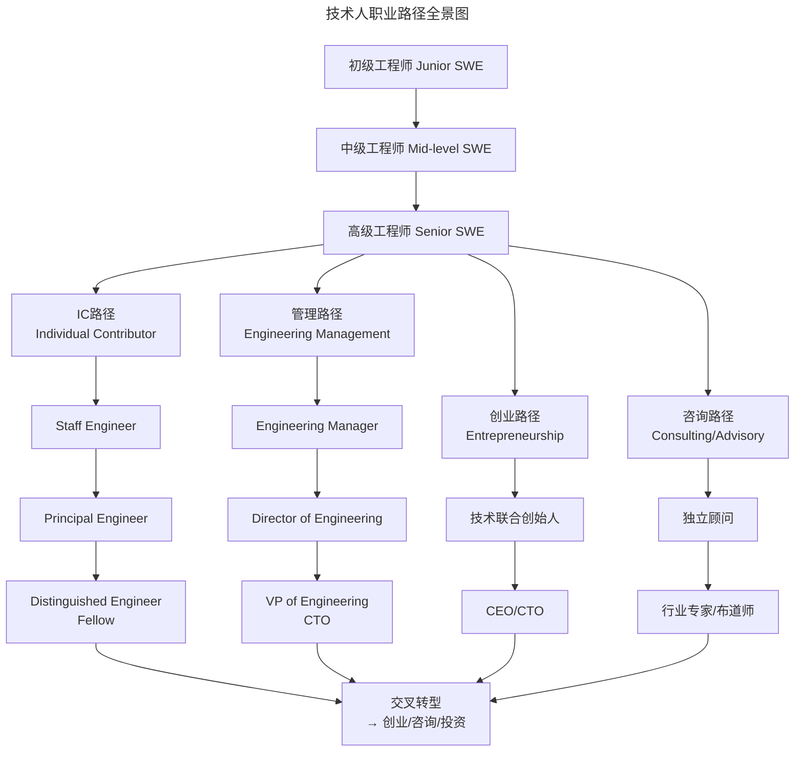
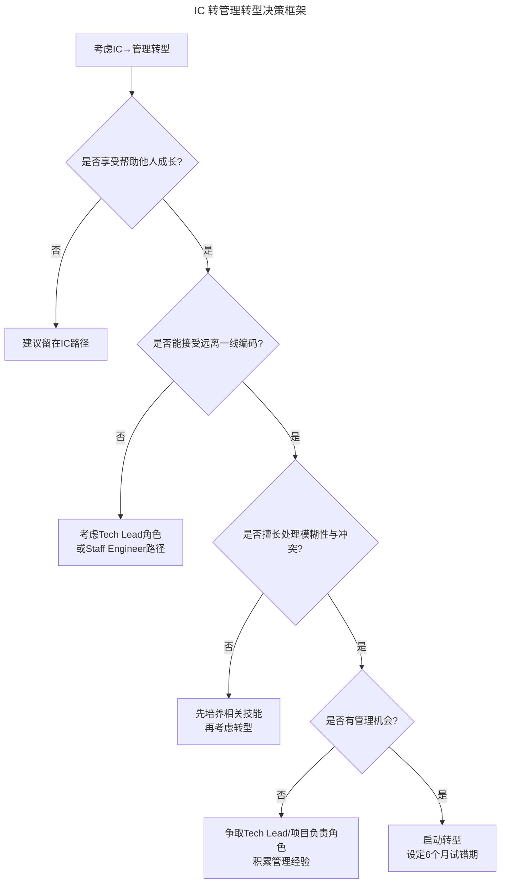

# 技术人职业规划：理论框架与实践路径

> **适用范围**：初级到高级工程师、IC 转型管理者、技术管理者（EM / Director），以及希望建立系统化职业规划的职场人士。
>
> **更新摘要（v2 · 2026-08 更新）**：
> - 结构化升级为 6 节骨架（导言 / 核心方法论 / 关键流程 / 工具与实战 / 常见误区 / 进阶延展）
> - 所有 Mermaid 图补充 `title` frontmatter，并确保每张图后附文字解读
> - 将原"参考资料"融入"进阶延展"节
> - 保留 Super 生涯发展理论、职业锚理论、IC 转管理决策框架与技能矩阵示例

---

## 1. 导言

职业规划是技术人实现长期职业目标的核心工具。然而，许多工程师在职业发展中面临"重复性工作陷阱"——长期停留在舒适区，技能成长停滞，缺乏清晰的进阶路径。

本文从职业发展理论出发，系统分析技术人的多元职业路径，构建自我评估、目标设定、路径选择与里程碑设计的实践框架，并引入转型决策模型，为技术人与管理者提供可操作的职业规划方法论。核心理念是：**职业发展是可逆与循环的动态过程，识别自己的职业锚是规划的起点**。

---

## 2. 核心方法论

### 2.1 Super 生涯发展理论

Donald Super 的生涯发展理论（1957, 1990）将职业发展视为**跨越生命周期的动态过程**，而非一次性决策：

| 阶段 | 年龄区间 | 核心任务 | 技术人典型表现 |
|------|---------|---------|---------------|
| 成长期（Growth） | 0-14 | 发展职业兴趣与自我认知 | 对编程/技术产生兴趣 |
| 探索期（Exploration） | 15-24 | 试探性职业选择，技能积累 | 实习、初级工程师，探索技术方向 |
| 建立期（Establishment） | 25-44 | 确定职业方向，追求晋升 | 中高级工程师，确立专业领域 |
| 维持期（Maintenance） | 45-64 | 维持现有地位，持续更新 | 资深/Staff工程师，知识传承 |
| 衰退期（Decline） | 65+ | 逐步退出，规划退休 | 顾问/导师角色 |

**关键洞察**：职业发展是**可逆与循环的**——技术人在转型时可能重新进入探索期，这属于正常现象而非倒退。理解这一点可以减轻转型时的心理负担：重新探索不是"从头开始"，而是在已有积累基础上的方向调整。

### 2.2 职业锚理论

Edgar Schein 的职业锚理论（1978, 1996）认为，每个人在职业实践中会逐渐形成稳定的**职业自我概念**，即"职业锚"——当面临选择时，最不愿放弃的核心价值：

| 职业锚类型 | 核心诉求 | 技术人典型表现 | 适配路径 |
|-----------|---------|---------------|---------|
| 技术职能型 | 追求专业深度与技术卓越 | "我想成为领域专家" | IC路径（Staff/Principal/Distinguished） |
| 管理型 | 追求组织影响力与决策权 | "我想带团队、做决策" | 管理路径（EM/Dir/VP） |
| 自主独立型 | 追求工作自由度与自主权 | "我想自己决定做什么" | 创业/自由职业/咨询 |
| 安全稳定型 | 追求职业安全感与可预测性 | "我需要稳定的收入与福利" | 大公司长期任职 |
| 创业创造型 | 追求从零构建的成就感 | "我想创造自己的产品" | 创业/内部创新项目 |
| 服务奉献型 | 追求社会价值与帮助他人 | "我想用技术解决社会问题" | 社会企业/开源/教育 |
| 挑战型 | 追求持续挑战与问题解决 | "我享受攻克难题的过程" | 研究型岗位/前沿技术 |
| 生活平衡型 | 追求工作与生活的整合 | "家庭与工作同等重要" | 弹性工作/远程/独立咨询 |

**实践意义**：识别自己的职业锚是职业规划的起点，它决定了路径选择的方向。职业锚并非一成不变——随着年龄、家庭、经历的变化，职业锚可能迁移。建议每年进行一次职业锚自评，识别核心诉求的变化。

### 2.3 技术人职业路径分析

#### 路径全景图



路径全景图展示了技术人从初级工程师出发的四条主干路径：IC（个人贡献者）、管理、创业、咨询。每条路径都有清晰的晋升阶梯，且路径之间存在交叉转型机会（如 Distinguished Engineer 转为创业 CEO）。关键洞见是：路径选择不是单选题——在职业生涯后期，交叉转型（Portfolio Career）越来越常见，技术人可以同时扮演 IC、顾问、创作者等多重角色。

#### IC路径 vs 管理路径

| 维度 | IC路径 | 管理路径 |
|------|--------|---------|
| 核心价值 | 技术深度与架构影响力 | 组织效能与人才发展 |
| 评估标准 | 技术决策质量、架构影响力、技术标准制定 | 团队产出、人才成长、跨团队协作 |
| 影响力方式 | 技术权威、设计评审、技术文档 | 资源分配、战略决策、文化建设 |
| 典型挑战 | 影响力范围有限、缺乏管理支持 | 远离技术、人事管理压力 |
| 薪酬天花板 | 与管理路径对等（顶级公司） | 传统上更高（中小公司） |

**关键趋势**：顶级技术公司（Google, Meta, Airbnb等）已实现IC与管理路径的薪酬对等，Staff Engineer与Engineering Manager的薪酬范围基本一致。

#### 创业与咨询路径

| 维度 | 创业路径 | 咨询路径 |
|------|---------|---------|
| 核心价值 | 从零构建产品与组织 | 以专业知识解决客户问题 |
| 风险等级 | 高（收入不确定、失败率高） | 中（客户波动、收入不稳定） |
| 自由度 | 高（但被公司需求绑定） | 高（可选择性接项目） |
| 入行门槛 | 需要产品/市场/融资能力 | 需要行业声誉与专业深度 |
| 典型转型时机 | 建立期后期（30-40岁） | 维持期（40岁+） |

---

## 3. 关键流程

### 3.1 职业规划实践框架

#### 第一步：自我评估

自我评估是职业规划的基石，需从以下维度进行系统化审视：

| 评估维度 | 核心问题 | 评估工具 |
|---------|---------|---------|
| 价值观 | 什么情境让我有幸福感与自信心？ | 职业锚测评、价值观排序 |
| 长期愿景 | 5-10年后我希望成为什么样的人？ | 愿景板、十年想象法 |
| 能力差距 | 达到目标还需哪些技能与经验？ | 技能矩阵、差距分析 |
| 核心优势 | 我比他人做得更好的是什么？ | 反馈分析、优势识别器（StrengthsFinder） |

**技能矩阵示例**：

```
技能领域        当前水平    目标水平    差距
─────────────────────────────────────────
系统设计        ████████░░  ██████████  2
分布式系统      ██████░░░░  █████████░  3
技术领导力      █████░░░░░  ████████░░  3
跨团队协作      ███████░░░  █████████░  2
产品思维        ████░░░░░░  ███████░░░  3
公开演讲        ███░░░░░░░  ██████░░░░  3
```

#### 第二步：目标设定

采用**OKR（Objectives and Key Results）**框架设定职业目标：

| 层级 | 时间跨度 | 示例 |
|------|---------|------|
| 长期目标（Objective） | 3-5年 | 成为分布式系统领域的Staff Engineer |
| 中期目标（Objective） | 1年 | 主导一个跨团队的技术架构项目 |
| 短期目标（Key Result） | 季度 | 完成分布式系统课程、发表2篇技术文章、主导1次架构评审 |

**目标设定的SMART原则**：
- **S**pecific：具体明确
- **M**easurable：可量化
- **A**chievable：可达成但有挑战
- **R**elevant：与长期目标对齐
- **T**ime-bound：有明确时间节点

#### 第三步：路径选择

路径选择决策矩阵：

| 决策因素 | 权重 | IC路径评分 | 管理路径评分 | 创业路径评分 |
|---------|------|-----------|------------|------------|
| 与职业锚匹配度 | 30% | - | - | - |
| 核心优势利用率 | 25% | - | - | - |
| 能力差距可补性 | 20% | - | - | - |
| 风险承受能力 | 15% | - | - | - |
| 市场需求与机会 | 10% | - | - | - |

*评分需根据个人实际情况填写，加权求分后选择得分最高的路径。*

#### 第四步：里程碑设计

将长期目标分解为可追踪的里程碑：

```
长期目标：Staff Engineer（3-5年）
│
├── 里程碑1（6个月）：技术深度
│   ├── 完成领域内2个核心技术项目
│   ├── 发表3篇深度技术文章
│   └── 在团队内建立技术影响力
│
├── 里程碑2（12个月）：跨团队影响力
│   ├── 主导1个跨团队架构决策
│   ├── 建立团队技术规范/标准
│   └── 指导2名中级工程师
│
├── 里程碑3（18个月）：组织级影响力
│   ├── 推动组织级技术改进
│   ├── 在技术委员会中发挥核心作用
│   └── 在行业会议发表演讲
│
└── 里程碑4（24-36个月）：Staff级别
    ├── 持续产出组织级技术影响
    ├── 建立技术战略方向
    └── 完成晋升文档与评审
```

### 3.2 与管理者的协作机制

职业规划不是个人行为，需要与管理者的深度协作：

| 协作环节 | 员工责任 | 管理者责任 |
|---------|---------|-----------|
| 需求沟通 | 明确表达职业目标与所需支持 | 倾听、理解、评估可行性 |
| 资源分配 | 证明自己值得投入资源 | 提供项目机会、导师、培训 |
| 进度追踪 | 主动汇报进展、请求反馈 | 定期1:1、提供诚实反馈 |
| 障碍排除 | 识别并上报阻碍因素 | 协调资源、消除障碍 |
| 计划调整 | 根据实际情况调整目标 | 灵活调整支持方案 |

**关键原则**：
- 员工提出的支持需求应与长期目标直接关联，避免"人云亦云"
- 管理者应明确告知不支持某项请求的原因与风险，而非简单拒绝
- 双方应就"成功标准"达成一致，使计划可测量、可追踪

### 3.3 转型决策模型

#### IC转管理的决策框架



决策框架以四个关键问题为节点：是否享受帮助他人成长（意愿）、是否能接受远离编码（牺牲）、是否擅长处理模糊性与冲突（能力）、是否有管理机会（条件）。任何一个节点的"否"都指向替代方案而非强行转型。这种结构化决策帮助技术人避免因"晋升压力大"或"社会期望"而盲目转型，减少转型失败的风险。

#### 转型风险与缓解

| 转型类型 | 主要风险 | 缓解策略 |
|---------|---------|---------|
| IC→管理 | 技术能力退化、身份认同危机 | 保留20%时间做技术工作、设定试错期 |
| 管理→IC | 影响力范围缩小、薪酬调整 | 选择Staff+级别、明确技术影响力目标 |
| 大公司→创业 | 收入不稳定、角色全面化 | 财务储备12-18个月、先以顾问身份试水 |
| 创业→大公司 | 自主性降低、文化适应 | 选择文化契合的公司、谈判角色自主权 |

#### 转型时机评估

| 信号 | 含义 | 行动 |
|------|------|------|
| 当前工作持续缺乏挑战 | 已进入舒适区 | 主动寻求新挑战或考虑转型 |
| 对其他领域产生强烈好奇 | 可能进入探索期 | 深入了解、小规模试水 |
| 长期感到倦怠或不满 | 当前路径可能不适合 | 重新评估职业锚、考虑转型 |
| 市场出现新机会窗口 | 外部环境变化 | 评估机会与风险的平衡 |
| 达到当前路径的里程碑 | 阶段性目标完成 | 评估是否继续或转向 |

---

## 4. 工具与实战

### 4.1 个人层面

- **职业锚测评**：定期（每年）进行职业锚自评，识别核心诉求的变化
- **技能矩阵维护**：每季度更新技能矩阵，追踪能力成长
- **职业OKR**：设定年度职业OKR，与工作OKR并行追踪
- **1:1职业讨论**：每季度与管理者进行专门的职业发展讨论
- **导师网络**：建立2-3位导师的指导网络（直接上级+跨团队导师+行业导师）
- **职业日志**：记录关键项目、学习与反思，为晋升文档积累素材

### 4.2 管理者层面

- **职业规划辅导**：将职业规划辅导纳入1:1议程，每季度至少一次深度讨论
- **差异化任务分配**：根据成员的职业目标与诉求分配相应类型的工作
- **晋升路径透明化**：明确各级别的评估标准与期望，消除信息不对称
- **提供安全试错空间**：允许成员在低风险场景下尝试新角色（如IC试做Tech Lead）
- **资源与机会匹配**：为成员的职业目标提供项目机会、导师、培训等支持

### 4.3 组织层面

- **双轨晋升体系**：建立IC与管理对等的晋升体系与薪酬体系
- **职业发展框架**：制定清晰的职业发展框架（Career Ladder），明确各级别期望
- **内部流动机制**：允许员工在团队/角色间流动，降低转型成本
- **培训与发展预算**：为员工提供学习预算与培训机会
- **晋升评审公平性**：确保晋升评审过程透明、标准一致

---

## 5. 常见误区

### 5.1 重复性工作陷阱

许多工程师在职业发展中陷入"重复性工作陷阱"——长期停留在舒适区，用一年的经验重复十年。这种陷阱的特征是：工作内容高度重复，技能成长停滞，晋升停滞但本人未意识到问题。破解之道是定期进行技能矩阵评估，识别"当前水平"与"目标水平"的差距，主动寻求具有挑战性的新任务。

### 5.2 盲目追求管理转型

受"管理岗位是晋升必经之路"的传统观念影响，许多技术人在未充分评估自身意愿与能力的情况下盲目转型管理。常见后果是：技术能力退化但管理能力未建立，陷入"既不在 IC 路径上深耕，又未在管理路径上立足"的尴尬境地。建议在转型前用 IC 转管理决策框架进行系统评估，并设定 6 个月试错期。

### 5.3 职业规划视为个人行为

许多技术人认为职业规划是纯个人行为，不与管理者沟通，导致资源与机会错配。实际上，职业规划需要员工与管理者的深度协作——员工提出目标与诉求，管理者提供项目机会、导师、培训等支持。不沟通的后果是：管理者不了解你的职业目标，无法为你分配匹配的任务；你自己也缺乏外部视角的反馈。

### 5.4 目标过于模糊或过于刚性

职业规划的两种极端都不可取：目标过于模糊（如"成为更好的工程师"）缺乏可追踪性，无法指导日常决策；目标过于刚性（如精确规划未来 10 年的每一步）则忽视了职业发展的不确定性。正确做法是设定清晰的长期方向（3-5年），灵活的中期目标（1年），可执行的短期行动（季度），并定期根据实际情况调整。

### 5.5 忽视职业锚的动态变化

职业锚并非一成不变——随着年龄、家庭、经历的变化，核心诉求可能迁移。常见误区是在 30 岁时确定职业锚后，终身不再重新评估。例如，年轻时追求"挑战型"职业锚的人，成家后可能转向"生活平衡型"。建议每年进行一次职业锚自评，及时识别核心诉求的变化并调整路径。

### 5.6 将 IC 路径视为"退路"

一些技术人将 IC 路径视为"管理转型失败后的退路"，这种心态会削弱在 IC 路径上的投入深度。事实上，顶级公司的 Staff/Principal/Distinguished Engineer 与同级别的管理者具有对等的薪酬与影响力。IC 路径不是"退路"，而是与管理路径平等的另一条主干道，需要同等的战略投入。

---

## 6. 进阶延展

### 6.1 最佳实践

1. **识别职业锚**：通过自我反思与测评明确核心诉求，作为路径选择的依据
2. **设定SMART职业目标**：将长期愿景分解为可量化、可追踪的阶段性目标
3. **维护技能矩阵**：定期评估能力差距，制定针对性的学习计划
4. **与管理者深度协作**：职业规划需要双方共同投入，建立契约式协作关系
5. **建立导师网络**：多维度导师提供不同视角的指导与支持
6. **主动创造机会**：通过承担挑战性项目、技术分享、开源贡献展示能力
7. **设定转型试错期**：重大转型前设定6个月试错期，降低决策风险
8. **定期复盘与调整**：每季度评估职业规划执行情况，根据实际调整方向

### 6.2 发展趋势

- **AI对技术职业的重塑**：AI Agent承担编码执行层工作，技术人需向架构设计、AI协作方向转型
- **T型人才需求**：深度专业+广度视野的T型人才成为市场主流需求
- **创作者经济**：技术人通过技术内容创作（博客、课程、开源）构建个人品牌与收入
- **远程全球化就业**：地理边界进一步消解，技术人可服务全球市场
- **终身学习制度化**：技术半衰期缩短，持续学习从个人选择变为职业生存要求
- **IC路径价值重估**：顶级公司IC与管理路径的薪酬与影响力对等成为趋势
- **组合式职业（Portfolio Career）**：越来越多技术人选择多角色组合（如IC+顾问+创作者）

### 6.3 参考资料与延伸阅读

- Super, D.E. (1957). *The Psychology of Careers*
- Schein, E.H. (1996). *Career Anchors: Discovering Your Real Values*
- Drucker, P. (1999). *Managing Oneself*, HBR
- Larson, W. (2021). *Staff Engineer: Leadership Beyond the Management Track*
- Larson, W. (2019). *An Elegant Puzzle: Systems of Engineering Management*
- Buckingham, M. & Clifton, D. (2001). *Now, Discover Your Strengths*
- Ibarra, H. (2003). *Working Identity: Unconventional Strategies for Reinventing Your Career*

> **延伸方向**：建议读者结合 Peter Drucker 的 *Managing Oneself*（自我管理）深入理解职业锚的实践应用，并关注 Will Larson 的 *An Elegant Puzzle* 以获取工程管理视角的职业路径洞察。对于 IC 路径感兴趣的读者，Tanya Reilly 的 *The Staff Engineer's Path* 是不可多得的实践指南。组合式职业（Portfolio Career）方向，推荐研究独立开发者与数字游民（Digital Nomad）的工作模式。
