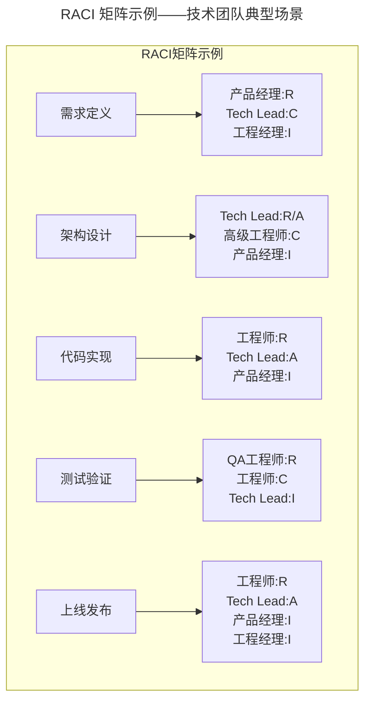
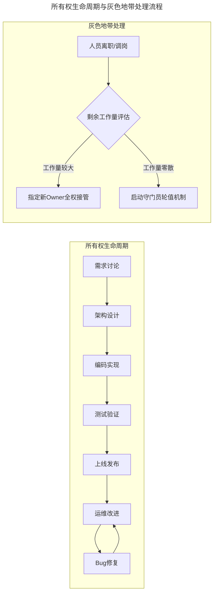
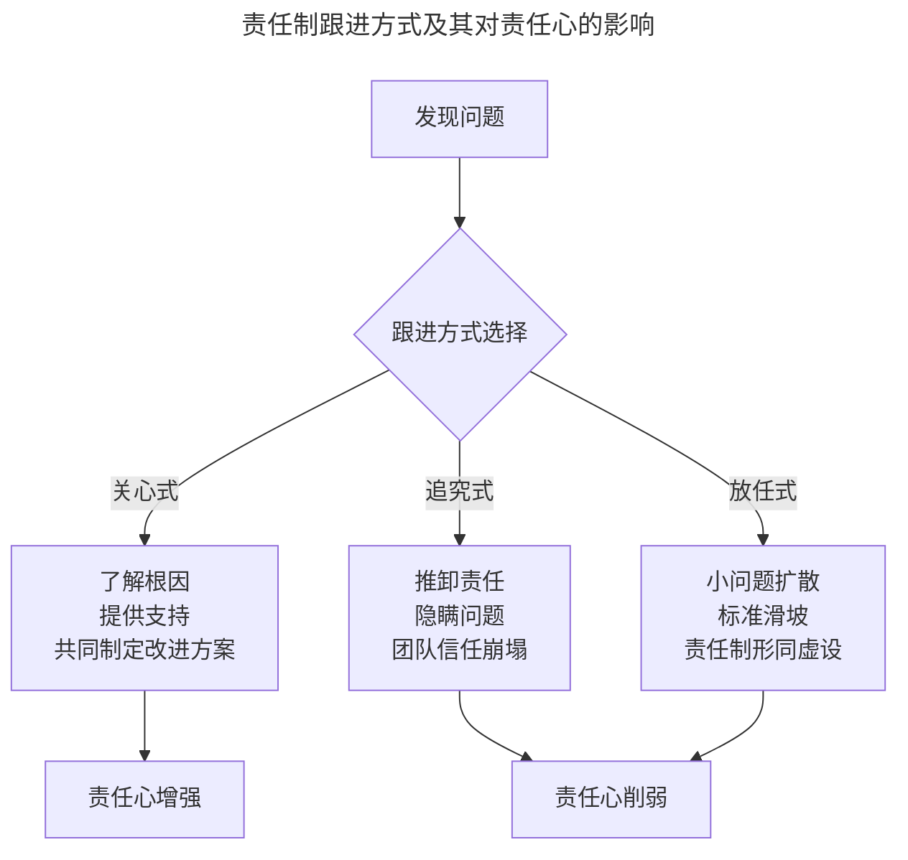

# 如何激发团队人员的责任心

> **适用范围**：技术团队管理者、工程经理（EM）、Tech Lead，以及希望系统性构建团队责任制的项目负责人。
>
> **更新摘要（v2 · 2026-08 更新）**：
> - 结构化升级为 6 节骨架（导言 / 核心方法论 / 关键流程 / 工具与实战 / 常见误区 / 进阶延展）
> - Mermaid 图补齐 `--- title ---` frontmatter 并补充图后解读
> - 将参考资料与趋势内容整合至"进阶延展"一节
> - 新增"常见误区"小节，将原文散落的失效做法集中归类

---

## 1. 导言

责任心是技术团队执行力的核心驱动力。在工程管理实践中，责任心的构建并非依赖个体自觉性的自然涌现，而是需要通过系统化的制度设计、有效的执行保障和深层的组织文化建设来协同激发。本文从 Accountability 与 Responsibility 的理论辨析出发，构建一套覆盖"制度设计—执行保障—文化塑造"三层架构的责任心激发框架，为技术管理者提供可落地的实践指南。

高绩效团队的特征是 Accountability 与 Responsibility 的高度统一：制度保障底线，文化追求上限。本文的目标是帮助管理者在制度先行的基础上，通过文化跟进实现责任心的内生增长。

---

## 2. 核心方法论

### Accountability 与 Responsibility 理论辨析

#### 概念界定

| 维度 | Accountability（问责责任） | Responsibility（道德责任） |
|------|---------------------------|---------------------------|
| 来源 | 外部约定、组织授权 | 内在驱动、价值认同 |
| 性质 | 契约性、可追溯 | 自发性、不可强制 |
| 衡量 | 可量化、可考核 | 难量化、行为观察 |
| 典型场景 | 项目交付、事故追责 | 主动补位、知识共享 |
| 激活方式 | 制度设计、权责对等 | 文化塑造、归属感建设 |

**Accountability** 是一种由外而内的责任机制，通过组织约定明确"谁对什么结果负责"，其核心特征是可追溯性和后果承担。在技术团队中，Accountability 体现为：工程师对代码质量负责、产品经理对需求准确性负责、Tech Lead 对架构决策负责。

**Responsibility** 是一种由内而外的责任意识，源于个体对集体利益和价值目标的认同，其核心特征是自发性和超越职责边界。在技术团队中，Responsibility 体现为：主动修复非自己模块的 Bug、帮助新人答疑、在事故复盘时坦诚暴露问题而非回避。

#### 两者关系

Accountability 是 Responsibility 的制度基础——没有清晰的问责边界，责任心就缺乏着力点；Responsibility 是 Accountability 的文化升华——仅有制度约束而无内在驱动，责任制将退化为合规博弈。高绩效团队的特征是两者的高度统一：制度保障底线，文化追求上限。

### 所有权模型（Ownership Model）

超越 RACI 的静态角色分配，所有权模型强调个体对端到端成果的完整拥有感。其核心原则：

1. **端到端所有权**：工程师不仅编写代码，还参与需求讨论、架构设计、测试上线及后续运维改进，形成完整的责任闭环
2. **决策授权**：在所有权范围内，赋予责任人充分的技术决策权，避免"有责无权"的困境
3. **连续性保障**：即使人员变动，所有权也需有序交接，而非陷入"无人认领"状态

### 归属感建设理论

归属感是 Responsibility 的深层土壤。缺乏归属感的员工将组织视为临时驿站，仅维持最低限度的合规行为；具备归属感的员工将组织视为价值共同体，自发产生超越职责的责任心。

心理契约（Psychological Contract）是员工与组织之间未成文的期望交换关系，其核心维度：

- **交易型契约**：薪酬、福利、职业发展等经济性交换
- **关系型契约**：信任、尊重、归属感等情感性交换
- **理念型契约**：共同使命、价值观认同等意义性交换

高归属感团队的特征是关系型与理念型契约的深度绑定，而非仅依赖交易型契约。

---

## 3. 关键流程

### RACI 矩阵：责任分配流程

RACI 矩阵是明确团队问责关系的经典工具，通过四种角色定义消除责任灰色地带：

- **R（Responsible）**：执行者，实际完成工作的人
- **A（Accountable）**：问责者，对结果负最终责任的人（有且仅有一个）
- **C（Consulted）**：咨询者，提供输入的人（双向沟通）
- **I（Informed）**：知会者，需要被告知结果的人（单向通知）

上图展示了从需求定义到上线发布的完整链路中各角色的 RACI 分配。关键要点是：每个任务有且仅有一个 Accountable，避免"多人负责即无人负责"的困境；咨询者与知会者的区分防止了信息在传递过程中被误判为决策权。

### 所有权生命周期与灰色地带处理

所有权生命周期覆盖从需求讨论到运维改进的完整闭环，Bug 修复与运维改进之间形成持续迭代。当发生人员变动时，依据剩余工作量评估选择"全权接管"或"守门员轮值"两条路径，确保责任不出现真空期。

### 跟进体系：管理者介入方式选择

管理者在执行过程中的跟进方式直接影响责任制的有效性：

三种跟进方式会导向截然不同的结果：关心式增强责任心，追究式与放任式均会削弱责任心。追究式导致团队隐瞒问题，放任式让标准持续滑坡，二者最终都使责任制形同虚设。

**关键原则**：

1. **关心而非追究**：用"遇到了什么困难"替代"为什么没做好"
2. **引导而非强加**：让对方自己认识到问题，而非将主观判断强加于人
3. **及时而非延后**：问题发现后尽早指出，避免小问题演变为大事故
4. **适度而非微观**：跟进进度而非干预细节，避免退化为微观管理

### 守门员机制（On-Call Rotation）

针对所有权交接后的灰色地带（零散 Bug、用户反馈、小改进），守门员机制是一种有效的补充设计：

- **轮值周期**：按周轮换，每人负责一周
- **职责范围**：处理与该项目相关的杂项工作
- **交接规范**：每周一进行书面交接，记录未完成事项
- **升级路径**：超出处理能力的问题，升级至 Tech Lead

---

## 4. 工具与实战

### 责任制落地检查清单

- [ ] 每个关键任务是否在 RACI 矩阵中有且仅有一个 Accountable
- [ ] 所有权范围是否清晰定义，是否存在无人认领的灰色地带
- [ ] 人员变动时是否有明确的所有权交接流程
- [ ] 是否有守门员机制处理零散遗留工作
- [ ] 承诺未兑现时是否有结构化的跟进和改进机制
- [ ] 管理者跟进方式是否为关心式而非追究式
- [ ] 是否有对主动承担额外责任者的正向激励
- [ ] 团队是否建立了心理安全环境
- [ ] 是否有定期的仪式感活动强化集体认同
- [ ] 管理者是否以身作则践行团队文化

### 责任制健康度评估指标

| 指标 | 衡量方式 | 健康阈值 |
|------|---------|---------|
| Bug 修复闭环率 | Bug 从发现到根因分析的比例 | > 80% |
| 项目按时交付率 | 项目在承诺时间内交付的比例 | > 70% |
| 主动补位行为频率 | 成员主动承担非职责范围工作的频次 | 持续增长 |
| 所有权交接成功率 | 人员变动后项目正常推进的比例 | > 90% |
| 心理安全指数 | 团队成员敢于表达不同意见的程度 | 定性评估正向 |

### 奖励机制设计

对主动承担超出职责范围工作的员工，需建立正向激励：

- **即时认可**：在团队会议中公开致谢
- **信用积累**：纳入绩效评估的加分项
- **物质激励**：适当的奖金或额外调休
- **成长机会**：优先分配高影响力项目

### 承诺机制与后果管理

有效的责任制始于事前的明确承诺：

- **公开承诺**：在团队范围内明确交付内容和时间节点
- **权责对等**：承诺的同时赋予相应的资源和决策权
- **预期对齐**：确保承诺方与相关方对"完成标准"达成一致

承诺未兑现时，需有明确的后果管理机制，但后果管理的目的不是惩罚，而是建立责任文化的信号：

| 情境 | 无效做法 | 有效做法 |
|------|---------|---------|
| Bug 引发事故 | 仅修复 Bug | 根因分析 + 预防机制 + Post-mortem |
| 项目延期 | 仅延后时间线 | 延期归因 + 资源重新评估 + 里程碑调整 |
| 代码质量不达标 | 默默重构 | 技术债登记 + Code Review 强化 + 改进计划 |
| 重复犯同类错误 | 口头提醒 | 系统化防护（lint rule / CI check） |

### 组织认同构建实践

组织认同（Organizational Identification）是个体将组织目标内化为个人目标的程度，其构建路径：

1. **意义感**：让每位成员理解自身工作与组织使命的关联
2. **安全感**：建立心理安全环境，允许坦诚表达和试错
3. **公平感**：确保资源分配、机会给予的透明与公正
4. **参与感**：让成员参与影响自身的决策过程

| 实践 | 具体做法 | 效果 |
|------|---------|------|
| 价值观具象化 | 将抽象价值观转化为可观察的行为标准 | 减少理解偏差 |
| 管理者以身作则 | 管理者率先践行文化规范 | 建立行为锚点 |
| 仪式感建设 | 定期团队仪式（Sprint Review / 团建 / 庆祝） | 强化集体记忆 |
| 透明沟通 | 定期 All-hands / 跳级沟通 / 信息共享 | 降低不确定性 |
| 真诚关怀 | 从员工角度考虑问题，认可好的行为 | 增强情感连接 |

---

## 5. 常见误区

### 误区一：仅有制度而无文化，责任制退化为合规博弈

仅靠 RACI 矩阵和问责机制，团队成员会将责任制定位为"避免被追责"的游戏，仅完成最低限度的工作而不主动补位。**纠正**：制度先行之后必须跟进归属感建设，用关系型与理念型契约激活 Responsibility。

### 误区二：追究式跟进导致团队隐瞒问题

事故发生后以"谁的责任"为第一追问，会导致团队成员隐瞒问题、推卸责任，团队信任崩塌。**纠正**：采用关心式跟进，用"遇到了什么困难"替代"为什么没做好"。

### 误区三：放任式管理让标准持续滑坡

认为"成年人不需要跟进"而完全放任，小问题逐步扩散，最终标准滑坡使责任制形同虚设。**纠正**：跟进结果而非过程，关注目标而非动作，保持适度介入。

### 误区四：有责无权，责任人缺乏执行资源

赋予责任但不赋予相应的决策权和资源，使责任人陷入"有责无权"的困境。**纠正**：权责对等原则——赋予权力的同时明确责任，承担责任的同时赋予资源。

### 误区五：灰色地带无人认领

人员变动后所有权交接不清，零散 Bug 和小改进成为无人认领的灰色地带。**纠正**：通过守门员机制将无人认领的工作纳入制度管理。

### 误区六：仅依赖物质激励构建归属感

仅靠薪酬和环境构建的归属感是脆弱的，员工在更好待遇出现时会立即离开。**纠正**：用远大目标和共同信念构建深层归属感——组织不是温情脉脉的家，而是有明确方向的航船，归属感的根基不是舒适，而是共同的目标和信念。

---

## 6. 进阶延展

### 最佳实践总结

1. **制度先行，文化跟进**：先通过 RACI 和所有权模型建立清晰的 Accountability 框架，再通过归属感建设激发 Responsibility
2. **权责对等原则**：赋予权力的同时明确责任，承担责任的同时赋予资源
3. **关心式跟进**：管理者跟进问题时始终以"帮助"而非"追责"为出发点
4. **避免微观管理陷阱**：跟进结果而非过程，关注目标而非动作
5. **灰色地带显性化**：通过守门员机制将无人认领的工作纳入制度管理
6. **正向激励优先**：对主动承担责任的行为给予即时、公开的认可
7. **目标驱动归属感**：用远大目标和共同信念构建深层归属感，而非仅依赖物质激励

### 发展趋势

1. **分布式责任制**：随着远程和混合办公模式的普及，责任制设计需适应异步协作场景，RACI 矩阵需嵌入数字化工具（如 Notion / Linear / Jira）实现实时可视化
2. **AI 辅助问责**：AI 工具可自动追踪任务状态、识别责任真空、预警交付风险，但需警惕算法问责对心理安全的侵蚀
3. **心理安全优先**：Google 的 Project Aristotle 研究持续验证心理安全是高绩效团队的第一要素，未来责任制设计将更注重安全感的构建
4. **OKR 与 RACI 融合**：目标管理（OKR）与责任矩阵（RACI）的深度整合，使责任对齐从任务级提升至目标级
5. **从问责到共责**：组织文化从"谁该负责"的个体问责转向"我们如何共同负责"的集体共责模式

### 参考资料与延伸阅读

1. RACI Matrix: Practical Guide for Project Managers — Project Management Institute (PMI)
2. Project Aristotle: Understanding Team Effectiveness — Google re:Work, 2015
3. The Speed of Trust — Stephen M.R. Covey, 2006
4. Drive: The Surprising Truth About What Motivates Us — Daniel H. Pink, 2009
5. An Integrative Model of Organizational Identification — Mael & Ashforth, Academy of Management Review, 1992
6. Psychological Safety and Learning Behavior in Work Teams — Amy Edmondson, Administrative Science Quarterly, 1999
7. Turn the Ship Around! — L. David Marquet, 2012
8. Owner's Manual for RACI — RACI Solutions
