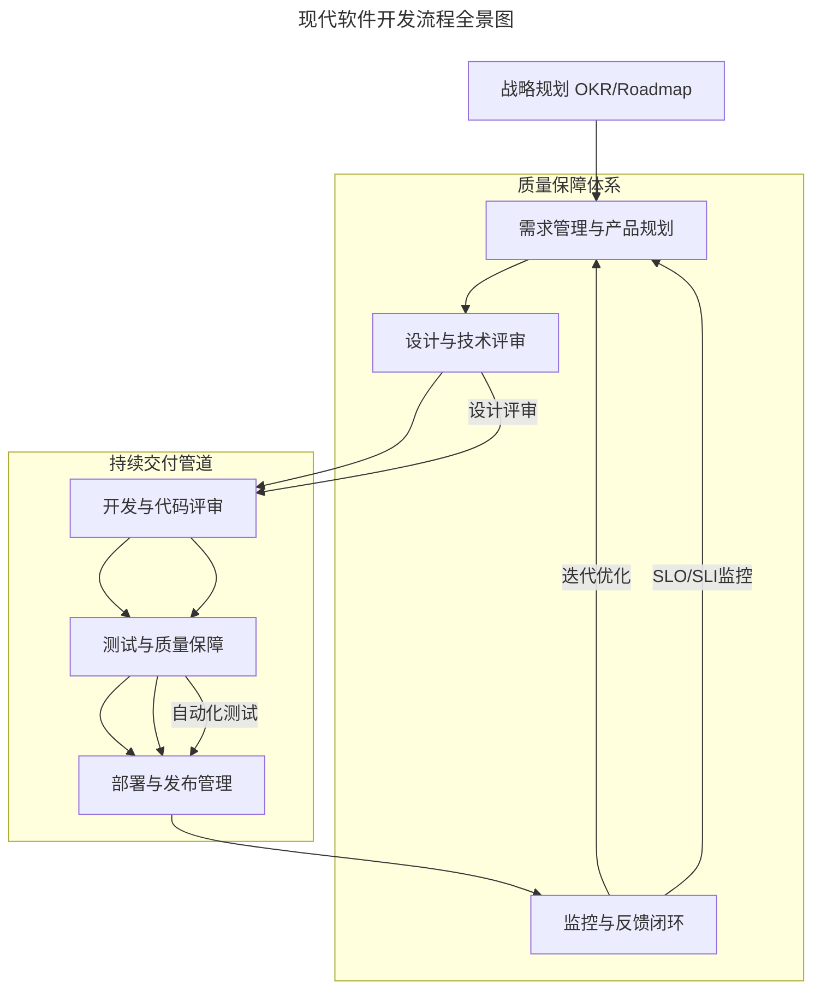
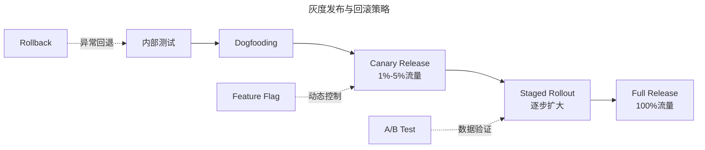

# 现代软件开发流程：从需求到交付的系统工程

> **适用范围**：技术管理者、工程经理、Tech Lead、PM 与 QA Lead，以及希望对标硅谷一流研发流程的工程团队。
>
> **更新摘要（v2 · 2026-08 更新）**：
> - 结构化升级为 6 节骨架（导言 / 核心方法论 / 关键流程 / 工具与实战 / 常见误区 / 进阶延展）
> - Mermaid 图补齐 `--- title ---` frontmatter 并补充图后解读
> - 将 2025 Platform Engineering / AI 趋势与参考资料整合至"进阶延展"一节
> - 新增"常见误区"小节，归纳流程落地中的典型反模式

---

## 1. 导言

软件开发流程是将商业目标转化为可交付产品的系统性工程框架。从硅谷互联网公司的实践到全球技术组织的演进，现代软件开发流程已从线性瀑布模型发展为以敏捷迭代为核心、以 DevOps 和 Platform Engineering 为支撑的持续交付体系。本文基于行业最佳实践，系统阐述从战略规划到运维反馈的完整软件交付生命周期。

现代流程的核心特征是"持续交付管道"与"质量保障体系"的双重闭环：开发、测试、部署形成自动化管道，设计评审、自动化测试、SLO/SLI 监控构成质量护栏，二者共同支撑从战略规划到运维反馈的迭代闭环。

---

## 2. 核心方法论

### OKR 体系与战略对齐

现代技术组织普遍采用 OKR（Objectives and Key Results）作为战略目标管理框架，实现自顶向下的目标对齐：

- **公司级 OKR**：定义年度/季度战略方向与核心指标
- **部门级 OKR**：将公司目标分解为部门可执行的关键结果
- **团队级 OKR**：确保每个工程团队的工作与组织战略保持一致

技术驱动在 OKR 体系中的体现：

1. **工程师声音上行机制**：通过 Survey、Tech Radar 等工具，确保基础设施、开发体验等工程诉求纳入战略规划
2. **技术自主决策权**：OKR 仅定义目标（What），技术实现路径（How）由工程团队自主决策，包括架构选型、服务拆分、技术栈演进等
3. **创新时间缓冲**：在 OKR 工期估算中预留 Hackathon、开源贡献、技术探索等非业务时间（如 Google 的 20% 时间机制）

### 测试金字塔模型

现代测试体系遵循测试金字塔原则：

```
        /  E2E Tests  \        ← 少量，高成本
       / Integration    \      ← 适度覆盖
      /  Unit Tests      \     ← 大量，低成本
     /____________________\
```

- **单元测试**：覆盖核心业务逻辑，目标覆盖率 80%+
- **集成测试**：验证服务间交互与 API 契约
- **端到端测试**：覆盖关键用户旅程
- **A/B 测试**：数据驱动的功能验证，需数据工程师参与实验设计

### 可观测性三支柱

现代可观测性（Observability）由三支柱构成：

- **Metrics**：SLI/SLO 驱动的指标监控（Latency、Traffic、Errors、Saturation）
- **Logs**：结构化日志，支持分布式追踪
- **Traces**：分布式链路追踪（OpenTelemetry 标准）

---

## 3. 关键流程

### 现代软件开发流程全景



上图展示了从战略规划到监控反馈的完整闭环。持续交付管道将开发、测试、部署串联为自动化流水线；质量保障体系通过设计评审前置、自动化测试把关、SLO/SLI 监控回溯，确保每个环节都有质量护栏。监控反馈闭环将运维数据回流至需求管理，驱动下一轮迭代优化。

### 项目拆分与团队编排

主项目确立后，需进行工作分解结构（WBS）和团队编排：

| 编排模式 | 优势 | 劣势 | 适用场景 |
|---------|------|------|---------|
| 模块责任制（每人/每小组负责一个子项目） | 责任清晰、Owner 感强、端到端交付 | 能力瓶颈风险、交叉学习不足、管理开销大 | 模块耦合度低、成员能力均衡 |
| 迭代协作制（全员逐模块推进） | 协作最大化、知识共享、代码评审覆盖广 | 责任模糊、能者多劳、新人锻炼不足 | 模块耦合度高、需快速交付 |

**实践建议**：采用混合模式——2-3 人小组负责一个模块，设置 Tech Lead 进行技术指导，大模块间通过 API 契约解耦。

### 设计与技术评审流程

设计文档（Design Doc / RFC）是技术决策的核心载体，现代实践要求：

- **协作平台**：Google Docs、Notion、Confluence 等支持多人实时协作与评论
- **评审层级**：
  - 团队内评审（工程师+PM）
  - 大组评审（含 Legal、Compliance、Security 等跨职能角色）
  - 全公司评审（涉及全局架构变更时）
- **文档内容**：实现方案、选型理由、权衡分析、支持/不支持特性、时间线、回滚策略

**技术评审要点**：

- 架构合理性与可扩展性
- 安全合规性（Privacy Review、Security Review）
- 数据模型与 API 设计
- 依赖关系与影响范围分析
- 容量规划与性能预期

### 开发与代码评审

- **分支策略**：基于 Trunk-Based Development 或 GitHub Flow，通过短生命周期分支进行开发
- **Pull Request 工作流**：每次 PR 包含变更摘要、测试说明、关联 Issue/Task
- **Feature Flag**：所有新功能隐藏在特性开关后，支持灰度发布与快速回滚
- **监控埋点**：所有实现必须包含监控、日志、告警代码

代码评审是质量保障的核心环节，详见本系列 Code Review 专题。

### 质量门禁

- PR 合并前必须通过 CI 流水线（Lint、Test、Security Scan）
- 关键代码需多人 Approve
- 代码覆盖率不得低于团队基线

### 灰度发布策略



灰度发布通过流量比例的阶梯式扩大控制错误影响范围。Feature Flag 提供动态开关能力，A/B Test 在 Staged Rollout 阶段提供数据验证，Rollback 路径确保任何阶段异常都能快速回退至内部测试状态。

- **Dogfooding**：先发布给内部员工使用验证
- **Canary Release**：小比例流量验证，结合监控指标决策
- **Staged Rollout**：按百分比逐步推送，每阶段验证核心指标
- **Dual Write**：关键链路重构时，新旧实现并行写入，比对结果一致后切换流量

### 发布管理要点

- 所有发布必须可回滚
- 发布窗口与 On-Call 排期对齐
- 发布后进行 Smoke Test 验证
- 移除 Feature Flag 与 A/B 测试代码

### 反馈闭环

- 告警 → On-Call 响应 → 事故处理 → Postmortem → 系统改进
- 项目复盘 → 经验沉淀 → 流程优化 → 文档更新
- Oncall Playbook 持续维护，确保已知问题有标准处理流程

---

## 4. 工具与实战

### 开发实践工具链

| 环节 | 工具/实践 | 作用 |
|------|----------|------|
| 分支策略 | Trunk-Based Development / GitHub Flow | 短生命周期分支，降低合并冲突 |
| PR 工作流 | Pull Request + 变更摘要模板 | 标准化变更说明，关联 Issue |
| 特性开关 | Feature Flag（LaunchDarkly / Unleash） | 灰度发布与快速回滚 |
| 监控埋点 | OpenTelemetry / Prometheus | 统一指标、日志、追踪 |

### 质量保障工具链

- **静态分析**：SonarQube、CodeClimate、Semgrep
- **安全扫描**：Snyk、Trivy、Dependabot
- **格式化**：Prettier、Black、gofmt
- **CI 门禁**：PR 合并前必须通过所有自动化检查

### 平台工程（Platform Engineering）工具

- **内部开发者平台（IDP）**：为工程团队提供自助式的基础设施与服务，降低认知负载
- **Golden Path**：定义标准化的项目创建、CI/CD、部署路径，减少决策疲劳
- **Backstage 等门户工具**：统一的服务目录、文档中心、模板市场

---

## 5. 常见误区

### 误区一：OKR 沦为微观任务清单

将 OKR 拆解为细粒度任务清单，剥夺工程团队的技术自主决策权。**纠正**：OKR 仅定义目标（What），技术实现路径（How）由工程团队自主决策。

### 误区二：测试金字塔倒置

过度依赖端到端测试而忽视单元测试，导致测试套件缓慢、脆弱且维护成本高昂。**纠正**：遵循测试金字塔——单元测试为基座（80%+），集成测试适度覆盖，端到端测试聚焦关键用户旅程。

### 误区三：发布不可回滚

未设计回滚路径的发布一旦出问题只能"前进式修复"，延长事故恢复时间。**纠正**：所有发布必须可回滚，数据库迁移必须编写 down migration 并在预发布环境验证。

### 误区四：Feature Flag 成技术债

Feature Flag 上线后未及时清理，累积为难以维护的技术债。**纠正**：发布后及时移除 Feature Flag 与 A/B 测试代码，纳入发布管理检查清单。

### 误区五：监控与开发割裂

开发阶段不埋点，上线后才发现缺少关键监控指标。**纠正**：所有实现必须包含监控、日志、告警代码，作为 PR 评审的强制项。

### 误区六：设计评审走过场

设计文档流于形式，评审会议变成"走过场"。**纠正**：设计文档必须包含选型理由、权衡分析、回滚策略，评审需包含跨职能角色（Legal、Compliance、Security）。

---

## 6. 进阶延展

### 2025 年 DevOps / Platform Engineering 新趋势

#### Platform Engineering 的崛起

2025 年，Platform Engineering 已成为 DevOps 演进的核心理念：

- **内部开发者平台（IDP）**：为工程团队提供自助式的基础设施与服务，降低认知负载
- **Golden Path**：定义标准化的项目创建、CI/CD、部署路径，减少决策疲劳
- **Backstage 等门户工具**：统一的服务目录、文档中心、模板市场

#### AI 驱动的开发流程变革

- **AI 辅助编码**：GitHub Copilot、Cursor 等工具深度集成开发流程，代码生成效率提升 30-50%
- **智能 CI/CD**：基于历史数据的测试选择、构建缓存优化、异常检测
- **AIOps**：基于 ML 的异常检测、根因分析、自动修复

#### 其他关键趋势

- **GitOps**：以 Git 仓库作为基础设施和应用定义的唯一事实来源（ArgoCD、Flux）
- **安全左移（Shift-Left Security）**：SBOM 生成、依赖漏洞扫描、IaC 安全检查嵌入 CI 管道
- **FinOps 集成**：云成本监控与优化纳入开发流程
- **Remote-First 协作**：异步优先的工作流设计，文档驱动决策

### 参考资料与延伸阅读

- DORA State of DevOps Report 2024
- Google SRE Book: https://sre.google/sre-book/table-of-contents/
- Team Topologies: Organizing Business and Technology Teams for Fast Flow of Change
- Platform Engineering: https://platformengineering.org/
- The Phoenix Project: A Novel about IT, DevOps, and Helping Your Business Win
- OpenTelemetry Documentation: https://opentelemetry.io/docs/
