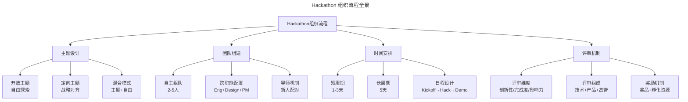
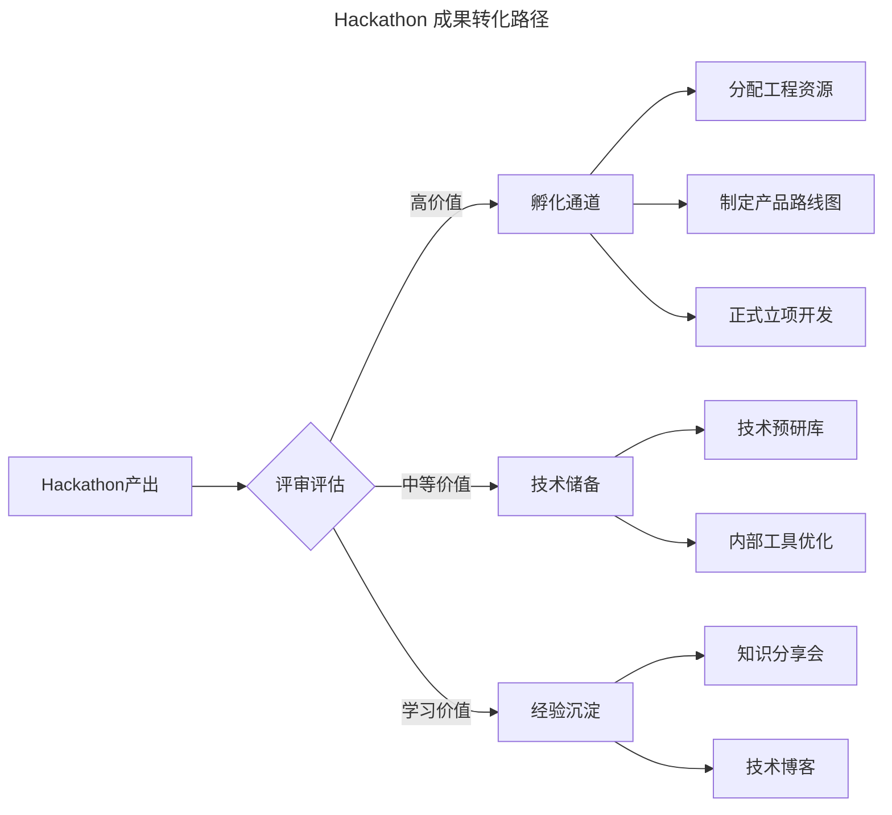

# Hackathon：创新驱动的工程实践框架

> **适用范围**：技术管理者、工程文化负责人、HR BP、PMO，以及希望系统性组织 Hackathon 活动的企业创新团队。
>
> **更新摘要（v2 · 2026-08 更新）**：
> - 结构化升级为 6 节骨架（导言 / 核心方法论 / 关键流程 / 工具与实战 / 常见误区 / 进阶延展）
> - Mermaid 图补齐 `--- title ---` frontmatter 并补充图后解读
> - 将 AI Hackathon、远程 Hackathon 等趋势与参考资料整合至"进阶延展"一节
> - 新增"常见误区"小节，归纳活动组织中的典型反模式

---

## 1. 导言

Hackathon（编程马拉松）是由 Hack 与 Marathon 合成的术语，指在限定时间内，跨职能团队围绕特定主题进行高强度创新开发的活动形式。该概念起源于 1999 年 Sun 公司 JavaOne 大会上 John Gage 发起的 Palm V 编程挑战，现已演变为全球技术组织推动创新、促进协作、孵化产品的系统性实践。

Hackathon 的核心价值在于：在常规工作节奏中创造结构化的创新空间，使参与者能够探索日常工作中无暇顾及的创意，通过端到端的原型开发验证想法的可行性，同时强化跨团队协作纽带。

---

## 2. 核心方法论

### Hackathon 的理论与实践价值

#### 创新孵化价值

- **创意验证**：将抽象想法快速转化为可演示原型，降低创新试错成本
- **产品原型**：大量成功产品起源于 Hackathon 项目（如 Facebook 的 Like 按钮、Chat 功能等）
- **技术探索**：为新技术栈、新架构模式提供低风险的实验环境

#### 组织建设价值

- **跨职能协作**：打破部门壁垒，工程师、设计师、产品经理、数据分析师在同一个项目中深度协作
- **知识传播**：与资深工程师结对编程，实现隐性知识的高效传递
- **团队凝聚力**：共同经历高强度协作建立的特殊纽带，显著提升团队信任度

#### 人才发展价值

- **能力拓展**：鼓励参与者选择超出舒适区的项目，拓展技术边界
- **领导力展现**：为非管理岗位的工程师提供项目组织与领导的机会
- **人才识别**：为组织发现高潜力人才提供非正式场景

### 主题设计模式

| 模式 | 描述 | 适用场景 |
|------|------|---------|
| 开放主题 | 不设限制，参与者自由选择项目 | 创新文化成熟、组织规模较小 |
| 定向主题 | 围绕公司战略方向设定主题（如 AI 应用、开发者体验等） | 战略聚焦期、特定技术领域突破 |
| 混合模式 | 设定若干推荐主题，同时允许自由项目 | 大多数企业的推荐做法 |

### 团队组建原则

- **规模**：2-5 人为最佳，确保每人有实质性贡献
- **跨职能配置**：理想团队包含至少 1 名工程师、1 名设计师、1 名产品或业务人员
- **新人融入**：为新员工分配导师或将其编入经验丰富的团队，降低参与门槛
- **自愿原则**：尊重自主组队意愿，避免强制分配

### 评审维度

**评审维度**：

- **创新性**（Innovation）：想法的新颖程度与独特性
- **完成度**（Completeness）：原型的功能完整性与可演示性
- **影响力**（Impact）：对业务、用户体验或工程效率的潜在价值
- **技术难度**（Technical Depth）：技术实现的复杂度与深度

**评审组成**：技术负责人、产品负责人、高管层联合评审，确保多视角评估。

---

## 3. 关键流程

### Hackathon 组织流程



上图展示了 Hackathon 组织的四大主线：主题设计（开放/定向/混合）、团队组建（规模/职能/导师）、时间安排（短周期/长周期/日程）、评审机制（维度/组成/奖励）。四条主线并行推进，缺一不可——任一环节薄弱都会显著降低活动质量。

### 时间安排与典型日程

| 模式 | 时长 | 特点 |
|------|------|------|
| 短周期 | 1-3 天 | 聚焦 MVP，节奏紧凑，适合定向主题 |
| 长周期 | 5 天 | 允许深度探索，产出更完整，适合开放主题 |

典型日程设计：

```
Day 1: Kickoff → 主题发布 → 团队组建 → 方案讨论
Day 2-3: 开发实现 → 中期Check-in（可选）
Day 4: 开发收尾 → Demo准备
Day 5: Demo Day → 评审 → 颁奖 → 复盘
```

### 成果转化机制

Hackathon 的真正价值在于成果的后续转化，而非活动本身：



成果转化按价值评估分三条路径：高价值项目进入孵化通道（分配资源 → 路线图 → 正式立项），中等价值项目进入技术储备（预研库 / 工具优化），学习价值项目沉淀为经验（分享会 / 技术博客）。关键是避免所有成果在 Demo Day 后即被遗忘。

### 转化路径

1. **直接产品化**：高价值项目进入正式产品开发流程，分配专属工程资源
2. **内部工具化**：提升工程效率的工具纳入内部开发者平台
3. **技术储备**：有前景但时机不成熟的项目进入技术预研库
4. **知识传播**：通过 Tech Talk、技术博客等形式分享经验

### 转化保障

- 设立 Hackathon 后续跟进机制，指定项目 Champion
- 为高潜力项目提供 2-4 周的"孵化期"工程时间
- 定期回顾 Hackathon 项目的转化状态

---

## 4. 工具与实战

### 原型开发原则

- **MVP 优先**：聚焦核心功能验证，避免过度工程
- **快速验证**：优先选择可快速搭建的技术方案，而非最优架构
- **可演示性**：确保 Demo Day 能够流畅展示核心价值
- **技术债容忍**：Hackathon 代码不要求生产级质量，但需记录技术债清单

### 协作模式

- **结对编程**：与资深工程师 Pair Programming 是高效的学习方式
  - 水平相近时：互有收益，深度讨论
  - 水平差距较大时：观察学习为主，辅助贡献为辅
- **并行开发**：前后端分离，接口先行，并行推进
- **快速集成**：使用内部工具与平台加速开发（API、SDK、组件库）

### 关键实践

- 敢于表达意见：即使面对资深工程师，真实想法的输出比沉默更有价值——错误的意见也能触发有价值的讨论
- 跨领域贡献：非代码贡献同样重要（设计、用户研究、数据分析、产品定义）
- 时间管理：合理分配开发与 Demo 准备时间

### 企业 Hackathon 最佳实践

#### 频率与节奏

- **年度大型 Hackathon**：1-2 次，全公司参与，5 天周期
- **季度小型 Hackathon**：部门或团队级别，1-3 天周期
- **避免过度频繁**：确保 Hackathon 不影响正常业务交付节奏

#### 环境保障

- Hackathon 期间禁止安排工作相关会议
- 提供必要的硬件设备（IoT 套件、硬件原型工具等）
- 确保基础设施支持（API 访问、测试环境、数据沙箱等）
- 安排 On-Call 轮值，确保线上系统稳定

#### 文化建设

- 强调参与而非竞争，避免过度强调奖项
- 鼓励跨团队、跨层级协作
- 高管参与 Demo Day，传递组织对创新的重视
- 重视非代码贡献，确保非工程师角色的参与感

---

## 5. 常见误区

### 误区一：过度强调奖项，活动沦为竞赛

将 Hackathon 定位为竞赛而非创新实验，参与者为获奖而选择保守项目，丧失探索精神。**纠正**：强调参与而非竞争，鼓励跨团队协作，重视非代码贡献。

### 误区二：Demo Day 后无人跟进

活动结束后没有后续跟进机制，所有成果被遗忘。**纠正**：设立 Hackathon 后续跟进机制，指定项目 Champion，为高潜力项目提供 2-4 周孵化期。

### 误区三：强制组队破坏自主性

管理者强制分配团队组合，破坏自愿原则与协作热情。**纠正**：尊重自主组队意愿，仅在新人融入时提供导师配对支持。

### 误区四：主题过于宽泛或过于狭窄

开放主题导致项目过于分散难以评估，定向主题过窄限制创意空间。**纠正**：采用混合模式——设定若干推荐主题，同时允许自由项目。

### 误区五：Hackathon 期间仍安排工作会议

参与者被日常工作打断，无法进入深度协作状态。**纠正**：Hackathon 期间禁止安排工作相关会议，安排 On-Call 轮值确保线上系统稳定。

### 误区六：要求生产级代码质量

以生产标准要求 Hackathon 代码，导致参与者过度投入工程质量而忽视原型验证。**纠正**：Hackathon 代码不要求生产级质量，但需记录技术债清单，孵化阶段再补齐质量。

---

## 6. 进阶延展

### 发展趋势

#### AI Hackathon 的兴起

2025 年，AI 应用成为 Hackathon 的核心主题：

- **LLM 应用开发**：基于 GPT、Claude 等大模型的应用原型
- **AI Agent 构建**：自主任务执行的智能体原型
- **RAG 系统**：企业知识库与检索增强生成
- **AI 安全与伦理**：负责任 AI 的探索与实践

#### 远程 Hackathon

- 异步协作工具支持分布式团队参与（Miro、FigJam、Gather.town）
- 云端开发环境降低参与门槛（GitHub Codespaces、Replit）
- 录制 Demo 视频替代现场演示

#### 与开源社区融合

- Hackathon 产出直接贡献开源项目
- 与开源社区联合举办 Hackathon 活动
- 内部工具开源化路径

### 参考资料与延伸阅读

- Hackathon: https://en.wikipedia.org/wiki/Hackathon
- Facebook Hackathon Culture: Building Products Through Rapid Prototyping
- Google 20% Time and Innovation Framework
- "Sprint" by Jake Knapp — Design Sprint 方法论
- MLH (Major League Hacking): https://mlh.io/
- Corporate Innovation through Hackathons: A Systematic Review
