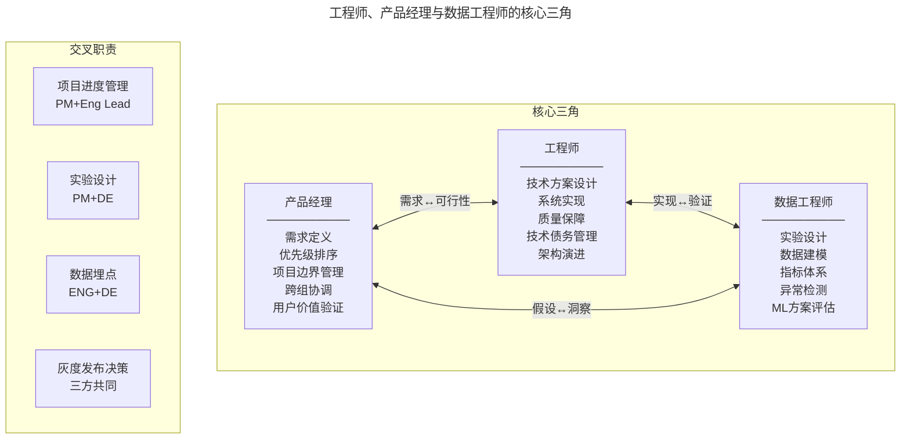
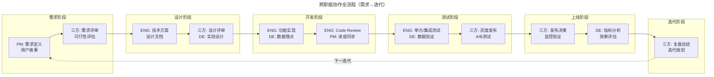
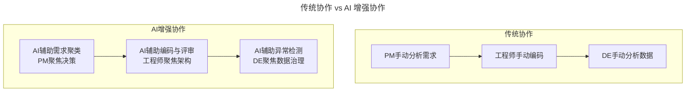

# 跨职能协作：工程师、产品经理与数据工程师的协同模型

> **适用范围**：技术管理者、产品经理（PM）、工程师（Software Engineer）、数据工程师（Data Engineer），以及涉及跨职能协作的项目负责人。
>
> **更新摘要（v2 · 2026-08 更新）**：
> - 结构化升级为 6 节骨架（导言 / 核心方法论 / 关键流程 / 工具与实战 / 常见误区 / 进阶延展）
> - Mermaid 图补齐 `--- title ---` frontmatter 并补充图后解读
> - 将 2025 AI 时代协作新范式与参考资料整合至"进阶延展"一节
> - 新增"常见误区"小节，将原文冲突类型集中归类为协作反模式

---

## 1. 导言

现代软件产品的交付依赖跨职能团队的高效协作。工程师（Software Engineer）、产品经理（Product Manager）与数据工程师（Data Engineer）构成技术产品交付的核心三角，三方各司其职又紧密耦合。本文系统阐述三方角色定义、协作流程、冲突解决策略，以及 AI 时代协作范式的演进。

软件产品开发本质上是信息密集型协作过程，单一角色无法覆盖从需求洞察到价值交付的完整链路。三方信息互补——工程师掌握技术可行性，产品经理掌握用户需求，数据工程师掌握数据洞察——跨职能输入显著提升决策质量。

---

## 2. 核心方法论

### 协作必要性

- **信息不对称**：工程师掌握技术可行性，产品经理掌握用户需求，数据工程师掌握数据洞察，三方信息互补
- **决策质量**：跨职能输入显著提升决策质量，减少单一视角偏差
- **交付效率**：明确的职责边界与协作接口减少返工与等待

### 协作模型演进

| 阶段 | 模式 | 特征 |
|------|------|------|
| 1.0 | 瀑布式交接 | 需求→设计→开发→测试，串行传递 |
| 2.0 | 敏捷协作 | 跨职能团队迭代交付，每日同步 |
| 3.0 | 数据驱动协作 | 数据洞察嵌入全流程，实时验证 |
| 4.0 | AI 增强协作 | AI 辅助决策，自动化协作流程 |

### 三方角色定义与职责边界

核心三角的三条边分别对应需求与可行性、实现与验证、假设与洞察的双向流动。下方交叉职责区显示了三方两两协作甚至三方共同决策的灰色地带——这些区域需要明确的协作接口而非简单分工。

#### 产品经理（PM）

**核心职责**：

- 需求定义与产品边界划定（Scope / Non-Scope）
- 优先级排序与需求过滤，保护工程师专注核心交付
- 跨组协调：处理组间依赖、职责重叠、资源竞争
- 项目管理：进度追踪、会议组织、利益相关者沟通
- 用户价值验证：确保产品决策以用户价值为导向

**对工程师的支持**：

- 挡掉低优先级需求，减少上下文切换
- 明确项目边界，避免范围蔓延
- 协调跨组依赖，降低集成风险

#### 工程师（Software Engineer）

**核心职责**：

- 技术方案设计与实现
- 工作量评估与工期估算
- 提供多方案对比（短期方案 vs 长期方案，含利弊分析）
- 团队能力评估，为人员分配提供技术视角输入
- 代码质量保障与架构演进

**对产品经理的支持**：

- 技术可行性评估，避免产品定义脱离技术现实
- 多方案对比帮助 PM 做出更优的产品决策
- 技术风险评估，提前识别潜在阻塞点

#### 数据工程师（Data Engineer）

**核心职责**：

- 实验设计：A/B 测试方案设计、样本量计算、指标选择
- 数据建模：构建数据管道与特征工程
- 指标体系：定义与监控核心业务指标
- 异常检测：通过数据异常发现系统问题
- ML 方案评估：识别可应用机器学习的业务场景

**对工程团队的支持**：

- 产品开发初期参与实验设计，确保数据驱动的决策基础
- 定义需监控的历史指标，防止新功能对现有业务产生负面影响
- 产品发布后调整监控与预警系统，确保异常可及时发现
- 通过数据异常定位线上 Bug，补充工程调试手段

---

## 3. 关键流程

### 跨职能协作流程

协作流程覆盖需求、设计、开发、测试、上线、迭代六个阶段，形成闭环。每个阶段都有明确的主导方与参与方：需求阶段 PM 主导，设计阶段 ENG 主导，开发阶段 ENG 与 DE 协作，测试与上线阶段三方共同决策。迭代阶段的复盘结论回流至下一轮需求定义，实现持续优化。

### 各阶段要点

#### 需求阶段

- PM 主导需求定义，输出用户故事与验收标准
- 工程师评估技术可行性，识别技术风险
- 数据工程师评估数据需求，确定是否需要 A/B 测试

#### 设计阶段

- 工程师主导技术方案设计，输出 Design Doc
- PM 参与评审，确保方案满足产品需求
- 数据工程师设计实验方案，定义数据埋点需求

#### 开发阶段

- 工程师实现功能代码，数据工程师配合数据埋点
- PM 同步进度，管理需求变更
- Code Review 确保代码质量

#### 测试阶段

- 工程师执行单元测试与集成测试
- 数据工程师验证数据管道与指标准确性
- 三方共同决策灰度发布策略

#### 上线阶段

- 三方共同评估发布决策
- 数据工程师监控核心指标变化
- A/B 测试结果验证产品假设

#### 迭代阶段

- 三方复盘总结，沉淀经验
- 基于数据洞察规划下一迭代

---

## 4. 工具与实战

### 冲突解决策略

| 冲突类型 | 典型表现 | 解决策略 |
|---------|---------|---------|
| 需求范围冲突 | PM 持续加需求 vs 工程师要求控制范围 | 建立需求变更流程，评估影响后决策 |
| 优先级冲突 | 多方需求竞争优先级 | 使用 RICE 等框架量化排序，数据驱动决策 |
| 技术债务冲突 | 工程师要求重构 vs PM 要求新功能 | 预留固定比例（如 20%）工程时间处理技术债 |
| 数据验证冲突 | PM 急于发布 vs 数据工程师要求更多验证 | 定义最小验证标准，灰度发布降低风险 |
| 跨组依赖冲突 | 两组工作重叠或互相等待 | PM 间协调，技术 Lead 间对齐接口契约 |

### 冲突解决原则

1. **数据优先**：用数据而非观点驱动决策
2. **用户价值导向**：以用户价值为最高评判标准
3. **透明沟通**：冲突在明处解决，避免暗处发酵
4. **权责清晰**：每个决策领域有明确的决策权归属

---

## 5. 常见误区

### 误区一：PM 持续加需求，范围蔓延失控

PM 在开发阶段持续追加需求，工程师被迫加班或降低质量。**纠正**：建立需求变更流程，评估影响后决策，明确 Non-Scope 边界。

### 误区二：工程师闭门造车，忽视 PM 与 DE 输入

工程师在技术方案设计中不邀请 PM 与 DE 参与，导致方案偏离产品需求或缺乏数据埋点。**纠正**：设计阶段三方共同评审，DE 提前设计实验方案。

### 误区三：数据验证让位于发布压力

PM 急于发布，跳过 A/B 测试或缩短验证周期。**纠正**：定义最小验证标准，用灰度发布降低风险，数据驱动发布决策。

### 误区四：技术债持续累积

PM 始终优先新功能，工程师无暇重构，技术债雪球越滚越大。**纠正**：预留固定比例（如 20%）工程时间处理技术债。

### 误区五：跨组依赖未对齐

两组工作重叠或互相等待，集成阶段才发现接口不兼容。**纠正**：PM 间协调，技术 Lead 间提前对齐接口契约。

### 误区六：冲突在暗处发酵

分歧不在公开场合解决，通过私下抱怨或消极怠工表达。**纠正**：冲突在明处解决，透明沟通，每个决策领域有明确的决策权归属。

---

## 6. 进阶延展

### 2025 年 AI 时代的协作新范式

#### AI 对角色边界的重塑

- **PM + AI**：AI 辅助需求分析、用户反馈聚类、竞品洞察生成，PM 从信息收集者转向决策者
- **工程师 + AI**：AI 辅助编码、代码评审、架构建议，工程师从实现者转向架构设计者
- **数据工程师 + AI**：AutoML 降低建模门槛，数据工程师从模型构建者转向数据质量守护者

#### 新增协作角色

- **AI/ML Engineer**：模型训练、部署与迭代，成为核心三角的第四维度
- **Prompt Engineer**：在 LLM 应用开发中，提示词设计成为跨职能协作的新焦点

#### 协作流程的 AI 增强

AI 增强协作并非取代人工，而是将三方从重复性劳动中释放：PM 从手动需求分析转向决策，工程师从手动编码转向架构设计，DE 从手动数据分析转向数据治理。每个角色的价值层级都向上跃迁。

#### 关键趋势

- **AI Native 产品开发**：产品定义从功能驱动转向能力驱动，协作模式需适配
- **自动化实验平台**：A/B 测试从手动设计转向自动化实验引擎
- **实时数据协作**：流式数据处理使数据反馈从 T+1 缩短至近实时
- **跨职能 AI 素养**：三方角色均需具备 AI 应用的基本认知与协作能力

### 参考资料与延伸阅读

- Inspired: How to Create Tech Products Customers Love — Marty Cagan
- The Lean Startup — Eric Ries
- HBR: The New Product Development Game
- Google PAIR: People + AI Guidebook: https://pair.withgoogle.com/
- Team Topologies: Organizing Business and Technology Teams for Fast Flow of Change
- Crossing the Chasm: Marketing and Selling High-Tech Products to Mainstream Customers
