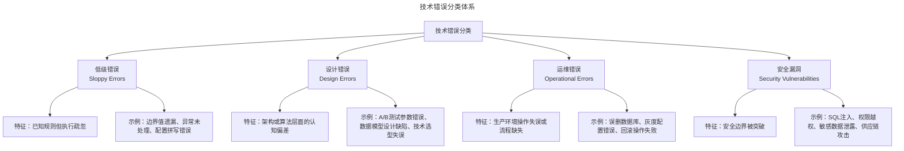
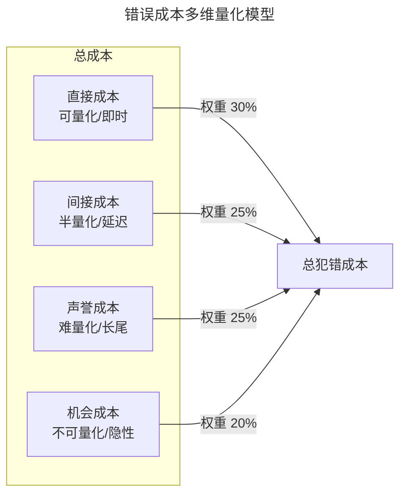
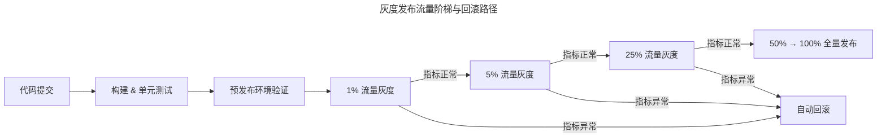

# 技术人的犯错成本

> **适用范围**：工程师、SRE、Tech Lead、工程经理，以及负责事故响应与质量保障的工程效能团队。
>
> **更新摘要（v2 · 2026-08 更新）**：
> - 结构化升级为 6 节骨架（导言 / 核心方法论 / 关键流程 / 工具与实战 / 常见误区 / 进阶延展）
> - Mermaid 图补齐 `--- title ---` frontmatter 并补充图后解读
> - 将 Blameless Postmortem、错误预算等组织学习文化与参考资料整合至"进阶延展"一节
> - 新增"常见误区"小节，归纳错误预防与恢复中的典型反模式

---

## 1. 导言

在软件工程实践中，错误（Error）与故障（Failure）是不可避免的系统性现象。根据 NASA 软件保证技术中心的研究，行业平均缺陷密度为每千行代码 15–50 个缺陷；而根据 Stripe 2018 年开发者效率报告，开发者约 42% 的时间用于修复技术债务和处理代码质量问题。对于技术从业者而言，理解错误的分类体系、量化其成本结构、建立预防与恢复机制，是工程成熟度的核心指标。

本文从技术错误的分类模型出发，构建错误成本的量化分析框架，并系统阐述预防机制、恢复策略与组织学习文化，旨在帮助技术人与管理者建立对犯错成本的系统性认知。

---

## 2. 核心方法论

### 技术错误的分类体系

技术错误可按其发生阶段与影响维度划分为以下四类：



四类错误分别对应编码、设计、运维、安全四个维度。低级错误源于执行疏忽，设计错误源于认知偏差，运维错误源于操作失误，安全漏洞源于边界突破。分类的价值在于指导资源投入——不同类型的错误需要不同的预防手段。

### 各类错误的特征分析

| 错误类型 | 发现阶段 | 可预防性 | 学习价值 | 复现概率 |
|---------|---------|---------|---------|---------|
| 低级错误 | 编码/测试 | 高 | 低 | 高（无流程约束时） |
| 设计错误 | 设计/验证 | 中 | 高 | 低（同类问题） |
| 运维错误 | 部署/运维 | 中 | 中 | 中 |
| 安全漏洞 | 全生命周期 | 中 | 高 | 低（同类漏洞） |

**关键洞察**：低级错误的复现概率最高但学习价值最低，设计错误的学习价值最高但预防难度中等。资源投入应优先覆盖高复现、低学习价值的错误类型，通过自动化手段消除其发生条件。

### 错误成本量化模型

技术错误的成本并非仅限于直接经济损失，而是一个多维度的成本结构。

#### 直接成本（Direct Cost）

直接成本是错误发生后立即产生的可量化损失：

- **人力成本**：排查、修复、验证所需的人天投入。根据 Google SRE 实践，一次 P1 事故平均需要 5–10 人参与排查
- **基础设施成本**：资源浪费、额外计算开销。例如 A/B 测试参数错误导致错误的产品决策，可能浪费数月研发投入
- **数据损失**：数据不可恢复的永久性丢失。典型案例：游戏公司工程师误删用户数据库且备份失效，直接导致公司倒闭

#### 间接成本（Indirect Cost）

间接成本是错误引发的连锁反应：

- **信任损耗**：技术信用的不可逆下降。在公开场合给出不确定的技术答案且未标注置信度，会系统性降低个人技术可信度
- **协作摩擦**：团队间信任关系受损。例如提前泄露未公开的人事变动，破坏管理层流程与团队信任
- **流程成本**：为防止同类错误引入的额外审批、检查流程，降低组织运转效率

#### 声誉成本（Reputational Cost）

声誉成本具有放大效应和长尾效应：

- **个人声誉**：公开言论被误读为公司立场。具备行业影响力的技术人，其公开表达可能被默认代表公司观点，不当表述可能引发公关危机
- **产品声誉**：用户信任度下降。根据 Ponemon Institute 2024 年报告，数据泄露后客户流失率平均上升 7%
- **公司品牌**：股价波动、媒体负面报道。2024 年 CrowdStrike 全局蓝屏事件导致股价单日下跌 11%，影响超过 850 万台设备

#### 机会成本（Opportunity Cost）

机会成本是因错误而丧失的潜在收益：

- **战略机会窗口**：因技术失误导致产品方向错误，错过市场时机
- **人才流失**：频繁故障导致优秀工程师离职
- **技术债务累积**：修复错误占用的资源本可用于创新

#### 成本量化公式



四类成本按权重累加构成总犯错成本。直接成本可即时量化（权重 30%），间接成本半量化且延迟显现（25%），声誉成本难量化且具长尾效应（25%），机会成本不可量化且隐性（20%）。对于金融/支付类业务，声誉成本权重应显著上调。

**估算公式**：

$$C_{total} = \alpha \cdot C_{direct} + \beta \cdot C_{indirect} + \gamma \cdot C_{reputation} + \delta \cdot C_{opportunity}$$

其中 $\alpha + \beta + \gamma + \delta = 1$，各权重因组织规模与业务类型而异。对于金融/支付类业务，$\gamma$（声誉成本权重）显著高于其他类型。

---

## 3. 关键流程

### 错误预防机制

#### 代码评审（Code Review）

代码评审是捕获低级错误和设计缺陷的第一道防线：

- **评审覆盖率**：目标 100% 代码变更经过评审
- **评审深度**：关注逻辑正确性、边界条件、异常处理，而非仅代码风格
- **工具辅助**：结合静态分析工具（SonarQube、CodeQL）自动检测常见缺陷模式
- **评审文化**：建立建设性反馈文化，避免评审沦为形式主义

#### 自动化测试（Automated Testing）

测试金字塔模型决定了测试策略的资源分配：

| 测试层级 | 覆盖目标 | 执行速度 | 维护成本 | 缺陷检出率 |
|---------|---------|---------|---------|-----------|
| 单元测试 | 函数/模块逻辑 | 毫秒级 | 低 | 高（逻辑错误） |
| 集成测试 | 模块交互 | 秒级 | 中 | 中（接口错误） |
| 端到端测试 | 用户场景 | 分钟级 | 高 | 低（场景覆盖有限） |
| 混沌测试 | 系统韧性 | 小时级 | 高 | 高（系统性故障） |

**关键指标**：测试覆盖率应作为必要非充分条件，目标核心模块行覆盖率 ≥ 80%，分支覆盖率 ≥ 70%。

#### 灰度发布（Canary Deployment / Progressive Delivery）

灰度发布通过逐步扩大流量比例来控制错误的影响范围：



灰度发布按 1% → 5% → 25% → 50% → 100% 的流量阶梯推进，任一阶段指标异常都触发自动回滚。这种渐进式发布将错误影响范围控制在最小爆炸半径内。

**核心要素**：
- 自动化指标监控（错误率、延迟 P99、CPU/内存）
- 预设回滚阈值与自动触发机制
- 灰度持续时间足够捕获长尾效应（建议每阶段 ≥ 15 分钟）

#### 故障注入（Fault Injection / Chaos Engineering）

通过主动注入故障验证系统韧性：

- **工具生态**：Chaos Monkey（实例终止）、LitmusChaos（Kubernetes）、Toxiproxy（网络故障模拟）
- **注入类型**：网络延迟/丢包、实例终止、磁盘满、依赖服务降级
- **实施原则**：在受控环境中进行，从最小爆炸半径开始，逐步扩大范围
- **度量标准**：MTTD（平均检测时间）、MTTR（平均恢复时间）

### 错误恢复策略

#### 回滚（Rollback）

回滚是最直接的恢复手段，其有效性依赖于部署架构：

| 回滚策略 | 适用场景 | 恢复时间 | 数据风险 |
|---------|---------|---------|---------|
| 代码回滚 | 逻辑错误 | 分钟级 | 低 |
| 数据库迁移回滚 | Schema 变更 | 分钟–小时级 | 中（需兼容性迁移） |
| 特性开关关闭 | 功能缺陷 | 秒级 | 低 |
| 蓝绿部署切换 | 全量回滚 | 秒级 | 低 |

**最佳实践**：每次部署前确保回滚路径可用，数据库迁移必须编写 down migration 并在预发布环境验证。

#### 降级（Degradation）

当回滚不可行或成本过高时，通过降级保障核心功能：

- **功能降级**：关闭非核心功能，保障核心链路。例如电商大促时关闭推荐系统，保障下单链路
- **数据降级**：返回缓存数据或默认值，牺牲实时性保障可用性
- **流量降级**：限流/熔断，防止级联故障。Sentinel、Resilience4j 等框架提供开箱即用的熔断能力

#### 补偿（Compensation）

对于已产生业务影响的错误，需要补偿机制：

- **技术补偿**：数据修复脚本、批量修正任务
- **业务补偿**：用户通知、费用退还、服务延期
- **流程补偿**：事后审计、合规报告、监管沟通

---

## 4. 工具与实战

### 个人层面

1. **技术信用管理**：对不确定的技术判断标注置信度，使用"我认为""需验证"等限定词，维护长期可信度
2. **公开表达自律**：区分个人观点与公司立场，涉及公司业务、合作伙伴、未公开信息时遵循公司公关流程
3. **Checklist 驱动**：对高频操作建立个人 Checklist，减少低级错误的复现
4. **变更敬畏**：涉及交易、支付、数据删除等高风险操作时，执行双人确认（Two-Person Rule）

### 团队层面

1. **Code Review 强制执行**：所有生产代码变更必须经过至少一位同行评审
2. **CI/CD 质量门禁**：测试覆盖率、静态分析、安全扫描作为合并前置条件
3. **灰度发布标准化**：建立统一的灰度发布流程与自动回滚机制
4. **On-Call 轮值与 Runbook**：确保每个服务有值班工程师与标准化操作手册

### 组织层面

1. **Blameless 文化制度化**：将无责复盘纳入事故处理标准流程
2. **错误预算机制**：基于 SLO 设定错误预算，平衡创新速度与系统稳定性
3. **混沌工程常态化**：定期执行故障注入演练，验证系统韧性
4. **知识库建设**：将复盘文档、常见错误模式、最佳实践沉淀为可检索的组织知识资产

---

## 5. 常见误区

### 误区一：仅修复 Bug，不做根因分析

事故发生后仅修复表面问题而无根因分析，同类错误反复发生。**纠正**：根因分析 + 预防机制 + Post-mortem，每次事故产出可执行的改进行动项。

### 误区二：仅依赖测试，忽视代码评审

认为自动化测试覆盖率高即可省略人工评审。**纠正**：Review 与测试互补——Review 擅长发现逻辑错误、架构问题、安全漏洞；测试擅长发现功能回归。

### 误区三：灰度发布缺少自动回滚

灰度发布仅扩大流量而不设置回滚阈值，异常发生后需人工介入。**纠正**：预设回滚阈值与自动触发机制，灰度持续时间足够捕获长尾效应。

### 误区四：回滚路径未经验证

部署前未验证回滚路径，事故发生时才发现回滚不可用。**纠正**：每次部署前确保回滚路径可用，数据库迁移必须编写 down migration 并在预发布环境验证。

### 误区五：技术信用透支

在公开场合给出不确定的技术答案且未标注置信度，系统性降低个人技术可信度。**纠正**：对不确定的技术判断标注置信度，使用"我认为""需验证"等限定词。

### 误区六：事故复盘沦为追责会议

以"谁的责任"为第一追问，导致团队隐瞒问题。**纠正**：Blameless Postmortem——对事不对人，假设当事人在当时情境下做出了合理决策，聚焦系统改进。

---

## 6. 进阶延展

### Blameless Postmortem（无责复盘）

Google SRE 实践中的核心文化机制，其原则为：

1. **对事不对人**：关注系统缺陷而非个人过失
2. **假设善意**：当事人在当时情境下做出了合理决策
3. **聚焦改进**：每个错误必须产出可执行的改进行动项
4. **公开透明**：复盘文档对全公司可见，促进跨团队学习

### Postmortem 文档模板

```
# 事故复盘：[标题]

## 基本信息
- 事故时间：[开始时间] - [结束时间]
- 影响范围：[受影响用户数/服务]
- 严重等级：[P1-P4]
- 值班工程师：[姓名]

## 时间线
| 时间 | 事件 |
|------|------|
| HH:MM | 告警触发 |
| HH:MM | 确认影响范围 |
| HH:MM | 执行回滚/降级 |
| HH:MM | 服务恢复 |

## 根因分析
[详细描述根本原因，使用 5-Why 方法]

## 影响评估
- 直接损失：[量化数据]
- 用户影响：[量化数据]

## 改进行动项
| 行动项 | 负责人 | 截止日期 | 优先级 |
|--------|--------|---------|--------|
| [行动1] | [姓名] | [日期] | P1 |

## 经验教训
[可复用的知识提炼]
```

### 错误预算（Error Budget）

错误预算将可靠性目标与发布速度建立量化平衡：

$$Error\ Budget = 1 - SLO\ Target$$

例如 SLO 目标为 99.9% 可用性，则月度错误预算为：

$$30 \times 24 \times 60 \times 0.001 = 43.2\ \text{分钟}$$

当错误预算耗尽时，团队应暂停新功能发布，优先投入可靠性改进。

### 参考资料与延伸阅读

1. Beyer B, Jones C, Petoff J, et al. *Site Reliability Engineering: How Google Runs Production Systems*. O'Reilly, 2016.
2. Beyer B, Jones C, Petoff J, et al. *The Site Reliability Workbook: Practical Ways to Implement SRE*. O'Reilly, 2018.
3. Ponemon Institute. *Cost of a Data Breach Report 2024*. IBM Security, 2024.
4. Lorenz D, Ravid A. *Error Classification for Software Engineering*. IEEE Transactions on Software Engineering, 2023.
5. Stripe. *The Developer Coefficient 2018*. Stripe Press, 2018.
6. Basili V R, Perricone B T. *Software Errors and Software Reliability: An Empirical Investigation*. ACM TOSEM, 1984.
7. Nygard M T. *Release It!: Design and Deploy Production-Ready Software*. 2nd Edition, Pragmatic Bookshelf, 2018.
8. Casey Rosenthal, Nora Jones. *Chaos Engineering: System Resiliency in Practice*. O'Reilly, 2020.
