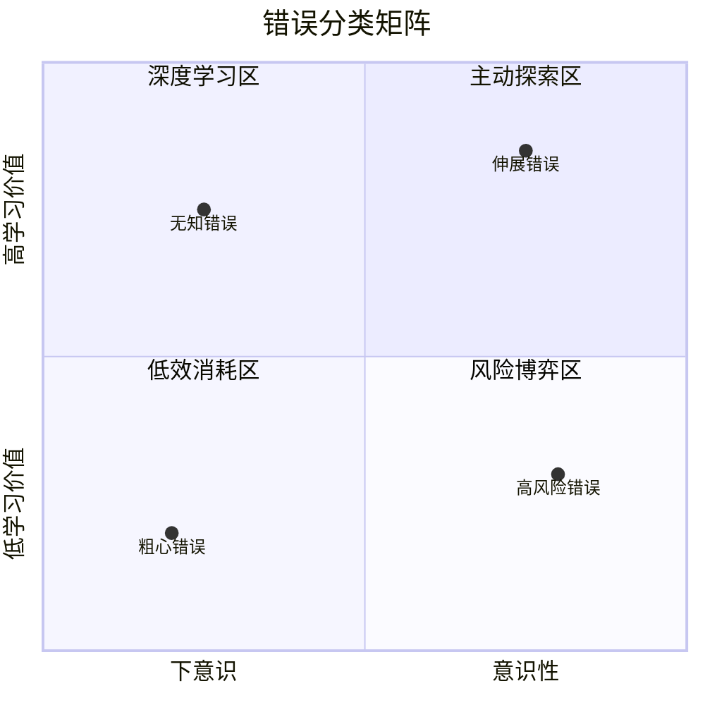
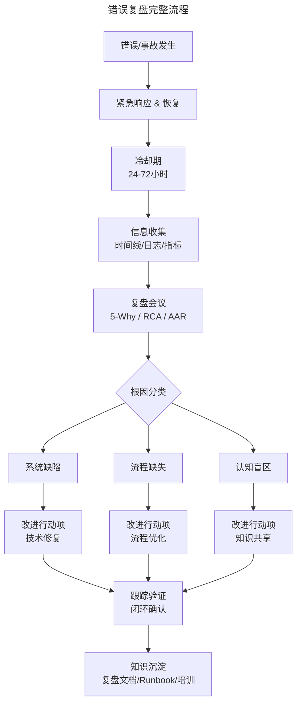
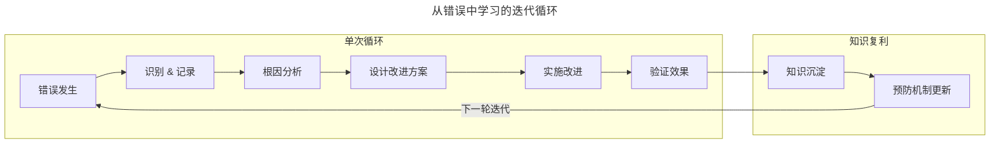
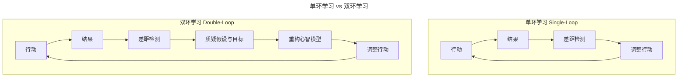

# 如何从错误中成长？

> **适用范围**：工程师、Tech Lead、工程经理、SRE，以及希望在团队中建立学习型文化的组织发展负责人。
>
> **更新摘要（v2 · 2026-08 更新）**：
> - 结构化升级为 6 节骨架（导言 / 核心方法论 / 关键流程 / 工具与实战 / 常见误区 / 进阶延展）
> - Mermaid 图补齐 `--- title ---` frontmatter 并补充图后解读
> - 将心理韧性、双环学习、学习型组织等组织文化与参考资料整合至"进阶延展"一节
> - 新增"常见误区"小节，归纳错误认知与复盘中的典型反模式

---

## 1. 导言

错误并非单纯的负面事件，而是组织与个体能力演进的关键信息输入。斯坦福大学 Carol Dweck 的成长型思维（Growth Mindset）研究表明，对错误的认知框架决定了学习效果的上限；纳西姆·塔勒布的反脆弱（Antifragile）理论进一步指出，系统不仅应具备抵御冲击的能力，更应从冲击中获取结构性增强。

本文从认知理论、复盘方法论、实践框架、心理韧性与组织文化五个维度，构建技术人从错误中成长的系统性路径，将"犯错—复盘—改进"从经验性直觉提升为可重复的工程化实践。

---

## 2. 核心方法论

### Carol Dweck 的思维理论

斯坦福大学心理学教授 Carol Dweck 于 2006 年提出思维模式二分法，其核心区别在于对错误与失败的归因方式：

| 维度 | 固定型思维（Fixed Mindset） | 成长型思维（Growth Mindset） |
|------|---------------------------|----------------------------|
| 能力观 | 能力是先天固定的 | 能力可通过努力与策略发展 |
| 对错误的态度 | 错误是能力不足的证据 | 错误是学习与改进的信号 |
| 归因方式 | 向内归因（我不行） | 向策略归因（方法需优化） |
| 行为倾向 | 回避挑战、害怕暴露不足 | 主动挑战、从反馈中迭代 |
| 长期影响 | 能力天花板固化 | 能力持续增长 |

### 错误的认知重构

技术人需要完成三层认知重构：

1. **去污名化**：错误 ≠ 失败，而是信息反馈。在复杂系统中，零错误意味着零探索
2. **价值识别**：区分有学习价值的错误与无学习价值的错误，前者是成长的必要成本
3. **系统归因**：将错误归因于系统缺陷（流程、工具、认知盲区），而非个人能力不足

### 错误的四类模型

基于认知维度（意识性 vs 下意识）与学习价值（高 vs 低），错误可划分为四类：



四象限矩阵将错误按意识性与学习价值分为四类。伸展错误位于右上角（高意识性、高学习价值），是能力跃迁的必要成本；粗心错误位于左下角（下意识、低学习价值），应通过流程与自动化消除。区分错误类型是制定差异化学习策略的前提。

**第一类：伸展错误（Stretch Mistakes）**

主动挑战能力边界时产生的错误。特征：意识性高、学习价值高。典型场景包括：
- 创业团队探索全新产品方向，无既有经验可借鉴
- 工程师首次承担架构设计职责，在未知领域做出决策
- 组织引入新技术栈，团队在迁移过程中遭遇预期外问题

此类错误是能力跃迁的必要成本，经历一次后同类问题通常不会复现。

**第二类：无知错误（Aha-moment Mistakes）**

因认知盲区导致的错误，发现根因时产生"原来如此"的顿悟。特征：下意识、学习价值高。典型场景包括：
- 初级工程师未处理异常分支或边界值
- 未阅读最新产品文档导致实现与需求不一致
- 对系统间交互的隐含假设未做验证

此类错误一旦识别，认知盲区即被消除，同类错误不会复现。但需警惕在不同领域犯同类型错误。

**第三类：粗心错误（Sloppy Mistakes）**

已知规则但因疏忽导致的错误。特征：下意识、学习价值低。典型场景包括：
- 配置文件拼写错误
- 已知 Checklist 项遗漏
- 重复出现的低级编码错误

此类错误复现概率高、学习价值低，应通过流程与自动化手段消除，而非依赖个人注意力。

**第四类：高风险错误（High-stakes Mistakes）**

在信息不充分条件下做出高风险决策导致的错误。特征：意识性高、学习价值低。典型场景包括：
- 技术选型在多个候选方案间抉择，事后证明选择错误
- 架构决策在有限信息下做出，无法预见的约束条件导致方案失败
- 创新方向押注错误

此类错误即使经历一次，下次面对类似情境仍可能犯错，因为关键信息在决策时不可获得。

**策略矩阵**：

| 错误类型 | 应对策略 | 资源投入方向 |
|---------|---------|------------|
| 伸展错误 | 鼓励探索，提供安全网 | 培训体系、导师机制 |
| 无知错误 | 消除认知盲区 | 文档体系、信息透明 |
| 粗心错误 | 流程与自动化兜底 | Checklist、CI/CD 门禁 |
| 高风险错误 | 降低下行风险 | 备选方案、可逆决策 |

---

## 3. 关键流程

### 错误复盘方法论

复盘（Postmortem / Retrospective）是从错误中提取知识的核心方法。以下三种方法论各有侧重，可组合使用。

#### 5-Why 分析法

丰田生产系统提出的根因追溯方法，通过连续追问"为什么"穿透表层症状到达根本原因：

```
现象：生产环境 API 响应超时
├── Why 1：数据库查询耗时从 50ms 上升到 5s
│   ├── Why 2：缺少索引导致全表扫描
│   │   ├── Why 3：新字段未添加索引
│   │   │   ├── Why 4：Schema 变更流程无索引审查环节
│   │   │   │   ├── Why 5：数据库变更 Checklist 中未包含索引评估项
│   │   │   │   │   → 改进行动：更新 Checklist，CI 流水线增加索引检测规则
```

**注意事项**：
- 避免将 5-Why 变成追责工具，每层追问应聚焦系统因素
- 不同追问路径可能导向不同根因，建议并行探索多条路径
- 根因应落在可执行改进项上，而非"人不够仔细"等不可操作结论

#### RCA（Root Cause Analysis）

RCA 是更结构化的根因分析框架，常用工具包括：

- **鱼骨图（Ishikawa Diagram）**：从人、机、料、法、环、测六个维度系统排查
- **故障树分析（FTA）**：自顶向下构建逻辑树，量化各因素贡献度
- **事件时间线（Timeline）**：精确还原事件序列，识别关键决策节点

#### After Action Review（AAR）

美军行动后复盘方法，四个核心问题：

1. **我们期望发生什么？**（预期目标）
2. **实际发生了什么？**（客观事实）
3. **为什么存在差异？**（根因分析）
4. **我们学到了什么？**（可执行改进）

### 复盘流程图



复盘流程从事故发生到知识沉淀形成完整闭环。冷却期（24-72 小时）确保情绪平复后再进行根因分析；根因按系统缺陷、流程缺失、认知盲区三类分类，分别对应技术修复、流程优化、知识共享三种改进路径；最终通过跟踪验证闭环确认，并沉淀为复盘文档/Runbook/培训。

### 学习循环

从错误中学习是一个持续迭代的过程，而非一次性事件：



学习循环分为单次循环与知识复利两个层次。单次循环完成"错误发生→识别→根因→改进→验证"的闭环；知识复利层将验证效果沉淀为知识并更新预防机制，驱动下一轮迭代。这种双层结构使每次错误都成为组织知识资产的增量。

---

## 4. 工具与实战

### 针对四类错误的差异化学习策略

#### 伸展错误的应对：构建安全探索环境

- **导师机制**：新角色配备经验丰富的导师，提供实时指导与决策校准
- **渐进式挑战**：将大挑战拆解为可逆的小步骤，降低单次试错成本
- **心理安全**：明确"探索性错误"的容错边界，消除对失败的恐惧

#### 无知错误的应对：消除认知盲区

- **文档体系**：建立结构化、可检索的技术文档与决策记录（ADR）
- **信息同步**：重大变更通过邮件/会议确保全团队知悉，避免信息孤岛
- **Checklist 标准化**：将常见认知盲区固化为 Checklist，降低遗漏概率
- **代码评审**：利用评审者的知识互补，识别作者的认知盲区

#### 粗心错误的应对：流程与自动化兜底

- **CI/CD 门禁**：静态分析、测试覆盖率、安全扫描作为合并前置条件
- **操作 Checklist**：高风险操作（生产环境变更、数据库迁移）强制执行 Checklist
- **防呆设计（Poka-yoke）**：通过系统设计使错误无法发生。例如：删除操作需二次确认、生产环境写操作需双人审批
- **习惯养成**：通过反复执行标准化流程，将注意力从"记住步骤"释放到"判断异常"

#### 高风险错误的应对：降低下行风险

- **可逆决策优先**：区分单向门（不可逆）与双向门（可逆）决策，对可逆决策快速试错
- **备选方案（Plan B）**：所有高风险决策必须配备降级方案
- **小批量验证**：通过 MVP、灰度发布缩小决策影响范围
- **决策日志**：记录决策时的信息条件与推理过程，为后续复盘提供依据

### 个人层面实践

1. **错误日志**：建立个人错误日志，记录每次犯错的类型、根因、改进措施，定期回顾模式
2. **认知盲区清单**：将反复出现的无知错误整理为个人认知盲区清单，在相关场景主动自检
3. **决策记录（ADR）**：对重要技术决策记录背景、选项、决策理由与假设，为后续复盘提供依据
4. **渐进式挑战**：主动承担略超当前能力的任务，在可控风险中触发伸展错误以获取成长

### 团队层面实践

1. **Blameless 复盘制度化**：每次 P2+ 事故必须产出复盘文档，复盘会议聚焦系统改进而非个人追责
2. **知识共享机制**：复盘文档全公司可读，定期举办"Lessons Learned"分享会
3. **Checklist 演进**：将复盘产出的改进项持续纳入团队 Checklist，形成活文档
4. **结对与评审**：通过结对编程和代码评审实现知识互补，降低无知错误的概率

### 组织层面实践

1. **心理安全建设**：管理者以身作则分享自身错误，建立"犯错可公开讨论"的文化基调
2. **双环学习触发机制**：当同类错误第三次出现时，强制启动双环学习，质疑流程与假设
3. **学习型组织基础设施**：投资知识管理平台、技术分享体系、跨团队交流机制
4. **容错边界显性化**：明确哪些错误类型在哪些范围内是被鼓励的（伸展错误），哪些是零容忍的（安全漏洞），消除团队对"试错"的模糊认知

---

## 5. 常见误区

### 误区一：5-Why 沦为追责工具

将每层追问聚焦于"谁做错了"，而非系统因素。**纠正**：每层追问应聚焦系统因素，根因应落在可执行改进项上，而非"人不够仔细"等不可操作结论。

### 误区二：所有错误采用同一应对策略

对伸展错误与粗心错误采用同样的追责方式，既抑制探索又无法消除低级错误。**纠正**：区分四类错误，制定差异化策略——伸展错误提供安全网，粗心错误用自动化兜底。

### 误区三：复盘产出仅停留在文档

复盘文档写完即归档，无后续跟踪验证。**纠正**：改进行动项必须指定负责人与截止日期，通过跟踪验证闭环确认，并沉淀为 Runbook/培训。

### 误区四：将错误归因于个人能力不足

"我不行"的归因导致能力天花板固化。**纠正**：系统归因——将错误归因于系统缺陷（流程、工具、认知盲区），向策略归因而非向内归因。

### 误区五：对粗心错误依赖个人注意力

认为"下次注意就行"，同类粗心错误反复发生。**纠正**：粗心错误应通过流程与自动化手段消除，而非依赖个人注意力——防呆设计（Poka-yoke）使错误无法发生。

### 误区六：同类错误反复出现却未触发双环学习

同类错误第三次出现时仍仅在单环学习层面调整行动，未质疑底层假设。**纠正**：当同类错误第三次出现时，强制启动双环学习，质疑流程与假设是否需要结构性重构。

---

## 6. 进阶延展

### 心理韧性建设

#### 反脆弱（Antifragile）

纳西姆·塔勒布在《反脆弱》中提出三元框架：

| 系统类型 | 面对冲击的反应 | 典型案例 |
|---------|--------------|---------|
| 脆弱（Fragile） | 冲击导致不可逆损伤 | 单点架构、无备份的数据库 |
| 韧性（Robust） | 冲击被吸收，系统恢复原状 | 高可用集群、灾备切换 |
| 反脆弱（Antifragile） | 冲击使系统变得更强 | 混沌工程、免疫系统、肌肉训练 |

**技术系统的反脆弱设计原则**：

1. **小而频繁的冲击**：通过混沌工程主动注入小故障，使系统在可控压力下持续进化
2. **冗余与多样性**：避免单一技术栈/供应商的集中风险，保持方案的多样性
3. **快速反馈环**：缩短"犯错—发现—修复"的周期，降低单次错误的累积成本
4. **压力测试常态化**：将压力场景纳入日常工程实践，而非仅在事故后被动应对

#### 个人心理韧性

技术人面对错误时的心理韧性建设：

- **情绪脱钩**：将"我犯了错"与"我能力不行"解耦，错误是事件而非身份标签
- **成长叙事**：将错误重构为成长叙事的一部分，"我通过这次错误学到了 X"
- **渐进暴露**：主动在安全环境中接受挑战，逐步扩大舒适区边界
- **社会支持**：在 Blameless 文化中寻求同伴反馈，避免孤立反思导致的自我否定

### 组织学习文化

#### 双环学习（Double-Loop Learning）

哈佛大学教授 Chris Argyris 于 1977 年提出双环学习理论：



单环学习在既有框架内调整行动策略，解决"如何做得更好"的问题；双环学习质疑框架本身的假设与目标，解决"是否应该做不同的事"的问题。双环学习是组织从 L2 流程式迈向 L3 系统式的关键跃迁。

**单环学习**：在既有框架内调整行动策略，解决"如何做得更好"的问题。例如：发现代码有 Bug → 修复 Bug → 增加测试。

**双环学习**：质疑框架本身的假设与目标，解决"是否应该做不同的事"的问题。例如：发现代码有 Bug → 质疑开发流程 → 引入 TDD 实践 → 从根本上改变工作方式。

**技术组织中的双环学习实践**：
- 事故复盘不仅追问"如何修复"，更要追问"我们的系统设计/流程设计是否存在结构性缺陷"
- 定期审视技术决策的底层假设是否仍然成立
- 鼓励对"理所当然"的实践提出质疑

#### 学习型组织（Learning Organization）

Peter Senge 在《第五项修炼》中提出学习型组织的五项核心修炼：

| 修炼 | 内涵 | 技术组织实践 |
|------|------|------------|
| 自我超越（Personal Mastery） | 持续学习与成长 | 个人技术成长计划、技术分享文化 |
| 心智模型（Mental Models） | 识别与挑战隐含假设 | 决策记录（ADR）、假设显性化 |
| 共同愿景（Shared Vision） | 组织级目标对齐 | OKR 体系、技术愿景文档 |
| 团队学习（Team Learning） | 集体智慧涌现 | Blameless 复盘、结对编程、技术评审 |
| 系统思考（Systems Thinking） | 理解整体与关联 | 系统架构设计、端到端可观测性 |

#### 组织学习成熟度模型

| 等级 | 特征 | 典型行为 |
|------|------|---------|
| L1 反应式 | 错误发生后被动修复 | "先灭火再分析" |
| L2 流程式 | 建立标准化复盘流程 | 定期 Retrospective，产出行动项 |
| L3 系统式 | 从系统层面预防错误 | 双环学习，质疑底层假设 |
| L4 预见式 | 主动识别潜在风险 | 混沌工程、预演式故障分析 |
| L5 反脆弱式 | 从冲击中系统性增强 | 错误驱动架构进化，知识复利效应 |

### 参考资料与延伸阅读

1. Dweck C S. *Mindset: The New Psychology of Success*. Random House, 2006.
2. Taleb N N. *Antifragile: Things That Gain from Disorder*. Random House, 2012.
3. Argyris C, Schön D A. *Theory in Practice: Increasing Professional Effectiveness*. Jossey-Bass, 1974.
4. Senge P M. *The Fifth Discipline: The Art and Practice of the Learning Organization*. Doubleday, 1990.
5. Beyer B, Jones C, Petoff J, et al. *Site Reliability Engineering: How Google Runs Production Systems*. O'Reilly, 2016.
6. Edmondson A C. *The Fearless Organization: Creating Psychological Safety in the Workplace for Learning, Innovation, and Growth*. Wiley, 2019.
7. Lorenz D, Ravid A. *Error Classification for Software Engineering*. IEEE Transactions on Software Engineering, 2023.
8. U.S. Army. *A Leader's Guide to After-Action Reviews*. TC 25-20, 1993.
9. Ohno T. *Toyota Production System: Beyond Large-Scale Production*. Productivity Press, 1988.
10. Erik Hollnagel. *Safety-I and Safety-II: The Past and Future of Safety Management*. Ashgate, 2014.
