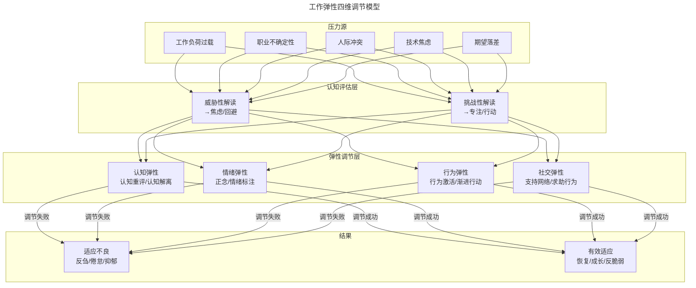
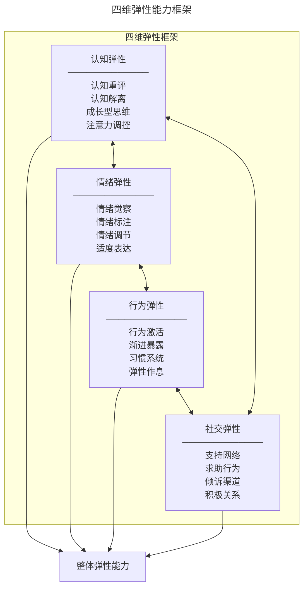

# 理解并建立自己的工作弹性

> **适用范围**：技术管理者、工程师、Tech Lead，以及处于高压环境或职业瓶颈期、希望建立可持续职业发展路径的技术从业者。
>
> **更新摘要（v2 · 2026-08 更新）**：
> - 结构化升级为 6 节骨架（导言 / 核心方法论 / 关键流程 / 工具与实战 / 常见误区 / 进阶延展）
> - Mermaid 图补齐 `--- title ---` frontmatter 并补充图后解读
> - 将反脆弱、发展趋势与参考资料整合至"进阶延展"一节
> - 新增"常见误区"小节，归纳弹性建设中的典型反模式

---

## 1. 导言

弹性架构是分布式系统的核心设计原则——系统在负载波动时动态调整资源、在故障发生时自动恢复。个体工作弹性（Professional Resilience）遵循同样的逻辑：在压力、挫折和不确定性面前，能够有效调节认知、情绪和行为，从扰动中恢复并持续成长。本文从心理弹性理论出发，系统构建一套覆盖"认知—情绪—行为—社交"四维的弹性能力框架，帮助技术管理者在高压环境中保持可持续的职业发展。

---

## 2. 核心方法论

### 复原力（Resilience）

复原力是指个体在面对逆境、创伤或重大压力时，能够有效适应并恢复到正常功能水平的能力。美国心理学会（APA）将其定义为"在逆境中良好适应的过程"。复原力并非固定特质，而是可以通过后天习得和强化的动态能力。

**核心特征**：

- **反弹能力**：从挫折中恢复到基线水平的速度
- **缓冲能力**：在压力下维持功能正常的阈值范围
- **成长能力**：从逆境中提取经验并实现超越基线的提升

### 反刍思维（Rumination）

反刍思维是心理弹性的核心破坏因素，指个体反复、被动地思考负面事件的原因、后果和情绪状态，却缺乏问题解决的行动导向。Nolen-Hoeksema 的反应风格理论将反刍思维定义为一种稳定的认知应对模式。

**反刍思维 vs. 反思性思考**：

| 维度 | 反刍思维（Rumination） | 反思性思考（Reflection） |
|------|----------------------|------------------------|
| 焦点 | 沉浸于"为什么是我" | 聚焦于"如何改进" |
| 时间取向 | 反复回溯过去或担忧未来 | 立足当下，面向行动 |
| 情绪效应 | 加剧焦虑和抑郁 | 缓解情绪，增强掌控感 |
| 行为结果 | 陷入停滞 | 产生改进方案 |
| 自我评价 | 降低自我效能感 | 提升自我认知 |

### 认知重评（Cognitive Reappraisal）

认知重评是情绪调节的核心策略之一，由 Gross 的情绪调节过程模型提出，指通过重新解读情境的意义来改变情绪反应。在职场压力情境中，认知重评是将"威胁性解读"转化为"挑战性解读"的关键机制。

### 弹性模型

模型从压力源出发，经过认知评估（威胁性 vs 挑战性解读），进入四维弹性调节层（认知/情绪/行为/社交），最终导向适应不良或有效适应两种结果。关键转折点在于认知评估层——同一压力源被解读为"威胁"还是"挑战"，决定了后续调节方向。

---

## 3. 关键流程

### 反刍思维识别与干预

#### 识别信号

反刍思维具有隐蔽性，个体常在无意识中陷入。以下信号提示反刍思维正在发生：

- **过去导向**：反复回想"如果当时……即可"，无法从错误中抽离
- **未来导向**：持续担忧"万一……怎么办"，对不确定性过度焦虑
- **自我聚焦**：反复质疑自身能力，"自身能力是否充分"
- **循环特征**：同一思路反复出现，无新结论或行动方案
- **情绪恶化**：思考后情绪非但未缓解，反而更加低落

#### 干预技术

##### 认知解离（Cognitive Defusion）

认知解离是接纳承诺疗法（ACT）的核心技术，旨在帮助个体与自己的想法拉开距离，从"我是个失败者"转变为"我注意到自己产生了一个'我是失败者'的想法"。

**实践方法**：

1. **语言重构**：将"我做不到"改为"我注意到自己有一个'我做不到'的想法"
2. **外化命名**：给反刍思维命名（如"那个老朋友又来了"），削弱其权威性
3. **感谢大脑**：对焦虑想法说"谢谢你，大脑，我知道你在试图保护我"
4. **观察者视角**：以第三人称视角审视自己的处境

##### 正念练习（Mindfulness）

正念是以不评判的态度关注当下体验的实践，是阻断反刍思维循环的有效手段。

**微正念实践**（适合工作间隙）：

- **3 分钟呼吸空间**：1 分钟觉察当下 → 1 分钟专注呼吸 → 1 分钟扩展觉察至全身
- **5-4-3-2-1 接地法**：识别 5 个看到的物体、4 个触摸到的感觉、3 个听到的声音、2 个闻到的气味、1 个尝到的味道
- **单任务专注**：在执行一项任务时，完全投入，觉察注意力漂移时温和地拉回

##### 行为激活（Behavioral Activation）

反刍思维导致行为冻结，行为激活通过"行动先于动机"的原则打破循环：

1. **微行动启动**：选择一个 5 分钟内可完成的小任务立即执行
2. **活动日程表**：规划每日活动，确保有成就感和愉悦感的活动交替
3. **改进清单 + 定期 Review**：将可改进事项书面化，每周回顾进展，将注意力从"无法控制的因素"转向"可控的改进点"

### 弹性能力构建框架

弹性能力不是单一特质，而是认知、情绪、行为、社交四个维度的协同整合。

四维弹性两两双向关联，形成闭环。任一维度的薄弱都会拖累整体弹性能力；反之，任一维度的增强都会正向影响其他三维。整体弹性能力是四维协同的结果，而非单一维度的突出。

#### 认知弹性

认知弹性是个体在面对新信息或情境变化时，灵活调整思维模式和认知框架的能力。

- **成长型思维（Growth Mindset）**：将挑战视为成长机会而非能力证明，将失败视为学习数据而非自我否定
- **注意力调控**：将注意力从不可控因素转向可控因素，从宏大目标转向可执行的微小目标
- **认知重评**：将"我做不到"重评为"我还没找到方法"，将"这很糟糕"重评为"这很困难但可以应对"

#### 情绪弹性

情绪弹性是个体在经历负面情绪后，能够有效调节并恢复情绪平衡的能力。

- **情绪觉察**：识别和命名当前情绪状态（情绪标注 / Affect Labeling 可降低杏仁核激活）
- **适度表达**：允许自己有低落、焦虑的时刻，偶尔的放纵也是弹性的表现——"文武之道，一张一弛"
- **自我关怀（Self-Compassion）**：以对待好友的方式对待自己，承认每个人都有脆弱时刻

#### 行为弹性

行为弹性是个体在计划受阻时，灵活调整行动策略的能力。

- **微习惯系统**：将大目标拆解为每日可执行的微行动，降低启动阻力
- **弹性作息**：允许偶尔的"不务正业"，给自己放个假，逛逛街、睡个懒觉，这是弹性而非懈怠
- **渐进暴露**：逐步接触令自己焦虑的情境，扩展舒适区边界

#### 社交弹性

社交弹性是个体在压力情境下，能够有效利用社会支持资源的能力。

- **积极关系网络**：主动结识积极向上的人，远离持续传播负能量的关系
- **倾诉渠道**：在迷茫时有可信赖的人倾诉或咨询——"别人也曾经历过"
- **意义确认**：确认自己在做有意义的事，持续向自己期望的方向前行；若发现当前工作毫无意义，则需停下来重新审视方向

---

## 4. 工具与实战

### 职场压力管理

#### 时间管理

| 策略 | 方法 | 适用场景 |
|------|------|---------|
| 时间块（Time Blocking） | 将日程划分为专注块和缓冲块 | 深度工作需求高 |
| 番茄工作法 | 25 分钟专注 + 5 分钟休息 | 注意力容易分散 |
| 两分钟原则 | 两分钟内可完成的事立即做 | 小任务堆积 |
| 批量处理 | 将同类任务集中处理 | 上下文切换成本高 |

#### 精力管理

时间管理的本质是精力管理。Jim Loehr 和 Tony Schwartz 的精力管理模型提出四个维度的精力：

- **体能精力**：睡眠、运动、营养——弹性的生理基础
- **情感精力**：积极情绪、人际关系——弹性的情感燃料
- **心智精力**：专注力、创造力——弹性的认知资源
- **精神精力**：意义感、使命感——弹性的深层动力

**关键原则**：在精力高峰期处理高认知负荷任务，在精力低谷期安排低强度活动或休息。

#### 边界设定

- **工作边界**：明确工作与生活的切换点，避免"永远在线"的状态
- **心理边界**：区分"工作中的问题"和"自我价值的问题"，项目失败 ≠ 个人失败
- **期望边界**：接受"付出不一定有等比回报"的现实——努力是一条线，有人在线下却因运气获得好结果，有人超过那条线却迟迟未见成果；此时需要耐心，信用分已积累，机会到来时自然兑现

### 最佳实践

1. **识别反刍信号**：当发现自己在同一负面思路上循环超过 10 分钟且无新结论时，立即启动认知解离
2. **改进清单 + 定期 Review**：将焦虑转化为可操作的改进项，每周回顾进展
3. **允许适度放纵**：偶尔的"不务正业"是弹性的表现，无需自责
4. **微行动优先**：焦虑时不要等待动机，先执行一个 5 分钟的微行动
5. **构建支持网络**：主动结识积极向上的人，确保迷茫时有倾诉渠道
6. **确认意义感**：持续确认自己在做有意义的事，若发现方向偏离则及时调整
7. **接受付出与回报的非线性**：信用分在积累，耐心等待机会窗口
8. **日拱一卒，不期速成**：每天进步一点点，长期复利远超短期冲刺

---

## 5. 常见误区

### 误区一：将反刍思维误认为反思

反刍思维沉浸于"为什么是我"，加剧焦虑；反思性思考聚焦于"如何改进"，产生行动方案。**纠正**：识别反刍信号——同一思路循环超过 10 分钟且无新结论时，立即启动认知解离。

### 误区二：等待动机再行动

反刍思维导致行为冻结，等待"心情好了再开始"只会加深停滞。**纠正**：行为激活——行动先于动机，先执行一个 5 分钟的微行动，动机会在行动中产生。

### 误区三：将"我犯了错"等同于"我能力不行"

情绪与身份标签耦合，错误被内化为能力不足的证据。**纠正**：情绪脱钩——错误是事件而非身份标签，将"我犯了错"与"我能力不行"解耦。

### 误区四：追求永远在线

认为"永远在线"是敬业的表现，模糊工作与生活的边界。**纠正**：明确工作与生活的切换点，允许偶尔的"不务正业"——这是弹性而非懈怠。

### 误区五：孤立反思导致自我否定

在压力情境中独自反复思考，缺乏社会支持，陷入自我否定螺旋。**纠正**：构建支持网络，在 Blameless 文化中寻求同伴反馈——"别人也曾经历过"。

### 误区六：期望付出与回报严格线性

认为"努力就一定有等比回报"，未见成果时即焦虑或自我怀疑。**纠正**：接受付出与回报的非线性——信用分在积累，耐心等待机会窗口，日拱一卒，不期速成。

---

## 6. 进阶延展

### 从弹性到反脆弱

Nassim Nicholas Taleb 提出的反脆弱（Antifragility）概念超越了弹性——弹性是恢复原状，反脆弱是从扰动中变得更强。

**技术管理者的反脆弱实践**：

| 层级 | 弹性表现 | 反脆弱表现 |
|------|---------|-----------|
| 认知 | 从挫折中恢复信心 | 将失败转化为认知升级的素材 |
| 情绪 | 压力后恢复平静 | 在适度压力中激发创造力 |
| 行为 | 调整计划继续推进 | 利用不确定性发现新机会 |
| 社交 | 维持支持网络 | 在危机中深化信任关系 |

**Fake It Until You Make It 的重新解读**：这不是鼓励虚伪，而是认知行为学中"行为先行于信念"的实践——先以目标身份行动，行为会重塑自我认知。将自信放在自己身上，按自己的节奏每天进步一点点，弹性能力远超想象。

### 发展趋势

1. **AI 时代的心理弹性**：AI 工具的快速迭代加剧技术焦虑，认知弹性的核心从"掌握所有技能"转向"快速学习和适应的能力"
2. **正念进入主流**：Google 的 Search Inside Yourself 项目、SAP 的全球正念实践已证明正念训练对职场弹性的显著效果，正念从边缘实践进入主流管理培训
3. **组织级弹性建设**：从个体弹性扩展到组织弹性，包括心理安全文化建设、倦怠预防机制、弹性工作制度
4. **数据驱动的弹性管理**：可穿戴设备和数字生物标记（心率变异性 HRV、睡眠质量）为弹性状态提供客观量化指标
5. **反脆弱领导力**：新一代领导力模型将反脆弱作为核心能力，领导者需在不确定性中不仅生存，更要利用波动实现组织进化

### 参考资料与延伸阅读

1. Response Styles Theory — Susan Nolen-Hoeksema, Journal of Abnormal Psychology, 1991
2. Emotion Regulation: Conceptual and Empirical Foundations — James J. Gross, Handbook of Emotion Regulation, 2013
3. Get Out of Your Mind and Into Your Life — Steven C. Hayes & Spencer Smith, 2005 (ACT)
4. The Power of Resilience — Robert Brooks & Sam Goldstein, 2004
5. Antifragile: Things That Gain from Disorder — Nassim Nicholas Taleb, 2012
6. Mindset: The New Psychology of Success — Carol S. Dweck, 2006
7. The Power of Full Engagement — Jim Loehr & Tony Schwartz, 2003
8. Search Inside Yourself — Chade-Meng Tan, 2012
9. Self-Compassion: The Proven Power of Being Kind to Yourself — Kristin Neff, 2011
10. Rumination-Focused Cognitive-Behavioral Therapy — Edward Watkins, 2016
