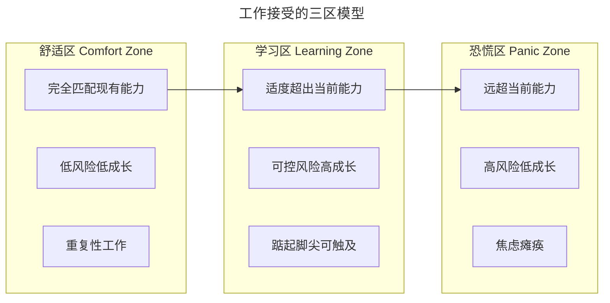
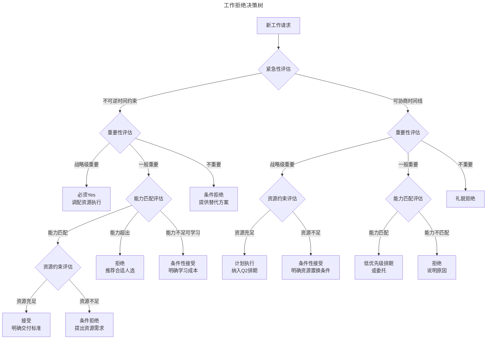
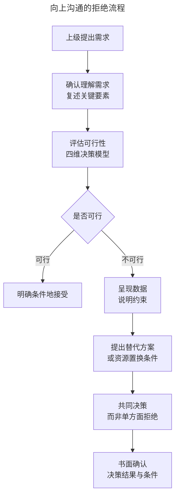

# 如何对更多的工作说"不"：技术管理者的工作拒绝决策框架

> **适用范围**：技术管理者、工程经理、Tech Lead、PM，以及需要在资源约束下做优先级决策的团队负责人。
>
> **更新摘要（v2 · 2026-08 更新）**：
> - 结构化升级为 6 节骨架（导言 / 核心方法论 / 关键流程 / 工具与实战 / 常见误区 / 进阶延展）
> - Mermaid 图补齐 `--- title ---` frontmatter 并补充图后解读
> - 将 AI 辅助优先级管理、异步工作模式等趋势与参考资料整合至"进阶延展"一节
> - 将原文"最佳实践与常见误区"拆分，常见误区表归入第 5 节

---

## 1. 导言

工作拒绝决策（Work Rejection Decision）是技术管理者最核心的边界管理能力之一。在资源永远稀缺、需求持续膨胀的组织环境中，管理者的每一次"是"都意味着对其他可能性的"否"——机会成本的隐性累积往往是项目失败和团队倦怠的根源。2025 年，随着异步工作模式普及、AI 辅助工具重塑生产力结构，工作边界管理已从个人时间管理演变为系统性决策问题：何时拒绝、如何拒绝、拒绝后如何维护关系与信任，需要一套可量化、可复用的决策框架。

本文基于优先级管理理论、资源约束模型和沟通策略研究，构建覆盖"决策—表达—追踪"全链路的工作拒绝决策体系，帮助技术管理者从一线到高管层级建立清晰的工作边界。

---

## 2. 核心方法论

### 艾森豪威尔矩阵（Eisenhower Matrix）

艾森豪威尔矩阵是优先级决策的基础模型，将任务按紧急性（Urgency）和重要性（Importance）两个维度划分为四个象限：

| 象限 | 紧急性 | 重要性 | 决策策略 |
|------|--------|--------|---------|
| Q1 紧急且重要 | 高 | 高 | 立即执行（Do First） |
| Q2 重要不紧急 | 低 | 高 | 计划执行（Schedule） |
| Q3 紧急不重要 | 高 | 低 | 委托他人（Delegate） |
| Q4 不紧急不重要 | 低 | 低 | 拒绝或消除（Eliminate） |

**技术管理者的关键洞察**：多数管理者陷入 Q3 事务的紧急性陷阱，将大量时间消耗在"别人紧急但对自己不重要"的工作上。高效管理者的时间分配应向 Q2 倾斜——重要不紧急的战略性工作（架构规划、团队建设、技术债治理）才是长期价值的来源。

### 时间管理四象限的动态演进

传统艾森豪威尔矩阵是静态分类工具，2025 年的工作环境要求动态优先级管理：

- **优先级衰减**：任何任务的重要性随时间推移而衰减，需定期重新评估
- **上下文依赖**：同一任务在不同项目阶段、不同组织角色下的象限位置不同
- **利益相关者权重**：任务的"重要性"应加权计算核心利益相关者的战略价值
- **机会成本视角**：每接受一个 Q3 任务，意味着放弃一个 Q2 任务的时间窗口

### 四维决策模型

工作拒绝决策应基于四个维度进行系统性评估：

1. **紧急性（Urgency）**：是否存在不可逆的时间约束？延迟是否导致严重后果？
2. **重要性（Importance）**：该工作与组织战略目标、团队核心 KPI 的关联度如何？
3. **能力匹配（Competency Fit）**：自身或团队是否具备完成该工作所需的核心能力？
4. **资源约束（Resource Constraint）**：当前容量（时间、人力、预算）是否允许高质量交付？

### 三区模型

工作接受决策的核心张力在于：完全匹配能力的工作导致停滞，远超能力的工作导致崩溃，适度超出能力的工作促进成长。

三区模型将工作按能力匹配度分为舒适区、学习区、恐慌区。舒适区导致停滞，恐慌区导致崩溃，学习区（适度超出能力 15%-25%）促进成长。决策时应优先接受学习区工作，拒绝舒适区与恐慌区工作。

### 踮起脚尖原则

"踮起脚尖做事"是指接受略超当前能力边界的工作，通过适度压力激发成长。其操作定义：

- **难度系数**：新工作所需能力超出当前水平 15%-25%
- **可达性判断**：在现有资源和支持下，通过学习和努力可在合理时间内达到交付标准
- **失败容忍度**：即使未达最优结果，仍可产出可接受的交付物

**边界判断标准**：

| 维度 | 舒适区（应拒绝或快速完成） | 学习区（应接受） | 恐慌区（应拒绝） |
|------|------------------------|----------------|----------------|
| 技能要求 | 已完全掌握 | 需学习 1-2 个新技能 | 需系统性新能力 |
| 时间压力 | 充裕 | 适度紧张 | 极度紧迫 |
| 支持需求 | 无需额外支持 | 需要部分指导 | 需要全程帮扶 |
| 失败后果 | 几乎无风险 | 可承受的有限风险 | 不可逆的严重后果 |
| 成长价值 | 低 | 高 | 低（焦虑主导） |

### 弹性边界的动态调整

工作边界不是固定的，应随以下因素动态调整：

- **团队成熟度**：新团队需要管理者更多介入，边界向内收缩；成熟团队可更多授权，边界向外扩展
- **项目阶段**：项目启动和交付期边界收紧，稳定运行期边界放松
- **个人状态**：精力充沛时边界可适度扩展，倦怠信号出现时必须收缩
- **组织环境**：裁员期、重组期等不确定性高的阶段，应主动收缩边界保护核心工作

---

## 3. 关键流程

### 决策树

决策树按"紧急性→重要性→能力匹配→资源约束"四层顺序逐级评估。不可逆时间约束且战略级重要的工作必须无条件接受；其余路径根据能力与资源状态，分叉为接受、条件性接受、条件拒绝、礼貌拒绝等多种结果。

### 紧急事务的强制接受原则

当工作同时满足"不可逆时间约束"和"战略级重要性"时，必须无条件接受。典型案例：

- **生产事故响应**：核心服务宕机、数据泄露等 P0 级事件
- **合规性截止日期**：监管要求、法律期限（如 Airbnb 账户审核案例——平台合规审核具有不可协商的法定时间约束）
- **客户承诺交付**：已签署 SLA 的关键里程碑

**强制接受的执行原则**：

1. 立即暂停当前 Q2 工作，将全部资源投入紧急事务
2. 明确告知利益相关者其他工作的延迟影响
3. 事后进行复盘，建立预防机制避免同类紧急事务反复发生

### 向上沟通的表达框架

向上沟通的关键在于"共同决策而非单方面拒绝"。先确认理解需求，再用数据呈现约束，提出替代方案或资源置换条件，最终通过书面确认决策结果与条件，确保双方对承诺有共识。

---

## 4. 工具与实战

### 四级拒绝策略

| 级别 | 策略 | 适用场景 | 表达模板 |
|------|------|---------|---------|
| L1 | 直接拒绝 | 明确超出能力/职责范围 | "我无法承担这项工作，因为……" |
| L2 | 条件拒绝 | 资源不足但意愿存在 | "如果能够获得 X 资源，我可以承担" |
| L3 | 替代方案 | 无法满足原始请求但可提供部分价值 | "我无法完成 X，但可以提供 Y 作为替代" |
| L4 | 延迟承诺 | 需要更多信息才能决策 | "我需要评估当前排期后再回复" |

### 表达原则

1. **开门见山**：先给出结论，再提供理由。避免冗长铺垫导致信息模糊
2. **理由客观**：基于数据、容量、优先级等客观因素，而非主观意愿
3. **维护关系**：表达对请求本身价值的认可，拒绝的是"此时此地的我无法承担"
4. **提供出路**：尽可能推荐替代人选、替代方案或未来时间窗口

### 心不甘情不愿时的拒绝信号

当内心对某项工作产生抵触时，这本身就是决策信号。识别以下心理状态：

- **能力焦虑**：对完成质量缺乏信心 → 能力不匹配，应拒绝或条件性接受
- **价值怀疑**：不认可工作的意义或方向 → 重要性不足，应质疑或拒绝
- **容量超载**：感到"新增任何工作都将导致崩溃" → 资源约束，必须拒绝
- **被动服从**：只因对方职级更高而无法说"不" → 需启动向上拒绝策略

### 向上说不的策略

#### 数据驱动拒绝

用客观数据替代主观判断：

- **容量数据**："团队当前 Sprint 已满载，利用率达 95%，新增任务将导致至少 2 个在研任务延期"
- **历史数据**："类似规模的需求上次交付耗时 3 周，当前排期无法在 1 周内完成"
- **影响数据**："接受此需求将导致 X 项目延迟 Y 天，影响 Z 客户的 SLA 承诺"

#### 条件性接受

将"拒绝"转化为"有条件的同意"：

- **资源置换**："可以接受，但需要从当前排期中移除 B 项目，或增加 2 名工程师"
- **范围协商**："可以交付核心功能，但非关键特性需推迟到下一迭代"
- **时间协商**："可以完成，但交付时间需从本周五延至下周三"

#### 阶段性承诺

将大承诺拆解为小承诺，降低风险：

- **先验证后承诺**："先进行 2 天的技术验证，再确认交付时间和范围"
- **分阶段交付**："第一周交付 MVP，根据反馈决定后续投入"
- **里程碑检查点**："在每个里程碑评估进展，决定是否继续投入"

### 拒绝决策检查清单

每次面临工作接受/拒绝决策时，逐项确认：

- [ ] 该工作的紧急性是否真实？是否为他人规划不足导致的"伪紧急"？
- [ ] 该工作与当前季度 OKR/团队核心目标的关联度如何？
- [ ] 自身或团队是否具备完成所需的核心能力？差距多大？
- [ ] 当前容量利用率是多少？新增工作是否导致过载？
- [ ] 接受该工作的机会成本是什么？将牺牲哪项已有工作？
- [ ] 拒绝该工作的关系成本如何？是否有替代方案降低关系成本？
- [ ] 该工作是否处于学习区？是否具有成长价值？

### 承诺追踪系统

每一次"是"都应被追踪和管理：

| 字段 | 说明 |
|------|------|
| 承诺内容 | 具体交付物和验收标准 |
| 利益相关者 | 承诺对象及期望 |
| 交付时间 | 明确的截止日期 |
| 资源需求 | 所需人力、时间、工具 |
| 优先级 | 相对于其他承诺的排序 |
| 状态 | 进行中/已完成/需 renegotiate |
| 风险 | 可能导致无法交付的因素 |

**关键原则**：当发现承诺可能无法兑现时，尽早 renegotiate，而非等到截止日期才暴露风险。

### 容量规划

基于数据的容量管理是科学拒绝的基础：

1. **历史速率追踪**：记录团队每 Sprint 的实际交付速率（Velocity），建立基线
2. **利用率阈值**：保持 85% 的计划利用率，预留 15% 缓冲应对紧急事务
3. **上下文切换成本**：每人并行任务数不超过 3 个，每次切换约消耗 20% 认知效率
4. **技术债预算**：每 Sprint 预留 20% 容量用于技术债治理和基础设施改进

---

## 5. 常见误区

| 误区 | 表现 | 后果 | 纠正 |
|------|------|------|------|
| 老好人综合征 | 对所有请求都说"是" | 容量过载、交付质量下降、团队倦怠 | 建立决策框架，用数据替代直觉 |
| 过度拒绝 | 对所有超出日常的请求都说"不" | 错失成长机会、被边缘化 | 应用踮起脚尖原则，识别学习区机会 |
| 模糊拒绝 | "我尽量""看看吧" | 请求方误认为同意，后续冲突 | 明确表达，使用四级拒绝策略 |
| 延迟拒绝 | 迟迟不回复，希望对方自行放弃 | 损害信任，浪费双方时间 | 24 小时内回应，即使需要评估 |
| 单方面拒绝 | 不提供理由或替代方案 | 关系受损，请求方反复尝试 | 每次拒绝附带理由和出路 |
| 能力低估 | 低估自身学习能力，拒绝学习区工作 | 成长停滞，长期竞争力下降 | 区分学习区与恐慌区 |
| 紧急性偏见 | 将所有紧急请求都视为 Q1 | Q2 工作被持续挤压 | 严格区分紧急性与重要性 |

---

## 6. 进阶延展

### 最佳实践

1. **快速响应原则**：对任何工作请求在 24 小时内给出明确回应，即使回应是"需要评估后再回复"
2. **书面确认原则**：所有接受和拒绝决策均书面记录，避免口头承诺的模糊性
3. **定期审查原则**：每两周审查一次所有承诺，识别需要 renegotiate 的项目
4. **透明排期原则**：将团队排期可视化，让请求方自行判断当前容量状态
5. **预防性拒绝原则**：在需求形成阶段就参与评估，避免在需求锁定后被动拒绝
6. **拒绝后跟进原则**：拒绝后主动关注该工作的进展，体现对结果的关心

### 发展趋势

#### AI 辅助优先级管理

2025 年，AI 工具正在重塑优先级决策过程：

- **智能排程**：AI 基于历史数据、依赖关系和资源约束自动生成最优排期方案
- **优先级推荐**：基于 OKR 对齐度、利益相关者权重、截止日期等维度自动计算任务优先级评分
- **容量预测**：基于团队历史速率和当前负载预测交付风险，提前预警
- **自动化拒绝**：对明显超出容量的请求，AI 助手可自动生成拒绝建议及数据支撑

**管理者角色转变**：从"手动排期和拒绝"转向"审核 AI 建议、处理边缘案例、维护人际关系"。

#### 异步工作模式下的拒绝

远程和异步工作模式改变了拒绝的沟通方式：

- **书面化趋势**：异步沟通天然要求拒绝理由的书面化和结构化
- **延迟响应的正当性**：异步模式下"我需要时间评估"是默认预期，降低了即时回应的压力
- **透明度工具**：项目管理工具（Jira、Linear、Notion）的排期可视化使容量状态对所有人可见，拒绝的客观性增强
- **文档化决策**：每次拒绝决策应记录在案，形成组织知识库，避免同类请求反复出现

#### 组织级边界管理

前沿组织正在建立系统性的工作边界管理机制：

- **容量预算制**：将团队容量视为预算，每季度分配，超预算需审批
- **需求过滤层**：设立 PMO 或需求评审委员会，在需求到达团队前进行过滤和优先级排序
- **拒绝文化**：将"合理拒绝"纳入组织价值观，鼓励员工基于数据和专业判断说"不"
- **心理安全**：确保拒绝不会导致惩罚或边缘化，建立"拒绝是专业表现"的共识

### 参考资料与延伸阅读

1. The 7 Habits of Highly Effective People — Stephen R. Covey, 1989（艾森豪威尔矩阵的系统性阐述）
2. Essentialism: The Disciplined Pursuit of Less — Greg McKeown, 2014（精要主义与拒绝哲学）
3. Crucial Conversations: Tools for Talking When Stakes Are High — Kerry Patterson et al., 2002（高难度对话技术）
4. Getting to Yes: Negotiating Agreement Without Giving In — Roger Fisher & William Ury, 1981（原则性谈判方法）
5. The Effective Executive — Peter F. Drucker, 1966（管理者效能的经典框架）
6. Zone of Proximal Development — Lev Vygotsky, 1978（最近发展区理论，踮起脚尖原则的理论基础）
7. Deep Work: Rules for Focused Success in a Distracted World — Cal Newport, 2016（深度工作与注意力管理）
8. Radical Candor: Be a Kick-Ass Boss Without Losing Your Humanity — Kim Scott, 2017（直接反馈与关怀并行）
9. Project Management Institute, PMBOK Guide 7th Edition, 2021（项目资源与容量管理框架）
10. Harvard Business Review: "Learn to Say No to Your Boss" — 2023（向上拒绝的实证研究）
