# 职场软技能 — 超连接时代的沟通与影响力

> **适用范围**：技术从业者、技术管理者（一线 Tech Lead 至 CTO）、以及渴望提升沟通、影响力、向上管理等职场软技能的职场人。适用于 AI 时代（2026）人机协作常态化背景下，需要同时协调人类团队与 AI Agent 的技术领导者。
>
> **更新摘要（v2 · 2026-08 更新）**：
> - 结构化升级为 6 节骨架（导言 / 核心方法论 / 关键流程 / 工具与实战 / 常见误区 / 进阶延展）
> - 整合原"AI 时代升级注解（2026）"与十一个章节内容，系统梳理 AI 时代职场软技能知识体系
> - 为全部 Mermaid 图补充 `--- title: ... ---` frontmatter，并在每张图后追加文字解读
> - 整合 2026 年 AI 交互沟通、Agent 编排、人机协同等最新趋势数据
> - 将原"参考文献"章节融入"进阶延展"形成统一延伸阅读入口

---

## 1. 导言

### 1.1 Why：为什么需要升级职场软技能

在 VUCA（易变性、不确定性、复杂性、模糊性）时代叠加 **AI Agent 爆发** 的今天，技术人的职场软技能正在经历前所未有的重构。传统的"写好代码就能走天下"的时代已经一去不复返，取而代之的是对 **沟通力、影响力、情绪智力、商业思维和人机协作能力** 的综合要求。

本文基于极客时间《技术领导力实战笔记》（2018-2019）专栏的精华内容，结合 **2026 年 AI 时代（Agent 爆发、人机协作常态化）** 的最新实践，系统性地构建面向未来的职场软技能体系。我们将从 **沟通效率、向上管理、演讲表达、个人品牌、冲突管理、职场网络、情绪管理、数据策略力** 等维度，提供一套可落地、可执行的成长指南。

### 1.2 2026 年关键背景

| 趋势 | 数据/现象 | 对软技能的影响 |
|------|----------|---------------|
| **84% 开发者使用 AI 编程** | Stack Overflow 2025 Survey | 人机协作沟通成为新必备技能 |
| **远程+混合办公常态化** | 后疫情时代工作模式 | 数字化沟通能力至关重要 |
| **AI Agent 参与工作流** | AutoGPT、Cursor、Devin 等普及 | 需要与 AI"沟通"的高级能力 |
| **信息过载加剧** | AI 让内容生产成本趋近于零 | 简洁精准的表达更加重要 |
| **个人品牌数字化** | 技术博客、开源、社交媒体 | 影响力核心渠道全面线上化 |
| **跨文化协作增加** | 全球化团队+AI 翻译工具 | 文化理解需求不降反升 |

### 1.3 全模块知识图谱

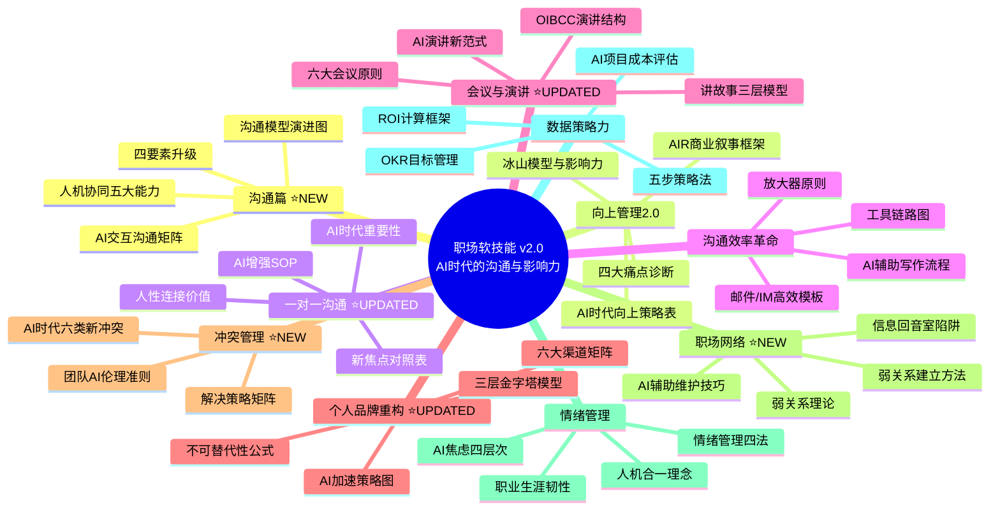

图解：全模块知识图谱覆盖沟通、向上管理、一对一沟通、会议演讲、个人品牌、冲突管理、职场网络、情绪管理、数据策略力十大模块，其中沟通篇、冲突管理、职场网络为 2026 年新增维度。各模块之间通过"人机协作"主线串联，构成完整的 AI 时代职场软技能体系。

---

## 2. 核心方法论

### 2.1 沟通四要素升级：传统三要素 → AI 时代四要素

在 AI 时代，沟通技能的定义正在发生根本性的变化：

```
传统沟通三要素：
├── 文字表达（写作能力）
├── 口头表达（演讲能力）
└── 倾听理解（共情能力）

AI时代四要素：
├── 文字表达（写作能力）
├── 口头表达（演讲能力）
├── 倾听理解（共情能力）
└── ⭐ AI交互沟通（Prompt Engineering的高级形式）
```

> **核心理念**：AI 交互沟通不是"会使用 AI 工具"，而是将 AI 作为新的沟通对象和协作伙伴，需要一套全新的沟通方法论。

### 2.2 AI 交互沟通能力矩阵

| 能力维度 | 具体表现 | 实际应用场景 | 提升方法 |
|---------|---------|-------------|---------|
| **需求翻译** | 将模糊的业务需求转化为精确的 AI 指令 | 让 AI 生成代码、文档、测试用例 | 练习结构化思维和分解能力 |
| **上下文管理** | 为 AI 提供充分的背景信息但不冗余 | 多轮对话中的信息组织 | 学习有效的 Context 构建技巧 |
| **输出引导** | 通过约束条件引导 AI 产出期望结果 | 控制 AI 输出的格式、风格、深度 | 掌握 Constraint Prompting 技术 |
| **错误纠正** | 快速识别 AI 的错误并有效引导其修正 | 处理 AI 幻觉、逻辑错误 | 培养"AI 调试思维" |
| **多 Agent 协调** | 设计多个 AI Agent 之间的协作流程 | 复杂任务的分治与整合 | 学习 Agent 编排框架 |

### 2.3 AI 交互沟通的三个层次

- **L1 - Prompt Engineering 基础**：清晰、准确地与 AI 对话（2024 年主流）
- **L2 - Agent 编排能力**：协调多个 AI Agent 完成复杂任务（2025-2026 兴起）
- **L3 - 人机协同设计**：设计人类与 AI 的最优协作模式（2026 前沿）

**典型场景示例**：
```
场景：向CEO汇报AI项目进展

传统方式：
  "我们用了GPT-5.5做客服机器人，效果不错"

AI交互沟通方式：
  "我们基于GPT-5.5 Pro构建了智能客服Agent，
   采用ReAct架构（Reasoning+Acting），
   当前处理准确率92%（vs 传统规则引擎68%），
   日均处理量提升3.2倍，
   但发现长尾问题（<5%场景）仍需人工介入，
   下季度计划引入Claude 4.5进行多模型协同..."
```

### 2.4 沟通模型的演进

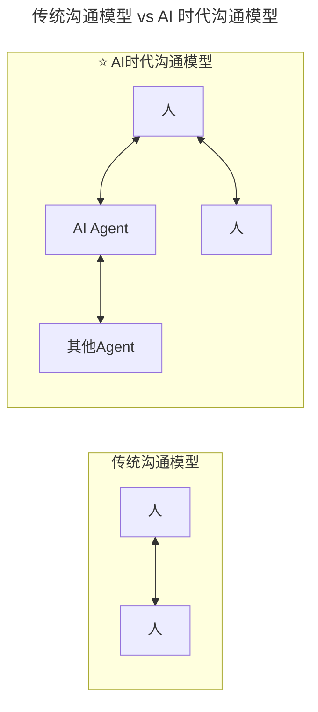

**关键洞察**：在 AI 时代，你不仅要学会与人沟通，还要学会与 AI 沟通，甚至要协调多个 AI Agent 之间的沟通。这是一种全新的"元沟通"能力。传统模型只是"人-人"单维互动，而 AI 时代模型是"人-Agent-人-其他 Agent"的多维协同网络。

### 2.5 向上管理 AIR 框架（商业叙事）

在 AI 时代，向上管理的核心挑战升级为：**如何向非技术背景的决策者解释 AI 投资的价值？**

**A - Alignment（对齐业务目标）**
- 不要说"我们要引入大语言模型"
- 要说"通过引入 AI 客服系统，预计可降低 40% 的人工客服成本，同时将客户响应时间从 24 小时缩短到 5 分钟"

**I - Impact（量化影响）**
- 使用具体的数字和案例
- 提供对比数据：实施前 vs 实施后
- 明确时间线和里程碑

**R - Risk（管理风险）**
- 主动说明潜在风险和应对措施
- 提供分阶段实施方案
- 展示退出机制和止损点

### 2.6 说服影响冰山模型

刘建国老师提出的 **"说服影响冰山模型"** 揭示了向上管理的深层逻辑：

```
水面之上（术的层面）：
├── 沟通技巧
├── 表达方式
├── 数据呈现
└── 时机选择

水面之下（势的层面）：
├── 专业信任度
├── 过往业绩记录
├── 对业务的深刻理解
└── 个人品牌影响力
```

**关键洞察**：当你的影响力很小时，即使技术和方案再优秀，说服效果也非常有限。**一线工程师提给 CEO 的建议，和 CTO 提给 CEO 的建议，结果可能完全不同——不是因为建议本身的质量差异，而是因为相对影响力的巨大差距。**

### 2.7 讲故事的三层模型（AI 版）

**Layer 1: 数据故事**（AI 可以帮你做）
- 数据收集和分析、图表和可视化生成、趋势和模式识别

**Layer 2: 业务故事**（需要人的判断）
- 将数据转化为业务洞察、连接现状和未来愿景、说明"所以呢？"（So What?）

**Layer 3: 人性故事**（只有人能做）
- 情感共鸣和激励、价值观传递、使命感的唤起

> **好故事的 AI 增强公式**：
> 
> **好故事 = 真实的数据(AI准备) + 清晰的逻辑(人+AI共同) + 真挚的情感(只有人)**

### 2.8 不可替代性公式

胡峰老师在《人到中年：失业与恐惧》中提出过深刻的观点：

> **中年人和年轻人本应在不同的战场上。年轻时，拼的是体力、学习力和适应能力；中年了，拼的是脑力、心力和决策能力。**

AI 可以替代重复性的编码工作、标准化的文档撰写、常规问题的解答；但 AI 难以替代复杂情境下的判断力、跨领域的整合能力、人际关系的经营能力、创造性和创新思维、价值观驱动的使命感工作。

```
不可替代性 = 专业深度 × (跨界广度 + 人际影响力 + 个人品牌)
```

### 2.9 职业生涯韧性模型

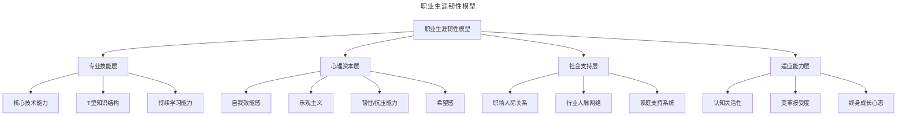

图解：职业生涯韧性由专业技能层、心理资本层、社会支持层、适应能力层四层构成。在 AI 时代，心理资本（自我效能、乐观、韧性、希望感）与适应能力（认知灵活、变革接受、终身成长）成为抵御 AI 焦虑、维持职业竞争力的关键底座。

---

## 3. 关键流程

### 3.1 向上管理场景矩阵

向上管理不是"讨好领导"，而是 **为了团队和目标主动建立高效的沟通通道**。正如刘建国老师所言："上级默认是需要管理者们主动向上沟通和反馈的，而非默认不需要。"

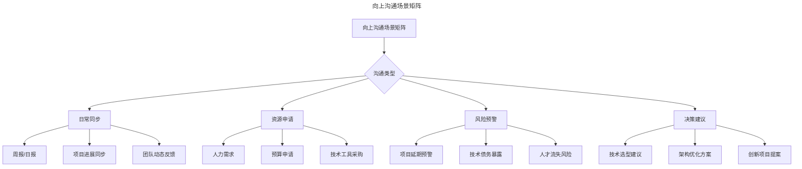

图解：向上沟通可分为日常同步、资源申请、风险预警、决策建议四类。风险预警与决策建议是高价值场景，需主动、及时、数据化呈现。

### 3.2 AI 增强向上管理决策流程

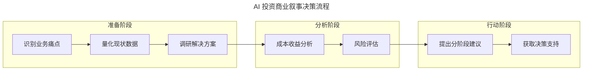

图解：AI 投资商业叙事遵循"准备→分析→行动"三阶段流程。准备阶段明确业务痛点并量化现状，分析阶段进行成本收益与风险评估，行动阶段提出分阶段建议并争取决策支持，降低决策者的认知门槛。

### 3.3 向上管理实战话术模板

❌ **错误示范**：
> "老板，我们需要采购 GPU 服务器来训练自己的大模型，大概需要 200 万预算..."

✅ **正确示范**：
> "CEO，我针对我们客服团队的痛点做了一个分析。目前我们每月处理 5 万条客户咨询，人工成本约 80 万元/月，平均响应时间 4 小时，客户满意度只有 3.2 分。
>
> 我调研了三套 AI 解决方案：
> - 方案A：引入智能客服机器人，预计可自动处理 70% 的常见问题，首年投入 50 万，预计节省人工成本 45 万/月
> - 方案B：自建基于开源模型的客服系统，投入 120 万，但需要 6 个月开发周期
> - 方案C：采用 SaaS 服务，按调用付费，前期投入低但长期成本较高
>
> **我的建议是先启动方案 A 的 POC 测试**，用 3 个月时间验证效果，如果转化率达到预期，再考虑方案 B 的自建路线。这样可以将风险控制在最低，同时快速看到业务价值。"

### 3.4 构建向上影响力的行动清单

- [ ] **建立定期沟通机制**：每周或每两周固定时间向上级汇报（15-30 分钟）
- [ ] **提前准备议程**：每次沟通前明确 3 个要讨论的核心议题
- [ ] **用数据说话**：避免主观描述，用具体数字支撑观点
- [ ] **理解上级优先级**：研究上级关注的 KPI 和战略重点
- [ ] **提供选项而非问题**：带着 2-3 个解决方案去沟通，而不是只抛出问题
- [ ] **及时同步风险**：坏消息要早报，不要等到无法掩盖再说
- [ ] **确认理解一致**：用"回放"句式确认："您看我的理解是否准确...?"

### 3.5 一对一沟通 Checklist（AI 增强）

**AI 时代一对一沟通 SOP 的三个阶段**：

```
┌─────────────────────────────────────────────────────┐
│           AI增强的一对一沟通SOP                      │
├─────────────────────────────────────────────────────┤
│                                                     │
│  1. 会前准备（AI辅助）                               │
│     ├── 让AI整理对方的背景信息和最近工作              │
│     ├── AI生成讨论议程建议                           │
│     └── 准备关键数据和案例                           │
│                                                     │
│  2. 沟通执行（人的核心价值）⭐                        │
│     ├── 积极倾听（AI做不到的）                       │
│     ├── 情感共鸣和理解（AI做不到的）                  │
│     └── 灵活应对意外情况（AI做不到的）                │
│                                                     │
│  3. 会后跟进（AI辅助）                               │
│     ├── AI整理会议纪要和行动项                       │
│     ├── AI设定跟进提醒                               │
│     └── AI生成个性化反馈草稿                         │
│                                                     │
└─────────────────────────────────────────────────────┘
```

**一对一沟通 Checklist**：

- [ ] **固定时间**：提前预约，不要临时取消
- [ ] **准时开始结束**：尊重彼此的时间
- [ ] **跟进上次会议承诺**：首先回顾待办事项完成情况
- [ ] **让对方先说**：问"你有什么想聊的？"
- [ ] **积极倾听**：不打断，用肢体语言表示关注
- [ ] **简短辅导**：分享一个有价值的小知识点（3-5 分钟）
- [ ] **明确行动项**：结束时确认双方的任务和时间点
- [ ] **记录并跟踪**：会后及时更新待办事项列表

### 3.6 AI 辅助写作最佳实践流程

**Step 1：明确目的和受众**
- 向 AI 说明：这是给谁看的？希望对方做什么决定？
- 示例 Prompt："我需要向 CTO 汇报 Q3 技术债治理进展，他关注的是投入产出比和风险控制"

**Step 2：提供关键数据和事实**
- 列出核心数据点、完成的工作、遇到的问题
- 让 AI 帮你组织成逻辑清晰的结构

**Step 3：生成初稿并人工精修**
- AI 生成的初稿通常有 60-70 分
- 需要你加入：具体的业务上下文、团队的真实感受和挑战、你的独特见解和建议

**Step 4：语气和风格调整**
- 根据接收方的偏好调整正式程度
- 加入适当的个人色彩和专业判断

### 3.7 高效邮件/IM 沟通模板

**请求支持的邮件结构**：

```
主题：【需决策】XX项目资源申请 - 期望本周五前回复

Hi 【姓名】,

【背景】简要说明为什么需要这个资源（1-2句话）
【数据】支撑需求的具体数字
【方案】你建议的方案（提供2个选项更好）
【影响】如果不批准会有什么后果
【时间】期望什么时候得到回复

谢谢！
【你的名字】
```

**AI 优化提示词**：
> "请帮我优化这封邮件，让它更加简洁有力，同时保持礼貌和专业。接收方是我的上级，他比较忙，喜欢直接看到结论。"

### 3.8 策略力五步法

游舒帆在《策略力：让目标与行动具备高度一致性》中提出了策略落地的五个步骤：

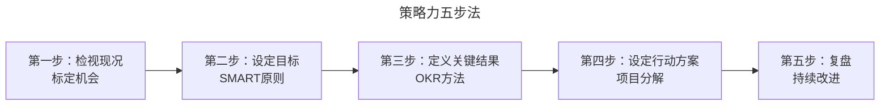

图解：策略力五步法从检视现况出发，依次经过 SMART 目标设定、OKR 关键结果定义、行动方案分解，最终通过复盘形成持续改进闭环。各步骤环环相扣，避免"目标与行动脱节"。

---

## 4. 工具与实战

### 4.1 2026 年技术领导者时间分配

基于 500 位 CTO 调研：

| 活动 | 2018 年占比 | 2026 年占比 | 变化原因 |
|------|----------|----------|---------|
| 编程/代码审查 | 35% | 12% | ↓ Agentic Coding 普及 |
| 技术选型/架构 | 25% | 20% | → AI 辅助决策 |
| 团队沟通/管理 | 20% | 30% | ↑ 人机协调增加 |
| 业务对接/战略 | 15% | 28% | ↑ AI 战略重要性 |
| 学习/自我提升 | 5% | 10% | ↑ 需要持续跟进 AI 发展 |

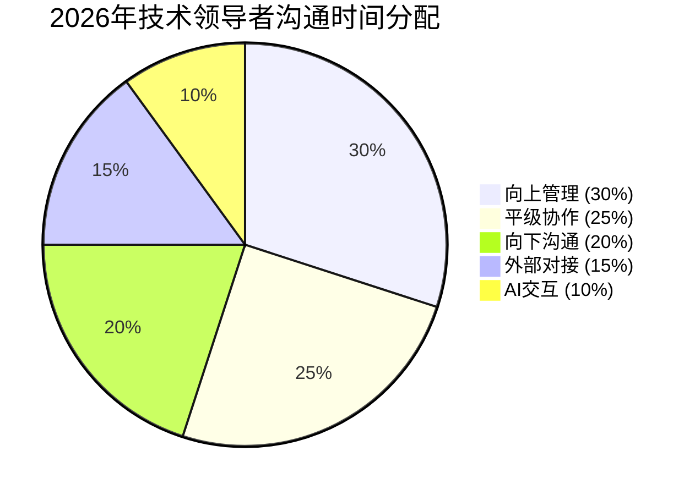

图解：2026 年技术领导者的时间重心从"写代码"转向"沟通管理"（30%+25%+20%=75%）与"业务战略"（28%）。向上管理与 AI 交互成为新增长点，反映人机协作时代对沟通能力的要求显著提升。

### 4.2 AI 辅助沟通工具采用率（2026）

| 工具类型 | 采用率 | 主要用途 | 推荐指数 |
|---------|--------|---------|---------|
| AI 邮件助手（如 Superhuman AI） | 62% | 邮件撰写/回复 | ⭐⭐⭐⭐⭐ |
| AI 会议纪要（如 Otter.ai/Fireflies） | 58% | 会议记录/总结 | ⭐⭐⭐⭐⭐ |
| AI 演示文稿生成（如 Gamma/Tome） | 45% | PPT 制作 | ⭐⭐⭐⭐ |
| AI 翻译工具（如 DeepL Pro） | 71% | 跨语言沟通 | ⭐⭐⭐⭐⭐ |
| AI 写作助手（如 Jasper/Copy.ai） | 38% | 文档撰写 | ⭐⭐⭐ |

### 4.3 AI 辅助沟通工具链路

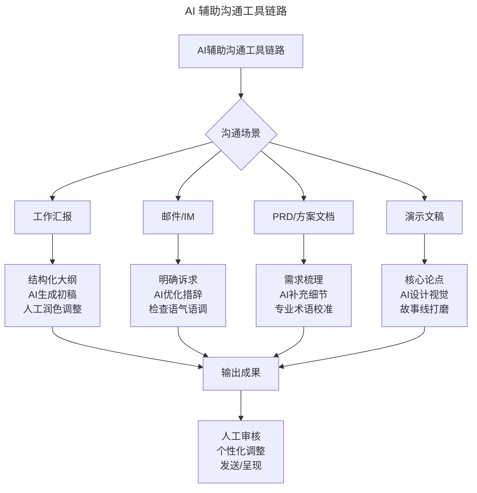

图解：不同沟通场景对应不同的 AI 辅助链路，但最终都汇入"输出成果→人工审核→发送/呈现"。核心原则是 AI 负责效率、人工负责把关，避免完全自动化导致失去个人特色。

### 4.4 个人品牌建设六大渠道

| 渠道 | 具体形式 | 投入产出比 | 适合人群 |
|------|---------|-----------|---------|
| **技术博客/公众号** | 深度技术文章、AI 实践案例 | 中等（高投入高回报） | 喜欢深度写作的人 |
| **短视频/直播** | 技术分享、AI 教程、行业点评 | 高（算法推荐放大效应） | 表达能力强的人 |
| **开源项目** | GitHub 仓库、AI 工具、框架贡献 | 极高（长期复利） | 工程能力强的人 |
| **技术演讲** | 会议演讲、企业内部分享、Webinar | 高（一次影响数百人） | 演讲能力好的人 |
| **社交媒体** | Twitter/X、LinkedIn、知乎、即刻 | 中等（日常维护） | 善于碎片化输出的人 |
| **AI 作品集** ⭐ | Prompt Library、Agent Demo、AI Art | 新兴（差异化强） | AI 实践者 |

### 4.5 个人品牌建设三层金字塔

| 层级 | 定位 | 内容形式 | 受众规模 | 变现潜力 |
|-----|------|---------|---------|---------|
| **底层：专业可信** | 技术专家 | 技术文章、开源贡献、代码 review | 百人-千人 | 低 |
| **中层：特色鲜明** | 领域意见领袖 | 教程、课程、咨询 | 千人-万人 | 中 |
| **顶层：影响力者** | 思想领袖 | 书籍、演讲、媒体采访 | 万人-百万 | 高 |

### 4.6 个人品牌建设路径演进

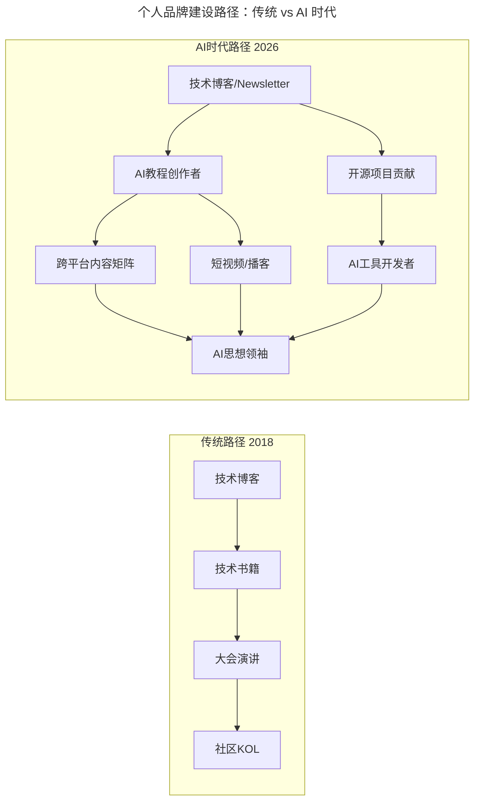

图解：2026 年个人品牌路径从线性升级为多路径并行的网络结构。除传统"博客→书籍→演讲→KOL"路径外，新增"AI 教程创作者""AI 工具开发者""短视频/播客"等分支，最终汇入"AI 思想领袖"，反映 AI 内容创作者角色的崛起。

### 4.7 AI 加速个人品牌建设流程

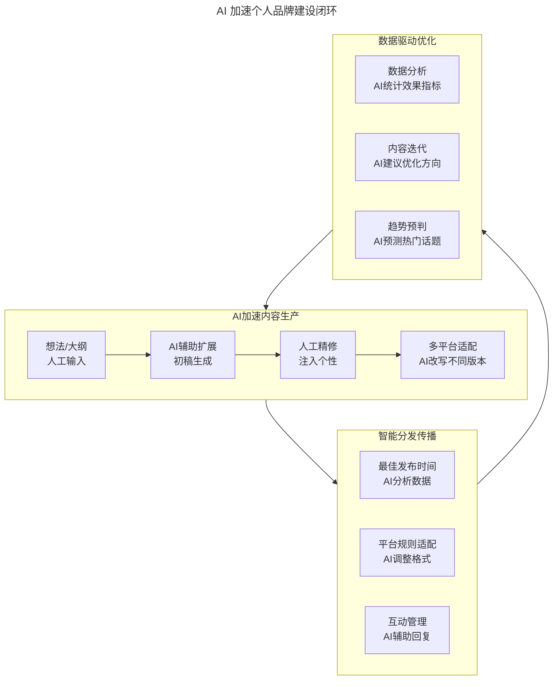

图解：AI 加速个人品牌建设形成"内容生产→智能分发→数据优化"的循环。内容生产阶段 AI 扩展初稿、人工注入个性；分发传播阶段 AI 优化发布策略；效果优化阶段 AI 驱动数据迭代，实现品牌的持续增长飞轮。

### 4.8 人机协作写作模式

**传统模式**：
```
选题 → 查资料 → 写初稿 → 反复修改 → 发布
（耗时：3-8小时/篇）
```

**人机协作模式**：
```
选题 → AI头脑风暴 → 人类筛选方向 → AI生成大纲 → 人类填充核心观点 → AI润色语言 → 人类审核发布
（耗时：1-2小时/篇，质量更高）
```

**关键原则**：
- **思想必须是你的**：AI 可以帮你表达，但不能替代你的思考和经验
- **案例必须是真实的**：亲身经历才有说服力
- **观点必须有态度**：平庸的内容不会被记住

### 4.9 冲突管理的 AI 伦理维度

2026 年新增了 AI 相关的冲突类型：

- **人机责任归属冲突**：AI 决策出错时，谁该负责？
- **AI 替代焦虑冲突**：团队成员担心被 AI 取代的心理疏导
- **AI 资源分配冲突**：有限的 AI 算力/预算如何在团队间分配？
- **AI 输出争议冲突**：当 AI 给出的建议与人类经验相悖时如何处理？

**应对原则**：
1. **透明化**：所有 AI 决策过程可追溯、可解释
2. **人机协同**：AI 提供建议，人类做最终决定
3. **持续沟通**：定期讨论 AI 在工作中的角色边界
4. **心理支持**：帮助团队建立正确的 AI 认知观

**团队 AI 伦理准则模板**：
```
【团队AI使用公约】

1. 透明原则：AI生成的内容需标注来源
2. 质量原则：所有AI产出必须经过人工审核
3. 学习原则：鼓励尝试新AI工具，但不强制
4. 隐私原则：不将敏感数据输入公共AI服务
5. 责任原则：AI是工具，最终责任人始终是人
```

### 4.10 情绪管理循环

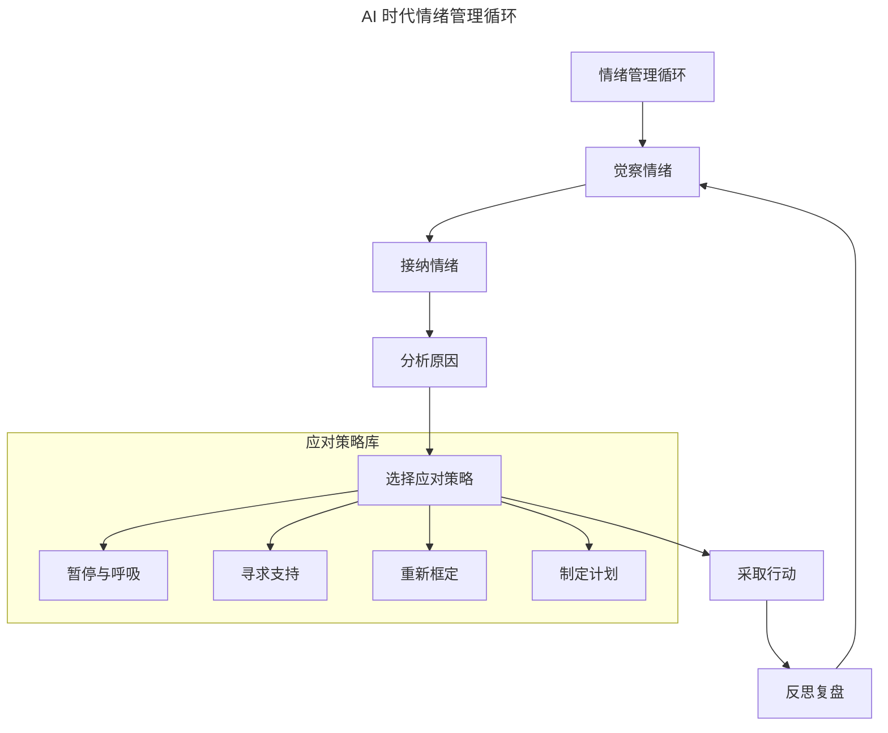

图解：情绪管理遵循"觉察→接纳→分析→应对→行动→复盘"的循环。应对策略库包含暂停呼吸、寻求支持、重新框定、制定计划四种方式。在 AI 焦虑时代，先接纳情绪的合理性（如对失业的恐惧），再进行理性应对。

### 4.11 弱关系理论与 AI 时代价值

格兰诺维特的"弱关系理论"在 AI 时代焕发了新的生命力：

| 维度 | 强关系（团队内部） | 弱关系（跨圈层） |
|------|------------------|----------------|
| 信息特点 | 同质化、重复 | 异质化、新颖 |
| AI 的影响 | AI 强化了强关系效率 | **AI 无法替代弱关系的创新价值** |
| 核心价值 | 执行力、协作效率 | **信息多样性、机会发现** |
| 在 AI 时代的地位 | 基础设施（必备） | **竞争优势（差异化）** |

> **警示**：AI 推荐算法倾向于推送你喜欢的内容，这会让你陷入"信息回音室"——只听到自己同意的观点，看不到不同的可能性。**解药**：弱关系是打破回音室的利器。

---

## 5. 常见误区

### 5.1 AI 是放大器，而不是替代品

核心原则：AI 是 **放大器**，而不是 **替代品**。它能放大你的思考深度和表达能力，但不能替代你的真诚和独特视角。

- **信息过载加剧**：AI 让内容生产成本趋近于零，但注意力变得更加稀缺
- **同质化风险**：过度依赖 AI 模板会让你的表达失去个人特色
- **信任成本上升**：接收方会本能地怀疑"这是不是 AI 写的？"

### 5.2 AI 时代弱关系维护误区

| 误区 | 表现 | 正确做法 |
|------|------|---------|
| **被动接受信息茧房** | 只看 AI 推送的同类内容 | 主动跨圈层交流，打破回音室 |
| **急于索取不提供价值** | 只在需要时联系弱关系 | 价值先行：先提供帮助，再寻求帮助 |
| **忽视长期维护** | 一次交流后就不再联系 | 定期触达，记录对方兴趣，持续提供价值 |

### 5.3 AI 时代保持不可替代性的误区

**AI 可以替代**：
- ❌ 重复性的编码工作
- ❌ 标准化的文档撰写
- ❌ 常规问题的解答

**AI 难以替代**：
- ✅ **复杂情境下的判断力**（需要经验和直觉）
- ✅ **跨领域的整合能力**（连接不同知识点）
- ✅ **人际关系的经营能力**（信任、共情、影响力）
- ✅ **创造性和创新思维**（从 0 到 1 的突破）
- ✅ **价值观和使命感驱动的工作**（AI 没有内在动力）

### 5.4 向上管理的认知误区

| 误区 | 表现 | 正确做法 |
|------|------|---------|
| **能不聊就不聊** | "上级太忙了""找不到上级" | 主动建立沟通通道 |
| **拿捏不好分寸** | "要不要跟领导说这个成绩？" | 明确沟通目的 |
| **难以领会意图** | "老板到底在想什么？" | 实现信息对称 |
| **无法影响决策** | "如何说服老板支持我的方案？" | 构建影响力冰山 |

**核心认知转变**：向上管理不是"讨好领导"，而是为了团队和目标主动建立高效的沟通通道。信息不对称时，容易出现自我感觉良好或怀才不遇的情形——不要单纯认为领导啥都不懂，大部分时候领导掌握的信息量更大，决策考虑的因素也更多。

### 5.5 AI 项目成本评估误区

吴铭老师在《成本评估是技术 leader 的关键素质》中强调：

> **技术 leader 做决策时要多以成本与收益为考量点，而不仅是基于个人的技术理想主义。**

**核心观点**："非必要的重构是没有业务价值的。"这个原则同样适用于 AI 项目——**如果 AI 不能带来明确的业务价值，就不要做。**

AI 项目成本评估框架：

| 成本类型 | 传统项目 | AI 项目 | 评估难点 |
|---------|---------|-------|---------|
| **显性成本** | 服务器、人力 | GPU 算力、API 调用费、数据标注 | 算力成本波动大 |
| **隐性成本** | 维护、培训 | 模型漂移、数据清洗、偏见修正 | 往往被低估 |
| **机会成本** | 做 A 就不能做 B | 技术选型的锁定效应 | 路径依赖风险 |
| **风险成本** | 项目失败 | AI 伦理问题、合规风险 | 新兴风险类型 |

---

## 6. 进阶延展

### 6.1 2026 可执行行动建议

**立即行动（本周内完成）**：

1. **进行个人软技能 AI 成熟度自评**
   - 使用"沟通四要素"框架，评估自己在每个维度的水平
   - 重点检查：AI 交互沟通能力是否达到 L2 级别（Agent 编排）
   - 输出：《个人软技能差距分析报告》

2. **搭建 AI 辅助沟通工具链**
   - 安装配置：Superhuman AI（邮件）、Otter.ai（会议）、DeepL Pro（翻译）
   - 设定目标：将日常沟通效率提升 30% 以上
   - 注意事项：始终保留人工审核环节，避免过度依赖 AI

3. **优化向上管理 AIR 流程**
   - 使用 GPT-5.5 Pro 生成标准化的周报模板和对齐报告
   - 引入数据可视化工具（如 Metabase + AI 分析），让汇报更有说服力
   - 关键改进：每次汇报前用 AI 预演可能的提问并准备答案

**中期规划（本季度完成）**：

4. **启动个人品牌 AI 赋能计划**
   - 内容策略：使用 AI 辅助每周产出 1 篇高质量技术文章（初稿由 AI 生成，人工精修）
   - 平台选择：微信公众号/知乎/掘金（中文社区）+ Medium/Dev.to（国际社区）
   - 特色定位：聚焦"AI 时代技术领导力"这一细分领域，建立差异化优势

5. **提升团队整体沟通效能**
   - 在团队内部推广 AI 沟通工具的使用（如共享的 AI 会议纪要系统）
   - 建立"沟通最佳实践库"，收集整理高效的沟通模板和话术
   - 组织月度"沟通工作坊"，分享 AI 时代的沟通心得

6. **深化 AI 交互沟通能力**
   - 系统学习 Prompt Engineering 进阶技巧（推荐：OpenAI 官方 Prompt Engineering Guide）
   - 实践 Agent 编排：使用 LangChain 或 CrewAI 构建简单的多 Agent 协作流程
   - 目标：能够独立设计和实施中等复杂度的人机协作方案

**长期愿景（2026 年底前实现）**：

7. **成为"AI-Native 沟通专家"**
   - 在公司内部建立"AI 沟通最佳实践"的标准和培训体系
   - 输出：一套完整的《AI 时代技术领导者沟通手册》
   - 影响：帮助至少 10 位同事提升 AI 交互沟通能力

8. **构建个人知识资产库**
   - 利用 DeepSeek V4 的低成本优势，构建个人专属的知识管理和检索系统
   - 整合：过往项目经验、技术笔记、行业洞察、人脉资源
   - 目标：让 AI 成为你的"第二大脑"，随时调用知识和经验

### 6.2 30 天行动计划 v2.0

**第 1 周：基础建设 + 沟通能力升级**
- [ ] Day 1-2：阅读本文档，标记与你最相关的 3-4 个模块
- [ ] Day 3-4：完成"沟通篇"练习——完整体验一次 AI 交互沟通全流程
- [ ] Day 5-7：建立一个个人知识管理系统（Notion/Obsidian/飞书文档）

**第 2 周：向上管理与一对一沟通**
- [ ] Day 8-10：梳理你需要向上沟通的事项清单，应用 AI 时代策略
- [ ] Day 11-12：预约并与上级进行一次高质量的一对一沟通（用 AI 辅助准备）
- [ ] Day 13-14：复盘沟通效果，记录收获和改进点

**第 3 周：输出与品牌建设**
- [ ] Day 15-17：选择一个你最擅长的技术话题
- [ ] Day 18-20：用"人机协作写作"模式完成一篇深度文章
- [ ] Day 21：发布文章并在团队/社群分享

**第 4 周：网络、冲突管理与整合**
- [ ] Day 22-24：为你负责的项目/团队制定 OKR
- [ ] Day 25：联系 3 位"弱关系"的朋友，进行简短交流
- [ ] Day 26：与团队讨论 AI 使用规范/伦理准则
- [ ] Day 27：组织或参与一次技术分享（应用 OIBCC 结构）
- [ ] Day 28-30：复盘这 30 天的变化，制定下一个 30 天计划

### 6.3 核心要点速查表 v2.0

| 模块 | 核心方法论 | 关键工具/模型 | 即刻可做的 1 件事 |
|-----|----------|--------------|----------------|
| **沟通篇** ⭐NEW | 四要素升级、人机协同五大能力 | AI 交互沟通矩阵、沟通模型演进图 | 练习一次完整的 AI Prompt Engineering（需求翻译+上下文管理） |
| **向上管理** | AIR 框架（Alignment-Impact-Risk） | 冰山模型、AI 时代向上策略表 | 本周约上级做一次 15 分钟的一对一沟通 |
| **一对一沟通** | AI 增强 SOP、人性连接三原则 | 新焦点对照表 | 用 AI 准备下一次一对一会议的议程 |
| **沟通效率** | AI 辅助写作流程 | 沟通场景矩阵、邮件模板 | 用 AI 优化一封即将发出的重要邮件 |
| **会议演讲** | OIBCC 结构、讲故事三层模型 | AI 演讲新范式、六大会议原则 | 下次会议尝试担任一次会议负责人 |
| **个人品牌** | 六大渠道、AI 加速策略 | 三层金字塔、不可替代性公式 | 选择一个主攻渠道，本周开始第一次输出 |
| **冲突管理** ⭐NEW | 六类新冲突、解决策略矩阵 | 团队 AI 伦理准则模板 | 与团队讨论并制定一份 AI 使用公约 |
| **职场网络** ⭐NEW | 弱关系理论、打破回音室 | 弱关系建立方法表 | 本周联系一位"弱关系"的朋友 |
| **情绪管理** | 情绪管理四法、人机合一 | 职业生涯韧性模型、AI 焦虑四层次 | 写下当前最大的焦虑，并用"重新框定"方法看待它 |
| **数据策略力** | 五步策略法、OKR | SMART 原则、AI 项目 ROI 框架 | 为当前手头的一个项目写出 OKR |

### 6.4 结语：在 AI 时代成为更好的自己

技术的浪潮一波接一波，从互联网到移动互联网，从云计算到人工智能，每一次变革都会引发焦虑和恐慌。但回望历史，**真正被淘汰的不是那些掌握了旧技术的人，而是那些停止学习和进化的人。**

正如暨家愉老师在《技术人如何快乐的自我成长》中所说：

> **本能型成长是最有效率的，过程也是最快乐的——因为你满足了自身的渴望，因为你真的想要做好这件事，所以你会废寝忘食地投入，用尽一切办法。**

**记住：AI 是你的副驾驶，而你，永远是那个握着方向盘的人。**

### 6.5 延伸阅读

**原讲座系列（极客时间《技术领导力实战笔记》）**：

1. 余晟，《如何打造个人技术品牌？》，第 58 讲
2. 刘俊强，《一本正经教你如何毁掉一场技术演讲》，第 75 讲
3. 刘俊强，《管理者必备的高效会议指南》（上/下），第 86-87 讲
4. 刘俊强，《做好一对一沟通的关键要素》（上/下），第 88-89 讲
5. 刘俊强，《领导力提升指南之培养积极的态度》，第 101 讲
6. 游舒帆，《策略力：让目标与行动具备高度一致性》，第 84 讲
7. 游舒帆，《敏捷力：拥抱不确定性，与 VUCA 共舞》，第 85 讲
8. 程军，《技术人的「知行合一」》（一/二/三），第 106/113/117 讲
9. 吴铭，《成本评估是技术 leader 的关键素质》，第 118 讲
10. 刘建国，《我各方面做得都很好，就是做不好向上沟通》，第 134 讲
11. 徐毅，《五星级软件工程师的高效秘诀》（一），第 141 讲
12. 于艺，《如何提升自己的能力与动力》，第 144 讲
13. 李列为，《技术人员的商业思维》，第 145 讲
14. 暨家愉，《技术人如何快乐的自我成长》（上），第 150 讲
15. 胡峰，《人到中年：失业与恐惧》，第 158 讲
16. 谢孟军大咖对话，《技术人如何建立自己的个人品牌》
17. 马晋，《技术 Leader 的持续成长》，第 80 讲

**在线资源**：
- OpenAI 官方 Prompt Engineering Guide：https://platform.openai.com/docs/guides/prompt-engineering
- LangChain：https://www.langchain.com
- CrewAI：https://www.crewai.com

---

*本文档基于极客时间《技术领导力实战笔记》（2018-2019）专栏精华内容升级改编，融合 **2026 年 AI 时代（Agent 爆发、人机协作常态化）** 最新实践，旨在为技术人提供系统性的职场软技能成长指南。*

**版本**：**v2.0**
**主要变更**：新增沟通四要素、人机协同能力、AI 时代演讲范式、冲突管理、职场网络等模块；全面更新个人品牌、向上管理、一对一沟通等内容
**适用人群**：技术从业者、技术管理者、渴望提升软技能的职场人
