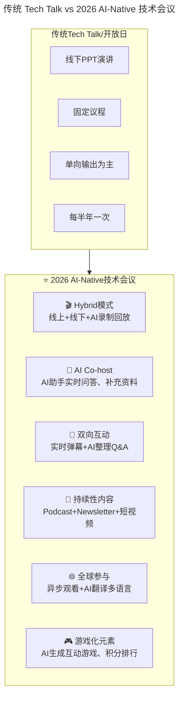
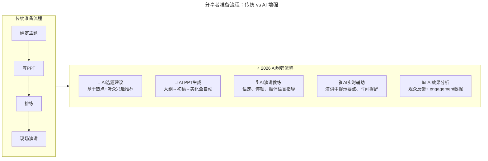
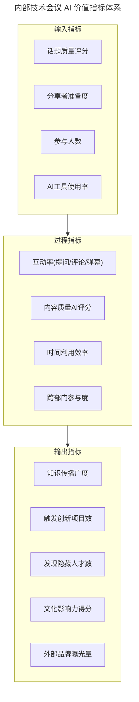

# 第76讲 | 内部技术会议的价值

> **适用范围**：技术管理者（Tech Lead、技术总监、CTO）、技术团队负责人、技术品牌与文化建设负责人，以及希望提升技术团队在公司内话语权、促进跨部门协作的工程师。适用于技术开放日、Tech Talk、内部技术分享会等场景的规划与执行。
>
> **更新摘要（v2 · 2026-08 更新）**：
> - 结构化升级为 6 节骨架（导言 / 核心方法论 / 关键流程 / 工具与实战 / 常见误区 / 进阶延展）
> - 整合原"AI 时代升级注解（2026）"内容，将内部技术会议升级为 AI-Native 技术会议
> - 为全部 Mermaid 图补充 `--- title: ... ---` frontmatter，并在每张图后追加文字解读
> - 补充不同规模团队的会议策略与 AI 量化价值指标体系
> - 将原"可执行建议"融入"工具与实战"与"进阶延展"

---

## 1. 导言

### 1.1 Why：为什么需要内部技术会议

现如今，技术在公司中的重要性越来越高，几乎所有业务的发展都离不开技术的支撑，但很多时候，技术的价值会被低估。究其原因，往往是因为公司其他部门乃至 CEO 不了解技术在背后到底做了些什么，是如何保证系统平稳运行、快速响应的，也就没法很准确的了解技术的价值和意义。

一个很好的解决方法就是推动公司内部技术会议的举办，邀请技术/工程团队之外的其他团队参与这项活动，向公司展示技术团队的成就，也让他们更了解技术团队的具体工作。我一般将其命名为"技术开放日"。

在 AI 时代，内部技术会议的核心观点——**"内部技术会议是展示技术价值、促进交流的最佳方式"——不仅没有过时，反而更加重要**：

1. **AI 技术迭代太快**：需要高频的知识共享机制
2. **AI 工具太多太杂**：需要内部的筛选和推荐
3. **AI 带来的焦虑**：需要通过交流建立安全感和共识

### 1.2 What：内部技术会议的定义与价值

内部技术会议可以帮助技术团队与其他部门，如产品或运营等建立联系，在一种更友好的环境中彼此交流，探讨大家正在从事的项目、感兴趣的技术、正在进行的工作等，对彼此有更深入的了解，也减轻跨团队沟通中的障碍。

除了纯粹面向内部的技术会议之外，也可以邀请外部的发言人和参会者参与，这样更有益于技术品牌的打造和传播。

### 1.3 案例：对外技术开放日提升技术话语权

我有个朋友是一家旅游网站微服务团队的技术 leader，之前他们公司技术团队举办了一次技术开放日，对外招募了 300 多位参会者，分享了他们在架构演进、微服务、Docker、混合开发等热门技术话题上的应用经验。

当时活动在技术圈中大获好评，除了对外展示了自己的技术水平，树立了公司的技术品牌之外，还有一个好处是让 CEO 等领导层看到了技术团队的能量，大大提升了技术团队在公司内的话语权。

---

## 2. 核心方法论

### 2.1 内部技术会议的多重价值

内部技术会议往往可以带来立竿见影的显著收益，此外还会带来一些隐性的长期收益：

**第一**，会议可以为技术团队的员工创造一个机会，借此在不同团队之间建立联系，加强员工之间的交流，通过共同学习促进交流和创新，并极有可能在交流中碰撞出全新的灵感和创意。

**第二**，参与者将有机会加入自己最关心的对话中，在一个友好的空间里分享自己的观点，让以前被埋没的看法和观点影响更多的人，并有机会找到跟自己志同道合的伙伴。

**第三**，内部技术会议是发现和鼓励"默默无闻的"人员、团队和成就的好机会，借此可以展示可能被埋没的团队项目，或者那些虽然不被广为人知但同样很重要的工作，比如运维团队、底层支持团队等。

**第四**，在内部活动中演讲可以让员工挑战自我。很多会议的分享者会告诉你，在活动中分享可以获得的最大收获是在整理和完善自己所要讲述的内容的过程中学到的新知识。

**第五**，团队很容易会变成一种小型的回音室，更好的做法是让大家时不时抬头听听别人在说什么。

**最后**，内部技术会议最主要的收益最终都将归结为社交：促进人员和团队之间的互动、信任和理解。

### 2.2 举办内部技术会议的基本原则

内部技术会议的举办没有什么"标准方法"，主要取决于你的团队、部门或组织的需求，但受众的选择一定要尽早确定：到底该邀请谁参加？谁能从会议中获得最大收益？

这些问题的答案可以帮助你确定会议活动的规划框架，因为随着参会者类型的增加，会议讨论的关注点也要随之改变，以尽可能满足受众的需求。

无论打算如何开展自己的内部技术会议，都要为与会者提供足够的时间和空间，并帮助他们做好安排，让他们能全身心投入到活动中，让活动收益最大化。

### 2.3 会议价值的六大支柱

| 价值维度 | 说明 |
|---------|------|
| **展示技术价值** | 打破技术黑盒，让其他部门了解技术工作 |
| **促进跨部门交流** | 建立联系、减轻沟通障碍 |
| **发现默默无闻的团队/成就** | 给"幕后英雄"展示机会 |
| **促进学习和创新** | 碰撞出新想法 |
| **挑战自我** | 演讲者通过分享深化理解 |
| **社交价值** | 建立信任和理解 |

---

## 3. 关键流程

### 3.1 如何举办一场内部技术会议

#### 1. 选择合适的分享者

基于技术会议的一大目标是向公司展示技术团队的形象和成果，所以分享者的选择必须具有代表性。比如尽量选择某个技术成果的一线负责人，这样他能更详细的阐述项目推进过程中遇到的难题、踩过的坑、解决的思路、具体的解决方案等，会更形象更落地；尽量涵盖不同部门、不同背景的分享者，如开发、运维、安全等不同方向的工程师，这样对外技术团队展示的形象会更饱满，对内也能给平时比较"默默无闻"的技术团队展示自己的机会，提升他们的积极性和荣誉感。

#### 2. 为缺乏经验的分享者提供指导

很多技术人其实都缺乏分享演讲的经验，他们往往无法很好的完成一场技术演讲。比如准备的演讲素材太过技术、太过深奥，导致其他部门的听众无法理解演讲内容；或是无法准确预估自己的演讲时间，事先准备太多的幻灯片，导致最后演讲潦草结束或超时过多等。

因此，我们可以给他们提供指导，保障他们的演讲内容是合适的，深入浅出，简单易懂的；同时，可以在活动开始前几天跟他一起对演讲进行排练，以此更好地掌控时间。

#### 3. 参加活动的过程中，本职工作也不能停摆

技术人员平时工作繁忙、研发任务重，所以，最大的困难在于要让大量的技术人员在半天甚至更长的时间里暂停自己的本职工作。尤其如果是分享者的话，还需要抽出更多的时间来准备演讲内容。

为了缓解这一问题，我们可以在前期活动规划的时候就安排一个"战情中心"，提前为他们做好相应的安排，确保重要的支持工作不被中断。

### 3.2 传统会议 → AI-Native 技术会议的演进



图解：2026 年 AI-Native 技术会议在形式、互动、持续性上全面升级。从"线下 PPT 演讲+固定议程+单向输出+半年一次"演变为"Hybrid 模式+AI Co-host+双向互动+持续性内容+全球参与+游戏化"，从一次性的活动变为持续性的 AI 知识流动。

### 3.3 AI 增强的分享者准备流程



图解：传统准备流程是线性的"主题→PPT→排练→演讲"，AI 增强流程在每个环节引入 AI 辅助：AI 选题建议、AI PPT 生成、AI 演讲教练、AI 实时辅助、AI 效果分析。这让分享者的准备工作从数天缩短到数小时，并显著提升演讲质量。

### 3.4 分享者 AI 工具包（2026）

| 环节 | AI 工具 | 功能 |
|-----|-------|------|
| **选题** | ChatGPT, Perplexity | 扫描技术热点、生成选题建议 |
| **大纲** | MindMeister AI, XMind AI | 思维导图自动生成 |
| **PPT 制作** | Gamma, Beautiful.ai, Copilot | 一键生成专业幻灯片 |
| **演讲稿** | ChatGPT, Claude | 生成演讲脚本+备注 |
| **排练** | Yoodli AI | AI 模拟面试/演讲并给反馈 |
| **现场** | Teleprompter AI | 提词器+节奏控制 |
| **录制/剪辑** | Descript, Opus Clip | 自动剪辑精彩片段 |
| **传播** | LinkedIn AI, Twitter AI | 自动生成多平台文案 |

### 3.5 会议主题的 AI 时代扩展

| 传统热门话题 | ⭐2026 新增话题 |
|-------------|---------------|
| 微服务架构实践 | **Agent 架构设计与实战** |
| Docker/K8s 部署 | **AI 模型部署与 MLOps** |
| 高并发系统设计 | **LLM 应用开发最佳实践** |
| 代码质量管理 | **AI Code Review 与质量保障** |
| 敏捷开发流程 | **人机协同的新敏捷方法论** |
| 技术债务治理 | **AI 辅助重构与现代化** |
| （无） | **⭐ Prompt Engineering 技巧分享** |
| （无） | **⭐ AI 工具链评测与选型** |
| （无） | **⭐ AI 伦理与安全实践** |
| （无） | **⭐ AI 时代的工程师成长路径** |

---

## 4. 工具与实战

### 4.1 AI-Native 技术会议策划模板

```
📋 [会议名称] 策划案（AI辅助生成）

【基本信息】
├── 主题：（AI推荐：当前最热X个技术话题）
├── 时间：（AI分析团队空闲时间最优窗口）
├── 形式：Hybrid（线上+线下）
└── 频率：从季度改为**月度轻量版+季度深度版**

【议题规划】
├── Session 1: AI技术应用案例分享（30min）
├── Session 2: 新AI工具Demo（15min）
├── Session 3: AI踩坑经验（20min）
├── Session 4: AI-free深水区讨论（30min）
└── Session 5: AI Workshop实操（45min）

【AI工具配置】
├── 会议平台：Zoom AI / Google Meet AI
├── 实时字幕：Otter.ai / Fireflies.ai
├── 互动工具：Slido / Mentimeter
├── 内容录制：Loom / Descript
└── 后续传播：Notion AI / 内部Wiki

【效果追踪】
├── 参与度数据（AI自动统计）
├── 反馈问卷（AI生成+分析）
├── 后续行动项（AI跟踪）
└── ROI计算（AI估算）
```

### 4.2 不同规模团队的会议策略

| 团队规模 | 推荐频率 | 形式 | AI 工具预算 |
|---------|---------|------|-----------|
| **<20 人** | 双周 1 次 | Lunch & Learn | $50/月 |
| **20-100 人** | 月 1 次 | Tech Talk + Workshop | $200/月 |
| **100-500 人** | 月 1 次+季 1 次大会 | Conference 风格 | $1000/月 |
| **500+ 人** | 周分享+季大会+年度 Summit | Multi-track | $5000+/月 |

### 4.3 参与者的 AI 增强体验

| 维度 | 传统体验 | ⭐2026 AI 增强体验 |
|-----|---------|------------------|
| **报名** | 表单填写 | **AI 推荐感兴趣的话题** |
| **参会** | 线下/视频 | **+ AI 实时字幕+翻译** |
| **提问** | 举手/Q&A 环节 | **+ AI 实时收集+整理问题** |
| **笔记** | 手记/电子笔记 | **+ AI 自动生成会议纪要** |
| **回放** | 录像回放 | **+ AI 智能章节跳转+摘要** |
| **跟进** | 加微信私下问 | **+ AI 匹配相关资源和联系人** |

### 4.4 会议价值的 AI 量化指标体系



图解：AI 价值指标体系将内部技术会议量化为输入、过程、输出三层指标。输入指标衡量会议筹备质量，过程指标衡量现场互动效果，输出指标衡量长期价值（知识传播、创新触发、人才发现、文化影响、品牌曝光），为会议 ROI 计算提供数据支撑。

---

## 5. 常见误区

### 5.1 把会议当成单向汇报

如果会议变成单纯的技术团队向其他部门的单向汇报，缺乏互动和讨论，就无法实现跨部门交流和思想碰撞的价值。

**正确做法**：设计双向互动的环节，如小组讨论、Open Space、自由问答，让所有参会者都有机会参与和发声。

### 5.2 忽视分享者的演讲能力培养

很多技术人缺乏分享演讲经验，如果直接让他们上台，往往导致内容过于深奥、时间失控、效果不佳。

**正确做法**：为缺乏经验的分享者提供指导，保障演讲内容深入浅出、简单易懂，并在活动前一起排练以掌控时间。

### 5.3 让本职工作停摆

技术人员工作繁忙，如果让大量技术骨干在半天甚至更长时间内暂停本职工作，会严重影响研发进度，也难以获得支持。

**正确做法**：前期规划时安排"战情中心"，提前做好相应安排，确保重要的支持工作不被中断。

### 5.4 会议频率过低导致价值流失

如果内部技术会议只是半年甚至一年一次的活动，那么知识共享、跨部门交流和团队士气提升的价值就无法持续。

**正确做法**：从低频的"半年一次的大会"变成"持续性的 AI 知识流动"，如月度轻量版 + 季度深度版，让技术分享成为团队文化的一部分。

### 5.5 过度依赖 AI 而失去人际连接

AI 时代的会议若过度依赖 AI 工具（AI Co-host、AI 纪要），可能削弱会议最核心的"社交价值"——人与人的直接互动和信任建立。

**正确做法**：AI 增强体验，但保留"AI-free 深水区讨论"等纯人际交流环节，确保技术会议始终以促进人与人的连接为核心目标。

---

## 6. 进阶延展

### 6.1 关键洞察：AI 时代内部技术会议的形式进化

> **原文的核心观点——"内部技术会议是展示技术价值、促进交流的最佳方式"——在 AI 时代不仅没有过时，反而更加重要。**

但形式必须进化：从"半年一次的大会"变成"持续性的 AI 知识流动"，从"单向演讲"变成"双向互动+AI 协同"。2026 年内部技术会议已从传统 Tech Talk 演进为 AI-Native 技术会议，融合 Hybrid 模式、AI Co-host、实时互动、全球参与等新形式。

### 6.2 结语

在这种技术会议中，所有的分享和讨论话题都可以由公司内部人员负责，而受众也都是公司同事，让大家自行选择能引发热切讨论的话题，这样可以提高大家的积极性。

你可以将这种活动变为真正的展示与交流活动，邀请公司其他人见见你的工程师和团队，听听他们在工作中遇到的挑战、取得的成果，并在技术部门和其他人员之间建立有效的对话途径，也让大家更清晰的了解技术的价值与意义。

### 6.3 延伸阅读

- 第 59 讲《技术演讲，有章可循》的 AI 升级版 → 了解技术演讲的准备与表达
- 第 60 讲《正确对待技术演讲中的失误》的 AI 升级版 → 了解 AI 时代的演讲失误管理
- 第 75 讲《一本正经教你如何毁掉一场技术演讲》的 AI 升级版 → 从反面角度理解演讲陷阱
- 第 86/87 讲《管理者必备的高效会议指南》的 AI 升级版 → 了解高效会议的组织原则

---

*本内容基于 2026 年 6 月技术环境生成，全面升级内部技术会议的形式、内容和价值。适用对象：技术管理者、技术团队负责人、技术品牌与文化建设负责人。*
