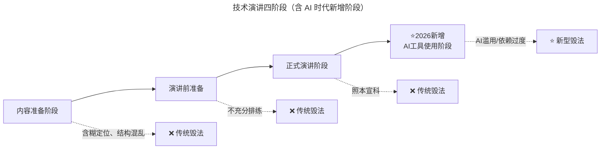
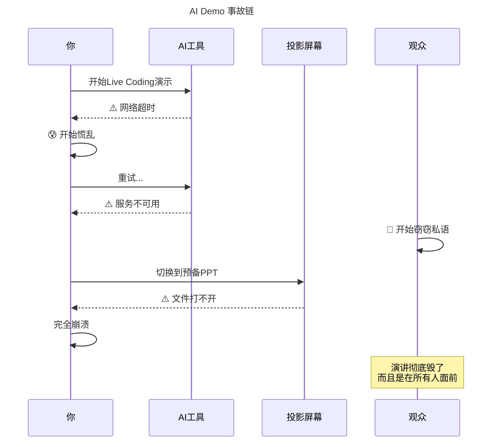
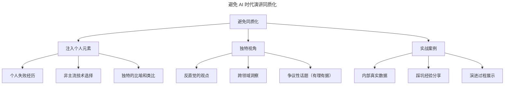

# 第75讲 | 刘俊强：一本正经教你如何毁掉一场技术演讲

> **适用范围**：技术管理者、架构师、Tech Lead、需要做技术演讲的工程师、希望提升演讲与表达能力的从业者，以及在 AI 时代希望避免"AI 毁演讲"陷阱的演讲者。适用于技术大会、内部分享、在线课程等演讲场景。
>
> **更新摘要（v2 · 2026-08 更新）**：
> - 结构化升级为 6 节骨架（导言 / 核心方法论 / 关键流程 / 工具与实战 / 常见误区 / 进阶延展）
> - 整合原"AI 时代升级注解（2026）"内容，将经典"毁演讲"三大阶段扩展为 AI 时代第四阶段
> - 为全部 Mermaid 图补充 `--- title: ... ---` frontmatter，并在每张图后追加文字解读
> - 补充 2026 年 AI 工具使用阶段的全新陷阱与黄金平衡点
> - 将原"作者介绍"融入导言，原"最后的建议"融入进阶延展

---

## 1. 导言

### 1.1 为什么从"毁掉演讲"讲起

演讲（Presentation）是一种常见的经验分享交流以及个人品牌提升方式。本文不会直接告诉你如何做好一场技术演讲，而是要开个脑洞，假设你自己要毁掉平行宇宙中另一个自我的技术演讲，通过反向操作的方式帮助大家了解如何做好一场技术演讲，哪些问题是要避免的。

通常我们将一个技术演讲划分为三个阶段：内容准备阶段、演讲前准备阶段以及正式演讲阶段。在 AI 时代，还新增了第四个阶段——AI 工具使用阶段。

### 1.2 作者介绍

刘俊强（微信公众号：程序员精进）现任腾讯云资深架构师，曾任迅雷技术总监、某互联网公司技术副总裁，10+ 年以上互联网开发经验，8 年以上技术管理经验。

### 1.3 演讲三阶段 + AI 第四阶段总览



图解：技术演讲分为内容准备、演讲前准备、正式演讲三个阶段，2026 年新增"AI 工具使用阶段"。每个阶段都有对应的"毁演讲"方式：传统阶段是含糊定位、不充分排练、照本宣科；AI 阶段则是 AI 滥用与过度依赖。

---

## 2. 核心方法论

### 2.1 演讲目的的四大类型

在我们决定做一场技术演讲时，我们对于该演讲的目的应该是明确的，一般来说，一场技术演讲的目的分为以下几类：

1. **告知（To Inform）**：产品技术新特性或版本发布的告知等，例如《Spring Boot 2.0 特性介绍及未来路线图》、《Istio 1.0 正式版发布》；
2. **教育（To Educate）**：阐明一门新技术或框架的使用方法等，例如教会工程师《基于 Spring Boot 2.0 来构建 Web 应用程序》、《基于 Kotlin 协程实现异步编程》；
3. **说服（To Convince）**：说服决策者来批准或使用自己的技术提案，抑或是研究预算等，例如《基于 Spark 的数据分析系统的投入产出分析》、《腾讯织云智能监控实践》；
4. **行动引导（To Lead to Action）**：针对已有解决方案引导人员进行行动实践等，例如《微服务改造实施规划》、《XX 项目性能优化专项》。

**关键认知**：做一个技术演讲成功的前提是目的明确。**毁掉演讲的根基便是不去弄清楚这场演讲的主要目的**，甚至引导演讲者弄错目的——本来是"说服"类却引导成"告知"类。

### 2.2 演讲的 4W2H 框架

关于内容准备的要点，我将其总结成"演讲的 4W2H"：

1. **What**：演讲要讲什么内容，内容的主题主旨是什么样的；
2. **Why**：为什么需要这场技术演讲，能够解决什么样的困惑或问题；
3. **Who**：演讲的受众是什么样的人群，是资深工程师还是技术管理者；
4. **Where**：演讲的地点在哪里，是公司内部分享还是付费大会，对应的受众人数有多少；
5. **How**：准备如何完成这场演讲，例如采用什么演讲风格、演讲辅助工具以及演讲结构；
6. **How Long**：演讲的时长是多久，15 分钟还是 30 分钟、40 分钟？

**核心理解**：Why 是核心冲突或需求（演讲的核心价值）；Who、Where 及 How Long 是演讲的限制因素或条件；最后的 What 和 How 是演讲者主要发挥才华的地方。

### 2.3 演讲结构组织的 OIBCC 公式

- **O**pening：获取观众的注意力；
- **I**ntroduction：为何会有这场演讲；
- **B**ody：演讲的主要内容及观点，通过统计分析、图表、示例及故事等手法来支持演讲的主要观点；
- **C**onclusion：回顾主要内容及观点；
- **C**lose：与开场呼应的一句话，让观众有强烈记忆点。

### 2.4 7/38/55 法则

知名的传播理论家 Albert Mehrabian 教授研究出了"7/38/55 法则"，他总结，你传递的信息或旁人对你的观感主要取决于三个要素：实际言语（内容）占 7%，语气（说话的语调、声音的抑扬顿挫等）占 38%，肢体语言（手势、表情、仪态等）占 55%。

**关键启示**：若忽略肢体语言和语气，只关注内容本身（7%），就是"毁演讲"的核心策略。演讲者排练的主要目的就是让自己在语气和肢体语言上完成肌肉记忆，避免实际演讲时因焦虑和紧张造成走形。

### 2.5 2026 年演讲质量评估模型

```mermaid
---
title: 2026 年演讲质量评估模型
---
graph TD
    A[演讲质量 = f(硬技能, 软技能, AI协作能力)] --> B
    
    B --> B1[硬技能 40%]
    B --> B2[软技能 35%]
    B --> B3[⭐AI协作能力 25%]
    
    B1 --> B1a[技术深度]
    B1 --> B1b[内容准确性]
    B1 --> B1c[实用价值]
    
    B2 --> B2a[storytelling]
    B2 --> B2b[临场发挥]
    B2 --> B2c[情感共鸣]
    
    B3 --> B3a[Prompt Engineering能力]
    B3 --> B3b[AI产出质量控制]
    B3 --> B3c[人机配合自然度]
```

图解：2026 年演讲质量由硬技能（40%）、软技能（35%）、AI 协作能力（25%）构成。AI 协作能力占比虽低，但是乘数因子——如果为 0（完全不会用或滥用），总分会被大幅拉低；如果强，可以让硬技能和软技能效果放大 1.5 倍。

---

## 3. 关键流程

### 3.1 内容准备阶段：含糊定位、结构混乱

**毁掉演讲的四个内容准备手段**：

1. 演讲要呈现的内容过多，不进行收敛导致主题不止一个；
2. 不明所以的幻灯片排版，如满屏代码、多种字体颜色混用、不使用图片、使用与内容无关的图片、整张幻灯片全部是文字以及花哨的幻灯片设计等；
3. 混乱的幻灯片结构，如迷之跳跃的幻灯片、内容不做分区或内容分区后不具有联系等；
4. 直奔主题讲内容，不准备开场和结尾。

**总结**：要毁掉一个演讲的要点就是 **随意的演讲结构、不明所以的幻灯片结构与排版**。内容准备阶段占演讲成功比重的 60%。

### 3.2 演讲前准备阶段：不充分的排练

**在演讲前准备阶段毁掉一场演讲的方式就是不充分的排练，最好是完全不排练。**

- 忽略 38/55 两项（语气和肢体语言），只关注 7% 的内容本身；
- 不做真实的计时演讲排练；
- 没有准备更多的素材以应对不同的演讲状况。

排练的另外一个重要作用在于让自己在时间的把握上更游刃有余。有经验的演讲者一般都会提前将演讲讲义打印出来，进行真实的计时演讲排练，帮助自己修正演讲中不合适的内容结构及表述节奏。

### 3.3 正式演讲阶段：照本宣科、忽略反馈

**演讲时毁掉演讲很简单，就是照本宣科、不根据现场反馈做灵活调整。**

通常来说，一场技术演讲要给观众带去新观点、新知识或是新思考方式等。成功的演讲者会根据现场观众的反馈来调整自己的语速及内容等。演讲者需要时刻将注意力放在观众身上，观察观众的反馈，反馈可能是表情、眼神或是动作。根据反馈来判断内容对观众的吸引力以及他们的接受程度，对于他们不感兴趣的地方，演讲者可以灵活跳过以节省时间，而那些他们听不懂的地方，演讲者可以再着重介绍讲解。

另外，观众的注意力每隔一段时间就会不集中，因此，成功的演讲者一般会在演讲中埋一些耍宝或是有冲击力的观点，来保持观众的注意力始终在自己身上。

### 3.4 AI 时代的 AI 工具使用阶段

#### 内容准备阶段的 AI 毁法

| 毁法等级 | 具体操作 | 毁坏效果 | 发生频率 |
|---------|---------|---------|----------|
| **🔴 致命级** | 让 AI 生成整个演讲稿，自己完全不看 | 内容空洞、缺乏深度、出现幻觉错误 | 高（约 35%） |
| **🔴 致命级** | 所有数据都来自 AI，不做任何验证 | 被听众质疑时无法应对 | 中（约 20%） |
| **🟠 严重级** | PPT 全用 AI 模板，风格高度同质化 | 听众觉得"又是这种 AI 味儿" | 极高（约 60%） |
| **🟠 严重级** | 技术细节让 AI 写，自己不懂底层原理 | Q&A 环节必崩 | 中（约 25%） |
| **🟡 中等级** | 过度使用 AI 术语包装简单概念 | 故弄玄虚，失去真诚感 | 中（约 30%） |

#### 演讲前准备阶段的 AI 毁法

| 毁法 | 操作方式 | 后果 |
|------|---------|------|
| **完全依赖 AI 排练** | 用 AI 虚拟观众练习，但不与真实人类演练 | 现场缺乏情感连接 |
| **不测试 AI 工具** | 从未在实际网络环境下测试 Demo 工具 | 现场必定出故障 |
| **过度相信 AI 时间预估** | AI 说"这个内容讲 20 分钟"，实际需要 40 分钟 | 严重超时 |
| **忽略 Plan B** | 只准备了 AI 辅助版本，没有手动降级方案 | AI 一旦失败就完蛋 |

#### 正式演讲阶段的 AI 毁法

**1. "AI 朗读机"模式**：上台后逐字读 AI 生成的稿子，语调平淡如 ChatGPT 语音输出，观众感受"这人是真人还是 AI？"

**2. "技术炫技"陷阱**：展示过于复杂的 AI 应用场景，目的是炫耀而不是教学，结果观众听不懂，自己也讲不明白。

**3. "互动外包"给 AI**：所有 Q&A 都交给 AI 回答，自己站在旁边当摆设，失去个人魅力和权威性。

#### AI Demo 事故链（终极毁法）



图解：AI Demo 事故链展示了"AI 工具使用阶段"最典型的翻车场景——网络超时、服务不可用、备用文件打不开层层叠加，最终导致演讲崩溃。这警示演讲者必须提前准备离线版本和手动降级方案。

### 3.5 避免 AI 毁演讲的预防措施

```markdown
✅ 正确做法：
1. 提前1天在会场测试所有AI工具
2. 准备离线版本的代码和PPT
3. 准备"无AI"的纯人工演示方案
4. 练习至少3次"如果AI挂了我怎么办"
5. 准备幽默的开场白："今天我的AI助手请假了"
```

---

## 4. 工具与实战

### 4.1 AI 时代演讲的人机黄金平衡点

**极端 A：完全不用 AI**（显得落后、效率低，错失 AI 带来的增强机会）
**极端 B：完全依赖 AI**（更危险：失去个人特色、缺乏深度理解、应对突发状况能力弱）

**⭐ 黄金平衡点**：

```markdown
✅ 2026最佳实践：

AI负责（70%）：
- 初稿生成和大纲梳理
- 资料收集和数据整理
- 语言润色和表达优化
- 视觉设计和排版美化

人类负责（30% - 但这是关键！）：
- 核心技术观点的提炼
- 个人实战经验的融入
- 独到见解和反直觉思考
- 情感连接和故事讲述
- 所有技术内容的最终审核
- 临场应变和即兴发挥
```

### 4.2 避免同质化的方法



图解：避免同质化需要从个人元素、独特视角、实战案例三个维度注入差异化。个人元素包括失败经历、非主流选择、独特比喻；独特视角包括反直觉观点、跨领域洞察、有据争议；实战案例包括内部真实数据、踩坑经验、演进过程。

### 4.3 "版权地雷"防范标准做法

```markdown
✅ 2026标准做法：
1. 所有配图使用正版素材库或明确授权的AI生成图
2. 数据引用标注原始来源
3. 代码示例确保开源协议允许
4. 如果不确定，就不要用！
```

### 4.4 2026 年"好演讲"反向定义

| 维度 | 差的演讲（被毁掉的） | 好的演讲（成功的） |
|------|-------------------|------------------|
| **内容来源** | 100% AI 生成，未经消化 | AI 辅助+70% 个人沉淀 |
| **技术准确性** | 有幻觉、未验证 | 100% 可验证、经得起推敲 |
| **个人风格** | 同质化、AI 味浓 | 独特、真实、有辨识度 |
| **工具使用** | 要么不用、要么过度依赖 | 自然融合、锦上添花 |
| **临场反应** | 依赖脚本、害怕意外 | 自信从容、化险为夷 |
| **观众感受** | "又是一个 AI 演讲" | "这个人真懂，而且有意思" |

---

## 5. 常见误区

### 5.1 "AI 全能错觉"

**表现**：认为有了 AI 就不需要深入理解技术；演讲前只用 AI 生成内容，从不亲自实践；对 AI 输出的内容没有判断力。

**为什么致命**：2026 年的听众也使用 AI，能一眼识别"AI 味儿"很重的内容，尊重真正懂技术的演讲者，鄙视"AI 代工"的演讲者。

**正确态度**：**"AI 是我的研究助手，不是我的替身。"**

### 5.2 "技术准确性牺牲者"

**典型错误**：
- 为了让 PPT 好看，接受 AI 编造的数据（如"性能提升 500%"实际可能只有 50%）；
- 为了显得专业，使用 AI 生僻术语（把简单的规则引擎升级包装成"神经符号推理引擎"）；
- 为了省事，不验证代码能否运行，Demo 时发现编译错误。

**记住**：**"在 2026 年，技术准确性的标准比以往任何时候都高——因为听众可以当场用 AI 验证你说的一切。"**

### 5.3 "人机关系失衡者"

两种极端：完全不用 AI（显得落后）或完全依赖 AI（更危险）。

**⭐ 黄金平衡点**：AI 负责 70%（初稿、资料、润色、视觉），人类负责 30% 但最关键的部分（核心观点、实战经验、独到见解、情感连接、最终审核、临场应变）。

### 5.4 "同质化竞赛"参与者

2026 年如果你参加 10 个技术大会，会发现 80% 的 PPT 风格相似（AI 生成模板）、60% 的结构类似（"问题-方案-效果"三段式）、40% 的案例相同。

**如何避免**：注入个人元素、独特视角、实战案例（详见 4.2 节）。

### 5.5 "版权地雷"不知情

**风险**：使用 AI 生成图片不确定商用授权、引用 AI 总结的第三方内容未标注来源、代码片段可能涉及专利问题。可能引发法律纠纷、专业形象受损、被同行质疑职业素养。

**解决方案**：所有配图使用正版素材库或明确授权的 AI 生成图；数据引用标注原始来源；代码示例确保开源协议允许；不确定就不用。

---

## 6. 进阶延展

### 6.1 写在最后：毁掉演讲的八条"秘籍"

如果你想毁掉一场演讲，请务必做到以下几条：

1. ✅ 让 AI 写一切，自己不看、不想、不改
2. ✅ 从不验证技术细节的真实性
3. ✅ 完全不准备 Plan B（特别是 AI 工具故障时）
4. ✅ 照本宣科，像机器人一样朗读
5. ✅ 忽略观众的任何反馈
6. ✅ 使用未经授权的 AI 生成图片
7. ✅ 夸大数据，制造"AI 幻觉式"效果
8. ✅ 模仿其他人的 AI 风格，毫无个性

### 6.2 反向思维总结

简单总结下毁掉一场技术演讲的要点：

1. 毁掉演讲的根基便是让自己不清楚这场演讲的主要目的。
2. 内容准备上毁掉演讲的要点就是随意的演讲结构、不明所以的幻灯片结构与排版。
3. 在演讲前准备阶段毁掉演讲的方式就是不充分的排练，最好是不排练。
4. 演讲时毁掉演讲很简单，就是照本宣科、不根据现场反馈做灵活调整。

### 6.3 给 2026 年技术演讲者的最后建议

> **"把 AI 当作你最强大的助手，但永远记住——站在舞台上的是你自己，不是 AI。你的经验、你的热情、你的真诚，这些是 AI 永远无法替代的。"**

### 6.4 延伸阅读

- 第 59 讲《技术演讲，有章可循》的 AI 升级版 → 了解技术演讲的正向方法论
- 第 60 讲《正确对待技术演讲中的失误》的 AI 升级版 → 了解 AI 时代的失误管理与急救包
- 第 200/201 讲《沟通技巧》的 AI 升级版 → 了解 AI 时代的四维沟通能力

---

*本内容基于 2026 年 GPT-5.5、DeepSeek V4、84% 开发者用 AI 编程等最新技术动态编写。核心主旨：用反向思维警示 AI 时代的演讲陷阱。*
