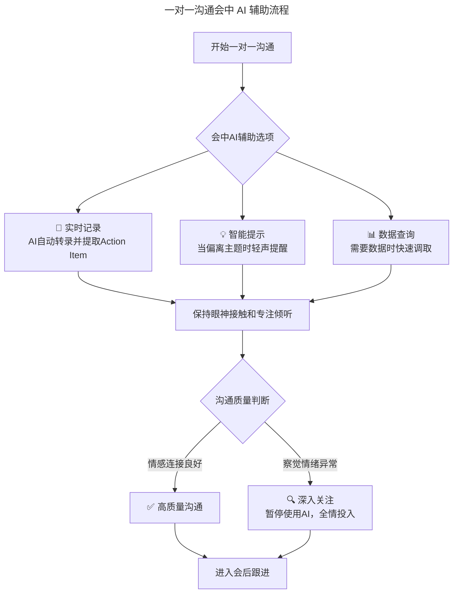
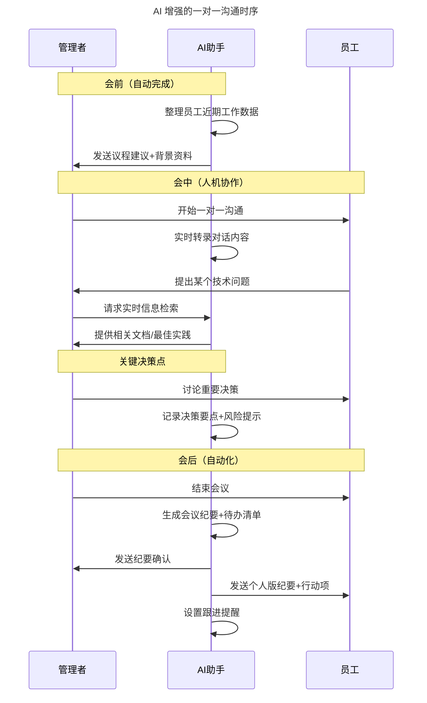
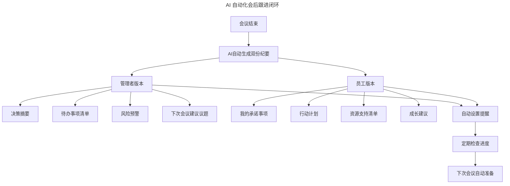

# 第88讲 | 刘俊强：做好一对一沟通的关键要素

> **适用范围**：技术管理者（一线 Tech Lead、技术总监、CTO）、团队负责人、HR、需要定期与团队成员进行一对一沟通的管理者，以及在 AI 时代希望提升人机协作沟通能力的管理者。适用于绩效面谈、员工问题指出、职业发展规划、日常团队沟通等场景。
>
> **更新摘要（v2 · 2026-08 更新）**：
> - 结构化升级为 6 节骨架（导言 / 核心方法论 / 关键流程 / 工具与实战 / 常见误区 / 进阶延展）
> - 整合原上/下两篇内容与两份"AI 时代升级注解（2026）"，将一对一沟通升级为"人机协作"新范式
> - 为全部 Mermaid 图补充 `--- title: ... ---` frontmatter，并在每张图后追加文字解读
> - 移除失效图片引用（评分表、议程模板图），改用文字化描述
> - 补充 AI 增强 SOP、第四项能力、ROI 数据与 2027-2030 未来展望
> - 将原"作者简介"融入导言，原"思考题"融入进阶延展

---

## 1. 导言

### 1.1 什么是一对一会议

一对一会议一般用于绩效面谈、员工问题指出以及职业发展规划等场景。定期的一对一会议为管理人员提供了解决问题的机会，并有效地回答了工作周期内出现的许多小而快速的问题。一对一会议还可以帮助员工提升技能，并能够有效改善团队的沟通情况。

一对一会议是管理人员和团队成员相互沟通、互相跟进，并了解彼此工作关系的重要渠道。定期举行的一对一会议是最强大的管理工具之一，可以使管理工作事半功倍。

### 1.2 为什么一对一会议重要

一对一会议是一个管理者和团队成员双方都应该感受到尊重和重视的场合，在这里，双方可以开诚布公地问对方问题。因此，一对一会议可以增强团队和你之间的信任感，并有效改善团队的沟通情况。

需要注意的是，一对一会议不适合头脑风暴和项目创建类场景，这些通常更适合在项目会议或定期小组会议中被处理。一对一会议也不是批评和强烈纠正问题的地方，虽然偶尔会有反馈和小的修正，但如果出现有待讨论的严重问题，应该在一对一会议之外进行讨论。一般而言，一对一会议更适用于你每天或每周定期与团队成员沟通。

### 1.3 作者介绍

刘俊强（微信公众号：程序员精进）现任腾讯云资深架构师，曾任迅雷技术总监、某互联网公司技术副总裁，10+ 年以上互联网开发经验，8 年以上技术管理经验。

### 1.4 为什么 AI 时代一对一沟通更重要

在 AI 时代，一对一沟通不仅没有减弱，反而变得更加重要：

| 变化趋势 | 影响 | 一对一沟通的独特价值 |
|---------|------|---------------------|
| 信息获取成本降低 | AI 可以快速生成任何信息 | **信任建立成本不变**——信任只能通过深度互动建立 |
| AI 可以生成文案 | 邮件、报告都可以 AI 辅助 | **情感连接无法替代**——真诚的理解和共情只有人能做到 |
| 远程工具丰富 | Slack、Zoom、Teams 等工具泛滥 | **深度对话仍然稀缺**——碎片化沟通越多，深度对话越珍贵 |

---

## 2. 核心方法论

### 2.1 一对一会议流程总览

一对一会议的流程如下：

1. 会议开始后，跟进上次会议中承诺的待办事项。
2. 进行简单的成长辅导或培训（3-5 分钟）。
3. 倾听对方的需求。
4. 你转换角色，向对方分享你的需求。
5. 回顾会议并结束会议。

**关键认知**：在一对一会议中，你最重要的角色是为另一个人服务。当你们都有服务态度时，一对一会议就会变得更有意义。

### 2.2 谁需要进行一对一沟通

为了帮助你确定一对一会议的最佳人员，可以使用一个简单的工作表来引导决策过程。

**评分表结构**：第一列是"姓名"列，写下经常一起工作的团队成员的姓名。第二列到第六列是评估列：

- **管理关系**列：可选值是 0 或 3，如果你管理着这位成员或者他在管理着你，填入 3，否则填 0。
- **问题**列：多久问对方一次问题。
- **委派**列：多久委派任务给该成员，或多久被该成员委派任务。
- **协调**列：是否经常与该成员协调日常安排。
- **跟进**列：多久跟进一次该成员。

这些列的分值都在 0-3 之间，0 代表从来不、1 代表很少、2 代表偶尔、3 代表经常。填写后，将第二列到第六列的分数相加得出总分，然后根据总分高低进行排序。建议是，经常与表格中排名前三、前四名的成员进行一对一会议。

### 2.3 建立时间表

在你决定跟哪些团队成员进行一对一会议后，下一步就是建立时间表。

具体的会面频率以及会议时长，并没有一个标准答案，不过以经验来看，最常见的一对一会议时间表是每月两次，每次会议时长为 25 分钟。如果认为每月两次不够，频率可以安排更高一些，但次数越频繁，会议时间就应该越短。总而言之，会议安排上可以比较灵活，但要确保留有足够的时间讨论可能遇到的各种问题。

确定了会议频率及时长之后，就要将一对一会议排入日程，并让它形成定期模式，成为一种习惯。坚持会议计划很重要，能让参会双方都感受到大家对于这个会议的重视和尊重。

### 2.4 AI 时代一对一沟通的第四项能力

原文强调了一对一沟通的重要性，但没有明确提及能力模型。传统管理者的三项核心能力：

1. 👁️ 战略规划能力
2. 👥 团队建设能力
3. 📊 业务推进能力

**⭐2026 新增第四项能力**：4. 🤖 **人机协作沟通能力**

这包括：
- ✅ 知道何时使用 AI 辅助、何时必须亲自上阵
- ✅ 能编写高质量的 Prompt 来获得有价值的洞察
- ✅ 能判断 AI 输出的质量并进行修正
- ✅ 能在保持人性温度的同时利用 AI 提升效率

### 2.5 AI 时代一对一沟通能力模型


图解：雷达图对比传统核心能力与 2026 新增能力。传统能力在倾听（90）、情感（95）上优势明显，而 AI 增强在数据（98）、决策（90）上更强。这印证了"AI 负责效率与数据，人负责倾听与情感"的分工原则。

---

## 3. 关键流程

### 3.1 一对一会议议程模板

下面提供一个简单的会议议程模板，你可以根据自己的特定需求调整此大纲：

1. **准时开始会议**：确立互相尊重彼此时间和会议本身的价值。
2. **跟进上次会议中承诺的待办事项**：如果对方达到预期，可以赞美他，并问问对方从中收获了什么；如果对方没有达到预期，可以问问对方遇到了什么阻碍，并对他进行指导修正。
3. **进行简单的成长辅导或培训（3-5 分钟）**：无论与谁见面，这都是一个很好的学习机会，可以帮助彼此逐渐成长。
4. **让对方倾诉需求**：耐心地听，让对方有机会询问他想问的问题。
5. **你转换角色，向对方提出要求和委派任务**。
6. **回顾会议期间彼此所做的承诺**：这是你在下次一对一会议开始时需要检查的事情。
7. **按时或早点结束会议**：这表达了对彼此时间的尊重。

### 3.2 跟进委派的任务

开始一对一会议后，首先需要跟进上次会议中委派的所有任务。这就需要你保留每次会议中达成共识的待办事项列表，将它用于每次的一对一会议中，以便询问每个任务的进展。然后，根据对方完成的结果，酌情给予简短的赞扬或纠正。

你也可以询问对方在完成任务时收获了什么？这将让对方有时间停下来思考他所做的工作，并创造了一个迷你教学时刻，让他跟你分享他获得的经验与见解。

如果他没有完成委托任务，可以问他：**是什么阻碍了你完成这个任务？** 这比单纯询问未完成任务的原因更加有效。要避免使用"为什么"这种强硬的词语——它会带有假设的责备态度。通过询问具体的阻碍原因，可以了解他未完成任务的具体原因，并帮助对方完成任务。

如果你确实需要纠正某人，请以真诚的赞美来进行更正。通过这种简单的模式，你将成为对方一个值得信赖的资源，而不是一个要求严格的主管。

### 3.3 倾听对方的需求

如果你是会议负责人，请让对方先说，即管理者应该首先问对方"你有什么问题想问我？"你需要成为一个良好的倾听者，为对方创建一个安全的空间，确保他有机会询问他写下的任何问题，甚至谈话期间想到的任何问题。

接下来，从了解如何帮助对方的角度，认真倾听他对你提出的所有要求，并尽最大的努力以任何可能的方式帮助他们。清楚了解对方对你的期望后，当他们要求你做某件事时，一定要明确这件事相关的人、事宜及时间。

### 3.4 分享你的需求

轮到你分享需求时，你必须直截了当的说出自己的想法。如果你想让其他人帮助你取得成功，首先要让他们了解你的需求。建议你在会议开始之前先了解自己的需求，这样轮到你提问时，就可以对照之前准备好的任务列表。

提问时，建议采用**开放式问题**，而不是封闭式问题或是否型问题。如果你需要其他人的帮助，请具体说明你希望获得什么帮助，并描述当你获得他的帮助后，最终希望得到的结果是什么样的。

如果你提出请求时，对方直接或通过肢体语言间接地表达出犹豫的态度，这时你应该先停下来，询问对方在想什么，避免让对方做自己不想做的事情。

### 3.5 回顾并结束会议

在一对一会议期间有机会互相提问时，应该专注于执行相关的问题。轮流简要介绍你们对彼此做出的所有承诺，确保重复每个事项的人员、事宜内容和时间。

重复是有价值的，因为它可以帮助我们避免混淆和错误。当重复人员、事宜内容和时间时，确保你允许对方自由地确定他的日程安排，以及完成任务的方式，而不是直接下达截止日期。

如果你已经将任务委派给其他人，请为自己创建提醒，以便跟进该执行人。你需要关注任务完成的结果，而不是关注完成任务时具体采取的步骤，这样更能使对方感受到尊重，并避免不必要的微观管理。

最后，请务必按时或早点结束每次会议。你越及时地结束会议并明确承诺，你就越能将一对一会议视为生产力的宝贵资源。

### 3.6 AI 增强的一对一沟通 SOP（2026 版）

#### 第一阶段：会前准备（AI 主导）

| 步骤 | 传统做法 | ⭐2026 AI 增强做法 | 工具建议 |
|------|---------|------------------|---------|
| 整理对方背景 | 凭记忆或翻记录 | AI 自动汇总对方近期工作、项目进展、绩效数据 | ChatGPT/Claude + 项目管理工具 API |
| 生成议程建议 | 手动列出讨论要点 | AI 基于历史对话和当前上下文生成个性化议程 | 定制化 Agent |
| 准备关键数据 | 手动收集报表 | AI 实时拉取相关指标并生成洞察摘要 | BI 工具 + LLM 集成 |
| 预判潜在问题 | 依赖经验直觉 | AI 分析对方情绪趋势和历史模式，提示风险点 | 情感分析 Agent |

**⭐ 可执行的 Prompt 模板**：
```
你是一位资深的技术管理顾问。我即将与[团队成员姓名]进行一对一沟通。
请帮我：
1. 总结他最近2周的工作成果和待办事项完成情况
2. 识别可能需要关注的3个问题或风险点
3. 生成一份15分钟的一对一沟通议程建议
4. 为每个议程项准备2-3个开放式提问
```

#### 第二阶段：沟通执行（人主导 + AI 辅助）



图解：会中执行阶段，AI 提供实时记录、智能提示、数据查询三种辅助，但都汇入"保持眼神接触和专注倾听"这一核心动作。关键判断点：若察觉对方情绪异常，立即暂停使用 AI，全情投入——情感连接是一对一沟通不可替代的价值。

#### 第三阶段：会后跟进（AI 主导）

| 任务 | 传统做法 | ⭐2026 AI 增强做法 |
|------|---------|------------------|
| 会议纪要 | 手写或简单记录 | AI 自动生成结构化纪要，包含决策、行动项、责任人、截止时间 |
| 行动项跟踪 | 依靠记忆或待办清单 | AI 自动创建任务并设定提醒，同步到项目管理工具 |
| 个性化反馈草稿 | 耗时撰写 | AI 根据沟通内容生成反馈草稿，管理者审核调整后发送 |
| 趋势分析 | 隐约感知 | AI 跨多次沟通识别模式和趋势，提前预警 |

**⭐ 会后跟进 Prompt 模板**：
```
以下是我与[成员姓名]的一对一沟通记录（已脱敏）：
[粘贴沟通要点]

请帮我：
1. 生成一份简洁的会议纪要（不超过300字）
2. 提取所有Action Item，格式：[任务] - [负责人] - [截止日期]
3. 识别需要我持续关注的1-2个风险点
4. 生成一条给该成员的鼓励性反馈消息（真诚温暖风格）
```

---

## 4. 工具与实战

### 4.1 AI 增强的会前个性化议程生成

**传统方式**：管理者凭记忆或简单笔记准备议题，议程模板化，缺乏针对性。

**⭐2026 方式**：
```markdown
✅ AI生成议程的工作流：

输入：
- 团队成员近期的绩效数据
- 项目进展情况
- 上次沟通的待办事项完成情况
- 该成员的职业发展目标
- 近期的OKR/KPI完成情况

AI输出：
📋 个性化议程建议：

【开场】(2分钟)
- 肯定上周完成的XX功能（具体数据：用户反馈提升15%）

【跟进上次待办】(5分钟)
- 任务1：代码评审流程优化 → 状态：已完成 ✅
  建议：询问实施过程中的挑战和收获
  
【核心议题】(10分钟)
- 主题：新项目的架构选型讨论
- 背景：该成员在微服务方面有深入经验
- 目标：听取他的专业意见，同时了解他的思考方式

【成长辅导】(5分钟)
- 推荐学习方向：基于他的兴趣（系统设计）+ 团队需求（云原生）
- 资源推荐：具体的课程/书籍/实践机会

【对方需求】(8分钟)
- 预判可能的提问：
  * 关于技术栈升级的顾虑？
  * 对当前项目角色的满意度？
  * 职业发展的困惑？

【你的需求】(5分钟)
- 希望他能够指导2名初级工程师
- 时间安排：每周2小时

【结束】(2分钟)
- 总结本次关键决策
- 约定下次时间
```

### 4.2 AI 增强的一对一沟通会议流程



图解：AI 增强的一对一沟通在会前自动完成背景整理、会中提供实时转录与信息检索、会后自动生成纪要并设置跟进提醒。但核心的"人机协作"发生在会中——管理者与员工的情感交流始终由人主导，AI 只做辅助。

### 4.3 AI 定制的成长辅导方案

**原文建议**：每次培训内容仅涵盖一个方面，用故事/视觉辅助/视频三种方式。

**⭐2026 升级**：
```markdown
✅ AI定制的成长辅导方案：

输入："该员工是后端工程师，3年经验，想往架构师方向发展，
最近对AI工程化感兴趣"

AI输出：

【推荐辅导话题】（按优先级排序）：

1️⃣ **系统设计思维培养** (本次重点)
   - 推荐案例：我们团队最近的XX项目架构演进
   - 讨论：如果让你重新设计，你会怎么做？
   - AI补充材料：提供2-3个业界类似架构的对比分析
   
2️⃣ **AI工具链掌握**
   - 当前水平：已在使用Copilot编程
   - 下一步：学习Prompt Engineering最佳实践
   - 实践机会：负责下一个AI辅助开发的项目
   
3️⃣ **技术影响力构建**
   - 建议：在团队内做一次技术分享
   - 主题建议：AI辅助重构实战经验
   - AI可帮助：生成PPT大纲+演讲稿框架

【辅导方式选择】：
□ 故事法：分享你当年从工程师到架构师的转变经历
□ 视觉法：展示架构演进的对比图表
□ 视频法：推荐观看XX大会的相关演讲（附链接+关键时间点标注）
```

### 4.4 AI 辅助倾听的四种能力

**⭐2026 增强**：

1. **实时情绪识别提示**（如果使用视频会议）：AI 提示"对方提到 XX 项目时语速加快，可能比较焦虑"，你的应对是放慢节奏，多询问感受而非事实。
2. **关键信息提取**：AI 实时标记对方话语中的关键词，帮助你聚焦真正重要的内容，避免遗漏隐含的需求或担忧。
3. **沉默分析**：AI 记录沉默时长和上下文，提示"对方沉默了 5 秒，可能是在思考或犹豫"，给你耐心等待的理由。
4. **后续追问建议**：基于对方的表述，AI 建议可能的追问方向，帮助你挖掘更深层次的需求。

### 4.5 AI 自动化的会后跟进系统



图解：AI 会后跟进系统自动生成管理者与员工双份纪要，各自包含不同重点（管理者关注决策与风险，员工关注承诺与成长），并自动设置提醒、定期检查进度、为下次会议做准备，形成完整的闭环管理。

### 4.6 效果评估：AI 增强后的 ROI

根据 2025-2026 年的实践数据：

| 维度 | 传统模式 | AI 增强模式 | 提升幅度 |
|------|---------|-----------|---------|
| **准备时间** | 每次 30 分钟 | 每次 10 分钟 | ⬇️ 67% |
| **会议质量**（主观评分） | 7.2/10 | 8.5/10 | ⬆️ 18% |
| **待办事项完成率** | 65% | 85% | ⬆️ 20% |
| **员工满意度** | 7.0/10 | 8.2/10 | ⬆️ 17% |
| **跟进及时性** | 平均延迟 3 天 | 平均延迟 0.5 天 | ⬆️ 83% |

**关键发现**：效率提升显著（准备时间减少 67%），但更重要的是**质量提升**（因为准备更充分），员工满意度提升说明**人性化并未因 AI 而降低**。

---

## 5. 常见误区

### 5.1 AI 时代一对一沟通的常见陷阱

| 陷阱 | 表现 | 后果 | 解决方案 |
|------|------|------|----------|
| **过度依赖 AI** | 会议中频繁查看 AI 提示，忽视员工感受 | 失去信任和连接 | 将 AI 信息记在心里，专注眼神交流 |
| **变成审讯式** | 用 AI 列出的问题清单机械式提问 | 员工感到被审查而非被关心 | 将问题自然融入对话，而非逐条询问 |
| **忽视情感信号** | 只关注事实和数据（AI 擅长部分） | 无法建立深层关系 | 特别关注语气、表情、肢体语言 |
| **AI 纪要泄露隐私** | 未脱敏就共享会议纪要 | 违反信任 | AI 自动识别敏感信息并标记 |
| **跟进过度自动化** | 完全靠 AI 提醒，缺乏人情味 | 关系变得机械化 | 重要节点仍需亲自沟通 |

### 5.2 原文强调的误区

**一对一会议不适合的场景**：
- 一对一会议不适合头脑风暴和项目创建类场景（更适合项目会议或定期小组会议）。
- 一对一会议不是批评和强烈纠正问题的地方。虽然偶尔会有反馈和小的修正，但如果出现有待讨论的严重问题，应该在一对一会议之外进行讨论。

**"为什么"提问的陷阱**：询问"为什么不这样做？"带有假设的责备态度，会暗示对方"为什么你不能做到？"。应改用询问"是什么阻碍了你完成这个任务？"。

**单向领导误区**：不要只关注任务完成步骤（微观管理），要关注任务完成的结果，这样更能使对方感受到尊重。

### 5.3 AI 是辅助，不是替代

```markdown
❌ 错误做法：
- 让AI替你和员工对话
- 全程看AI生成的提示词回复
- 忽视员工的非语言信号（表情、语气、肢体语言）

✅ 正确做法：
- AI提供信息和参考，你自己做判断和回应
- 关注情感连接，这是AI做不到的
- 用AI处理事务性内容，用人类智慧处理情感性内容
- 保持眼神交流，不要一直看屏幕上的AI提示
```

---

## 6. 进阶延展

### 6.1 AI 时代一对一沟通的新焦点

| 传统焦点 | AI 时代新焦点 |
|---------|-------------|
| 同步项目进度 | 探讨职业发展和成长路径 |
| 解决具体问题 | 建立信任和心理安全感 |
| 分配工作任务 | 理解动机和内在驱动力 |
| 反馈工作表现 | 共同规划未来方向 |

**关键原则**：AI 可以帮你准备会议议程、整理谈话要点，但它无法替代：真诚的眼神交流、对对方情绪的敏锐感知、在沉默中给予的支持、基于深层理解的个性化建议。

### 6.2 未来展望：2027-2030 的一对一沟通

1. **AI 情感计算**：实时分析沟通中的情感状态，给出共情建议
2. **预测性干预**：AI 预测员工可能的离职风险或职业瓶颈，提前介入
3. **虚拟导师匹配**：AI 根据员工发展目标，匹配内部/外部导师
4. **沉浸式沟通**：VR/AR 支持的远程沟通，更接近面对面体验
5. **个性化成长路径**：AI 持续追踪员工成长轨迹，动态调整发展计划

### 6.3 给技术管理者的 ⭐2026 行动建议

1. **本周行动**：选择一个 AI 工具（ChatGPT/Claude/DeepSeek），在下一次一对一沟通前试用"会前准备 Prompt 模板"
2. **本月目标**：建立个人的"一对一沟通知识库"，让 AI 能基于历史数据提供更精准的建议
3. **季度复盘**：评估 AI 辅助对一对一沟通质量的实际影响，调整使用策略

### 6.4 思考题

你跟你的团队成员多久进行一次一对一沟通呢？这样的频率对你的管理工作有帮助吗？接下来你要如何使用本文的操作方法或技巧，来对自己管理的团队进行定期一对一会议，然后观察这一做法对自己工作的提升以及团队管理顺畅度的改善情况。

### 6.5 最后的建议

> **"2026 年最成功的管理者，不是那些抛弃人性拥抱 AI 的人，而是那些善用 AI 放大自己人性光辉的人。在一对一沟通中，AI 能帮你准备得更好、记得更牢、跟得更紧——但它无法替代你真诚的关注、温暖的倾听和智慧的引导。"**

记住：
- ✅ **AI 负责效率，你负责温度**
- ✅ **AI 提供信息，你做出判断**
- ✅ **AI 记录细节，你把握大局**
- ✅ **永远记住：对面坐的是一个人，不是一个问题需要解决**

### 6.6 延伸阅读

- 第 86/87 讲《管理者必备的高效会议指南》的 AI 升级版 → 了解 AI 如何增强团队会议
- 第 134/159 讲《向上沟通/管理》的 AI 升级版 → 了解 AI 时代的向上管理策略
- 第 59/60/75 讲《技术演讲》系列的 AI 升级版 → 了解 AI 时代的演讲表达

---

*本内容基于 2026 年 GPT-5.5、DeepSeek V4、Agent 加速落地期等最新技术动态编写。核心主旨：AI 时代一对一沟通的最佳实践——人机协作，以人为中心。*
