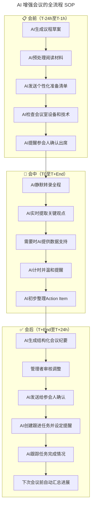
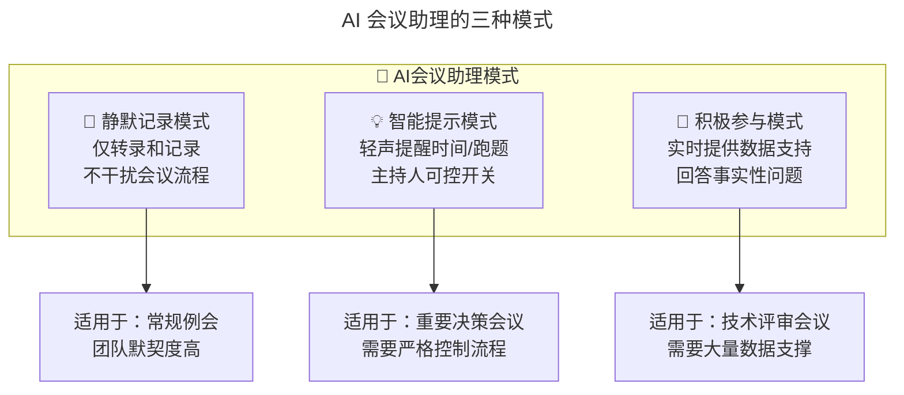

# 第86讲 | 刘俊强：管理者必备的高效会议指南

> **适用范围**：技术管理者、项目经理、Scrum Master，以及希望在 AI 时代用会议工具栈提升团队协作效率的从业者。
>
> **更新摘要（v2 · 2026-08 更新）**：
> - 结构化升级为 6 节骨架（导言 / 核心方法论 / 关键流程 / 工具与实战 / 常见误区 / 进阶延展）
> - 合并原"上篇（六大原则）"与"下篇（议程与跟进）"内容，整合 AI 时代升级注解
> - 补充 Mermaid 图 frontmatter 标题与图后解读，强化会议全流程 SOP
> - 融合 2026 行业观察数据（Harvard Business Review 等）与会议价值重构观点

## 1. 导言

在技术管理者的工作职责中，与团队保持良好沟通是必须的技能，而会议是沟通和完成实际工作的高效途径之一。

你有没有过这样的经历，参加某次会议时感觉自己的时间被浪费了，恨不得立马逃离现场去别的地方？作为管理者，我们希望自己所带领的团队举行会议时，不会让与会人员也有如此感受，本文就将探讨如何让会议高效化，并从会议中获得最大收益。

本指南主要面向的是小组会议，也就是至少三人参加的会议，不包括大型技术会议；一对一的私人会议由《做好一对一沟通的关键要素》另行探讨。在 2026 年，GPT-5.5 与 DeepSeek V4 已深度融入工作流，84% 的开发者使用 AI 辅助编程，Agent 进入加速落地期，会议作为团队协作的核心场景，正在经历 AI 驱动的效率革命。

**核心认知转变**：

| 维度 | 传统会议 | 2026 AI 增强会议 |
|------|---------|------------------|
| **核心价值** | 信息同步、任务分配 | 决策制定、情感连接、创新碰撞 |
| **信息准备** | 手动收集材料 | AI 自动生成摘要和洞察 |
| **记录方式** | 人工纪要（易遗漏） | AI 实时转录+智能提取 Action Item |
| **跟进机制** | 依赖个人责任心 | AI 自动跟踪+智能提醒 |
| **时间效率** | 经常超时 | AI 计时+议程动态调整 |

## 2. 核心方法论

### 2.1 成功会议的六个原则

1. **明确目的**：每次会议都应该有明确的目的。安排会议并邀请其他人参加之前，首先要问自己：我想从这次会议中得到什么结果？
2. **确认时间**：会议越短越好。简短而安排有效的会议，能迫使参会者在有限的会议时间内做出明智的决定。
3. **必备议程**：会议议程是参会者在会议中遵循的步骤大纲，可以帮助会议更加专注，不让会议随意发散。
4. **做好准备**：在参加会议之前，每个参会者都应该花一些时间准备他们的问题。
5. **专注重点**：专注并坚持会议的目的，使会议参与者保持在正确的轨道上，避免多任务处理。
6. **会议负责人**：每次会议都应该有会议负责人，确保会议遵循以上五个原则，使会议专注于目标并实现目标、确保会议按时开始和结束。

### 2.2 会议类型（按时间维度）

- **每日会议**：Scrum 会议或每日站会、碰头会等。目的是让每个团队成员签到并报告当天正在进行的工作，关键是要保持简短。
- **每周会议**：最常见的会议类型，更为正式，目的不仅仅是快速检查工作，还包括更多的合作和协调工作。
- **每月/每季度/每年会议**：一般用于培训、评审以及工作回顾等，目的是宣布新的重要项目、帮助团队达到更高层次能力的培训，或对一段时间内的工作总结回顾。

### 2.3 选取会议负责人

**方式一：基于职位**。让会议中最高职位者来做会议负责人。好处是已经包含了汇报架构和问责制；缺点是其他参会者可能就没有机会来负责会议，且可能让其他人觉得会议始终由一个人控制或主导。

**方式二：轮换**。让每个会议参与者都有机会来担当。优势在于为不具备管理职位的参会者提供了发展和实践领导力的机会，可以增加团队成员的工作满意度；缺点是不同负责人带来的规则执行和重点不一致，临时负责人可能需要辅导和指引才能很好胜任。

不论选取哪种方式，只要选择一种方式并始终如一地使用，并不断修正该方法的弊端，都会取得不错的会议效果。

### 2.4 2026 会议价值重构

**最重要的认知升级**：会议的价值从"信息同步"转向"决策和情感连接"。

| 会议类型 | 传统主要价值 | 2026 新增价值 |
|---------|------------|--------------|
| 每日站会 | 同步进度 | 快速对齐障碍+建立团队节奏感 |
| 周例会 | 汇报工作 | 决策制定+团队凝聚力建设 |
| 月度评审 | 绩效评估 | 战略对齐+人才培养+情感连接 |
| 项目启动会 | 分配任务 | 愿景对齐+激发士气+建立信任 |

**关键洞察**：如果一场会议的核心价值只是"信息同步"，那么这场会议应该被 AI 工具替代或大幅压缩。真正需要面对面/视频的会议，应该聚焦于 AI 无法替代的部分——**决策、协商、情感连接、创意碰撞**。

## 3. 关键流程

### 3.1 会议全流程 SOP（AI 增强版）



图解：SOP 把会议拆成会前、会中、会后三段，AI 在每一段都承担明确的辅助职责。会前侧重准备自动化，会中侧重静默记录与计时，会后侧重纪要生成与任务跟踪，形成闭环并回流到下次会议的会前准备。

### 3.2 会议议程模板使用指南

模板左侧"开会时要记住的重要指南"：
1. 最终结果是什么？例如，在每次会议结束时，所有与会者都应该感受到被尊重、重视并且明确未来的行动步骤等。
2. 为什么要举行此次会议？例如工作协作或协调类会议，帮助减少合作时的摩擦等。
3. 与会人员，谁应该参加这次会议？何时举行会议，我们应该多久见面一次？
4. 如何衡量会议是否成功？比如与会者请求帮助，会上成功给予其完成工作的必要帮助。
5. 工具或资源需求有哪些？例如必要的资料、承诺完成的相关资料、会议记录和代办事项的系统等。

模板右侧"会议执行步骤"：
1. 准时开始；
2. 会议负责人欢迎大家，帮助与会者感到宾至如归；
3. 简短演示或培训有关会议内容、工具资源等（约三到五分钟）；
4. 让每个人快速报告上次会议承诺，逐个询问是否做到；
5. 将会议剩余时间减去五分钟留作总结时间，其余时间在成员之间平均分配；
6. 最后五分钟回顾并总结每个人在会议期间所做的承诺，确认下次会议日期、时间和负责人；
7. 尽量尽早结束会议。

### 3.3 跟进承诺任务

会议负责人利用上一次会议的会议记录，朗读每个人的承诺，并简单地问道："你这样做了吗？"。如果答案是肯定的，提供简短回答如"干得好"或"谢谢"。如果答案是否定的，问对方"是什么妨碍你完成？"或"遇到了什么障碍？"——这比询问"你为什么不这样做？"更有效，因为后者带有责备态度。

如果未能完成任务，则需要让他们对完成任务的日期和时间作出新的承诺。如果某人一直未能完成承诺的工作，需要进行一对一会议沟通，而不要在小组会议中直接批评或指责。

### 3.4 会议负责人在人机协作下的新角色

| 职责 | 传统做法 | 2026 人机协作模式 |
|------|---------|------------------|
| 控制时间 | 看表、催促 | AI 自动计时+温和提醒，负责人聚焦引导讨论 |
| 记录要点 | 边听边记（容易遗漏） | AI 全自动转录，负责人专注倾听和互动 |
| 整理行动项 | 会后回忆整理 | AI 实时提取 Action Item，负责人只需确认 |
| 跟进任务 | 依赖待办清单 | AI 自动创建任务并跟踪进度 |

**新角色定位**：会议负责人从"控制者"变为"引导者"和"连接者"。

## 4. 工具与实战

### 4.1 会议工具准备清单

清单覆盖三种会议方式：电话会议、需要演示的会议、视频或网络会议。在每次会议开始前大约一小时用这个清单是个很好的做法，可以确保工具技术的每个方面都被检查且正常运行。它专为通常在公司或其他组织内部进行的小型会议而设计，并不适用于大型活动，可根据自己的独特需求进行定制。

### 4.2 会议议程模板

一份规范的会议议程模板通常包含以下要素：

| 议程项 | 说明 | 填写建议 |
|--------|------|---------|
| 会议主题 | 一句话概括会议目标 | 聚焦本次要解决的核心问题 |
| 参会人员 | 列出角色与姓名 | 明确主持人、决策者、记录员 |
| 议程项（按重要性排序） | 每条注明负责人与时间 | 重要决策项排前面，预留讨论时间 |
| 决策事项 | 明确需要拍板的点 | 避免"议而不决" |
| 行动项 | 会后责任到人 | 标注负责人与截止时间 |
| 准备材料 | 会前需阅读的文档 | 提前发送，节省会议时间 |

> **说明**：原版附有会议议程模板示意图，因图片失效已移除，此处以上表替代。模板可复制到 Notion / 飞书文档中直接套用，并结合下方 AI 工具快速生成。

| 环节 | 推荐工具 | 功能 |
|-----|---------|------|
| 会前准备 | GPT-5.5/Claude | 生成议程、整理背景材料 |
| 会议转录 | Otter.ai / 飞书妙记 | 实时语音转文字 |
| 纪要生成 | GPT-5.5 / 通义听悟 | 自动提炼要点和决策 |
| Action 追踪 | Notion AI / Linear AI | 自动创建任务并跟踪 |

### 4.3 议程生成 Prompt 模板

```
请为以下会议生成一份详细议程：
- 会议主题：[主题]
- 会议目标：[目标]
- 参会人员：[角色和姓名]
- 会议时长：[X分钟]
- 需要决策的事项：[列出]

要求：
1. 按照重要性排序议程项
2. 每个议程项包含：标题、时长、负责人、预期产出
3. 在关键决策点设置"检查站"，确保不偏离目标
4. 总时长控制在要求范围内（留5分钟缓冲）
```

### 4.4 材料预处理 Prompt 模板

```
以下是我们即将讨论的[项目/议题]的相关文档：
[粘贴文档链接或内容]

请帮我：
1. 生成一份500字的执行摘要（供参会人会前5分钟快速了解）
2. 提取5个最关键的数据点和结论
3. 识别3个可能的争议点或需要深入讨论的问题
4. 为不同角色的参会人生成个性化的准备清单
```

### 4.5 会中 AI 辅助的三种模式



图解：三种模式按"介入程度"递增。默认使用静默记录模式减少干扰；重要决策会议启用智能提示；技术评审会议才启用积极参与。模式选择应由会议负责人根据会议性质决定，而非让 AI 自动判断。

### 4.6 2026 会议效率新指标

传统指标：会议时长、参会人数、决议数量。

**新增 AI 时代指标**：
- AI 辅助准备的会议占比（目标：>80%）
- 会议纪要自动生成率（目标：>90%）
- Action Item 按时完成率（目标：>85%）
- 人均会议时间/周（目标：<8 小时）

## 5. 常见误区

### 5.1 AI 增强会议的常见误区

| 误区 | 表现 | 正确做法 |
|------|------|---------|
| **AI 替代思考** | 完全依赖 AI 生成议程和结论 | AI 提供素材，人做最终判断 |
| **过度自动化** | 所有会议都用 AI 全流程管理 | 根据会议重要性选择合适的 AI 介入程度 |
| **忽视人际关系** | 认为有了 AI 就不需要破冰和闲聊 | 开场 5 分钟的寒暄是建立信任的关键 |
| **技术故障预案不足** | AI 工具出问题时会议瘫痪 | 始终准备传统的备选方案 |

### 5.2 内容准备阶段的"毁灭四件套"

从反面角度看，毁掉会议内容的常见做法包括：1）演讲要呈现的内容过多，不进行收敛导致主题不止一个；2）不明所以的幻灯片排版，如满屏代码、多种字体颜色混用、不使用图片、使用与内容无关的图片、整张幻灯片全部是文字以及花哨的幻灯片设计等；3）混乱的幻灯片结构；4）直奔主题讲内容，不准备开场和结尾。

### 5.3 跟进承诺时的责备式提问

询问"你为什么不这样做？"带有假设的责备态度，暗示对方"为什么你不能做到这一点？为什么你会失败？"。应改为询问具体的阻碍原因："是什么妨碍你完成？"这样可以了解未完成任务的具体原因，并帮助对方完成任务。

## 6. 进阶延展

### 6.1 效果提升数据（2026 行业观察）

根据 Harvard Business Review 2025-2026 调研：

- 使用 AI 辅助的团队会议，**平均时长缩短 25-30%**
- **Action Item 跟进率从 60% 提升至 85%**
- 会议纪要质量评分提升**40%**（基于参会人反馈）
- 管理者在会议相关事务上每周节省**4-6 小时**
- 但需要注意：**过度依赖 AI 会导致参会人参与度下降 15%**

### 6.2 2026 行动建议

1. **本周行动**：选择一个常规会议（如周例会），试用 AI 会议助理工具（如 Otter.ai、Copilot、飞书妙记等）
2. **本月目标**：建立团队的"会议 AI 工具栈"，明确不同类型会议的 AI 使用规范
3. **季度复盘**：统计会议时长、参会人满意度、Action Item 完成率等指标，量化 AI 带来的改进

### 6.3 思考题

你平时组织会议时有遵循这六大原则吗？如果没有，之后准备如何改善呢？接下来你要进行每周工作回顾会议，使用本文的操作方法或技巧，该怎么来准备、执行会议并保证会议执行的有效且高效呢？

### 6.4 作者简介

刘俊强（微信公众号：程序员精进）现任腾讯云资深架构师，曾任迅雷技术总监、某互联网公司技术副总裁，10+ 年以上互联网开发经验，8 年以上技术管理经验。

### 6.5 延伸阅读

- 第89讲《一对一沟通》的 AI 升级版 → 了解 AI 如何增强深度沟通
- 第200/201讲《沟通技巧》的 AI 升级版 → 了解 AI 时代的四维沟通能力
- 第107讲《消除压力方法》的 AI 升级版 → 了解如何减少"无效会议"带来的压力

---

*本内容基于 2026 年 6 月的技术环境编写，随着 AI 能力演进，建议每季度回顾更新。刘俊强老师的会议方法论在 AI 增强下更加高效。*
