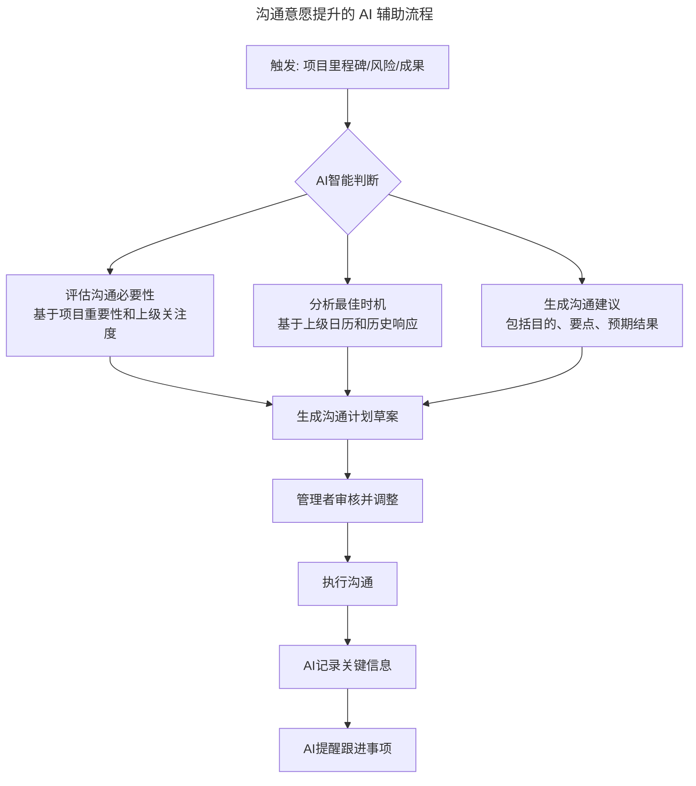
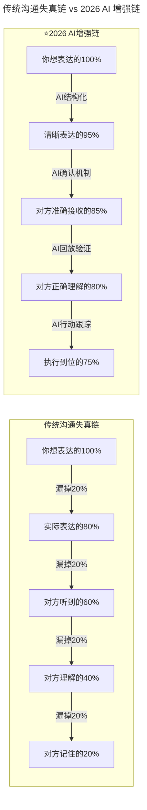
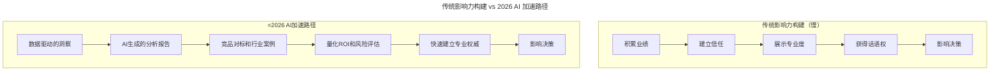

# 第134讲 | 刘建国：我各方面做得都很好，就是做不好向上沟通

> **适用范围**：技术管理者、Tech Lead、向上沟通存在困惑的中基层管理者，以及在 AI 时代希望系统化提升向上管理能力的从业者。
>
> **更新摘要（v2 · 2026-08 更新）**：
> - 结构化升级为 6 节骨架（导言 / 核心方法论 / 关键流程 / 工具与实战 / 常见误区 / 进阶延展）
> - 整合原"AI 时代升级注解（2026）"内容，将四类向上沟通问题与 AI 增强方案系统化归并
> - 补充 Mermaid 图 frontmatter 标题与图后解读，强化工具表与 Prompt 模板的可执行性
> - 融合 2026 行业观察数据（LinkedIn、Harvard Business Review 等）与行动建议

## 1. 导言

> 前百度最佳经理人，果见管理工作坊创始人刘建国老师在他的《技术管理实战 36 讲》专栏中，深入透彻地讲述了"管理沟通"这个主题，其中"向上沟通"一文中，分享了技术管理者们在与上级沟通时常见的坑与痛点，以及对应的解决思路与方案，非常有参考价值，在这里分享给大家。

我曾对超过500位技术管理者进行过调查，统计结果显示，向上沟通是技术管理者们最挑战的管理主题之一。那么具体是哪些事情，让管理者们感到头痛呢？

基于上百个关于向上沟通的问题反馈，我发现有如下四类问题是最为普遍的。

**第一类：和上级能不聊就不聊**。主要说法有：

- "上级太忙了，我的事情好像没有那么重要，等他闲了再说吧。"
- "找不到上级，他很少在工位，每次碰到他都急匆匆地走开，没机会聊。"
- "把领导交代的工作做好就行了呗，有事没事找领导聊啥，最讨厌有事没事讨好领导！"
- "总是觉得和上级有距离感，很难聊到一块儿。"
- "每次见了上级说话都不利索，能用邮件沟通就写邮件吧。"

**第二类：拿捏不好该不该和上级聊的分寸和尺度**。主要说法有：

- "最近取得了一个不错的成绩，要不要和上级说一说呢？"
- "感觉自己离技术越来越远，有些焦虑，是不是可以把上级当作朋友来聊聊呢？"
- "某项目很可能会delay，上次和领导打过招呼了，他不置可否，随着形势越来越严峻，我要不要再跟他说一次呢？"
- "我和合作者有些隔阂，不知道适不适合告诉上级。"
- "上级招我们来是解决问题的，而不是来给上级制造问题的！"

**第三类：很难领会到上级的意图**。主要说法有：

- "上级告诉我这个项目要加紧了，可是要加紧到什么程度呢？"
- "上级把这个工作交给我负责，却又安排别人参与进来，这是不信任我吗？"
- "上级让我去做一个调研，也没有说什么时候要结论，到底急不急呢？"
- "老板到底在想什么呢？他最近突然不找我了……"

**第四类：如何影响上级的一些观点和决策**。主要说法有：

- "老板常常有不靠谱的需求和新想法，我就不知道该如何柔和又不失礼貌地拒绝。"
- "上级对项目进度的需求总是很高，如何管理上级的预期呢？"
- "有个项目需要向领导申请增加人力，如何跟他说呢？"
- "上级总是不采纳我的建议，有何良策吗？"
- "上级不懂业务，还喜欢拍板做决策，怎么应对？"

上面四类问题，覆盖了绝大多数向上沟通场景。由于向上沟通永远是你和上级的"私事"，我们无法给出一个普遍适用、一劳永逸的标准答案，也无法穷举所有的向上沟通场景。但逐个分析这四类最集中的问题，仍是一个好的探讨方法。

在 AI 时代（2026 年，GPT-5.5 与 DeepSeek V4 已深度融入工作流，84% 的开发者使用 AI 辅助编程，Agent 进入加速落地期），向上沟通作为技术管理者的核心挑战，迎来了新的解决思路和工具支持。**向上沟通的本质是建立信任、创造价值、实现共赢**，这一核心原则在 AI 时代依然不变。


雷达图显示，AI 对"影响力放大器"维度改善最显著（90 分），对"意图理解增强"改善相对较低（70 分），这提示我们：AI 擅长做数据驱动的论证与影响力构建，但涉及意图揣摩与情感共鸣的部分仍需人完成。

## 2. 核心方法论

### 2.1 四类向上沟通问题的诊断与解法

**第一类，关于"和上级能不聊就不聊"**。无论是"上级太忙了"、"找不到上级"，还是干脆认为就不该和上级沟通，归结起来，都是没有意识、意愿或能力和上级建立良好的"沟通通道"。

建立良好的沟通通道，可以从以下四个方面着手和审视：

- **沟通意愿**：基本前提。作为管理者，主动向上沟通和反馈是默认期望。审视你的角色（工程师 vs 管理者）和初衷（为自己 vs 为团队），让角色给你沟通的力量和动力。
- **事务特点**：根据事务是否重大、是否紧急、是否敏感、是否正式等，确定沟通的方式和频次。
- **沟通风格**：根据"人"来选择沟通方式。可借助 DISC、盖洛普"四大优势领域"等工具，根据沟通对象的风格特点选用更高效、易接受的沟通方式。
- **信任关系**：审视信任与默契程度，决定是否可以简化沟通。信任决定沟通关系的稳定性，默契代表沟通关系的效率和性能。

**第二类，关于"拿捏不好该不该和上级聊的分寸和尺度"**。大多拿捏不好"该不该聊"的情况，都是由于还没有厘清自己想通过这次沟通拿到什么，即沟通目的不清晰。

沟通总体上有四个目的：**建立通道、同步信息、表达情感和输出影响**。你和上级沟通的目的跳不出这四个，只是需要明确"就什么事"达到上述四种目的中的一个或几个。判断目的重要性时，问自己两个问题：1）这次沟通能给你带来什么价值？2）这次沟通能给上级带来什么价值？

**第三类，关于"很难领会到上级的意图"**。看似是两个人之间的沟通，其实至少是"四个人"之间的对话：你想表达的、你实际表达的、对方听到的和对方对于听到内容的理解，每一步传递都会造成失真。

降低失真带来的误差：**通道品质足够高就靠沟通通道；品质不高就靠沟通工具对齐，沟通层次图及"3F"倾听是不错工具**。用"回放"句式确认（如"你是不是这个意思，……""你看我理解的是否准确，……"）也是好方法。

**第四类，关于"如何影响上级的一些观点和决策"**。这类需求归结起来都是让上级听从自己的看法和方案，即"输出影响"。

说服一个人时，沟通技巧是在"术"的层面起作用；而对说服效果影响更大的因素，却是水面下的冰山，即"势"的部分，也就是你对他的影响力如何。当影响力很小时，技术和方案再优秀，影响力也非常有限。

### 2.2 冰山模型：影响力构建的底层逻辑

"说服影响"的冰山模型示意：

```
水面之上（术的层面）：
├── 沟通技巧
├── 表达方式
├── 数据呈现
└── 时机选择
──────────── 水面 ────────────
水面之下（势的层面）：
├── 专业信任度
├── 过往业绩记录
├── 对业务的深刻理解
└── 个人品牌影响力
```

从上图可以看出，水面之上是"术"（沟通技巧），水面之下是"势"（影响力）。一线工程师提给 CEO 的建议，和 CTO 提给 CEO 的建议，极有可能结果完全不同——不是因为建议质量差异，而是相对影响力的巨大差距。

### 2.3 AI 时代向上沟通的核心原则

尽管 AI 提供了强大的辅助工具，但原文强调的核心原则在 AI 时代更加重要：

| 原则 | AI 时代的新诠释 |
|------|---------------|
| **主动沟通** | AI 降低准备成本，让主动沟通变得更容易 |
| **目的清晰** | AI 帮助你快速厘清目的，但不能替代你的真实意图 |
| **信息对称** | AI 让你更容易获取全面信息，但解读仍需人的智慧 |
| **信任为本** | AI 可以加速信任建立，但无法替代真实的互动和交付 |
| **影响力建设** | AI 是放大器，基础仍然是你的专业能力和业绩 |

## 3. 关键流程

### 3.1 第一类问题：从"能不聊就不聊"到"AI 辅助主动沟通"



流程解读：AI 在该流程中承担"智能判断"角色，从触发事件到跟进提醒形成闭环。管理者始终保留审核与调整环节，确保 AI 建议符合真实情境与人际关系判断。

### 3.2 第三类问题：从"领会意图困难"到"AI 辅助信息对齐"



流程解读：传统沟通漏斗从 100% 衰减到 20%，AI 增强后每一步衰减都大幅收窄，最终执行到位率从 20% 提升至 75%。AI 通过结构化表达、确认机制、回放验证、行动跟踪四个环节对冲失真。

### 3.3 第四类问题：AI 作为影响力放大器



流程解读：传统路径依赖业绩积累逐步建立信任与话语权，周期长；AI 加速路径以数据洞察为起点，通过 AI 生成报告、竞品对标、ROI 量化快速建立专业权威，缩短了从"专业度"到"影响决策"的链路。

## 4. 工具与实战

### 4.1 四类问题的 AI 增强方案对照表

**第一类：AI 辅助主动沟通**

| 传统障碍 | AI 如何帮助 | 实操工具 |
|---------|-----------|---------|
| **不知道聊什么** | AI 分析工作内容，自动识别需要汇报的关键节点 | 项目管理工具 + LLM 集成 |
| **怕打扰上级** | AI 分析上级的沟通偏好和历史响应模式，推荐最佳时机 | 日历分析 + 沟通模式识别 |
| **不知道怎么开口** | AI 根据沟通目的生成开场白和谈话框架 | Prompt 模板库 |
| **准备材料太耗时** | AI 自动汇总项目进展、数据和关键事件 | 数据可视化 + 自动报告 |

**第二类：AI 辅助目的厘清**

| 沟通目的 | AI 辅助方式 | 2026 新增能力 |
|---------|-----------|--------------|
| **建立通道** | AI 分析历史沟通频率和质量 | AI 预测关系发展趋势 |
| **同步信息** | AI 自动生成结构化进展报告 | AI 实时数据仪表盘 |
| **表达情感** | AI 协助组织语言但保留真诚 | AI 情绪分析辅助自我认知 |
| **输出影响** | AI 生成多角度论证材料 | AI 竞品分析和案例挖掘 |

**第三类：AI 减少失真的工具集**

| 失真环节 | AI 解决方案 | 具体做法 |
|---------|-----------|---------|
| 表达不清 | AI 辅助结构化表达 | 使用 AI 润色关键信息，确保准确完整 |
| 接收不全 | AI 会议记录 | 全程转录，避免遗漏 |
| 理解偏差 | AI 回放确认 | 会后发送 AI 生成的理解摘要供确认 |
| 执行走样 | AI 任务跟踪 | 将沟通结论转化为可追踪的任务 |

### 4.2 可执行的 Prompt 模板

**沟通准备 Prompt 模板**：
```
背景情况：
- 最近完成的重要工作：[列举]
- 当前遇到的主要挑战：[列举]
- 需要上级支持的资源或决策：[列举]

请帮我：
1. 判断这次沟通的必要性和紧急程度（高/中/低）
2. 建议最佳的沟通方式（当面/邮件/即时通讯）和时机
3. 生成一个3分钟的沟通框架（包含开场白、3个关键点、结束语）
4. 预判上级可能提出的问题及建议的回答方向
5. 明确我希望达成的具体目标（SMART格式）
```

**意图确认 Prompt 模板**：
```
以下是我和上级最近一次沟通的记录摘要：
[粘贴沟通记录]

请帮我：
1. 提取上级明确表达的期望和要求（原话引用）
2. 识别可能存在歧义或模糊的地方（标注出来）
3. 为每个模糊点生成1-2个确认性问题（用于下次沟通时澄清）
4. 将上级的要求转化为具体的Action Item（包含衡量标准）
5. 生成一份"我理解的任务清单"，供我在下次沟通时与上级确认
```

**预算申请 Prompt 模板**：
```
我正在向公司申请[金额]的预算用于[AI项目/工具/人员]。
公司背景：[行业、规模、现状]
项目目标：[具体目标]
预期收益：[定性描述]

请帮我生成一份面向CEO/CFO的预算申请材料，包括：
1. 一页纸的项目概述（突出战略价值）
2. 详细的成本效益分析（包含定量和定性收益）
3. 竞品或同行的AI布局案例（用来制造紧迫感）
4. 分阶段实施计划和里程碑
5. 风险评估和缓解措施
6. 可能的质疑点和建议的回答话术
```

### 4.3 实战场景：申请 AI 相关预算

| 传统做法 | 2026 AI 增强做法 |
|---------|------------------|
| 口头陈述需求 | AI 生成完整的商业案例分析（BCA） |
| 简单的投入产出估算 | AI 进行详细的 TCO（总拥有成本）分析和 ROI 建模 |
| 模糊的收益描述 | AI 挖掘竞品 AI 布局数据，生成 FOMO（错失恐惧）论据 |
| 被动等待审批 | AI 提前预判可能的反对意见并准备应对话术 |

### 4.4 实战场景：推动 AI 变革或新技术 adoption

| 步骤 | AI 如何助力 |
|------|-----------|
| **Quick Win 案例** | AI 分析历史数据，识别最容易成功的试点场景 |
| **同行标杆** | AI 搜集行业报告和案例，提供社会认同证据 |
| **分阶段承诺** | AI 帮助拆解为 MVP→试点→推广的三阶段计划 |
| **风险管理** | AI 预判潜在阻力来源并制定应对策略 |

## 5. 常见误区

### 5.1 AI 时代向上沟通的禁忌

| 禁忌 | 说明 | 正确做法 |
|--------|------|-----------|
| **用 AI 生成虚假数据** | 一旦被发现，信任彻底崩塌 | 用 AI 整理和分析真实数据 |
| **完全照读 AI 脚本** | 显得机械和不真诚 | AI 提供框架，用自己的语言表达 |
| **把 AI 当作挡箭牌** | "AI 说应该这样做"不是好理由 | "经过分析，我建议……"更有说服力 |
| **忽视情感连接** | AI 处理不了情感，人可以 | 在 AI 准备的素材基础上加入个人关怀 |

### 5.2 第二类问题（拿捏分寸）的认知陷阱

不同的管理者在评判"该不该聊"时会给出不同答案，因为每个人都是基于自己的管理常识（common sense），而每个人在和不同上级打交道过程中形成的常识不同。大多拿捏不好的情况，根本原因是**沟通目的和初衷不清晰**，很多管理者甚至不清楚该如何描述自己的初衷。无法评判哪个目的更重要，只有当事人自己最清楚这个目的对他意味着什么。

### 5.3 第三类问题（领会意图）的"四个人"对话陷阱

看似是两个人之间的沟通，其实至少是"四个人"之间的对话：你想表达的、你实际表达的、对方听到的和对方对于听到内容的理解，每一步都会造成失真。不要高估信息传递的保真度，重要事务必须用"回放"句式确认。

## 6. 进阶延展

### 6.1 效果提升数据（2026 行业观察）

根据 LinkedIn 2025-2026 职场调研：

- 使用 AI 辅助向上沟通的技术管理者，**晋升速度平均快 18 个月**
- AI 生成的数据分析报告使**提案通过率提升 35%**
- 定期使用 AI 做沟通准备的管理者，**上级满意度评分高出 22 分**
- 但需要注意：**过度依赖 AI 会导致个人思考能力退化**

### 6.2 2026 行动建议

1. **本周行动**：回顾过去一个月与上级的沟通，选出一次觉得"没发挥好"的场景，用 AI 重新模拟准备一遍
2. **本月目标**：建立一个个人的"向上沟通知识库"，包括历史沟通记录、上级偏好、成功案例等
3. **季度复盘**：统计向上沟通的频率、质量、反馈等指标，评估 AI 辅助的实际效果

### 6.3 作者简介

刘建国，前百度最佳经理人，果见管理工作坊创始人，TGO 鲲鹏会会员，清华大学高级工商管理硕士（EMBA），百度学院优秀培训讲师，埃里克森国际教练学院教练、盖洛普优势教练，国家认证职业生涯规划师。刘建国有着 10 年的技术团队管理经验，一直专注于对技术新经理的辅导和培养，并创办了"果见管理工作坊"，培训过数百位技术管理者。

### 6.4 延伸阅读

- 第159讲《科学的向上管理》的 AI 升级版 → 了解系统化的向上管理方法论
- 第89讲《一对一沟通》的 AI 升级版 → 了解如何将向上沟通融入日常管理
- 第200/201讲《沟通技巧》的 AI 升级版 → 了解 AI 时代的四维沟通能力模型

---

*本内容基于 2026 年 6 月的技术环境编写，随着 AI 能力演进，建议每季度回顾更新。*
