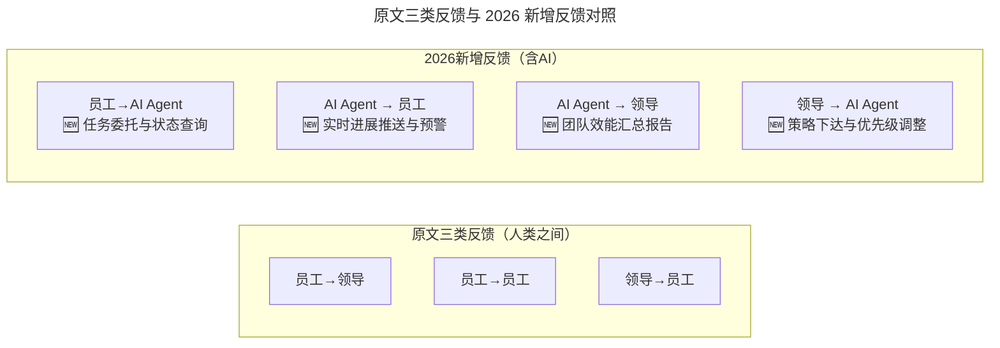
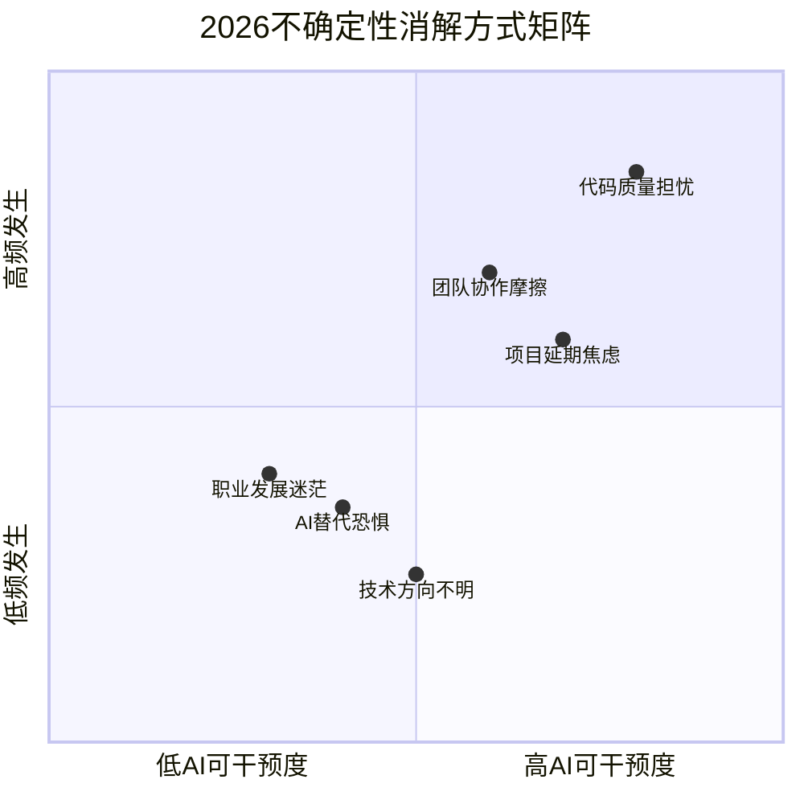

# 第198讲 | 徐林：通过快速反馈建立充满信任的技术团队

> **适用范围**：技术 Team Lead、研发总监、项目经理，以及希望在 AI 时代通过快速反馈机制构建团队信任的技术管理者。
>
> **更新摘要（v2 · 2026-08 更新）**：
> - 结构化升级为 6 节骨架（导言 / 核心方法论 / 关键流程 / 工具与实战 / 常见误区 / 进阶延展）
> - 整合原"AI 时代升级注解（2026）"内容，新增"人↔AI 反馈"第四类反馈机制
> - 补充 Mermaid 图 frontmatter 标题与图后解读，强化不确定性消解矩阵与信任公式升级
> - 融合 2026 行业观察与行动清单

## 1. 导言

没错，人在互动中才能增进了解，相互了解才能建立情感，有了情感才可能加深信任，就像我们常说的"没有什么事情是一顿烧烤解决不了的，如果有就两顿"。但是，建立团队信任只靠"吃饭聊天"是远远不够的。

LinkedIn 首席执行官杰夫·韦纳（Jeff Weiner）认为，"在时间的流逝中保持一致就是信任"，这个"一致"有很多含义，如目标的一致、行动的一致等；微软首席执行官萨提亚·纳德拉（Satya Nadella）认为，"信任=同理心+共同价值观+安全可靠"，他把"同理心"放在了信任等式的第一位，认为无论做什么事情，都需要大家对所做的事情产生共鸣。

虽然两位 CEO 对信任的描述不一样，但是建立信任的方法可以归纳为关键的一点：**通过同理心来确保目标和行动的一致，消除信息不对称**。站在他人的立场思考问题，对他人的关切进行快速反馈是富含同理心的一种表现。

在 2026 年，"通过快速反馈建立信任"这一核心理念在 AI 时代被赋予了全新内涵——**AI Agent 可以实现毫秒级的实时反馈**，彻底改变了信息不对称的消除方式。原文提到的三类反馈机制（员工对领导、员工对员工、领导对员工）在 AI 时代都可以被大幅增强，同时"不确定性导致的焦虑"可以通过 AI 预测和透明化来进一步缓解。

## 2. 核心方法论

### 2.1 原文三类反馈机制

**一、员工对领导的关切快速反馈**

领导最关心的是交给员工的任务什么时候能完成，完成的怎么样或有什么风险。员工如果能做到"凡事有交代，件件有着落，事事有回音"，在领导的眼里才是靠谱的，是值得信任的。例如版本交付，少则几十号人，多则两三百号人，向上级进行开发状态反馈时使用多种不同方式：

- 通过晨会向特性责任人反馈开发和测试风险；
- 通过项目例会向项目经理反馈进展和诉求；
- 通过项目周报向更高级别领导反馈项目偏差和应对措施。

**二、员工对其他员工的关切快速反馈**

团队合作中，每个成员的工作都会和其他人有一些上下游交互，如果上游的人总是能够对下游人的诉求快速响应，无疑会让下游的人感觉更加安心。引入统一研发看板系统后，每一个员工的任务都在看板上可见，任何下游同事都可以看到其依赖的上游员工的进展和潜在的风险，那种一无所知的不信任感很容易就消除了。

**三、领导对员工的关切快速反馈**

员工对于团队未来的规划、发展方向以及个人相关的升职加薪机会都比较关心。领导有责任也有义务为员工建立一个确定的、稳定的和值得信赖的工作氛围：

1. 年初，领导会就业务经营情况、业务规划与全员进行沟通；
2. 在季度会上，领导会与员工进行项目立项、结项情况沟通；
3. 所有员工的任职情况会在第一时间进行全员公示；
4. 基层主管会定期请员工吃饭解疑答惑。

### 2.2 不确定性消除理论

1994 年，心理学家 Freeston 等人提出了"无法容忍不确定的程度（The Intolerance of Uncertainty）"这一概念，简称 IU。一系列研究认为，IU 是担心、焦虑产生和维持的关键影响因素，也是焦虑及焦虑障碍的最重要预测指标。当我们对不确定的焦虑越高时，就会越不相信自己能够影响事情的结果。

从香农的信息论来看，消除不确定性就要引入更多的信息。对于团队中的个人来说：一方面，及时从领导或同事那里获取信息反馈，消除信息不对称带来的不确定性；另一方面，要快速得到所从事工作的结果反馈，消除因果未知的不确定性。

### 2.3 2026 新增第四类反馈：人↔AI 反馈



图解：原文三类反馈均发生在人与人之间，2026 新增了"人↔AI Agent"双向反馈通道，形成员工、领导、AI 三方互联的反馈网络，使信息流动带宽大幅扩展。

### 2.4 2026 信任公式升级

原文核心公式：
- Jeff Weiner（LinkedIn CEO）：**信任 = 时间流逝中的一致性**
- Satya Nadella（微软 CEO）：**信任 = 同理心 + 共同价值观 + 安全可靠**

2026 版信任公式升级：

```
2026版信任公式：

信任 = (一致性 × 同理心 × 安全可靠) ^ AI透明度

其中：
- 一致性：行为可预测（包括AI辅助的行为）
- 同理心：理解他人关切（包括对AI使用的关切）
- 安全可靠：系统稳定 + 数据安全 + AI可控
- AI透明度（新增）：AI决策过程可追溯、可解释、可审计
```

AI 透明度作为指数项，意味着一旦 AI 透明度趋近于 0，无论其他维度多高，信任都会崩塌；反之，高 AI 透明度可以放大其他三维度积累的信任基础。

## 3. 关键流程

### 3.1 AI 增强的三类原始反馈

| 反馈类型 | 传统方式 | AI 增强方式 | 效率提升 |
|---------|---------|-----------|---------|
| **员工→领导** | 晨会/周报/例会 | **AI 自动汇总 Git/Jira 数据生成日报** | 人工投入↓80% |
| **员工→员工** | 统一研发看板 | **AI 实时同步所有依赖任务的进展变化** | 延迟从天级→分钟级 |
| **领导→员工** | 季度会/全员公示/基层沟通 | **AI 个性化推送每位员工关心的信息** | 信息匹配度↑50% |

### 3.2 编码工作中的快速结果反馈

原文实践：通过构筑个人自动化流水线和同行代码评审活动，实现结果信息快速反馈——开发人员通过 IDE 写完一个函数后，可以一个菜单按钮启动个人流水线，流水线会自动完成代码规范检查、编译、打包、部署和测试，几分钟后就可以看到结果；提交代码时，Committer 会进行代码检视并及时反馈检视结果。

面对比较复杂的任务时，测试驱动开发（TDD）是一个能更快获得编码结果反馈的实践，它将复杂问题提前分解成多个测试用例，每次编码的目标都定义为使得某个测试用例通过。

### 3.3 不确定性消解方式矩阵



图解：横轴衡量 AI 可干预度，纵轴衡量发生频率。"代码质量担忧"位于右上角（高频+高 AI 可干预），是 AI 最能发挥价值的消解对象；"职业发展迷茫"位于左下角（低频+低 AI 可干预），需要管理者通过深度对话而非 AI 工具来化解。

### 3.4 AI 驱动的具体消解措施

| 不确定性来源 | 传统消解方式 | AI 增强消解方式 |
|-------------|------------|--------------|
| **编码质量** | Code Review + 测试 | **AI 实时 Code Review + 自动测试覆盖率追踪** |
| **项目进度** | 周报 + 例会 | **AI 基于历史数据的进度预测 + 风险提前预警** |
| **技术方向** | 技术分享 + 架构评审 | **AI 技术雷达图 + 行业趋势分析报告** |
| **个人成长** | 绩效面谈 + 培训 | **AI 技能雷达图 + 个性化学习路径推荐** |
| **团队协作** | 看板 + 站会 | **AI 依赖关系图谱 + 协作瓶颈自动识别** |
| **AI 替代焦虑** | （无） | **明确 AI 定位：Augmentation 而非 Replacement** |

## 4. 工具与实战

### 4.1 AI 时代信任建设 CheckList

| 维度 | 具体措施 | 工具支持 |
|-----|---------|---------|
| **一致性** | AI 使用规范公开透明、决策逻辑可追溯 | Prompt Versioning + Decision Log |
| **同理心** | 理解团队成员对 AI 的不同态度（拥抱/观望/抵触） | 定期 AI 态度调研 |
| **安全可靠** | AI 工具安全合规、数据不泄露、输出可控 | AI Security Scanner + Access Control |
| **AI 透明度** | 所有 AI 参与的任务标注来源、Agent 运行日志可查 | AI Audit Trail |

### 4.2 构建自动化流水线的实践要点

原文案例的核心价值在于"几分钟内拿到结果反馈"，极大减轻了程序员的压力感。在 2026 年的实践中，建议把个人流水线进一步与 AI 代码助手（如 Copilot、Cursor）打通，让"写代码→AI 即时检查→流水线验证→Committer 评审"形成秒级到分钟级的多层反馈闭环。

### 4.3 TDD 的反馈加速价值

TDD 将复杂问题分而治之，每次编码只关注一个用例，问题复杂度降低了，编码的结果反馈也就可以更快地拿到。这一实践在 AI 时代依然适用：可以让 AI 辅助生成测试用例骨架，进一步缩短"问题分解→测试编写→反馈获得"的周期。

## 5. 常见误区

### 5.1 信任只靠"吃饭聊天"

建立团队信任只靠吃饭聊天远远不够。原文强调的"快速反馈消除不确定性"才是底层机制——吃饭聊天只是建立非正式沟通通道的手段，真正的信任来自工作中持续、稳定、可预期的反馈。

### 5.2 把 AI 定位为 Replacement 而非 Augmentation

"AI 替代焦虑"是 2026 年新增的不确定性来源。如果管理者在引入 AI 工具时传递出"用 AI 替代人"的信号，会直接破坏团队心理安全感。正确做法是明确 AI 定位为 Augmentation（增强）而非 Replacement（替代），并通过透明的信息共享让团队理解 AI 的边界与角色。

### 5.3 忽视信息不对称的日常维护

信息对称绝对是一个需要日常长期保持的工作，不但需要向上对称领导的信息，还需要对称公司所处的大环境的信息，更需要对称团队和下属的诉求。很多管理者在信息不对称的情况下，常常会出现自我感觉良好或者感叹怀才不遇的情形——觉得方案好得不得了，却没有去尝试对称领导的想法和公司的战略，只是想一味说服领导，被拒绝后还不忘吐槽一番。

## 6. 进阶延展

### 6.1 小结

人在面对众多不确定性时，会充满焦虑，一个充满焦虑的团队中团队成员会彼此失去信任，团队没有信任就没有了基本的战斗力，更别说发挥潜能挑战更卓越的目标了。作为技术 leader，有义务为每个成员建立一个相互信任的氛围。比较有效的方法是：提倡每个人都发挥同理心，站在对方的角度考虑对自己的诉求，运用各种方法和工具提升团队内各种信息的交换带宽和效率，让每个人的诉求都得到快速反馈，最大程度消除不确定性是建立信任的优秀实践。

### 6.2 2026 行动清单

**本周**
- [ ] 在团队中做一次"**AI 使用现状与态度调研**"
- [ ] 选择一个最让团队"焦虑"的不确定性来源，部署 AI 解决方案试点
- [ ] 建立"**AI 决策日志**"，记录所有由 AI 辅助或 AI 做出的重要决策

**本月**
- [ ] 为团队搭建"**AI 效能透明看板**"（至少包含 5 个关键指标）
- [ ] 制定"**团队 AI 协同契约**"
- [ ] 组织一次"**AI 焦虑疏导工作坊**"，坦诚讨论 AI 带来的挑战和机遇

**本季度目标**
- [ ] 团队对 AI 工具的信任度 > 80%（通过调研测量）
- [ ] AI 相关的信息不对称问题减少 > 70%
- [ ] 人均因不确定性产生的焦虑时间减少 > 50%

### 6.3 作者简介

徐林，TGO 鲲鹏会会员，华为某产品软件总工，专注 Cloud Native，微服务架构设计与实现，曾在 200 多人规模的交付项目中承担版本 SE 工作，负责方案设计团队人力管理，设计任务分解，技术方案裁决，技术风险跟踪，上游部件及下游客户技术沟通等技术管理工作。

### 6.4 延伸阅读

- 核心理念不变——信任建立在信息对称和快速反馈之上——但 AI 为这两个基础提供了前所未有的强大工具
- 建议结合"科学的向上管理"一文，理解信任公式在向上场景的应用
- 建议结合"一对一沟通"一文，理解反馈机制在深度对话中的落地

---

*本内容基于 2026 年 AI 深度普及的现状，对原文"通过快速反馈建立信任"进行 AI 时代升级。*
