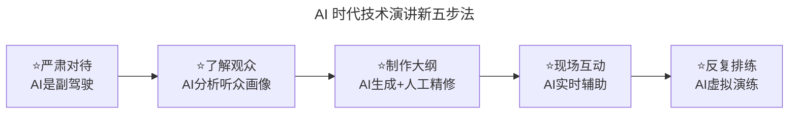
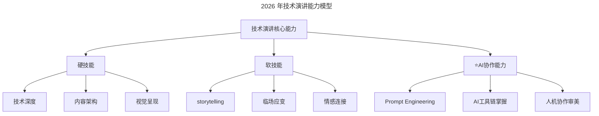

# 第59讲 | 技术演讲，有章可循

> **适用范围**：技术管理者、架构师、Tech Lead、希望提升个人技术影响力的高级工程师，以及在 AI 时代希望系统升级演讲能力的从业者。
>
> **更新摘要（v2 · 2026-08 更新）**：
> - 结构化升级为 6 节骨架（导言 / 核心方法论 / 关键流程 / 工具与实战 / 常见误区 / 进阶延展）
> - 整合原"AI 时代升级注解（2026）"内容，将五步经验升级为 AI 时代"新五步法"
> - 补充 Mermaid 图 frontmatter 标题与图后解读，强化能力模型与 AI Pair Programming Live Show 实践
> - 融合 2026 行业观察数据（Stack Overflow 等）与演讲者心智模型升级

## 1. 导言

技术演讲，是树立个人和公司技术品牌的重要手段。相比撰写技术文章，它的效果也更生动、更直接，加上现场的互动，以及后续媒体的报道，往往能给人留下更深刻的印象。

但是做技术演讲也比写技术文章更难，因为做技术演讲时，你没有反复修改的机会，你必须直面观众、实时答疑，你的错误会被放大甚至广为传播……技术好的人未必能写得好技术文章，技术文章写得好的人也未必能做好技术演讲。不过，技术演讲也不是像天书一样无法琢磨，只靠天赋灵感，还是有一定章法可循的。

2026 年的技术演讲已经进入 **AI 增强时代**。根据 Stack Overflow 2025 年调查，84% 的开发者已经在使用 AI 工具辅助编程，这一趋势同样深刻影响了技术演讲的方式。GPT-5.5、DeepSeek V4 等大模型的成熟，让技术演讲从"纯人工准备"转向"人机协作"新模式。

**核心变化对比**：

| 维度 | 传统模式（2020 前） | AI 增强模式（2026） |
|------|------------------|------------------|
| **PPT 制作** | 手动设计数小时 | AI 辅助生成+精修 30 分钟 |
| **内容调研** | 手动搜索整理 | AI 一键生成大纲+素材 |
| **代码演示** | 预录视频或 Live Coding | **AI Pair Programming Live Show** |
| **问答环节** | 预设 Q&A | **实时 AI 问答助手**（如 NotebookLM） |
| **排练方式** | 自我练习或找同事 | **AI 模拟观众反馈** + 虚拟排练 |

## 2. 核心方法论

### 2.1 技术演讲五步法

**1. 严肃对待**

许多技术不错的人之所以做不好技术演讲，问题不在于技术，而在于态度。技术演讲在两方面有更高要求：1）必须更深入思考已有的技术内容，"知其然也知其所以然"；2）必须以空杯心态对待演讲过程，认清"我懂了"和"我能让你懂"是两个完全不同的问题。

更深入思考已有技术内容：在技术演讲之前，必须反复问自己——分析思路是对的吗，查证的资料是可信的吗，掌握的数据是最准确的吗，看的书是最权威的吗……如果不是，一定要仔细查证，并且保证各环节之间的逻辑是自洽的。

以空杯心态对待演讲：把自己从"假想观众"中区分开来，哪些是自己特有的思维习惯、背景知识、学习方式，这些和典型观众有多少重合？观众有没有办法在这几十分钟内倾注注意力来听取你的表达？

**2. 了解观众**

就像开发系统要了解问题背景一样，做好技术演讲也需要了解你的观众。需要问自己：他们来自哪些领域、哪些公司？主要做的是什么工作？一般都有多少年的工作经验？喜欢听什么样的内容？如果各公司都在强调用户画像，了解用户才能保证产品成功，演讲也是这样。

**3. 制作大纲**

"纲举目张"，提起渔网的粗绳一抛，网眼就自动张开了。对演讲来说，大纲就是那根粗绳。好的大纲一定是重点突出的——按"每八到十分钟一个要点"的节奏来安排，三十分钟的演讲只能包含三个重点。好的大纲一定是有悬念和起伏的——先把最终结果摆出来，吊起读者的胃口，然后逐步展开，并在其中穿插各种生动的故事。

**4. 现场互动**

人在无外界约束状态下能集中注意力的时间大概就是 10 分钟。安排与观众的互动是一个相当巧妙的手段，可以引入意外的因素，让听众感觉新奇，把已经有些溃散的注意力重新聚集起来。一个好的做法是，写完大纲之后，每 10 分钟左右留出一个空档，设计合适的互动插入进去。

**5. 反复排练**

技术演讲其实完全不需要什么天赋，完全是个熟练工。排练参考公式：观众 10 人以下排练一遍就可以；30 人以下排练两三遍；100 人以下排练三到五遍。每一遍排练都要计时，可以随时中断记录改进点，每遍完成后认真复盘。最后那遍排练应当忘掉计时，不许中断，相当于"上线之前的最后验证"。

### 2.2 AI 时代的"新五步法"



图解：新五步法在每一步都引入 AI 协作，但核心结构不变。AI 在严肃对待环节作为"副驾驶"而非替代者；在了解观众环节提供画像分析；在大纲制作环节生成初稿供人工精修；在互动环节提供实时辅助；在排练环节提供虚拟演练。

### 2.3 2026 年技术演讲能力模型



图解：能力模型新增"AI 协作能力"分支，包含 Prompt Engineering、AI 工具链掌握、人机协作审美三个子项。AI 协作能力虽占比 25%，但是乘数因子——如果为零（完全不会用或滥用），总分会被大幅拉低；如果强，可以让硬技能和软技能效果放大 1.5 倍。

### 2.4 第四项核心能力：AI 交互沟通

传统三要素：1）文字表达能力；2）口头表达能力；3）倾听理解能力。

**2026 新增第四要素**：4）AI 交互沟通能力（Prompt Engineering）。

这不是"让 AI 替你写稿"，而是：
- 知道何时该用 AI、何时必须靠自己
- 能精确描述需求，获得高质量的 AI 输出
- 具备判断 AI 产出质量的能力（**批判性思维**）
- 在舞台上自然地与 AI 工具配合，不露痕迹

## 3. 关键流程

### 3.1 严肃对待 → "人机协作"的新严肃态度

- ✅ **AI 不是替代者，而是副驾驶**：用 AI 生成初稿，但必须亲自审核每一个技术细节
- ✅ **警惕"AI 幻觉"**：2026 年的模型仍可能产生错误信息，技术演讲的准确性必须由人类把关
- ✅ **保持"技术品味"**：AI 可以美化表达，但技术深度和独到见解仍是演讲者的核心竞争力

**工作流示例**：
1. 用 Claude/GPT-5.5 生成演讲初稿框架
2. 逐页审核技术准确性（重点！）
3. 加入个人实战经验和独特见解
4. 让 AI 优化语言表达和视觉呈现

### 3.2 了解观众 → AI 驱动的精准用户画像

- ✅ **AI 分析听众背景**：通过活动报名数据、社交媒体公开信息，AI 快速生成听众画像
- ✅ **动态调整内容深度**：根据听众技术水平实时调整（AI 可提供多版本内容建议）
- ✅ **预测听众兴趣点**：基于行业热点和技术趋势，AI 推荐最吸引人的案例

### 3.3 制作大纲 → AI 协同的内容架构

- ✅ **AI 生成多版本大纲**：输入主题，AI 输出 3 种不同结构的大纲供选择
- ✅ **智能时间分配**：根据演讲时长，AI 自动计算每个部分的时间分配
- ✅ **悬念设计增强**：AI 可基于叙事理论，帮助设计更吸引人的故事线

### 3.4 现场互动 → AI 增强的双向沟通

**2026 创新实践 - AI 配对编程演示**：

```mermaid
---
title: AI Pair Programming Live Show 流程
---
sequenceDiagram
    participant T as 演讲者
    participant AI as AI编程助手
    participant A as 投影屏幕
    participant U as 观众
    
    T->>A: 展示需求场景
    AI->>T: 建议代码结构
    T->>A: 实时编写核心逻辑
    AI->>T: 实时代码补全+解释
    T->>U: 讲解设计思路
    U->>T: 提问/建议
    AI->>T: 提供备选方案
    
    Note over T,AI,U: 这不是"照本宣科"<br/>而是展示真实的AI协作过程
```

图解：AI Pair Programming Live Show 不是预录视频，而是演讲者与 AI 助手在投影屏幕上实时协作完成代码编写。观众看到的是真实的 AI 协作过程，包括 AI 建议结构、实时代码补全、提供备选方案等。这比传统的 Live Coding 更具教学价值，但需要稳定的网络和 Plan B。

**注意事项**：
- ⚠️ 网络必须稳定（建议准备离线模式）
- ⚠️ 提前测试 AI 工具响应速度
- ⚠️ 准备 Plan B：如果 AI 卡顿，手动切换到预备代码

### 3.5 反复排练 → AI 虚拟演练系统

- ✅ **AI 虚拟观众**：使用 HeyGen、Synthesia 等工具创建虚拟听众，模拟真实反应
- ✅ **智能反馈系统**：AI 分析你的语速、停顿、肢体语言（通过摄像头），给出改进建议
- ✅ **多维度评估报告**：内容清晰度、吸引力、技术准确性的综合评分

**排练流程（2026 版）**：
1. 第 1 遍：对着 AI 虚拟观众完整演讲（录制视频）
2. 第 2 遍：查看 AI 生成的反馈报告，针对性改进
3. 第 3 遍：重点练习薄弱环节
4. 第 4 遍：完整模拟（不计时的最终验证）
5. 额外：让 AI 生成 10 个可能的刁钻问题，准备应答

## 4. 工具与实战

### 4.1 2026 年技术演讲者工具链

| 工具类别 | 推荐工具 | 用途 |
|---------|---------|------|
| **内容生成** | Claude 4.5 Opus、GPT-5.5 | 大纲、脚本、案例生成 |
| **PPT 制作** | Gamma、Beautiful.ai、Copilot | 一键生成专业幻灯片 |
| **代码 Demo** | GitHub Copilot Workspace | 实时 AI 结对编程 |
| **排练演练** | Yoodli AI、Microsoft Presenter Coach | AI 模拟观众、实时反馈 |
| **资料研究** | NotebookLM、Perplexity | 研究资料快速消化 |
| **图片生成** | Midjourney v7、DALL-E 3 | 配图、架构图 |
| **录制/剪辑** | Descript、Opus Clip | 自动剪辑精彩片段 |
| **传播分发** | LinkedIn AI、Twitter AI | 自动生成多平台文案 |

### 4.2 听众画像分析 Prompt 示例

```
分析以下听众特征，给出演讲策略建议：
- 听众：50人，主要是中高级后端工程师
- 平均经验：5-8年
- 关注领域：微服务、云原生、AI工程化
- 演讲主题：Service Mesh在生产环境的实践

请输出：
1. 内容深度建议（入门/进阶/专家）
2. 最可能感兴趣的3个案例
3. 应该避免的技术细节
4. 互动环节设计建议
```

### 4.3 大纲生成 Prompt 模板

```
请为以下演讲主题生成3个不同风格的大纲：
主题：[你的主题]
时长：[X]分钟
听众：[听众描述]
要求：
- 方案A：问题驱动型（先抛问题再给方案）
- 方案B：案例故事型（以真实案例为主线）
- 方案C：技术演进型（按时间线展开）
每个方案需包含：开场钩子、核心观点、互动环节、结尾金句
```

## 5. 常见误区

### 5.1 2026 年常见陷阱

| 陷阱 | 表现 | 后果 | 解决方案 |
|------|------|------|----------|
| **过度依赖 AI** | 全程读 AI 生成的稿子 | 缺乏个人特色，听众觉得虚假 | AI 负责 80% 初稿，20% 必须是个性化打磨 |
| **忽视技术准确性** | 未验证 AI 给出的技术细节 | 现场被资深听众挑战 | 所有技术论断必须有官方文档或个人验证 |
| **AI 工具翻车** | 网络故障/AI 响应慢 | 演讲中断，专业形象受损 | **始终准备离线版本** |
| **失去个人风格** | 过度使用 AI 润色语言 | 听众感受不到演讲者的热情 | 在关键段落保留口语化和个人表达 |

### 5.2 "托儿"互动的误区

有些人喜欢安排"托儿"来互动，因为担心互动出现意想不到的局面。除非演讲者自己不够自信，而"托儿"的水平又很高，能做到不留痕迹，否则这样搞反而会弄巧成拙。只要演讲者的准备足够充分，对待观众完全是可以以逸待劳的，很难会出现意想不到的尴尬。

### 5.3 忽视观众注意力的 10 分钟规律

人在无外界约束状态下能集中注意力的时间大概就是 10 分钟。技术演讲的观众也处在这种状态下。如果不安排互动，观众的注意力会逐渐溃散。解决方法：写完大纲之后，每 10 分钟左右留出一个空档，设计合适的互动插入进去。

### 5.4 排练不计时

前面的每一遍排练都要计时，都可以随时中断，把想到的可以改进的点记录下来，每一遍完成之后认真复盘，再开始下一遍排练。最后那遍排练应当忘掉计时，不许中断，相当于"上线之前的最后验证"。如果不计时，就无法判断是否超时，也无法优化时间分配。

## 6. 进阶延展

### 6.1 未来展望：2027-2030 的趋势

1. **沉浸式演讲**：VR/AR 技术让观众"走进"技术架构
2. **个性化实时适配**：AI 根据现场反应实时调整内容难度
3. **多语言同步翻译**：实时 AI 同声传译，打破语言障碍
4. **知识图谱可视化**：复杂技术关系自动生成交互式图表
5. **演讲后的持续互动**：AI 聊天机器人延续演讲讨论

### 6.2 给技术演讲者的最后建议

> **"AI 可以让你的演讲准备效率提升 10 倍，但它无法替代你对技术的热爱和对观众的真诚。"**

记住：
- ✅ **技术深度是你的护城河**（AI 无法替代）
- ✅ **真诚是最强的武器**（观众能感受到）
- ✅ **准备 Plan B**（技术永远可能出问题）
- ✅ **享受舞台**（这是你影响力的放大器）

### 6.3 2026 行动建议

1. **本周行动**：选择一个即将进行的技术分享，用 AI 工具生成大纲初稿并人工精修
2. **本月目标**：建立个人的"演讲 AI 工具栈"，明确不同环节的 AI 使用规范
3. **季度复盘**：评估 AI 辅助对演讲准备效率和现场效果的实际影响

### 6.4 延伸阅读

- 第75讲《一本正经教你如何毁掉一场技术演讲》的 AI 升级版 → 从反面角度理解演讲陷阱
- 第60讲《正确对待技术演讲中的失误》的 AI 升级版 → 了解 AI 时代的失误管理
- 第200/201讲《沟通技巧》的 AI 升级版 → 了解 AI 时代的四维沟通能力

---

*本内容基于 2026 年 GPT-5.5、DeepSeek V4、Agent 加速落地期等最新技术动态编写。适用对象：技术管理者、架构师、Tech Lead、希望提升影响力的高级工程师。*
