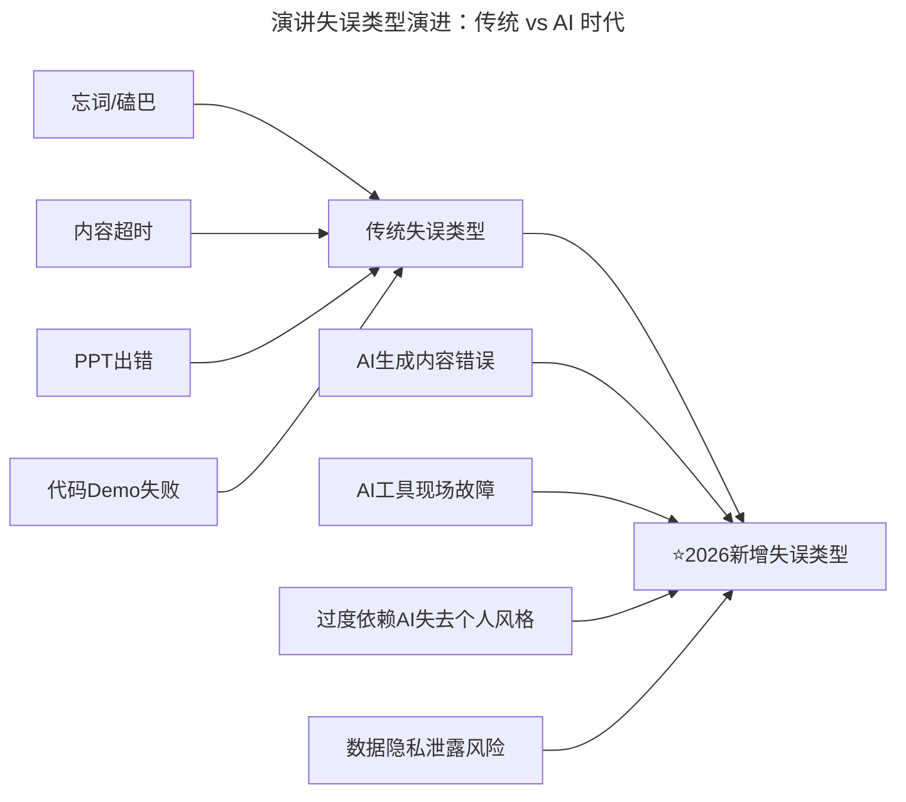
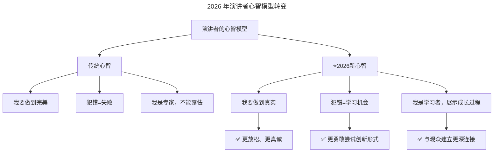
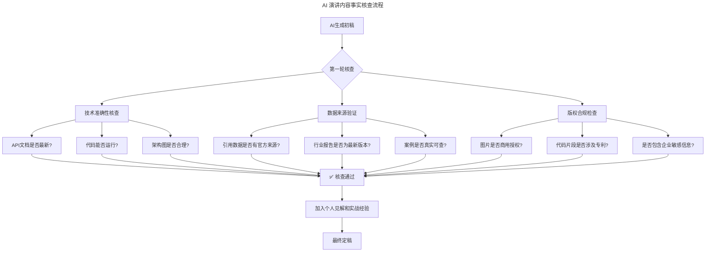
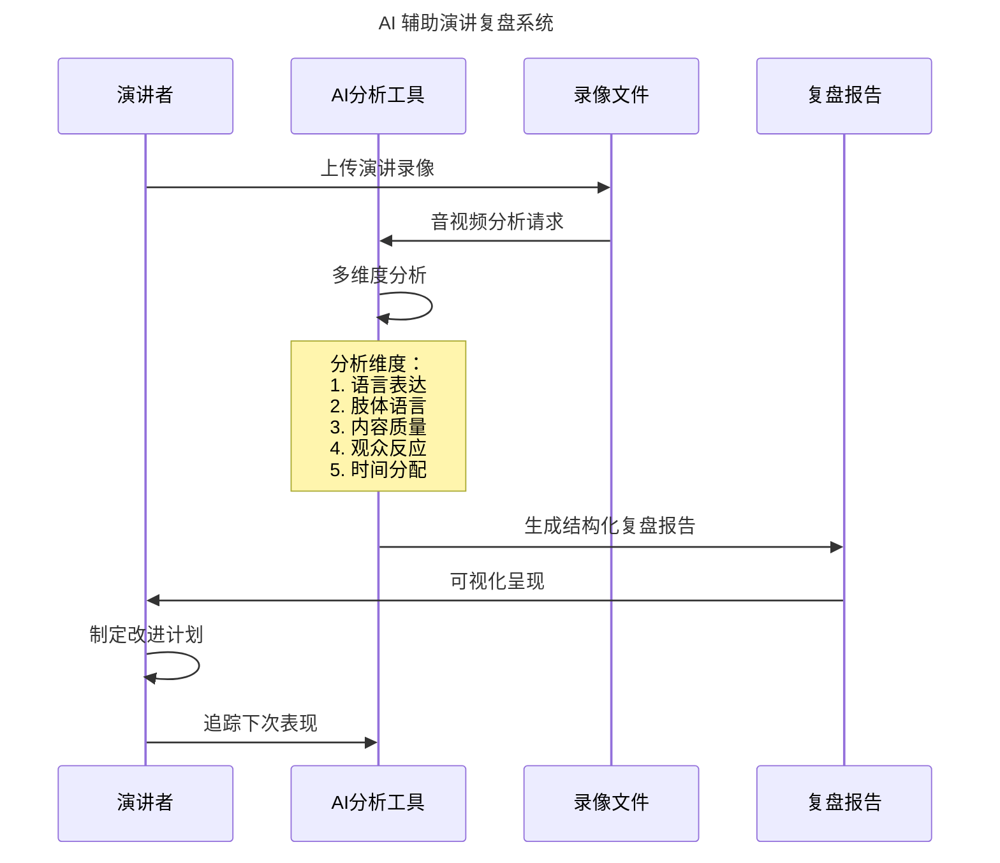

# 第60讲 | 正确对待技术演讲中的失误

> **适用范围**：技术管理者、架构师、Tech Lead、需要在公开场合演讲的工程师、技术布道师，以及在 AI 时代希望建立正确演讲心态、避免 AI 时代新型演讲失误的从业者。适用于技术大会、内部分享、在线课程等演讲场景。
>
> **更新摘要（v2 · 2026-08 更新）**：
> - 结构化升级为 6 节骨架（导言 / 核心方法论 / 关键流程 / 工具与实战 / 常见误区 / 进阶延展）
> - 整合原"AI 时代升级注解（2026）"内容，将原文三原则升级为 AI 时代"新三原则"
> - 为全部 Mermaid 图补充 `--- title: ... ---` frontmatter，并在每张图后追加文字解读
> - 补充 2026 年 AI 幻觉错误、AI 工具翻车等新型失误与"急救包"
> - 将原"推荐工具链"融入工具与实战，原"思考题"融入进阶延展

---

## 1. 导言

### 1.1 为什么演讲恐惧普遍存在

作为技术 leader，不论是为了布道公司技术产品，还是为了打造个人技术影响力，在公众场合演讲是不可避免的。优秀的演讲能力几乎已经成为职场升级中的一门基础技能。

然而，演讲并不是一件简单的事情，对于上台表达自己，人们普遍都会感到害羞、恐惧、焦虑。不少研究都表明，在人们最恐惧的事情中，当众演讲当之无愧的名列榜首，甚至超过了死亡。即使是最伟大的演说家丘吉尔，也把当众讲话列为人生三大难事之一。

### 1.2 核心认知：错误必然发生，重要的是如何应对

许多人对演讲恐惧，是因为害怕犯错误，这种恐惧心理导致人们还没有开始演讲，就已经打了退堂鼓。《演讲之禅》的作者斯科特·博克顿指出，演讲中很难避免一切错误，而是要正确看待它。

斯科特在书中写道："我很清楚自己会犯一些低级错误，但在演讲中，不犯错几乎是不可能的，而且，完美的表演也会显得有些枯燥无味。因此，我不在乎完美，只在乎我的演讲实用、适宜，并能表达我的心声，而追求完美很有可能会成为它们的拦路虎。"

可以说，在演讲中，错误肯定会发生，重要的是如何定位错误以及如何应对错误。好的演讲者，几乎都是跨过一个个坑而来的。

### 1.3 2026 年：AI 时代的新挑战

2026 年的技术演讲环境发生了巨大变化：**AI 工具的普及既带来了新的效率，也引入了新的失误类型**。根据 GitHub Copilot 2025 年度报告，84% 的开发者使用 AI 编程，但其中 37% 的人遇到过"AI 幻觉导致的技术错误公开出丑"。因此，在 AI 时代，演讲失误的管理需要全新的认知框架。

### 1.4 失误类型演进总览



图解：演讲失误从传统类型（忘词、超时、PPT 出错、Demo 失败）演进到 AI 时代新增类型（AI 生成内容错误、AI 工具现场故障、过度依赖 AI、数据隐私泄露）。传统失误依然存在，但 AI 失误成为 2026 年演讲者必须重点防范的新维度。

---

## 2. 核心方法论

### 2.1 原则一：接受不完美的演讲

完美的演讲几乎是不存在的，即使你对内容做好了充足的准备，私底下也排练了很多遍，但当你站上演讲台，面对台下黑压压的一大片人群的时候，你还是极有可能会因为紧张而忘词、磕巴、漏掉准备好的内容。

演讲是一个存在交互的场景，现场的听众、环境、设备都会对最终的演讲效果造成影响。因此，要接受不完美的演讲存在，不要试图避免一切错误的发生，否则，当一些小错误发生时，你反而会猝不及防，甚至可能把小错误变成大失误。

要知道你怎么对待错误，听众就会怎样对待错误。如果不小心说错一句话，你反应得像是世界末日，那么听众就会看得清清楚楚；反之，如果你泰然处之，视之为趣事，听众也自然会照样学样，轻轻跳过这一节。

正如戴尔·卡耐基在《成功演讲指南（Public Speaking for Success）》中所说的："演讲结束后，演讲大师常常会发现自己的演讲有 4 个版本：一个是他们准备要讲的，一个是他们所发表的，一个是报纸报道的，一个是讲完后反思的。"

### 2.2 原则二：演讲前的准备必须慎重

演讲不会完美，并不是你放弃准备，试图到台上自由发挥的理由。一旦你站了上去，你现场的表现以及所表达的观点，就会对你的个人品牌造成影响。

斯科特提出了四项建议：

1. **要有一个鲜明的立场**。所有演讲都要有中心观点，你需要知道你的中心观点是什么。
2. **认真了解你的听众**。你要弄明白他们来听你演讲的原因、他们的需求、背景知识、兴趣爱好，以及他们渴望从你这里学到什么东西。
3. **让观点简洁明了**。论点必须是精炼、简明的，而论据则可能稍长，但是绝不能让听众听得云里雾里、不知所云。
4. **为与自己意见相左的观点做好准备**。如果你的听众专业知识过硬，他们就很有可能会与你观点相左，并在现场提出反驳意见。

最后，演讲者还需要大量的练习，那些前期不多加练习，却期待一上台就能够即兴发挥、侃侃而谈的想法是根本不现实的。

### 2.3 原则三：演讲后的复盘必不可少

接受不完美并不代表接受错误，我们要做的是在演讲之后及时复盘、查漏补缺。一般演讲都会有视频记录，我们可以回看自己的演讲录像，这可以帮助我们客观的了解自己讲得到底如何，演讲中出了什么差错，哪些地方没有达到自己的预期，然后找出到底是什么原因导致你犯了这个错误，是否有方法可以改进，保证下次不会出现一样的失误。

### 2.4 AI 时代"新三原则"升级

| 原文原则 | ⭐2026 升级版 |
|---------|-------------|
| 接受不完美的演讲 | **接受"人机协作的不完美"** |
| 演讲前的准备必须慎重 | **"AI 增强 + 人工核验"的双重准备** |
| 演讲后的复盘必不可少 | **"AI 辅助复盘 + 知识沉淀"** |

### 2.5 2026 年演讲者心智模型



图解：2026 年演讲者心智模型从"追求完美、犯错=失败、专家人设"转变为"追求真实、犯错=学习机会、学习者心态"。这种心态在 AI 时代尤为重要——技术迭代太快，没有人能掌握所有细节，"全知全能"的人设反而显得虚假。

---

## 3. 关键流程

### 3.1 演讲前准备的四项建议（详细展开）

**1. 鲜明的立场**：所有演讲都要有中心观点。即使是一句"这五样东西是我所喜欢的"也表明了你的观点。每当我听到一个糟糕的演讲，我都想问演讲者："你的演讲到底想表达什么意思？"

**2. 了解听众**：弄明白他们来听你演讲的原因、需求、背景知识、兴趣爱好。若没有足够时间将演讲主题研究透彻，那你至少要了解听众。结果可能是你发现自己对某个课题的理解并不是很透彻，但你至少比你的听众要了解得多。

**3. 观点简洁明了**：如果你用 10 分钟才能讲清楚自己的论点，这可不是什么好事。你的论点就是一种声明，而论据则是用来论证观点的。论点必须精炼、简明，论据可能稍长，但绝不能让听众听得云里雾里。一个糟糕的演讲总是让你找不到重点。

**4. 为相反观点做好准备**：如果你的听众专业知识过硬，他们就很有可能会与你观点相左，并在现场提出反驳意见。如果你不知道这些相反观点，就无法提出好的论点，无法与对方更深度的沟通。

### 3.2 演讲后的复盘方法

一般演讲都会有视频记录，我们可以回看自己的演讲录像，不要感到尴尬和害羞。这可以帮助我们客观的了解自己讲得到底如何，演讲中出了什么差错，哪些地方没有达到自己的预期，然后找出原因，是否有方法可以改进。

- 比如开场白太啰嗦，那就为自己设计一个开场白，并不断练习到产生肌肉记忆。
- 比如内容重点失衡，那就在准备的时候，对内容做更详尽的规划，设计出每个部分需要花费的时间。对技术演讲而言，可以采用"坑-解决方案-总结"这种 3 段式的经典结构，并将内容重点放在第二部分优化解决方案上。
- 比如幻灯片出错，这种是完全可以避免的错误，除了自己检查之外，还可以请同事朋友帮忙检查幻灯片。
- 比如语速过快，那就有意识的调整、训练自己，也可以在演讲中时时提醒自己要放慢语速。

### 3.3 AI 时代：可接受 vs 不可接受的失误

**可接受的失误（2026 标准）**：
```
✓ 口语化表达的小错误（忘词、重复）
✓ PPT动画/过渡效果的小瑕疵
✓ AI Demo时的短暂卡顿（如果能幽默化解）
✓ 对边缘案例的回答不够完美
```

**不可接受的失误（2026 红线）**：
```
✗ 核心技术论据被证明是错误的（尤其是AI生成的）
✗ 演示的代码无法运行（Live Coding事故）
✗ 侵犯他人知识产权（AI生成内容的版权陷阱）
✗ 泄露公司机密或用户隐私数据
```

### 3.4 AI 内容"事实核查"流程（2026 新增第 5 项准备）



图解：AI 内容事实核查是 2026 年演讲准备中最重要的一环。AI 生成初稿后需经过技术准确性、数据来源、版权合规三轮核查，全部通过后才能加入个人见解与实战经验，最终定稿。这一流程保障了 AI 辅助内容的技术可信度。

### 3.5 AI 内容核查清单

```markdown
## AI内容核查清单（2026标准版）

### 🔍 技术准确性（必须100%通过）
- [ ] 所有提到的框架/库版本是否为最新稳定版？
- [ ] API接口名称和参数是否与官方文档一致？
- [ ] 架构图是否符合实际实现？
- [ ] 性能数据是否有基准测试支持？
- [ ] 代码示例是否能直接运行？（建议现场前实测）

### 📊 数据真实性
- [ ] 引用的行业报告是否标注来源和发布日期？
- [ ] 统计数据是否来自权威机构（如Stack Overflow、GitHub）？
- [ ] 案例故事是否可以公开讲述（脱敏处理）？

### ©️ 版权与合规
- [ ] AI生成的配图是否使用正版授权素材？
- [ ] 引用的第三方内容是否符合CC协议？
- [ ] 是否涉及竞品公司的敏感信息？

### 🎯 个人特色注入（避免同质化）
- [ ] 是否加入了至少1个个人实战案例？
- [ ] 是否有独特的观点或反直觉的洞察？
- [ ] 开场和结尾是否有个人风格的金句？
```

---

## 4. 工具与实战

### 4.1 AI 时代失误"急救包"

#### 场景 A：AI 生成的代码现场报错

**立即反应（0-5 秒）**：
```markdown
"哦！看起来这里有个小意外。这正是我想展示的——
**即使是最先进的AI工具，也会遇到边界情况**。
让我来手动修复这个问题，同时解释一下为什么会出现这个错误……"
```

**后续行动**：
1. 保持冷静（不要慌张）
2. 将错误转化为教学内容
3. 如果无法快速修复，切换到预备方案
4. 演讲后记录此 bug，避免下次出现

#### 场景 B：被观众质疑数据的真实性

**应对话术**：
```markdown
"非常好的问题！这个数据来自XX报告（展示来源），
同时我也用我们的内部数据做了交叉验证。
不过我理解你的疑虑——**在AI时代，数据真实性确实值得关注**。
如果你感兴趣，会后我可以分享完整的验证过程给你。"
```

**预防措施**：所有数据必须标注清晰来源；准备备用数据源（至少 2 个独立来源）；对于敏感数据，提前说明统计口径。

#### 场景 C：PPT 中 AI 生成的图片被质疑

**预防 > 治疗**：
- ✅ 使用 Midjourney/DALL-E 3 时，选择"照片级真实"模式
- ✅ 所有配图自己先审核一遍
- ✅ 如果被质疑，坦诚说明："这张图是 AI 辅助生成的概念图"

### 4.2 AI 辅助复盘系统



图解：AI 辅助复盘系统上传演讲录像后，从语言表达、肢体语言、内容质量、观众反应、时间分配五个维度进行分析，生成结构化复盘报告，帮助演讲者制定改进计划并追踪下次表现。

### 4.3 2026 年推荐工具链

| 工具类别 | 推荐工具 | 用途 |
|---------|---------|------|
| **PPT 生成** | Gamma、Beautiful.ai | AI 辅助幻灯片制作 |
| **内容生成** | Claude 4.5、GPT-5.5 | 大纲、脚本、案例 |
| **代码 Demo** | GitHub Copilot Workspace | 实时 AI 结对编程 |
| **排练演练** | Microsoft Presenter Coach | AI 实时反馈 |
| **数据分析** | NotebookLM | 研究资料快速消化 |
| **图片生成** | Midjourney v7、DALL-E 3 | 配图、架构图 |
| **视频制作** | HeyGen、Synthesia | 虚拟演讲者/多语言 |

---

## 5. 常见误区

### 5.1 追求完美而放弃演讲

**误区**：因为害怕犯错误而打退堂鼓，追求完美的演讲。

**正确认知**：完美的演讲几乎不存在。接受不完美，在台上放松自己，对演讲而言反而是更好的状态，越轻松表现得越好。演讲中的一些小错误可能只有自己知道，听众很多时候是注意不到的。

### 5.2 放弃准备、自由发挥

**误区**：因为"演讲不会完美"而放弃准备，试图到台上自由发挥。

**正确认知**：演讲不会完美，并不是你放弃准备的理由。前期准备和练习熟悉必不可少，尤其是要有一个鲜明的立场、了解听众、让观点简洁明了、为相反观点做好准备。

### 5.3 过度依赖 AI 而放弃核验

**误区**：认为 AI 生成的内容可以直接用于演讲，不做任何验证。

**正确认知**：2026 年演讲准备中最重要的一环是 AI 内容的"事实核查"流程（技术准确性、数据来源、版权合规）。不可接受的失误红线包括：核心技术论据错误（尤其是 AI 生成的）、演示代码无法运行、侵犯知识产权、泄露机密。

### 5.4 接受不完美 = 接受错误

**误区**：将"接受不完美的演讲"误解为"接受错误"，从而不进行复盘。

**正确认知**：接受不完美并不代表接受错误。要做的是在演讲之后及时复盘、查漏补缺，回看演讲录像，找出错误原因并改进，保证下次不会出现一样的失误。

### 5.5 AI 时代失误管理的核心误区

| 误区 | 正确认知 |
|------|---------|
| 追求完美、拒绝犯错 | 犯错=学习机会，展示成长过程更真诚 |
| 全知全能的人设 | "全知全能"在 AI 时代反而显得虚假 |
| 忽视 AI 内容核验 | 技术准确性的标准比以往任何时候都高 |
| 把失误当灾难 | 优雅地将失误转化为学习时刻 |

---

## 6. 进阶延展

### 6.1 核心心智转变

**核心转变**：
- ❌ 旧思维："我是来教大家的专家"
- ✅ 新思维："我来分享我的探索过程，包括弯路"

这种心态在 2026 年尤为重要，因为：
1. **技术迭代太快**，没有人能掌握所有细节
2. **AI 普及后**，"全知全能"的人设反而显得虚假
3. **Z 世代听众**更欣赏真实、谦逊、持续学习的态度

### 6.2 2026 年失误管理的三个关键词

1. **准备充分**（特别是 AI 内容的核查）
2. **心态开放**（接受不完美）
3. **持续进化**（每次演讲都是成长机会）

### 6.3 应对失误的经典示范

**场景 1：发现 AI 给出的技术数据有误**
```markdown
❌ 错误应对：
"呃……这个数据好像是错的，让我看看……"
（慌乱、长时间沉默、专业形象崩塌）

✅ 正确应对（2026版）：
"刚才这个数据点，我在准备时主要参考了XX报告和AI的分析。
不过在现场我想补充一点：实际生产环境中，
根据我们团队的经验，这个数字可能会有10-20%的浮动。
这也提醒我们——**即使是AI辅助的数据，也需要结合实战验证**。
感谢大家让我有机会澄清这一点！"
```

**场景 2：AI Demo 工具突然无响应**
```markdown
❌ 错误应对：
反复尝试、焦急等待、说"这工具怎么这样"
（浪费大家时间，显得不专业）

✅ 正确应对（2026版）：
"看来我的AI助手今天有点'情绪化'😄。
这正是我想展示的一点——**在生产环境中，
我们必须始终准备好降级方案（Graceful Degradation）**。
接下来我将手动完成这个演示，大家可以对比一下
人工方式和AI方式的差异。"
（将失误转化为教学时刻）
```

### 6.4 思考题

你在演讲中是否犯过错误呢？是如何应对的呢？在 AI 时代，如果你在演讲中遇到 AI 生成的错误数据或 AI 工具故障，你会如何优雅地将失误转化为学习时刻？

### 6.5 最后的建议

> **"2026 年最成功的技术演讲者，不是那些从未犯错的人，而是那些能够优雅地将失误转化为学习时刻的人——无论这些失误是来自人类自身，还是来自 AI 工具。"**

### 6.6 延伸阅读

- 第 59 讲《技术演讲，有章可循》的 AI 升级版 → 了解技术演讲的正向方法论
- 第 75 讲《一本正经教你如何毁掉一场技术演讲》的 AI 升级版 → 从反面角度理解演讲陷阱
- 第 200/201 讲《沟通技巧》的 AI 升级版 → 了解 AI 时代的四维沟通能力

---

*本内容基于 2026 年 GPT-5.5、DeepSeek V4、84% 开发者用 AI 编程等最新技术动态编写。特别关注：AI 时代的失误管理、人机协作的最佳实践。*
