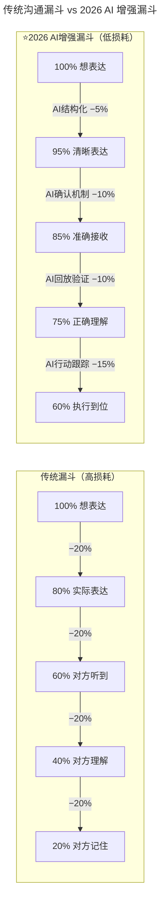
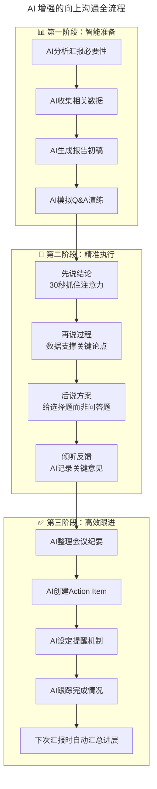
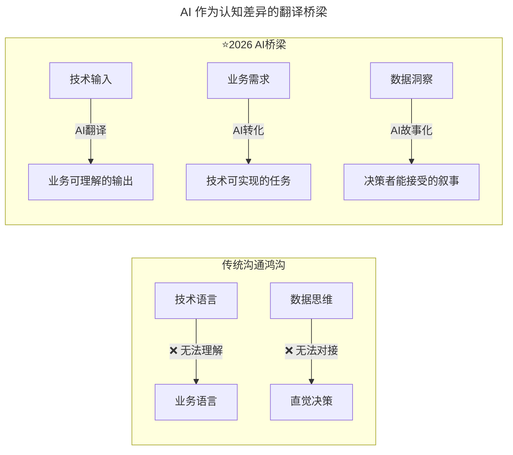

# 第200讲 | 邱良军：沟通，沟通，还是沟通

> **适用范围**：技术团队主管、研发经理、跨团队协作负责人，以及在 AI 时代希望系统提升向下/同级/向上三维沟通能力的技术管理者。
>
> **更新摘要（v2 · 2026-08 更新）**：
> - 结构化升级为 6 节骨架（导言 / 核心方法论 / 关键流程 / 工具与实战 / 常见误区 / 进阶延展）
> - 合并原"上篇（沟通难度与阶段）"与"下篇（向下/同级/向上沟通）"内容，整合 AI 时代升级注解
> - 补充 Mermaid 图 frontmatter 标题与图后解读，强化四维沟通能力模型与沟通漏斗对比
> - 融合 2026 行业观察数据（McKinsey、Deloitte 等）与三维沟通场景的 AI 增强方案

## 1. 导言

《PMBOK 指南》将沟通管理划为一个专门的知识领域，**建议项目经理花 75% 以上的时间在沟通上。根据美国普林斯顿大学的调查报告，在所有对工作产生影响的因素中，沟通占的比例高达 75%。而我们工作中出现的 80% 问题都是由沟通不当造成的**，可见沟通的重要性，因为沟通实在太难了。

多数时候，我们只想着表达自己的观点，只关注自己想说什么，会尽量使用漂亮的 PPT、华美的语言、一堆的数据、甚至引章据典，**而不关心别人听懂没有**，没有思考别人是否想听，别人是否听得懂。

在 2026 年，GPT-5.5 与 DeepSeek V4 已深度融入工作流，84% 的开发者使用 AI 辅助编程，Agent 进入加速落地期。沟通作为技术管理者的核心能力，在 AI 时代迎来了第四维度的扩展——从三维（文字、口头、倾听）升级到四维（新增 AI 交互沟通）。


图解：四维能力模型中，"AI 交互沟通"作为全新维度被加入。倾听理解虽无法被 AI 替代，但成熟度上限高；AI 交互沟通则因 Agent 编排能力的兴起成为最具差异化价值的维度。

## 2. 核心方法论

### 2.1 沟通难的四大原因

**第一种：立场、利益、背景差异**。当双方缺乏信任，或处于敌对状态时是无法沟通的，这时沟通和所说内容的对错没有必然关系，对方只想找差错。在公司中，经常会因为组织架构设计的不合理，造成团队利益的冲突，从而产生很多无效沟通。

**第二种：语言、专业知识、职位、环境的巨大差异**。本质上是思维方式、常识、知识储备的不一致造成的认知差异，这样的沟通成本非常巨大，需要恶补相关知识、参加专业培训消除鸿沟才能够创造沟通的条件。

**第三种：沟通信息衰减**。语言文字是主要的沟通方式，但光靠语言文字会有歧义。有研究表明，对话沟通中语言起到的作用仅占 38%，而肢体语言所占的比例高达 55%。这就形成了沟通漏斗：

- 第一个漏掉 20%：你想表达的是 100%，实际表达的只有 80%；
- 第二个漏掉 20%：听者只接收了 60%；
- 第三个漏掉 20%：听者只理解、听懂了 40%；
- 第四个漏掉 20%：最后听者只记住了 20%。

**第四种：沟通交流者的心态**。和企业、团队的组织架构及文化有关，例如保护阶段不愿主动沟通、性格或心情原因敷衍了事、自以为是或高高在上等心态，都容易在沟通中把简单问题复杂化。

### 2.2 沟通漏斗的 AI 增强对比



图解：AI 增强后，每个衰减环节的损耗都大幅收窄，最终"执行到位"从 20% 提升到 60%。其中 AI 结构化表达把第一跳损耗从 20% 降到 5%，是收益最显著的环节。

### 2.3 沟通阶段与技巧

中国式管理大师曾仕强描述沟通有四个层次：**不沟不通，沟而不通，沟而能通，不沟而通**。前两个阶段是沟通最困难的阶段，需要采取非常规手段做沟通破冰：

1. 在缺乏信任的情况下，**努力找到双方共同的朋友**，这是建立信任最有效的方式。
2. **寻找双方共同的点**，比如共同的兴趣爱好、相似的工作经历、校友、老乡等。
3. **用信息互换的方式做沟通**，通过告知对方想要知道的信息来开始最初的沟通交流。
4. **体验式沟通**，比如非常流行的拓展活动，是技术团队初创时期或士气低落时一种有效的沟通方式。

后面两个阶段——**沟而能通、不沟而通是高效沟通的开始**。第一层是公司或团队的日常沟通，可以通过邮件、留言等异步方式；第二层是彼此有默契的阶段，通常 1 对 1 采用非正式沟通；最高层是心有灵犀的境界，双方聚焦在具体事情的处理上。

### 2.4 第四维度：AI 交互沟通能力矩阵

| 子能力 | 具体表现 | 应用场景 | 成熟度等级 |
|--------|---------|---------|-----------|
| **需求翻译** | 将模糊需求转化为精确 AI 指令 | 让 AI 生成代码/文档/分析 | 入门必会 |
| **上下文管理** | 为 AI 提供充分背景但不冗余 | 多轮对话信息组织 | 进阶关键 |
| **输出引导** | 通过约束条件引导 AI 产出 | 控制输出格式/风格/深度 | 高效必备 |
| **错误纠正** | 快速识别 AI 错误并引导修正 | 处理幻觉/逻辑错误 | 专家标志 |
| **多 Agent 协调** | 设计多 Agent 协作流程 | 复杂任务分治整合 | 领导力体现 |

### 2.5 沟通"六颗心"+ AI

原文提出沟通应抱有"六颗心"：**尊重之心、真诚之心、做事之心、赞赏之心、信任之心、感恩之心**。在 AI 时代，这六颗心不仅没有过时，而且更加重要：

| 六颗心 | AI 时代的新诠释 | AI 如何辅助而不替代 |
|--------|---------------|-------------------|
| **尊重之心** | 尊重每个人的独特性和贡献 | AI 帮助更好地了解每个成员的特点和需求 |
| **真诚之心** | 真诚是 AI 无法模拟的核心品质 | AI 可以润色语言，但真诚必须来自内心 |
| **做事之心** | 用结果说话，用数据证明 | AI 让数据收集和分析变得更容易 |
| **赞赏之心** | 及时认可和鼓励 | AI 提醒不要忘记赞美，但赞美的内容必须是真实的 |
| **信任之心** | 信任是高效沟通的基础 | AI 可以帮助建立透明的信息共享机制 |
| **感恩之心** | 感谢他人的支持和帮助 | AI 帮助记录和追踪需要感谢的人和事 |

## 3. 关键流程

### 3.1 技术团队内沟通（向下沟通）要点

带着"六颗心"与团队成员平等沟通，根据团队差异灵活使用方法：
- 自律自驱型成员：以关怀、支持为主，把问题本质解释清楚，让员工自由思考；
- 自律性较差成员：以督促指导为主，出现状态问题时可公开但不点名地指出；
- 做事敷衍推诿的成员：沟通方式带一定严肃、严厉性。

五个要点：
1. **充分信任自己的团队**：对核心成员充分授权，以鼓励为主。
2. **不回避问题和矛盾**：以事实和数据为依据做沟通，把事情说开。
3. **重要的事情要沟通到位**：明确说明工作任务委派、重大事故通报、公司年度战略等。
4. **学会聆听**：使用启发及引导的方式让团队成员说出真实想法。
5. **组织专项沟通会**：对于公司层面的流言蜚语，不要尝试 1 对 1 沟通，组织专项沟通会。

### 3.2 跨团队沟通（同级沟通）要点

同级沟通的核心是"不预设立场，不做主观假设，保持一颗谦虚的心"：
1. 沟通中不做假设，不以道听途说的信息为依据，更不能攻击对方；
2. 同级沟通中需要特别注意顾及对方的面子，给予充分的尊重；
3. 跨团队沟通需要更积极主动；
4. 寻找共同的利益出发点，要有舍小利顾大局的格局。

### 3.3 与老板（领导）沟通要点

1. 老板反复强调的问题，需要仔细思考并充分理解；
2. 向老板汇报工作务必提前做好准备：先说结论，再说过程，使用结构性思维；
3. 定期和老板做沟通反馈，主动说出工作瑕疵，不要怕麻烦老板；
4. 解决实际困难时：把问题调查描述清楚（最好有数据支撑），给出 2~3 个方案及利弊分析，让老板做选择题而不是问答题。

### 3.4 AI 增强向上沟通全流程



图解：三阶段流程中，AI 主导智能准备与高效跟进，人主导精准执行。核心是"先结论→再过程→后方案"的汇报结构，配合 AI 模拟 Q&A 演练，把"被问住"风险降到最低。

### 3.5 AI 时代沟通阶段升级

```mermaid
---
title: AI 时代沟通阶段升级
---
flowchart TD
    subgraph "第一阶段：破冰期"
        S1["不沟不通<br/>信任为零"] -->|AI辅助| S1A["⭐AI分析共同点<br/>生成破冰话题<br/>提供背景资料"]
        S1A --> S2
    end
    
    subgraph "第二阶段：建立期"
        S2["沟而不通<br/>有尝试但效果差"] -->|AI辅助| S2A["⭐AI优化表达方式<br/>调整沟通渠道<br/>提供数据支撑"]
        S2A --> S3
    end
    
    subgraph "第三阶段：高效期"
        S3["沟而能通<br/>建立基本信任"] -->|AI辅助| S3A["⭐AI自动化常规沟通<br/>聚焦高价值对话<br/>深化情感连接"]
        S3A --> S4
    end
    
    subgraph "第四阶段：默契期"
        S4["不沟而通<br/>高度默契"] -->|AI辅助| S4A["⭐AI预测需求<br/>主动推送信息<br/>维护关系健康度"]
        S4A --> S4
```

图解：原文四阶段（不沟不通→沟而不通→沟而能通→不沟而通）在 AI 时代每个阶段都可加速。AI 在破冰期提供话题，建立期优化表达，高效期自动化常规沟通，默契期预测需求。

## 4. 工具与实战

### 4.1 三大沟通场景的 AI 增强方案

**向下沟通 AI 增强**：

| 沟通要素 | 传统做法 | 2026 AI 增强做法 |
|---------|---------|------------------|
| **任务委派** | 口头或邮件描述任务 | AI 生成清晰的任务说明书（包含验收标准） |
| **进度跟踪** | 定期询问或等待汇报 | AI 自动汇总各人进展并识别风险 |
| **反馈给予** | 凭印象和记忆 | AI 基于数据分析提供客观反馈素材 |
| **问题发现** | 依靠观察和成员主动报告 | AI 分析工作模式异常，提前预警 |
| **个性化沟通** | 凭经验判断成员特点 | AI 分析成员偏好，建议最佳沟通方式 |

**同级沟通 AI 增强**：

| 沟通阶段 | AI 如何助力 | 具体做法 |
|---------|-----------|---------|
| **事前调研** | 了解对方团队背景和诉求 | AI 分析对方的公开项目、汇报、历史决策 |
| **方案设计** | 寻找共赢空间 | AI 做多目标优化分析，识别帕累托最优解 |
| **话术准备** | 确保表达得体有说服力 | AI 根据对方风格调整语言和论证逻辑 |
| **执行记录** | 保证信息准确完整 | AI 全程记录，避免"各说各话" |
| **跟进管理** | 确保承诺兑现 | AI 自动跟踪双方行动项完成情况 |

**向上沟通 AI 增强**：

| 沟通环节 | 传统挑战 | AI 如何解决 | 效果提升 |
|---------|---------|-----------|---------|
| **时机判断** | 不知道什么时候该汇报 | AI 分析项目节点和历史模式，提示最佳时机 | 不再错失机会 |
| **材料准备** | 收集整理耗时耗力 | AI 自动拉取数据、生成报告初稿 | 准备时间减少 80% |
| **内容组织** | 不知道说什么、怎么说 | AI 生成结构化的汇报框架 | 表达更清晰有力 |
| **问题预判** | 怕被问住答不上来 | AI 模拟领导可能的问题并准备答案 | 更从容自信 |
| **跟进管理** | 说完就忘了 | AI 自动创建任务并跟踪 | 执行到位率提升 |

### 4.2 冲突调解 Prompt 模板

```
我需要与[对方角色]就[议题]进行沟通，目前存在较大分歧。
我的立场：[描述]
对方的立场（据我了解）：[描述]
共同目标：[如果有]

请帮我：
1. 分析双方的立场差异点和可能的共同利益点
2. 将我的观点重新组织为更易被接受的表达方式（避免对抗性语言）
3. 预判对方可能提出的反对意见及建议回应
4. 设计一个双赢的解决方案框架（如果可能）
5. 为这次沟通准备3个"破冰"话题
```

### 4.3 跨团队沟通 Prompt 模板

```
我需要与[其他团队/部门]就[议题]进行沟通。
背景：
- 我的团队目标：[描述]
- 对方团队目标（据我了解）：[描述]
- 历史合作情况：[描述成功/失败案例]
- 当前分歧点：[列举]

请帮我：
1. 分析双方的立场差异和潜在共同利益
2. 设计一个双赢的解决方案框架（如果有）
3. 为这次沟通准备开场白和关键论点
4. 预判对方可能的顾虑和建议回应
5. 如果一次沟通不能解决，设计一个分阶段的推进计划
6. 生成一份"沟通备忘录"模板（用于记录共识和待办）
```

### 4.4 工作汇报 Prompt 模板

```
我需要向[领导级别]汇报[时间段/项目]的工作进展。
我的角色：[职位]
汇报对象：[领导的职位和风格特点]

原始数据和信息：
1. 完成的主要工作：[列举及量化结果]
2. 进行中的工作：[列举当前状态]
3. 遇到的挑战：[诚实描述]
4. 需要的支持：[具体列出]
5. 下阶段计划：[简要说明]

请帮我生成一份面向高管的汇报材料：
1. 一页纸执行摘要（突出最重要的3-5个结论）
2. 关键指标仪表盘（建议呈现方式和图表类型）
3. 用STAR法则重新组织主要成就（情境-任务-行动-结果）
4. 将挑战重新包装为"机遇+需要的支持"（正面表述）
5. 准备3个不同深度的版本（1分钟/5分钟/15分钟）
6. 预判领导可能提出的5个问题及建议回答
```

### 4.5 AI 桥梁：认知差异的翻译



图解：AI 充当技术与业务、数据与决策之间的"翻译器"。它把技术输入翻译成业务可理解的输出，把业务需求转化为技术可实现的任务，把数据洞察故事化为决策者能接受的叙事。

## 5. 常见误区

### 5.1 沟通不畅的后果

一般技术团队是比较单纯的，并且团队成员多数不善于沟通，通常不会出现这么多复杂的场景。但是由此得出技术团队不需要沟通的结论就大错特错了。恰恰相反，技术团队的沟通更为重要，尤其是当技术团队发展到一定规模（30 人以上）时，沟通交流的瓶颈就会显现：团队的每个成员都很努力，大家的能力在此之前也是被证明过的，但就是感觉沟通困难、做事困难，**别人不配合（原本的默契没了），自己不被理解，感觉心累**。

如果不及时解决沟通问题，就肯定会演变为不信任问题，若是任由问题发展下去，最后团队就会分崩离析。

### 5.2 沟通渠道单一

原文案例：2013 年带团队时，一个核心骨干提出离职，经过多次沟通发现双方其实并没有实质性的分歧。他在原本的岗位上做的很好，平时的工作沟通中也没有发现任何问题，但由于这份工作对他来说缺乏挑战，慢慢就感到了枯燥，他也经常和同学交流此事，但由于缺乏沟通，管理者一直没有注意到这个信息，直到最后他提出离职。**这是一个典型的沟通渠道单一的问题，没有做非正式的沟通，不能走进团队成员的心里**。

### 5.3 AI 时代沟通的红线

| 红线行为 | 为什么危险 | 正确做法 |
|------------|-----------|-----------|
| **用 AI 伪造数据** | 一旦被发现，信用彻底破产 | 用 AI 整理和分析真实数据 |
| **让 AI 代替你做所有决定** | 丧失判断力和责任感 | AI 提供建议，人做最终决策 |
| **在敏感沟通中照读 AI 脚本** | 显得机械和不真诚 | AI 提供框架，用自己的话表达 |
| **用 AI 回避面对面沟通** | 损害人际关系和信任 | 明确哪些沟通必须面对面进行 |
| **把 AI 当作"替罪羊"** | "这是 AI 的建议"不是好借口 | 对所有输出负责并能解释原因 |

### 5.4 AI 时代沟通的新挑战

| 新挑战 | 表现 | 应对策略 |
|--------|------|---------|
| **过度依赖导致技能退化** | 离开 AI 就不会写/不会说 | 定期进行"无 AI"沟通练习 |
| **失去个人风格** | 所有沟通都像 AI 生成的 | 在 AI 草稿基础上加入个人特色 |
| **信息安全风险** | 向 AI 泄露敏感信息 | 使用企业级 AI 工具，注意数据脱敏 |
| **人际关系疏离** | 用 AI 替代了本该面对面的沟通 | 明确 AI 不能替代的场景，坚持人际互动 |

### 5.5 向上沟通的认知错误

团队主管比较容易犯的认知错误：认为自己最了解团队，而老板是不了解的，老板是瞎指挥。得出这样的结论通常是你的认知和见识太浅。当你得出以上结论时，就不要想太多，由于信息的不一致（多数是你的信息缺失），你无法理解其中的原委。如果一定要想，请做反思：你汇报给老板的信息是否全面，是否存在偏差，这个可能影响了老板的决策。

## 6. 进阶延展

### 6.1 效果提升数据（2026 行业观察）

根据 McKinsey 2025-2026 全球调研：
- 掌握 AI 交互沟通的技术管理者，**工作效率平均提升 40%**
- 使用 AI 辅助的跨部门沟通，**误解率降低 60%**
- AI 增强的汇报材料使**决策速度提升 35%**
- 但需要注意：**完全依赖 AI 的沟通会导致信任度下降 25%**

根据 Deloitte 2025-2026 技术领导力调研：
- 使用 AI 辅助沟通的技术管理者，**团队满意度平均提升 20%**
- AI 增强的跨部门沟通使**项目协作效率提升 35%**
- 系统化的向上沟通使**资源获取成功率提高 40%**
- 但需要注意：**过度使用 AI 会导致个人沟通技能退化**

### 6.2 总结

沟通无处不在，做管理就是做沟通，技术团队的管理也不例外。沟通不仅仅是能说会道，还包括了管理者对事情的认知、个人的经历、沟通的方式、沟通的技巧、个人的修养等。沟通能力是一个人情商的集中反映，懂得沟通会让你的职业走的更远、更稳。

沟通是一种可以被训练，是每个人都可以学习的一种能力，每一个技术管理者都应该努力提升自己的沟通能力。对于正在找工作的技术人员，一个小建议是，请务必让 HR 安排一次和直线领导的沟通，如果存在沟通障碍将会是非常麻烦的事情，需要慎重考虑。

### 6.3 2026 行动建议

1. **本周行动**：评估自己在四维沟通能力模型中的强弱项，制定提升计划；选择一个即将发生的沟通场景（向下/同级/向上），试用对应的 Prompt 模板做准备
2. **本月目标**：建立个人的"AI 沟通工具箱"，收集常用的 Prompt 模板和最佳实践；为三类沟通场景分别建立个人的"最佳实践库"
3. **季度复盘**：统计各类沟通场景的时间和效果，识别 AI 最能发挥价值的领域；评估 AI 辅助对不同沟通场景的实际效果，调整使用策略

### 6.4 作者简介

邱良军，极智嘉研发总监，TGO 鲲鹏会会员，负责组建极智嘉苏州研发团队，以及筹建苏州研发中心，4 个月将团队发展到 40 人，并承接两个系统开发，数条支持线的工作。曾在新电任职超 10 年，带领团队交付数个项目，团队峰值人员超 70 人。2014 在文思海辉担任总监，从零开始将团队带至 300 人。18 年 IT 老兵，管理经验丰富。

### 6.5 延伸阅读

- 第201讲《沟通技巧（下）》的 AI 升级版 → 了解 AI 如何增强具体的沟通场景
- 第89讲《一对一沟通》的 AI 升级版 → 了解 AI 增强的一对一沟通 SOP
- 第86讲《高效会议指南》的 AI 升级版 → 了解 AI 如何变革会议沟通
- 第134/159讲《向上沟通/管理》的 AI 升级版 → 了解系统化的向上管理方法论

---

*本内容基于 2026 年 6 月的技术环境编写，随着 AI 能力演进，建议每季度回顾更新。*
