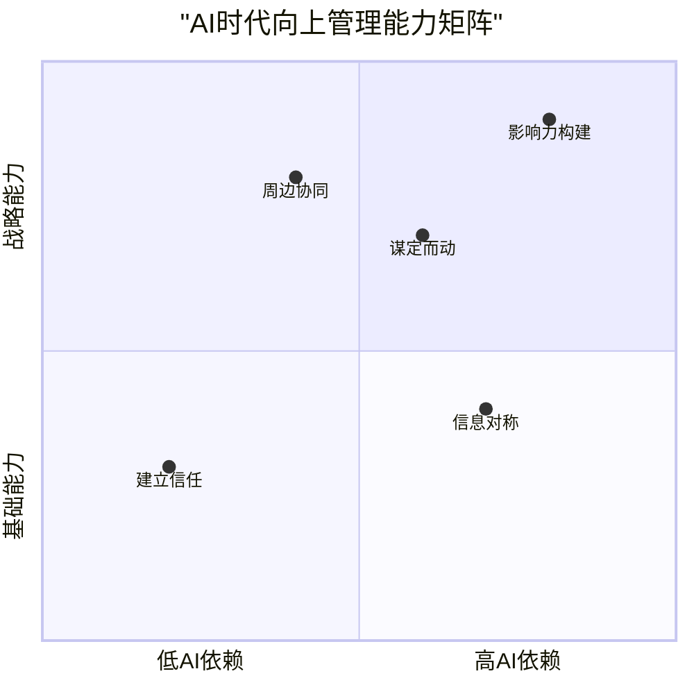
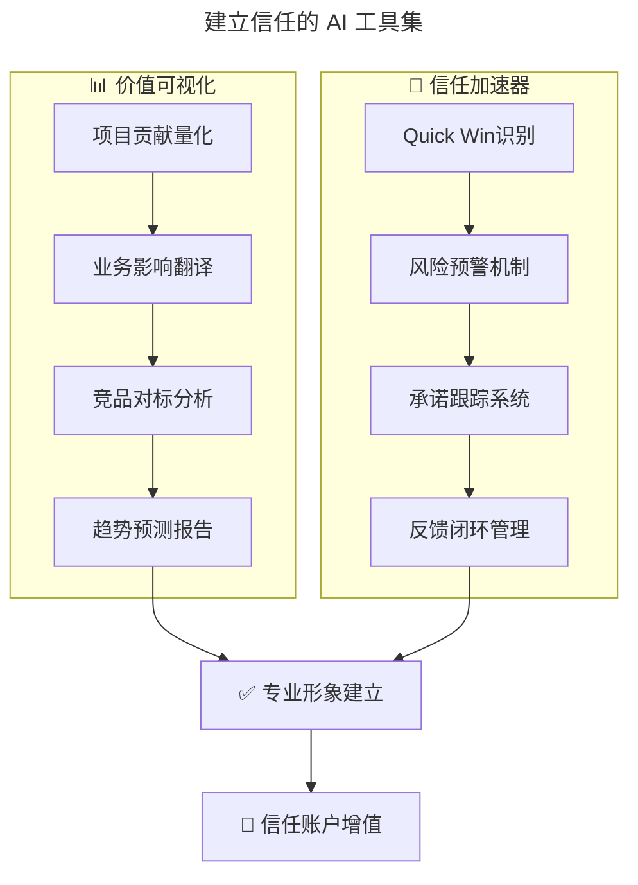
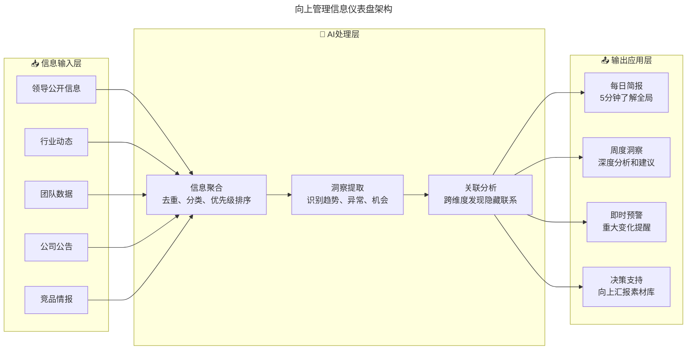
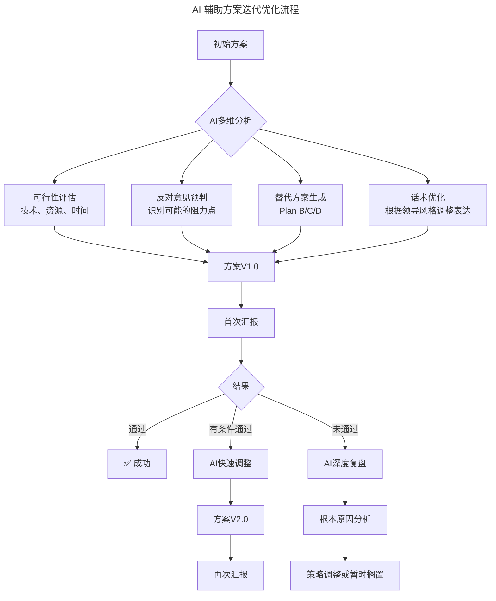

# 第159讲 | 黄云：技术管理者如何科学的做好向上管理

> **适用范围**：技术管理者（一线 Tech Lead、技术总监、CTO）、非技术型企业中的技术负责人、希望提升向上管理能力、为团队争取更好资源和环境的管理者，以及在 AI 时代希望用数据与 AI 工具增强向上管理效能的技术领导者。
>
> **更新摘要（v2 · 2026-08 更新）**：
> - 结构化升级为 6 节骨架（导言 / 核心方法论 / 关键流程 / 工具与实战 / 常见误区 / 进阶延展）
> - 整合原"AI 时代升级注解（2026）"内容，将向上管理四大支柱升级为 AI 增强实践
> - 为全部 Mermaid 图补充 `--- title: ... ---` frontmatter，并在每张图后追加文字解读
> - 补充 AI 时代向上管理的典型场景实战、ROI 数据与行动建议
> - 将原"作者简介"融入导言，原"延伸阅读"融入进阶延展

---

## 1. 导言

### 1.1 一个典型的"向上管理失败"案例

近日，嫦娥四号登陆月球背面的消息刷爆了朋友圈，NASA 也发推祝贺。其实早在 60 年代，阿波罗 17 号的宇航员哈里森·施密特就曾尝试去推动 NASA 将阿波罗 17 号的登月舱降落地点选在月球背面，但最终失败，从而遗憾终生。

从施密特的角度出发，这算是一次典型的"向上管理"失败，也由此可见"向上管理"是多么的重要。对于技术管理者特别是非技术型公司的技术管理员而言，向上管理更为重要，有时候甚至关乎到整个团队乃至公司的生存。

### 1.2 为什么要做"向上管理"

陈春花在谈"向上管理"的时候，引用了彼得·德鲁克在《卓有成效的管理者》一书中的一句话来阐述为什么要做向上管理，"工作想要卓有成效，下属发现并发挥上司的长处是关键"。

这和我们很多技术领导者的认知恰恰相反，很多技术领导者更偏向于向下管理、向上负责，加之技术员大概率的闷骚属性，对于需要涉及复杂关系处理的向上管理，那是能不碰就不碰。

然而，一个合格的技术管理者，理应"向上管理，向下负责"，需要本着对公司负责、对团队负责、对员工负责的态度，做好向上管理，让领导做更正确的决策，为团队争取更好的环境和更公平的待遇。特别是非技术型企业，决策的高管通常都是业务出身，对技术通常是敬而远之，对于需要花钱来做活动这种可以看得见的东西还可以理解，但是诸如需要抽调精英技术力量来做底层基础架构这种事情却较难沟通，这种情况下，技术管理者如何科学的去做好向上管理，就显得尤为重要了。

### 1.3 作者简介

黄云，TGO 成都分会学习委员，川报观察 CTO，四川日报报业集团媒体融合发展技术委员会委员。

---

## 2. 核心方法论

### 2.1 向上管理的四大支柱

原文提出的向上管理四大支柱——**信任基础、信息对称、谋定而动、周边协同**——在 AI 时代不仅依然有效，而且每个环节都可以被 AI 显著增强。

#### 支柱一：信任基础

**核心观点**："赢得信任最有效的方式依然是用事实说话。多打硬仗，多解决问题，多干实事都是可以让信任值飙升的有效方式。"

建立信任是一个循序渐进的过程。技术管理者经常抱怨那些做销售的部门更容易让领导信任，"做得好的不如说得好的"、"会哭的娃儿有奶吃"。对于销售部门，领导能很直观的评判一件事情的投入产出比；而技术，在传统企业往往不是最核心的位置，所以更需要领导的深度信任才能更好的实现向上管理。

对于技术领导者而言，最有效的方式还是需要结合技术特色，扬长避短。"Talk is cheap，show me the code"，赢得信任最有效的方式依然是用事实说话。

#### 支柱二：信息对称

**核心观点**："信息对称绝对是一个需要日常长期保持的工作，不但需要向上对称领导的信息，还需要对称公司所处的大环境的信息，更需要对称团队和下属的诉求。"

有了信任的基础，并不表示领导就会对你言听计从，只是让你有了和领导对话的可能。要做到有效的向上管理，找适当的时机用适当的语言也是极为关键的因素。信息对称是前提，只有上知领导所忧下知员工所想，才可能让你的建议或意见更能为领导所接受。

#### 支柱三：谋定而动

**核心观点**："向上管理肯定不是一次就能成功的，正确的心态一定是一次没成功，那就换个姿势，再来一次。一定要沉住气，然后根据领导的反馈，重新审视自己的提议或者方案。"

单纯就某项具体的事情而言，必须清楚，向上管理肯定不是一次就能成功的。如果辅助一些说服手段收效就能更明显，多发一些类似观点的大咖文章或者请外地的业内大拿来神助攻都是很好的曲线救国方法。绝对不要抱着一蹴而就的心态，也不要被拒绝或者没通过就放弃治疗。在没找到第二次汇报的机会期间，不断完善方案、做好一些前期准备或者去做一些小范围的验证是更好的选择。

#### 支柱四：周边协同

**核心观点**："向上管理不是单纯的直线向上，还需要协助决策领导解决周边障碍。"

很多时候，直线领导是最容易认同你的，因为经常在一起，彼此交流的会多一些，信息对称的也会最到位。但有时候，由于周边环境存在的各种障碍（如关系的平衡、其他领导的认知不统一等），会导致直线领导无法去落实你的想法，这时候，就需要你将向上管理的范畴放大，协助领导去解决好周边的障碍，为最终目标的实现提供干净的外围环境。

### 2.2 AI 时代向上管理能力矩阵



图解：AI 时代向上管理能力矩阵将五大能力按"AI 依赖度"和"战略层级"两个维度定位。建立信任位于低 AI 依赖、基础能力区；信息对称、谋定而动的 AI 依赖度较高，周边协同相对更低、更依赖人际协同；影响力构建位于高 AI 依赖、战略能力区，是 AI 赋能价值最大的方向。

### 2.3 "向上管理，向下负责"的认知澄清

有人说，向上管理是一种心机主义，我不甚认同，有心和有心机是有着本质区别的两个词。作为一个技术管理者，理应站在自己专业的角度，本着对公司负责、对团队负责、对下属负责的态度，用心为团队的发展争取更多的资源，争取更好的团队环境。

---

## 3. 关键流程

### 3.1 支柱一：信任基础 → AI 加速信任建立

**原文核心观点**：赢得信任最有效的方式依然是用事实说话。

**⭐2026 AI 增强方案**：

| 传统信任建立方式 | AI 加速方式 | 效果提升 |
|----------------|-----------|---------|
| **靠时间积累业绩** | AI 量化展示每项工作的价值和影响 | 信任建立速度提升 2-3 倍 |
| **口头汇报成果** | AI 生成数据仪表盘和可视化报告 | 说服力和专业度显著提升 |
| **被动等待认可** | AI 主动识别并提示"可汇报时刻" | 不再错失展示机会 |
| **模糊的价值描述** | AI 将技术贡献转化为业务语言 | 让非技术领导也能理解价值 |

**建立信任的 AI 工具集**：



图解：AI 信任加速器分为"价值可视化"和"信任加速器"两大组件。价值可视化负责量化项目贡献、翻译业务影响、竞品对标、趋势预测；信任加速器负责识别 Quick Win、风险预警、承诺跟踪、反馈闭环。两者共同建立专业形象，实现信任账户增值。

**价值量化的 Prompt 模板**：
```
我最近完成了以下工作，需要向非技术背景的上级汇报价值：
[列举具体工作和成果]

请帮我：
1. 将每项技术工作转化为业务语言（如：提升效率X%、降低成本Y万元、缩短周期Z天等）
2. 生成一份一页纸的"价值贡献报告"，包含数据图表建议
3. 识别2-3个可以持续追踪的关键指标（KPI）
4. 预测这些工作对未来3-6个月的潜在影响
5. 生成一段30秒的"电梯演讲"版本（用于非正式场合）
```

### 3.2 支柱二：信息对称 → AI 实现全方位信息对齐

**原文核心观点**：信息对称绝对是一个需要日常长期保持的工作。

**传统信息对称的主要挑战**：
- **时间有限**：无法持续关注所有信息源
- **渠道分散**：信息散落在各种系统和沟通中
- **处理不过来**：即使收集到也来不及整理分析

**AI 如何解决这些挑战**：

| 信息类型 | 传统做法 | ⭐2026 AI 增强做法 |
|---------|---------|------------------|
| **领导动向** | 偶尔听到只言片语 | AI 汇总领导的公开讲话、邮件、会议纪要中的关键信息 |
| **行业动态** | 抽空看几篇报道 | AI 每日推送定制化的行业简报（5 分钟读完） |
| **团队状态** | 靠感觉和观察 | AI 分析团队的工作产出、协作频率、情绪指标 |
| **公司战略** | 等正式通知 | AI 从多个渠道交叉验证，提前感知战略方向变化 |

**信息仪表盘架构**：



图解：向上管理信息仪表盘采用"输入层→AI 处理层→输出应用层"三层架构。输入层汇集领导信息、行业动态、团队数据、公司公告、竞品情报五类信息；AI 处理层进行信息聚合、洞察提取、关联分析；输出应用层提供每日简报、周度洞察、即时预警、决策支持四种应用。

**信息对称的 Prompt 模板**：
```
请帮我建立一套"向上管理信息仪表盘"。
我的角色：[职位]
我的上级：[职位/姓名/风格特点]
公司背景：[行业、规模、现状]

请设计以下内容：
1. 需要持续关注的5类关键信息（分别说明为什么重要）
2. 每类信息的最佳获取渠道和频率
3. 信息处理的优先级判断标准
4. 一份"每日5分钟信息简报"模板
5. 异常情况的预警信号和应对建议
```

### 3.3 支柱三：谋定而动 → AI 辅助方案迭代优化

**原文核心观点**：向上管理肯定不是一次就能成功的，正确的心态一定是一次没成功，那就换个姿势，再来一次。

**AI 在"谋定而动"环节的核心价值**：快速迭代、多角度论证、风险预判



图解：AI 辅助方案迭代优化流程中，AI 对初始方案进行可行性评估、反对意见预判、替代方案生成、话术优化四维分析，形成方案 V1.0。首次汇报后根据结果分支处理：通过即成功；有条件通过则 AI 快速调整为 V2.0 再汇报；未通过则进行根本原因分析，决定策略调整或暂时搁置。

**方案迭代的 Prompt 模板**：
```
我准备向领导提议[方案名称]，但之前类似提议没有被通过。
方案内容：[详细描述]
之前的反馈：[领导的原话或态度]
我的判断：[我认为失败的原因]

请帮我：
1. 分析上次失败的根因（从领导视角、时机、表达方式等多维度）
2. 对当前方案进行SWOT分析（特别关注劣势和威胁）
3. 生成3个不同版本的提案（保守版、平衡版、激进版）
4. 为每个版本设计不同的切入点和话术
5. 预判领导可能提出的5个质疑及建议回答
6. 制定一个分阶段的推进计划（如果一次不能完全通过）
```

### 3.4 支柱四：周边协同 → AI 赋能利益相关方管理

**原文核心观点**：向上管理不是单纯的直线向上，还需要协助决策领导解决周边障碍。

**AI 如何助力**：

| 协同场景 | AI 如何助力 |
|---------|-----------|
| **识别关键利益相关方** | AI 分析组织架构和历史决策，找出影响力网络 |
| **理解各方诉求** | AI 汇总各方的公开表态、历史行为模式 |
| **寻找共同利益点** | AI 进行多目标优化分析，找到共赢空间 |
| **制定游说策略** | AI 为不同利益相关方定制化沟通方案 |
| **监控态度变化** | AI 跟踪各方反应，及时调整策略 |

**利益相关方分析的 Prompt 模板**：
```
我正在推动[项目/倡议]，需要获得组织内多方支持。
项目目标：[描述]
可能涉及的利益相关方：[列出已知的相关方]

请帮我：
1. 绘制完整的利益相关方地图（包括隐性的相关方）
2. 分析每个相关方的：权力大小、支持程度、核心诉求、潜在顾虑
3. 识别最关键的3-5个需要重点攻克的对象
4. 为每个关键对象制定个性化的沟通策略
5. 设计一个"由易到难"的争取支持路线图
6. 预判可能的联盟和对抗关系，给出应对建议
```

---

## 4. 工具与实战

### 4.1 场景一：汇报 AI 项目进展

| 步骤 | 具体做法 | AI 辅助 |
|------|---------|--------|
| **1. 数据准备** | 收集项目的关键指标 | AI 自动从 Jira/Git/监控系统拉取数据 |
| **2. 洞察生成** | 分析数据和趋势 | AI 识别异常、瓶颈、亮点，生成洞察 |
| **3. 报告撰写** | 撰写进展报告 | AI 生成结构化报告初稿 |
| **4. 可视化** | 制作图表和 Dashboard | AI 推荐最佳可视化方式并生成 |
| **5. 汇报演练** | 准备讲解和 Q&A | AI 模拟领导可能的问题并准备答案 |

**项目汇报 Prompt 模板**：
```
我需要向[领导级别]汇报[AI项目名称]的最新进展。
项目背景：[一句话描述]
项目周期：[开始时间至今]
当前状态：[红/黄/绿灯]

原始数据如下：
[粘贴关键指标和数据]

请帮我生成一份面向高管的进展汇报材料：
1. 执行摘要（200字以内，突出最重要的3个结论）
2. 关键指标仪表盘（建议哪些指标、如何呈现）
3. 主要成就和里程碑（用数据说话）
4. 当前面临的挑战和风险（诚实但有解决方案）
5. 下阶段计划和资源需求
6. 领导可能关心的5个问题及建议回答
```

### 4.2 场景二：申请 AI 预算/资源

**原文提到的"七天完胜对手"案例在 AI 时代可以这样升级**：

| 传统做法 | ⭐2026 AI 增强做法 |
|---------|------------------|
| 提前做好技术选型 | AI 辅助技术选型分析，生成对比矩阵 |
| 功能规划清晰 | AI 基于用户需求自动生成功能优先级列表 |
| 快速原型开发 | AI 辅助代码生成，开发速度提升 3-5 倍 |
| 数据支撑充分 | AI 生成详细的 ROI 分析和商业案例 |
| 展示竞争优势 | AI 实时监控竞品动态，突出差异化价值 |

### 4.3 向上管理案例：信任的建立与消耗

**信任建立的正面案例**：2011 年，我刚进报社的时候，报社给我们技术团队的定位还只是维护 PC 网站，地位边缘化的可能性很大。但在同对手的一款 APP 创新产品的遭遇战中，团队用七天就完成了对手耗时半年多还没有开发完成的功能并抢先上线，然后又火速被报社打造成了纸媒行业的标杆产品，可谓"一战成名"，这让技术团队的地位得到极大提升，并从此逐渐成为主角，摆脱了被边缘化的命运。

**信任消耗的负面案例**：曾经，我们技术团队在公司举办年会的时候，做了些炫技的操作，通过人工控制 2 台 PAD 来做效果的叠加互动，虽然排练期间都非常顺利，但关键时刻却掉了链子，导致互动效果大打折扣。后来又有两次技术创新类的现场活动出现意外，导致我们领导对技术团队承担活动的能力大为怀疑。凡事都有两面，信任也是会被不断消耗的，技术管理者时刻保持清醒是必须的。

### 4.4 构建向上影响力的行动清单

- [ ] **建立定期沟通机制**：每周或每两周固定时间向上级汇报（15-30 分钟）
- [ ] **提前准备议程**：每次沟通前明确 3 个要讨论的核心议题
- [ ] **用数据说话**：避免主观描述，用具体数字支撑观点
- [ ] **理解上级优先级**：研究上级关注的 KPI 和战略重点
- [ ] **提供选项而非问题**：带着 2-3 个解决方案去沟通，而不是只抛出问题
- [ ] **及时同步风险**：坏消息要早报，不要等到无法掩盖再说
- [ ] **确认理解一致**：用"回放"句式确认："您看我的理解是否准确...?"

### 4.5 信息对称的实操建议

要做好信息对称，如果能和领导和员工经常保持沟通自然是最好的，如果不能，那挖掘部门内的消息灵通人士并和他们保持密切关系是个不错的选择，运维工程师和 HR 是很好的"标的"。技术管理者要做好向上管理，还是需要有一颗"八卦的心"，只有这样，你才能知道领导可能会接受什么，以什么样的方式接受。

---

## 5. 常见误区

### 5.1 向上管理 = 讨好领导

**误区**：向上管理是一种心机主义，是讨好领导。

**正确认知**：向上管理不是讨好领导，而是本着对公司负责、对团队负责、对员工负责的态度，做好向上管理，让领导做更正确的决策，为团队争取更好的环境和更公平的待遇。有心和有心机是有着本质区别的两个词。

### 5.2 只向下管理，不做向上管理

**误区**：很多技术领导者偏向向下管理、向上负责，能不碰向上管理就不碰。

**正确认知**：一个合格的技术管理者，理应"向上管理，向下负责"。特别是非技术型企业，技术管理者如何科学的做好向上管理，往往关乎到整个团队乃至公司的生存。

### 5.3 信息不对称导致的"怀才不遇"

**误区**：技术领导者在信息不对称的情况下，自我感觉良好或感叹怀才不遇，觉得自己方案好的不得了，却没有尝试对称领导的想法和公司的战略，被拒绝后还不忘吐槽。

**正确认知**：大部分时候领导都是聪明的，掌握的信息量更大，所做的决策需要考虑的方面也更多。不要单纯的认为领导啥都不懂。信息对称是向上管理的前提，需日常长期保持。

### 5.4 一蹴而就，被拒就放弃

**误区**：抱着一蹴而就的心态，向上管理一次没成功就被拒绝或放弃治疗。

**正确认知**：向上管理肯定不是一次就能成功的，正确的心态一定是一次没成功，那就换个姿势，再来一次。被拒绝后应完善方案、做前期准备或小范围验证，寻求下次汇报机会。"人生没有白走的路，每一步都算数。"

### 5.5 AI 时代向上管理的常见误区

| 误区 | 表现 | 正确做法 |
|------|------|---------|
| **AI 替代关系建设** | 认为有了好报告就不需要维护关系 | AI 是工具，人际关系仍是基础 |
| **过度包装数据** | 用 AI 让普通成果看起来很厉害 | 诚实呈现，用 AI 挖掘真正的价值 |
| **忽视时机判断** | 任何时候都用 AI 生成完整报告 | 根据场合选择合适的汇报深度 |
| **把 AI 当借口** | "这是 AI 的分析结果"推卸责任 | 对 AI 产出的结果负责并能够解释 |

---

## 6. 进阶延展

### 6.1 效果提升数据（2026 行业观察）

根据 Gartner 2025-2026 CIO 调研：

- 使用 AI 辅助向上管理的技术领导者，**战略议题的被采纳率提升 40%**
- AI 生成的数据分析使**预算审批通过率提高 28%**
- 系统化的信息对称使**决策失误率降低 35%**
- 但需要注意：**过度依赖 AI 会降低面对面的沟通技能**

### 6.2 给技术管理者的 ⭐2026 行动建议

1. **本周行动**：选择一个正在进行的重要项目，使用"价值量化 Prompt 模板"生成一份贡献报告
2. **本月目标**：建立个人的"向上管理信息仪表盘"，每天花 5 分钟浏览 AI 生成的简报
3. **季度复盘**：回顾过去一个季度的向上管理实践，识别 AI 最能发挥价值的场景

### 6.3 结语：向彼得·德鲁克致敬

陈春花在"向上管理"一文的结束语中引用道："在向上管理上，彼得·德鲁克还认为，有效的管理者了解他的上司也是普通人，肯定有其长处和短处。如果能在上司的长处上下功夫，协助他做好工作，便能在帮助上司的同时也带动下属自己。要使上司发挥所长，不能靠唯命是从，应该从正确的事情着手，并以上司能够接受的方式向其提出建议"。

希望我们的技术管理者都能成为向上管理的高手！

### 6.4 延伸阅读

- 第 134 讲《向上沟通问题》的 AI 升级版 → 了解四类向上沟通挑战的 AI 解决方案
- 第 88/89 讲《一对一沟通》的 AI 升级版 → 了解如何在日常管理中实践向上管理
- 第 86/87 讲《高效会议指南》的 AI 升级版 → 了解如何利用会议场景做向上管理

---

*本内容基于 2026 年 6 月的技术环境编写，随着 AI 能力演进，建议每季度回顾更新。适用对象：技术管理者、CTO、非技术型企业中的技术负责人。*
