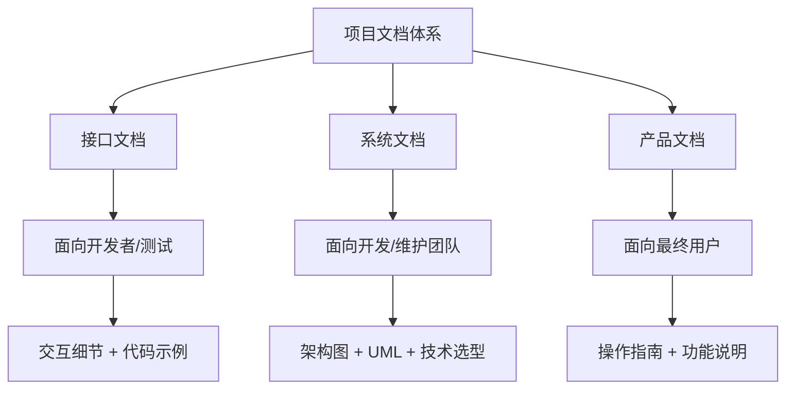
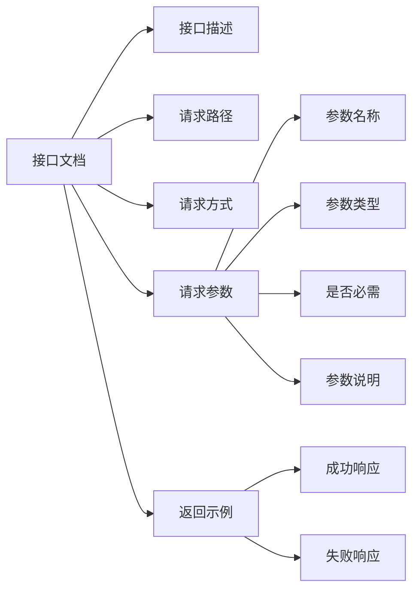
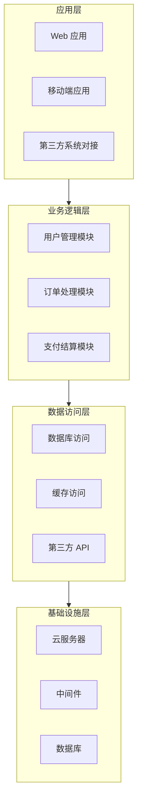
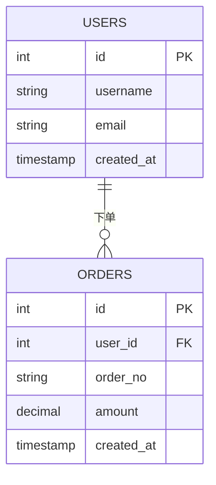
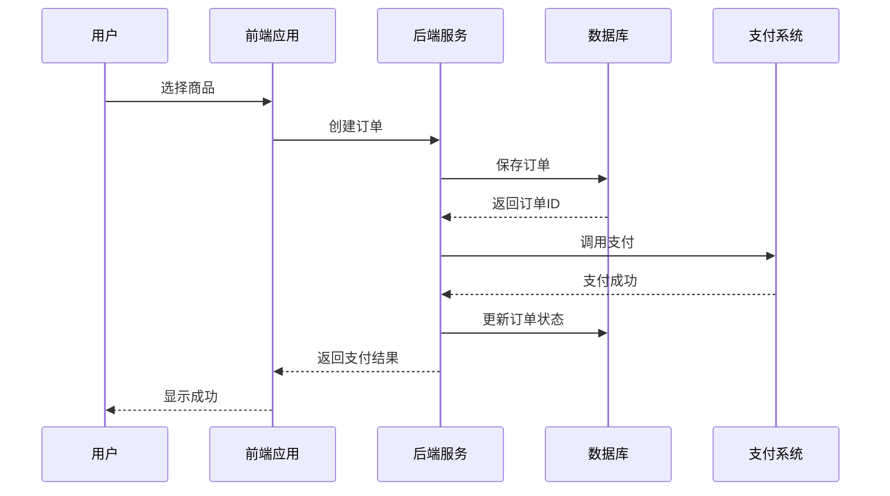
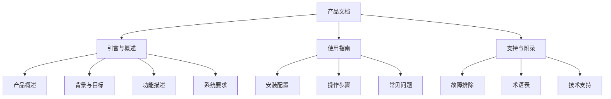
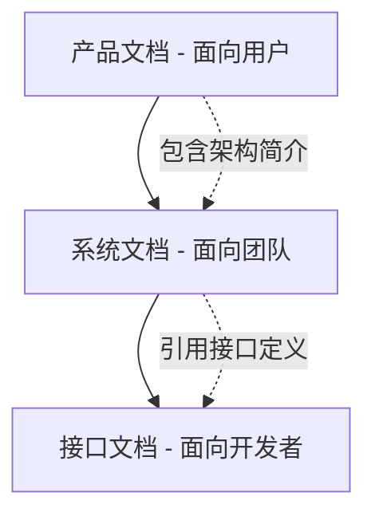

# 项目文档管理体系

## 概述

项目文档是团队协作的核心基础设施，承担版本管理、知识传承和跨角色沟通三大职能。本文系统梳理接口文档、系统文档和产品文档三类核心文档的定义、结构、受众与编写规范，帮助开发者建立完整的文档工程认知。

## 前置知识

- 了解软件开发全生命周期（需求→设计→开发→测试→运维）
- 熟悉 Markdown 基本语法
- 了解 UML 建模语言的基本概念

## 学习目标

- 区分三类项目文档的定位、受众和内容边界
- 掌握接口文档的标准结构与编写规范
- 理解系统文档中架构图、ERD 图、时序图的设计方法
- 能够根据受众选择合适的文档类型和表达深度

---

## 一、文档体系全景



### 三类文档核心差异

| 对比维度 | 接口文档 | 系统文档 | 产品文档 |
|---------|---------|---------|---------|
| 目标受众 | 开发人员、测试人员 | 开发人员、维护人员 | 最终用户 |
| 关注重点 | 系统/组件间交互细节 | 整体系统设计与实现 | 如何使用产品 |
| 内容特点 | 参数规范、代码示例 | 架构图、UML、ERD | 用户手册、帮助文档 |
| 技术深度 | 深入接口细节 | 架构级、技术选型 | 弱化技术，突出操作 |
| 更新频率 | 随接口变化频繁更新 | 系统升级时更新 | 功能迭代时更新 |
| 常用工具 | Swagger / YApi / Apifox | Draw.io / PlantUML | GitBook / Notion / 语雀 |

---

## 二、接口文档

### 2.1 定义与特点

接口文档是**详细描述系统之间或组件之间交互方式**的技术文档，具备三大特点：

- **交互描述**：精确描述系统/组件间的请求与响应方式
- **规范说明**：提供调用方法，明确需要遵循的协议与格式
- **协作支持**：作为前后端、测试团队之间的契约

### 2.2 标准内容结构



### 2.3 编写示例

**用户登录接口**

- 接口描述：用户通过用户名和密码进行登录认证
- 请求路径：`POST /api/v1/auth/login`

请求参数：

| 参数名 | 类型 | 必需 | 说明 |
|--------|------|------|------|
| username | string | 是 | 用户名 |
| password | string | 是 | 密码（加密后） |

成功响应：

```json
{
  "code": 200,
  "message": "登录成功",
  "data": {
    "token": "eyJhbGciOiJIUzI1NiIsInR5cCI6IkpXVCJ9...",
    "userId": "12345"
  }
}
```

失败响应：

```json
{
  "code": 401,
  "message": "用户名或密码错误"
}
```

### 2.4 目标受众

- **前端开发人员**：依据文档调用后端接口
- **后端开发人员**：提供接口规范并维护实现
- **测试人员**：进行接口调试和自动化测试

---

## 三、系统文档

### 3.1 定义与特点

系统文档是对**整个软件系统的详细描述**，包括设计架构、功能模块、性能要求等信息，起**提纲挈领**的指导作用。

核心特点：

- **全面性**：提供对整个系统的全面蓝图
- **技术性**：涵盖架构设计、技术选型、性能指标
- **维护性**：帮助后续团队理解和维护系统

### 3.2 系统架构图

采用**自顶而下**的分层设计思路：



### 3.3 数据库设计图（ERD）

使用实体关系图描述表间关联：



### 3.4 业务流程时序图

UML 时序图是与软件系统关联性最大的图表类型：



### 3.5 目标受众

- **开发人员**：理解系统架构，进行开发实现
- **维护人员**：后续接手项目，进行维护和迭代

---

## 四、产品文档

### 4.1 定义与特点

产品文档是**面向最终用户**的文档，包括用户手册、帮助文档、教程等，解释如何使用软件产品及其功能特性。

核心特点：

- **用户导向**：面向非技术人员
- **易于理解**：解释专业名词，使用通俗语言
- **功能聚焦**：专注操作介绍，弱化技术原理

### 4.2 标准大纲结构



### 4.3 目标受众

- 企业客户
- 个人用户
- 非技术人员

---

## 五、文档关系与层次



三类文档并非孤立存在：产品文档可能包含系统架构简介和接口文档链接；系统文档引用具体的接口定义；接口文档是最底层的技术契约。

---

## 常见问题

| 问题场景 | 问题描述 | 解决方案 |
|---------|---------|---------|
| 文档混淆 | 不知道该写哪种文档 | 先明确受众，再选择文档类型 |
| 接口文档不规范 | 缺少参数说明或返回示例 | 参考标准模板，使用自动化工具生成 |
| 系统文档过于技术化 | 业务人员看不懂 | 添加业务说明，减少技术术语 |
| 产品文档过于专业化 | 用户看不懂技术概念 | 解释专业名词，使用通俗语言 |
| 文档更新不及时 | 代码改了文档没改 | 将文档更新纳入开发流程（CI 卡点） |
| 文档版本混乱 | 不知道哪个是最新版本 | 使用文档管理平台，明确版本号 |

---

## 最佳实践

### 文档编写四原则

1. **明确受众**：根据受众选择技术深度和表达方式
2. **结构清晰**：采用标准的文档结构和目录组织
3. **及时更新**：代码变更时同步更新文档
4. **版本管理**：使用文档管理平台进行版本控制

### 分类实践建议

| 文档类型 | 编写要点 | 推荐工具 |
|---------|---------|---------|
| 接口文档 | 使用工具自动生成，保持与代码同步 | Swagger / YApi / Apifox |
| 系统文档 | 项目初期建立框架，架构变更时更新 | Draw.io / PlantUML / ProcessOn |
| 产品文档 | 以用户视角编写，提供截图和操作示例 | GitBook / Notion / 语雀 |

---

## 延伸阅读

- 《软件文档编写指南》
- 《UML 和模式应用》- Craig Larman
- OpenAPI Specification（接口文档标准）
- UML 2.5 规范（统一建模语言）
- ISO/IEC/IEEE 26514（软件用户文档标准）
