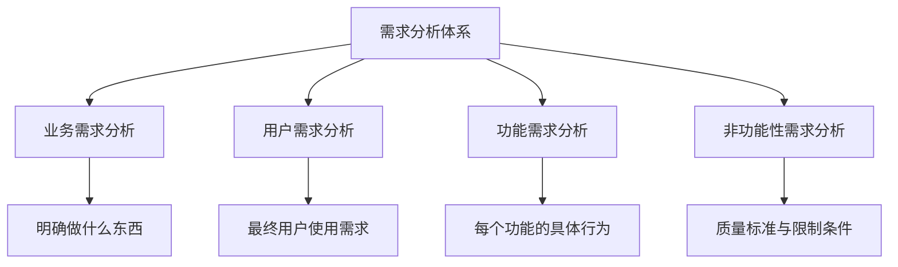
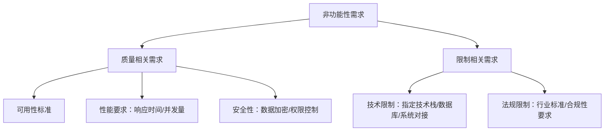
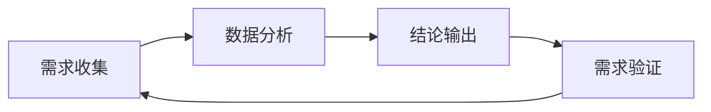
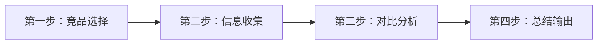
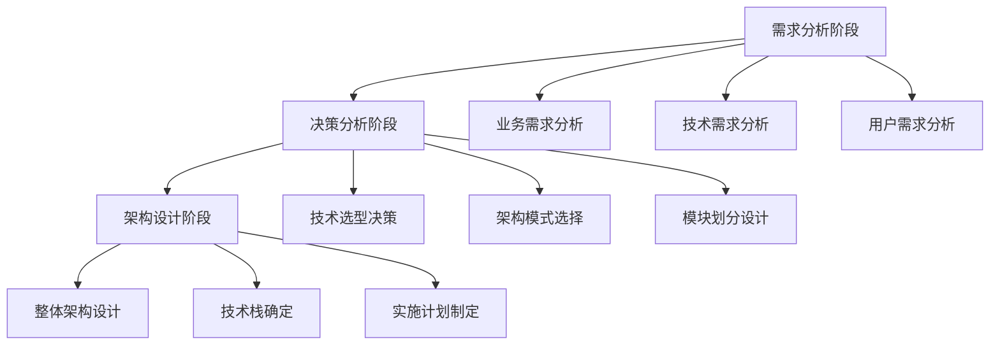
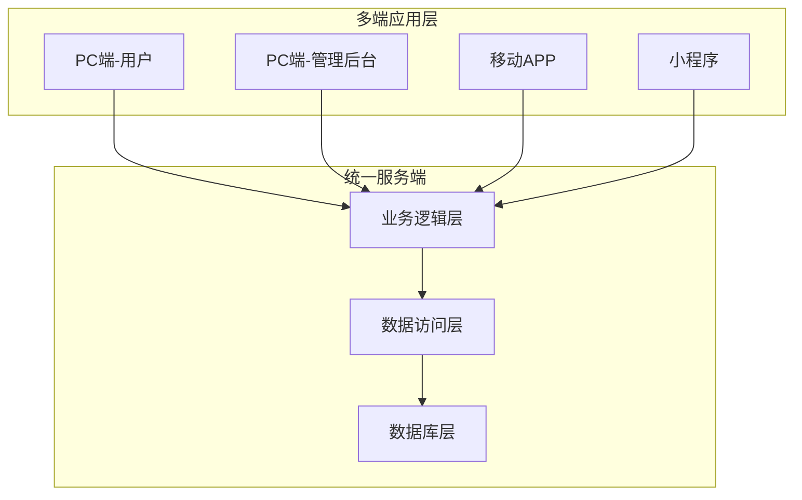
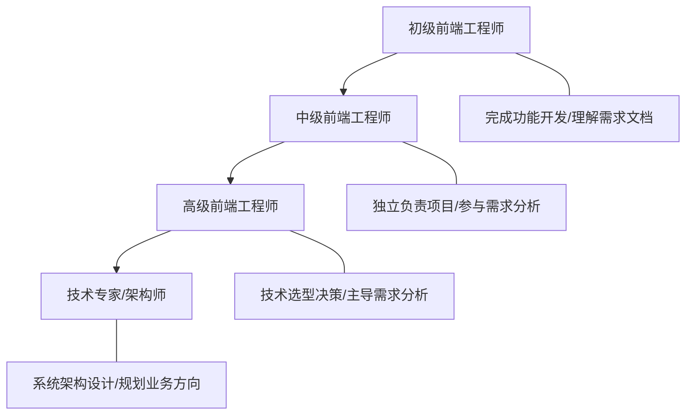

# 需求分析方法论

## 概述

需求分析是项目开发的基石，在完整开发周期中占据超过 30% 的时间。本文系统阐述从需求收集到架构设计转化的完整方法论，涵盖四层需求结构、业务分析三大明确、竞品分析四步法以及市场洞察策略，帮助前端工程师建立从"执行者"到"规划者"的思维跃迁。

## 前置知识

- 了解软件工程基本生命周期（瀑布/敏捷）
- 具备至少一个完整项目的开发经验
- 理解前后端分离架构的基本概念

## 学习目标

- 掌握需求分析四层结构（业务/用户/功能/非功能性）
- 熟练运用业务需求分析三大明确方法
- 掌握竞品分析四步法与工具链
- 理解从需求分析到架构设计的转化路径

---

## 一、需求分析的核心价值

### 1.1 为什么需求分析至关重要

| 维度 | 具体价值 | 说明 |
|------|----------|------|
| 目标定义 | 定义项目的目标和范围 | 明确项目边界，避免范围蔓延 |
| 质量保证 | 保证项目整体质量 | 前期规划减少后期返工 |
| 用户满意度 | 提高用户满意度 | 准确理解用户真实需求 |
| 成本控制 | 避免成本和时间浪费 | 磨刀不误砍柴工 |
| 项目管理 | 方便项目管理 | 形成清晰的文档和流程 |

### 1.2 传统项目 vs 综合性项目

**传统项目流程**：介绍技术栈 → 展示最终效果 → 直接开始开发

存在的问题：
- 缺少业务思考层
- 对业务理解不清晰
- 只学到技术本身，缺乏综合应用能力

**综合性项目流程**：需求分析 → 业务流程梳理 → 架构设计 → 技术选型 → 开发实施

核心价值：
- 建立完整工作流认知
- 掌握系统化的方法论
- 培养综合应用能力，适应不同业务场景

---

## 二、需求分析四层结构

### 2.1 业务需求分析

**定义**：明确"我们要做什么东西"，通常是领导层决策，会有对标系统或明确目标。

### 2.2 用户需求分析

**定义**：针对最终用户（To C）的使用需求分析。

分析维度：
- **便捷性**：操作是否方便
- **合理性**：流程是否符合逻辑
- **闭环性**：是否形成完整业务闭环
- **体验感**：用户满意度如何

### 2.3 功能需求分析

**定义**：详细定义每个功能的具体行为，与开发人员关系最紧密。

包含内容：
- 预期行为描述
- 用户界面设计
- 交互流程定义
- 系统间交互说明

### 2.4 非功能性需求分析

**定义**：与质量标准和限制条件相关的需求。

---

## 三、业务需求分析三大明确

### 3.1 明确一：业务范围与定位

**方法一：与干系人讨论**

| 干系人角色 | 讨论重点 | 获取信息 |
|-----------|---------|---------|
| 项目发起人 | 项目目标、愿景 | 为什么要设计这个项目 |
| 业务主管 | 业务需求、边界 | 业务范围是什么 |
| 用户代表 | 用户需求、痛点 | 用户需要什么功能 |
| 技术负责人 | 技术约束、方案 | 采用什么技术栈 |

**方法二：配合市场研究**

**业务定位模型**：

业务定位 = 满足特定用户需求 + 差异化特点

差异化策略包括：技术差异化、业务差异化、体验差异化。

### 3.2 明确二：业务流程关键点和外部依赖

外部依赖分类：

| 依赖类型 | 示例 |
|---------|------|
| 项目间依赖 | 首页项目 ↔ 接口项目、前端界面 ↔ 管理后台 |
| 服务依赖 | 第三方服务、外部系统、中间件服务 |
| 资源依赖 | 静态资源、第三方库、CDN 资源 |

### 3.3 明确三：业务数据与相关指标

定义数据模型和业务指标，为后续架构设计提供数据支撑。

---

## 四、用户需求与竞品分析

### 4.1 用户需求获取方式

| 渠道类型 | 具体方式 |
|---------|---------|
| 直接沟通 | 用户访谈（面对面深度交流）、用户反馈、用户建议 |
| 间接收集 | 问卷调查（大规模数据）、反馈系统、行为数据分析 |

### 4.2 竞品分析四步法

| 步骤 | 核心内容 |
|------|---------|
| 竞品选择 | 直接竞品（同类产品）、间接竞品（替代方案）、潜在竞品（新兴产品） |
| 信息收集 | 产品体验、用户评价、技术分析 |
| 对比分析 | 功能对比、体验对比、技术对比 |
| 总结输出 | 优势分析、劣势分析、差异化策略 |

### 4.3 竞品分析工具

**国外工具**：

| 工具 | 核心价值 |
|------|---------|
| Crunchbase | 企业信息、融资情况、市场定位 |
| Product Hunt | 新产品发现、用户评价、趋势洞察 |
| Sensor Tower（原 App Annie，2024 年并入） | 移动端应用数据、排名分析 |

**国内工具**：

| 工具 | 核心价值 |
|------|---------|
| 人人都是产品经理 | 需求分析、用户研究、交互设计文章 |
| IT橘子 | 互联网公司信息、融资数据 |
| 猎云网 | 互联网创业创新资讯 |

### 4.4 经典案例：iOS vs Android 设计理念

| 维度 | iOS | Android（早期） |
|------|-----|----------------|
| 核心原则 | 清爽、简便 | 给用户最大自由度 |
| 设计结果 | 用户体验优秀、学习成本低 | 配置项过多、学习成本高 |
| 启示 | 简化用户决策优于给予无限选择 | 自由度过高反而降低体验 |

---

## 五、项目背景与市场分析

### 5.1 三维市场洞察

**维度一：前端侧发展趋势**

PC 端开发 → 小程序开发 → 工程化 + Node.js → 全栈开发需求（当前阶段）

市场特征：从单一技能向综合性能力转变。

**维度二：技术侧深度要求**

| 历史要求 | 现在要求 | 提升方向 |
|----------|----------|----------|
| 框架使用能力 | CLI 工具开发 | 工程化能力 |
| API 调用 | 框架原理理解 | 源码级掌握 |
| 组件开发 | 插件/工具开发 | 创造力培养 |

核心变化：从"会用"到"理解原理"再到"创造工具"。

**维度三：市场环境变化**

- 互联网行业从增量转向存量竞争
- AI 技术浪潮带来岗位重构
- 综合性人才需求未减少，但门槛提高

### 5.2 市场应对策略

1. **正确认识行业**：前端行业并未"凉了"，而是门槛提高了
2. **深度学习主流技术**：新技术保持观望，主流技术深入原理，源码级掌握
3. **动态思维应对变化**：新技术诞生 → 新岗位产生，核心能力以不变应万变

---

## 六、需求分析到架构设计的转化

### 6.1 转化流程

### 6.2 多端一体化架构

---

## 七、能力培养路径

---

## 八、需求分析产出物

| 文档名称 | 核心内容 | 目标读者 |
|---------|---------|---------|
| 项目立项书 | 项目背景、目标、范围 | 项目干系人 |
| 市场分析报告 | 市场调研、竞品分析 | 产品团队 |
| 用户调研报告 | 用户访谈、需求优先级 | 产品、开发团队 |
| 业务定位说明 | 差异化策略、价值主张 | 全体项目成员 |
| 需求规格说明书 | 功能清单、交互流程 | 开发团队 |
| 技术规范文档 | 性能指标、技术约束 | 技术团队 |

---

## 常见问题

| 问题场景 | 问题描述 | 解决方案 |
|---------|---------|---------|
| 需求不清晰 | 领导"一拍脑门"提出需求 | 寻找对标系统，明确目标用户 |
| 需求变更频繁 | 开发中不断修改需求 | 前期做好需求分析，形成文档确认 |
| 缺乏业务理解 | 只关注技术实现 | 参与需求分析全流程，理解业务价值 |
| 忽视非功能需求 | 只关注功能，忽视性能/安全 | 建立需求检查清单，系统化分析 |
| 时间压力 | 认为需求分析浪费时间 | 理解"磨刀不误砍柴工"的价值 |
| 竞品选择困难 | 不知道分析哪些竞品 | 从直接竞品开始，扩展到间接竞品 |

## 最佳实践

1. **建立干系人清单**，系统化开展访谈
2. **多维度收集需求**：工作实践、面试洞察、课程反馈、问卷调查
3. **使用竞品分析框架**，找准差异化空间
4. **标准化需求分析文档模板**，记录分析过程和决策依据
5. **从执行思维转向规划思维**，实践中不断复盘优化

## 延伸阅读

- 《软件需求》- Karl Wiegers
- 《用户故事与敏捷方法》- Mike Cohn
- 《用户体验要素》- Jesse James Garrett
- 《用户故事地图》- Jeff Patton
- 需求管理工具：Jira、Confluence、Notion
- 用户调研工具：问卷星、腾讯问卷、Typeform
- 流程设计工具：Draw.io、ProcessOn、Figma

---

**下一篇**：[03-技术选型实践](03-技术选型实践.md)
