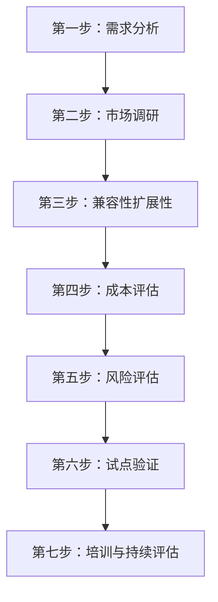
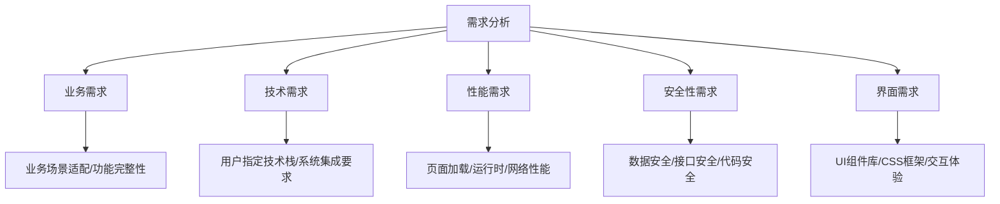
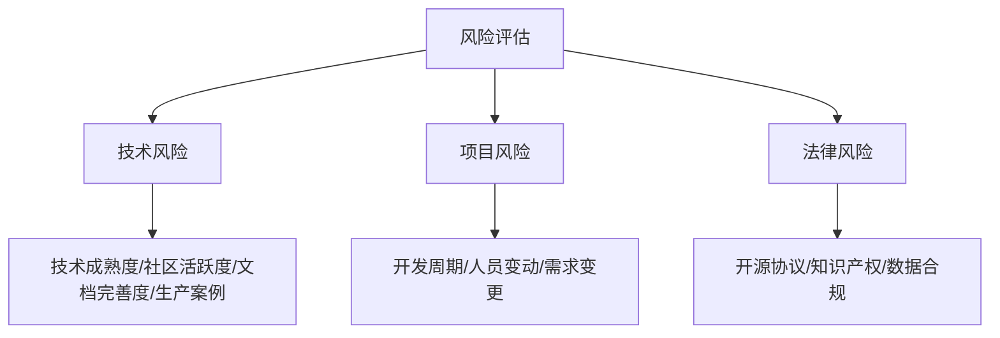

# 技术选型实践

## 概述

技术选型是项目架构设计中最关键的决策环节，其核心目标是**快速论证所选技术方案的可行性**。本文系统介绍技术选型七步法、开源协议深度解析、兼容性评估、成本与风险量化方法，以及决策矩阵评分表的实战应用，帮助工程师做出科学、可追溯的技术决策。

## 前置知识

- 完成 [02-需求分析方法论](02-需求分析方法论.md) 的学习
- 了解主流前端/后端技术栈的基本特点
- 具备开源软件使用经验

## 学习目标

- 掌握技术选型七步闭环流程
- 理解 MIT/Apache/GPL 等开源协议的商用影响
- 能独立完成兼容性、成本、风险评估
- 熟练运用决策矩阵进行量化评分

---

## 一、技术选型核心理念

### 1.1 核心目标

> 快速论证选择的技术方案的可行性

### 1.2 关键验证原则

| 验证维度 | 核心问题 |
|---------|---------|
| 最小闭环验证 | 新技术能否适应业务场景 |
| 可扩展性验证 | 功能点开发是否具备扩展能力 |
| 可配置性验证 | 是否支持灵活配置 |
| 可维护性验证 | 后续维护成本是否可控 |
| 整体契合度验证 | 技术方案能否形成有机整体 |

### 1.3 技术选型分析三大明确

| 明确项 | 目标 |
|--------|------|
| 技术需求、技术选型和非功能性需求 | 选择合适的技术工具 |
| 技术的难点和风险 | 评估技术方案的可行性 |
| 技术规范和标准 | 建立统一的技术规范 |

---

## 二、技术选型七步法



| 步骤 | 核心关注点 | 关键产出 |
|------|-----------|---------|
| 需求分析 | 业务需求、技术需求、性能、安全性 | 需求清单 |
| 市场调研 | 可用技术、未来发展、商用许可 | 技术候选列表 |
| 兼容性扩展性 | 架构兼容、工具兼容、环境兼容 | 兼容性报告 |
| 成本评估 | 学习成本、维护成本、升级成本 | 成本预算表 |
| 风险评估 | 项目影响、开发风险、法律风险 | 风险清单 |
| 试点验证 | 最小闭环、快速验证、灰度测试 | POC 报告 |
| 培训持续评估 | 知识传递、持续监控、闭环优化 | 培训计划 |

---

## 三、第一步：需求分析

### 3.1 多维度需求体系



### 3.2 三大评判维度

**维度一：项目需求与限制**
- 客户明确要求（指定语言/数据库/技术栈/第三方对接）
- 项目本身特点（业务复杂度/性能/安全/可扩展性）
- 维护成本考量（技术栈一致性/团队技能匹配/长期可行性）

**维度二：团队技术与经验**
- 团队技术偏好（偏后端/偏前端/全栈型）
- 团队经验积累（项目经验/技术储备/知识沉淀）
- 学习能力评估（新技术接受度/学习曲线/培训资源）

**维度三：长远规划**
- 维护便利性（代码可读性/文档完善度/调试工具）
- 扩展能力（功能/性能/业务扩展）
- 升级路径（版本升级/技术迁移/架构演进）

---

## 四、第二步：市场调研

### 4.1 开源协议深度解析

| 协议类型 | 商用限制 | 开源要求 | 使用建议 |
|---------|---------|---------|---------|
| MIT | 无限制 | 不要求 | 推荐，企业级产品首选 |
| Apache 2.0 | 无限制 | 不要求 | 推荐，含专利授权 |
| GPL | 强制开源 | 必须开源 | 商用慎用，传染性风险 |

**MIT 协议**：权限最宽松，商用/修改/分发/闭源均无限制，仅需保留版权声明。

**GPL 协议**：具有传染性，引用 GPL 代码的项目必须开源，动态链接库也受影响，商业化产品风险高。

### 4.2 经典案例

**React 协议风波**：React 曾长期采用 BSD+Patents 许可（附加专利终止条款），引发大厂恐慌性迁移（部分公司从 React 切换到 Vue）；2017 年 9 月 Facebook 在社区压力下将 React 16 重新以 MIT 协议发布，沿用至今。

**CentOS vs RedHat**：代码几乎一致，差异化在于技术支持服务——CentOS 免费社区支持，RedHat 收费企业级支持（快速响应 + 补丁服务）。（注：此为历史案例。CentOS Linux 已于 2020 年底宣布转向、2024 年 6 月彻底停止维护，Red Hat 转以 CentOS Stream 滚动发布，社区重建版由 Rocky Linux、AlmaLinux 等延续。）

---

## 五、第三步：兼容性和扩展性

### 5.1 兼容性三维度

| 维度 | 评估内容 |
|------|---------|
| 架构兼容性 | 现有系统架构、技术栈集成、第三方系统对接 |
| 工具兼容性 | 开发工具、构建工具、版本冲突 |
| 环境兼容性 | 技术环境（技术栈）、团队环境（人员背景） |

### 5.2 版本冲突解决策略

| 冲突类型 | 示例 | 解决方案 |
|---------|------|---------|
| Node.js 版本冲突 | 项目A需Node 16，项目B需Node 18 | 多版本管理（nvm）/ 工具升级 |
| 依赖版本冲突 | 依赖A需React 17，依赖B需React 18 | 版本对齐 / 寻找替代 / 升级依赖 |

### 5.3 团队背景适配

| 团队类型 | 技术选型方向 | 框架选择 | 数据库 |
|---------|------------|---------|--------|
| 后端团队为主 | Java/Python/Go | Spring Boot/Django | MySQL/PostgreSQL |
| 前端团队为主 | JavaScript/TypeScript | Node.js/NestJS | MongoDB/MySQL |
| 混合团队 | 根据项目需求灵活选择 | - | - |

---

## 六、第四步：成本评估

### 6.1 成本评估矩阵

| 成本类型 | 低成本 | 中成本 | 高成本 | 评估标准 |
|---------|--------|--------|--------|---------|
| 学习成本 | 团队熟悉 | 需要培训 | 全新学习 | 学习曲线、培训时间 |
| 维护成本 | 生态成熟 | 社区活跃 | 生态薄弱 | 文档、社区、工具 |
| 升级成本 | 向后兼容 | 小幅修改 | 大量重构 | API 稳定性、迁移指南 |

---

## 七、第五步：风险评估

### 7.1 风险评估维度



### 7.2 六大妥协维度

当理想方案不可行时，需要在以下维度做出妥协：

1. **性能妥协**：选择性能够用而非最优的方案
2. **生态妥协**：接受生态不够完善但核心功能满足的方案
3. **学习妥协**：接受团队需要额外学习成本
4. **维护妥协**：接受较高的后期维护投入
5. **兼容妥协**：接受部分兼容性限制
6. **成本妥协**：接受较高的初期投入换取长期收益

---

## 八、第六步：试点验证（POC）

### 8.1 POC 验证要点

| 验证项 | 内容 |
|--------|------|
| 最小闭环 | 核心业务流程能否跑通 |
| 性能验证 | 关键指标是否达标 |
| 集成验证 | 与现有系统能否顺利集成 |
| 灰度测试 | 小范围用户验证 |

### 8.2 POC 报告模板

```
POC 验证报告
├── 验证目标
├── 验证范围
├── 验证环境
├── 验证结果
│   ├── 通过项
│   ├── 问题项
│   └── 风险项
├── 结论与建议
└── 后续计划
```

---

## 九、第七步：培训与持续评估

- 制定团队培训计划，降低学习曲线
- 建立持续监控机制，跟踪技术运行状态
- 定期回顾技术选型决策，形成闭环优化

---

## 十、决策矩阵评分表

### 10.1 评分模板

| 评估维度 | 权重 | 方案A | 方案B | 方案C |
|---------|------|-------|-------|-------|
| 业务匹配度 | 25% | 8 | 7 | 9 |
| 团队熟悉度 | 20% | 9 | 5 | 6 |
| 生态成熟度 | 15% | 8 | 8 | 7 |
| 学习成本 | 15% | 9 | 6 | 5 |
| 维护成本 | 15% | 7 | 8 | 6 |
| 长远发展 | 10% | 8 | 7 | 8 |
| **加权总分** | 100% | **8.20** | **6.75** | **6.95** |

### 10.2 决策原则

- 8 分以上（10 分制，下同）：强烈推荐采用
- 6-7.9 分：建议采用，关注短板
- 4-5.9 分：谨慎考虑，需补充验证
- 4 分以下：不推荐采用

---

## 常见问题

| 问题 | 解决方案 |
|------|---------|
| 客户指定了不合适的技术栈 | 用数据论证风险，提供替代方案对比 |
| 团队抵触新技术 | POC 验证 + 渐进式引入 + 充分培训 |
| 多个方案评分接近 | 增加关键维度权重，或延长 POC 验证周期 |
| 开源协议不确定 | 咨询法务，优先选择 MIT/Apache 协议 |
| 技术更新太快 | 关注 LTS 版本，避免追新 |

## 最佳实践

1. **先验证后推广**：任何新技术必须经过 POC 验证才能进入生产
2. **文档化决策过程**：决策矩阵 + 评分表存档，便于回溯
3. **关注开源协议**：商用项目优先 MIT/Apache，GPL 需法务审核
4. **团队能力匹配**：最好的技术不一定是最合适的技术
5. **预留退路**：选型时考虑回退方案和迁移成本

## 延伸阅读

- 开源协议选择：https://choosealicense.com/
- 《软件架构设计》- 温昱
- 技术雷达：ThoughtWorks Technology Radar

---

**上一篇**：[02-需求分析方法论](02-需求分析方法论.md)  
**下一篇**：[05-架构设计方法论](05-架构设计方法论.md)
