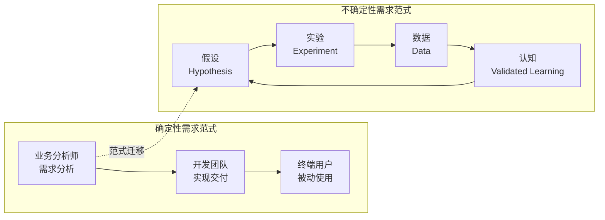
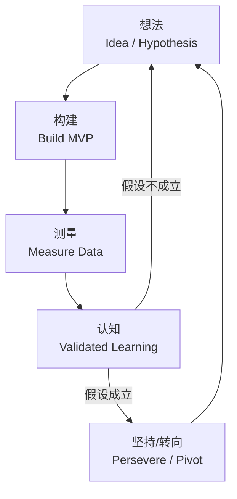
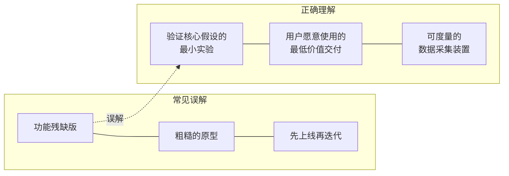
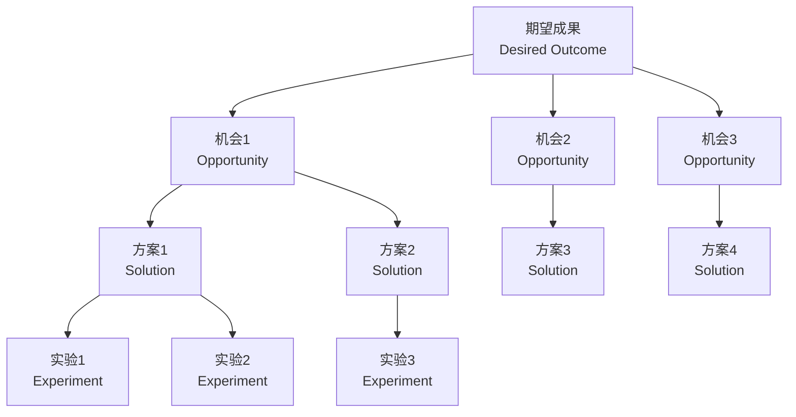
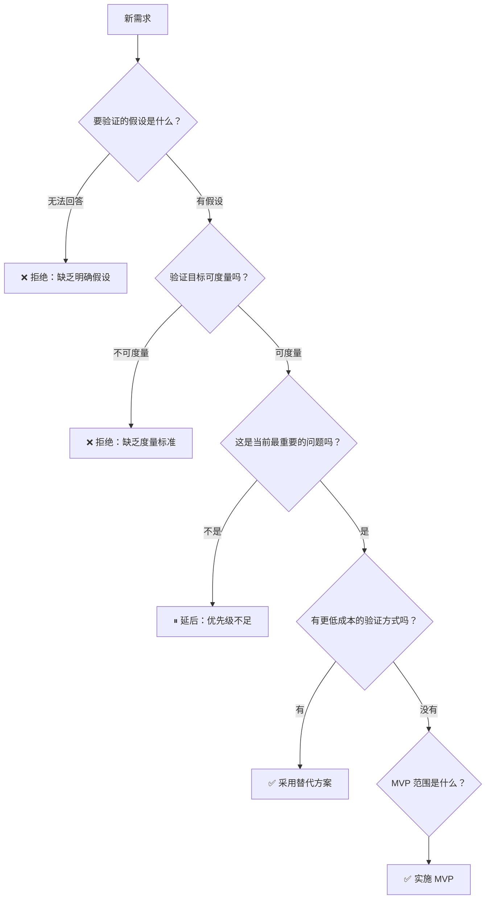
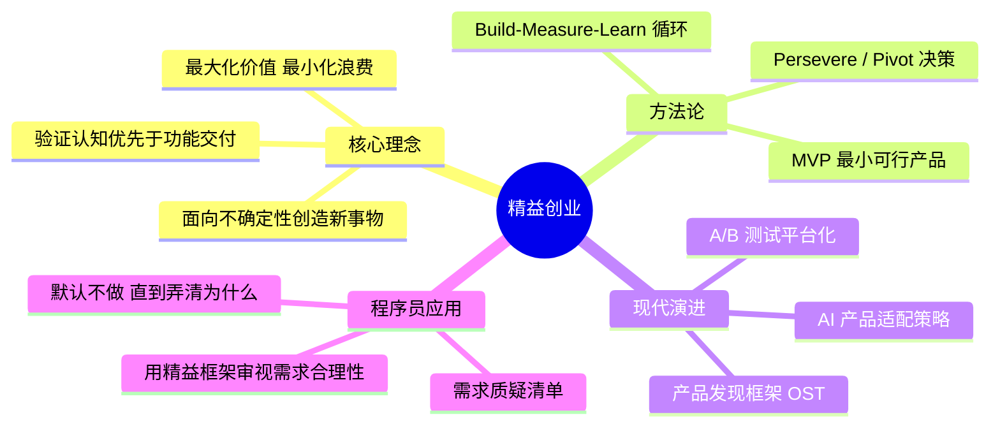
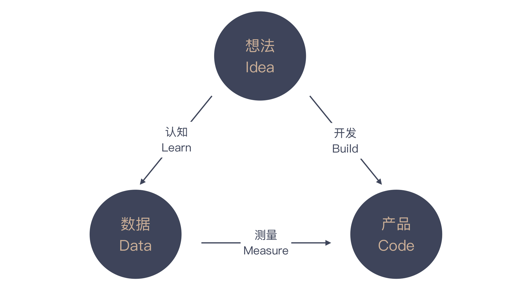

# 精益创业：产品经理不靠谱，你该怎么办

## 核心命题

当软件开发的驱动力从**确定性需求**转向**不确定性需求**时，传统的"需求分析→开发→交付"线性模式失效。面对不确定性，唯一可靠的策略是**低成本试错、快速验证假设**。精益创业（Lean Startup）提供了一套面向不确定性创造新事物的系统方法论，其核心工具——**Build-Measure-Learn 反馈循环**与**MVP（最小可行产品）**——不仅是创业者的武器，更是程序员审视产品需求合理性的思维框架。

---

## 1. 不确定性：现代软件开发的本质特征

### 1.1 需求类型的范式迁移

| 维度 | 确定性需求 | 不确定性需求 |
|------|-----------|-------------|
| 需求来源 | 企业内部明确指定 | 市场假设，待验证 |
| 成功标准 | 功能完整性 | 用户行为验证 |
| 开发策略 | 完整实现 | 最小实验 |
| 失败成本 | 低（需求已确认） | 高（方向可能全错） |
| 典型场景 | 企业 ERP、内部工具 | 消费级应用、创新功能 |

### 1.2 产品经理角色的专业化缺口

原文指出"IT 行业中大多数人的专业程度是不够的"，这一判断在 2024-2026 年依然成立，但有了更精确的行业数据支撑：

- 据 Pragmatic Institute 2024 调研，**仅 34%** 的产品经理接受过系统的产品管理培训
- 产品经理的岗位胜任力模型在行业内尚未形成共识——与软件工程师的"算法+系统设计"面试体系不同，产品经理的能力评估缺乏标准化框架
- 这一缺口导致开发团队必须具备**独立的产品思维**，而非被动接受需求

> **关键认知**：对产品经理提出的需求进行质疑，不是对抗，而是**专业协作**的体现。未经质疑的需求，是对开发资源和用户时间的双重浪费。

---

## 2. 精益创业方法论

### 2.1 理论渊源

精益创业的理论根基来自两个源头：

| 源头 | 核心理念 | 对精益创业的贡献 |
|------|---------|----------------|
| **精益生产（Lean Manufacturing）** | 丰田生产方式（TPS），大野耐一 & 新乡重夫 | 价值与浪费的辩证关系——最大化价值创造，最小化资源浪费 |
| **科学方法论（Scientific Method）** | 假设→实验→观察→结论 | 将产品开发视为实验过程，而非工程实施 |

### 2.2 Build-Measure-Learn 反馈循环

**循环的关键约束**：

1. **循环速度**：完成一个 BML 循环的时间越短，单位时间内获得的验证认知越多
2. **测量质量**：数据必须反映真实用户行为，而非团队主观判断
3. **认知优先**：循环的产出不是代码，而是**经过验证的认知（Validated Learning）**

### 2.3 MVP 的精确理解

MVP（Minimum Viable Product）是精益创业中被误解最深的概念。其精确定义为：

> **MVP 是能够启动 Build-Measure-Learn 循环的、成本最低的产品形态。它不是"功能不完整的版本"，而是"恰好足以验证核心假设的实验装置"。**

**MVP 的类型学**（根据验证目标选择）：

| MVP 类型 | 适用场景 | 实现方式 | 验证目标 |
|----------|---------|---------|---------|
| **Smoke Test（烟雾测试）** | 验证需求是否存在 | 落地页 + 邮件收集 | 用户是否愿意留下联系方式 |
| **Concierge MVP（礼宾式）** | 验证服务流程 | 人工模拟服务 | 用户是否愿意为服务付费 |
| **Wizard of Oz（绿野仙踪）** | 验证自动化价值 | 前端自动化 + 后端人工 | 用户是否接受产品形态 |
| **Piecemeal MVP（拼凑式）** | 验证核心功能 | 组合现有工具/服务 | 核心功能是否解决痛点 |
| **Single-Feature MVP** | 验证单一价值主张 | 仅实现核心功能 | 用户是否因单一功能留存 |

---

## 3. 精益创业的现代演进（2024-2026）

### 3.1 从精益创业到产品发现

精益创业的 BML 循环在产品管理领域已演进为更系统化的**产品发现（Product Discovery）** 框架，以 Teresa Torres 的 **Opportunity Solution Tree（OST）** 为代表：

OST 的核心改进在于：

- **结构化假设**：将模糊的"想法"拆解为"成果→机会→方案→实验"四层结构
- **并行实验**：同一机会下可同时测试多个方案，而非串行试错
- **可追溯决策**：每个决策节点都有对应的实验数据支撑

### 3.2 数据驱动的实验基础设施

现代产品实验已从"上线看效果"进化为**A/B 测试平台化**：

| 平台 | 核心能力 | 适用规模 |
|------|---------|---------|
| **LaunchDarkly** | Feature Flag + 实验 + 渐进式发布 | 中大型团队 |
| **Optimizely** | A/B 测试 + 多变量测试 + 统计引擎 | 产品驱动型团队 |
| **Amplitude Experiment** | 行为分析 + 实验 + 归因 | 数据驱动型团队 |
| **Statsig** | 门控功能 + 实验 + 统计显著性 | 初创至中型团队 |

### 3.3 精益创业与 AI 产品的适配

2024-2025 年 AI 产品爆发后，精益创业面临新的适配挑战：

| 传统精益创业 | AI 产品适配 |
|-------------|-----------|
| MVP 成本低（代码即可） | AI MVP 成本高（模型训练/推理） |
| 用户反馈即时 | 模型效果评估需统计显著性 |
| 功能可用性可直观判断 | AI 输出质量需专业评估 |
| 迭代周期：天-周 | 迭代周期：数据收集-标注-训练-评估 |

**AI 产品的精益验证策略**：

1. **Wizard of Oz MVP**：用人工模拟 AI 能力，验证用户是否愿意为该能力付费
2. **Shadow Mode**：AI 模型在后台运行但不影响用户决策，收集预测 vs 实际数据
3. **Graduated Deployment**：从 1% 流量开始，逐步扩大 AI 决策范围

---

## 4. 程序员的产品思维工具箱

### 4.1 需求质疑清单

当产品经理提出新需求时，程序员应系统性地提出以下问题：

### 4.2 需求决策矩阵

| 问题 | 判断标准 | 行动 |
|------|---------|------|
| 假设是否明确？ | 能用一句话描述"如果 X，则 Y" | 不明确 → 要求产品经理澄清 |
| 是否可度量？ | 存在可量化的成功指标 | 不可度量 → 共同定义指标 |
| 优先级是否最高？ | 与 OKR/北极星指标对齐 | 非最高 → 排入 Backlog |
| 是否有替代方案？ | 非开发手段能否验证 | 有替代 → 先用替代方案 |
| MVP 范围是否最小？ | 仅包含验证假设所需功能 | 范围过大 → 精简至最小 |

---

## 5. 总结

**核心要义**：默认所有需求都不做，直到弄清楚为什么要做这件事。精益创业不是创业者的专属方法论，而是所有面对不确定性工作的人的思维工具。程序员掌握这一框架，便拥有了与产品经理进行**专业对话**的能力——不是对抗，而是共同追求"做正确的事"。

---

> **延伸阅读**
>
> - Eric Ries, *The Lean Startup* (2011): 精益创业奠基之作
> - Teresa Torres, *Continuous Discovery Habits* (2021): 产品发现框架，OST 方法论
> - Melissa Perri, *Escaping the Build Trap* (2018): 如何避免"只管构建不管验证"的陷阱
> - Lean Startup Co. 官方资源: https://leanstartup.co/

---

## 原文存档

> 以下为郑晔原文完整内容，保留作为参考。

## 06 | 精益创业：产品经理不靠谱，你该怎么办？

前面谈到验收标准时，我们说的实际上是确定性需求，也就是说，我们已经知道了这个需求要怎么做，就差把它做出来了。而有时候，我们面对的需求却是不确定的，比如，产品经理有了一个新想法，那我们该如何应对呢？

今天，我们从 IT 行业一个极为经典的话题开始：程序员如何面对产品经理。我先给你讲一件发生在我身边的事。

有一次，我们一大群人在一个大会议室里做一个产品设计评审，来自产品团队和技术团队的很多人都参与到这个评审中。一个产品经理正对着自己的设计稿，给大家讲解一个新的产品特性。

这个公司准备将自己的服务变成了一个云服务，允许第三方厂商申请，这个产品经理给大家讲解的就是第三方厂商自行申报开通服务的流程。听完前面基本情况的介绍，我举手问了几个问题。

> 我：这个服务会有多少人用？
>
> 产品经理：这是给第三方厂商的人用的。
>
> 我：我问的是，这个服务会有多少人用。
>
> 产品经理：每个第三方厂商的申请人都会用。
>
> 我：好，那你有预期会有多少第三方厂商申请呢？
>
> 产品经理：呃，这个……我们没仔细想过。
>
> 我：那现在给第三方厂商开通服务的具体流程是什么。
>
> 产品经理：第三方厂商申请，然后，我们这边开通。
>
> 我：好，这个过程中，现在的难点在哪里？这个审批过程能让我们的工作简化下来吗？
>
> 产品经理：……
>
> 我：那我来告诉你，现在开通第三方厂商服务，最困难的部分是后续开通的部分，有需要配置服务信息的，有需要配置网络信息的。目前，这个部分还没有很好的自动化，前面审批的部分能够自动化，对整个环节优化的影响微乎其微。

我的问题问完了，开发团队的人似乎明白了什么，纷纷表示赞同我的观点。这个审批流程本身的产品设计并不是问题，但我们的时间和资源是有限的，关键在于，要不要在这个时间节点做这个事。准确地说，这是优先级的问题。

此刻，作为开发团队一员的你，或许会有种快感，把产品经理怼回去，简直大快人心。好吧，作为一个正经的专栏，我们并不打算激化产品经理和开发团队的矛盾，而是要探讨如何做事情才是合理的。

之所以我们能很好地回绝了产品经理不恰当的需求，是因为我们问了一些好问题，但更重要的是，我们为什么能问出这些问题。

### 产品经理是个新职业

在做进一步讨论之前，我们必须认清一个可悲的现状， **IT 行业中大多数人的专业程度是不够的。**

IT 行业是一个快速发展的行业，这个行业里有无数的机会，相对于其它行业来说，薪资水平也要高一些，这就驱使大量的人涌入到这个行业。

也因为这是一个快速发展的行业，很多职位都是新近才涌现出来的，比如，在2010年之前很少有专职的前端工程师，之前的工程师往往要前后端通吃。

产品经理便是随着创业浪潮才风起云涌的职位。既然这是个“新”职位，往往是没有什么行业标准可言的。所以，你会看到很多行业乱象：很多人想进入IT行业，一看程序员需要会写代码，觉得门槛高，那就从产品经理开始吧！这些人对产品经理岗位职责的理解是，告诉程序员做什么。

这和郭德纲口中外行人“如何认识相声”是一个道理，以为会说话就能说相声，殊不知，这是个门槛极高的行业。产品经理也一样，没有良好的逻辑性，怎么可能在这个行业中有好的发展。

如果你遇到的产品经理能给出一个自洽的逻辑，那么恭喜你，你遇到了还算不错的产品经理。多说一句，这个行业中专业度不够的程序员也有很多，人数比产品经理还多，道理很简单，因为程序员的数量比产品经理的数量多。

这么说并不是为了黑哪个职位，而是要告诉大家， **我们必须要有自己的独立思考，多问几个为什么，尽可能减少掉到“坑”里之后再求救的次数。**

回到前面的主题，我们该怎么与产品经理交流呢？答案还在这个部分的主题上，以终为始。我们是要做产品，那就需要倒着思考，这个产品会给谁用，在什么场景下怎么用呢？

这个问题在 IT 行业诞生之初并不是一个显学，因为最初的 IT 行业多是为企业服务的。企业开发的一个特点是，有人有特定的需求。在这种情况下，开发团队只要把需求分析清楚就可以动手做了，在这个阶段，团队中的一个关键角色是业务分析师。即便开发出来的软件并不那么好用，企业中强行推动，最终用户也就用了。

后来，面向个人的应用开始出现。在 PC 时代和早期的互联网时代，软件开发还基本围绕着专业用户的需求，大部分软件只要能解决问题，大家还是会想办法用起来的。

但是随着互联网深入人心，软件开始向各个领域蔓延。越来越多的人进入到 IT 行业，不同的人开始在各个方向上进行尝试。这时候， **软件开发的主流由面向确定性问题，逐渐变成了面向不确定性问题。**

IT 行业是这样一个有趣的行业，一旦一个问题变成通用问题，就有人尝试总结各种最佳实践，一旦最佳实践积累多了，就会形成一套新的方法论。敏捷开发的方法论就是如此诞生的，这次也不例外。

### 精益创业

最早成型的面向不确定性创造新事物的方法论是精益创业（Lean Startup），它是 Eric Ries 最早总结出来的。他在很多地方分享他的理念，不断提炼，最终在2011年写成一本同名的书：《精益创业》。

看到精益创业这个名字，大多数人会优先注意到“创业（Startup）”这个词。虽然这个名字里有“创业”二字，但它并不是指导人们创业挣大钱的方法论。正如前面所说， **它要解决的是面向不确定性创造新事物。**

只不过，创业领域是不确定性最强而且又需要创造新事物的一个领域，而只要是面向不确定性在解决问题，精益创业都是一个值得借鉴的方法论。比如，打造一个新的产品。

精益创业里的“精益”（Lean）是另外一个有趣的词。精益这个词来自精益生产，这是由丰田公司的大野耐一和新乡重夫发展出来的一套理论。

这个理论让人们开始理解价值创造与浪费之间的关系。创造价值是每个人都能理解的，但减少浪费却是很多人忽略的。所以，把这几个理念结合起来，精益创业就是在尽可能少浪费的前提下，面向不确定性创造新事物。

那精益创业到底说的是什么呢？其实很简单。我们不是要面向不确定性创造新事物吗？ **既然是不确定的，那你唯一能做的事情就是“试”。**

怎么试呢？试就要有试的方法。精益创业的方法论里，提出“开发（build）-测量（measure）-认知（learn）”这样一个反馈循环。就是说，当你有了一个新的想法（idea）时，就把想法开发成产品（code）投入市场，然后，收集数据（data）获取反馈，看看前面的想法是不是靠谱。

得到的结果无非是两种：好想法继续加强，不靠谱的想法丢掉算了。不管是哪种结果，你都会产生新的想法，再进入到下一个循环里。在这个反馈循环中，你所获得的认知是最重要的，因为它是经过验证的。在精益创业中，这也是一个很重要的概念：经过验证的认知（Validated Learning）。

既然是试，既然是不确定这个想法的有效性，最好的办法就是以最低的成本试，达成同样一个目标，尽可能少做事。精益创业提出一个非常重要的概念，最小可行产品，也就是许多人口中的 MVP（Minimum Viable Product）。简言之，少花钱，多办事。

许多软件团队都会陷入一个非常典型的误区，不管什么需求都想做出来看看，殊不知，把软件完整地做出来是最大的浪费。

### 你为什么要学习精益创业？

或许你会问，我就是一个程序员，也不打算创业，学习精益创业对我来说有什么用呢？答案在于， **精益创业提供给我们的是一个做产品的思考框架，我们能够接触到的大多数产品都可以放在这个框架内思考。**

有了框架结构，我们的生活就简单了，当产品经理要做一个新产品或是产品的一个新特性，我们就可以用精益创业的这几个概念来检验一下产品经理是否想清楚了。

比如，你要做这个产品特性，你要验证的东西是什么呢？他要验证的目标是否有数据可以度量呢？要解决的这个问题是不是当前最重要的事情，是否还有其他更重要的问题呢？

如果上面的问题都得到肯定的答复，那么验证这个目标是否有更简单的解决方案，是不是一定要通过开发一个产品特性来实现呢？

有了这个基础，回到前面的案例中，我对产品经理提的问题，其实就是在确定这件事要不要做。事实上，他们当时是用一个表单工具在收集用户信息，也就是说，这件事有一个可用的替代方案。鉴于当时还有很多其它需求要完成。我建议把这个需求延后考虑。

### 总结时刻

程序员与产品经理的关系是 IT 行业一个经典的话题。许多程序员都会倾向于不问为什么就接受来自产品经理的需求，然后暗自憋气。

实际上，产品经理是一个新兴职业，即便在 IT 这个新兴行业来看，也算是新兴的。因为从前的 IT 行业更多的是面向确定性的问题，所以，需要更多的是分析。只有当面向不确定性工作时，产品经理才成为一个行业普遍存在的职业。所以，在当下，产品经理并不是一个有很好行业标准的职位。

比较早成型的面向不确定创造新事物的方法论是精益创业，它提出了“开发（build）-测量（measure）-认知（learn）”这样一个反馈循环和最小可行产品的概念。

当产品经理让我们做一个新的产品特性时，我们可以从精益创业这个实践上得到启发，向产品经理们问一些问题，帮助我们确定产品经理提出的需求确实是经过严格思考的。

如果今天的内容你只记住一件事，那请记住： **默认所有需求都不做，直到弄清楚为什么要做这件事。**

最后，我想请你回想一下，你和产品经理日常是怎样做交流的呢？

感谢阅读，如果你觉得这篇文章对你有帮助的话，也欢迎把它分享给你的朋友。