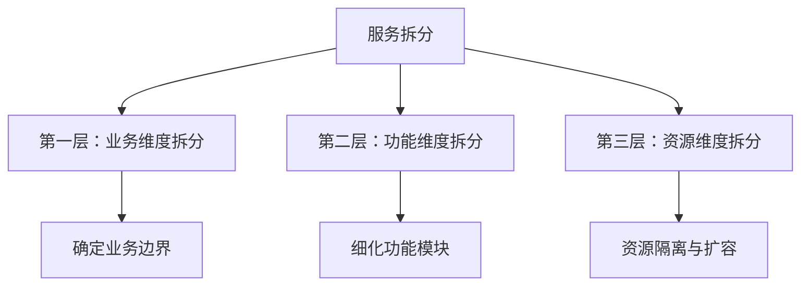
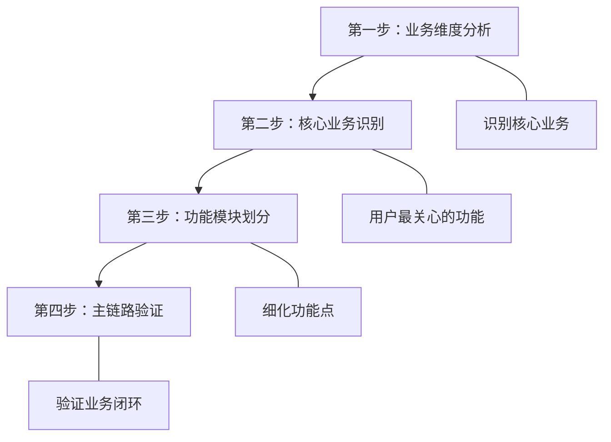

# 架构设计方法论

## 概述

架构设计是将需求分析和技术选型成果转化为可实施系统的关键环节。本文聚焦服务拆分三维度（业务→功能→资源）、主链路确定四步法、P0/P1/P2 优先级体系以及渐进式架构演进路径，提供从宏观规划到落地执行的完整方法论。

## 前置知识

- 完成 [02-需求分析方法论](02-需求分析方法论.md) 和 [03-技术选型实践](03-技术选型实践.md)
- 了解单体架构与微服务架构的基本概念
- 具备模块化开发经验

## 学习目标

- 掌握服务拆分三维度框架（业务/功能/资源）
- 熟练运用主链路确定四步法
- 理解 P0/P1/P2 优先级划分原则
- 掌握渐进式架构演进路径

---

## 一、功能拆分核心原则

### 1.1 关键前置认知

| 原则 | 说明 |
|------|------|
| 提前规划 | 不是边开发边拆分，项目开始前先确定主链路 |
| 主链路优先 | 确定核心业务模块，划分主链路功能，明确业务边界 |
| 优先级明确 | P0 最高优先级、P1 中等、P2 低优先级 |

### 1.2 主链路定义

> 主链路 = 核心业务模块 = 用户最关心的功能链路

主链路核心特征：
- **业务核心性**：用户最关心的功能
- **完整性**：形成完整业务闭环
- **独立性**：可独立运行和测试
- **优先性**：开发优先级最高（P0 级）

---

## 二、服务拆分三大维度

拆分顺序：业务 → 功能 → 资源，层层递进。

---

## 三、第一维度：业务拆分

### 3.1 业务拆分原则

| 原则 | 要求 |
|------|------|
| 业务独立性 | 模块相对独立，可单独开发、部署、更新维护 |
| 业务边界清晰 | 功能职责明确、数据边界清晰、交互接口明确 |
| 业务价值明确 | 核心业务识别、辅助业务识别、优先级确定 |

### 3.2 实战案例：管理后台业务拆分

| 业务模块 | 独立性 | 边界清晰度 | 可单独更新 |
|---------|--------|-----------|-----------|
| 内容管理模块 | 高 | 高 | 是 |
| 消息管理模块 | 高 | 高 | 是 |
| 订单管理模块 | 高 | 高 | 是 |

### 3.3 业务拆分的价值

- **独立部署**：单独更新某个业务模块，降低系统耦合度
- **独立开发**：团队并行开发，技术栈可差异化
- **独立维护**：问题隔离，风险控制，降低维护成本

---

## 四、第二维度：功能拆分

### 4.1 功能拆分原则

| 原则 | 说明 |
|------|------|
| 单一职责 | 每个功能模块职责单一，避免功能重叠 |
| 高内聚低耦合 | 模块内部高度聚合，模块之间松散耦合 |
| 可复用性 | 功能模块可跨业务、跨项目复用 |

### 4.2 实战案例：管理后台功能拆分

| 功能服务 | 职责 | 复用性 |
|---------|------|--------|
| 权限控制服务 | 权限验证、角色管理 | 高（多业务模块共用） |
| 模板服务 | 资源模板、权限模板配置 | 中（特定业务场景） |
| 数据服务 | 缓存服务、统计服务 | 高（多业务模块共用） |

---

## 五、第三维度：资源拆分

### 5.1 资源拆分两大维度

**访问频率维度**：

| 场景类型 | 特征 | 案例 | 策略 |
|---------|------|------|------|
| 高频场景 | 访问频繁、实时性要求高 | 首页、核心业务流程 | 独立部署、高性能配置 |
| 低频场景 | 访问较少、实时性要求低 | 广告管理、安全设置 | 共享资源、降低成本 |

**资源类型维度**：

| 资源类型 | 特征 | 案例 | 策略 |
|---------|------|------|------|
| IO 密集型 | 大量网络/磁盘 IO | 流媒体服务、文件上传下载 | 增加带宽、存储资源 |
| 计算密集型 | 大量 CPU 计算、内存占用 | 数据分析、报表生成 | 增加 CPU、内存资源 |

### 5.2 资源拆分的价值

- **弹性扩容**：按需扩展，独立扩容某个服务
- **性能优化**：针对性优化，资源隔离避免相互影响
- **成本控制**：合理分配，避免资源浪费
- **故障隔离**：单点故障不影响整体

---

## 六、主链路确定四步法

### 6.1 实战案例：商城系统主链路

| 步骤 | 分析内容 | 结论 |
|------|---------|------|
| 业务维度分析 | 电商业务核心 | 商品交易 |
| 核心业务识别 | 用户最关心 | 购买商品 |
| 功能模块划分 | 细化功能点 | 商品展示→商品详情→用户评价→下单支付 |
| 主链路验证 | 形成闭环 | 完整购买闭环 |

### 6.2 主链路验证检查清单

| 验证维度 | 检查项 |
|---------|--------|
| 业务完整性 | 是否形成完整业务闭环？是否覆盖核心场景？ |
| 功能独立性 | 是否可独立运行、测试、部署？ |
| 优先级合理性 | 是否是用户最关心的？是否业务价值最大？ |

---

## 七、功能优先级划分

### 7.1 P0/P1/P2 优先级体系

| 级别 | 定义 | 特征 | 策略 | 案例 |
|------|------|------|------|------|
| P0 | 核心功能（主链路必需） | 用户最关心、影响成败 | 优先开发、充分测试 | 商城的下单支付 |
| P1 | 重要功能（增强体验） | 提升体验、增加价值 | 第二批开发、标准测试 | 商城的评价系统 |
| P2 | 辅助功能（锦上添花） | 提升便利性、可延后 | 后续迭代、快速开发 | 商城的分享功能 |

### 7.2 优先级决策矩阵

| 评估维度 | P0 级 | P1 级 | P2 级 |
|---------|-------|-------|-------|
| 用户需求 | 必需 | 重要 | 锦上添花 |
| 业务价值 | 核心收入 | 增强体验 | 辅助功能 |
| 使用频率 | 高频 | 中频 | 低频 |
| 技术依赖 | 被依赖 | 相对独立 | 完全独立 |
| 开发复杂度 | 中高 | 中等 | 简单 |
| 上线时间 | 第一阶段 | 第二阶段 | 第三阶段 |

---

## 八、服务拆分决策矩阵

### 8.1 评分体系（总分 100 分）

| 评估维度 | 分值 | 细分项 |
|---------|------|--------|
| 业务独立性 | 30 分 | 业务边界清晰度（15）+ 可独立部署性（15） |
| 功能完整性 | 25 分 | 功能闭环性（15）+ 接口明确性（10） |
| 技术可行性 | 25 分 | 技术成熟度（15）+ 团队能力匹配（10） |
| 资源合理性 | 20 分 | 资源隔离价值（10）+ 扩容必要性（10） |

### 8.2 评分标准

| 总分 | 拆分建议 | 说明 |
|------|---------|------|
| 80-100 | 强烈推荐拆分 | 业务独立、价值明显 |
| 60-79 | 建议拆分 | 有一定价值，需评估成本 |
| 40-59 | 谨慎拆分 | 成本较高，需权衡利弊 |
| <40 | 不推荐拆分 | 耦合度高或价值不明显 |

---

## 九、渐进式架构演进

| 阶段 | 特点 | 适用场景 | 目标 |
|------|------|---------|------|
| 单体架构 | 快速开发、简单部署 | 项目初期、团队小 | 快速验证业务 |
| 模块化单体 | 模块划分、接口清晰 | 业务增长、团队扩大 | 降低耦合、提高可维护性 |
| 微服务架构 | 服务拆分、独立部署 | 业务复杂、团队成熟 | 弹性扩展、独立演进 |
| 云原生架构 | 容器化、DevOps | 大规模、高并发 | 自动化、智能化 |

### 架构设计核心原则

| 原则 | 说明 |
|------|------|
| 单一职责 | 每个服务职责单一，功能边界清晰 |
| 高内聚低耦合 | 内部高度聚合，外部松散耦合 |
| 开放封闭 | 对扩展开放，对修改封闭 |
| 依赖倒置 | 依赖抽象而非具体，接口优于实现 |

---

## 常见问题

| 问题场景 | 问题描述 | 解决方案 |
|---------|---------|---------|
| 过度拆分 | 服务拆分过细，维护成本高 | 评估拆分价值，合理拆分 |
| 拆分不足 | 服务耦合度高，难以扩展 | 识别边界，逐步拆分 |
| 主链路不清晰 | 核心业务识别困难 | 用户访谈、业务分析 |
| 优先级混乱 | 所有功能都想优先开发 | 使用优先级矩阵评估 |
| 资源分配不合理 | 高低频场景资源分配不当 | 按访问频率和资源类型拆分 |

## 最佳实践

1. **先主链路后分支**：项目启动时首先确定主链路，P0 功能优先
2. **渐进式拆分**：不要一步到位做微服务，从模块化单体开始
3. **量化评估**：使用决策矩阵评分，避免拍脑袋决策
4. **业务驱动拆分**：业务维度优先于技术维度
5. **预留扩展空间**：接口设计考虑未来扩展，但不过度设计

## 延伸阅读

- 《微服务架构设计模式》- Chris Richardson
- 《领域驱动设计》- Eric Evans
- 《企业应用架构模式》- Martin Fowler
- 《凤凰架构》- 周志明

---

**上一篇**：[03-技术选型实践](03-技术选型实践.md)  
**下一篇**：[09-项目管理与维护](09-项目管理与维护.md)
